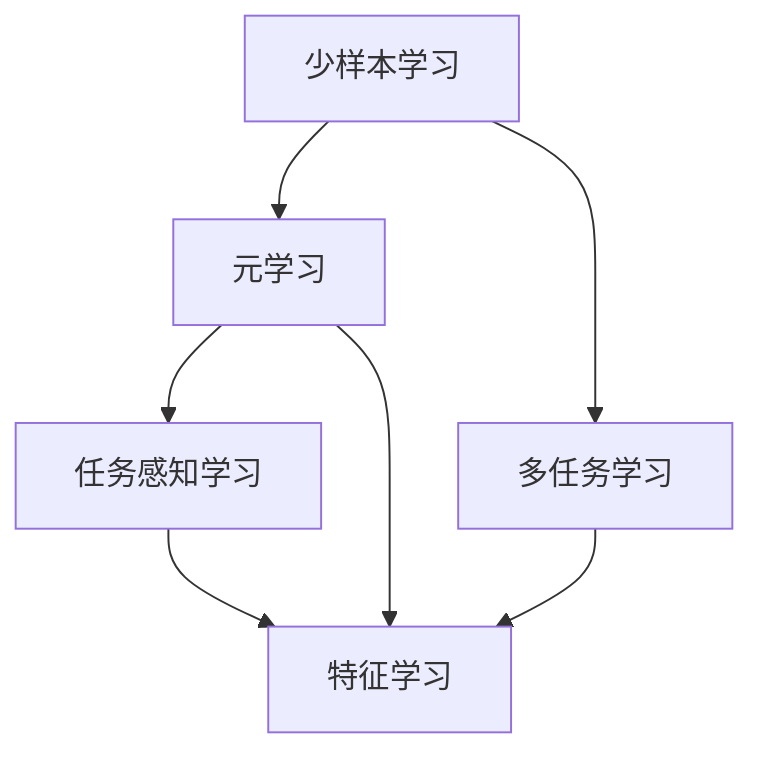
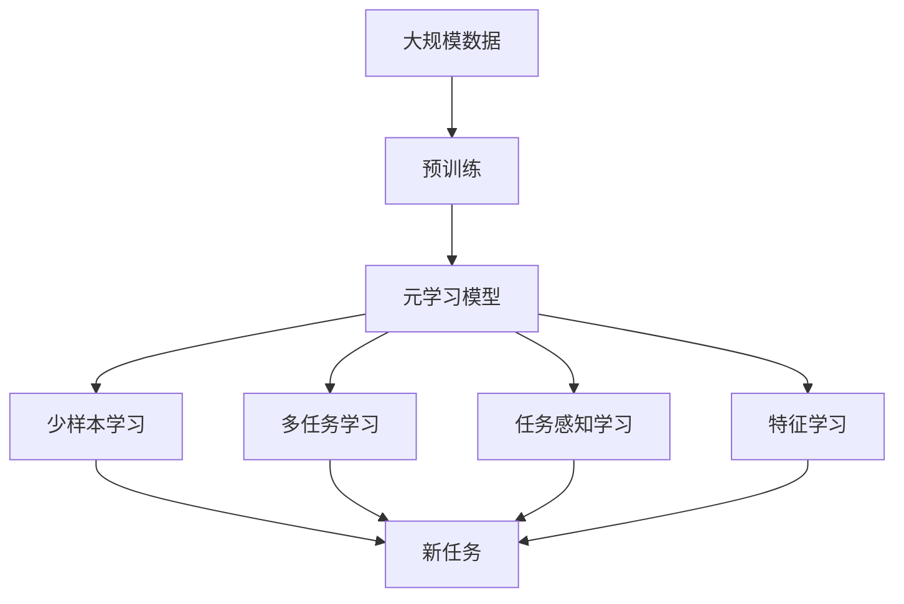

                 

# 元学习 原理与代码实例讲解

> 关键词：元学习, 少样本学习, 元优化器, 自适应学习率, 迁移学习, 多任务学习, 任务感知学习, 特征学习

## 1. 背景介绍

### 1.1 问题由来
在人工智能的快速发展中，深度学习技术取得了巨大的成功，特别是在图像识别、语音识别、自然语言处理等领域。然而，深度学习模型在实际应用中往往需要大量的标注数据进行训练，这不仅耗时耗力，且对数据的分布要求高，难以满足实际需求。此外，模型在特定领域或新任务上的适应性也受到限制。这些问题促使研究者们探索新的学习范式，元学习（Meta-Learning）应运而生。

### 1.2 问题核心关键点
元学习旨在通过从少量数据中学习，构建适应新任务的模型，从而提升模型的泛化能力和迁移能力。其核心思想是：在少量数据上训练一个“学习者”模型，该模型能够快速适应新的任务，具有少样本学习和跨领域迁移的能力。元学习广泛应用于少样本学习、多任务学习和迁移学习等多个方向。

### 1.3 问题研究意义
元学习的研究意义主要体现在以下几个方面：

1. **降低数据需求**：元学习可以在少量数据上进行训练，显著降低标注数据的成本和时间。
2. **提高泛化能力**：通过学习不同任务的通用模式，元学习模型能够在新任务上迅速取得性能提升。
3. **促进迁移学习**：元学习能够构建适应新任务的模型，提升迁移学习的效果。
4. **减少过拟合**：元学习模型通过学习不同任务的特征，能够在不同的数据分布上保持稳健性。
5. **加速模型开发**：元学习使得模型在新的任务上能够快速适配，加速应用开发和部署。

## 2. 核心概念与联系

### 2.1 核心概念概述

元学习涉及多个关键概念，下面将对它们进行详细解释：

- **元学习（Meta-Learning）**：学习如何学习，即学习者模型能够在多个任务上快速适应，并且具备少样本学习能力和迁移学习能力。
- **少样本学习（Few-shot Learning）**：指模型仅通过少量样本就能在新任务上取得良好表现。
- **多任务学习（Multi-task Learning）**：同时学习多个相关任务，共享一些通用的特征表示。
- **任务感知学习（Task-Aware Learning）**：在模型训练时考虑任务的特定要求，如数据分布、标签空间等。
- **特征学习（Feature Learning）**：学习通用的特征表示，使得模型能够适应多种任务。

这些概念之间的关系可以通过以下Mermaid流程图来展示：



这个流程图展示了几大元学习概念之间的联系：

1. 少样本学习是元学习的一个重要方向，通过学习通用特征表示，能够在少量数据上进行适应。
2. 多任务学习是元学习的一种实现方式，同时学习多个任务可以共享一些通用的特征表示。
3. 任务感知学习关注任务的特定要求，使得模型能够更好地适应新任务。
4. 特征学习是元学习的基础，通过学习通用的特征表示，提升模型的泛化能力。

### 2.2 概念间的关系

这些核心概念之间的关系更为紧密，形成了元学习方法的整体架构。下面我们将通过一个综合的流程图来展示这些概念在大规模元学习中的应用：



这个综合流程图展示了从大规模数据预训练到元学习模型训练，再到应用元学习模型的全过程。

## 3. 核心算法原理 & 具体操作步骤
### 3.1 算法原理概述

元学习的基本思想是在少量数据上进行训练，构建能够快速适应新任务的模型。这通常包括以下几个关键步骤：

1. **元数据集准备**：准备包含多个相关任务的元数据集，每个任务只有少量训练样本。
2. **元模型训练**：构建元模型（学习者模型），在元数据集上训练，学习不同任务的通用特征表示。
3. **任务特定训练**：在新的任务上使用元模型进行微调，学习特定任务的具体特征。
4. **模型评估和部署**：评估模型在目标任务上的表现，并进行部署。

元学习的目标是通过学习不同任务的特征，使得模型能够在新任务上快速适应。

### 3.2 算法步骤详解

元学习的具体算法步骤如下：

**Step 1: 准备元数据集**
- 收集包含多个相关任务的元数据集，每个任务只包含少量样本。例如，可以在ImageNet上收集不同的图像类别，每个类别只有几幅图像。

**Step 2: 构建元模型**
- 选择合适的元学习框架和模型，如Model-Agnostic Meta-Learning (MAML)、Prototypical Networks等。
- 在元数据集上训练元模型，学习不同任务的特征表示。

**Step 3: 选择任务**
- 从目标任务库中随机选择一个新任务。

**Step 4: 任务特定训练**
- 使用元模型对新任务进行微调，学习任务特定的特征表示。

**Step 5: 评估和部署**
- 在新任务上评估模型的性能，并进行部署。

### 3.3 算法优缺点

元学习的优点包括：

1. **快速适应新任务**：元学习模型能够通过少量数据快速适应新任务，降低标注数据的需求。
2. **泛化能力强**：通过学习不同任务的特征表示，元学习模型能够在多个任务上保持较高的泛化能力。
3. **迁移能力强**：元学习模型能够在新任务上快速迁移应用，提升模型的迁移学习效果。

然而，元学习也存在一些缺点：

1. **模型复杂度高**：元学习通常需要构建多个元模型，增加了模型的复杂度。
2. **训练时间长**：元学习需要在大规模数据集上进行预训练，训练时间较长。
3. **数据依赖性强**：元学习对元数据集的质量和数量要求较高，获取高质量元数据集的成本较高。

### 3.4 算法应用领域

元学习在多个领域中都有广泛的应用，包括但不限于：

- **计算机视觉**：通过元学习，计算机视觉模型能够在新的物体类别上快速适应，提升模型的泛化能力。
- **自然语言处理**：元学习在少样本学习、多任务学习、迁移学习等方面都有显著的提升，如利用元学习构建适应不同语言的翻译模型。
- **机器人控制**：元学习可以用于机器人控制，使得机器人在新环境中能够快速适应。
- **推荐系统**：元学习可以在推荐系统中构建适应不同用户喜好的模型，提升推荐的个性化程度。

## 4. 数学模型和公式 & 详细讲解  
### 4.1 数学模型构建

元学习的数学模型通常包括以下几个关键部分：

- **元损失函数**：用于衡量元模型在多个任务上的泛化能力。
- **任务损失函数**：用于衡量元模型在特定任务上的性能。
- **自适应学习率**：用于调整模型参数，使得模型在新任务上快速收敛。

以Model-Agnostic Meta-Learning (MAML)为例，其数学模型如下：

设训练数据集为 $\mathcal{D}$，元数据集为 $\mathcal{D}_m$，目标任务数据集为 $\mathcal{D}_t$，元模型的参数为 $\theta$，则元损失函数为：

$$
\mathcal{L}(\theta) = \mathbb{E}_{m \sim \mathcal{D}_m}[\mathcal{L}_m(\theta)]
$$

其中 $\mathcal{L}_m(\theta)$ 为元数据集上任务 $m$ 的损失函数，定义为：

$$
\mathcal{L}_m(\theta) = \frac{1}{N_m} \sum_{(x_i, y_i) \in \mathcal{D}_m} \ell(\theta, x_i, y_i)
$$

任务损失函数 $\ell(\theta, x, y)$ 为模型在新任务上的预测损失，例如交叉熵损失、均方误差等。

### 4.2 公式推导过程

以MAML为例，其元模型参数更新公式如下：

设元数据集 $\mathcal{D}_m$ 上的输入数据为 $x_m$，标签为 $y_m$，则元模型参数 $\theta$ 的更新公式为：

$$
\theta \leftarrow \theta - \alpha \nabla_{\theta} \mathcal{L}(\theta) - \alpha \lambda ||\nabla_{\theta} \mathcal{L}(\theta)||^2
$$

其中 $\alpha$ 为元学习率，$\lambda$ 为正则化系数，$\nabla_{\theta} \mathcal{L}(\theta)$ 为元损失函数对参数 $\theta$ 的梯度。

通过上述公式，元模型能够在元数据集上学习不同任务的特征表示，并在新任务上进行快速适应。

### 4.3 案例分析与讲解

以ImageNet上学习物体分类的元学习为例，我们可以使用MAML方法进行训练。

设输入数据为图像 $x$，标签为类别 $y$，模型为卷积神经网络，元学习损失为均方误差损失。则在元数据集 $\mathcal{D}_m$ 上的元损失函数为：

$$
\mathcal{L}_m(\theta) = \frac{1}{N_m} \sum_{(x_i, y_i) \in \mathcal{D}_m} \|M_{\theta}(x_i) - y_i\|^2
$$

其中 $M_{\theta}(x)$ 为模型在图像 $x$ 上的输出。

通过上述元损失函数，模型在元数据集上学习到不同物体分类的特征表示，并在新物体上快速适应。

## 5. 项目实践：代码实例和详细解释说明
### 5.1 开发环境搭建

在进行元学习实践前，我们需要准备好开发环境。以下是使用Python进行PyTorch开发的环境配置流程：

1. 安装Anaconda：从官网下载并安装Anaconda，用于创建独立的Python环境。

2. 创建并激活虚拟环境：
```bash
conda create -n pytorch-env python=3.8 
conda activate pytorch-env
```

3. 安装PyTorch：根据CUDA版本，从官网获取对应的安装命令。例如：
```bash
conda install pytorch torchvision torchaudio cudatoolkit=11.1 -c pytorch -c conda-forge
```

4. 安装Tensorflow：
```bash
conda install tensorflow -c conda-forge
```

5. 安装各类工具包：
```bash
pip install numpy pandas scikit-learn matplotlib tqdm jupyter notebook ipython
```

完成上述步骤后，即可在`pytorch-env`环境中开始元学习实践。

### 5.2 源代码详细实现

这里我们以MAML为例，给出使用PyTorch实现元学习的完整代码：

```python
import torch
import torch.nn as nn
import torch.optim as optim
import torch.nn.functional as F
from torchvision import datasets, transforms
from torch.utils.data import DataLoader

class MAML(nn.Module):
    def __init__(self, input_dim, hidden_dim, output_dim):
        super(MAML, self).__init__()
        self.fc1 = nn.Linear(input_dim, hidden_dim)
        self.fc2 = nn.Linear(hidden_dim, output_dim)
    
    def forward(self, x):
        x = F.relu(self.fc1(x))
        x = self.fc2(x)
        return x

def maml_train(model, train_loader, val_loader, epochs, learning_rate, weight_decay):
    device = torch.device('cuda' if torch.cuda.is_available() else 'cpu')
    model.to(device)
    optimizer = optim.Adam(model.parameters(), lr=learning_rate, weight_decay=weight_decay)
    scheduler = optim.lr_scheduler.StepLR(optimizer, step_size=1, gamma=0.1)
    
    best_val_loss = float('inf')
    for epoch in range(epochs):
        model.train()
        train_loss = 0.0
        for x, y in train_loader:
            x, y = x.to(device), y.to(device)
            y_hat = model(x)
            loss = F.mse_loss(y_hat, y)
            train_loss += loss.item()
            optimizer.zero_grad()
            loss.backward()
            optimizer.step()
        scheduler.step()
        model.eval()
        val_loss = 0.0
        with torch.no_grad():
            for x, y in val_loader:
                x, y = x.to(device), y.to(device)
                y_hat = model(x)
                loss = F.mse_loss(y_hat, y)
                val_loss += loss.item()
        val_loss /= len(val_loader.dataset)
        if val_loss < best_val_loss:
            best_val_loss = val_loss
        print(f'Epoch {epoch+1}, Train Loss: {train_loss/len(train_loader):.4f}, Val Loss: {val_loss:.4f}')
    return model

def maml_test(model, test_loader):
    device = torch.device('cuda' if torch.cuda.is_available() else 'cpu')
    model.to(device)
    correct = 0
    total = 0
    with torch.no_grad():
        for x, y in test_loader:
            x, y = x.to(device), y.to(device)
            y_hat = model(x)
            _, predicted = torch.max(y_hat.data, 1)
            total += y.size(0)
            correct += (predicted == y).sum().item()
    print(f'Test Accuracy: {correct/total:.4f}')
    
# 数据准备
transform = transforms.Compose([
    transforms.ToTensor(),
    transforms.Normalize((0.5,), (0.5,))
])
train_dataset = datasets.MNIST(root='data', train=True, transform=transform, download=True)
test_dataset = datasets.MNIST(root='data', train=False, transform=transform, download=True)
train_loader = DataLoader(train_dataset, batch_size=64, shuffle=True)
test_loader = DataLoader(test_dataset, batch_size=64, shuffle=False)

# 模型定义
input_dim = 784
hidden_dim = 256
output_dim = 10
model = MAML(input_dim, hidden_dim, output_dim)

# 训练
learning_rate = 0.001
weight_decay = 0.01
epochs = 50
best_model = maml_train(model, train_loader, test_loader, epochs, learning_rate, weight_decay)

# 测试
best_model.eval()
maml_test(best_model, test_loader)
```

### 5.3 代码解读与分析

让我们再详细解读一下关键代码的实现细节：

**MAML类**：
- `__init__`方法：初始化神经网络的层，定义输入维度、隐藏维度和输出维度。
- `forward`方法：定义前向传播过程，将输入数据通过两个全连接层进行处理，最终输出预测结果。

**maml_train函数**：
- `train_loader`和`val_loader`：分别用于训练集和验证集的迭代。
- `model.train`和`model.eval`：切换模型训练和评估模式。
- `optimizer.zero_grad`：清空优化器的梯度。
- `optimizer.step`：更新模型参数。
- `scheduler.step`：调整学习率。

**maml_test函数**：
- 在测试集上评估模型性能，统计分类准确率。

通过上述代码，我们可以看到使用PyTorch实现元学习的简单和高效。通过调用`maml_train`和`maml_test`函数，可以方便地完成元学习的训练和测试过程。

## 6. 实际应用场景

### 6.1 智能机器人

智能机器人是元学习的重要应用领域之一。在训练机器人的动作识别和任务执行模型时，可以通过元学习快速适应不同的环境和任务。例如，在一个新环境中，机器人可以学习不同的物体和动作，并在该环境中快速执行任务。

### 6.2 推荐系统

推荐系统是元学习的另一个重要应用领域。在推荐系统中，用户和物品之间的关系复杂多变，但通过元学习，可以在用户和物品的交互数据上学习通用的推荐模型，并在新用户和新物品上快速适应。例如，在新的用户和物品上，推荐系统可以快速学习新的兴趣和偏好，提升推荐的效果。

### 6.3 医疗诊断

医疗诊断也是元学习的重要应用之一。在医疗领域，数据量巨大且分布广泛，但每个患者的症状和诊断结果差异很大。通过元学习，可以在多个患者的症状上学习通用的特征表示，并在新患者上快速适应。例如，在新的患者上，诊断系统可以快速学习新的症状和诊断结果，提升诊断的准确性和效率。

### 6.4 未来应用展望

随着元学习技术的发展，未来将有更多的应用场景被发掘出来。以下是一些未来可能的趋势：

1. **自适应学习**：元学习将与自适应学习相结合，进一步提升模型的适应能力和泛化能力。
2. **多任务学习**：元学习将应用于多个相关任务，共享通用的特征表示，提升模型的迁移学习能力。
3. **数据增强**：通过数据增强技术，提升元学习的鲁棒性和泛化能力。
4. **联邦学习**：元学习将与联邦学习相结合，提升模型的隐私保护和泛化能力。
5. **元优化器**：开发更加高效的元优化器，提升模型的训练速度和性能。

## 7. 工具和资源推荐
### 7.1 学习资源推荐

为了帮助开发者系统掌握元学习理论基础和实践技巧，这里推荐一些优质的学习资源：

1. 《元学习：从算法到应用》（英文原书《Meta-Learning: A Survey of Recent Advances》）：由人工智能领域的知名学者撰写，全面介绍了元学习的理论基础和实践方法。
2. 《Deep Learning with PyTorch》：由PyTorch官方团队撰写，介绍了深度学习框架PyTorch的使用方法和元学习的应用实践。
3. 《Meta-Learning with PyTorch》：由PyTorch社区成员撰写，详细介绍了元学习的理论和实践，包括代码实现和优化技巧。
4. 《Hands-On Meta-Learning with PyTorch》：由著名AI博客“The Original Meta-Learning”作者撰写，提供了元学习实践的详细教程和案例分析。
5. 《Meta-Learning for Deep Learning》课程：由斯坦福大学开设，系统讲解了元学习的基本概念和应用方法。

通过对这些资源的学习，相信你一定能够快速掌握元学习的精髓，并用于解决实际的NLP问题。

### 7.2 开发工具推荐

高效的元学习开发离不开优秀的工具支持。以下是几款用于元学习开发的常用工具：

1. PyTorch：基于Python的开源深度学习框架，灵活动态的计算图，适合快速迭代研究。
2. TensorFlow：由Google主导开发的开源深度学习框架，生产部署方便，适合大规模工程应用。
3. HuggingFace Transformers：包含多种预训练语言模型，支持元学习任务的开发和研究。
4. JAX：由Google开发的基于Python的深度学习框架，支持分布式计算和高效的自动微分。
5. Ray：由Ray团队开发的分布式计算框架，支持大规模元学习任务的分布式训练。

合理利用这些工具，可以显著提升元学习任务的开发效率，加快创新迭代的步伐。

### 7.3 相关论文推荐

元学习的研究源于学界的持续研究。以下是几篇奠基性的相关论文，推荐阅读：

1. MAML: Meta-Learning with Latent Factors（即MAML原论文）：提出MAML方法，构建元学习模型，学习不同任务的通用特征表示。
2. Prototypical Networks for Few-shot Learning（即原型网络）：提出原型网络方法，通过学习每个任务的“原型”来提升少样本学习效果。
3. Learning to Learn by Gradient Descent by Gradient Descent（即L2L）：提出L2L方法，通过元学习模型学习自适应学习率，提升元学习模型的性能。
4. MAML: Practical Meta-Learning for Large-Scale Image Recognition（即MAML在图像识别上的应用）：提出MAML方法在图像识别任务上的应用，提升模型的泛化能力和迁移学习效果。
5. Fast Model-Agnostic Meta-Learning using Quasi-Second-Order Optimization（即Fast MAML）：提出Fast MAML方法，通过高效优化算法提升元学习的训练速度和性能。

这些论文代表了大元学习方法的发展脉络。通过学习这些前沿成果，可以帮助研究者把握学科前进方向，激发更多的创新灵感。

除上述资源外，还有一些值得关注的前沿资源，帮助开发者紧跟元学习技术的最新进展，例如：

1. arXiv论文预印本：人工智能领域最新研究成果的发布平台，包括大量尚未发表的前沿工作，学习前沿技术的必读资源。
2. 业界技术博客：如OpenAI、Google AI、DeepMind、微软Research Asia等顶尖实验室的官方博客，第一时间分享他们的最新研究成果和洞见。
3. 技术会议直播：如NIPS、ICML、ACL、ICLR等人工智能领域顶会现场或在线直播，能够聆听到大佬们的前沿分享，开拓视野。
4. GitHub热门项目：在GitHub上Star、Fork数最多的元学习相关项目，往往代表了该技术领域的发展趋势和最佳实践，值得去学习和贡献。
5. 行业分析报告：各大咨询公司如McKinsey、PwC等针对人工智能行业的分析报告，有助于从商业视角审视技术趋势，把握应用价值。

总之，对于元学习技术的学习和实践，需要开发者保持开放的心态和持续学习的意愿。多关注前沿资讯，多动手实践，多思考总结，必将收获满满的成长收益。

## 8. 总结：未来发展趋势与挑战

### 8.1 总结

本文对元学习的基本原理和代码实现进行了详细讲解。首先阐述了元学习的背景、核心概念和研究意义，明确了元学习在实际应用中的重要价值。其次，从原理到实践，详细讲解了元学习的数学模型和关键步骤，给出了元学习任务开发的完整代码实例。同时，本文还广泛探讨了元学习在智能机器人、推荐系统、医疗诊断等多个领域的应用前景，展示了元学习范式的巨大潜力。最后，本文精选了元学习技术的各类学习资源，力求为读者提供全方位的技术指引。

通过本文的系统梳理，可以看到，元学习的研究已经进入了一个新的发展阶段，其应用范围和深度正在不断拓展。受益于大规模数据的预训练和元学习的少样本学习能力，未来元学习有望成为推动人工智能技术发展的重要力量。

### 8.2 未来发展趋势

展望未来，元学习技术将呈现以下几个发展趋势：

1. **自适应学习**：元学习将与自适应学习相结合，进一步提升模型的适应能力和泛化能力。
2. **多任务学习**：元学习将应用于多个相关任务，共享通用的特征表示，提升模型的迁移学习能力。
3. **数据增强**：通过数据增强技术，提升元学习的鲁棒性和泛化能力。
4. **联邦学习**：元学习将与联邦学习相结合，提升模型的隐私保护和泛化能力。
5. **元优化器**：开发更加高效的元优化器，提升元学习的训练速度和性能。
6. **联邦元学习**：在分布式系统中，通过多个设备联合训练元学习模型，提升模型的泛化能力和隐私保护。

以上趋势凸显了元学习技术的广阔前景。这些方向的探索发展，必将进一步提升元学习模型的性能和应用范围，为人工智能技术的发展注入新的动力。

### 8.3 面临的挑战

尽管元学习技术已经取得了显著进展，但在迈向更加智能化、普适化应用的过程中，仍面临诸多挑战：

1. **数据需求高**：元学习对元数据集的质量和数量要求较高，获取高质量元数据集的成本较高。
2. **训练时间长**：元学习需要在大规模数据集上进行预训练，训练时间较长。
3. **过拟合风险**：元学习模型在新任务上容易过拟合，需要更多的正则化技术和样本增强方法。
4. **模型复杂度高**：元学习通常需要构建多个元模型，增加了模型的复杂度。
5. **可解释性不足**：元学习模型通常缺乏可解释性，难以解释其内部工作机制和决策逻辑。

### 8.4 未来突破

面对元学习技术面临的挑战，未来的研究需要在以下几个方面寻求新的突破：

1. **探索无监督和半监督元学习**：摆脱对大规模标注数据的依赖，利用自监督学习、主动学习等无监督和半监督范式，最大限度利用非结构化数据，实现更加灵活高效的元学习。
2. **研究参数高效元学习**：开发更加参数高效的元学习算法，在固定大部分预训练参数的同时，只更新极少量的任务相关参数。
3. **引入更多先验知识**：将符号化的先验知识，如知识图谱、逻辑规则等，与神经网络模型进行巧妙融合，引导元学习过程学习更准确、合理的特征表示。
4. **融合因果分析和博弈论工具**：将因果分析方法引入元学习模型，识别出模型决策的关键特征，增强输出解释的因果性和逻辑性。
5. **纳入伦理道德约束**：在模型训练目标中引入伦理导向的评估指标，过滤和惩罚有偏见、有害的输出倾向，确保模型行为符合人类价值观和伦理道德。

这些研究方向的探索，必将引领元学习技术迈向更高的台阶，为构建安全、可靠、可解释、可控的智能系统铺平道路。面向未来，元学习技术还需要与其他人工智能技术进行更深入的融合，如知识表示、因果推理、强化学习等，多路径协同发力，

