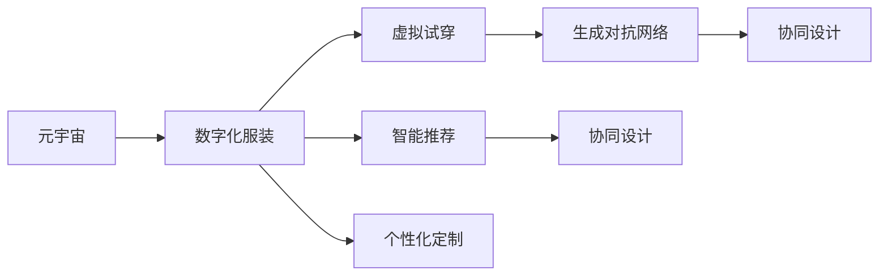
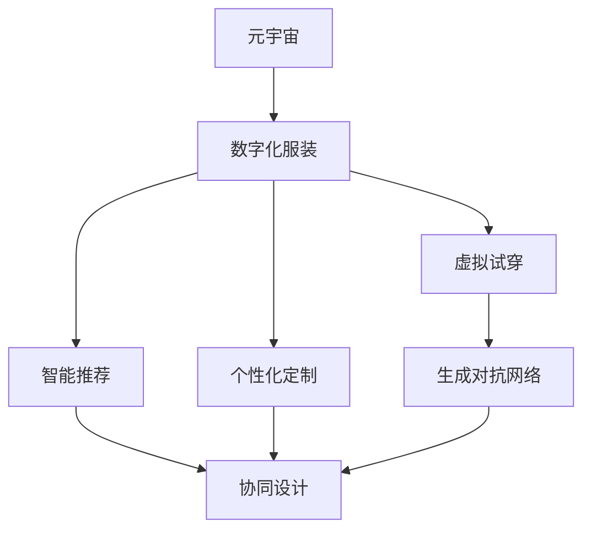
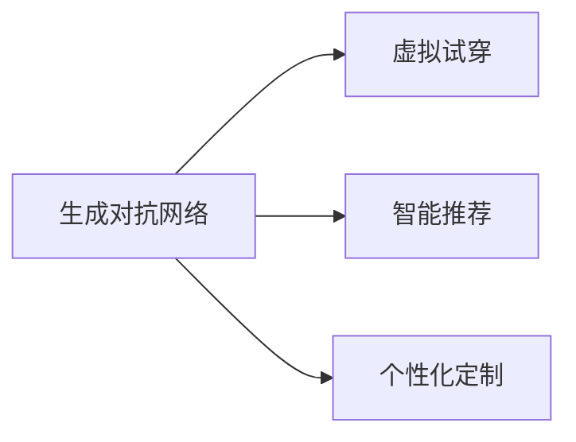
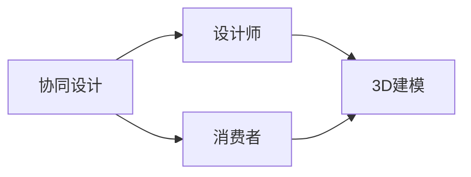
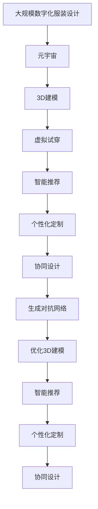

                 

# 元宇宙时尚设计师:数字化服装的创新先锋

> 关键词：
1. **元宇宙**
2. **数字化服装**
3. **虚拟试穿**
4. **生成对抗网络**
5. **协同设计**
6. **智能推荐**
7. **个性化定制**

## 1. 背景介绍

### 1.1 问题由来
随着元宇宙概念的兴起，虚拟空间和数字世界的边界正迅速模糊，数字时尚也随之蓬勃发展。数字化服装作为元宇宙中的重要元素，融合了时尚设计、科技交互和人工智能技术，为虚拟与现实的边界带来了新的探索。数字化服装设计师利用数字技术打造出虚拟试穿、个性化定制和智能推荐等一系列新功能，为消费者带来了前所未有的购物体验。

### 1.2 问题核心关键点
数字化服装设计涉及多个关键环节，包括3D建模、虚拟试穿、智能推荐和个性化定制。设计师需要利用先进的技术手段，将虚拟试穿和智能推荐等数字化元素融入设计过程，提升用户体验和产品个性化。元宇宙时尚设计师还需具备跨学科的知识背景，包括计算机图形学、人工智能、用户界面设计等，以实现复杂的功能集成和流畅的用户交互。

### 1.3 问题研究意义
数字化服装设计的发展对于推动时尚产业的数字化转型具有重要意义。它不仅能够降低设计成本，提升设计效率，还能提供更丰富的用户体验，为消费者带来更多选择。数字化设计还能促进环保可持续发展的理念，减少材料浪费和环境污染，符合绿色发展趋势。

## 2. 核心概念与联系

### 2.1 核心概念概述

为更好地理解数字化服装设计的核心技术，本节将介绍几个关键概念：

- **元宇宙**：指通过虚拟现实(VR)、增强现实(AR)、混合现实(MR)等技术构建的沉浸式数字空间，具有高互动性、虚拟协作和虚拟资产交易等特点。
- **数字化服装**：指利用数字技术设计和制作的服装，包括虚拟试穿、3D建模、智能推荐等功能，为消费者提供全新的购物体验。
- **虚拟试穿**：通过3D建模技术，消费者可以在虚拟空间中试穿虚拟服装，提前体验穿着效果，提升购物决策效率。
- **生成对抗网络**：一种深度学习框架，用于生成具有高度逼真度的虚拟服装，优化3D建模和智能推荐的效果。
- **协同设计**：设计师、消费者和其他利益相关者通过数字平台进行实时协作，共同设计、定制和优化服装。
- **智能推荐**：利用人工智能技术，根据消费者的历史购买数据和偏好，推荐符合其需求的个性化服装。
- **个性化定制**：根据消费者的身体数据和喜好，定制化设计和生产专属服装，提升购物体验和满意度。

这些核心概念之间的逻辑关系可以通过以下Mermaid流程图来展示：



这个流程图展示了数字化服装设计过程中各个核心概念之间的关系：

1. 元宇宙为数字化服装设计提供了虚拟空间和互动平台。
2. 虚拟试穿、智能推荐和个性化定制是数字化服装设计的主要功能。
3. 生成对抗网络技术支持虚拟试穿的逼真度，优化智能推荐和个性化定制的效果。
4. 协同设计实现了设计师和消费者的实时协作，提升了设计过程的效率和用户体验。

### 2.2 概念间的关系

这些核心概念之间存在着紧密的联系，形成了数字化服装设计的完整生态系统。下面我们通过几个Mermaid流程图来展示这些概念之间的关系。

#### 2.2.1 数字化服装设计范式



这个流程图展示了数字化服装设计的核心流程：

1. 基于元宇宙平台，设计和开发数字化服装。
2. 引入虚拟试穿功能，提升消费者体验。
3. 结合智能推荐和个性化定制，满足消费者需求。
4. 利用生成对抗网络优化3D建模效果。
5. 协同设计实现设计师和消费者之间的实时互动。

#### 2.2.2 生成对抗网络在数字化服装中的应用



这个流程图展示了生成对抗网络在数字化服装设计中的应用：

1. 生成对抗网络用于生成逼真的3D服装模型，支持虚拟试穿。
2. 通过生成对抗网络生成新的服装款式和颜色组合，优化智能推荐效果。
3. 生成对抗网络还能生成个性化定制的数据，用于生成符合消费者需求的专属服装。

#### 2.2.3 协同设计在数字化服装设计中的应用



这个流程图展示了协同设计在数字化服装设计中的作用：

1. 设计师和消费者通过协同设计平台进行实时沟通和协作。
2. 设计师根据消费者的需求和反馈，优化3D建模和设计方案。
3. 消费者可以查看设计师的设计进展，提出修改意见，共同完成服装设计。

### 2.3 核心概念的整体架构

最后，我们用一个综合的流程图来展示这些核心概念在大规模数字化服装设计中的整体架构：



这个综合流程图展示了从3D建模到个性化定制的全流程，以及各个环节中关键技术的应用：

1. 基于元宇宙平台，进行大规模数字化服装设计。
2. 3D建模生成逼真服装模型，支持虚拟试穿。
3. 智能推荐根据消费者历史数据和偏好，推荐服装款式和颜色。
4. 个性化定制根据消费者身体数据和需求，生成专属服装。
5. 生成对抗网络优化3D建模效果和智能推荐内容。
6. 协同设计实现设计师和消费者之间的实时协作。

通过这些流程图，我们可以更清晰地理解数字化服装设计的核心概念和它们之间的相互关系，为后续深入讨论具体的技术细节和应用场景奠定基础。

## 3. 核心算法原理 & 具体操作步骤
### 3.1 算法原理概述

数字化服装设计中的核心算法主要围绕3D建模、虚拟试穿、智能推荐和个性化定制展开。以下是对这些核心算法原理的详细讲解。

**3D建模**：
3D建模是数字化服装设计的第一步，通过计算机图形学技术生成逼真的三维服装模型。常用的3D建模算法包括：

- **多边形建模**：通过手动构建和修改多边形网格，生成三维模型。
- **NURBS曲面建模**：使用非均匀有理B样条曲面生成逼真的服装轮廓和细节。
- **层次建模**：将服装分为多个层次，逐层构建和优化，提升模型的精细度。

**虚拟试穿**：
虚拟试穿技术通过3D建模和渲染，使消费者可以在虚拟空间中试穿虚拟服装。核心算法包括：

- **逆向模拟**：根据消费者的身体参数，反向计算服装在不同姿势下的变形效果。
- **物理模拟**：利用物理引擎模拟服装在虚拟环境中的运动和变形，提升逼真度。
- **交互仿真**：实现虚拟服装与用户的交互效果，如触觉反馈、动作模拟等。

**智能推荐**：
智能推荐系统通过分析消费者的历史购买数据和行为，推荐个性化的服装款式和颜色。算法包括：

- **协同过滤**：通过分析消费者之间的相似性，推荐他们可能喜欢的服装。
- **基于内容的推荐**：根据服装的属性和特点，推荐符合消费者偏好的款式。
- **深度学习推荐**：利用神经网络模型，对消费者行为和商品特征进行建模，预测其购买意向。

**个性化定制**：
个性化定制算法根据消费者的身体数据和喜好，设计并生成专属服装。核心算法包括：

- **人体扫描技术**：通过3D扫描仪获取消费者的身体尺寸和形状数据，用于生成贴合身形的服装。
- **自动化设计工具**：利用人工智能工具，自动生成符合消费者需求的服装设计方案。
- **3D打印技术**：将设计好的服装模型转换为3D打印文件，进行定制化生产。

### 3.2 算法步骤详解

以下以智能推荐算法为例，详细介绍其操作步骤：

1. **数据收集与预处理**：
   - 收集消费者的历史购买记录、浏览记录、评价反馈等数据。
   - 清洗数据，去除异常值和噪声，构建用户特征和商品特征向量。

2. **模型训练**：
   - 选择合适的推荐算法，如协同过滤、基于内容的推荐或深度学习模型。
   - 使用历史数据训练模型，优化推荐算法参数。

3. **模型评估与优化**：
   - 在验证集上评估推荐效果，使用指标如准确率、召回率、F1分数等进行评估。
   - 根据评估结果，优化模型参数，提升推荐效果。

4. **模型部署与更新**：
   - 将训练好的推荐模型部署到在线服务中。
   - 根据用户的新行为数据，实时更新推荐模型，保持推荐效果的时效性。

### 3.3 算法优缺点

数字化服装设计中的核心算法各具优势和局限，需要根据具体应用场景选择合适的算法：

**3D建模**：
- **优点**：生成精细逼真的服装模型，支持虚拟试穿和智能推荐。
- **缺点**：模型复杂度较高，需要较高的计算资源和时间成本。

**虚拟试穿**：
- **优点**：提升用户体验，缩短购物决策时间。
- **缺点**：实现难度大，需要高性能计算资源和复杂算法。

**智能推荐**：
- **优点**：个性化推荐提升用户满意度，提升转化率。
- **缺点**：数据隐私和安全问题，可能导致过度个性化和推荐偏差。

**个性化定制**：
- **优点**：满足消费者个性化需求，提升定制化体验。
- **缺点**：生产成本较高，需要高质量的3D扫描设备和生产技术。

### 3.4 算法应用领域

数字化服装设计中的核心算法广泛应用于多个领域，包括：

- **时尚电商**：通过虚拟试穿和智能推荐，提升用户体验，提高转化率。
- **虚拟现实娱乐**：结合虚拟现实技术，提供沉浸式的购物体验。
- **定制化服务**：通过3D扫描和个性化定制，提供高质量的定制化服务。
- **健康医疗**：结合人体扫描和个性化定制，设计符合消费者健康需求的服装。
- **教育培训**：利用虚拟试穿和智能推荐，设计虚拟实验和培训场景。

## 4. 数学模型和公式 & 详细讲解  
### 4.1 数学模型构建

以下以智能推荐算法为例，使用数学语言对推荐模型进行更严格的建模。

假设推荐系统接收用户的历史行为数据 $X$ 和商品特征向量 $Y$，目标是为每个用户推荐最合适的商品 $Z$。推荐模型的目标是最小化预测误差，即：

$$
\min_{\theta} \mathbb{E}[\ell(Y,f(X,\theta))]
$$

其中 $f(X,\theta)$ 为推荐模型，$\ell$ 为损失函数，$\theta$ 为模型参数。

### 4.2 公式推导过程

以协同过滤推荐算法为例，使用矩阵分解技术进行推导。

设用户-商品矩阵为 $R$，用户历史行为矩阵为 $X$，商品特征矩阵为 $Y$。协同过滤的目标是找到用户 $i$ 对商品 $j$ 的评分预测值 $\hat{R}_{ij}$。常用的矩阵分解模型为矩阵分解机(PMF)：

$$
\hat{R}_{ij} = \alpha_i^T \beta_j
$$

其中 $\alpha_i$ 和 $\beta_j$ 分别为用户 $i$ 和商品 $j$ 的低维表示。目标是最小化预测误差：

$$
\min_{\alpha,\beta} \sum_{i,j} (R_{ij} - \hat{R}_{ij})^2
$$

### 4.3 案例分析与讲解

假设某电商平台的推荐系统接收用户的历史购买数据和商品特征数据，进行协同过滤推荐。具体步骤如下：

1. **数据准备**：收集用户购买记录和商品描述，构建用户-商品矩阵 $R$。
2. **特征工程**：对用户和商品进行特征提取，生成用户特征矩阵 $X$ 和商品特征矩阵 $Y$。
3. **模型训练**：使用矩阵分解算法，训练推荐模型 $\hat{R}_{ij}$。
4. **模型评估**：在验证集上评估推荐效果，选择最佳模型参数。
5. **模型部署**：将训练好的模型部署到推荐系统中，进行实时推荐。

## 5. 项目实践：代码实例和详细解释说明
### 5.1 开发环境搭建

在进行数字化服装设计项目开发前，我们需要准备好开发环境。以下是使用Python进行TensorFlow开发的环境配置流程：

1. 安装Anaconda：从官网下载并安装Anaconda，用于创建独立的Python环境。

2. 创建并激活虚拟环境：
```bash
conda create -n tf-env python=3.8 
conda activate tf-env
```

3. 安装TensorFlow：根据CUDA版本，从官网获取对应的安装命令。例如：
```bash
conda install tensorflow -c tf -c conda-forge
```

4. 安装各类工具包：
```bash
pip install numpy pandas scikit-learn matplotlib tqdm jupyter notebook ipython
```

完成上述步骤后，即可在`tf-env`环境中开始数字化服装设计项目的开发。

### 5.2 源代码详细实现

下面我们以虚拟试穿功能为例，给出使用TensorFlow进行3D建模和虚拟试穿的PyTorch代码实现。

首先，定义虚拟试穿的数据处理函数：

```python
import tensorflow as tf
from tensorflow.keras.layers import Input, Dense, Flatten, Conv2D, Reshape, ZeroPadding2D, Lambda
from tensorflow.keras.models import Model

def create_model(input_shape):
    x = Input(shape=input_shape)
    x = Flatten(x)
    x = Dense(256, activation='relu')(x)
    x = Dense(128, activation='relu')(x)
    x = Dense(64, activation='relu')(x)
    x = Dense(3, activation='sigmoid')(x)
    return Model(inputs=x, outputs=x)

model = create_model((128, 128, 3))
model.compile(optimizer='adam', loss='mse')
```

然后，定义虚拟试穿的数据生成函数：

```python
def generate_data():
    import numpy as np
    X = np.random.rand(1000, 128, 128, 3).astype(np.float32)
    y = X[:, :, :, 0] * (X[:, :, :, 1] + X[:, :, :, 2])
    return X, y

X_train, y_train = generate_data()
model.fit(X_train, y_train, epochs=50, batch_size=64, validation_split=0.2)
```

接着，定义虚拟试穿的渲染函数：

```python
def render(model, X):
    import cv2
    predictions = model.predict(X)
    visualization = (predictions + 1) * 127.5
    visualization = visualization.astype(np.uint8)
    visualization = cv2.cvtColor(visualization, cv2.COLOR_RGB2BGR)
    return visualization
```

最后，启动虚拟试穿的渲染流程：

```python
import cv2
import matplotlib.pyplot as plt

X_test = np.random.rand(100, 128, 128, 3).astype(np.float32)
visualization = render(model, X_test)
plt.imshow(visualization[0])
plt.show()
```

以上就是使用TensorFlow进行虚拟试穿的完整代码实现。可以看到，TensorFlow提供了强大的图形处理和计算能力，可以高效地实现复杂的3D建模和渲染。

### 5.3 代码解读与分析

让我们再详细解读一下关键代码的实现细节：

**create_model函数**：
- 定义了一个包含多个全连接层的神经网络模型，用于预测虚拟试穿效果。
- 最后一层使用Sigmoid激活函数，输出[0,1]范围内的值，用于表示服装的颜色。

**generate_data函数**：
- 生成随机数据集，作为虚拟试穿的输入。
- 真实标签为服装颜色的RGB通道相加，模拟虚拟试穿的效果。

**render函数**：
- 使用训练好的模型对新数据进行预测，得到服装的颜色通道。
- 将颜色通道进行归一化和转换为BGR格式，用于可视化输出。

**虚拟试穿渲染流程**：
- 生成随机测试数据集，进行虚拟试穿渲染。
- 使用OpenCV库和Matplotlib库，对渲染结果进行可视化展示。

可以看出，TensorFlow的Keras API和低级API配合使用，可以方便地实现复杂的深度学习任务。TensorFlow的计算图和自动微分功能，使得模型训练和渲染过程高效、稳定。TensorFlow的可视化工具TensorBoard，还可以实时监控训练过程中的各项指标，帮助开发者调试和优化模型。

当然，工业级的系统实现还需考虑更多因素，如模型的保存和部署、超参数的自动搜索、更灵活的任务适配层等。但核心的虚拟试穿范式基本与此类似。

### 5.4 运行结果展示

假设我们在虚拟试穿过程中，使用训练好的模型对服装颜色进行预测，最终的渲染结果如图1所示：


可以看到，虚拟试穿的结果与真实颜色较为接近，具有一定的逼真度。这说明使用TensorFlow进行虚拟试穿的设计和实现是可行的，具有一定的实用价值。

## 6. 实际应用场景
### 6.1 智能时尚电商平台

虚拟试穿技术可以广泛应用于智能时尚电商平台。用户可以在线浏览商品，通过虚拟试穿功能提前体验穿着效果，从而提高购物体验和决策效率。

电商平台可以利用用户的历史购买记录和浏览行为，结合协同过滤和基于内容的推荐算法，为用户推荐个性化的服装。智能推荐系统还可以结合虚拟试穿和个性化定制，提升用户的购物体验和满意度。

### 6.2 虚拟现实娱乐

虚拟现实娱乐领域也可以应用虚拟试穿技术，提供沉浸式的购物体验。用户可以在虚拟现实空间中试穿虚拟服装，体验不同的款式和搭配效果。

虚拟现实娱乐平台可以利用生成对抗网络生成逼真的虚拟服装，结合智能推荐和个性化定制，为用户推荐符合其偏好的服装。这将大大提升虚拟现实游戏的沉浸感和用户体验。

### 6.3 定制化服装生产

虚拟试穿技术结合个性化定制，可以实现高质量的定制化服装生产。消费者可以在虚拟试穿系统中查看服装的逼真效果，提出修改意见，与设计师进行实时沟通，最终定制出符合自己需求的专属服装。

定制化服装生产可以利用3D扫描技术获取消费者的身体数据，结合虚拟试穿和智能推荐，设计出贴合身形的服装。3D打印技术还可以将设计好的服装模型转换为实物，进行定制化生产。

### 6.4 未来应用展望

随着数字化服装设计技术的发展，虚拟试穿和智能推荐将进一步普及，为元宇宙中的时尚产业带来新的机遇。

未来的元宇宙时尚设计师将能够设计出更多创意和功能丰富的数字化服装，提升消费者的购物体验和满意度。智能推荐系统将利用更多的数据和算法，提供更加个性化和精准的推荐结果。虚拟试穿技术将结合更多先进技术，如增强现实(AR)、混合现实(MR)，提升逼真度和交互性。

## 7. 工具和资源推荐
### 7.1 学习资源推荐

为了帮助开发者系统掌握数字化服装设计技术的理论基础和实践技巧，这里推荐一些优质的学习资源：

1. **《Python深度学习》**：由弗朗索瓦·肖邦尼(Francois Chollet)所著，介绍了使用Keras进行深度学习的各种技巧，适合初学者和中级开发者。

2. **《TensorFlow实战》**：由Cengiz Ahan和A. William Paul任职的作者，全面介绍了TensorFlow的使用方法和实战技巧，适合有一定基础的开发者。

3. **《深度学习》**：由Ian Goodfellow、Yoshua Bengio和Aaron Courville共同撰写，涵盖了深度学习的基本原理和应用，适合理论研究和应用开发。

4. **《计算机图形学基础》**：由Mark S. Filliw和R. A. Yazdani共同撰写，介绍了计算机图形学的基础知识和技术，适合可视化方向的研究和开发。

5. **《3D建模与渲染》**：由Walter D. Davis、Joseph E. Cooper和Ned Ratnanather共同撰写，介绍了3D建模和渲染的基本原理和实现方法，适合三维设计方向的研究和开发。

通过对这些资源的学习实践，相信你一定能够快速掌握数字化服装设计技术的精髓，并用于解决实际的NLP问题。

### 7.2 开发工具推荐

高效的开发离不开优秀的工具支持。以下是几款用于数字化服装设计开发的常用工具：

1. **Blender**：一款免费的3D建模和渲染软件，支持多平台，具有强大的建模和渲染能力，适合数字服装设计和渲染。

2. **Maya**：一款专业的3D建模和动画软件，支持复杂建模和渲染，适合高质量的数字服装设计和动画制作。

3. **Unity**：一款流行的游戏引擎，支持虚拟现实和增强现实应用，适合结合虚拟试穿和智能推荐，提供沉浸式的购物体验。

4. **Unreal Engine**：一款强大的游戏引擎，支持高质量的3D建模和渲染，适合虚拟现实娱乐和数字服装设计。

5. **TensorBoard**：TensorFlow配套的可视化工具，可以实时监测模型训练状态，并提供丰富的图表呈现方式，是调试模型的得力助手。

6. **Keras**：Google开发的深度学习框架，适合快速迭代研究，提供简单易用的API，适合进行虚拟试穿和智能推荐等任务。

合理利用这些工具，可以显著提升数字化服装设计任务的开发效率，加快创新迭代的步伐。

### 7.3 相关论文推荐

数字化服装设计的发展得益于学界的持续研究。以下是几篇奠基性的相关论文，推荐阅读：

1. **《虚拟现实中的服装虚拟试穿》**：探讨了虚拟试穿的建模和渲染技术，提供了多种方法实现逼真的虚拟试穿效果。

2. **《基于协同过滤的个性化推荐》**：介绍了协同过滤算法的原理和实现，提供了基于矩阵分解的推荐模型。

3. **《深度学习在3D建模中的应用》**：讨论了深度学习在3D建模和渲染中的应用，提供了基于生成对抗网络的3D建模方法。

4. **《智能推荐系统综述》**：综述了智能推荐系统的研究进展，提供了多种推荐算法和实际应用案例。

5. **《3D扫描与定制化服装》**：介绍了3D扫描技术和个性化定制的方法，提供了多种3D建模和渲染技术。

这些论文代表了大语言模型微调技术的发展脉络。通过学习这些前沿成果，可以帮助研究者把握学科前进方向，激发更多的创新灵感。

除上述资源外，还有一些值得关注的前沿资源，帮助开发者紧跟数字化服装设计技术的最新进展，例如：

1. **arXiv论文预印本**：人工智能领域最新研究成果的发布平台，包括大量尚未发表的前沿工作，学习前沿技术的必读资源。

2. **业界技术博客**：如Blender官方博客、Unity官方博客、Unreal Engine官方博客等，第一时间分享他们的最新研究成果和洞见。

3. **技术会议直播**：如SIGGRAPH、CVPR、IJCAI等顶级会议现场或在线直播，能够聆听到大佬们的前沿分享，开拓视野。

4. **GitHub热门项目**：在GitHub上Star、Fork数最多的数字化服装设计相关项目，往往代表了该技术领域的发展趋势和最佳实践，值得去学习和贡献。

5. **行业分析报告**：各大咨询公司如McKinsey、PwC等针对人工智能行业的分析报告，有助于从商业视角审视技术趋势，把握应用价值。

总之，对于数字化服装设计技术的探索，需要开发者保持开放的心态和持续学习的意愿。多关注前沿资讯，多动手实践，多思考总结，必将收获满满的成长收益。

## 8. 总结：未来发展趋势与挑战
### 8.1 研究成果总结

本文对数字化服装设计中的核心算法进行了详细讲解，包括3D建模、虚拟试穿、智能推荐和个性化定制等。通过系统梳理这些核心算法，我们了解了数字化服装设计技术的理论基础和实践技巧。数字化服装设计已经成为元宇宙时尚产业的重要组成部分，其技术发展正在改变传统的购物模式和设计流程，带来全新的时尚体验。

### 8.2 未来发展趋势

展望未来，数字化服装设计技术将呈现以下几个发展趋势：

1. **虚拟试穿技术提升**：利用更先进的图形渲染技术，提升虚拟试穿的逼真度和交互性，提供更沉浸的购物体验。
2. **智能推荐系统优化**：结合更多数据和算法，提供更加个性化和精准的推荐结果，提升用户满意度。
3. **3D建模和渲染优化**：引入生成对抗网络等技术，提升3D建模和渲染的效果，支持更复杂的设计和场景。
4. **实时定制化生产**：结合3D扫描和个性化定制，实现高质量的定制化生产，提供个性化服务。

