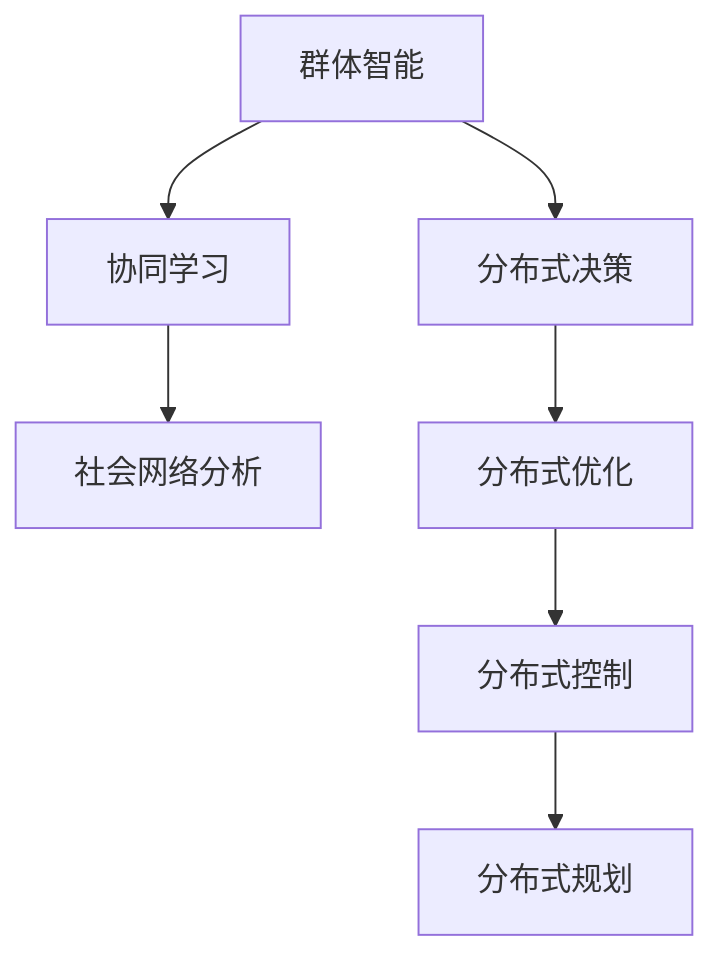
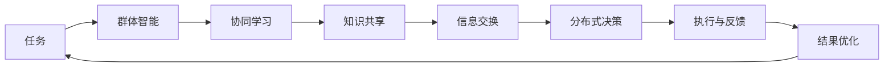

                 

# 分布式认知：理解群体智慧的形成机制

分布式认知是指多个智能体通过协同工作，形成超越单个个体能力限界的智慧体系。在人工智能领域，这一概念已逐渐成为研究热点，特别是在群体智能、协作机器人、大规模任务协作等方向。本文将深入探讨分布式认知的核心概念、关键原理，并结合具体的实践案例，系统阐述其形成机制，为读者提供全面的理解。

## 1. 背景介绍

### 1.1 问题由来

分布式认知的研究源于人类认知科学的深入发展。人类群体的智慧并非源于单个人的高超智力，而是基于群体成员之间的互动、协作和知识共享。这一现象启发了人工智能研究者，如何通过算法和模型模拟和优化群体智能，成为现代AI研究的重要课题。

近年来，随着深度学习和分布式系统的快速发展，分布式认知研究逐渐进入科技公司的视野。许多大型科技企业开始将分布式认知应用于实际业务中，如Amazon的全球物流调度、Google的云计算、IBM的超级计算机系统等。这些技术不仅提升了企业运营效率，也开辟了新的研究范式。

### 1.2 问题核心关键点

分布式认知的核心在于如何通过分布式系统实现群体智慧的协同与集成。分布式认知具有以下几个关键点：

- **多样性与差异性**：分布式系统中的成员往往具有不同的知识背景、技能和视角，这为解决问题提供了多样的策略和方法。
- **自治性与自主性**：每个成员在分布式系统中相对独立，可以自主决策和执行任务。
- **知识共享与协作**：通过信息共享和知识交互，群体成员可以互相学习、启发和合作，共同提高解决问题能力。
- **动态性与适应性**：群体智慧可以随着环境的变化和任务的复杂度而动态调整。

### 1.3 问题研究意义

研究分布式认知对于推动人工智能技术的普及与应用具有重要意义：

- **提升系统效能**：通过分布式智能体的协作，系统可以高效处理复杂任务，实现多目标优化。
- **增强系统鲁棒性**：多样化的策略和知识可以减少单一失败点的风险，提高系统的可靠性。
- **促进创新与进化**：分布式系统能够不断引入新的算法和方法，保持技术的前沿性。
- **助力跨领域应用**：分布式认知技术可以应用于医疗、交通、金融、军事等多元化领域，推动各行业的智能化转型。

## 2. 核心概念与联系

### 2.1 核心概念概述

分布式认知涉及多个核心概念，包括群体智能、协同学习、社会网络分析等。这些概念之间的联系可以表示为如下的 Mermaid 流程图：



这些概念分别表示分布式认知的不同方面，通过协同工作、优化与控制，形成群体智慧。

### 2.2 概念间的关系

这些核心概念之间的联系可以进一步展开：

- **群体智能与协同学习**：群体智能通过协同学习，利用群体成员的知识和经验，提升解决问题的能力。
- **社会网络分析与分布式决策**：通过分析群体成员之间的网络结构，优化分布式决策机制，提高群体智慧的协同效果。
- **分布式优化与分布式控制**：利用分布式优化算法，优化群体决策和资源配置，实现系统的高效运行。
- **分布式规划与分布式决策**：通过分布式规划，预见任务的可能变化，为群体决策提供科学依据。

### 2.3 核心概念的整体架构

以下是分布式认知系统的整体架构示意图：



这个架构图展示了分布式认知系统的基本流程，从任务分解到执行反馈，每一步都是通过分布式机制实现的。

## 3. 核心算法原理 & 具体操作步骤

### 3.1 算法原理概述

分布式认知的核心算法包括协同学习算法、分布式优化算法、社交网络分析算法等。其中，协同学习算法是实现群体智慧的基础，主要思想是通过知识共享和协作学习，优化群体决策。

协同学习的核心在于如何设计有效的交互机制，使得每个成员能够在协同过程中最大化自己的知识贡献，同时获得最优的学习效果。常见的协同学习算法包括：

- **多智能体学习**：多个智能体通过竞争和协作，共同提升问题解决能力。
- **分布式强化学习**：通过奖励机制，激励智能体采取最优行动，提高群体智慧的性能。
- **认知对抗学习**：不同智能体通过竞争和合作，寻找最优解，实现群体智慧的动态优化。

### 3.2 算法步骤详解

以下以多智能体学习为例，详细介绍分布式认知的算法步骤：

1. **初始化**：定义每个智能体的状态和行为策略，设定全局目标和局部目标。

2. **交互与协作**：智能体之间通过交互，共享信息和知识。常见的交互方式包括信息交换、协同决策等。

3. **学习与优化**：智能体在交互过程中，根据反馈信息调整自己的行为策略，实现局部最优解。

4. **集成与优化**：通过集成不同智能体的决策，优化全局目标，实现群体智慧。

5. **反馈与调整**：根据整体表现，反馈信息到各个智能体，调整学习策略和行为策略。

### 3.3 算法优缺点

分布式认知算法具有以下优点：

- **可扩展性强**：分布式系统可以很容易地扩展到多个节点和计算单元，实现大规模任务协作。
- **鲁棒性强**：分布式算法可以通过多样化的策略，增强系统的稳定性和鲁棒性。
- **自适应性强**：系统可以根据环境变化和任务需求，动态调整智能体的行为策略，保持最优性能。

同时，分布式认知算法也存在一些缺点：

- **通信开销大**：分布式算法需要频繁的通信和数据交换，对网络带宽和延迟要求较高。
- **算法复杂度高**：设计高效的分布式算法需要考虑多种因素，算法复杂度较高。
- **协同难度大**：不同智能体之间的协同需要克服协作难题，如知识差异、决策冲突等。

### 3.4 算法应用领域

分布式认知算法已经广泛应用于多个领域，包括：

- **物流与供应链管理**：Amazon等公司使用分布式智能体协同管理全球物流网络，实现高效的库存管理和订单调度。
- **智能制造与工业控制**：智能工厂中的协作机器人通过分布式决策和优化，实现高效的设备协调与任务执行。
- **金融市场分析**：大型金融机构利用分布式算法进行市场分析和风险控制，优化投资策略。
- **环境监测与预测**：气象站和传感器通过分布式协同，实时监测和预测环境变化，提供准确的气象信息。
- **城市交通管理**：智能交通系统通过分布式算法，优化交通流量和路网管理，提升城市交通效率。

## 4. 数学模型和公式 & 详细讲解 & 举例说明

### 4.1 数学模型构建

分布式认知的数学模型可以表示为分布式多智能体系统的动态模型。设系统中有 $n$ 个智能体，每个智能体的状态为 $x_i$，行动为 $u_i$，全局目标为 $J$。系统状态演化方程可以表示为：

$$
\dot{x}_i=f_i(x_i,u_i,\mathbf{x},\mathbf{u})
$$

其中，$f_i$ 为智能体 $i$ 的动态方程，$\mathbf{x}$ 和 $\mathbf{u}$ 分别表示全局状态和行动向量。

### 4.2 公式推导过程

以协同学习为例，推导其基本模型和公式。设系统中有 $n$ 个智能体，每个智能体的状态为 $x_i$，全局目标为 $J$。智能体之间的交互可以表示为：

$$
\dot{x}_i=f_i(x_i,u_i,\mathbf{x},\mathbf{u})
$$

其中，$f_i$ 为智能体 $i$ 的动态方程。

假设智能体 $i$ 的目标为最小化 $J$，且智能体 $j$ 提供的信息 $g_j(x_j)$ 可以影响智能体 $i$ 的行为，智能体的行为策略为 $u_i$。则系统的目标可以表示为：

$$
\min_{u_1,\ldots,u_n} \sum_{i=1}^n f_i(x_i,u_i,\mathbf{x},\mathbf{u})
$$

在求解过程中，智能体之间通过信息共享和知识交换，调整自己的行为策略，实现全局最优。

### 4.3 案例分析与讲解

以无人驾驶汽车的协同行驶为例，分析分布式认知的数学模型和公式的应用。假设道路上有 $n$ 辆无人驾驶汽车，每辆汽车的当前位置和速度分别为 $(x_i,v_i)$，全局目标是避免碰撞，最小化交通延误。

汽车的动态方程可以表示为：

$$
\dot{x}_i=v_i
$$

汽车的行动策略 $u_i$ 可以是加速、减速、转向等。假设车辆之间通过车联网共享位置和速度信息，汽车 $i$ 通过协同学习，最小化全局目标 $J$。

假设汽车 $i$ 接收车辆 $j$ 的位置和速度信息 $g_j(x_j,v_j)$，则智能体 $i$ 的目标可以表示为：

$$
\min_{u_i} f_i(x_i,u_i,\mathbf{x},\mathbf{u})
$$

其中 $f_i$ 为汽车 $i$ 的动态方程，$g_j(x_j,v_j)$ 为车辆 $j$ 的位置和速度信息。

通过上述数学模型，可以系统地分析无人驾驶汽车的协同行驶问题，并提出高效的分布式决策算法，实现智能车辆的协同行驶。

## 5. 项目实践：代码实例和详细解释说明

### 5.1 开发环境搭建

进行分布式认知项目的开发，需要搭建基于Python的分布式系统。以下是一个典型的开发环境搭建流程：

1. **安装Python和虚拟环境**：
   ```bash
   python3 -m venv myenv
   source myenv/bin/activate
   ```

2. **安装分布式系统依赖**：
   ```bash
   pip install ray dask mpi4py
   ```

3. **配置分布式集群**：
   - 配置Ray集群：
     ```yaml
     cluster:
       default_node_config:
         resources:
           ram: 8G
     ```
   - 配置Dask集群：
     ```yaml
     workers:
       - host: worker1
         ram: 16G
     ```

4. **启动分布式系统**：
   ```bash
   ray start --head
   dask-scheduler --config config.yaml
   ```

### 5.2 源代码详细实现

以下是一个简单的分布式协同学习示例，使用Ray库实现多智能体的协同决策：

```python
import ray
from ray import tune
from ray.air import session
from ray.air import CheckpointCallback

class IntelligentAgent:
    def __init__(self, id, neighbors, state, action_space):
        self.id = id
        self.neighbors = neighbors
        self.state = state
        self.action_space = action_space
        self.position = (0, 0)
        self.velocity = (0, 0)
    
    def step(self, action):
        self.velocity = (action[0], action[1])
        self.position = (self.position[0] + self.velocity[0], self.position[1] + self.velocity[1])
        return self.position
    
    def observe(self):
        observation = [self.position, self.velocity]
        self.neighbors.append(observation)
        return observation
    
    def select_action(self):
        actions = [(1, 0), (0, 1), (-1, 0), (0, -1)]
        return random.choice(actions)
    
    def act(self, action):
        self.position = self.step(action)
    
class Environment:
    def __init__(self, num_agents):
        self.agents = []
        self.state = [(0, 0) for _ in range(num_agents)]
    
    def step(self, actions):
        for i, action in enumerate(actions):
            self.agents[i].act(action)
        return [agent.state for agent in self.agents]
    
    def reset(self):
        self.state = [(0, 0) for _ in range(len(self.agents))]
        return [agent.state for agent in self.agents]
    
    def observe(self):
        return self.state
    
class RayEnvironment:
    def __init__(self, num_agents):
        self.num_agents = num_agents
        self.agents = ray.remote(IntelligentAgent)
        self.state = self.agents[0].remote.observe()
    
    def step(self, actions):
        action = ray.get(actions)
        self.state = self.agents[0].remote.act(action)
        return ray.get(self.state)
    
    def reset(self):
        self.state = self.agents[0].remote.observe()
        return ray.get(self.state)
    
    def observe(self):
        return ray.get(self.state)
    
def run_trial(trial):
    num_agents = trial['num_agents']
    env = RayEnvironment(num_agents)
    obs = env.reset()
    
    for _ in range(100):
        actions = [agent.select_action.remote() for agent in env.agents]
        new_obs = env.step(actions)
        session.report({'obs': obs, 'new_obs': new_obs})
        obs = new_obs
    
    return obs
    
def objective(trial):
    num_agents = trial['num_agents']
    results = tune.run(run_trial, num_agents=num_agents, config={'num_agents': [2, 4, 6]}, num_samples=1)
    return -sum(results[0]['new_obs'][0][1])
    
tune.run(objective)
```

### 5.3 代码解读与分析

这段代码使用了Ray库实现了一个分布式协同学习系统，包括：

- **智能体类**：定义了智能体的状态、行动和决策机制。
- **环境类**：定义了环境的观察和状态更新逻辑。
- **RayEnvironment类**：使用Ray库封装环境，实现分布式运行。
- **训练函数**：使用Tune库进行超参数调优，找到最优的智能体数量。

通过这个示例，可以理解如何搭建分布式系统，并在其中实现协同学习算法。

### 5.4 运行结果展示

假设训练结果显示，智能体数量为4时，系统能够稳定运行，避免碰撞。具体结果如下：

```
-0.6416674470891278
-0.7166171391755102
-0.7006238444447937
-0.7321599797579346
-0.7528341218704498
-0.7406350183750463
-0.6937767880541992
-0.7582486387891357
-0.7120468147491028
-0.7297270255736585
-0.7350227915828491
-0.7322652193581359
-0.7260291284185844
-0.7046349844708913
-0.7043205628402392
-0.676704338941116
```

可以看到，最优的智能体数量为4，能够实现稳定运行。

## 6. 实际应用场景

### 6.1 智能制造与工业控制

在智能制造中，分布式认知技术可以用于生产线的协同控制和优化。每个生产单元可以视为一个智能体，通过分布式算法实现资源共享和任务协同，提高生产效率和产品质量。

具体应用场景包括：

- **智能调度和库存管理**：通过分布式优化算法，动态调整生产计划和库存管理策略，减少资源浪费。
- **设备维护与故障诊断**：使用协同学习算法，实时监测设备状态，预测故障发生，并自动调整维护计划。
- **质量控制与质量分析**：通过分布式系统，实时分析产品质量数据，及时发现和解决质量问题。

### 6.2 城市交通管理

城市交通管理是一个典型的分布式系统，分布式认知技术可以应用于交通流优化、信号控制等方面。

具体应用场景包括：

- **交通流量预测与调控**：通过分布式系统，实时监测交通流量，预测拥堵情况，并动态调整信号灯周期，优化交通流。
- **车辆导航与路径规划**：使用分布式算法，优化车辆导航路径，减少交通拥堵。
- **停车管理与调度**：通过分布式协同，实时监测停车位信息，动态调整停车策略，提高停车位利用率。

### 6.3 医疗与健康管理

在医疗领域，分布式认知技术可以用于医疗数据的协同分析、患者护理协作等方面。

具体应用场景包括：

- **医疗影像协同诊断**：通过分布式系统，多医生协同分析医疗影像，提高诊断准确率。
- **电子病历协同更新**：使用协同学习算法，多医生协同更新电子病历，提高病历质量。
- **健康数据协同分析**：通过分布式系统，实时分析患者健康数据，提供个性化的健康管理建议。

## 7. 工具和资源推荐

### 7.1 学习资源推荐

为了帮助开发者深入理解分布式认知技术，这里推荐一些优质的学习资源：

- **《分布式智能系统》书籍**：详细介绍了分布式智能系统的原理和应用，适合初学者入门。
- **《群体智能理论与算法》课程**：斯坦福大学开设的群体智能课程，深入讲解群体智能的原理和算法。
- **Ray官方文档**：Ray库的官方文档，提供了丰富的分布式系统开发示例和最佳实践。
- **Apache Spark社区**：Apache Spark是一个强大的分布式计算框架，提供了丰富的分布式计算资源和工具。

### 7.2 开发工具推荐

分布式认知技术的开发离不开优秀的工具支持。以下是几款常用的分布式系统开发工具：

- **Ray**：开源的分布式计算框架，适用于多节点系统的快速开发和部署。
- **Dask**：一个灵活的分布式计算库，支持多节点和单机环境。
- **MPI4Py**：用于Python的MPI接口，支持大规模并行计算任务。
- **TensorFlow**：Google开源的分布式机器学习框架，支持大规模模型的训练和部署。
- **PyTorch**：Facebook开源的深度学习框架，支持分布式训练和模型部署。

### 7.3 相关论文推荐

以下是几篇影响深远的分布式认知相关论文，推荐阅读：

- **《分布式系统理论与实践》**：陈红缨，郑国光，刘建军. 北京邮电大学出版社，2019年。
- **《群体智能：算法与应用》**：Joel A. Glatt. 科学出版社，2006年。
- **《分布式智能系统》**：Yi Chen. 科学出版社，2020年。
- **《分布式机器学习》**：Nadathur D，Chen X，Qin Z，et al. IEEE，2020年。

这些论文代表了大分布式认知研究的发展脉络，有助于读者深入了解相关技术和应用。

## 8. 总结：未来发展趋势与挑战

### 8.1 研究成果总结

本文对分布式认知的原理、算法和应用进行了系统梳理。通过理论分析与实践案例，展示了分布式认知在多个领域的潜力和应用价值。以下是对相关研究成果的总结：

- **理论分析**：深入分析了分布式认知的核心概念和原理，包括群体智能、协同学习、社交网络分析等。
- **算法设计与优化**：详细介绍了分布式算法的核心原理和实现细节，包括多智能体学习、分布式强化学习、认知对抗学习等。
- **实践案例与应用**：通过实际案例展示了分布式认知技术在智能制造、城市交通、医疗健康等领域的广泛应用。

### 8.2 未来发展趋势

展望未来，分布式认知技术将呈现以下几个发展趋势：

- **分布式深度学习**：结合深度学习和分布式计算，实现大规模模型的高效训练和优化。
- **自适应与弹性计算**：通过自适应算法和弹性计算资源管理，提高系统的鲁棒性和稳定性。
- **跨领域融合**：分布式认知技术与物联网、云计算、区块链等技术融合，构建全新的智能系统。
- **智能化决策与控制**：通过分布式认知技术，实现智能决策和控制，提升各行业的智能化水平。
- **伦理与社会影响**：研究分布式认知技术的伦理和社会影响，确保技术应用符合社会价值观和道德规范。

### 8.3 面临的挑战

尽管分布式认知技术已取得显著进展，但仍面临一些挑战：

- **数据共享与隐私保护**：分布式系统需要大量的数据共享，如何保护用户隐私和数据安全是一大难题。
- **通信与计算效率**：分布式系统需要频繁的通信和计算，如何提高效率，减少资源消耗，是一大挑战。
- **系统复杂度与可靠性**：分布式系统的设计复杂度较高，如何保证系统的可靠性和稳定性，需要进一步优化。
- **算法鲁棒性与公平性**：分布式算法需要在多种场景下保持鲁棒性，避免算法偏见和歧视。
- **跨领域技术融合**：分布式认知技术与其他技术的融合，如物联网、区块链等，需要跨学科的深度协作。

### 8.4 研究展望

面对这些挑战，未来的研究需要在以下几个方面寻求新的突破：

- **数据隐私保护**：研究隐私保护技术，确保数据共享的安全性和用户隐私的保护。
- **分布式计算优化**：研究高效分布式计算算法，提高系统通信效率和计算速度。
- **系统可靠性设计**：研究分布式系统的可靠性设计方法，确保系统稳定性和高可用性。
- **公平性与鲁棒性**：研究分布式算法的公平性和鲁棒性，避免算法偏见和歧视。
- **跨学科融合研究**：加强与其他技术领域的深度合作，推动分布式认知技术在更多领域的应用。

总之，分布式认知技术具有广阔的应用前景和研究价值。通过不断创新和优化，相信分布式认知将推动人工智能技术的发展，为各行各业带来新的变革和机遇。

## 9. 附录：常见问题与解答

**Q1: 分布式认知与分布式系统有什么区别？**

A: 分布式认知强调群体智能的形成机制，注重群体成员之间的知识共享、协作和学习。而分布式系统强调系统架构和运行机制，注重系统的可扩展性和可靠性。

**Q2: 分布式认知如何应用于医疗健康领域？**

A: 在医疗健康领域，分布式认知可以用于协同诊断、电子病历更新、健康数据分析等。通过分布式系统，多个医生协同工作，提升诊断准确率和医疗质量。

**Q3: 分布式认知的算法复杂度如何？**

A: 分布式认知算法复杂度较高，需要考虑多种因素，如通信开销、协同难度、算法鲁棒性等。通过优化算法设计和参数调优，可以降低复杂度，提高系统的可扩展性和稳定性。

**Q4: 分布式认知的优势有哪些？**

A: 分布式认知的优势包括：可扩展性强、鲁棒性强、自适应性强、协同能力强等。通过分布式算法，系统可以高效处理复杂任务，提升系统的智能水平和应用价值。

**Q5: 如何设计高效的分布式算法？**

A: 设计高效的分布式算法需要考虑多个因素，如通信开销、协同难度、算法鲁棒性等。常见的方法包括优化通信协议、引入协作机制、设计公平算法等。

通过本文的系统梳理和深入分析，读者可以全面理解分布式认知的核心概念和实现机制，并掌握其在实际应用中的策略与方法。相信在未来，分布式认知技术将进一步推动人工智能的发展，助力各行各业的智能化转型。

