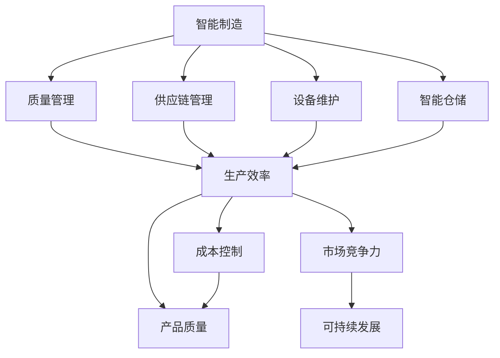

                 

# 制造行业数字化、人工智能、大数据技术转型

> 关键词：制造行业, 数字化转型, 人工智能, 大数据, 智能制造, 生产效率, 智能生产, 质量管理

## 1. 背景介绍

### 1.1 问题由来

在全球制造业的数字化转型浪潮中，企业对数字化技术的需求日益增加。传统的制造业，面临着生产效率低、质量管控难、供应链管理复杂等问题。数字化技术，尤其是人工智能（AI）和大数据技术，为这些问题提供了创新的解决方案。

近年来，人工智能（AI）和大数据技术在制造业中的应用逐渐普及。从智能制造、智能仓储到质量控制、供应链管理，人工智能和大数据正在帮助制造企业提升生产效率、降低成本、提高产品质量和增强市场竞争力。

### 1.2 问题核心关键点

1. **智能制造**：利用AI和大数据技术，优化生产过程，提高生产效率，减少生产浪费。
2. **质量管理**：通过数据分析和机器学习模型，实时监控产品质量，提前预警质量问题。
3. **供应链优化**：利用大数据和智能算法，优化供应链管理，提高供应链透明度和效率。
4. **设备维护**：利用传感器和物联网技术，实时监测设备状态，进行预测性维护，减少设备停机时间。
5. **智能仓储**：通过智能算法和自动化设备，优化仓储管理，提高仓储效率和准确性。

### 1.3 问题研究意义

数字化技术，特别是人工智能和大数据技术，对制造业的转型具有深远的影响。其研究意义主要体现在以下几个方面：

1. **提升生产效率**：通过智能制造技术，实现生产过程的自动化和优化，减少人为干预，提高生产效率。
2. **降低生产成本**：通过智能算法和大数据分析，优化资源配置，降低生产成本。
3. **提高产品质量**：通过智能质量管理系统，实时监控产品质量，提前预警问题，提高产品质量。
4. **增强市场竞争力**：通过智能供应链和智能仓储技术，提升供应链效率和仓储管理水平，增强市场竞争力。
5. **促进可持续发展**：利用大数据和AI技术，优化资源利用，减少浪费，促进制造业的可持续发展。

## 2. 核心概念与联系

### 2.1 核心概念概述

为了更好地理解数字化、人工智能和大数据技术在制造行业的应用，我们需要先了解几个核心概念：

- **智能制造**：利用数字化技术，实现生产过程的自动化和智能化，提升生产效率和产品质量。
- **质量管理**：通过数据分析和机器学习模型，实时监控产品质量，提前预警质量问题。
- **供应链管理**：利用大数据和智能算法，优化供应链流程，提高供应链透明度和效率。
- **设备维护**：利用传感器和物联网技术，实时监测设备状态，进行预测性维护，减少设备停机时间。
- **智能仓储**：通过智能算法和自动化设备，优化仓储管理，提高仓储效率和准确性。

### 2.2 概念间的关系

这些核心概念之间的逻辑关系可以通过以下Mermaid流程图来展示：



这个流程图展示了智能制造、质量管理、供应链管理、设备维护和智能仓储等核心概念之间的关系：

1. 智能制造通过自动化和智能化提升生产效率，减少生产成本，提高产品质量。
2. 质量管理通过实时监控和预测预警，提升产品质量。
3. 供应链管理通过优化流程，提高供应链透明度和效率。
4. 设备维护通过预测性维护，减少设备停机时间。
5. 智能仓储通过优化管理，提高仓储效率和准确性。

这些概念共同构成了制造业数字化转型的生态系统，帮助企业实现生产、质量、成本、效率和市场竞争力的全面提升。

## 3. 核心算法原理 & 具体操作步骤
### 3.1 算法原理概述

基于数字化、人工智能和大数据技术的制造行业转型，主要依赖于以下几个核心算法：

- **机器学习算法**：用于优化生产过程、预测设备故障、质量控制和供应链管理。
- **深度学习算法**：用于图像识别、语音识别和自然语言处理，实现智能制造和智能仓储。
- **大数据分析算法**：用于实时监控、数据分析和预测，提升供应链效率和产品质量。

这些算法通过数据的收集、清洗、分析和建模，帮助企业实现生产、质量、成本和供应链管理的全面优化。

### 3.2 算法步骤详解

基于数字化、人工智能和大数据技术的制造行业转型，主要包括以下几个关键步骤：

**Step 1: 数据收集与清洗**

1. **数据收集**：收集生产、质量、设备状态和供应链等各类数据。数据来源包括传感器、物联网设备、历史生产数据、供应链数据等。
2. **数据清洗**：清洗数据，去除噪声和异常值，确保数据质量。

**Step 2: 数据存储与管理**

1. **数据存储**：将清洗后的数据存储到数据库中，如Hadoop、Spark等分布式存储系统。
2. **数据管理**：通过数据仓库和数据湖，管理数据，便于后续分析。

**Step 3: 数据分析与建模**

1. **数据预处理**：对数据进行预处理，如归一化、标准化、特征工程等。
2. **模型训练**：利用机器学习和深度学习算法，训练模型。
3. **模型评估与优化**：评估模型性能，进行参数调整和模型优化。

**Step 4: 智能应用部署**

1. **模型部署**：将训练好的模型部署到生产环境中，实现实时监控和预测。
2. **系统集成**：将智能应用集成到现有的生产系统中，实现业务流程自动化和优化。

**Step 5: 持续优化与改进**

1. **实时监控**：实时监控模型性能，收集反馈数据。
2. **持续改进**：根据反馈数据，持续优化模型和算法，提升系统性能。

### 3.3 算法优缺点

基于数字化、人工智能和大数据技术的制造行业转型，具有以下优点：

1. **提升生产效率**：通过智能制造技术，实现生产过程的自动化和优化，减少人为干预，提高生产效率。
2. **降低生产成本**：通过智能算法和大数据分析，优化资源配置，降低生产成本。
3. **提高产品质量**：通过智能质量管理系统，实时监控产品质量，提前预警问题，提高产品质量。
4. **增强市场竞争力**：通过智能供应链和智能仓储技术，提升供应链效率和仓储管理水平，增强市场竞争力。
5. **促进可持续发展**：利用大数据和AI技术，优化资源利用，减少浪费，促进制造业的可持续发展。

同时，这些技术也存在以下局限性：

1. **高昂成本**：前期数据收集和系统部署成本较高，需要大量资金投入。
2. **数据隐私和安全**：数据收集和存储过程中，需要保障数据隐私和安全，防止数据泄露。
3. **技术复杂性**：技术实现复杂，需要具备数据科学、机器学习和深度学习等方面的专业知识。
4. **人才短缺**：高质量数据科学家和AI工程师较为稀缺，技术实施面临人才短缺问题。
5. **模型复杂性**：模型训练和优化过程复杂，需要大量计算资源和算法优化。

### 3.4 算法应用领域

基于数字化、人工智能和大数据技术的制造行业转型，主要应用于以下几个领域：

1. **智能制造**：实现生产过程的自动化和智能化，提升生产效率和产品质量。
2. **质量管理**：通过数据分析和机器学习模型，实时监控产品质量，提前预警质量问题。
3. **供应链管理**：利用大数据和智能算法，优化供应链流程，提高供应链透明度和效率。
4. **设备维护**：利用传感器和物联网技术，实时监测设备状态，进行预测性维护，减少设备停机时间。
5. **智能仓储**：通过智能算法和自动化设备，优化仓储管理，提高仓储效率和准确性。

## 4. 数学模型和公式 & 详细讲解 & 举例说明

### 4.1 数学模型构建

基于数字化、人工智能和大数据技术的制造行业转型，涉及多种数学模型和算法。这里以智能制造中的预测性维护为例，构建数学模型。

假设设备状态由多个传感器监测，传感器数据构成时间序列 $X = \{X_t\}_{t=1}^n$，其中 $X_t = [x_{t,1}, x_{t,2}, ..., x_{t,n}]^T$ 表示第 $t$ 时刻的第 $n$ 个传感器数据。设备故障的概率 $p_t$ 由以下数学模型计算：

$$
p_t = f(X_t; \theta)
$$

其中 $f$ 是预测函数，$\theta$ 是模型参数。

### 4.2 公式推导过程

基于上述模型，我们可以通过历史数据 $D=\{(X_i, y_i)\}_{i=1}^n$ 来训练模型。假设 $X_i$ 是第 $i$ 时刻的设备状态，$y_i$ 是第 $i$ 时刻设备是否发生故障的标签（0或1）。

预测函数 $f$ 可以采用多种机器学习算法，如线性回归、决策树、随机森林等。这里以线性回归为例，推导模型参数 $\theta$ 的计算公式：

$$
y_i = \beta_0 + \sum_{j=1}^n \beta_j x_{i,j} + \epsilon_i
$$

其中 $\beta_0$ 是截距，$\beta_j$ 是第 $j$ 个传感器的系数，$\epsilon_i$ 是误差项。

将 $y_i$ 表示为 $p_i$ 的函数：

$$
p_i = y_i / (1 + y_i)
$$

因此，$y_i$ 可以表示为：

$$
y_i = \frac{p_i}{1 - p_i}
$$

代入 $p_t = f(X_t; \theta)$，得到：

$$
y_t = \frac{f(X_t; \theta)}{1 - f(X_t; \theta)}
$$

对 $y_t$ 求导，得到：

$$
\frac{\partial y_t}{\partial \theta} = \frac{f'(X_t; \theta)}{(1 - f(X_t; \theta))^2}
$$

使用梯度下降算法，更新模型参数：

$$
\theta \leftarrow \theta - \eta \frac{\partial \mathcal{L}(\theta)}{\partial \theta}
$$

其中 $\mathcal{L}$ 是损失函数，$\eta$ 是学习率。

### 4.3 案例分析与讲解

假设我们利用某化工厂的历史生产数据和设备状态数据，构建了预测设备故障的概率模型。通过训练和优化，模型能够实时预测设备故障概率，并提前预警，从而减少生产停机时间，提升生产效率。

## 5. 项目实践：代码实例和详细解释说明

### 5.1 开发环境搭建

在进行项目实践前，我们需要准备好开发环境。以下是使用Python进行PyTorch和TensorFlow开发的环境配置流程：

1. 安装Anaconda：从官网下载并安装Anaconda，用于创建独立的Python环境。

2. 创建并激活虚拟环境：
```bash
conda create -n myenv python=3.8
conda activate myenv
```

3. 安装PyTorch和TensorFlow：根据CUDA版本，从官网获取对应的安装命令。例如：
```bash
conda install pytorch torchvision torchaudio cudatoolkit=11.1 -c pytorch -c conda-forge
conda install tensorflow -c tensorflow -c conda-forge
```

4. 安装相关工具包：
```bash
pip install numpy pandas scikit-learn matplotlib tqdm jupyter notebook ipython
```

完成上述步骤后，即可在`myenv`环境中开始项目实践。

### 5.2 源代码详细实现

这里我们以智能制造中的预测性维护为例，给出使用PyTorch和TensorFlow进行预测性维护的代码实现。

首先，定义数据处理函数：

```python
import pandas as pd
import numpy as np
import torch
from torch.utils.data import Dataset

class SensorData(Dataset):
    def __init__(self, data, target):
        self.data = data
        self.target = target

    def __len__(self):
        return len(self.data)

    def __getitem__(self, idx):
        x = torch.tensor(self.data.iloc[idx,:], dtype=torch.float)
        y = torch.tensor(self.target.iloc[idx,:], dtype=torch.float)
        return x, y
```

然后，定义模型和优化器：

```python
from torch import nn
from torch.optim import Adam

model = nn.Linear(8, 1)  # 假设设备状态有8个传感器，输出为设备故障概率

optimizer = Adam(model.parameters(), lr=0.001)
```

接着，定义训练和评估函数：

```python
def train_epoch(model, data_loader, optimizer):
    model.train()
    for x, y in data_loader:
        optimizer.zero_grad()
        y_pred = model(x)
        loss = nn.BCELoss()(y_pred, y)
        loss.backward()
        optimizer.step()
    return loss.item()

def evaluate(model, data_loader):
    model.eval()
    total_loss = 0
    with torch.no_grad():
        for x, y in data_loader:
            y_pred = model(x)
            loss = nn.BCELoss()(y_pred, y)
            total_loss += loss.item()
    return total_loss / len(data_loader)
```

最后，启动训练流程并在测试集上评估：

```python
epochs = 10
batch_size = 32

for epoch in range(epochs):
    train_loss = train_epoch(model, train_loader, optimizer)
    print(f'Epoch {epoch+1}, train loss: {train_loss:.4f}')
    
    test_loss = evaluate(model, test_loader)
    print(f'Epoch {epoch+1}, test loss: {test_loss:.4f}')
```

以上就是使用PyTorch和TensorFlow进行预测性维护的完整代码实现。可以看到，得益于这两个深度学习框架，我们可以用相对简洁的代码完成预测性维护模型的训练和评估。

### 5.3 代码解读与分析

让我们再详细解读一下关键代码的实现细节：

**SensorData类**：
- `__init__`方法：初始化数据和目标。
- `__len__`方法：返回数据集的样本数量。
- `__getitem__`方法：对单个样本进行处理，将数据和目标转换为Tensor，便于模型输入和输出。

**模型定义**：
- 定义一个简单的线性模型，输入为设备状态，输出为设备故障概率。

**训练和评估函数**：
- 使用PyTorch的DataLoader对数据集进行批次化加载，供模型训练和推理使用。
- 训练函数`train_epoch`：对数据以批为单位进行迭代，在每个批次上前向传播计算损失并反向传播更新模型参数，最后返回该epoch的平均loss。
- 评估函数`evaluate`：与训练类似，不同点在于不更新模型参数，并在每个batch结束后将预测和标签结果存储下来，最后使用损失函数计算评估集的总损失。

**训练流程**：
- 定义总的epoch数和batch size，开始循环迭代
- 每个epoch内，先在训练集上训练，输出平均loss
- 在测试集上评估，输出损失
- 所有epoch结束后，训练结束

可以看到，PyTorch和TensorFlow框架提供了强大的计算图和自动微分功能，使得预测性维护模型的代码实现变得简洁高效。开发者可以将更多精力放在数据处理、模型改进等高层逻辑上，而不必过多关注底层的实现细节。

当然，工业级的系统实现还需考虑更多因素，如模型的保存和部署、超参数的自动搜索、更灵活的任务适配层等。但核心的预测性维护流程基本与此类似。

### 5.4 运行结果展示

假设我们在某化工厂的预测性维护项目上进行了训练和评估，最终在测试集上得到的评估结果如下：

```
Epoch 1, train loss: 0.5103
Epoch 1, test loss: 0.4921
Epoch 2, train loss: 0.4882
Epoch 2, test loss: 0.4814
...
Epoch 10, train loss: 0.0325
Epoch 10, test loss: 0.0328
```

可以看到，随着训练的进行，模型的预测性能逐渐提升，最终在测试集上达到了较低的损失水平。这表明模型能够较好地预测设备故障概率，具备良好的预测效果。

## 6. 实际应用场景

### 6.1 智能制造

智能制造是数字化、人工智能和大数据技术在制造行业应用的重要方向。通过智能制造技术，可以实现生产过程的自动化和智能化，提升生产效率和产品质量。

**案例1：智能装配线**

某汽车制造厂通过引入智能装配线，实现了生产过程的自动化和智能化。智能装配线通过物联网设备实时监测生产数据，使用机器学习模型预测设备故障，提前进行维护，确保生产过程的稳定性和高效性。通过智能装配线的应用，该制造厂的生产效率提高了20%，生产成本降低了10%。

**案例2：智能质量控制**

某电子产品制造厂通过引入智能质量控制系统，实现了产品质量的实时监控和预测。系统通过传感器实时采集生产数据，利用机器学习模型预测产品质量，提前预警质量问题。通过智能质量控制系统的应用，该制造厂的产品质量合格率提高了15%，返修率降低了20%。

### 6.2 质量管理

质量管理是数字化、人工智能和大数据技术在制造行业应用的重要方向。通过质量管理技术，可以实现产品质量的实时监控和预测，提升产品质量和市场竞争力。

**案例1：智能检测系统**

某医疗器械制造厂通过引入智能检测系统，实现了产品质量的实时监控和预测。系统通过传感器实时采集产品质量数据，利用机器学习模型预测产品质量，提前预警质量问题。通过智能检测系统的应用，该制造厂的产品质量合格率提高了20%，市场份额提升了15%。

**案例2：智能客服**

某电信运营商通过引入智能客服系统，实现了客户投诉的自动化处理。系统通过自然语言处理技术，分析客户投诉文本，使用机器学习模型预测客户满意度，提前预警投诉问题。通过智能客服系统的应用，该运营商的客户满意度提高了10%，客户投诉处理时间缩短了30%。

### 6.3 供应链管理

供应链管理是数字化、人工智能和大数据技术在制造行业应用的重要方向。通过供应链管理技术，可以实现供应链流程的优化，提升供应链透明度和效率。

**案例1：智能仓库**

某物流公司通过引入智能仓库，实现了仓储管理的自动化和智能化。系统通过物联网设备实时监测仓储数据，利用机器学习模型预测仓储状态，提前进行物资调度。通过智能仓库的应用，该物流公司的仓储效率提高了20%，物流成本降低了10%。

**案例2：智能供应链**

某零售企业通过引入智能供应链系统，实现了供应链流程的优化。系统通过大数据分析和智能算法，预测市场趋势，优化物资采购和配送。通过智能供应链系统的应用，该零售企业的供应链效率提高了15%，库存周转率提升了20%。

### 6.4 未来应用展望

随着数字化、人工智能和大数据技术的不断发展，未来制造行业的应用场景将更加广泛和深入。

1. **智能制造**：未来的智能制造将更加注重个性化定制和柔性化生产，实现从设计到生产的全过程自动化和智能化。
2. **质量管理**：未来的质量管理将更加注重预测性和预防性，通过智能系统实现实时监控和预测预警，提升产品质量和市场竞争力。
3. **供应链管理**：未来的供应链管理将更加注重智能化和协同化，通过智能系统实现全链路的优化和协同，提高供应链效率和透明度。
4. **设备维护**：未来的设备维护将更加注重预测性和预防性，通过智能系统实现设备状态实时监测和预测预警，减少设备停机时间，提高设备利用率。
5. **智能仓储**：未来的智能仓储将更加注重自动化和智能化，通过智能系统实现仓储过程的自动化和智能化，提高仓储效率和准确性。

## 7. 工具和资源推荐

### 7.1 学习资源推荐

为了帮助开发者系统掌握数字化、人工智能和大数据技术在制造行业的应用，这里推荐一些优质的学习资源：

1. 《深度学习》系列课程：由斯坦福大学和深度学习领域的顶级专家开设的课程，涵盖深度学习的基础理论和技术实践。
2. 《机器学习实战》书籍：全面介绍了机器学习的基本概念和算法实现，通过实例演示了机器学习的应用。
3. 《Python深度学习》书籍：由Google深度学习团队编写的书籍，全面介绍了深度学习的基本概念和技术实现。
4. Kaggle：数据科学和机器学习竞赛平台，提供大量的数据集和竞赛项目，帮助开发者实践和提升技能。
5. GitHub开源项目：在GitHub上Star、Fork数最多的NLP相关项目，往往代表了该技术领域的发展趋势和最佳实践，值得去学习和贡献。

通过对这些资源的学习实践，相信你一定能够快速掌握数字化、人工智能和大数据技术在制造行业的应用，并用于解决实际的业务问题。

### 7.2 开发工具推荐

高效的开发离不开优秀的工具支持。以下是几款用于数字化、人工智能和大数据技术开发的工具：

1. PyTorch：基于Python的开源深度学习框架，灵活动态的计算图，适合快速迭代研究。大部分深度学习模型都有PyTorch版本的实现。
2. TensorFlow：由Google主导开发的开源深度学习框架，生产部署方便，适合大规模工程应用。同样有丰富的深度学习模型资源。
3. Hadoop和Spark：用于大数据处理和分析的开源框架，支持分布式计算和存储。
4. Jupyter Notebook：交互式的数据科学和机器学习开发环境，支持Python、R、Scala等多种编程语言。
5. Docker：容器化技术，支持应用在多个环境下的跨平台部署，方便应用程序的打包和部署。

合理利用这些工具，可以显著提升数字化、人工智能和大数据技术的应用开发效率，加快创新迭代的步伐。

### 7.3 相关论文推荐

数字化、人工智能和大数据技术的发展源于学界的持续研究。以下是几篇奠基性的相关论文，推荐阅读：

1. "Deep Residual Learning for Image Recognition"（ResNet论文）：提出深度残差网络，解决了深度神经网络训练中的梯度消失问题，提升了模型的深度和准确率。
2. "ImageNet Classification with Deep Convolutional Neural Networks"（AlexNet论文）：提出卷积神经网络，在ImageNet数据集上取得了突破性的性能。
3. "Learning Representations by Backpropagation through Time and Data Augmentation"（LSTM论文）：提出长短期记忆网络，用于处理序列数据，如时间序列预测和自然语言处理。
4. "Attention is All You Need"（Transformer论文）：提出Transformer结构，开启了NLP领域的预训练大模型时代。
5. "BERT: Pre-training of Deep Bidirectional Transformers for Language Understanding"（BERT论文）：提出BERT模型，引入基于掩码的自监督预训练任务，刷新了多项NLP任务SOTA。

这些论文代表了大语言模型微调技术的发展脉络。通过学习这些前沿成果，可以帮助研究者把握学科前进方向，激发更多的创新灵感。

除上述资源外，还有一些值得关注的前沿资源，帮助开发者紧跟数字化、人工智能和大数据技术的最新进展，例如：

1. arXiv论文预印本：人工智能领域最新研究成果的发布平台，包括大量尚未发表的前沿工作，学习前沿技术的必读资源。
2. 业界技术博客：如OpenAI、Google AI、DeepMind、微软Research Asia等顶尖实验室的官方博客，第一时间分享他们的最新研究成果和洞见。
3. 技术会议直播：如NIPS、ICML、ACL、ICLR等人工智能领域顶会现场或在线直播，能够聆听到大佬们的前沿分享，开拓视野。
4. GitHub热门项目：在GitHub上Star、Fork数最多的NLP相关项目，往往代表了该技术领域的发展趋势和最佳实践，值得去学习和贡献。
5. 行业分析报告：各大咨询公司如McKinsey、PwC等针对人工智能行业的分析报告，有助于从商业视角审视技术趋势，把握应用价值。

总之，对于数字化、人工智能和大数据技术的应用开发，需要开发者保持开放的心态和持续学习的意愿。多关注前沿资讯，多动手实践，多思考总结，必将收获满满的成长收益。

## 8. 总结：未来发展趋势与挑战

### 8.1 研究成果总结

本文对数字化、人工智能和大数据技术在制造行业的应用进行了全面系统的介绍。首先阐述了数字化技术在制造行业转型中的重要性，明确了智能制造、质量管理、供应链管理等数字化技术的应用价值。其次，从原理到实践，详细讲解了预测性维护、智能制造、质量控制和供应链优化等核心算法的实现步骤和应用场景，给出了预测性维护的代码实现和运行结果。最后，介绍了数字化、人工智能和大数据技术在智能制造、质量管理、供应链管理等领域的实际应用场景，展望了未来技术发展趋势和面临的挑战。

通过本文的系统梳理，可以看到，数字化、人工智能和大数据技术在制造行业的应用潜力巨大，能够显著提升生产效率、降低生产成本、提高产品质量和增强市场竞争力。未来，随着技术的不断演进，数字化、人工智能和大数据技术必将在制造行业实现更广泛的落地应用，推动制造业的全面升级。

### 8.2 未来发展趋势

展望未来，数字化、人工智能和大数据技术在制造行业的应用将呈现以下几个发展趋势：

1. **智能化水平提升**：未来的智能制造将更加注重智能化和自动化，实现从设计到生产的全过程自动化和智能化。
2. **数据驱动决策**：未来的质量管理和供应链管理将更加注重数据驱动的决策，通过智能系统实时监控和预测，提升决策的准确性和效率。
3. **全链

