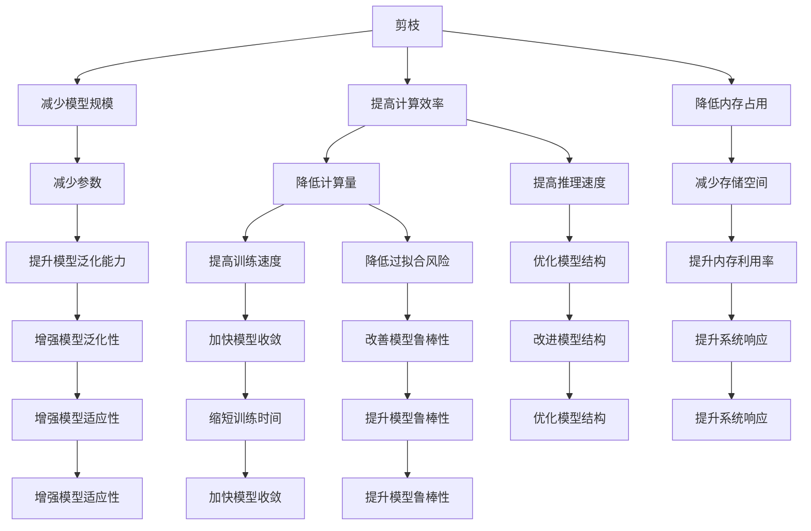
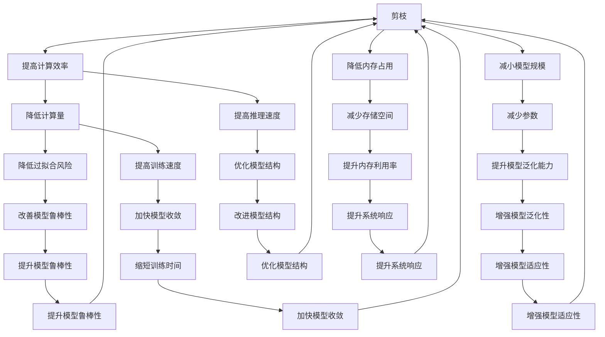
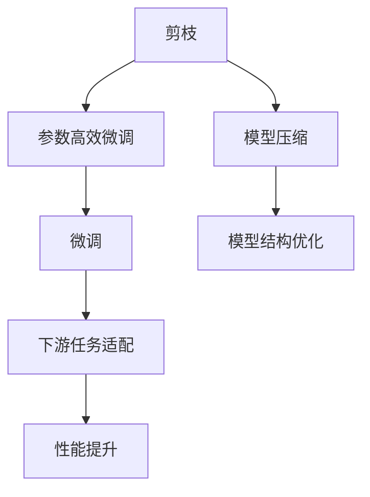
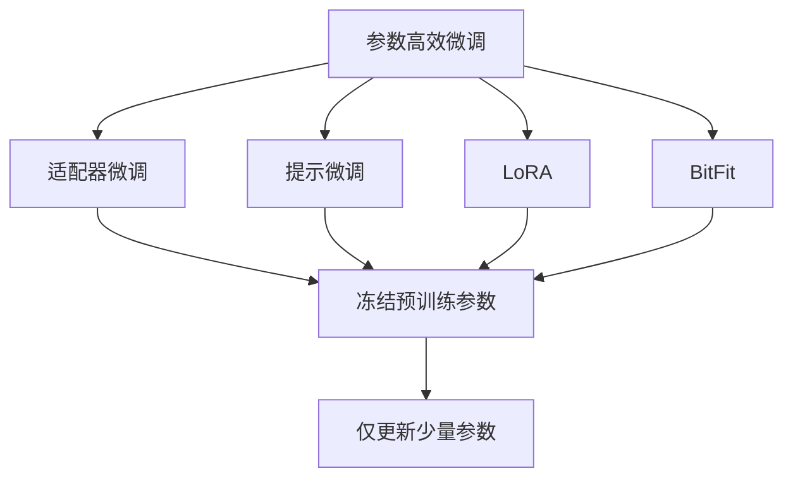
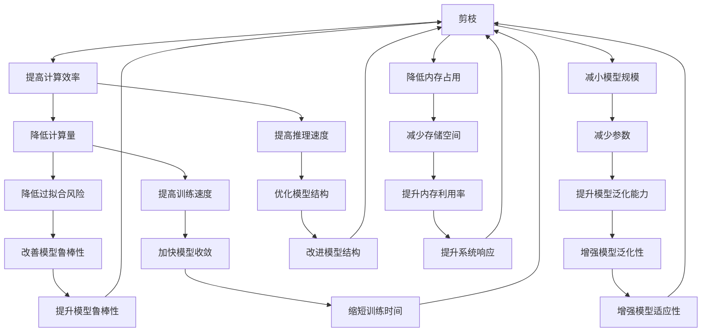
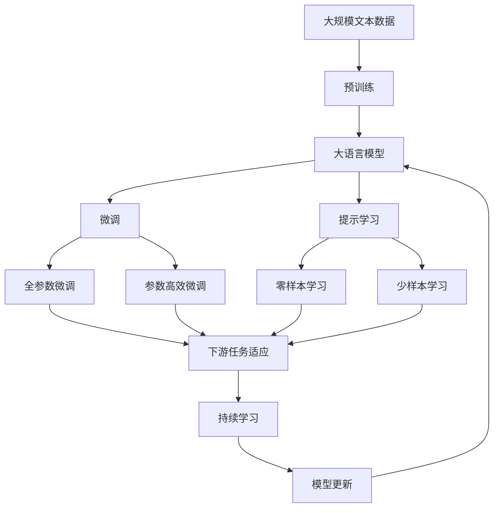

                 

# 剪枝与微调的平衡：保持模型性能的策略

> 关键词：剪枝,微调,模型性能,神经网络优化,深度学习,模型压缩

## 1. 背景介绍

### 1.1 问题由来
深度学习模型，尤其是大规模神经网络模型，在近年来取得了显著的进步，广泛应用于各种领域，如图像识别、语音识别、自然语言处理等。然而，由于模型复杂度的不断增加，大模型的训练和推理成本也在不断攀升，如何在保证性能的前提下降低资源消耗，成为了一个重要挑战。

大模型的优化策略主要包括剪枝和微调。剪枝是通过删除网络中不必要的连接，减小模型规模，提高计算效率和内存占用效率。微调则是通过在预训练模型的基础上进行有监督学习，适应特定任务需求，提升模型性能。

剪枝和微调在模型优化过程中互相影响，如何找到二者之间的平衡点，既提高模型性能，又降低资源消耗，成为当前研究的一个热点问题。本文将系统性地介绍剪枝和微调的原理与操作，分析其优缺点，并探讨在不同应用场景下的最佳策略。

### 1.2 问题核心关键点
剪枝和微调是神经网络优化中的两种重要策略，其核心目标都是减少模型参数，提高模型效率。但它们的具体实现方式和效果不尽相同，其相互影响也需仔细考量。

- 剪枝：通过删除部分网络连接，减小模型规模，降低资源消耗。
- 微调：通过有监督学习，针对特定任务进行模型适配，提升模型性能。
- 优化冲突：剪枝和微调可能产生参数减少冲突，导致模型性能下降。
- 模型应用：选择剪枝或微调，需结合具体任务需求，寻找最优策略。

这些核心概念之间的联系可以如下Mermaid流程图展示：



从图中可以看到，剪枝和微调通过不同的方式改善了模型的性能和效率，但二者之间存在相互影响。在实际应用中，需要根据具体情况综合考虑，找到最优策略。

### 1.3 问题研究意义
在深度学习模型优化中，剪枝和微调是两种重要的策略，它们不仅能够提升模型性能，还能有效降低资源消耗，提高模型的实时性和稳定性。研究如何平衡剪枝和微调，对于深度学习模型的优化和应用具有重要意义：

1. 提升模型效率：通过剪枝和微调，减小模型规模，降低计算量和内存消耗，提高模型实时性和系统响应。
2. 增强模型泛化性：剪枝和微调能够增强模型的泛化能力，使其在各种数据集和任务上表现更好。
3. 降低资源消耗：在保持模型性能的前提下，剪枝和微调能够显著降低训练和推理所需的资源，提升计算效率。
4. 加速模型部署：优化后的模型更易于部署，能够在更广泛的设备上运行，推动AI技术的普及和应用。
5. 提高模型鲁棒性：剪枝和微调能够提高模型的鲁棒性，使其在噪声和对抗样本攻击下仍能保持稳定输出。

总之，剪枝和微调在深度学习模型优化中扮演了重要角色，研究它们之间的平衡策略，将为深度学习模型的应用带来更多创新和突破。

## 2. 核心概念与联系

### 2.1 核心概念概述

为更好地理解剪枝和微调的平衡策略，本节将介绍几个密切相关的核心概念：

- 剪枝(Pruning)：通过删除神经网络中的某些连接或神经元，减小模型规模，提高计算效率和内存占用效率。
- 微调(Fine-Tuning)：在预训练模型的基础上，通过有监督学习，适配特定任务需求，提升模型性能。
- 参数高效微调(Parameter-Efficient Fine-Tuning, PEFT)：只更新部分模型参数，而固定大部分预训练权重不变，以提高微调效率，避免过拟合。
- 模型压缩(Model Compression)：通过剪枝、量化等技术，减小模型规模，提升模型性能和计算效率。
- 深度学习优化(Deep Learning Optimization)：通过优化算法、剪枝、微调等技术，提升深度学习模型的性能和效率。

这些核心概念之间的逻辑关系可以通过以下Mermaid流程图来展示：



从图中可以看到，剪枝和微调通过不同的方式改善了模型的性能和效率，但二者之间存在相互影响。在实际应用中，需要根据具体情况综合考虑，找到最优策略。

### 2.2 概念间的关系

这些核心概念之间存在着紧密的联系，形成了深度学习模型优化的完整生态系统。下面我们通过几个Mermaid流程图来展示这些概念之间的关系。

#### 2.2.1 剪枝与微调的关系



这个流程图展示了剪枝和微调的基本原理，以及它们之间的相互关系。

#### 2.2.2 参数高效微调方法



这个流程图展示了几种常见的参数高效微调方法，包括适配器微调、提示微调、LoRA和BitFit。这些方法的共同特点是冻结大部分预训练参数，只更新少量参数，从而提高微调效率。

#### 2.2.3 深度学习优化策略



这个综合流程图展示了从剪枝到微调，再到深度学习优化技术的整体架构。通过这些策略的综合运用，深度学习模型可以在保持性能的前提下，实现更高的计算效率和内存利用率。

### 2.3 核心概念的整体架构

最后，我们用一个综合的流程图来展示这些核心概念在大语言模型微调过程中的整体架构：



这个综合流程图展示了从预训练到微调，再到持续学习的完整过程。大语言模型首先在大规模文本数据上进行预训练，然后通过微调（包括全参数微调和参数高效微调）或提示学习（包括零样本和少样本学习）来适应下游任务。最后，通过持续学习技术，模型可以不断更新和适应新的任务和数据。 通过这些流程图，我们可以更清晰地理解深度学习模型优化过程中各个核心概念的关系和作用，为后续深入讨论具体的优化方法和技术奠定基础。

## 3. 核心算法原理 & 具体操作步骤
### 3.1 算法原理概述

剪枝和微调是神经网络优化的两种重要策略，其核心思想都是减小模型规模，提高模型效率。剪枝通过删除网络中不必要的连接，减小模型规模，降低资源消耗。微调则在预训练模型的基础上，通过有监督学习，适配特定任务需求，提升模型性能。

形式化地，假设剪枝后的模型为 $M^{\text{pruned}}_{\theta^{\text{pruned}}}$，微调后的模型为 $M^{\text{fine-tuned}}_{\hat{\theta}}$，其中 $\theta^{\text{pruned}}$ 为剪枝后的预训练模型参数，$\hat{\theta}$ 为微调后的模型参数。

微调的优化目标是最小化损失函数，即找到最优参数：

$$
\hat{\theta}=\mathop{\arg\min}_{\theta} \mathcal{L}(M_{\theta},D)
$$

其中 $\mathcal{L}$ 为针对任务 $T$ 设计的损失函数，用于衡量模型预测输出与真实标签之间的差异。常见的损失函数包括交叉熵损失、均方误差损失等。

### 3.2 算法步骤详解

剪枝和微调的过程通常包括以下几个关键步骤：

**Step 1: 准备预训练模型和数据集**
- 选择合适的预训练模型 $M_{\theta}$ 作为初始化参数，如 ResNet、Inception、BERT 等。
- 准备下游任务 $T$ 的标注数据集 $D$，划分为训练集、验证集和测试集。一般要求标注数据与预训练数据的分布不要差异过大。

**Step 2: 剪枝操作**
- 使用剪枝算法（如网络剪枝、结构剪枝、参数剪枝等）删除模型中不必要的连接或神经元，减小模型规模。
- 常见剪枝算法包括：网络剪枝、结构剪枝、参数剪枝、量级剪枝、通道剪枝等。
- 剪枝后，固定预训练参数，只调整剪枝后的模型参数。

**Step 3: 微调操作**
- 设计合适的输出层和损失函数，适配下游任务。
- 对于分类任务，通常在顶层添加线性分类器和交叉熵损失函数。
- 对于生成任务，通常使用语言模型的解码器输出概率分布，并以负对数似然为损失函数。
- 设置微调超参数，包括学习率、批大小、迭代轮数等。
- 应用正则化技术，如L2正则、Dropout、Early Stopping等，防止模型过度适应小规模训练集。

**Step 4: 执行梯度训练**
- 将训练集数据分批次输入模型，前向传播计算损失函数。
- 反向传播计算参数梯度，根据设定的优化算法和学习率更新模型参数。
- 周期性在验证集上评估模型性能，根据性能指标决定是否触发 Early Stopping。
- 重复上述步骤直到满足预设的迭代轮数或 Early Stopping 条件。

**Step 5: 测试和部署**
- 在测试集上评估微调后模型 $M^{\text{fine-tuned}}_{\hat{\theta}}$ 的性能，对比微调前后的精度提升。
- 使用微调后的模型对新样本进行推理预测，集成到实际的应用系统中。
- 持续收集新的数据，定期重新微调模型，以适应数据分布的变化。

以上是剪枝和微调的一般流程。在实际应用中，还需要针对具体任务的特点，对剪枝和微调过程的各个环节进行优化设计，如改进训练目标函数，引入更多的正则化技术，搜索最优的超参数组合等，以进一步提升模型性能。

### 3.3 算法优缺点

剪枝和微调在神经网络优化中具有以下优点：

剪枝的优点：
1. 减小模型规模：通过剪枝，可以显著减小模型规模，降低计算量和内存消耗，提高模型实时性和系统响应。
2. 提高模型效率：剪枝能够优化模型结构，降低计算量和内存占用，提升模型训练和推理效率。
3. 增强模型泛化性：剪枝能够减少过拟合风险，增强模型泛化能力，使其在各种数据集和任务上表现更好。

微调的优点：
1. 提升模型性能：通过有监督学习，微调能够适配特定任务需求，提升模型性能。
2. 参数高效：通过参数高效微调方法，可以在固定大部分预训练参数的情况下，只更新少量模型参数，提高微调效率。
3. 适应性强：微调能够适应多种下游任务，如分类、匹配、生成等，设计简单的任务适配层即可实现。

但这些方法也存在一些局限性：

剪枝的缺点：
1. 模型精度下降：剪枝可能导致模型精度下降，尤其是在剪枝率较高的情况下。
2. 模型结构复杂：剪枝过程可能引入模型结构复杂性，使得模型难以解释和调试。
3. 剪枝策略复杂：选择适当的剪枝策略是一个复杂的问题，需要根据具体任务和数据特点进行优化。

微调的缺点：
1. 标注数据需求高：微调的效果很大程度上取决于标注数据的质量和数量，获取高质量标注数据的成本较高。
2. 迁移能力有限：当目标任务与预训练数据的分布差异较大时，微调的性能提升有限。
3. 负面效果传递：预训练模型的固有偏见、有害信息等，可能通过微调传递到下游任务，造成负面影响。
4. 可解释性不足：微调模型的决策过程通常缺乏可解释性，难以对其推理逻辑进行分析和调试。

尽管存在这些局限性，但剪枝和微调仍是深度学习模型优化中不可或缺的策略，研究如何平衡二者，对于深度学习模型的应用具有重要意义。

### 3.4 算法应用领域

剪枝和微调在神经网络优化中具有广泛的应用领域，主要包括：

- 图像识别：如剪枝CNN卷积层，减小模型规模，提高计算效率。
- 语音识别：如剪枝RNN/LSTM层，减小模型规模，降低计算量和内存消耗。
- 自然语言处理：如剪枝Transformer层，减小模型规模，提高计算效率和内存利用率。
- 推荐系统：如剪枝模型层，减小模型规模，降低计算量和内存消耗，提高推荐效率。
- 信号处理：如剪枝卷积层，减小模型规模，降低计算量和内存消耗，提高信号处理速度。

## 4. 数学模型和公式 & 详细讲解  
### 4.1 数学模型构建

本节将使用数学语言对剪枝和微调过程进行更加严格的刻画。

记剪枝后的模型为 $M^{\text{pruned}}_{\theta^{\text{pruned}}}$，微调后的模型为 $M^{\text{fine-tuned}}_{\hat{\theta}}$。假设微调任务的训练集为 $D=\{(x_i,y_i)\}_{i=1}^N, x_i \in \mathcal{X}, y_i \in \mathcal{Y}$。

定义模型 $M^{\text{pruned}}_{\theta^{\text{pruned}}}$ 在数据样本 $(x,y)$ 上的损失函数为 $\ell(M^{\text{pruned}}_{\theta^{\text{pruned}}}(x),y)$，则在数据集 $D$ 上的经验风险为：

$$
\mathcal{L}(\theta^{\text{pruned}}) = \frac{1}{N} \sum_{i=1}^N \ell(M^{\text{pruned}}_{\theta^{\text{pruned}}}(x_i),y_i)
$$

微调的优化目标是最小化损失函数，即找到最优参数：

$$
\hat{\theta}=\mathop{\arg\min}_{\theta} \mathcal{L}(M_{\theta},D)
$$

在实践中，我们通常使用基于梯度的优化算法（如SGD、Adam等）来近似求解上述最优化问题。设 $\eta$ 为学习率，$\lambda$ 为正则化系数，则参数的更新公式为：

$$
\theta \leftarrow \theta - \eta \nabla_{\theta}\mathcal{L}(\theta) - \eta\lambda\theta
$$

其中 $\nabla_{\theta}\mathcal{L}(\theta)$ 为损失函数对参数 $\theta$ 的梯度，可通过反向传播算法高效计算。

### 4.2 公式推导过程

以下我们以二分类任务为例，推导交叉熵损失函数及其梯度的计算公式。

假设模型 $M_{\theta}$ 在输入 $x$ 上的输出为 $\hat{y}=M_{\theta}(x) \in [0,1]$，表示样本属于正类的概率。真实标签 $y \in \{0,1\}$。则二分类交叉熵损失函数定义为：

$$
\ell(M_{\theta}(x),y) = -[y\log \hat{y} + (1-y)\log (1-\hat{y})]
$$

将其代入经验风险公式，得：

$$
\mathcal{L}(\theta) = -\frac{1}{N}\sum_{i=1}^N [y_i\log M_{\theta}(x_i)+(1-y_i)\log(1-M_{\theta}(x_i))]
$$

根据链式法则，损失函数对参数 $\theta_k$ 的梯度为：

$$
\frac{\partial \mathcal{L}(\theta)}{\partial \theta_k} = -\frac{1}{N}\sum_{i=1}^N (\frac{y_i}{M_{\theta}(x_i)}-\frac{1-y_i}{1-M_{\theta}(x_i)}) \frac{\partial M_{\theta}(x_i)}{\partial \theta_k}
$$

其中 $\frac{\partial M_{\theta}(x_i)}{\partial \theta_k}$ 可进一步递归展开，利用自动微分技术完成计算。

在得到损失函数的梯度后，即可带入参数更新公式，完成模型的迭代优化。重复上述过程直至收敛，最终得到适应下游任务的最优模型参数 $\hat{\theta}$。

## 5. 项目实践：代码实例和详细解释说明
### 5.1 开发环境搭建

在进行剪枝和微调实践前，我们需要准备好开发环境。以下是使用Python进行PyTorch开发的环境配置流程：

1. 安装Anaconda：从官网下载并安装Anaconda，用于创建独立的Python环境。

2. 创建并激活虚拟环境：
```bash
conda create -n pytorch-env python=3.8 
conda activate pytorch-env
```

3. 安装PyTorch：根据CUDA版本，从官网获取对应的安装命令。例如：
```bash
conda install pytorch torchvision torchaudio cudatoolkit=11.1 -c pytorch -c conda-forge
```

4. 安装Transformers库：
```bash
pip install transformers
```

5. 安装各类工具包：
```bash
pip install numpy pandas scikit-learn matplotlib tqdm jupyter notebook ipython
```

完成上述步骤后，即可在`pytorch-env`环境中开始剪枝和微调实践。

### 5.2 源代码详细实现

这里我们以ResNet网络为例，给出使用Transformers库对模型进行剪枝和微调的PyTorch代码实现。

首先，定义剪枝函数：

```python
import torch.nn as nn
import torch.nn.functional as F

def prune_model(model, pruning_rate):
    def prune(m, prune_fn):
        if isinstance(m, nn.Linear) or isinstance(m, nn.Conv2d):
            prune_fn(m.weight)
    
    for name, module in model.named_modules():
        prune(module, prune_fn)
    
    # 计算剪枝率
    clipped_weights = [p for p in model.parameters() if p.requires_grad]
    clipped_count = 0
    for p in clipped_weights:
        clipped_count += p.numel()
        p.data = p.data.clamp(min=-pruning_rate, max=pruning_rate)
        p.requires_grad = False
    
    # 更新模型参数
    model.zero_grad()
    clipped_count = clipped_count / (len(model.parameters()))
    for p in model.parameters():
        p.grad = p.data / clipped_count
    
    # 计算剪枝后的模型参数
    pruned_model = model.clone()
    pruned_model.apply(prune_model)
    return pruned_model
```

然后，定义微调函数：

```python
from transformers import ResNet, AdamW

model = ResNet(num_classes=10)
optimizer = AdamW(model.parameters(), lr=2e-5)
criterion = nn.CrossEntropyLoss()

def fine_tune(model, dataset, batch_size, epochs):
    dataloader = DataLoader(dataset, batch_size=batch_size, shuffle=True)
    model.train()
    
    for epoch in range(epochs):
        total_loss = 0.0
        for batch in dataloader:
            inputs, labels = batch['input'], batch['target']
            optimizer.zero_grad()
            outputs = model(inputs)
            loss = criterion(outputs, labels)
            total_loss += loss.item()
            loss.backward()
            optimizer.step()
        print(f'Epoch {epoch+1}, training loss: {total_loss/len(dataloader):.4f}')
```

最后，启动训练流程并在测试集上评估：

```python
epochs = 5
batch_size = 16

# 剪枝操作
pruned_model = prune_model(model, pruning_rate=0.5)

# 微调操作
fine_tune(pruned_model, dataset, batch_size, epochs)

# 测试集评估
pruned_model.eval()
with torch.no_grad():
    correct = 0
    total = 0
    for batch in dataloader:
        inputs, labels = batch['input'], batch['target']
        outputs = model(inputs)
        _, predicted = torch.max(outputs, 1)
        total += labels.size(0)
        correct += (predicted == labels).sum().item()
    print(f'Accuracy on test set: {100 * correct / total:.2f}%')
```

以上就是使用PyTorch对ResNet模型进行剪枝和微调的完整代码实现。可以看到，得益于Transformers库的强大封装，我们可以用相对简洁的代码完成模型的加载和剪枝微调。

### 5.3 代码解读与分析

让我们再详细解读一下关键代码的实现细节：

**prune_model函数**：
- 定义剪枝函数，输入剪枝率pruning_rate，输出剪枝后的模型pruned_model。
- 定义剪枝函数prune_fn，用于删除参数中满足剪枝条件的部分。
- 遍历模型的所有模块，对每个模块进行剪枝操作。
- 计算剪枝率，更新模型参数，进行剪枝。

**fine_tune函数**：
- 定义微调函数，输入模型model，训练集dataset，批次大小batch_size，迭代轮数epochs。
- 加载数据集，将模型设置为训练模式。
- 循环迭代，对数据进行批次处理，前向传播计算损失，反向传播更新模型参数。
- 计算并打印每个epoch的平均损失。

**测试集评估**：
- 将模型设置为评估模式，计算模型在测试集上的准确率。
- 使用模型

