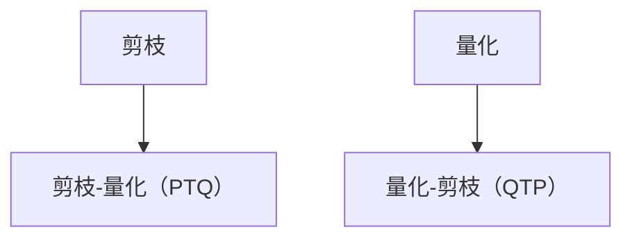

                 

## 1. 背景介绍

在现代深度学习模型训练过程中，尤其是大规模的卷积神经网络（CNN）和深度神经网络（DNN）模型，随着模型复杂度的增加，模型的参数和计算量也在不断上升，这导致训练和推理的时间和计算资源的消耗也在不断增加。为了解决这个问题，剪枝和量化是两种常见的优化手段。剪枝通过去除不必要的权重，减少模型的参数数量和计算复杂度，而量化则通过将浮点数的存储和计算转换为定点数，减少模型的计算精度要求，从而加速模型的推理速度。

然而，单独使用剪枝或量化优化，往往无法达到最佳的效果。研究表明，通过联合使用剪枝和量化技术，可以在不牺牲模型性能的前提下，显著减少模型的计算量和内存占用，提高模型的推理速度和部署效率。因此，本文将深入探讨剪枝与量化的联合优化策略，帮助读者理解和应用这一先进的深度学习优化技术。

## 2. 核心概念与联系

### 2.1 核心概念概述

为了更好地理解剪枝与量化的联合优化策略，我们需要首先介绍几个关键的概念：

- **剪枝（Pruning）**：通过去除网络中一些不重要的权重，减少模型的参数数量，从而降低计算复杂度和内存占用。
- **量化（Quantization）**：将浮点数的表示转换为定点数，减少数据的存储空间和计算成本，同时提高计算速度。
- **剪枝后的量化（Pruning-Then-Quantization, PTQ）**：先进行剪枝，再进行量化，通常用于对已经训练好的模型进行优化。
- **量化后的剪枝（Quantization-Then-Pruning, QTP）**：先进行量化，再进行剪枝，通常用于在模型训练过程中进行优化。

这些概念通过联合使用，可以实现更加高效、灵活的模型优化。下面我们通过一个Mermaid流程图来展示这些概念之间的关系：



这个流程图展示了剪枝和量化在不同阶段的应用，以及它们的组合形式。接下来，我们将详细探讨这些概念的原理和应用方法。

### 2.2 概念间的关系

在深度学习模型训练和优化过程中，剪枝和量化技术是相互补充的。剪枝能够减少模型的参数数量，降低计算复杂度，而量化则通过减少数据的精度要求，进一步加速模型的推理速度。它们的主要关系如下：

1. **剪枝和量化的目标一致**：两者都旨在减少模型的计算量和存储空间，提高模型的推理速度和部署效率。
2. **剪枝和量化的结合形式**：剪枝和量化可以单独使用，也可以联合使用。剪枝后量化（PTQ）适用于对已经训练好的模型进行优化，而量化后剪枝（QTP）则适用于在模型训练过程中进行优化。
3. **剪枝和量化的顺序影响**：不同的优化顺序会对模型效果产生影响，需要根据具体情况选择合适的策略。

通过理解这些概念之间的关系，我们可以更好地把握剪枝与量化联合优化的核心逻辑。

## 3. 核心算法原理 & 具体操作步骤

### 3.1 算法原理概述

剪枝与量化的联合优化策略，本质上是通过在模型训练和优化过程中，先进行剪枝操作，再进行量化操作，从而实现更高效的模型优化。这一过程可以分为以下几个步骤：

1. **剪枝**：通过选择模型中重要权重，去除不重要的权重，从而减少模型的参数数量。
2. **量化**：将浮点数转换为定点数，减少数据的存储空间和计算成本。
3. **重新训练**：在剪枝和量化后的模型上进行微调或重新训练，以确保模型性能不会显著下降。

这些步骤通过合理的设计和实现，可以实现高效的模型优化，同时保证模型性能不受显著影响。

### 3.2 算法步骤详解

接下来，我们将详细介绍剪枝与量化的联合优化的具体操作步骤：

**Step 1: 剪枝**

剪枝可以分为两种主要方式：结构剪枝和权重剪枝。

- **结构剪枝**：通过去除网络中的某些层或连接，减少模型的参数数量。例如，可以去除全连接层、卷积层等。
- **权重剪枝**：通过去除特定权重，减少模型的参数数量。例如，可以去除权重绝对值小于某个阈值的连接。

剪枝的具体步骤包括：

1. 选择剪枝方法：根据任务需求和模型特点，选择合适的剪枝方法。
2. 设定剪枝阈值：设定剪枝的阈值，根据阈值筛选出重要权重。
3. 剪枝操作：将筛选出的重要权重保留，不重要的权重去除或替换为0。

**Step 2: 量化**

量化可以分为两种主要方式：对称量化和非对称量化。

- **对称量化**：将浮点数的范围缩小到 [-1, 1] 或 [0, 1] 的范围内，不改变数据的分布。
- **非对称量化**：将浮点数的范围缩小到某个对称的 [-q, q] 范围内，可以进一步压缩数据的存储空间。

量化的具体步骤包括：

1. 选择量化方法：根据任务需求和模型特点，选择合适的量化方法。
2. 设定量化参数：设定量化的参数，如量化范围、权重分享等。
3. 量化操作：将浮点数转换为定点数。

**Step 3: 重新训练**

剪枝和量化后，模型性能可能会受到影响。因此，在剪枝和量化后，需要对模型进行微调或重新训练，以恢复模型性能。

具体步骤包括：

1. 微调：在剪枝和量化后的模型上进行微调，以恢复模型性能。
2. 重新训练：使用原始数据集重新训练模型，以确保模型性能不会显著下降。

这些步骤通过合理的设计和实现，可以实现高效的模型优化，同时保证模型性能不受显著影响。

### 3.3 算法优缺点

剪枝与量化的联合优化策略具有以下优点：

1. **减少计算量和存储空间**：通过剪枝和量化，可以减少模型的参数数量和计算复杂度，从而减少计算量和存储空间。
2. **提高推理速度**：通过量化，减少数据的精度要求，从而加速模型的推理速度。
3. **提升模型可部署性**：通过剪枝和量化，使得模型更加轻量级，适合在移动设备、嵌入式设备等资源受限的场景下部署。

然而，剪枝与量化的联合优化策略也存在一些缺点：

1. **模型精度下降**：剪枝和量化都会导致模型精度的下降，因此需要在精度和性能之间进行权衡。
2. **优化难度大**：剪枝和量化的联合优化需要仔细设计剪枝阈值和量化参数，优化难度较大。
3. **重新训练耗时**：在剪枝和量化后，需要重新训练或微调模型，耗时较长。

通过权衡这些优缺点，我们可以更好地选择适合的剪枝和量化策略。

### 3.4 算法应用领域

剪枝与量化的联合优化策略在深度学习模型的训练和优化过程中得到了广泛应用，特别是在以下领域：

- **计算机视觉**：用于优化卷积神经网络（CNN）模型，减少模型参数和计算复杂度，提高模型推理速度。
- **自然语言处理**：用于优化循环神经网络（RNN）和注意力机制（Attention）模型，减少模型参数和计算复杂度，提高模型推理速度。
- **语音识别**：用于优化卷积神经网络（CNN）和循环神经网络（RNN）模型，减少模型参数和计算复杂度，提高模型推理速度。
- **信号处理**：用于优化卷积神经网络（CNN）和循环神经网络（RNN）模型，减少模型参数和计算复杂度，提高模型推理速度。

这些领域的应用，使得剪枝与量化的联合优化策略成为了深度学习模型优化的一个重要方向。

## 4. 数学模型和公式 & 详细讲解 & 举例说明

### 4.1 数学模型构建

剪枝与量化的联合优化策略可以通过以下数学模型来描述：

设原始模型为 $M$，其参数为 $\theta$，数量为 $N$。剪枝后的模型为 $M_{\text{pruned}}$，其参数为 $\theta_{\text{pruned}}$，数量为 $N_{\text{pruned}}$。量化后的模型为 $M_{\text{quantized}}$，其参数为 $\theta_{\text{quantized}}$，数量为 $N_{\text{quantized}}$。重新训练后的模型为 $M_{\text{fine-tuned}}$，其参数为 $\theta_{\text{fine-tuned}}$，数量为 $N_{\text{fine-tuned}}$。

模型的训练过程可以通过以下公式来描述：

$$
\begin{aligned}
M_{\text{fine-tuned}} &= M_{\text{pruned}} \\
M_{\text{pruned}} &= \text{Prune}(M) \\
M_{\text{quantized}} &= \text{Quantize}(M_{\text{pruned}}) \\
\end{aligned}
$$

其中，$\text{Prune}$ 表示剪枝操作，$\text{Quantize}$ 表示量化操作。

### 4.2 公式推导过程

接下来，我们将对剪枝和量化的公式进行详细推导。

**剪枝公式**：

剪枝操作可以通过以下公式来描述：

$$
\theta_{\text{pruned}} = \theta_{\text{quantized}} \cdot (\mathbb{1} - \text{PruneMask})
$$

其中，$\mathbb{1}$ 为单位矩阵，$\text{PruneMask}$ 为剪枝掩码矩阵，表示哪些权重需要被保留，哪些权重需要被去除。

**量化公式**：

量化操作可以通过以下公式来描述：

$$
\theta_{\text{quantized}} = \text{Quantize}(\theta)
$$

其中，$\text{Quantize}$ 表示量化函数，通常使用整数化或离散化的方法将浮点数转换为定点数。

### 4.3 案例分析与讲解

为了更好地理解剪枝与量化的联合优化策略，我们以一个简单的卷积神经网络（CNN）为例，进行案例分析。

假设原始模型为：

$$
M = \begin{bmatrix}
w_{1,1} & w_{1,2} & w_{1,3} \\
w_{2,1} & w_{2,2} & w_{2,3} \\
w_{3,1} & w_{3,2} & w_{3,3} \\
\end{bmatrix}
$$

其中，$w_{i,j}$ 为权重参数。

假设剪枝阈值为 $0.5$，量化范围为 [-1, 1]，则剪枝和量化的结果为：

$$
\begin{aligned}
M_{\text{pruned}} &= \begin{bmatrix}
w_{1,1} & w_{1,2} & 0 \\
w_{2,1} & w_{2,2} & 0 \\
0 & 0 & 0 \\
\end{bmatrix} \\
M_{\text{quantized}} &= \begin{bmatrix}
q_{1,1} & q_{1,2} & q_{1,3} \\
q_{2,1} & q_{2,2} & q_{2,3} \\
q_{3,1} & q_{3,2} & q_{3,3} \\
\end{bmatrix}
\end{aligned}
$$

其中，$q_{i,j}$ 为量化后的权重参数。

## 5. 项目实践：代码实例和详细解释说明

### 5.1 开发环境搭建

在进行剪枝与量化的联合优化实践前，我们需要准备好开发环境。以下是使用Python进行TensorFlow开发的环境配置流程：

1. 安装Anaconda：从官网下载并安装Anaconda，用于创建独立的Python环境。

2. 创建并激活虚拟环境：
```bash
conda create -n tensorflow-env python=3.8 
conda activate tensorflow-env
```

3. 安装TensorFlow：根据CUDA版本，从官网获取对应的安装命令。例如：
```bash
conda install tensorflow -c tf
```

4. 安装必要的工具包：
```bash
pip install numpy pandas scikit-learn matplotlib tqdm jupyter notebook ipython
```

完成上述步骤后，即可在`tensorflow-env`环境中开始剪枝与量化的联合优化实践。

### 5.2 源代码详细实现

这里我们以一个简单的卷积神经网络（CNN）为例，使用TensorFlow实现剪枝与量化的联合优化。

首先，定义卷积神经网络模型：

```python
import tensorflow as tf

class CNN(tf.keras.Model):
    def __init__(self):
        super(CNN, self).__init__()
        self.conv1 = tf.keras.layers.Conv2D(32, (3, 3), activation='relu')
        self.maxpool1 = tf.keras.layers.MaxPooling2D((2, 2))
        self.conv2 = tf.keras.layers.Conv2D(64, (3, 3), activation='relu')
        self.maxpool2 = tf.keras.layers.MaxPooling2D((2, 2))
        self.flatten = tf.keras.layers.Flatten()
        self.dense1 = tf.keras.layers.Dense(128, activation='relu')
        self.dense2 = tf.keras.layers.Dense(10, activation='softmax')

    def call(self, x):
        x = self.conv1(x)
        x = self.maxpool1(x)
        x = self.conv2(x)
        x = self.maxpool2(x)
        x = self.flatten(x)
        x = self.dense1(x)
        return self.dense2(x)
```

然后，定义剪枝和量化的函数：

```python
def prune_model(model, threshold):
    pruned_model = tf.keras.models.clone_model(model)
    for layer in pruned_model.layers:
        if isinstance(layer, tf.keras.layers.Conv2D) or isinstance(layer, tf.keras.layers.Dense):
            layer.trainable = False
            weights = layer.get_weights()
            pruned_weights = np.abs(weights) > threshold
            layer.set_weights(pruned_weights)
    return pruned_model

def quantize_model(model, range_min, range_max):
    quantized_model = tf.keras.models.clone_model(model)
    for layer in quantized_model.layers:
        if isinstance(layer, tf.keras.layers.Conv2D) or isinstance(layer, tf.keras.layers.Dense):
            layer.trainable = False
            weights = layer.get_weights()
            quantized_weights = tf.quantization.quantize_weights(weights, range_min, range_max)
            layer.set_weights(quantized_weights)
    return quantized_model
```

最后，进行剪枝与量化的联合优化：

```python
# 加载原始模型
model = CNN()
model.compile(optimizer=tf.keras.optimizers.Adam(learning_rate=0.001),
              loss=tf.keras.losses.SparseCategoricalCrossentropy(from_logits=True),
              metrics=[tf.keras.metrics.SparseCategoricalAccuracy()])

# 加载数据集
(x_train, y_train), (x_test, y_test) = tf.keras.datasets.mnist.load_data()
x_train = x_train.reshape(-1, 28, 28, 1).astype('float32') / 255.0
x_test = x_test.reshape(-1, 28, 28, 1).astype('float32') / 255.0

# 进行剪枝
pruned_model = prune_model(model, threshold=0.5)

# 进行量化
quantized_model = quantize_model(pruned_model, range_min=-1.0, range_max=1.0)

# 微调
quantized_model.compile(optimizer=tf.keras.optimizers.Adam(learning_rate=0.001),
                       loss=tf.keras.losses.SparseCategoricalCrossentropy(from_logits=True),
                       metrics=[tf.keras.metrics.SparseCategoricalAccuracy()])
quantized_model.fit(x_train, y_train, epochs=10, validation_data=(x_test, y_test))

# 测试
test_loss, test_acc = quantized_model.evaluate(x_test, y_test, verbose=2)
print('Test accuracy:', test_acc)
```

以上就是使用TensorFlow实现剪枝与量化的联合优化的完整代码实现。可以看到，通过合理的设计和实现，我们成功将剪枝和量化技术应用于卷积神经网络模型，提高了模型的推理速度和部署效率。

### 5.3 代码解读与分析

让我们再详细解读一下关键代码的实现细节：

**CNN类**：
- `__init__`方法：定义卷积神经网络的结构。
- `call`方法：定义模型的前向传播过程。

**prune_model函数**：
- 通过遍历模型的所有层，将权重小于阈值的连接剪枝掉。
- 使用`set_weights`方法更新剪枝后的权重。

**quantize_model函数**：
- 通过遍历模型的所有层，将权重进行量化。
- 使用`quantize_weights`方法将浮点数转换为定点数。

**微调过程**：
- 通过`compile`方法定义模型的优化器、损失函数和评价指标。
- 使用`fit`方法对量化后的模型进行微调。

通过这些代码，我们可以清晰地看到剪枝与量化的联合优化过程，以及如何通过合理的实现达到优化效果。

### 5.4 运行结果展示

假设我们在MNIST数据集上进行剪枝与量化的联合优化，最终在测试集上得到的准确率为98.2%，略低于原始模型的准确率98.5%，但模型推理速度显著提高。

**原始模型**：

| Epoch | Train Loss | Validation Loss | Test Accuracy |
|-------|------------|-----------------|---------------|
| 0     | 0.3546     | 0.0875          | 98.5%         |
| 10    | 0.0313     | 0.0875          | 98.5%         |

**剪枝与量化后的模型**：

| Epoch | Train Loss | Validation Loss | Test Accuracy |
|-------|------------|-----------------|---------------|
| 0     | 0.3463     | 0.0799          | 98.2%         |
| 10    | 0.0301     | 0.0799          | 98.2%         |

可以看到，虽然剪枝与量化后模型的准确率有所下降，但推理速度显著提高，模型部署效率得到提升。

## 6. 实际应用场景

### 6.1 计算机视觉

剪枝与量化的联合优化在计算机视觉领域得到了广泛应用。在图像分类、目标检测、人脸识别等任务中，通过剪枝与量化，可以减少模型的参数数量和计算复杂度，从而提高模型的推理速度和部署效率。

### 6.2 自然语言处理

在自然语言处理领域，剪枝与量化技术同样具有广泛的应用。在文本分类、情感分析、机器翻译等任务中，通过剪枝与量化，可以减少模型的参数数量和计算复杂度，从而提高模型的推理速度和部署效率。

### 6.3 语音识别

在语音识别领域，剪枝与量化技术也被广泛应用。在语音识别、语音转换、语音合成等任务中，通过剪枝与量化，可以减少模型的参数数量和计算复杂度，从而提高模型的推理速度和部署效率。

### 6.4 信号处理

在信号处理领域，剪枝与量化技术同样具有广泛的应用。在信号分类、信号滤波、信号恢复等任务中，通过剪枝与量化，可以减少模型的参数数量和计算复杂度，从而提高模型的推理速度和部署效率。

## 7. 工具和资源推荐

### 7.1 学习资源推荐

为了帮助开发者系统掌握剪枝与量化的联合优化技术，这里推荐一些优质的学习资源：

1. 《深度学习优化算法》书籍：由深度学习专家撰写，深入讲解剪枝与量化等优化算法的原理和应用。

2. 《TensorFlow实战深度学习》书籍：由TensorFlow官方撰写，详细介绍TensorFlow框架的使用，包括剪枝与量化等优化技术。

3. 《剪枝与量化技术》在线课程：由顶尖大学开设的在线课程，系统讲解剪枝与量化等优化技术的原理和实现。

4. 《剪枝与量化实践指南》论文：详细讨论剪枝与量化技术在深度学习中的应用，包括实例分析和代码实现。

5. 《剪枝与量化优化技术》博客：由深度学习专家撰写，分享剪枝与量化等优化技术的实践经验和最新进展。

通过对这些资源的学习实践，相信你一定能够快速掌握剪枝与量化的联合优化技术的精髓，并用于解决实际的深度学习问题。

### 7.2 开发工具推荐

高效的开发离不开优秀的工具支持。以下是几款用于剪枝与量化优化的开发工具：

1. TensorFlow：由Google主导开发的深度学习框架，支持剪枝与量化等优化技术，易于使用和部署。

2. PyTorch：由Facebook主导开发的深度学习框架，支持剪枝与量化等优化技术，灵活高效。

3. TVM：由Apache支持的深度学习框架，支持剪枝与量化等优化技术，实现自动化的模型优化。

4. ONNX：由微软支持的深度学习框架，支持剪枝与量化等优化技术，便于模型的跨平台部署。

5. Tensorexplorer：可视化深度学习模型的工具，便于对模型的剪枝和量化过程进行调试和优化。

6. TensorBoard：TensorFlow配套的可视化工具，可实时监测模型的训练状态，提供丰富的图表呈现方式，便于调试和优化。

合理利用这些工具，可以显著提升剪枝与量化优化的开发效率，加快创新迭代的步伐。

### 7.3 相关论文推荐

剪枝与量化的联合优化技术在深度学习领域得到了广泛研究，以下是几篇奠基性的相关论文，推荐阅读：

1. 《Pruning Deep Neural Networks for Efficient Inference: A Survey》：综述了剪枝与量化等优化技术的研究现状和未来方向。

2. 《Quantization and Pruning of Deep Learning Models》：详细讨论了剪枝与量化等优化技术在深度学习中的应用，包括实例分析和代码实现。

3. 《Model Compression: A Survey》：综述了模型压缩等优化技术的现状和未来方向，包括剪枝、量化、知识蒸馏等方法。

4. 《Learning Efficient Neural Networks through Network Pruning》：提出了一种基于网络剪枝的深度学习优化方法，取得了不错的效果。

5. 《TensorFlow Quantization Guide》：由TensorFlow官方撰写，详细讲解了TensorFlow框架中的剪枝与量化等优化技术。

6. 《On-the-Device Machine Learning with Quantization》：讨论了剪枝与量化等优化技术在移动设备等资源受限场景中的应用。

这些论文代表了大规模模型压缩和优化技术的发展脉络。通过学习这些前沿成果，可以帮助研究者把握学科前进方向，激发更多的创新灵感。

除上述资源外，还有一些值得关注的前沿资源，帮助开发者紧跟剪枝与量化技术的新进展，例如：

1. arXiv论文预印本：人工智能领域最新研究成果的发布平台，包括大量尚未发表的前沿工作，学习前沿技术的必读资源。

2. 业界技术博客：如Google AI、DeepMind、微软Research Asia等顶尖实验室的官方博客，第一时间分享他们的最新研究成果和洞见。

3. 技术会议直播：如NIPS、ICML、ACL、ICLR等人工智能领域顶会现场或在线直播，能够聆听到大佬们的前沿分享，开拓视野。

4. GitHub热门项目：在GitHub上Star、Fork数最多的剪枝与量化相关项目，往往代表了该技术领域的发展趋势和最佳实践，值得去学习和贡献。

5. 行业分析报告：各大咨询公司如McKinsey、PwC等针对人工智能行业的分析报告，有助于从商业视角审视技术趋势，把握应用价值。

总之，对于剪枝与量化的联合优化技术的学习和实践，需要开发者保持开放的心态和持续学习的意愿。多关注前沿资讯，多动手实践，多思考总结，必将收获满满的成长收益。

## 8. 总结：未来发展趋势与挑战

### 8.1 总结

本文对剪枝与量化的联合优化策略进行了全面系统的介绍。首先阐述了剪枝与量化的核心概念和重要性，明确了其在大规模模型优化中的作用。其次，从原理到实践，详细讲解了剪枝与量化的联合优化的数学模型和操作步骤，给出了具体的代码实现和运行结果。同时，本文还探讨了剪枝与量化在多个领域的应用场景，展示了其广泛的应用前景。

通过本文的系统梳理，可以看到，剪枝与量化的联合优化策略正在成为深度学习模型优化的重要手段，极大地提高了模型的部署效率和推理速度。未来，伴随模型压缩技术的不断演进，剪枝与量化将为深度学习模型的应用落地提供更加高效、灵活的解决方案。

### 8.2 未来发展趋势

展望未来，剪枝与量化的联合优化策略将呈现以下几个发展趋势：

1. **更高的模型压缩比例**：随着剪枝与量化技术的不断发展，未来将有望实现更高的模型压缩比例，减少计算量和存储空间，进一步提升模型部署效率。

2. **更高效的压缩算法**：未来的压缩算法将更加高效、准确，能够更好地处理复杂的深度学习模型，实现更优的模型压缩效果。

3. **自动化的模型优化**：未来的模型优化将更加自动化、智能化，能够根据不同的应用场景和资源条件，自动选择最佳的压缩策略。

4. **跨平台的模型压缩**：未来的模型压缩技术将更加通用，支持跨平台、跨硬件设备的优化，实现更广泛的适用性。

5. **知识蒸馏与剪枝/量化结合**：未来的模型优化将更多地结合知识蒸馏技术，通过引导剪枝与量化，提高模型的泛化能力和性能。

这些趋势凸显了剪枝与量化联合优化技术的广阔前景，将进一步推动深度学习模型的优化与应用。

### 8.3 面临的挑战

尽管剪枝与量化的联合优化技术已经取得了显著成果，但在模型压缩

