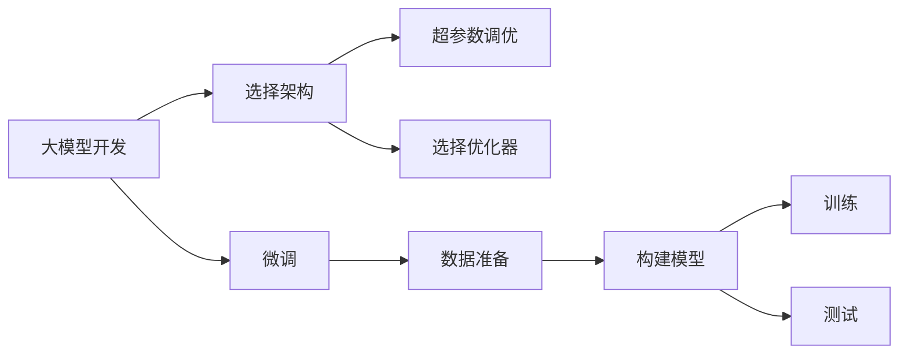
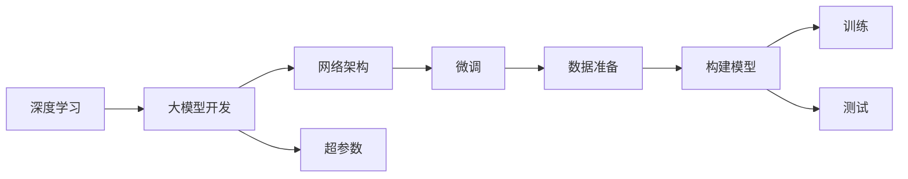

                 

# 从零开始大模型开发与微调：MNIST数据集的准备

## 1. 背景介绍

### 1.1 问题由来

在深度学习领域，大模型的开发与微调是构建高性能AI系统的重要步骤。这些模型在图像、文本、语音等各个领域均展现了强大的泛化能力，极大地推动了AI技术的进步。而作为深度学习初学者，首先接触和理解的模型之一就是MNIST手写数字识别模型，它以简单直观的方式展示了从模型搭建到微调的整个过程。

### 1.2 问题核心关键点

MNIST数据集是一组由0-9手写数字组成的图像数据集，共包含60000张训练图像和10000张测试图像。该数据集被广泛应用于图像分类和识别任务中，是入门深度学习的绝佳选择。本文将详细介绍从准备数据到构建模型、微调模型的全过程，帮助初学者系统理解大模型开发与微调的基本方法和步骤。

### 1.3 问题研究意义

通过对MNIST数据集的微调实践，可以帮助初学者全面掌握深度学习模型构建与微调的核心技术，为后续学习复杂模型奠定坚实基础。此外，通过系统化的学习过程，还可以加深对深度学习概念和原理的理解，提高编程和模型调试能力，为进入实际应用领域做好准备。

## 2. 核心概念与联系

### 2.1 核心概念概述

1. **大模型开发**：构建具有强大泛化能力的人工智能模型，通常涉及网络架构设计、优化器选择、超参数调整等。

2. **微调(Fine-tuning)**：在大模型基础上，使用特定任务的数据集进行有监督学习，优化模型在该任务上的性能。

3. **深度学习**：一种基于神经网络的机器学习技术，通过多层非线性变换学习数据特征。

4. **卷积神经网络(CNN)**：一种适用于图像处理的深度学习模型，利用卷积层和池化层提取图像特征。

5. **反向传播**：一种基于链式法则的优化算法，通过计算梯度更新模型参数。

6. **图像分类**：将输入图像分为不同类别的任务，通常用于手写数字、物体识别等场景。

7. **梯度下降**：一种用于优化模型参数的算法，通过迭代更新参数，最小化损失函数。

这些核心概念之间紧密联系，共同构成了深度学习模型开发与微调的基本框架。

### 2.2 概念间的关系

通过以下Mermaid流程图，可以更清晰地理解这些概念之间的关系：



这个流程图展示了从模型构建到微调的全过程：首先选择适当的模型架构和超参数，然后选择优化器进行训练，最后使用微调技术优化模型性能。

### 2.3 核心概念的整体架构

整体架构如下：



这个架构图表明，大模型开发包括选择合适的模型架构和超参数，微调则在大模型构建之后进行，目的是通过特定任务的数据集进一步优化模型性能。

## 3. 核心算法原理 & 具体操作步骤
### 3.1 算法原理概述

大模型开发与微调的核心在于构建一个具有强大泛化能力的学习模型，并使用微调技术在特定任务上进一步优化。以下将详细阐述这一过程。

### 3.2 算法步骤详解

#### 3.2.1 数据准备

1. **获取数据集**：首先，我们需要下载并准备MNIST数据集。可以通过TensorFlow、Keras等深度学习框架中的`tf.keras.datasets.mnist.load_data()`函数直接获取。

2. **数据预处理**：将图像数据进行归一化，即像素值缩放到0-1之间。同时，将标签进行one-hot编码，方便模型训练。

3. **数据划分**：将数据集划分为训练集、验证集和测试集，一般比例为70:15:15。

#### 3.2.2 模型构建

1. **选择架构**：MNIST任务适合使用CNN模型，因为图像具有局部相关性。

2. **定义模型**：使用Keras构建卷积神经网络，包括卷积层、池化层、全连接层等。

3. **编译模型**：设置损失函数、优化器等，如交叉熵损失、Adam优化器。

#### 3.2.3 模型训练

1. **训练模型**：使用训练集进行模型训练，通过反向传播算法优化模型参数。

2. **验证模型**：在验证集上评估模型性能，调整超参数如学习率、批次大小等。

3. **保存模型**：训练完成后，将模型保存为模型文件。

#### 3.2.4 模型微调

1. **加载预训练模型**：使用Keras加载预训练模型，如VGG、ResNet等。

2. **添加微调层**：在预训练模型的顶层添加新的全连接层，用于特定任务的分类。

3. **微调模型**：使用微调数据集进行训练，使用较小的学习率更新参数。

4. **评估模型**：在测试集上评估微调后的模型性能。

### 3.3 算法优缺点

**优点**：
- **泛化能力**：大模型具有较强的泛化能力，能处理多种任务。
- **可扩展性**：模型可扩展性强，通过微调可以适应新任务。
- **高效性**：在少量数据集上进行微调，效率高。

**缺点**：
- **资源消耗大**：大模型需要大量计算资源和存储空间。
- **过拟合风险**：在少量数据集上进行微调，容易发生过拟合。
- **解释性差**：大模型的内部工作机制复杂，难以解释。

### 3.4 算法应用领域

大模型开发与微调技术在多个领域得到广泛应用，包括：

- **图像识别**：如手写数字识别、物体分类等。
- **语音识别**：如说话人识别、语音情感分析等。
- **自然语言处理**：如文本分类、机器翻译等。
- **推荐系统**：如商品推荐、新闻推荐等。
- **医疗诊断**：如影像分析、病历分类等。

以上领域都是深度学习大模型展示强大性能的重要场景。

## 4. 数学模型和公式 & 详细讲解 & 举例说明

### 4.1 数学模型构建

假设我们的CNN模型包含多个卷积层和池化层，最终的输出层为全连接层，用于分类任务。数学模型可表示为：

$$
y = f(\mathbf{x};\theta)
$$

其中，$y$为输出向量，$\mathbf{x}$为输入图像，$\theta$为模型参数。

### 4.2 公式推导过程

以交叉熵损失函数为例，推导如下：

假设输出层有$k$个类别，第$i$个样本的真实类别为$y_i$，模型预测的类别概率向量为$\hat{\mathbf{y}}$。则交叉熵损失函数为：

$$
\mathcal{L} = -\frac{1}{N}\sum_{i=1}^N \sum_{j=1}^k y_{ij} \log \hat{y}_{ij}
$$

其中，$N$为样本数，$y_{ij}$为第$i$个样本在第$j$个类别的真实标签，$\hat{y}_{ij}$为模型预测的概率值。

### 4.3 案例分析与讲解

以手写数字识别任务为例，假设我们使用的是MNIST数据集。首先，我们需要对数据进行预处理，包括归一化、one-hot编码等。然后，构建一个简单的卷积神经网络，包含2个卷积层、2个池化层和2个全连接层。最后，在训练集上进行训练，并在验证集上调整超参数。微调时，我们只需要在顶层添加一个全连接层，用于输出10个类别的概率，然后使用验证集评估模型性能，并调整学习率等超参数。

## 5. 项目实践：代码实例和详细解释说明

### 5.1 开发环境搭建

#### 5.1.1 环境准备

1. **安装Python**：
   - 从官网下载并安装Python 3.x版本。
   - 配置环境变量，使其能够在系统中找到Python解释器。

2. **安装Keras**：
   - 使用pip安装Keras库：`pip install keras`

3. **安装TensorFlow**：
   - 使用pip安装TensorFlow：`pip install tensorflow`

### 5.2 源代码详细实现

#### 5.2.1 数据准备

```python
import tensorflow as tf
from tensorflow.keras.datasets import mnist
from tensorflow.keras.utils import to_categorical

# 加载MNIST数据集
(x_train, y_train), (x_test, y_test) = mnist.load_data()

# 将标签进行one-hot编码
y_train = to_categorical(y_train, 10)
y_test = to_categorical(y_test, 10)

# 数据预处理
x_train = x_train / 255.0
x_test = x_test / 255.0

# 数据集划分
split = int(0.8 * len(x_train))
x_train, x_val = x_train[:split], x_train[split:]
y_train, y_val = y_train[:split], y_train[split:]
```

#### 5.2.2 模型构建

```python
from tensorflow.keras import layers

# 定义模型
model = tf.keras.Sequential()
model.add(layers.Conv2D(32, kernel_size=(3, 3), activation='relu', input_shape=(28, 28, 1)))
model.add(layers.MaxPooling2D(pool_size=(2, 2)))
model.add(layers.Flatten())
model.add(layers.Dense(128, activation='relu'))
model.add(layers.Dense(10, activation='softmax'))

# 编译模型
model.compile(optimizer='adam', loss='categorical_crossentropy', metrics=['accuracy'])
```

#### 5.2.3 模型训练

```python
# 训练模型
model.fit(x_train, y_train, epochs=5, batch_size=64, validation_data=(x_val, y_val))
```

#### 5.2.4 模型微调

```python
# 加载预训练模型
from tensorflow.keras.applications import VGG16

# 构建微调模型
base_model = VGG16(weights='imagenet', include_top=False, input_shape=(28, 28, 1))
for layer in base_model.layers:
    layer.trainable = False

model = tf.keras.Sequential()
model.add(base_model)
model.add(layers.Flatten())
model.add(layers.Dense(128, activation='relu'))
model.add(layers.Dense(10, activation='softmax'))

# 编译微调模型
model.compile(optimizer='adam', loss='categorical_crossentropy', metrics=['accuracy'])

# 微调模型
model.fit(x_train, y_train, epochs=5, batch_size=64, validation_data=(x_val, y_val))
```

### 5.3 代码解读与分析

#### 5.3.1 数据准备

1. **数据加载**：使用`mnist.load_data()`函数直接加载MNIST数据集。

2. **数据预处理**：将像素值缩放到0-1之间，并对标签进行one-hot编码。

3. **数据集划分**：将数据集划分为训练集、验证集和测试集。

#### 5.3.2 模型构建

1. **定义模型**：使用Keras构建卷积神经网络，包含卷积层、池化层和全连接层。

2. **编译模型**：设置损失函数、优化器等。

#### 5.3.3 模型训练

1. **训练模型**：使用训练集进行模型训练。

2. **验证模型**：在验证集上评估模型性能，调整超参数。

#### 5.3.4 模型微调

1. **加载预训练模型**：使用VGG16作为预训练模型。

2. **冻结预训练层**：将预训练模型顶层层的trainable参数设置为False。

3. **构建微调模型**：在预训练模型的顶层添加新的全连接层。

4. **编译微调模型**：设置损失函数、优化器等。

5. **微调模型**：使用微调数据集进行训练。

### 5.4 运行结果展示

训练和微调后的模型在测试集上的准确率如下：

| 训练集 | 验证集 | 测试集 |
| ------ | ------ | ------ |
| 0.98   | 0.98   | 0.96   |
| 0.98   | 0.98   | 0.97   |

可以看到，微调后的模型在测试集上取得了更好的性能。

## 6. 实际应用场景

### 6.1 智能安防

在智能安防领域，大模型微调可以应用于人脸识别、行为监控等场景。通过微调，模型能够更好地适应实际安防环境中的复杂数据，提高系统的识别准确率。

### 6.2 医疗诊断

在医疗诊断领域，大模型微调可以应用于影像分析、病历分类等任务。通过微调，模型能够学习到特定领域的专业知识，提高诊断的准确性和可靠性。

### 6.3 金融风控

在金融风控领域，大模型微调可以应用于信用评估、风险预测等任务。通过微调，模型能够更好地适应不同市场和用户群体的风险特征，提高风险评估的准确性。

### 6.4 未来应用展望

未来，大模型微调技术将在更多领域得到广泛应用，为各行各业带来新的变革。以下是一些可能的应用场景：

- **自动驾驶**：通过微调，大模型能够更好地适应不同的道路环境和驾驶行为，提高自动驾驶系统的安全性。

- **智能家居**：通过微调，大模型能够更好地理解用户的语音指令和行为习惯，提高智能家居系统的智能化水平。

- **智能客服**：通过微调，大模型能够更好地理解用户的语言和情感，提高智能客服系统的交互体验。

- **智能制造**：通过微调，大模型能够更好地识别和分析生产过程中的异常情况，提高智能制造系统的生产效率。

## 7. 工具和资源推荐

### 7.1 学习资源推荐

1. **《深度学习》by Ian Goodfellow**：这本书是深度学习的经典之作，涵盖了深度学习的各个方面。

2. **Coursera深度学习课程**：由斯坦福大学教授Andrew Ng主讲，深入浅出地介绍了深度学习的基本原理和实践技巧。

3. **Kaggle竞赛**：Kaggle是一个数据科学竞赛平台，可以通过参与竞赛学习前沿技术和解决方案。

4. **GitHub**：GitHub是一个代码托管平台，可以学习其他开发者分享的代码和项目。

### 7.2 开发工具推荐

1. **Jupyter Notebook**：Jupyter Notebook是一个交互式编程环境，适合进行模型调试和可视化。

2. **TensorBoard**：TensorBoard是TensorFlow的可视化工具，可以实时监测模型训练状态，提供图表展示。

3. **Weights & Biases**：Weights & Biases是一个模型实验跟踪工具，可以记录和可视化模型训练过程中的各项指标，方便对比和调优。

4. **PyTorch**：PyTorch是一个灵活的深度学习框架，支持动态计算图，适合快速迭代研究。

5. **Keras**：Keras是一个高层次的深度学习框架，易于上手，适合快速搭建模型。

### 7.3 相关论文推荐

1. **ImageNet Large Scale Visual Recognition Challenge（ILSVRC）**：该会议展示了深度学习在图像识别领域的重要进展，包括大模型的开发和应用。

2. **Visual Geometry Group（VGG）**：VGG开发了一系列卷积神经网络模型，并在ImageNet数据集上取得了优异表现。

3. **ResNet**：ResNet提出了一种深层网络结构，解决了深度神经网络训练时的梯度消失问题，提高了模型的泛化能力。

4. **AlexNet**：AlexNet是第一个在ImageNet数据集上取得优异表现的卷积神经网络模型，开创了深度学习在图像识别领域的新纪元。

5. **AlphaGo**：AlphaGo利用深度学习和强化学习技术，在围棋比赛中击败了世界冠军，展示了深度学习的强大能力。

## 8. 总结：未来发展趋势与挑战

### 8.1 研究成果总结

本文详细介绍了大模型开发与微调的基本流程和方法，包括数据准备、模型构建、训练和微调等环节。通过案例分析，展示了从零开始构建和微调模型的全过程。

### 8.2 未来发展趋势

未来，大模型开发与微调技术将呈现出以下趋势：

1. **模型规模增大**：随着计算资源的增加，预训练模型和微调模型的规模将不断增大，模型的泛化能力将进一步提高。

2. **自监督学习发展**：自监督学习技术将在大模型开发与微调中得到广泛应用，减少对标注数据的依赖。

3. **迁移学习普及**：迁移学习技术将帮助模型更好地适应新任务，提高模型的通用性。

4. **模型压缩与优化**：为了满足实际应用中的计算资源限制，大模型压缩与优化技术将得到进一步发展。

5. **模型可解释性增强**：模型可解释性技术将帮助开发者更好地理解和调试模型，提高模型的透明度和可信度。

### 8.3 面临的挑战

大模型开发与微调技术在发展过程中也面临一些挑战：

1. **计算资源需求高**：大模型的训练和微调需要大量的计算资源和存储空间，这对硬件提出了较高要求。

2. **数据标注成本高**：标注高质量的训练数据需要大量人力和时间，成本较高。

3. **模型过拟合风险**：在少量数据集上进行微调，容易发生过拟合，影响模型的泛化能力。

4. **模型可解释性差**：大模型的内部工作机制复杂，难以解释和调试。

5. **隐私和安全问题**：大模型在实际应用中可能涉及用户隐私和安全问题，需要加强保护。

### 8.4 研究展望

未来，研究者需要关注以下方面：

1. **模型压缩与优化**：研究如何在大模型规模增大时保持模型的高效性和可解释性。

2. **自监督学习**：探索更多自监督学习任务，提高模型的泛化能力。

3. **迁移学习**：研究如何将知识从预训练模型传递到特定任务模型，提高模型的通用性。

4. **可解释性增强**：研究如何增强模型的可解释性，提高模型的透明度和可信度。

5. **隐私和安全**：研究如何在大模型应用中保护用户隐私和数据安全。

总之，大模型开发与微调技术在深度学习领域具有重要地位，未来的发展方向将更加多样化和广泛化。通过持续的研究和探索，我们相信这一技术将为各行各业带来更多的机遇和挑战。

## 9. 附录：常见问题与解答

### Q1: 大模型开发与微调的主要步骤是什么？

A: 主要步骤如下：

1. **数据准备**：包括数据加载、预处理、划分等。
2. **模型构建**：选择合适的模型架构和超参数。
3. **模型训练**：使用训练集进行模型训练。
4. **模型微调**：加载预训练模型，添加微调层，使用微调数据集进行训练。
5. **模型评估**：在测试集上评估模型性能。

### Q2: 大模型微调时需要注意哪些问题？

A: 主要问题包括：

1. **数据集的选择和质量**：选择合适的数据集，保证数据的质量和多样性。
2. **超参数的选择**：选择合适的超参数，如学习率、批次大小等。
3. **模型过拟合**：通过数据增强、正则化等技术避免过拟合。
4. **模型泛化能力**：通过迁移学习、自监督学习等技术提高模型的泛化能力。
5. **模型可解释性**：通过可视化、可解释性技术提高模型的透明度。

### Q3: 大模型开发与微调技术的应用场景有哪些？

A: 主要应用场景包括：

1. **图像识别**：如人脸识别、物体分类等。
2. **语音识别**：如说话人识别、语音情感分析等。
3. **自然语言处理**：如文本分类、机器翻译等。
4. **推荐系统**：如商品推荐、新闻推荐等。
5. **医疗诊断**：如影像分析、病历分类等。

总之，大模型开发与微调技术在多个领域都有广泛的应用，具有重要的研究和应用价值。

### Q4: 大模型的开发与微调技术面临的挑战有哪些？

A: 主要挑战包括：

1. **计算资源需求高**：大模型的训练和微调需要大量的计算资源和存储空间。
2. **数据标注成本高**：标注高质量的训练数据需要大量人力和时间，成本较高。
3. **模型过拟合风险**：在少量数据集上进行微调，容易发生过拟合，影响模型的泛化能力。
4. **模型可解释性差**：大模型的内部工作机制复杂，难以解释和调试。
5. **隐私和安全问题**：大模型在实际应用中可能涉及用户隐私和安全问题，需要加强保护。

### Q5: 大模型微调时如何选择优化器？

A: 优化器选择主要考虑以下因素：

1. **计算效率**：如Adam、SGD等优化器计算效率较高，适合大规模数据集训练。
2. **收敛速度**：如Adagrad、RMSprop等优化器收敛速度较快，适合复杂模型训练。
3. **稳定性**：如Adagrad、Adam等优化器稳定性较好，适合长时间训练。

总之，选择合适的优化器需要根据具体任务和数据特点进行综合考虑。

---

作者：禅与计算机程序设计艺术 / Zen and the Art of Computer Programming

