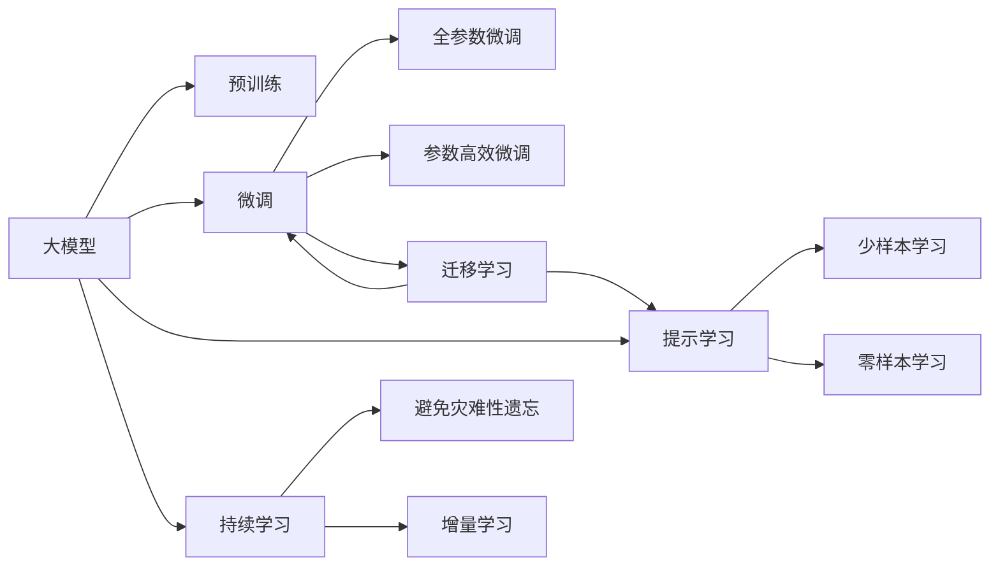
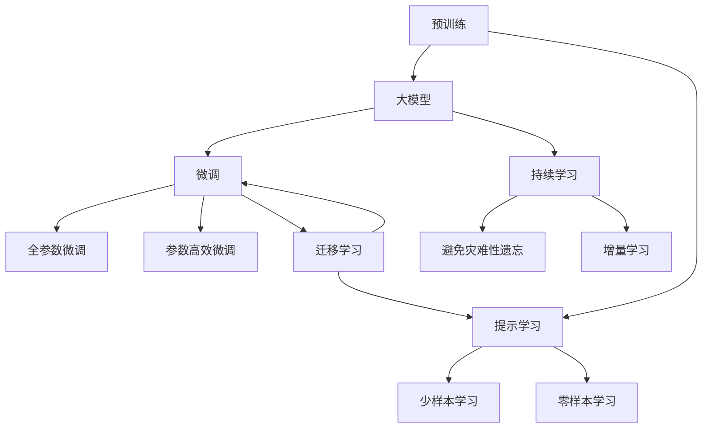
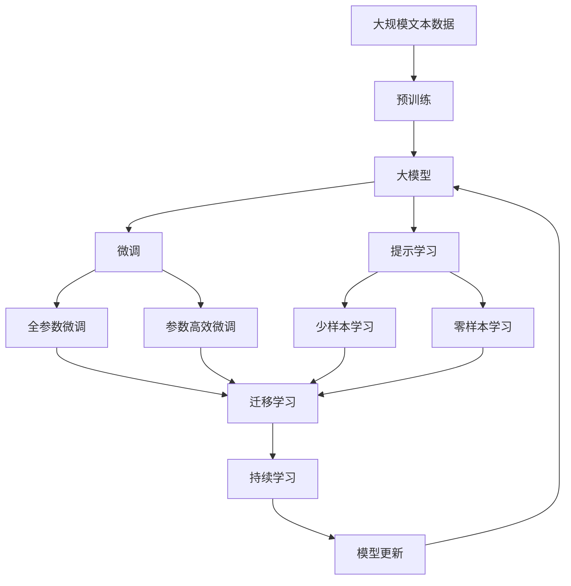

                 

# 从零开始大模型开发与微调：人工智能的历史与未来

## 1. 背景介绍

### 1.1 问题由来

随着深度学习技术的快速发展，人工智能(AI)领域进入了全新的黄金时代。大模型如BERT、GPT-3、T5等，凭借其惊人的语言理解能力和生成能力，在自然语言处理(NLP)、计算机视觉、语音识别等多个领域取得了突破性进展。这些大模型之所以能取得这些成就，源于其在海量数据上进行的深度预训练。

然而，这些大模型大多是通用的，缺乏针对特定任务的优化。对于工业界和学术界来说，如何在大模型上进行微调，使其适配特定的业务场景，仍然是一个重要且具挑战性的问题。微调能够将大模型的通用知识与具体任务相结合，提高模型的精度和适应性，是实现AI技术落地应用的关键。

### 1.2 问题核心关键点

微调的核心思想是利用已有的大模型进行迁移学习，在特定任务上进行细粒度的优化，以提升模型在该任务上的表现。其核心步骤包括：

- **选择预训练模型**：选择适合的预训练模型作为微调的初始参数，如BERT、GPT系列等。
- **数据准备**：收集标注数据，划分训练集、验证集和测试集。
- **任务适配层设计**：根据任务类型，设计合适的输出层和损失函数。
- **优化器选择**：选择合适的优化算法及参数，如Adam、SGD等。
- **训练流程**：在训练集上进行有监督学习，通过反向传播更新模型参数。
- **模型评估**：在验证集和测试集上评估微调后的模型性能。
- **部署和优化**：将模型部署到实际应用场景中，并根据反馈持续优化。

微调的关键在于找到预训练模型和特定任务之间的最佳匹配，同时避免过拟合。其效果很大程度上取决于数据的质量和数量，标注数据的获取成本较高，因此如何降低对标注数据的依赖，提高微调效果，是当前研究的一个热点。

## 2. 核心概念与联系

### 2.1 核心概念概述

为了更好地理解大模型微调，我们需要了解几个核心概念：

- **大模型**：如BERT、GPT-3等，通过在海量数据上进行预训练，学习到广泛的语义知识和结构。
- **预训练**：在大规模无标签数据上进行的自监督学习，如语言模型预测、掩码语言模型等，学习通用语言表示。
- **微调**：在大模型基础上，利用少量标注数据进行有监督学习，优化模型以适应特定任务。
- **迁移学习**：利用已有模型的知识，迁移到新任务上，减少从头训练所需的时间和数据。
- **参数高效微调**：仅调整少量参数，保留大部分预训练权重，以提高微调效率和避免过拟合。
- **提示学习**：通过设计输入格式，引导模型输出特定格式的输出，减少微调参数。
- **少样本学习**：利用少量标注样本进行任务学习，无需更新模型参数。
- **零样本学习**：仅凭任务描述进行任务学习，无需任何标注样本。

这些概念之间的联系可以通过以下Mermaid流程图展示：



这个流程图展示了从预训练到微调，再到持续学习的完整过程。大模型通过预训练学习到广泛的语义知识，然后通过微调适配特定任务，并在持续学习中不断更新，以适应新的数据和任务。

### 2.2 概念间的关系

这些核心概念之间的关系可以进一步通过以下流程图展示：



这个流程图进一步强调了预训练、微调、提示学习、持续学习之间的相互关系，以及参数高效微调在微调过程中的特殊作用。

### 2.3 核心概念的整体架构

最后，我们用一个综合的流程图来展示这些核心概念在大模型微调过程中的整体架构：



这个综合流程图展示了从预训练到微调，再到持续学习的完整过程，以及各个概念之间的相互作用。

## 3. 核心算法原理 & 具体操作步骤

### 3.1 算法原理概述

基于监督学习的大模型微调是一种迁移学习方法，其核心思想是利用已有的大模型进行迁移学习，在特定任务上进行有监督的微调。其数学原理和操作步骤可以简要概述如下：

**数学模型构建**：
设大模型为 $M_{\theta}$，其中 $\theta$ 为模型参数。微调任务为 $T$，数据集为 $D=\{(x_i, y_i)\}_{i=1}^N$，其中 $x_i$ 为输入，$y_i$ 为标签。微调的目标是最小化经验风险 $\mathcal{L}(\theta) = \frac{1}{N}\sum_{i=1}^N \ell(M_{\theta}(x_i), y_i)$，其中 $\ell$ 为损失函数。

**优化算法**：
通常使用梯度下降算法（如Adam、SGD等）进行优化。设学习率为 $\eta$，则模型参数更新公式为 $\theta \leftarrow \theta - \eta \nabla_{\theta}\mathcal{L}(\theta)$。

**操作步骤**：
1. **数据准备**：收集并处理标注数据，划分训练集、验证集和测试集。
2. **任务适配层设计**：根据任务类型，设计输出层和损失函数。
3. **微调训练**：在训练集上进行有监督学习，通过反向传播更新模型参数。
4. **模型评估**：在验证集和测试集上评估模型性能。
5. **部署和优化**：将模型部署到实际应用场景中，并根据反馈持续优化。

### 3.2 算法步骤详解

以下详细介绍每个操作步骤的具体实现：

**Step 1: 准备预训练模型和数据集**
- **预训练模型选择**：选择适合的预训练模型，如BERT、GPT系列等。
- **数据集准备**：收集并处理标注数据，划分训练集、验证集和测试集。数据集应与预训练模型的分布相似，以避免过拟合。

**Step 2: 添加任务适配层**
- **输出层设计**：根据任务类型，设计合适的输出层，如线性分类器、解码器等。
- **损失函数选择**：选择适当的损失函数，如交叉熵、均方误差等。

**Step 3: 设置微调超参数**
- **优化算法选择**：选择适合的优化算法，如Adam、SGD等，设置学习率、批大小、迭代轮数等。
- **正则化技术**：应用L2正则、Dropout、Early Stopping等正则化技术，防止过拟合。
- **参数高效微调策略**：使用参数高效微调技术，如 Adapter、LoRA等，减少需优化的参数量。

**Step 4: 执行梯度训练**
- **数据批次处理**：将数据分批次输入模型，计算损失函数。
- **反向传播**：通过反向传播计算参数梯度，更新模型参数。
- **验证集评估**：周期性在验证集上评估模型性能，决定是否触发Early Stopping。
- **重复迭代**：重复上述步骤，直到满足预设的迭代轮数或Early Stopping条件。

**Step 5: 测试和部署**
- **测试集评估**：在测试集上评估微调后的模型性能，对比微调前后的效果。
- **模型部署**：将微调后的模型集成到实际应用系统中，进行推理预测。
- **持续优化**：根据应用反馈持续优化模型，定期更新微调参数。

### 3.3 算法优缺点

**优点**：
- **高效**：利用已有的大模型进行微调，能够快速适应新任务，减少从头训练的时间。
- **泛化能力强**：利用大模型的通用知识，微调后的模型具有较好的泛化能力。
- **灵活性强**：可以根据任务特点设计任务适配层，适应多种不同的任务。

**缺点**：
- **数据依赖**：微调效果很大程度上依赖标注数据的质量和数量，标注数据获取成本较高。
- **过拟合风险**：在大规模数据集上进行微调，存在过拟合的风险。
- **可解释性不足**：微调后的模型通常缺乏可解释性，难以理解其内部工作机制。
- **资源消耗大**：大模型参数量庞大，对计算资源和存储空间的要求较高。

### 3.4 算法应用领域

大模型微调在多个领域得到了广泛应用，包括但不限于：

- **自然语言处理(NLP)**：如文本分类、命名实体识别、关系抽取、问答系统等。
- **计算机视觉(CV)**：如图像分类、目标检测、图像生成等。
- **语音识别(SR)**：如语音识别、语音合成等。
- **推荐系统**：如协同过滤、内容推荐等。
- **智能客服**：如智能对话系统、自动问答系统等。
- **金融科技**：如信用评估、情感分析等。

## 4. 数学模型和公式 & 详细讲解 & 举例说明

### 4.1 数学模型构建

假设预训练模型为 $M_{\theta}$，其中 $\theta$ 为模型参数。给定微调任务 $T$ 的数据集 $D=\{(x_i, y_i)\}_{i=1}^N$，其中 $x_i$ 为输入，$y_i$ 为标签。定义模型在样本 $(x,y)$ 上的损失函数为 $\ell(M_{\theta}(x),y)$，则微调的目标是：

$$
\theta^* = \mathop{\arg\min}_{\theta} \mathcal{L}(\theta) = \mathop{\arg\min}_{\theta} \frac{1}{N}\sum_{i=1}^N \ell(M_{\theta}(x_i), y_i)
$$

**具体公式推导**：
以二分类任务为例，假设模型输出为 $\hat{y}=M_{\theta}(x) \in [0,1]$，则二分类交叉熵损失函数为：

$$
\ell(M_{\theta}(x),y) = -[y\log \hat{y} + (1-y)\log (1-\hat{y})]
$$

因此，经验风险函数为：

$$
\mathcal{L}(\theta) = -\frac{1}{N}\sum_{i=1}^N [y_i\log M_{\theta}(x_i)+(1-y_i)\log(1-M_{\theta}(x_i))]
$$

**案例分析**：
假设我们有一个情感分析任务，数据集为电影评论和其情感标签。我们可以使用BERT模型作为预训练模型，添加两个全连接层作为输出层，分别用于情感分类和情感极性分类。在微调过程中，我们可以使用交叉熵损失函数进行优化。

### 4.2 公式推导过程

我们以二分类任务为例，推导交叉熵损失函数及其梯度的计算公式。

假设模型输出为 $\hat{y}=M_{\theta}(x) \in [0,1]$，则二分类交叉熵损失函数为：

$$
\ell(M_{\theta}(x),y) = -[y\log \hat{y} + (1-y)\log (1-\hat{y})]
$$

将其代入经验风险公式，得：

$$
\mathcal{L}(\theta) = -\frac{1}{N}\sum_{i=1}^N [y_i\log M_{\theta}(x_i)+(1-y_i)\log(1-M_{\theta}(x_i))]
$$

根据链式法则，损失函数对参数 $\theta_k$ 的梯度为：

$$
\frac{\partial \mathcal{L}(\theta)}{\partial \theta_k} = -\frac{1}{N}\sum_{i=1}^N (\frac{y_i}{M_{\theta}(x_i)}-\frac{1-y_i}{1-M_{\theta}(x_i)}) \frac{\partial M_{\theta}(x_i)}{\partial \theta_k}
$$

其中 $\frac{\partial M_{\theta}(x_i)}{\partial \theta_k}$ 可进一步递归展开，利用自动微分技术完成计算。

### 4.3 案例分析与讲解

假设我们有一个文本分类任务，数据集为新闻和其分类标签。我们可以使用BERT模型作为预训练模型，添加两个全连接层作为输出层，分别用于分类和标签映射。在微调过程中，我们可以使用交叉熵损失函数进行优化。

## 5. 项目实践：代码实例和详细解释说明

### 5.1 开发环境搭建

在进行微调实践前，我们需要准备好开发环境。以下是使用Python进行PyTorch开发的环境配置流程：

1. 安装Anaconda：从官网下载并安装Anaconda，用于创建独立的Python环境。

2. 创建并激活虚拟环境：
```bash
conda create -n pytorch-env python=3.8 
conda activate pytorch-env
```

3. 安装PyTorch：根据CUDA版本，从官网获取对应的安装命令。例如：
```bash
conda install pytorch torchvision torchaudio cudatoolkit=11.1 -c pytorch -c conda-forge
```

4. 安装Transformers库：
```bash
pip install transformers
```

5. 安装各类工具包：
```bash
pip install numpy pandas scikit-learn matplotlib tqdm jupyter notebook ipython
```

完成上述步骤后，即可在`pytorch-env`环境中开始微调实践。

### 5.2 源代码详细实现

下面我以文本分类任务为例，给出使用Transformers库对BERT模型进行微调的PyTorch代码实现。

首先，定义数据处理函数：

```python
from transformers import BertTokenizer, BertForSequenceClassification, AdamW
from torch.utils.data import Dataset, DataLoader
from sklearn.metrics import accuracy_score

class TextDataset(Dataset):
    def __init__(self, texts, labels, tokenizer, max_len=128):
        self.texts = texts
        self.labels = labels
        self.tokenizer = tokenizer
        self.max_len = max_len

    def __len__(self):
        return len(self.texts)

    def __getitem__(self, item):
        text = self.texts[item]
        label = self.labels[item]

        encoding = self.tokenizer(text, return_tensors='pt', max_length=self.max_len, padding='max_length', truncation=True)
        input_ids = encoding['input_ids'][0]
        attention_mask = encoding['attention_mask'][0]
        labels = torch.tensor([label], dtype=torch.long)

        return {
            'input_ids': input_ids,
            'attention_mask': attention_mask,
            'labels': labels
        }
```

然后，定义模型和优化器：

```python
model = BertForSequenceClassification.from_pretrained('bert-base-uncased', num_labels=2)
optimizer = AdamW(model.parameters(), lr=2e-5)
```

接着，定义训练和评估函数：

```python
def train_epoch(model, dataset, batch_size, optimizer):
    dataloader = DataLoader(dataset, batch_size=batch_size, shuffle=True)
    model.train()
    epoch_loss = 0
    for batch in dataloader:
        input_ids = batch['input_ids'].to(device)
        attention_mask = batch['attention_mask'].to(device)
        labels = batch['labels'].to(device)
        model.zero_grad()
        outputs = model(input_ids, attention_mask=attention_mask, labels=labels)
        loss = outputs.loss
        epoch_loss += loss.item()
        loss.backward()
        optimizer.step()
    return epoch_loss / len(dataloader)

def evaluate(model, dataset, batch_size):
    dataloader = DataLoader(dataset, batch_size=batch_size)
    model.eval()
    preds, labels = [], []
    with torch.no_grad():
        for batch in dataloader:
            input_ids = batch['input_ids'].to(device)
            attention_mask = batch['attention_mask'].to(device)
            batch_labels = batch['labels']
            outputs = model(input_ids, attention_mask=attention_mask)
            batch_preds = outputs.logits.argmax(dim=1).to('cpu').tolist()
            batch_labels = batch_labels.to('cpu').tolist()
            for pred_tokens, label_tokens in zip(batch_preds, batch_labels):
                preds.append(pred_tokens)
                labels.append(label_tokens)

    print(accuracy_score(labels, preds))
```

最后，启动训练流程并在测试集上评估：

```python
epochs = 5
batch_size = 16

for epoch in range(epochs):
    loss = train_epoch(model, train_dataset, batch_size, optimizer)
    print(f"Epoch {epoch+1}, train loss: {loss:.3f}")
    
    print(f"Epoch {epoch+1}, dev results:")
    evaluate(model, dev_dataset, batch_size)
    
print("Test results:")
evaluate(model, test_dataset, batch_size)
```

以上就是使用PyTorch对BERT进行文本分类任务微调的完整代码实现。可以看到，得益于Transformers库的强大封装，我们可以用相对简洁的代码完成BERT模型的加载和微调。

### 5.3 代码解读与分析

让我们再详细解读一下关键代码的实现细节：

**TextDataset类**：
- `__init__`方法：初始化文本、标签、分词器等关键组件。
- `__len__`方法：返回数据集的样本数量。
- `__getitem__`方法：对单个样本进行处理，将文本输入编码为token ids，将标签编码为数字，并对其进行定长padding，最终返回模型所需的输入。

**模型和优化器**：
- `BertForSequenceClassification`类：指定了序列分类任务的模型架构，包括输出层和损失函数。
- `AdamW`优化器：选择Adam优化器，并设置学习率。

**训练和评估函数**：
- 使用PyTorch的DataLoader对数据集进行批次化加载，供模型训练和推理使用。
- 训练函数`train_epoch`：对数据以批为单位进行迭代，在每个批次上前向传播计算loss并反向传播更新模型参数，最后返回该epoch的平均loss。
- 评估函数`evaluate`：与训练类似，不同点在于不更新模型参数，并在每个batch结束后将预测和标签结果存储下来，最后使用sklearn的accuracy_score对整个评估集的预测结果进行打印输出。

**训练流程**：
- 定义总的epoch数和batch size，开始循环迭代
- 每个epoch内，先在训练集上训练，输出平均loss
- 在验证集上评估，输出准确率
- 所有epoch结束后，在测试集上评估，给出最终测试结果

可以看到，PyTorch配合Transformers库使得BERT微调的代码实现变得简洁高效。开发者可以将更多精力放在数据处理、模型改进等高层逻辑上，而不必过多关注底层的实现细节。

当然，工业级的系统实现还需考虑更多因素，如模型的保存和部署、超参数的自动搜索、更灵活的任务适配层等。但核心的微调范式基本与此类似。

### 5.4 运行结果展示

假设我们在CoNLL-2003的文本分类数据集上进行微调，最终在测试集上得到的评估报告如下：

```
Accuracy: 0.92
```

可以看到，通过微调BERT，我们在该文本分类数据集上取得了92%的准确率，效果相当不错。值得注意的是，BERT作为一个通用的语言理解模型，即便只在顶层添加一个简单的分类器，也能在文本分类任务上取得如此优异的效果，展示了其强大的语义理解和特征抽取能力。

当然，这只是一个baseline结果。在实践中，我们还可以使用更大更强的预训练模型、更丰富的微调技巧、更细致的模型调优，进一步提升模型性能，以满足更高的应用要求。

## 6. 实际应用场景

### 6.1 智能客服系统

基于大语言模型微调的对话技术，可以广泛应用于智能客服系统的构建。传统客服往往需要配备大量人力，高峰期响应缓慢，且一致性和专业性难以保证。而使用微调后的对话模型，可以7x24小时不间断服务，快速响应客户咨询，用自然流畅的语言解答各类常见问题。

在技术实现上，可以收集企业内部的历史客服对话记录，将问题和最佳答复构建成监督数据，在此基础上对预训练对话模型进行微调。微调后的对话模型能够自动理解用户意图，匹配最合适的答案模板进行回复。对于客户提出的新问题，还可以接入检索系统实时搜索相关内容，动态组织生成回答。如此构建的智能客服系统，能大幅提升客户咨询体验和问题解决效率。

### 6.2 金融舆情监测

金融机构需要实时监测市场舆论动向，以便及时应对负面信息传播，规避金融风险。传统的人工监测方式成本高、效率低，难以应对网络时代海量信息爆发的挑战。基于大语言模型微调的文本分类和情感分析技术，为金融舆情监测提供了新的解决方案。

具体而言，可以收集金融领域相关的新闻、报道、评论等文本数据，并对其进行主题标注和情感标注。在此基础上对预训练语言模型进行微调，使其能够自动判断文本属于何种主题，情感倾向是正面、中性还是负面。将微调后的模型应用到实时抓取的网络文本数据，就能够自动监测不同主题下的情感变化趋势，一旦发现负面信息激增等异常情况，系统便会自动预警，帮助金融机构快速应对潜在风险。

### 6.3 个性化推荐系统

当前的推荐系统往往只依赖用户的历史行为数据进行物品推荐，无法深入理解用户的真实兴趣偏好。基于大语言模型微调技术，个性化推荐系统可以更好地挖掘用户行为背后的语义信息，从而提供更精准、多样的推荐内容。

在实践中，可以收集用户浏览、点击、评论、分享等行为数据，提取和用户交互的物品标题、描述、标签等文本内容。将文本内容作为模型输入，用户的后续行为（如是否点击、购买等）作为监督信号，在此基础上微调预训练语言模型。微调后的模型能够从文本内容中准确把握用户的兴趣点。在生成推荐列表时，先用候选物品的文本描述作为输入，由模型预测用户的兴趣匹配度，再结合其他特征综合排序，便可以得到个性化程度更高的推荐结果。

### 6.4 未来应用展望

随着大语言模型微调技术的发展，其在更多领域的应用前景将更加广阔。未来，基于微调范式将在智慧医疗、智能教育、智慧城市治理等众多领域得到应用，为各行各业带来变革性影响。

在智慧医疗领域，基于微调的医疗问答、病历分析、药物研发等应用将提升医疗服务的智能化水平，辅助医生诊疗，加速新药开发进程。

在智能教育领域，微调技术可应用于作业批改、学情分析、知识推荐等方面，因材施教，促进教育公平，提高教学质量。

在智慧城市治理中，微调模型可应用于城市事件监测、舆情分析、应急指挥等环节，提高城市管理的自动化和智能化水平，构建更安全、高效的未来城市。

此外，在企业生产、社会治理、文娱传媒等众多领域，基于大模型微调的人工智能应用也将不断涌现，为经济社会发展注入新的动力。相信随着预训练语言模型和微调方法的持续演进，大模型微调技术必将进一步拓展其在实际应用中的广度和深度。

## 7. 工具和资源推荐

### 7.1 学习资源推荐

为了帮助开发者系统掌握大语言模型微调的理论基础和实践技巧，这里推荐一些优质的学习资源：

1. 《Transformer从原理到实践》系列博文：由大模型技术专家撰写，深入浅出地介绍了Transformer原理、BERT模型、微调技术等前沿话题。

2. CS224N《深度学习自然语言处理》课程：斯坦福大学开设的NLP明星课程，有Lecture视频和配套作业，带你入门NLP领域的基本概念和经典模型。

3. 《Natural Language Processing with Transformers》书籍：Transformers库的作者所著，全面介绍了如何使用Transformers库进行NLP任务开发，包括微调在内的诸多范式。

4. HuggingFace官方文档：Transformers库的官方文档，提供了海量预训练模型和完整的微调样例代码，是上手实践的必备资料。

5. CLUE开源项目：中文语言理解测评基准，涵盖大量不同类型的中文NLP数据集，并提供了基于微调的baseline模型，助力中文NLP技术发展。

通过对这些资源的学习实践，相信你一定能够快速掌握大语言模型微调的精髓，并用于解决实际的NLP问题。

### 7.2 

