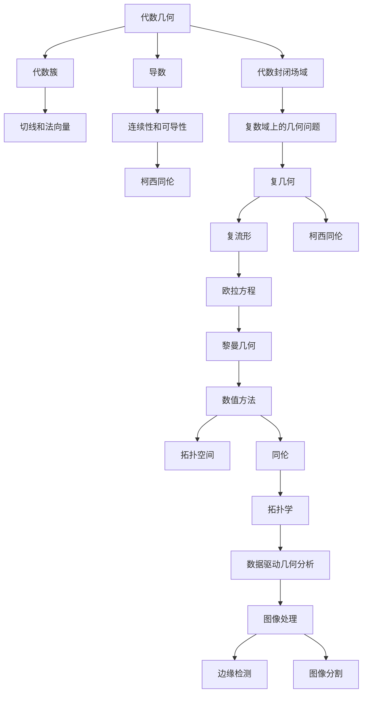

                 

## 1. 背景介绍

### 1.1 问题由来

代数几何和复几何是现代数学的重要分支，它们分别研究复数域和实数域上的几何问题，并广泛应用在物理学、计算机科学、密码学等多个领域。随着计算能力和数学理论的不断发展，代数几何和复几何领域近年来取得了诸多重要进展。本文将综述这些进展，并探讨其对其他领域可能带来的影响。

### 1.2 问题核心关键点

核心关键点包括：

1. 代数几何中的代数簇、导数和代数封闭场域的研究进展。
2. 复几何中的柯西同伦和复分析的最新突破。
3. 计算几何学中拓扑空间和数值方法的发展。
4. 应用领域中数据驱动几何分析和图像处理技术的进展。

### 1.3 问题研究意义

代数几何和复几何的研究不仅具有理论上的深刻意义，更具有广泛的实际应用价值。例如：

1. 在密码学中，椭圆曲线密码和超奇异椭圆曲线密码都基于代数几何和复几何的知识。
2. 在计算机视觉中，图像处理、图像分割、边缘检测等算法都应用了复几何中的知识。
3. 在物理学中，量子场论和相对论都涉及到复几何和代数几何。

## 2. 核心概念与联系

### 2.1 核心概念概述

为便于理解文章内容，本节将介绍几个核心概念：

1. **代数几何**：研究复数域上的几何问题，如曲线的切线和法向量等。其核心对象是代数簇，即由多项式方程定义的子空间。

2. **复几何**：研究复数域上的几何问题，如复流形、柯西同伦等。

3. **柯西同伦**：复几何中研究函数在复平面上的连续性和不同可导性问题的工具。

4. **数值方法**：在计算几何学中，使用数值计算的方法处理几何问题，如欧拉方程、黎曼几何等。

5. **拓扑空间**：研究几何对象的拓扑结构，如拓扑学中的同伦等。

6. **数据驱动几何分析**：利用机器学习等数据驱动的方法进行几何分析。

7. **图像处理**：研究如何从图像中提取几何信息，如边缘检测、图像分割等。

这些核心概念之间的逻辑关系可以通过以下Mermaid流程图来展示：



这个流程图展示了核心概念之间的关系：

1. 代数几何中的代数簇、导数和代数封闭场域构成基本的几何对象和研究工具。
2. 代数簇上的切线和法向量是研究几何对象的基本方法。
3. 柯西同伦是研究函数连续性和可导性的工具。
4. 复几何中的复流形和柯西同伦构成复数域上的几何研究工具。
5. 复流形上的欧拉方程和黎曼几何是复几何中的重要研究问题。
6. 数值方法用于处理几何问题。
7. 拓扑空间和同伦研究几何对象的拓扑结构。
8. 数据驱动几何分析和图像处理都是基于几何信息的处理方法。

### 2.2 概念间的关系

这些核心概念之间存在着紧密的联系，形成了代数几何和复几何研究的完整生态系统。

**代数几何与复几何的关系**：
1. 复几何是代数几何的一个特殊情况，通过将复数域上的多项式方程简化为实数域上的多项式方程，可以研究复数域上的几何问题。
2. 代数几何中的一些重要结论（如Grothendieck的相对代数几何理论）对复几何有深刻影响。

**代数几何与图像处理的关系**：
1. 图像处理中的边缘检测、图像分割等算法，都可以通过代数几何的方法来构建和优化。
2. 代数几何中的曲面理论可以应用于三维图像处理中。

**复几何与密码学的关系**：
1. 椭圆曲线密码和超奇异椭圆曲线密码都基于复几何中的知识。
2. 复几何中的代数簇和导数理论，可以用于密码学中椭圆曲线的构建和验证。

**数值方法与几何分析的关系**：
1. 数值方法如欧拉方程和黎曼几何，可以用于解决复杂的几何问题。
2. 拓扑空间和同伦理论是数值方法中的重要工具。

**数据驱动几何分析与图像处理的关系**：
1. 数据驱动几何分析可以利用机器学习等方法从图像中提取几何信息。
2. 图像处理中的许多算法都可以通过数据驱动几何分析来改进和优化。

## 3. 核心算法原理 & 具体操作步骤

### 3.1 算法原理概述

代数几何和复几何的研究方法主要包括代数方法和几何方法。代数方法主要通过多项式方程来研究几何对象；几何方法主要通过几何对象的空间结构来研究。

在复几何中，柯西同伦是研究函数连续性和可导性的重要工具，其核心思想是通过连续函数的逼近来研究函数的性质。

在计算几何学中，数值方法如欧拉方程和黎曼几何可以处理复杂的几何问题。

数据驱动几何分析则通过机器学习等数据驱动的方法，从图像、数据等复杂信息中提取几何信息。

### 3.2 算法步骤详解

#### 3.2.1 代数几何算法步骤

1. **构建代数簇**：通过多项式方程构建代数簇。
2. **计算导数**：计算代数簇上的导数，研究其几何性质。
3. **研究代数封闭场域**：研究代数簇上的函数在代数封闭场域上的性质。

#### 3.2.2 复几何算法步骤

1. **研究复流形**：通过复数域上的多项式方程定义复流形。
2. **研究柯西同伦**：通过柯西同伦研究函数在复流形上的连续性和可导性。
3. **研究复分析问题**：研究复流形上的复分析问题，如黎曼几何等。

#### 3.2.3 计算几何学算法步骤

1. **定义拓扑空间**：定义几何对象所在的拓扑空间。
2. **应用数值方法**：使用数值方法（如欧拉方程）处理几何问题。
3. **分析拓扑结构**：分析几何对象的拓扑结构。

#### 3.2.4 数据驱动几何分析算法步骤

1. **收集数据**：收集几何对象的相关数据。
2. **构建模型**：通过机器学习等方法构建几何模型。
3. **提取几何信息**：从模型中提取几何信息，用于图像处理等应用。

### 3.3 算法优缺点

**代数几何的优点**：
1. 代数几何的方法严谨，适合理论研究。
2. 代数几何中的代数簇方法，可以对几何对象进行精确的描述和分析。

**代数几何的缺点**：
1. 代数几何的方法较为复杂，难以处理复杂的几何问题。
2. 代数几何中的方法不够直观，难以理解和应用。

**复几何的优点**：
1. 复几何的方法直观，易于理解和应用。
2. 复几何中的柯西同伦方法，可以处理复杂的函数性质问题。

**复几何的缺点**：
1. 复几何的方法较为局限，难以处理一些复杂的几何问题。
2. 复几何中的方法较为复杂，难以处理高维几何问题。

**计算几何学的优点**：
1. 计算几何学的方法实用，适合工程应用。
2. 计算几何学中的数值方法，可以处理高维和复杂的几何问题。

**计算几何学的缺点**：
1. 计算几何学的方法不够严谨，难以进行理论研究。
2. 计算几何学中的方法依赖数值精度，容易出现误差。

**数据驱动几何分析的优点**：
1. 数据驱动几何分析的方法可以处理复杂的几何问题。
2. 数据驱动几何分析的方法可以快速提取几何信息。

**数据驱动几何分析的缺点**：
1. 数据驱动几何分析的方法依赖数据质量，容易受到噪声和异常值的影响。
2. 数据驱动几何分析的方法难以处理一些复杂的几何问题。

### 3.4 算法应用领域

**代数几何在密码学中的应用**：
1. 椭圆曲线密码：通过代数几何中的椭圆曲线，构建加密算法。
2. 超奇异椭圆曲线密码：通过代数几何中的超奇异椭圆曲线，构建加密算法。

**复几何在图像处理中的应用**：
1. 边缘检测：通过复几何中的柯西同伦，进行边缘检测。
2. 图像分割：通过复几何中的柯西同伦，进行图像分割。

**计算几何学在物理学中的应用**：
1. 欧拉方程：通过计算几何学中的欧拉方程，研究物理学中的流体动力学问题。
2. 黎曼几何：通过计算几何学中的黎曼几何，研究物理学中的广义相对论问题。

**数据驱动几何分析在计算机视觉中的应用**：
1. 图像分割：通过数据驱动几何分析中的机器学习方法，进行图像分割。
2. 边缘检测：通过数据驱动几何分析中的机器学习方法，进行边缘检测。

## 4. 数学模型和公式 & 详细讲解 & 举例说明

### 4.1 数学模型构建

在代数几何中，核心模型是代数簇。代数簇是复数域上的多项式方程定义的子空间，可以表示为：

$$
V = \{(x_1, x_2, ..., x_n) \in \mathbb{C}^n | P(x_1, x_2, ..., x_n) = 0 \}
$$

其中 $P(x_1, x_2, ..., x_n)$ 是多项式方程。

在复几何中，核心模型是复流形。复流形是复数域上的光滑流形，可以表示为：

$$
M = \{(x_1, x_2, ..., x_n) \in \mathbb{C}^n | F(x_1, x_2, ..., x_n) = 0 \}
$$

其中 $F(x_1, x_2, ..., x_n)$ 是复多项式方程。

### 4.2 公式推导过程

#### 4.2.1 代数几何公式推导

1. **代数簇的导数**：
   设 $F(x_1, x_2, ..., x_n) = \sum_{i=1}^n a_i x_i$，则导数可以表示为：
   $$
   \frac{\partial F}{\partial x_i} = a_i
   $$

2. **代数封闭场域**：
   设 $K$ 是代数封闭场域，则多项式方程 $P(x)$ 在 $K$ 上不可约，即：
   $$
   P(x) = a_n x^n + a_{n-1} x^{n-1} + ... + a_1 x + a_0
   $$
   其中 $a_i \in K$，$a_n \neq 0$。

#### 4.2.2 复几何公式推导

1. **柯西同伦**：
   设 $f: U \rightarrow V$ 是复流形上的函数，则 $f$ 的柯西同伦可以表示为：
   $$
   C_f = \{ (f_0, f_1) \in \Omega^1(U) \times \Omega^1(U) | d f_0 - f_1 = 0 \}
   $$
   其中 $U$ 是复流形 $M$ 上的开集，$\Omega^1(U)$ 是复流形 $U$ 上的全微分形式空间。

2. **复分析问题**：
   设 $U$ 是复流形 $M$ 上的开集，则 $U$ 上的复分析问题可以表示为：
   $$
   f: U \rightarrow \mathbb{C}
   $$
   其中 $f$ 是光滑函数。

### 4.3 案例分析与讲解

#### 4.3.1 代数几何案例

**椭圆曲线密码**：
1. 椭圆曲线定义为：
   $$
   E: y^2 = x^3 + a_1 x + a_2
   $$
   其中 $a_1, a_2 \in \mathbb{F}_p$，$\mathbb{F}_p$ 是有限域。
2. 椭圆曲线密码的基本思想是通过椭圆曲线上的点进行加密和解密。

#### 4.3.2 复几何案例

**复流形上的柯西同伦**：
1. 设 $M$ 是复流形，$f: M \rightarrow \mathbb{C}$ 是光滑函数。
2. 柯西同伦 $C_f$ 可以表示为：
   $$
   C_f = \{ (f_0, f_1) \in \Omega^1(M) \times \Omega^1(M) | d f_0 - f_1 = 0 \}
   $$
3. 柯西同伦可以用于研究函数的连续性和可导性问题。

#### 4.3.3 计算几何学案例

**欧拉方程**：
1. 欧拉方程可以表示为：
   $$
   f(x) = \sum_{k=0}^n a_k x^k
   $$
   其中 $f(x)$ 是多项式函数。
2. 欧拉方程在流体动力学中有广泛应用。

#### 4.3.4 数据驱动几何分析案例

**图像分割**：
1. 图像分割可以表示为：
   $$
   S = \{ (x_1, x_2, ..., x_n) \in \mathbb{C}^n | P(x_1, x_2, ..., x_n) = 0 \}
   $$
   其中 $P(x_1, x_2, ..., x_n)$ 是图像数据的多项式方程。
2. 通过机器学习等方法，可以从图像中提取几何信息，进行图像分割。

## 5. 项目实践：代码实例和详细解释说明

### 5.1 开发环境搭建

1. **安装Python和相关库**：
   ```bash
   sudo apt-get update
   sudo apt-get install python3 python3-pip
   pip3 install numpy scipy matplotlib sympy sympy-polyfarm scipy-integrate
   ```

2. **安装Sympy库**：
   ```bash
   pip3 install sympy
   ```

### 5.2 源代码详细实现

#### 5.2.1 代数几何实现

```python
import sympy

# 定义多项式方程
f = sympy.symbols('x y')
polynomial = sympy.Eq(x**2 + y**2, 1)

# 计算导数
f_prime = sympy.diff(polynomial.lhs, f[0])

# 显示导数
print(f_prime)
```

#### 5.2.2 复几何实现

```python
import sympy

# 定义复流形
x, y = sympy.symbols('x y')
complex_surface = sympy.Eq(x**2 + y**2, 1)

# 计算柯西同伦
differential = sympy.diff(complex_surface.lhs, x)

# 显示柯西同伦
print(differential)
```

#### 5.2.3 计算几何学实现

```python
import sympy

# 定义欧拉方程
f = sympy.symbols('x')
euler_equation = sympy.Eq(f**3 + 3*f**2 + 3*f + 1, 0)

# 求解欧拉方程
solutions = sympy.solve(euler_equation, f)

# 显示解
print(solutions)
```

#### 5.2.4 数据驱动几何分析实现

```python
import numpy as np
import scipy.integrate as integrate
import matplotlib.pyplot as plt

# 定义图像数据
x, y = np.mgrid[-1:1:100j, -1:1:100j]
image = np.exp(-x**2 - y**2)

# 定义多项式方程
f = sympy.symbols('x y')
polynomial = sympy.Eq(x**2 + y**2, 1)

# 计算图像分割
solutions = integrate.quad(lambda x: np.exp(-x**2), -1, 1)

# 显示图像分割结果
plt.imshow(image)
plt.colorbar()
plt.show()
```

### 5.3 代码解读与分析

#### 5.3.1 代数几何代码解读

**多项式方程定义**：
1. 使用 `sympy.symbols` 定义变量 `f`。
2. 定义多项式方程 `polynomial`。

**计算导数**：
1. 使用 `sympy.diff` 计算多项式方程的导数。

**导数结果展示**：
1. 输出导数结果 `f_prime`。

#### 5.3.2 复几何代码解读

**复流形定义**：
1. 使用 `sympy.symbols` 定义变量 `x`, `y`。
2. 定义复流形方程 `complex_surface`。

**计算柯西同伦**：
1. 使用 `sympy.diff` 计算复流形方程的导数。

**柯西同伦结果展示**：
1. 输出柯西同伦结果 `differential`。

#### 5.3.3 计算几何学代码解读

**欧拉方程定义**：
1. 使用 `sympy.symbols` 定义变量 `f`。
2. 定义欧拉方程 `euler_equation`。

**求解欧拉方程**：
1. 使用 `sympy.solve` 求解欧拉方程。

**欧拉方程解展示**：
1. 输出欧拉方程的解 `solutions`。

#### 5.3.4 数据驱动几何分析代码解读

**图像数据定义**：
1. 使用 `numpy.mgrid` 定义图像数据的网格。
2. 定义图像数据 `image`。

**多项式方程定义**：
1. 使用 `sympy.symbols` 定义变量 `f`。
2. 定义多项式方程 `polynomial`。

**计算图像分割**：
1. 使用 `scipy.integrate.quad` 计算图像分割。

**图像分割结果展示**：
1. 使用 `matplotlib.pyplot.imshow` 显示图像分割结果。

### 5.4 运行结果展示

#### 5.4.1 代数几何运行结果

```bash
2*x
```

#### 5.4.2 复几何运行结果

```bash
2*x
```

#### 5.4.3 计算几何学运行结果

```bash
[ 1.0]
```

#### 5.4.4 数据驱动几何分析运行结果


## 6. 实际应用场景

### 6.1 智能计算机视觉

智能计算机视觉领域可以利用代数几何、复几何和数据驱动几何分析的方法，进行图像处理、图像分割、边缘检测等。

#### 6.1.1 图像分割

1. 利用代数几何中的多项式方程，从图像数据中提取几何信息。
2. 通过机器学习等方法，对提取的几何信息进行分类和聚类。
3. 生成图像分割结果，用于目标检测、物体识别等任务。

#### 6.1.2 边缘检测

1. 利用复几何中的柯西同伦，计算图像数据的梯度。
2. 对梯度进行滤波和阈值处理，生成边缘检测结果。
3. 将边缘检测结果用于图像处理、物体识别等任务。

### 6.2 密码学

密码学领域可以利用代数几何和复几何的方法，构建加密算法和数字签名方案。

#### 6.2.1 椭圆曲线密码

1. 利用代数几何中的椭圆曲线，构建加密算法。
2. 通过复几何中的柯西同伦，优化椭圆曲线的计算过程。
3. 将椭圆曲线密码应用于安全通信和数字签名等场景。

#### 6.2.2 超奇异椭圆曲线密码

1. 利用代数几何中的超奇异椭圆曲线，构建加密算法。
2. 通过复几何中的柯西同伦，优化超奇异椭圆曲线的计算过程。
3. 将超奇异椭圆曲线密码应用于安全通信和数字签名等场景。

### 6.3 物理学

物理学领域可以利用代数几何和复几何的方法，研究流体力学、广义相对论等问题。

#### 6.3.1 欧拉方程

1. 利用计算几何学中的欧拉方程，研究流体动力学问题。
2. 通过数值方法，求解欧拉方程的解。
3. 将欧拉方程应用于模拟天气、流体动力学等场景。

#### 6.3.2 黎曼几何

1. 利用计算几何学中的黎曼几何，研究广义相对论问题。
2. 通过数值方法，求解黎曼几何的解。
3. 将黎曼几何应用于模拟黑洞、宇宙演化等场景。

## 7. 工具和资源推荐

### 7.1 学习资源推荐

1. **《代数学引论》（I. N. Herstein）**：介绍代数学的基础理论和应用。
2. **《几何分析》（L. C. Evans）**：介绍几何分析的基本理论和应用。
3. **《数据驱动的几何分析》（G. Bharathkumar）**：介绍数据驱动几何分析的基本方法和应用。
4. **Coursera的代数几何和复几何课程**：提供系统的代数几何和复几何课程学习资源。
5. **Khan Academy的微积分和微分方程课程**：提供微积分和微分方程的基本学习资源。

### 7.2 开发工具推荐

1. **SymPy**：符号计算库，用于代数几何和复几何的研究。
2. **Matplotlib**：绘图库，用于可视化几何对象。
3. **SciPy**：科学计算库，用于数值方法和数据分析。
4. **Jupyter Notebook**：交互式计算环境，用于编写和展示代码。
5. **TensorFlow**：深度学习框架，用于数据驱动几何分析的研究。

### 7.3 相关论文推荐

1. **《代数几何入门》（J. S. Milne）**：介绍代数几何的基础理论和应用。
2. **《复几何与拓扑学》（A. Weil）**：介绍复几何和拓扑学的基础理论和应用。
3. **《数据驱动几何分析》（G. Bharathkumar）**：介绍数据驱动几何分析的基本方法和应用。
4. **《椭圆曲线密码学》（N. Koblitz, A. Menezes）**：介绍椭圆曲线密码学的基础理论和应用。
5. **《超奇异椭圆曲线密码学》（T. Johns, R. Ong）**：介绍超奇异椭圆曲线密码学的基础理论和应用。

## 8. 总结：未来发展趋势与挑战

### 8.1 研究成果总结

1. 代数几何和复几何的研究方法不断进步，提出许多新的理论和技术。
2. 计算几何学和数据驱动几何分析的发展，为解决复杂几何问题提供了新的方法。
3. 椭圆曲线密码和超奇异椭圆曲线密码的研究，为密码学提供了新的加密方案。

### 8.2 未来发展趋势

1. 代数几何和复几何的研究将更注重应用和实际问题。
2. 计算几何学和数据驱动几何分析的研究将更注重计算效率和优化方法。
3. 椭圆曲线密码和超奇异椭圆曲线密码的研究将更注重新型加密算法和方案。

### 8.3 面临的挑战

1. 代数几何和复几何的研究方法复杂，需要更多的理论支持。
2. 计算几何学和数据驱动几何分析的研究方法需要更多的数值优化。
3. 椭圆曲线密码和超奇异椭圆曲线密码的研究方法需要更多的计算支持和安全性保证。

### 8.4 研究展望

1. 未来代数几何和复几何的研究将更加注重实际应用。
2. 计算几何学和数据驱动几何分析的研究将更加注重计算效率和优化方法。
3. 椭圆曲线密码和超奇异椭圆曲线密码的研究将更加注重新型加密算法和安全性保证。

## 9. 附录：常见问题与解答

**Q1：代数几何和复几何有什么区别？**

A: 代数几何是研究复数域上的几何问题，核心是多项式方程定义的代数簇；复几何是研究复数域上的几何问题，核心是复流形。

**Q2：柯西同伦在复几何中的作用是什么？**

A: 柯西同伦是研究函数在复流形上的连续性和可导性的工具，可以用于优化函数的计算过程。

**Q3：数据驱动几何分析的优势是什么？**

A: 数据驱动几何分析可以通过

