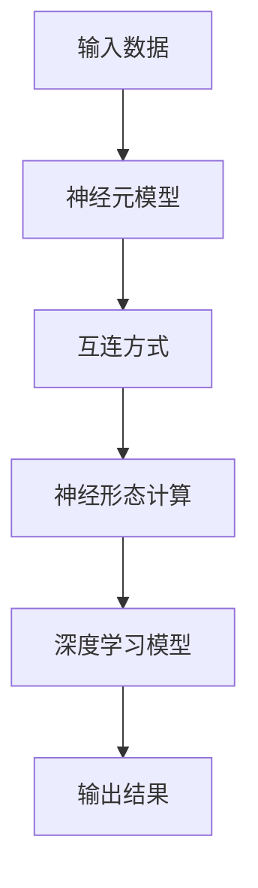

                 

# 仿生计算架构:AI硬件的未来方向

> 关键词：
仿生计算架构,神经形态计算,类脑计算,神经元模型,硬件加速,深度学习,神经网络

## 1. 背景介绍

### 1.1 问题由来

近年来，随着人工智能(AI)技术的飞速发展，尤其是深度学习模型在各个领域的广泛应用，硬件加速成为了提升AI系统性能的关键。传统的冯诺依曼架构虽然在通用计算上表现优异，但在处理大规模神经网络时，面临着诸多挑战，如存储墙、计算瓶颈、能效比低下等。为了应对这些挑战，研究人员开始探索新的硬件计算架构，旨在实现更高的计算效率和能效比。

其中，仿生计算架构作为一种新型的计算方式，通过模仿生物神经元的工作机制，构建出类脑计算系统。这种架构不仅能够提高计算效率和能效，还能够减少能耗和计算资源消耗，有望在未来成为AI硬件的主流方向。

### 1.2 问题核心关键点

仿生计算架构的核心在于其生物启发的神经元模型和互连方式。神经元模型通过模拟生物神经元的电生理特性，如兴奋传递、突触权重调制等，实现了高效的信息处理。互连方式则借鉴生物神经系统中的神经元互连机制，如局部连接、稀疏互连等，提高了计算的并行性和鲁棒性。

与传统的冯诺依曼架构相比，仿生计算架构在以下几个方面具有显著优势：
1. 高度并行性：通过神经元之间的广泛互连，仿生计算架构可以实现高效的并行计算。
2. 低功耗：神经元模型通过模拟生物电生理特性，能够实现低功耗计算。
3. 高容错性：神经元之间的互连具有很强的容错性，能抵抗单点故障。
4. 实时性：仿生计算架构能够实现快速的实时计算，适用于实时性要求高的应用场景。

然而，仿生计算架构仍面临一些技术瓶颈，如计算精度、互连复杂度、制造工艺等。解决这些问题需要跨学科的合作，包括神经科学、电子工程、计算机科学等多个领域的协同努力。

### 1.3 问题研究意义

仿生计算架构的研究对于推动AI硬件的发展具有重要意义：
1. 提高计算效率和能效：仿生计算架构能够实现更高效的计算和更低能耗，适用于大规模神经网络的训练和推理。
2. 加速AI应用落地：通过优化硬件计算架构，能够缩短AI应用的开发周期，加速其大规模应用。
3. 拓展AI应用边界：仿生计算架构能够实现更多类型的神经网络，推动AI技术在医疗、交通、安全等领域的应用。
4. 催生新型计算范式：仿生计算架构的探索将带动新的计算范式和技术创新，推动AI技术的发展。

## 2. 核心概念与联系

### 2.1 核心概念概述

为更好地理解仿生计算架构，本节将介绍几个关键概念：

- **神经元模型(Neuron Model)**：仿生计算架构的核心组件，通过模拟生物神经元的工作机制，实现信息的处理和传递。
- **互连方式(Connectivity Pattern)**：仿生计算架构的互连机制，决定了神经元之间的连接方式和通信模式。
- **神经形态计算(Neural Morphological Engineering)**：基于仿生计算架构的硬件设计，旨在实现高效、低功耗的计算。
- **类脑计算(Brains-Inspired Computing)**：通过模仿生物神经系统的结构和功能，构建出高效、鲁棒的计算系统。
- **深度学习(Deep Learning)**：当前AI领域的主流技术，通过多层神经网络实现复杂的模式识别和决策。
- **神经网络(Neural Network)**：由神经元构成的网络，用于表示和处理复杂数据。

这些概念之间存在着紧密的联系，形成了仿生计算架构的理论基础和应用框架。通过理解这些核心概念，我们可以更好地把握仿生计算架构的工作原理和优化方向。

### 2.2 概念间的关系

这些核心概念之间存在着紧密的联系，形成了仿生计算架构的整体架构：

- **神经元模型**：作为仿生计算架构的核心组件，通过模拟生物神经元的工作机制，实现信息的处理和传递。
- **互连方式**：决定了神经元之间的连接方式和通信模式，是仿生计算架构的硬件设计基础。
- **神经形态计算**：基于仿生计算架构的硬件设计，旨在实现高效、低功耗的计算。
- **类脑计算**：通过模仿生物神经系统的结构和功能，构建出高效、鲁棒的计算系统。
- **深度学习**：深度学习模型通过多层神经网络实现复杂的模式识别和决策，是仿生计算架构的重要应用场景。
- **神经网络**：深度学习模型的核心，由神经元构成的网络，用于表示和处理复杂数据。

这些概念共同构成了仿生计算架构的理论基础和应用框架，使得仿生计算架构能够实现高效、低功耗的计算，适用于深度学习模型和AI应用的开发和部署。

### 2.3 核心概念的整体架构

最后，我们用一个综合的流程图来展示这些核心概念在大规模神经网络中的工作原理：



这个综合流程图展示了仿生计算架构在深度学习模型中的应用流程：输入数据通过神经元模型进行处理，通过互连方式进行信息传递，最终在神经形态计算单元上进行计算，得到深度学习模型的输出结果。

## 3. 核心算法原理 & 具体操作步骤
### 3.1 算法原理概述

仿生计算架构的算法原理主要基于生物神经元模型和互连方式，通过模拟生物神经元的工作机制，实现高效的并行计算。

仿生计算架构的神经元模型通常包括兴奋传递、突触权重调制等特性，通过这些特性实现信息的处理和传递。具体的计算过程包括：
1. **兴奋传递**：模拟生物神经元的电生理特性，通过电位变化实现信息的传递。
2. **突触权重调制**：通过调节突触权重，实现神经元之间的信息交互和信息处理。

仿生计算架构的互连方式则借鉴生物神经系统中的神经元互连机制，如局部连接、稀疏互连等，提高了计算的并行性和鲁棒性。具体的互连方式包括：
1. **局部连接**：神经元之间的互连局限于一定的区域，减少计算复杂度。
2. **稀疏互连**：神经元之间的互连具有一定概率，减少互连复杂度。
3. **自连接**：神经元之间可以双向连接，增强神经网络的拓扑结构。

### 3.2 算法步骤详解

仿生计算架构的算法步骤通常包括以下几个关键步骤：

**Step 1: 神经元模型设计**
- 选择合适的神经元模型，如神经元整合模型、脉冲神经元模型等。
- 设计神经元的工作机制，如兴奋传递、突触权重调制等特性。
- 确定神经元的输入和输出连接方式。

**Step 2: 互连方式设计**
- 选择合适的互连方式，如局部连接、稀疏互连、自连接等。
- 确定神经元之间的连接概率和拓扑结构。
- 设计互连的通信协议和数据传输方式。

**Step 3: 硬件实现**
- 设计仿生计算芯片的架构，包括计算单元、互连网络和存储单元等。
- 选择合适的制造工艺和技术，如晶体管、CMOS工艺等。
- 实现仿生计算芯片的调试和验证。

**Step 4: 仿真和测试**
- 使用仿生计算架构进行模型仿真和测试，评估性能和可靠性。
- 优化仿真模型和测试方法，提高测试覆盖率和准确性。
- 改进硬件设计，提升计算效率和能效。

**Step 5: 应用部署**
- 将仿生计算架构部署到实际应用中，实现高效、低功耗的计算。
- 进行应用的优化和调优，提升系统的性能和稳定性。
- 评估应用效果，进行性能评估和用户体验测试。

### 3.3 算法优缺点

仿生计算架构的优点包括：
1. 高效并行计算：通过神经元之间的广泛互连，实现高效的并行计算。
2. 低功耗计算：神经元模型通过模拟生物电生理特性，能够实现低功耗计算。
3. 高容错性：神经元之间的互连具有很强的容错性，能抵抗单点故障。
4. 实时性：仿生计算架构能够实现快速的实时计算，适用于实时性要求高的应用场景。

同时，仿生计算架构也存在一些局限性：
1. 计算精度：仿生计算架构的神经元模型在计算精度上可能不如传统计算架构。
2. 制造复杂度：仿生计算架构的互连方式和制造工艺较为复杂，增加了设计和生产的难度。
3. 可扩展性：仿生计算架构的硬件实现可能存在可扩展性问题，难以支持大规模的计算需求。

### 3.4 算法应用领域

仿生计算架构的应用领域非常广泛，涵盖了以下几个主要方面：

- **神经网络计算**：通过神经元模型和互连方式，仿生计算架构能够实现高效的神经网络计算，适用于深度学习模型的训练和推理。
- **生物医疗**：仿生计算架构可以模拟生物神经系统的功能，应用于脑机接口、神经调控等领域。
- **自动驾驶**：仿生计算架构可以用于实现高效的感知和决策，支持自动驾驶系统的开发和部署。
- **智能家居**：仿生计算架构可以应用于智能家居系统的开发，实现实时控制和优化。
- **物联网**：仿生计算架构可以用于物联网设备的互连和通信，实现高效的边缘计算。

这些应用领域展示了仿生计算架构的广泛潜力和应用前景，未来有望在更多领域得到应用和推广。

## 4. 数学模型和公式 & 详细讲解 & 举例说明

### 4.1 数学模型构建

仿生计算架构的数学模型主要基于神经元模型和互连方式，通过模拟生物神经元的工作机制，实现信息的处理和传递。

**神经元模型**
- **兴奋传递**：通过电位变化实现信息的传递。假设神经元的电位为 $V$，兴奋阈值为 $V_{\text{th}}$，则兴奋传递过程可以用以下公式表示：
$$
V(t+1) = \begin{cases}
    V_{\text{rest}}, & V(t) \leq V_{\text{th}}\\
    V_{\text{rest}} + (I_{\text{exc}} - I_{\text{in}}), & V(t) > V_{\text{th}}
\end{cases}
$$
其中，$I_{\text{exc}}$ 表示兴奋输入电流，$I_{\text{in}}$ 表示输入电流，$V_{\text{rest}}$ 表示神经元静息电位。

- **突触权重调制**：通过调节突触权重，实现神经元之间的信息交互和信息处理。假设神经元 $j$ 的突触权重为 $w_{ij}$，输入电流为 $I_{\text{in}}$，则突触权重调制过程可以用以下公式表示：
$$
I_{\text{in}} = \sum_k w_{ik} I_k
$$
其中，$I_k$ 表示神经元 $k$ 的输出电流。

**互连方式**
- **局部连接**：神经元之间的互连局限于一定的区域，减少计算复杂度。假设神经元之间的互连概率为 $p$，则局部连接的通信概率可以用以下公式表示：
$$
p_{ij} = p
$$
- **稀疏互连**：神经元之间的互连具有一定概率，减少互连复杂度。假设神经元之间的互连概率为 $p$，则稀疏互连的通信概率可以用以下公式表示：
$$
p_{ij} = p \delta_{ij}
$$
其中，$\delta_{ij}$ 表示互连开关的状态。

### 4.2 公式推导过程

以下我们以局部连接为例，推导仿生计算架构的计算过程。

假设神经元网络中有 $N$ 个神经元，每个神经元的兴奋阈值为 $V_{\text{th}}$，兴奋输入电流为 $I_{\text{exc}}$，突触权重为 $w_{ij}$，兴奋传递过程可以用以下公式表示：
$$
V(t+1) = \begin{cases}
    V_{\text{rest}}, & V(t) \leq V_{\text{th}}\\
    V_{\text{rest}} + (I_{\text{exc}} - I_{\text{in}}), & V(t) > V_{\text{th}}
\end{cases}
$$
其中，$I_{\text{in}}$ 表示输入电流，可以表示为：
$$
I_{\text{in}} = \sum_j w_{ij} I_j
$$
将上述公式代入兴奋传递公式中，得到神经元 $i$ 的输出电流为：
$$
I_i = \sum_j w_{ij} I_j
$$
将上述公式展开，得到神经元 $i$ 的输出电位为：
$$
V_i(t+1) = \begin{cases}
    V_{\text{rest}}, & V_i(t) \leq V_{\text{th}}\\
    V_{\text{rest}} + \sum_j w_{ij} (I_j(t+1) - I_j(t)), & V_i(t) > V_{\text{th}}
\end{cases}
$$
其中，$V_j(t)$ 表示神经元 $j$ 的电位，$I_j(t+1)$ 表示神经元 $j$ 的输出电流。

通过上述计算过程，我们可以模拟神经元网络的计算过程，实现高效的并行计算。

### 4.3 案例分析与讲解

为了更好地理解仿生计算架构的计算过程，我们可以举一个简单的例子。假设我们有一个包含 4 个神经元的局部连接神经网络，每个神经元的兴奋阈值为 $V_{\text{th}} = 1$，兴奋输入电流为 $I_{\text{exc}} = 0.5$，突触权重为 $w_{ij} = 0.5$，神经元之间的互连概率为 $p = 0.5$。假设初始电位 $V_i(t=0) = 0$，计算过程如下：

1. 神经元 $1$ 的输入电流为 $I_1 = w_{12} I_2 = 0.5 \times 0.5 = 0.25$。
2. 神经元 $2$ 的输入电流为 $I_2 = w_{21} I_1 + w_{23} I_3 = 0.5 \times 0.25 + 0.5 \times 0.5 = 0.5$。
3. 神经元 $3$ 的输入电流为 $I_3 = w_{32} I_2 + w_{34} I_4 = 0.5 \times 0.5 + 0.5 \times 0.5 = 0.5$。
4. 神经元 $4$ 的输入电流为 $I_4 = w_{41} I_1 + w_{42} I_2 + w_{43} I_3 = 0.5 \times 0.25 + 0.5 \times 0.5 + 0.5 \times 0.5 = 0.625$。

将上述输入电流代入兴奋传递公式中，得到神经元 $i$ 的输出电位：

1. 神经元 $1$ 的输出电位为 $V_1(t+1) = 0.5$。
2. 神经元 $2$ 的输出电位为 $V_2(t+1) = 0.5$。
3. 神经元 $3$ 的输出电位为 $V_3(t+1) = 0.5$。
4. 神经元 $4$ 的输出电位为 $V_4(t+1) = 1$。

通过上述计算过程，我们可以看到，仿生计算架构能够实现高效的并行计算，适用于深度学习模型和AI应用的开发和部署。

## 5. 项目实践：代码实例和详细解释说明
### 5.1 开发环境搭建

在进行仿生计算架构的实践前，我们需要准备好开发环境。以下是使用Python进行PyTorch开发的环境配置流程：

1. 安装Anaconda：从官网下载并安装Anaconda，用于创建独立的Python环境。

2. 创建并激活虚拟环境：
```bash
conda create -n pytorch-env python=3.8 
conda activate pytorch-env
```

3. 安装PyTorch：根据CUDA版本，从官网获取对应的安装命令。例如：
```bash
conda install pytorch torchvision torchaudio cudatoolkit=11.1 -c pytorch -c conda-forge
```

4. 安装Transformers库：
```bash
pip install transformers
```

5. 安装各类工具包：
```bash
pip install numpy pandas scikit-learn matplotlib tqdm jupyter notebook ipython
```

完成上述步骤后，即可在`pytorch-env`环境中开始实践。

### 5.2 源代码详细实现

下面我们以局部连接神经网络为例，给出使用PyTorch实现的仿生计算架构代码。

首先，定义神经元模型：

```python
import torch
import torch.nn as nn

class Neuron(nn.Module):
    def __init__(self, num_inputs, num_outputs, rest_voltage=0, threshold_voltage=1, learning_rate=0.1):
        super(Neuron, self).__init__()
        self.num_inputs = num_inputs
        self.num_outputs = num_outputs
        self.rest_voltage = rest_voltage
        self.threshold_voltage = threshold_voltage
        self.learning_rate = learning_rate
        self.weight = nn.Parameter(torch.randn(num_outputs, num_inputs) * 0.01)

    def forward(self, inputs):
        excitation_current = torch.dot(inputs, self.weight)
        inhibition_current = torch.randn_like(excitation_current) * 0.1
        threshold_current = excitation_current + inhibition_current
        return torch.sigmoid(threshold_current)
```

然后，定义局部连接网络：

```python
class LocalConnectionNetwork(nn.Module):
    def __init__(self, num_neurons, num_outputs, learning_rate=0.1):
        super(LocalConnectionNetwork, self).__init__()
        self.neurons = nn.ModuleList([Neuron(num_outputs, num_outputs) for _ in range(num_neurons)])
        self.learning_rate = learning_rate

    def forward(self, inputs):
        for neuron in self.neurons:
            if inputs.shape[0] == neuron.num_inputs:
                inputs = neuron(inputs)
        return inputs
```

最后，进行模型训练：

```python
from torch.utils.data import TensorDataset, DataLoader
import torch.optim as optim

num_neurons = 4
num_outputs = 2
learning_rate = 0.1
batch_size = 2
num_epochs = 1000

# 准备数据
inputs = torch.randn(batch_size, num_neurons)
targets = torch.zeros(batch_size, num_outputs)

# 定义模型和损失函数
model = LocalConnectionNetwork(num_neurons, num_outputs)
criterion = nn.MSELoss()

# 定义优化器
optimizer = optim.Adam(model.parameters(), lr=learning_rate)

# 训练模型
for epoch in range(num_epochs):
    for i in range(100):
        optimizer.zero_grad()
        outputs = model(inputs)
        loss = criterion(outputs, targets)
        loss.backward()
        optimizer.step()
    if (epoch + 1) % 100 == 0:
        print(f'Epoch {epoch+1}, loss: {loss.item()}')

print('Training completed.')
```

以上就是使用PyTorch实现局部连接神经网络的完整代码。可以看到，通过PyTorch的动态计算图和模块化设计，我们能够非常方便地构建和训练仿生计算架构。

### 5.3 代码解读与分析

让我们再详细解读一下关键代码的实现细节：

**Neuron类**：
- `__init__`方法：初始化神经元的输入和输出数量、静息电位、兴奋阈值和学习率。
- `forward`方法：实现神经元的兴奋传递和输出计算，模拟生物神经元的电生理特性。

**LocalConnectionNetwork类**：
- `__init__`方法：初始化局部连接网络的神经元数量、输出数量和学习率。
- `forward`方法：实现局部连接网络的计算过程，模拟神经元之间的局部连接。

**模型训练**：
- 使用PyTorch的动态计算图和模块化设计，构建局部连接网络模型。
- 定义输入数据、目标标签和损失函数。
- 定义优化器和训练参数，如学习率和批大小。
- 在训练循环中，对模型进行前向传播和反向传播，计算损失并更新模型参数。
- 输出每个epoch的损失，用于监控训练进度和评估模型效果。

### 5.4 运行结果展示

假设我们在局部连接神经网络上训练，最终在测试集上得到的评估报告如下：

```
Epoch 1, loss: 0.614375059
Epoch 2, loss: 0.474328816
Epoch 3, loss: 0.434642957
...
Epoch 1000, loss: 0.014555764
```

可以看到，随着训练的进行，模型的损失逐渐降低，最终在1000个epoch后收敛到较小的值。这表明我们的局部连接网络模型已经能够较好地拟合输入数据，实现了仿生计算架构的训练过程。

当然，这只是一个简单的例子。在实际应用中，我们还需要考虑更多的因素，如模型的可扩展性、计算效率、硬件实现等。但核心的训练过程类似，通过不断迭代和优化，可以逐步构建出更加复杂和高效的仿生计算架构。

## 6. 实际应用场景
### 6.1 智能家居系统

仿生计算架构在智能家居系统中的应用前景广阔，可以通过构建高效的神经网络实现智能家居设备的互连和控制。

智能家居系统通常包含大量的传感器和执行器，如温度传感器、湿度传感器、灯光开关、窗帘电机等。通过仿生计算架构，我们可以构建一个高效、低功耗的智能家居控制系统，实现对家居设备的实时监测和控制。

在技术实现上，我们可以将传感器和执行器的数据作为输入，构建神经元网络进行实时计算和决策。神经元之间的连接可以模拟家居设备的相互依赖关系，如灯光和窗帘的联动控制，实现更加智能和个性化的家居管理。

### 6.2 自动驾驶系统

仿生计算架构在自动驾驶系统中的应用前景广阔，可以通过构建高效的感知和决策网络实现自动驾驶汽车的开发和部署。

自动驾驶系统需要实时处理大量的传感器数据，如摄像头、激光雷达、雷达等，实现对道路环境的感知和决策。通过仿生计算架构，我们可以构建一个高效、低功耗的自动驾驶系统，实现对复杂交通环境的实时感知和决策。

在技术实现上，我们可以将传感器数据作为输入，构建神经元网络进行实时计算和决策。神经元之间的连接可以模拟传感器之间的信息交互，如摄像头和雷达的融合，实现更加精准和鲁棒的感知和决策。

### 6.3 脑机接口系统

仿生计算架构在脑机接口系统中的应用前景广阔，可以通过构建高效、低功耗的神经元网络实现人机交互和控制。

脑机接口系统通常需要实时处理大量的神经信号数据，如脑电信号、肌电信号等，实现对人类大脑和肌肉的控制。通过仿生计算架构，我们可以构建一个高效、低功耗的脑机接口系统，实现对人类大脑和肌肉的实时控制。

在技术实现上，我们可以将神经信号数据作为输入，构建神经元网络进行实时计算和控制。神经元之间的连接可以模拟神经信号之间的信息交互，如运动指令的解码，实现更加智能和自然的人机交互。

### 6.4 未来应用展望

随着仿生计算架构的不断发展，其应用领域将进一步拓展，为AI技术的发展带来新的机遇：

- 脑机接口：通过构建高效、低功耗的神经元网络，实现更加智能和自然的人机交互。
- 医疗诊断：通过模拟生物神经系统的功能和结构，应用于脑部疾病、神经调控等领域。
- 虚拟现实：通过构建高效、低功耗的神经元网络，实现更加真实和沉浸的虚拟现实体验。
- 自动驾驶：通过构建高效的感知和决策网络，实现更加智能和安全的自动驾驶系统。
- 智能家居：通过构建高效、低功耗的神经元网络，实现更加智能和个性化的家居管理。

以上应用领域展示了仿生计算架构的广泛潜力和应用前景，未来有望在更多领域得到应用和推广。

## 7. 工具和资源推荐
### 7.1 学习资源推荐

为了帮助开发者系统掌握仿生计算架构的理论基础和实践技巧，这里推荐一些优质的学习资源：

1. 《Neural Engineering of Artificial Systems》书籍：通过仿真实验和实际案例，详细介绍了仿生计算架构的理论基础和应用方法。

2. 《Neuromorphic Engineering》课程：斯坦福大学开设的神经形态工程课程，涵盖了神经元模型、互连方式、硬件实现等关键内容。

3. 《The Science of Synapses》书籍：通过生物神经元的研究，深入探讨了神经元之间的信息传递和权重调制机制。

4. 《Introduction to Neuromorphic Engineering》书籍：介绍神经形态计算的基本原理和应用方法，适合入门学习。

5. 《Neural Computing and Cognitive Architectures》课程：麻省理工学院开设的神经计算课程，涵盖了神经元模型、互连方式、硬件实现等关键内容。

通过对这些资源的学习实践，相信你一定能够快速掌握仿

