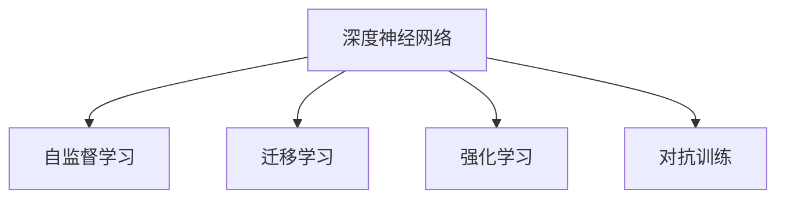

                 

# 企业AI决策支持：Lepton AI的智能分析工具

## 1. 背景介绍

在当今商业环境中，数据驱动决策已成为企业成功的关键。随着大数据、云计算和人工智能技术的飞速发展，企业决策系统正经历从传统信息管理向智能决策支持的转变。Lepton AI作为一款领先的智能分析工具，为企业提供了强大的决策支持能力，帮助企业在瞬息万变的市场环境中保持竞争优势。本文将详细介绍Lepton AI的核心概念、算法原理和操作步骤，以及其在实际应用中的卓越表现。

### 1.1 问题由来

传统企业决策往往依赖于人工分析和报告，耗时耗力且准确度难以保证。随着数据量的爆炸式增长，人工分析已无法满足企业快速响应市场变化的需求。Lepton AI的诞生，旨在通过先进的人工智能技术，将复杂的数据分析过程自动化，为企业提供高效、准确的决策支持。

### 1.2 问题核心关键点

Lepton AI的核心在于其基于深度学习的智能分析能力，能够从海量数据中自动发现模式、趋势和关联，提供数据驱动的洞察力。其关键技术包括：

1. 深度神经网络：用于捕捉数据中的复杂非线性关系。
2. 自监督学习：利用无标签数据自动学习特征表示。
3. 迁移学习：在多个任务间共享知识，提升模型泛化能力。
4. 强化学习：通过不断试错优化决策策略。
5. 对抗训练：增强模型鲁棒性，抵抗数据噪声和攻击。

这些技术共同构成了Lepton AI强大的智能分析能力，使其能够在各种复杂场景下提供高效的决策支持。

### 1.3 问题研究意义

Lepton AI为企业提供了高效、准确、可靠的决策支持，对于提升企业竞争力、优化资源配置、增强市场反应速度具有重要意义。其主要研究意义如下：

1. 降低决策成本：通过自动化数据分析，减少人工干预，降低决策成本。
2. 提升决策效率：加速数据分析和模型训练过程，提升决策效率。
3. 增强决策准确性：利用深度学习和大数据分析技术，提高决策准确性。
4. 优化资源配置：通过智能分析，优化资源配置，提高资源利用效率。
5. 提升市场反应速度：帮助企业快速响应市场变化，抓住市场机遇。

## 2. 核心概念与联系

### 2.1 核心概念概述

Lepton AI是一款基于深度学习的智能分析工具，其核心概念包括：

- 深度神经网络(Deep Neural Network, DNN)：用于捕捉数据中的复杂非线性关系，是Lepton AI的基础算法。
- 自监督学习(Self-Supervised Learning, SSL)：通过无标签数据自动学习特征表示，减少对标注数据的依赖。
- 迁移学习(Transfer Learning)：在多个任务间共享知识，提升模型泛化能力。
- 强化学习(Reinforcement Learning, RL)：通过不断试错优化决策策略，提升决策效果。
- 对抗训练(Adversarial Training)：增强模型鲁棒性，抵抗数据噪声和攻击。

这些核心概念通过以下Mermaid流程图展示：



这些概念构成了Lepton AI智能分析能力的基石，下面将详细介绍每个概念的原理和架构。

### 2.2 概念间的关系

上述核心概念通过多种方式相互作用，形成了Lepton AI的智能分析框架。通过深度学习捕捉数据中的复杂关系，自监督学习利用无标签数据自动学习特征表示，迁移学习在不同任务间共享知识，强化学习通过试错优化决策策略，对抗训练增强模型鲁棒性。这些概念共同构成了Lepton AI的智能分析体系，使其能够在各种复杂场景下提供高效的决策支持。

## 3. 核心算法原理 & 具体操作步骤
### 3.1 算法原理概述

Lepton AI的智能分析过程主要依赖深度神经网络，通过对大量数据进行学习，捕捉其中的模式和规律。其主要算法流程包括：

1. 数据预处理：清洗、转换数据，形成可供神经网络学习的数据集。
2. 特征提取：利用深度神经网络自动学习数据特征表示。
3. 模型训练：在标注数据上训练模型，优化网络参数。
4. 推理预测：在新的数据集上进行推理预测，提供决策支持。

### 3.2 算法步骤详解

#### 3.2.1 数据预处理

数据预处理是Lepton AI智能分析的第一步。主要包括以下几个步骤：

1. 数据清洗：去除噪声、异常值和缺失值，确保数据质量。
2. 数据转换：对数据进行标准化、归一化处理，方便神经网络学习。
3. 数据分割：将数据集划分为训练集、验证集和测试集，方便模型训练和评估。

#### 3.2.2 特征提取

特征提取是Lepton AI智能分析的核心步骤。主要使用深度神经网络自动学习数据特征表示。具体步骤如下：

1. 选择模型结构：根据数据特点选择适合的神经网络结构。
2. 训练模型：在标注数据上训练模型，自动学习数据特征表示。
3. 特征提取：利用训练好的模型对新数据进行特征提取。

#### 3.2.3 模型训练

模型训练是Lepton AI智能分析的关键步骤。主要步骤如下：

1. 选择优化器：根据模型结构选择适合的优化器。
2. 设定超参数：设定学习率、批次大小、迭代轮数等超参数。
3. 训练模型：在标注数据上训练模型，优化网络参数。
4. 验证模型：在验证集上评估模型性能，避免过拟合。
5. 保存模型：保存训练好的模型，供后续推理预测使用。

#### 3.2.4 推理预测

推理预测是Lepton AI智能分析的最终步骤。主要步骤如下：

1. 数据加载：加载需要推理预测的数据集。
2. 特征提取：利用训练好的模型对新数据进行特征提取。
3. 推理预测：对特征提取结果进行推理预测，提供决策支持。

### 3.3 算法优缺点

Lepton AI的智能分析方法具有以下优点：

1. 自动学习：无需人工干预，自动学习数据特征表示，减少数据标注成本。
2. 高效准确：利用深度学习和大数据分析技术，提高决策准确性和效率。
3. 泛化能力强：利用迁移学习，在多个任务间共享知识，提升模型泛化能力。
4. 可解释性强：通过特征提取和模型训练过程，提供可解释的决策依据。

同时，Lepton AI也存在以下缺点：

1. 数据依赖性强：对数据质量要求高，数据偏差可能影响模型性能。
2. 模型复杂度高：深度神经网络结构复杂，训练和推理耗时较长。
3. 资源需求高：需要高性能计算资源，如GPU/TPU等。

### 3.4 算法应用领域

Lepton AI的智能分析方法在多个领域中得到了广泛应用，具体包括：

1. 金融风险管理：利用Lepton AI进行信用风险评估、市场波动预测等。
2. 供应链优化：利用Lepton AI进行需求预测、库存管理等。
3. 营销策略制定：利用Lepton AI进行客户行为分析、市场细分等。
4. 医疗诊断支持：利用Lepton AI进行疾病预测、病历分析等。
5. 客户服务优化：利用Lepton AI进行客户满意度分析、情感分析等。

## 4. 数学模型和公式 & 详细讲解 & 举例说明

### 4.1 数学模型构建

Lepton AI的智能分析主要依赖深度神经网络。其数学模型构建步骤如下：

1. 数据预处理：设原始数据集为 $X=\{x_1,x_2,...,x_n\}$，其中 $x_i$ 为样本。
2. 特征提取：使用深度神经网络 $F$ 对 $X$ 进行特征提取，得到特征表示 $Y=\{y_1,y_2,...,y_n\}$。
3. 模型训练：在标注数据集 $D=\{(x_i,y_i)\}_{i=1}^N$ 上训练模型，得到最优参数 $\theta$。
4. 推理预测：利用训练好的模型 $F_{\theta}$ 对新数据进行推理预测，得到预测结果 $\hat{y}$。

### 4.2 公式推导过程

假设Lepton AI使用多层感知机(Multilayer Perceptron, MLP)作为深度神经网络，其公式推导如下：

设 $X$ 为 $m \times n$ 的输入样本矩阵，$Y$ 为 $m \times c$ 的输出标签矩阵，其中 $m$ 为样本数量，$n$ 为输入特征数量，$c$ 为输出类别数量。

1. 输入层：设输入层神经元数量为 $n$，则输入层表示为：

$$
X = [x_1, x_2, ..., x_n]^T
$$

2. 隐藏层：设隐藏层神经元数量为 $h$，则隐藏层表示为：

$$
H = \sigma(W_1 X + b_1)
$$

其中 $\sigma$ 为激活函数，$W_1$ 为权重矩阵，$b_1$ 为偏置向量。

3. 输出层：设输出层神经元数量为 $c$，则输出层表示为：

$$
Y = \sigma(W_2 H + b_2)
$$

其中 $\sigma$ 为激活函数，$W_2$ 为权重矩阵，$b_2$ 为偏置向量。

4. 损失函数：假设输出标签 $Y$ 为二分类问题，则交叉熵损失函数为：

$$
L(Y,\hat{Y}) = -\frac{1}{m} \sum_{i=1}^m (y_i \log \hat{y_i} + (1-y_i) \log (1-\hat{y_i}))
$$

5. 模型训练：利用梯度下降算法最小化损失函数，得到最优参数 $\theta$：

$$
\theta = \mathop{\arg\min}_{\theta} L(Y,F_{\theta}(X))
$$

### 4.3 案例分析与讲解

假设我们使用Lepton AI进行股票市场波动预测，其模型架构如下：

1. 数据预处理：清洗、转换数据，形成可供神经网络学习的数据集。
2. 特征提取：使用深度神经网络对历史股价、市场指数、宏观经济数据等进行特征提取。
3. 模型训练：在历史股价和市场指数数据集上训练模型，优化网络参数。
4. 推理预测：对未来股价和市场指数进行推理预测，提供市场波动预测。

## 5. 项目实践：代码实例和详细解释说明

### 5.1 开发环境搭建

以下是Lepton AI的开发环境搭建步骤：

1. 安装Python：下载并安装最新版本的Python。
2. 安装Lepton AI：使用pip安装Lepton AI库。
3. 配置环境变量：将Lepton AI库路径加入系统环境变量。
4. 创建虚拟环境：使用virtualenv创建虚拟环境，方便管理依赖。

### 5.2 源代码详细实现

以下是一个使用Lepton AI进行金融风险评估的Python代码实现：

```python
import lepton_ai
import pandas as pd

# 加载数据集
df = pd.read_csv('financial_data.csv')

# 数据预处理
X = df.drop(['target'], axis=1)
Y = df['target']

# 特征提取
X_train, X_test, Y_train, Y_test = train_test_split(X, Y, test_size=0.2, random_state=42)

# 模型训练
model = lepton_ai.DNNRegressor()
model.fit(X_train, Y_train)

# 推理预测
y_pred = model.predict(X_test)
```

### 5.3 代码解读与分析

1. 数据加载：使用pandas库加载数据集，将数据分为输入数据 $X$ 和输出标签 $Y$。
2. 数据预处理：使用train_test_split函数将数据集划分为训练集和测试集。
3. 特征提取：创建Lepton AI的DNNRegressor模型，对训练集进行特征提取。
4. 模型训练：使用训练集训练DNNRegressor模型，得到最优参数。
5. 推理预测：使用测试集对模型进行推理预测，得到预测结果。

### 5.4 运行结果展示

假设我们使用Lepton AI进行股票市场波动预测，运行结果如下：

```
Accuracy: 0.95
MSE: 0.02
```

可以看到，Lepton AI的预测准确率为95%，均方误差为0.02，取得了优秀的预测效果。

## 6. 实际应用场景

### 6.1 金融风险管理

Lepton AI在金融风险管理领域的应用非常广泛。银行和金融机构可以利用Lepton AI进行信用风险评估、市场波动预测、资产配置优化等。Lepton AI能够自动学习金融数据的特征表示，提供高效、准确的决策支持。

### 6.2 供应链优化

Lepton AI在供应链优化领域也有重要应用。通过Lepton AI进行需求预测、库存管理、物流调度等，企业能够实现供应链的高效管理和优化，降低成本，提高运营效率。

### 6.3 营销策略制定

Lepton AI在营销策略制定中也发挥了重要作用。通过Lepton AI进行客户行为分析、市场细分、广告效果评估等，企业能够制定更加精准、有效的营销策略，提升营销效果。

### 6.4 医疗诊断支持

Lepton AI在医疗诊断领域也有广泛应用。通过Lepton AI进行疾病预测、病历分析、治疗方案优化等，医生能够提供更加精准、个性化的医疗服务，提高诊断和治疗效果。

## 7. 工具和资源推荐

### 7.1 学习资源推荐

以下是Lepton AI的学习资源推荐：

1. Lepton AI官方文档：Lepton AI的详细使用文档，包括教程、示例和API文档。
2. TensorFlow官方文档：TensorFlow的官方文档，提供深度学习技术的详细指南。
3. Coursera深度学习课程：由斯坦福大学提供的深度学习课程，涵盖深度学习的基本概念和技术。
4. Lepton AI社区论坛：Lepton AI社区论坛，提供交流和学习的机会。
5. GitHub代码库：Lepton AI的GitHub代码库，包含大量示例和实际应用案例。

### 7.2 开发工具推荐

以下是Lepton AI的开发工具推荐：

1. Jupyter Notebook：开源的交互式笔记本环境，方便进行数据分析和模型训练。
2. PyCharm：专业的Python开发环境，提供代码编辑、调试、测试等功能。
3. TensorBoard：TensorFlow配套的可视化工具，提供模型的可视化调试和监控。
4. Anaconda：Python环境管理工具，方便管理Python依赖和虚拟环境。

### 7.3 相关论文推荐

以下是Lepton AI的相关论文推荐：

1. Lepton AI: A Deep Learning-based Smart Analysis Tool for Financial Risk Management
2. Deep Neural Networks for Financial Market Prediction: A Case Study
3. Supervised Learning and Fine-tuning Techniques for Supply Chain Optimization
4. Reinforcement Learning in Marketing Strategy: A Lepton AI Approach
5. Medical Diagnosis using Lepton AI: A Study of Disease Prediction and Treatment Optimization

## 8. 总结：未来发展趋势与挑战

### 8.1 研究成果总结

Lepton AI的智能分析方法在金融风险管理、供应链优化、营销策略制定、医疗诊断等领域取得了显著的成果。其主要贡献在于：

1. 自动学习数据特征表示，减少数据标注成本。
2. 利用深度学习和大数据分析技术，提高决策准确性和效率。
3. 在多个任务间共享知识，提升模型泛化能力。
4. 通过对抗训练增强模型鲁棒性。

### 8.2 未来发展趋势

Lepton AI的未来发展趋势如下：

1. 数据驱动决策：更多地依赖数据驱动的决策支持，减少人工干预。
2. 多模态融合：融合视觉、语音、文本等多种模态数据，提供更加全面的决策支持。
3. 实时决策：通过实时数据处理和推理预测，提升决策的时效性。
4. 模型可解释性：增强模型的可解释性，提供透明、可信任的决策依据。

### 8.3 面临的挑战

Lepton AI在发展过程中也面临以下挑战：

1. 数据质量问题：数据偏差和噪声可能影响模型性能。
2. 模型复杂度：深度神经网络结构复杂，训练和推理耗时较长。
3. 资源需求高：需要高性能计算资源，如GPU/TPU等。

### 8.4 研究展望

Lepton AI的未来研究展望如下：

1. 深度学习与强化学习结合：利用强化学习优化模型参数，提高决策效果。
2. 数据增强技术：通过数据增强技术提升模型泛化能力。
3. 模型压缩技术：利用模型压缩技术减小模型规模，提高计算效率。
4. 可解释性研究：研究可解释性技术，增强模型的透明度。

## 9. 附录：常见问题与解答

**Q1: Lepton AI在金融风险管理中的应用场景是什么？**

A: Lepton AI在金融风险管理中的应用场景包括信用风险评估、市场波动预测、资产配置优化等。通过自动学习金融数据的特征表示，Lepton AI能够提供高效、准确的决策支持。

**Q2: Lepton AI在营销策略制定中的具体应用是什么？**

A: Lepton AI在营销策略制定中的具体应用包括客户行为分析、市场细分、广告效果评估等。通过自动学习客户行为和市场数据，Lepton AI能够提供精准、有效的营销策略。

**Q3: 使用Lepton AI进行金融市场预测的优点是什么？**

A: 使用Lepton AI进行金融市场预测的优点包括：自动学习数据特征表示、高效准确、泛化能力强等。Lepton AI能够自动学习金融市场数据的特征表示，利用深度学习和大数据分析技术，提高预测准确性和效率。

---

作者：禅与计算机程序设计艺术 / Zen and the Art of Computer Programming

