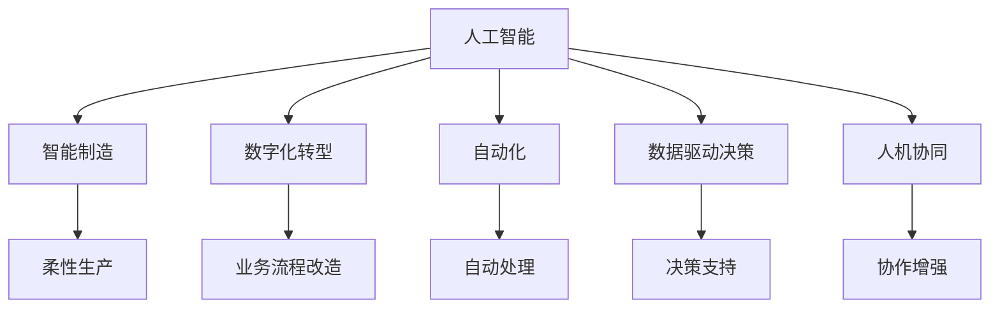
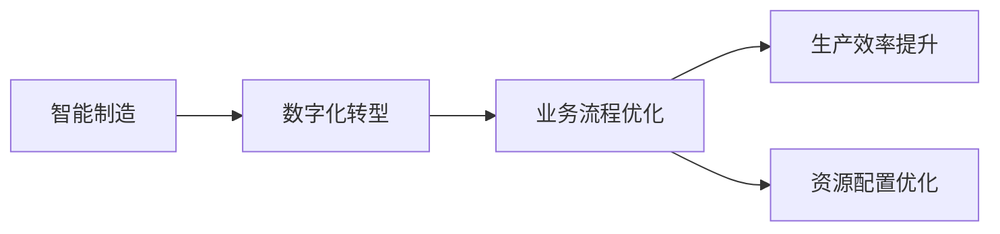
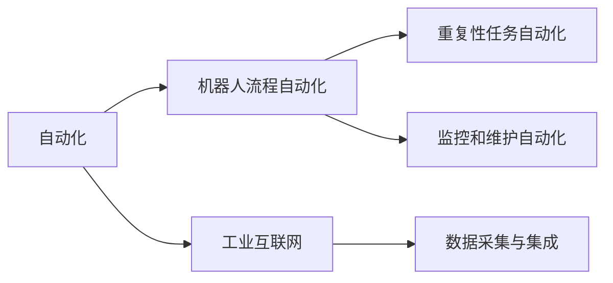
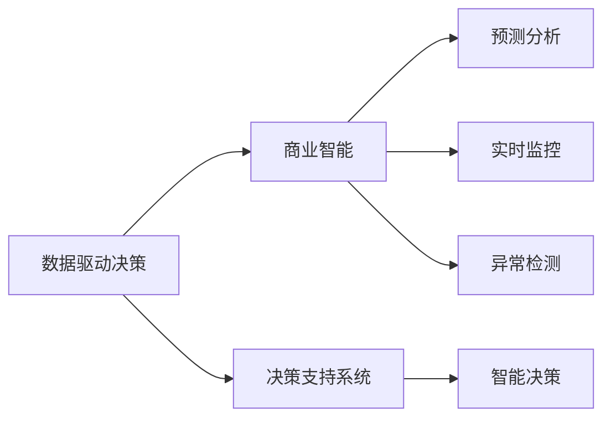
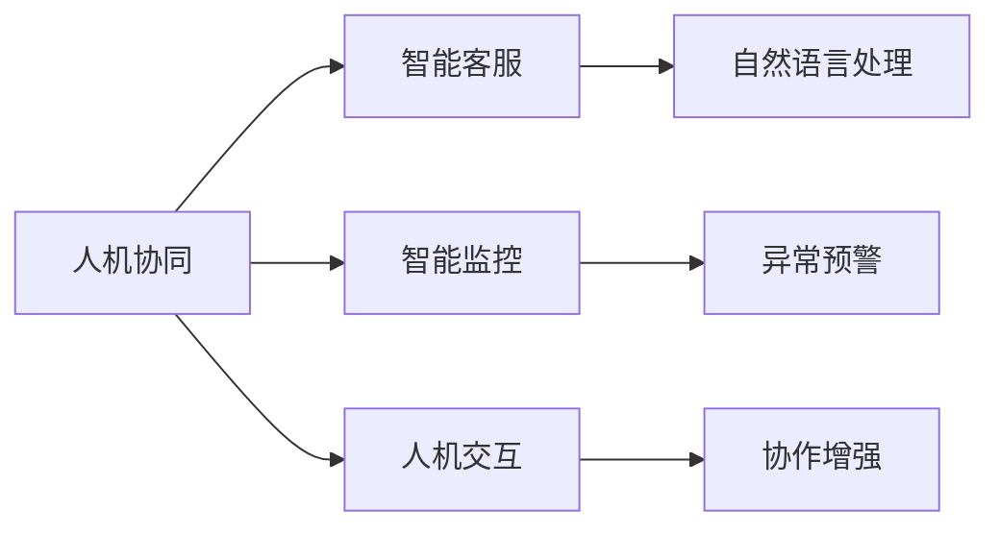
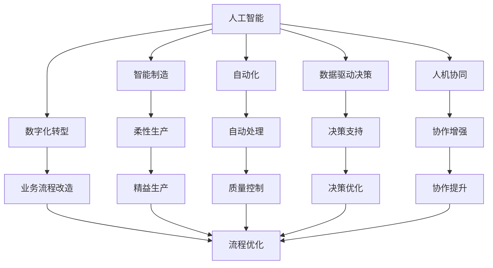

                 

# 企业转型中的AI应用技术

> 关键词：人工智能,企业转型,智能制造,数字化转型,自动化,数据驱动,决策支持

## 1. 背景介绍

### 1.1 问题由来
随着第四次工业革命的到来，人工智能(AI)正成为推动各行各业转型升级的关键力量。从智能制造到数字化转型，从自动驾驶到智慧城市，AI技术正在企业各个角落展现出强大的生命力。据麦肯锡研究报告，AI驱动的转型有望在2025年全球GDP贡献6-10万亿美元，企业必须积极拥抱AI，才能在激烈的市场竞争中占据有利位置。

### 1.2 问题核心关键点
企业AI应用的核心关键点在于如何高效整合技术资源，实现业务流程的智能化改造，提升企业的决策能力和市场竞争力。核心要素包括：
- **技术应用适配**：根据企业特点，选择合适的AI技术和应用场景。
- **数据驱动决策**：利用AI分析海量数据，提供精准的决策支持。
- **流程优化自动化**：使用AI工具优化企业内部流程，提高效率。
- **业务协同增强**：借助AI技术，加强各业务环节的协同配合。
- **人机协同改善**：平衡AI与人工，实现最优的人机协作模式。

### 1.3 问题研究意义
企业AI应用的广泛应用，对于提升生产效率、降低运营成本、优化客户体验等方面具有重要意义：

1. **生产效率提升**：AI技术能够自动化处理大量重复性工作，减少人为错误，提升生产效率。
2. **运营成本降低**：通过智能分析优化资源配置，减少浪费，降低运营成本。
3. **客户体验优化**：AI驱动的个性化推荐、智能客服等应用，提升客户满意度。
4. **决策能力加强**：数据驱动的AI分析提供更为全面和准确的决策支持，减少决策偏差。
5. **市场竞争力增强**：在快速变化的商业环境中，AI技术帮助企业抢占先机，提升市场竞争力。

## 2. 核心概念与联系

### 2.1 核心概念概述

为更好地理解企业AI应用的原理和架构，本节将介绍几个密切相关的核心概念：

- **人工智能**：涉及机器学习、深度学习、自然语言处理、计算机视觉等多个领域，通过算法模型实现智能决策和自动处理。
- **智能制造**：利用AI技术提升制造业的智能化水平，实现柔性生产、精益生产、质量控制等。
- **数字化转型**：通过数字化手段改造企业业务流程，提升企业数据管理和决策能力。
- **自动化**：指利用AI和机器人技术自动完成重复性任务，减少人工干预。
- **数据驱动决策**：通过数据分析和AI模型，为企业提供数据驱动的决策支持。
- **人机协同**：结合人工智能与人类智能，实现最优的人机协作模式，提升工作效率和决策质量。

这些核心概念之间的逻辑关系可以通过以下Mermaid流程图来展示：



这个流程图展示了几项关键技术的联系：

1. 人工智能作为基础技术，为智能制造、数字化转型、自动化、数据驱动决策和人机协同提供支持。
2. 智能制造、自动化、数字化转型等都是人工智能的具体应用场景。
3. 数据驱动决策和人机协同则体现了AI技术在业务决策和人员协作中的应用价值。

### 2.2 概念间的关系

这些核心概念之间存在着紧密的联系，形成了企业AI应用的技术生态系统。下面我们通过几个Mermaid流程图来展示这些概念之间的关系。

#### 2.2.1 智能制造与数字化转型



这个流程图展示了智能制造和数字化转型之间的联系。智能制造利用AI技术优化生产流程，而数字化转型通过数据驱动的方式改造业务流程，两者共同提升企业的生产效率和运营能力。

#### 2.2.2 自动化技术应用



这个流程图展示了自动化技术的多种应用场景。机器人流程自动化可以自动处理重复性任务，监控和维护自动化可以实时监测设备状态，两者都是企业自动化的关键技术。同时，工业互联网的融合应用，为企业提供了更全面的数据采集和集成能力。

#### 2.2.3 数据驱动决策的实施



这个流程图展示了数据驱动决策的实施流程。商业智能、预测分析、实时监控和异常检测都是实现数据驱动决策的关键技术。决策支持系统将上述技术整合，为企业提供智能化的决策支持。

#### 2.2.4 人机协同的实现



这个流程图展示了人机协同的实现方式。智能客服和智能监控都是人机协同的具体应用场景，自然语言处理和人机交互技术则支持这些应用场景的实现。

### 2.3 核心概念的整体架构

最后，我们用一个综合的流程图来展示这些核心概念在企业AI应用中的整体架构：



这个综合流程图展示了从人工智能到企业各环节的AI应用。通过人工智能技术，企业可以实现智能制造、数字化转型、自动化、数据驱动决策和人机协同等多个领域的升级。

## 3. 核心算法原理 & 具体操作步骤
### 3.1 算法原理概述

企业AI应用的核心算法原理可以概括为数据驱动和模型驱动两种方式：

- **数据驱动**：利用大数据技术，通过统计分析和机器学习算法，发现业务模式和规律，支持决策。
- **模型驱动**：使用深度学习等AI技术，构建智能模型，实现自动化决策和预测。

在企业转型过程中，数据驱动和模型驱动往往是结合使用的。以下将分别介绍两种方式的原理和操作步骤。

### 3.2 算法步骤详解

#### 3.2.1 数据驱动的算法步骤

1. **数据采集与预处理**：采集业务相关的数据，并进行清洗和标注，为后续分析和建模做准备。
2. **数据存储与管理**：建立数据仓库，对数据进行结构化存储和管理。
3. **数据建模与分析**：利用统计分析和机器学习算法，构建数据模型，提取数据规律。
4. **数据可视化**：将分析结果通过图表展示，帮助业务人员理解数据趋势和规律。
5. **决策支持**：根据数据分析结果，提供数据驱动的决策支持。

#### 3.2.2 模型驱动的算法步骤

1. **数据采集与预处理**：采集业务相关的数据，并进行清洗和标注，为后续建模做准备。
2. **模型构建与训练**：使用深度学习等AI技术，构建智能模型，并进行参数优化。
3. **模型评估与调优**：评估模型性能，进行参数调整和优化，提高模型准确性。
4. **模型部署与应用**：将训练好的模型部署到生产环境，进行自动化决策和预测。
5. **模型监控与维护**：实时监控模型性能，进行模型更新和维护，保证模型可靠性。

### 3.3 算法优缺点

#### 3.3.1 数据驱动算法的优缺点

- **优点**：
  - 基于现实数据，具有较强的业务相关性和实用性。
  - 数据驱动的决策更具可解释性，便于业务人员理解和接受。
- **缺点**：
  - 数据采集和标注成本较高，数据质量和完整性难以保证。
  - 需要大量的数据进行训练，数据处理和分析过程复杂。
  - 数据分析结果受到数据质量的影响，可能存在偏差。

#### 3.3.2 模型驱动算法的优缺点

- **优点**：
  - 能够处理复杂的数据和非结构化信息，模型表现能力更强。
  - 模型可以不断学习和优化，适应新的数据和变化。
- **缺点**：
  - 模型训练和调优过程复杂，需要专业的数据科学家和技术支持。
  - 模型的可解释性较差，业务人员难以理解其决策逻辑。
  - 模型依赖于训练数据的数量和质量，存在过拟合和泛化能力不足的风险。

### 3.4 算法应用领域

AI算法在企业中具有广泛的应用领域，包括但不限于：

- **智能制造**：生产计划、质量控制、设备维护、供应链管理等。
- **数字化转型**：客户关系管理、销售预测、财务分析、人力资源管理等。
- **自动化**：机器人流程自动化、自然语言处理、计算机视觉等。
- **数据驱动决策**：商业智能、预测分析、异常检测等。
- **人机协同**：智能客服、智能监控、智能推荐等。

## 4. 数学模型和公式 & 详细讲解 & 举例说明

### 4.1 数学模型构建

企业AI应用的数学模型通常包括统计模型、机器学习模型和深度学习模型三类。以下以机器学习中的回归模型为例，进行详细介绍。

设企业业务数据为 $X=\{x_1, x_2, ..., x_n\}$，对应的目标值为 $Y=\{y_1, y_2, ..., y_n\}$。回归模型的目标是找到一个函数 $f(X)$，使得 $f(x_i)$ 与 $y_i$ 尽量接近。

数学模型可表示为：

$$
f(x_i) = \sum_{j=1}^{n} \theta_j x_{i,j} + \epsilon
$$

其中 $\theta_j$ 为模型参数，$\epsilon$ 为误差项。

### 4.2 公式推导过程

回归模型求解的关键在于参数 $\theta_j$ 的估计。常用的参数估计方法包括最小二乘法、最大似然估计等。以最小二乘法为例，其目标是最小化损失函数：

$$
\min_{\theta} \sum_{i=1}^{n} (y_i - f(x_i))^2
$$

将上述公式转化为矩阵形式：

$$
\min_{\theta} \|Y - X\theta\|^2
$$

求解上述最小化问题，得到：

$$
\hat{\theta} = (X^T X)^{-1} X^T Y
$$

其中 $X$ 为数据矩阵，$Y$ 为目标向量，$\hat{\theta}$ 为估计参数。

### 4.3 案例分析与讲解

以某电商企业的销售预测模型为例，利用机器学习算法预测未来销售额。具体步骤如下：

1. **数据采集**：收集历史销售数据、客户数据、市场数据等。
2. **数据预处理**：清洗和标注数据，生成数据矩阵 $X$ 和目标向量 $Y$。
3. **模型构建**：选择线性回归模型，利用最小二乘法求解模型参数 $\theta$。
4. **模型评估**：在验证集上评估模型性能，调整模型参数，优化模型表现。
5. **模型应用**：将训练好的模型应用到生产环境，进行实时预测。

## 5. 项目实践：代码实例和详细解释说明

### 5.1 开发环境搭建

在企业AI应用的开发中，常用的编程语言包括Python和R，常用的开发工具包括Jupyter Notebook和RStudio。以下以Python为例，介绍开发环境的搭建方法。

1. **安装Python**：从官网下载并安装Python，选择最新版本（如3.8或3.9）。
2. **安装Jupyter Notebook**：使用pip或conda安装Jupyter Notebook，推荐使用conda环境。
3. **安装必要的库**：安装常用的数据分析库（如NumPy、Pandas）和机器学习库（如Scikit-Learn、TensorFlow）。

### 5.2 源代码详细实现

以下以某企业的智能制造案例为例，使用Scikit-Learn库实现回归模型。

**数据集准备**：

```python
import pandas as pd
from sklearn.model_selection import train_test_split

# 读取数据
data = pd.read_csv('sales_data.csv')

# 数据清洗和预处理
# 假设已有预处理代码

# 特征选择和编码
X = data[['feature1', 'feature2', 'feature3']]
y = data['sales']
X_train, X_test, y_train, y_test = train_test_split(X, y, test_size=0.2, random_state=42)
```

**模型构建与训练**：

```python
from sklearn.linear_model import LinearRegression

# 构建模型
model = LinearRegression()

# 模型训练
model.fit(X_train, y_train)
```

**模型评估与调优**：

```python
from sklearn.metrics import mean_squared_error, r2_score

# 模型评估
y_pred = model.predict(X_test)
mse = mean_squared_error(y_test, y_pred)
r2 = r2_score(y_test, y_pred)
print('MSE:', mse)
print('R2:', r2)
```

**模型应用**：

```python
# 模型预测
new_data = pd.DataFrame({'feature1': [1.2], 'feature2': [0.8], 'feature3': [0.5]})
y_pred = model.predict(new_data)
print('Predicted sales:', y_pred)
```

### 5.3 代码解读与分析

**数据集准备**：
- 使用pandas库读取数据集，并进行清洗和预处理，生成数据矩阵 $X$ 和目标向量 $y$。
- 使用train_test_split函数将数据集划分为训练集和测试集，便于模型训练和评估。

**模型构建与训练**：
- 使用Scikit-Learn库中的LinearRegression模型，构建线性回归模型。
- 使用fit方法训练模型，使用训练集数据 $X_{train}$ 和 $y_{train}$ 训练模型。

**模型评估与调优**：
- 使用mean_squared_error和r2_score函数评估模型性能。
- 通过调整模型参数和特征选择，优化模型性能。

**模型应用**：
- 使用训练好的模型对新数据进行预测，生成销售预测结果。

### 5.4 运行结果展示

假设在上述案例中，我们得到了MSE=0.1和R2=0.9的评估结果。这表明我们的模型在预测准确性和拟合效果上均表现良好。

## 6. 实际应用场景

### 6.1 智能制造

在智能制造中，AI技术可以用于生产调度、设备维护、质量控制等多个环节。以生产调度为例，AI可以基于实时数据和历史经验，预测设备运行状态，自动调整生产计划，提高生产效率和质量。

**应用场景**：
- **预测维护**：通过传感器数据和历史维护记录，预测设备故障，进行预防性维护。
- **动态调度**：基于实时数据和生产需求，动态调整生产计划，优化资源配置。
- **质量控制**：利用图像识别技术检测产品质量，自动筛选不合格品。

**技术实现**：
- **数据采集与处理**：使用传感器、摄像头等设备采集生产数据。
- **数据建模与分析**：利用机器学习算法，构建预测模型，进行故障预测和质量检测。
- **模型部署与应用**：将模型部署到工业控制系统，进行实时预测和决策。

### 6.2 数字化转型

数字化转型是指利用数字技术改造企业的业务流程，提升企业的数据管理和决策能力。AI技术在数字化转型中的应用广泛，包括客户关系管理、销售预测、财务分析等。

**应用场景**：
- **客户关系管理**：利用AI分析客户行为和需求，提供个性化的产品和服务。
- **销售预测**：通过销售数据和市场趋势，预测未来销售情况，优化库存管理。
- **财务分析**：利用AI技术分析财务报表，提供精准的财务预测和风险评估。

**技术实现**：
- **数据采集与处理**：收集企业的业务数据，并进行清洗和标注。
- **数据建模与分析**：利用机器学习和深度学习算法，构建预测模型和分析模型。
- **数据可视化与决策支持**：将分析结果可视化展示，提供数据驱动的决策支持。

### 6.3 自动化

自动化技术通过AI和机器人技术，实现企业内部的自动化处理，减少人工干预，提升工作效率。在制造、物流、客服等领域，自动化技术的应用已经相当广泛。

**应用场景**：
- **机器人流程自动化**：利用机器人完成重复性任务，如数据录入、报表生成等。
- **智能客服**：使用自然语言处理技术，自动回答客户咨询，提高客户满意度。
- **供应链管理**：通过AI分析供应链数据，优化物流和库存管理，提高供应链效率。

**技术实现**：
- **机器人部署与应用**：在生产线上部署机器人，进行自动化操作。
- **自然语言处理**：使用NLP技术，自动处理客户咨询，生成响应。
- **智能调度**：利用AI算法优化供应链调度，提高物流效率。

### 6.4 数据驱动决策

数据驱动决策是指通过数据分析和AI模型，为企业提供精准的决策支持。在客户关系管理、市场预测、风险评估等方面，数据驱动决策具有重要作用。

**应用场景**：
- **客户关系管理**：利用AI分析客户行为数据，优化营销策略和客户体验。
- **市场预测**：通过分析市场数据和历史趋势，预测未来市场变化，制定销售策略。
- **风险评估**：利用AI模型分析金融数据，评估企业风险，制定风险控制策略。

**技术实现**：
- **数据采集与处理**：收集企业的业务数据，并进行清洗和标注。
- **数据建模与分析**：利用机器学习和深度学习算法，构建预测模型和分析模型。
- **决策支持与优化**：将分析结果展示，提供数据驱动的决策支持，优化决策过程。

### 6.5 人机协同

人机协同是指结合AI与人类智能，实现最优的人机协作模式，提高工作效率和决策质量。在客服、监控、推荐等领域，人机协同技术的应用已经逐渐普及。

**应用场景**：
- **智能客服**：使用AI技术自动回答客户咨询，并提供人工客服支持。
- **智能监控**：利用AI技术自动监控设备状态，进行异常预警。
- **个性化推荐**：利用AI技术分析用户行为，提供个性化的产品和服务推荐。

**技术实现**：
- **智能交互**：使用NLP技术，自动处理客户咨询，生成响应。
- **异常检测**：利用AI算法分析设备数据，检测异常情况，进行预警。
- **推荐系统**：使用协同过滤和推荐算法，提供个性化的产品推荐。

## 7. 工具和资源推荐

### 7.1 学习资源推荐

为了帮助开发者系统掌握企业AI应用的理论基础和实践技巧，这里推荐一些优质的学习资源：

1. **《深度学习》课程**：斯坦福大学开设的深度学习课程，涵盖深度学习的基本概念和算法，是入门深度学习的优质资源。
2. **《Python数据科学手册》书籍**：由知名数据科学家Jake VanderPlas撰写，全面介绍Python数据科学和机器学习技术，适合各层次读者。
3. **《机器学习实战》书籍**：作者Peter Harrington通过实例演示，详细讲解了机器学习算法的实现和应用，是实践学习的优秀教材。
4. **Kaggle竞赛平台**：提供大量数据集和竞赛项目，通过实战学习数据分析和机器学习技术。
5. **Coursera课程平台**：提供多种AI和数据科学课程，涵盖机器学习、深度学习、自然语言处理等多个领域。

### 7.2 开发工具推荐

高效的软件开发离不开合适的工具支持。以下是几款用于企业AI应用开发的常用工具：

1. **Jupyter Notebook**：开源的交互式笔记本，支持Python、R等多种语言，适合数据探索和模型训练。
2. **RStudio**：面向R语言的数据分析工具，提供强大的代码编辑和可视化功能。
3. **TensorFlow**：由Google开发的人工智能框架，支持深度学习模型的构建和训练。
4. **PyTorch**：由Facebook开发的开源机器学习库，支持动态计算图，适合研究前沿模型。
5. **D3.js**：开源的JavaScript图表库，用于数据可视化和交互式展示。

### 7.3 相关论文推荐

企业AI应用的研究涉及多个领域，以下是几篇代表性的论文，推荐阅读：

1. **《大数据驱动的企业决策优化》**：探讨了大数据在企业决策中的应用，提出了一种基于大数据的决策优化方法。
2. **《深度学习在智能制造中的应用》**：介绍了深度学习在智能制造中的多个应用场景，展示了其强大的预测和优化能力。
3. **《人机协同中的AI技术》**：研究了人机协同中的AI技术，探讨了自然语言处理、图像识别等技术在协作中的应用。
4. **《数据驱动的企业数字化转型》**：分析了数据驱动的数字化转型方法，展示了AI技术在企业中的应用价值。
5. **《机器学习在企业自动化中的应用》**：介绍了机器学习在自动化中的应用，提出了多种自动化技术方案。

## 8. 总结：未来发展趋势与挑战

### 8.1 总结

本文对企业AI应用的原理、算法和操作步骤进行了全面系统的介绍。首先阐述了企业AI应用的广泛背景和应用价值，明确了数据驱动和模型驱动两种主要的AI应用方式。其次，从原理到实践，详细讲解了企业AI应用的数学模型和操作步骤，给出了具体的代码实例和运行结果。最后，讨论了企业AI应用在多个领域的具体应用场景，推荐了相关学习资源和开发工具。

通过本文的系统梳理，可以看到，企业AI应用已经在多个领域展现出强大的应用潜力，成为企业转型升级的关键力量。未来，伴随AI技术的不断发展和深入应用，企业AI应用将迎来更加广阔的发展前景。

### 8.2 未来发展趋势

展望未来，企业AI应用技术将呈现以下几个发展趋势：

1. **智能化水平提升**：随着AI技术的不断进步，企业AI应用将逐渐从自动化向智能化转变，具备更强的自我学习和优化能力。
2. **跨领域融合应用**：AI技术将与其他领域的技术进行深度融合，如物联网、大数据、区块链等，实现更为全面的企业升级。
3. **个性化和定制化**：AI技术将更加注重个性化和定制化，根据企业具体需求和场景，提供更加精准和灵活的解决方案。
4. **实时化和动态化**：企业AI应用将具备实时分析和动态优化能力，能够及时响应市场变化和业务需求。
5. **人机协同增强**：人机协同技术将不断提升，AI与人类智能的结合将更加紧密，提升企业决策和运营效率。

### 8.3 面临的挑战

尽管企业AI应用已经取得了显著进展，但在实施过程中仍面临诸多挑战：

1. **技术复杂度高**：企业AI应用的开发和实施涉及多种技术和工具，技术复杂度高。
2. **数据质量和隐私**：数据质量和隐私保护是企业AI应用的重要瓶颈，需要建立完善的数据治理机制。
3. **人才短缺**：高水平的AI专家和工程师相对短缺，需要加强人才培养和团队建设。
4. **成本和回报**：企业AI应用的初始投资和运营成本较高，回报周期较长，需要综合评估投资效益。
5. **安全和合规**：AI技术的应用需要考虑安全和合规问题，防止数据泄露和滥用。

### 8.4 研究展望

面对企业AI应用所面临的挑战，未来的研究需要在以下几个方面寻求新的突破：

1. **简化技术架构**：开发更易用、更高效的企业AI应用开发框架，降低技术门槛。
2. **提升数据质量**：研究和开发更好的数据清洗、标注和处理技术，提高数据质量和可用性。
3. **强化隐私保护**：设计和实现更强的数据隐私保护机制，保障企业数据安全和合规性。
4. **优化人才培训**：制定企业AI人才培训计划，培养更多具有跨学科能力的AI专家。
5. **探索商业价值**：深入研究AI技术在企业中的应用价值，探索新的商业模式和收益点。

总之，企业AI应用需要在技术、数据、人才、成本等多个方面进行全面优化和提升，才能真正实现智能转型，提升企业竞争力。

## 9. 附录：常见问题与解答

**Q1：企业AI应用的开发流程是怎样的？**

A: 企业AI应用的开发流程通常包括以下几个步骤：
1. **需求分析**：明确业务需求和目标，进行需求分析。
2. **数据准备**：收集和清洗数据

