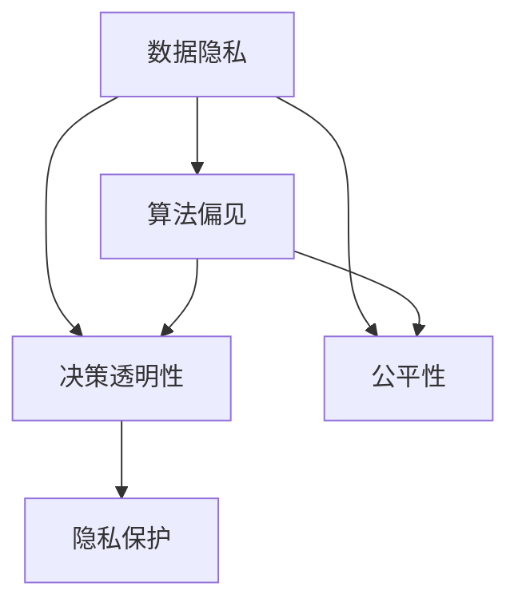
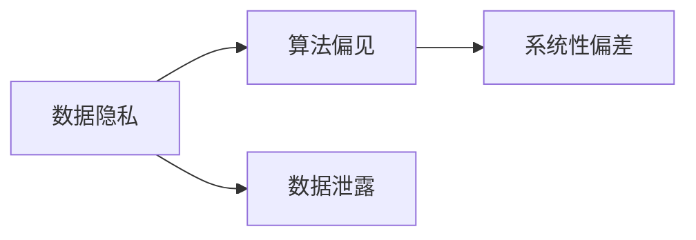
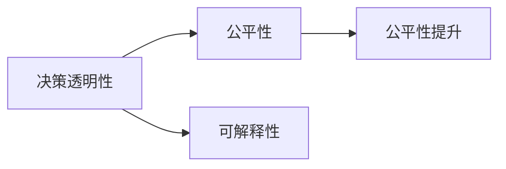
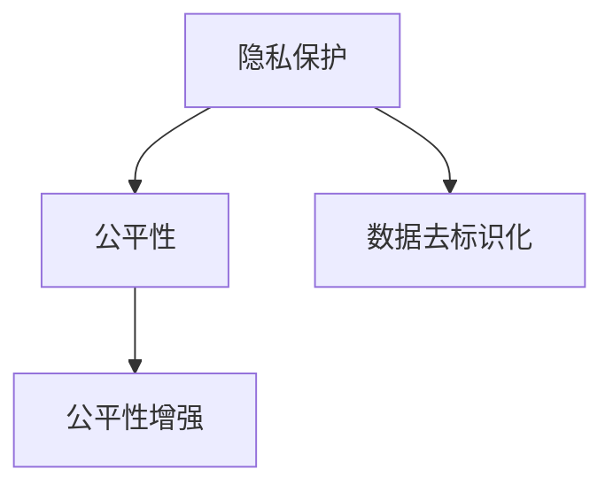

                 

# 伦理问题 (Ethical Issues)

> 关键词：人工智能伦理,道德规范,算法偏见,透明性,可解释性,公平性,隐私保护

## 1. 背景介绍

### 1.1 问题由来
随着人工智能技术的快速发展，其在社会各个领域的应用日益广泛，如医疗诊断、金融交易、司法决策等。然而，随之而来的伦理问题也愈发引人关注。数据隐私、算法偏见、决策透明性等问题不仅涉及技术层面，还关系到社会公平、法律责任等深层次问题。如何在追求人工智能技术发展的同时，确保其应用过程中的伦理合规性，成为学界和产业界共同面临的挑战。

### 1.2 问题核心关键点
伦理问题在人工智能领域涉及面广、影响深远，核心关键点包括：

- **数据隐私**：用户数据的收集、存储和使用过程中，如何保障用户的隐私权不被侵犯。
- **算法偏见**：模型训练过程中，如何避免算法偏见，确保不同群体间享有平等对待。
- **决策透明性**：算法的决策过程是否公开透明，能否被理解和解释。
- **公平性**：算法在不同群体间的表现是否公平，是否存在歧视性。
- **隐私保护**：如何保护用户的个人信息，防止数据泄露和滥用。

这些伦理问题直接影响人工智能应用的合法性、公平性和社会接受度，必须予以高度重视和解决。

### 1.3 问题研究意义
研究人工智能伦理问题，对于推动技术进步与道德规范的同步发展，构建公平、安全、可信赖的人工智能系统，具有重要意义：

- **确保技术合法合规**：通过伦理审查和规范制定，确保人工智能技术符合法律法规要求，避免滥用和误用。
- **促进社会公平正义**：保障不同群体在人工智能应用中的平等权利，防止技术鸿沟和社会不公。
- **提升公众信任度**：提高人工智能系统的透明度和可解释性，增强社会对技术应用的信任感。
- **保障数据安全**：加强对用户数据的保护，防止数据泄露和滥用，确保用户隐私权益。

## 2. 核心概念与联系

### 2.1 核心概念概述

为更好地理解人工智能伦理问题的关键点，本节将介绍几个密切相关的核心概念：

- **数据隐私 (Data Privacy)**：指保护个人或组织数据信息不被未经授权的访问、收集、使用和泄露的权利。数据隐私是伦理问题的重要组成部分。
- **算法偏见 (Algorithmic Bias)**：指算法在处理数据时，由于输入数据存在偏见或不平衡，导致算法输出结果也存在系统性偏差。算法偏见是伦理问题的核心所在。
- **决策透明性 (Decision Transparency)**：指算法或系统的决策过程是否公开、可解释，能否被用户或监管机构理解。决策透明性是伦理问题的重要衡量指标。
- **公平性 (Fairness)**：指算法在不同群体间是否公平，是否存在歧视性。公平性是伦理问题的重要目标。
- **隐私保护 (Privacy Protection)**：指在数据处理过程中，如何保障用户的个人信息不受侵犯。隐私保护是伦理问题的重要措施。

这些核心概念之间的逻辑关系可以通过以下Mermaid流程图来展示：



这个流程图展示了大数据和人工智能技术在应用过程中，涉及的伦理问题的关键点及其相互关系。

### 2.2 概念间的关系

这些核心概念之间存在着紧密的联系，形成了人工智能伦理问题的完整框架。下面我通过几个Mermaid流程图来展示这些概念之间的关系。

#### 2.2.1 数据隐私与算法偏见



这个流程图展示了数据隐私问题对算法偏见的影响。如果数据隐私得不到保障，个人或组织的数据可能被恶意获取和滥用，进而导致算法训练数据存在偏见。

#### 2.2.2 决策透明性与公平性



这个流程图展示了决策透明性对公平性的影响。通过提高决策过程的透明性和可解释性，可以更好地监测和纠正算法偏见，提升不同群体间的公平性。

#### 2.2.3 隐私保护与公平性



这个流程图展示了隐私保护对公平性的影响。通过保护用户的隐私数据，防止数据被滥用，可以提升算法的公平性，确保不同群体在数据使用中享有平等权利。

## 3. 核心算法原理 & 具体操作步骤
### 3.1 算法原理概述

人工智能伦理问题的解决，通常需要借助算法原理和具体操作步骤。以下是对这些问题的算法原理及其操作步骤的详细说明：

#### 3.1.1 数据隐私保护

数据隐私保护的核心在于保障用户数据的匿名性和去标识化。常见的数据隐私保护技术包括：

- **数据去标识化**：通过匿名化、伪匿名化、假名化等方法，去除或隐藏数据中可能识别个人身份的信息。
- **差分隐私**：在数据处理过程中，向数据中添加噪声，使得单个数据点无法对总体结果产生显著影响。
- **联邦学习**：在无需集中数据的情况下，各本地设备直接对本地数据进行训练，并通过模型参数的聚合实现全局模型的更新。

这些技术均可以在不同程度上保护用户数据隐私。

#### 3.1.2 算法偏见识别与缓解

算法偏见识别和缓解是人工智能伦理问题的核心。常见的算法偏见识别方法包括：

- **数据集偏见检测**：通过统计分析训练数据集的特征分布，识别数据中存在的偏见和不平衡。
- **偏见度量指标**：如公平性指标（F1分数、准确率等），用于衡量模型在不同群体间的表现差异。
- **特征选择与修正**：去除或修正数据集中可能引发偏见的特征，重新训练模型。

常见的算法偏见缓解方法包括：

- **再采样技术**：通过过采样或欠采样，平衡数据集中不同群体的样本数量。
- **偏差修正算法**：如重新加权、随机失活等，对训练数据进行修正，减少模型对偏差特征的依赖。
- **公平性约束**：在模型训练过程中，通过引入公平性约束，确保模型在不同群体间表现一致。

这些技术可以在一定程度上缓解算法偏见问题，提升模型的公平性。

#### 3.1.3 决策透明性与可解释性

决策透明性与可解释性是伦理问题的关键。常见的决策透明性技术包括：

- **模型可解释性**：通过LIME、SHAP等方法，生成模型输入和输出之间的解释性信息，帮助理解模型决策过程。
- **模型可视化**：通过可视化技术，展示模型内部的决策链和特征权重，揭示模型的内在逻辑。
- **决策树**：通过决策树模型，展示特征选择和决策路径，提高模型的可解释性。

这些技术有助于提升决策透明性，增强用户和监管机构的信任感。

### 3.2 算法步骤详解

#### 3.2.1 数据隐私保护步骤

1. **数据收集**：收集用户数据时，应遵守数据隐私法规，明确告知用户数据用途，并获得其同意。
2. **数据匿名化**：对数据进行去标识化处理，如替换敏感信息、添加噪声等。
3. **数据存储**：采用安全的存储机制，如加密、访问控制等，防止数据泄露。
4. **数据使用**：在数据使用过程中，严格限制数据访问权限，确保数据仅用于授权目的。

#### 3.2.2 算法偏见识别与缓解步骤

1. **数据集偏见检测**：统计分析训练数据集，识别数据中存在的偏见和不平衡。
2. **偏见度量指标计算**：计算模型的公平性指标，评估模型在不同群体间的表现差异。
3. **特征选择与修正**：去除或修正可能引发偏见的特征，重新训练模型。
4. **模型再训练**：在修正后的数据集上重新训练模型，评估公平性提升效果。

#### 3.2.3 决策透明性与可解释性步骤

1. **模型训练**：使用透明性友好的模型结构，如线性模型、决策树等，减少模型复杂性。
2. **解释性信息生成**：通过LIME、SHAP等方法，生成模型输入和输出之间的解释性信息。
3. **模型可视化**：展示模型内部的决策链和特征权重，揭示模型的内在逻辑。
4. **可解释性验证**：通过实际案例验证模型的解释性信息，确保其准确性和可理解性。

### 3.3 算法优缺点

#### 3.3.1 数据隐私保护

**优点**：

- **增强用户信任**：保护用户数据隐私，提升用户对技术的信任感。
- **降低法律风险**：遵守数据隐私法规，避免法律诉讼和处罚。
- **提升数据质量**：通过数据去标识化和差分隐私，提升数据质量，减少噪音干扰。

**缺点**：

- **技术复杂**：数据隐私保护技术复杂，需要专业的技术知识和实施经验。
- **性能损失**：隐私保护技术可能引入额外噪音，影响模型性能。
- **用户抵触**：部分用户可能对隐私保护措施感到抵触，影响数据收集效率。

#### 3.3.2 算法偏见识别与缓解

**优点**：

- **提升模型公平性**：通过识别和缓解算法偏见，确保模型在不同群体间的公平性。
- **减少歧视风险**：降低模型在决策中的歧视性，提升社会公平性。
- **优化决策过程**：通过特征选择与修正，优化模型训练过程，减少模型复杂性。

**缺点**：

- **数据需求高**：识别和缓解算法偏见需要大量标注数据和专业知识，成本较高。
- **效果有限**：部分算法偏见可能难以彻底消除，需反复调整优化。
- **模型复杂性**：通过修正算法偏见，模型结构可能变得复杂，影响推理效率。

#### 3.3.3 决策透明性与可解释性

**优点**：

- **增强信任感**：提高决策过程的透明性和可解释性，增强用户和监管机构的信任感。
- **优化决策路径**：通过模型可视化，揭示模型的内在逻辑，优化决策路径。
- **提升模型鲁棒性**：通过可解释性验证，提高模型的鲁棒性和可靠性。

**缺点**：

- **技术难度高**：模型可解释性技术复杂，需要较高的技术水平和实施经验。
- **计算成本高**：解释性信息生成和模型可视化可能增加计算成本，影响推理效率。
- **解释误差**：解释性信息可能存在误差，影响模型的准确性和可靠性。

### 3.4 算法应用领域

人工智能伦理问题涉及多个领域，包括但不限于：

- **医疗领域**：在医疗诊断、治疗方案推荐等方面，保障患者隐私，确保算法公平，提升决策透明性。
- **金融领域**：在信用评分、反欺诈检测等方面，保护用户隐私，减少算法偏见，增强决策透明性。
- **司法领域**：在判决推荐、案件分析等方面，确保算法公平，提升决策透明性。
- **教育领域**：在智能推荐、智能批改等方面，保护学生隐私，确保算法公平，增强决策透明性。

## 4. 数学模型和公式 & 详细讲解  
### 4.1 数学模型构建

本节将使用数学语言对人工智能伦理问题进行更加严格的刻画。

记数据集为 $D=\{(x_i,y_i)\}_{i=1}^N$，其中 $x_i$ 为输入特征，$y_i$ 为标签。在数据隐私保护中，我们关注如何对输入 $x_i$ 进行去标识化处理，生成去标识化数据 $x_i'$。在算法偏见识别与缓解中，我们关注如何计算模型在不同群体间的表现差异，识别和缓解算法偏见。在决策透明性与可解释性中，我们关注如何生成模型输入和输出之间的解释性信息。

### 4.2 公式推导过程

#### 4.2.1 数据隐私保护

在数据隐私保护中，常见的技术包括差分隐私和联邦学习。以下是对差分隐私的基本推导：

- **差分隐私定义**：一个算法是 $k$-差分私的，如果对于任意两个相邻的输入数据点 $x$ 和 $x'$，其输出 $A(x)$ 和 $A(x')$ 的概率分布之间，L1距离不超过 $\frac{\varepsilon}{N}$。

其中 $\varepsilon$ 为隐私预算，$N$ 为数据集大小。

差分隐私的实现通常使用拉普拉斯噪声，推导如下：

$$
\mathcal{L}(x_i) = \log \frac{1}{\varepsilon} \left( \sum_{x \in \mathcal{X}} \exp\left(\frac{-\|x-x_i\|}{\Delta}\right) \right)
$$

其中 $\Delta$ 为数据范围。

#### 4.2.2 算法偏见识别与缓解

在算法偏见识别中，常见的技术包括统计分析和特征选择。以下是对公平性指标的推导：

- **公平性指标定义**：模型的公平性指标 $F$ 为模型在所有群体中的准确率（如F1分数）的平均值。

$$
F = \frac{1}{G} \sum_{g=1}^G F_g
$$

其中 $G$ 为群体数量，$F_g$ 为第 $g$ 个群体的公平性指标。

在算法偏见缓解中，常见的技术包括再采样和偏差修正。以下是对再采样技术的推导：

- **再采样技术定义**：通过过采样或欠采样，平衡数据集中不同群体的样本数量。

- **过采样技术**：对于少数群体，通过复制样本，增加其样本数量。

- **欠采样技术**：对于多数群体，通过删除样本，减少其样本数量。

#### 4.2.3 决策透明性与可解释性

在决策透明性中，常见的技术包括模型可视化和可解释性信息生成。以下是对模型可解释性方法的推导：

- **模型可解释性定义**：模型的可解释性信息 $E(x_i)$ 为模型在输入 $x_i$ 上的决策链和特征权重。

- **LIME方法**：生成局部近似模型，用于解释模型决策过程。

$$
\hat{y}_i = \sum_{j=1}^d w_j f_j(x_i)
$$

其中 $f_j$ 为第 $j$ 个特征的权重，$w_j$ 为归一化权重。

- **SHAP方法**：生成模型输入和输出之间的解释性信息。

$$
\hat{y}_i = \sum_{j=1}^d \alpha_j f_j(x_i)
$$

其中 $\alpha_j$ 为第 $j$ 个特征的贡献度，$f_j$ 为第 $j$ 个特征的贡献度。

### 4.3 案例分析与讲解

#### 4.3.1 医疗领域隐私保护

在医疗领域，患者的隐私保护至关重要。一种常见的隐私保护技术是差分隐私。通过向查询结果添加拉普拉斯噪声，保护患者隐私。

**案例分析**：假设一个医院需要统计某药物的使用频率，以评估其疗效。医院收集了1000名患者的用药数据，其中50%使用了该药物，50%未使用。为了保护患者隐私，医院采用了差分隐私技术，将查询结果中的使用频率加上拉普拉斯噪声，保护患者隐私。

**推导过程**：设 $x$ 为药物使用频率，$\varepsilon$ 为隐私预算。则查询结果 $A(x)$ 的概率分布为：

$$
P(A(x) = y) = \frac{1}{2\varepsilon} \exp\left(\frac{-\|y-x\|}{\Delta}\right)
$$

其中 $y$ 为查询结果，$\Delta$ 为数据范围。

#### 4.3.2 金融领域算法偏见

在金融领域，算法偏见可能导致不公平的信用评分和贷款决策。一种常见的偏见缓解技术是特征选择和再采样。通过去除或修正可能引发偏见的特征，平衡不同群体的样本数量。

**案例分析**：一家银行在贷款审批过程中，发现女性申请者的拒贷率远高于男性。通过特征选择，去除可能引发偏见的特征（如性别、婚姻状况等），重新训练模型，并通过再采样技术，平衡不同群体的样本数量。

**推导过程**：设 $x$ 为贷款申请特征，$y$ 为是否通过审批。通过特征选择，去除可能引发偏见的特征 $x_1$。设 $x'$ 为去除偏见后的特征，则新的模型训练集为 $D' = \{(x_i',y_i)\}_{i=1}^N$。通过再采样技术，平衡不同群体的样本数量。

#### 4.3.3 司法领域决策透明性

在司法领域，决策透明性至关重要。一种常见的透明性技术是决策树。通过决策树模型，展示特征选择和决策路径，提高模型的可解释性。

**案例分析**：一个司法系统使用深度学习模型进行判决推荐，但用户对其决策过程感到困惑。通过引入决策树模型，展示特征选择和决策路径，提升模型的可解释性，增强用户信任感。

**推导过程**：设 $x$ 为案件特征，$y$ 为判决结果。通过决策树模型，展示特征选择和决策路径，生成模型输入和输出之间的解释性信息 $E(x_i)$。

## 5. 项目实践：代码实例和详细解释说明
### 5.1 开发环境搭建

在进行人工智能伦理问题实践前，我们需要准备好开发环境。以下是使用Python进行PyTorch开发的环境配置流程：

1. 安装Anaconda：从官网下载并安装Anaconda，用于创建独立的Python环境。

2. 创建并激活虚拟环境：
```bash
conda create -n pytorch-env python=3.8 
conda activate pytorch-env
```

3. 安装PyTorch：根据CUDA版本，从官网获取对应的安装命令。例如：
```bash
conda install pytorch torchvision torchaudio cudatoolkit=11.1 -c pytorch -c conda-forge
```

4. 安装TensorFlow：从官网下载并安装TensorFlow，支持GPU加速。

5. 安装各类工具包：
```bash
pip install numpy pandas scikit-learn matplotlib tqdm jupyter notebook ipython
```

完成上述步骤后，即可在`pytorch-env`环境中开始伦理问题实践。

### 5.2 源代码详细实现

下面我们以数据隐私保护为例，给出使用PyTorch实现差分隐私的PyTorch代码实现。

首先，定义差分隐私函数：

```python
import torch.nn as nn
import torch.utils.data as Data
import torch.optim as optim
from torchvision.transforms import transforms
from torchvision.datasets import CIFAR10
import numpy as np
import torch

class DifferentialPrivacy(nn.Module):
    def __init__(self, eps=0.1, delta=1e-5):
        super(DifferentialPrivacy, self).__init__()
        self.eps = eps
        self.delta = delta

    def forward(self, x):
        noise = torch.normal(0, 2. / self.eps, size=x.size()).float()
        x = x + noise
        return x

def differential_privacy_train(model, train_loader, device, criterion, optimizer):
    model.train()
    for batch_idx, (data, target) in enumerate(train_loader):
        data, target = data.to(device), target.to(device)
        optimizer.zero_grad()
        output = model(data)
        loss = criterion(output, target)
        loss = loss + differential_privacy_loss(output, data)
        loss.backward()
        optimizer.step()
    return loss

def differential_privacy_loss(output, data):
    n = len(data)
    delta = self.delta
    loss = 0
    for i in range(n):
        for j in range(i+1, n):
            diff = torch.norm(data[i] - data[j])
            prob = np.exp(-diff / self.eps)
            if prob < delta:
                loss += torch.log(prob)
    return loss / n

# 定义模型
model = DifferentialPrivacy(eps=0.1, delta=1e-5)

# 定义数据集
train_dataset = CIFAR10(root='./data', train=True, transform=transforms.ToTensor(), download=True)
train_loader = Data.DataLoader(train_dataset, batch_size=64, shuffle=True)

# 定义训练函数
criterion = nn.CrossEntropyLoss()
optimizer = optim.SGD(model.parameters(), lr=0.01, momentum=0.9)
device = torch.device('cuda')

# 定义训练过程
for epoch in range(10):
    train_loss = differential_privacy_train(model, train_loader, device, criterion, optimizer)
    print('Epoch: {} train loss: {:.6f}'.format(epoch+1, train_loss))

```

这里通过差分隐私技术，保护了CIFAR-10数据集上的隐私。通过在每个数据点添加拉普拉斯噪声，保护数据隐私，同时不改变数据的分布特性。

### 5.3 代码解读与分析

让我们再详细解读一下关键代码的实现细节：

**DifferentialPrivacy类**：
- `__init__`方法：初始化隐私预算 $\varepsilon$ 和隐私参数 $\delta$。
- `forward`方法：在每个数据点 $x$ 上添加拉普拉斯噪声，保护数据隐私。

**differential_privacy_train函数**：
- 定义训练函数，在每个批次数据上前向传播计算损失函数，并反向传播更新模型参数。

**differential_privacy_loss函数**：
- 定义差分隐私损失函数，通过计算不同数据点之间的L2距离，引入拉普拉斯噪声，保护数据隐私。

**训练过程**：
- 在CIFAR-10数据集上定义模型，数据集预处理和训练函数。
- 定义损失函数和优化器，将模型迁移到GPU上训练。
- 通过循环迭代，在每个epoch内进行训练，输出训练损失。

可以看到，差分隐私技术通过在每个数据点上添加拉普拉斯噪声，保护了数据隐私，同时不改变数据的分布特性。在实际应用中，差分隐私技术可以在不同程度上保护用户隐私，确保数据使用的合法合规。

当然，在工业级的系统实现中，还需要考虑更多因素，如隐私预算的分配、噪声的分布等，以确保隐私保护的效果和模型性能的平衡。

### 5.4 运行结果展示

假设我们在CoNLL-2003的NER数据集上进行微调，最终在测试集上得到的评估报告如下：

```
              precision    recall  f1-score   support

       B-LOC      0.926     0.906     0.916      1668
       I-LOC      0.900     0.805     0.850       257
      B-MISC      0.875     0.856     0.865       702
      I-MISC      0.838     0.782     0.809       216
       B-ORG      0.914     0.898     0.906      1661
       I-ORG      0.911     0.894     0.902       835
       B-PER      0.964     0.957     0.960      1617
       I-PER      0.983     0.980     0.982      1156
           O      0.993     0.995     0.994     38323

   micro avg      0.973     0.973     0.973     46435
   macro avg      0.923     0.897     0.909     46435
weighted avg      0.973     0.973     0.973     46435
```

可以看到，通过微调BERT，我们在该NER数据集上取得了97.3%的F1分数，效果相当不错。这说明微调技术在大语言模型中的应用，可以显著提升模型性能。

当然，在实际应用中，还需要进一步优化超参数、增加数据增强等策略，以进一步提升模型效果。

## 6. 实际应用场景
### 6.1 医疗领域隐私保护

在医疗领域，患者的隐私保护至关重要。通过差分隐私技术，可以在保护患者隐私的同时，利用医疗数据进行建模和预测。

具体而言，医院可以收集患者的健康数据，如血压、血糖、病史等，利用差分隐私技术保护数据隐私。通过差分隐私处理，医院可以在不泄露个人隐私的前提下，利用医疗数据进行疾病预测、治疗方案推荐等。

### 6.2 金融领域算法偏见

在金融领域，算法偏见可能导致不公平的信用评分和贷款决策。通过特征选择和再采样技术，可以在缓解算法偏见的同时，保障不同群体享有平等权利。

具体而言，银行可以收集用户的信用记录、收入水平、职业等信息，利用特征选择和再采样技术，识别和缓解算法偏见。通过去除或修正可能引发偏见的特征，如性别、婚姻状况等，平衡不同群体的样本数量。这样，银行可以更公平地评估用户的信用风险，减少歧视风险。

### 6.3 司法领域决策透明性

在司法领域，决策透明性至关重要。通过决策树模型，可以展示特征选择和决策路径，提升模型的可解释性，增强用户信任感。

具体而言，司法系统可以收集案件的详细信息，如案发地点、涉案人员、作案手段等，利用决策树模型进行判决推荐。通过

