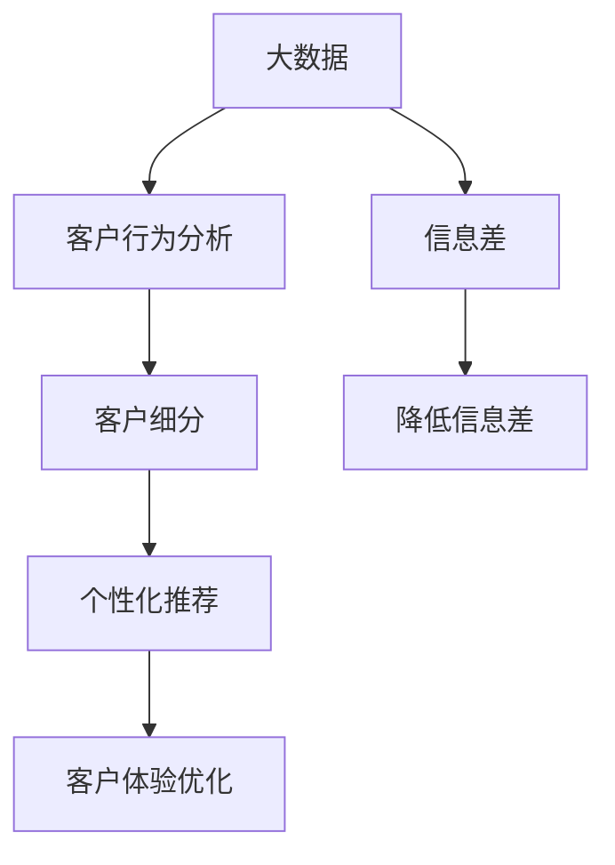
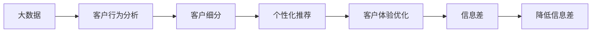
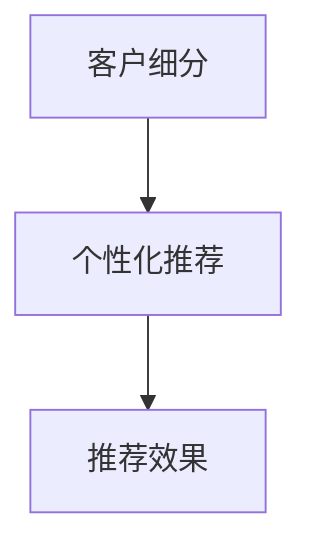
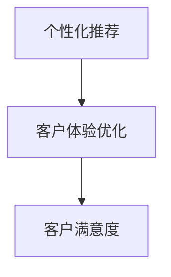
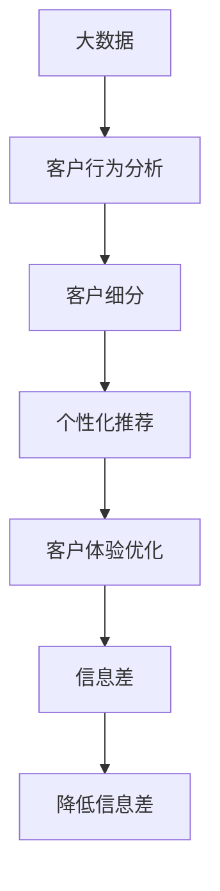

                 

# 信息差的销售个性化升级：大数据如何实现销售个性化

## 1. 背景介绍

在激烈的市场竞争中，销售个性化已成为企业提升市场竞争力和客户满意度的重要手段。传统的销售策略基于简单的统计分析，缺乏对个体客户行为和偏好的深度洞察。而随着大数据和人工智能技术的发展，销售个性化正逐步从“粗放”向“精细”转变，通过数据驱动的策略来提高销售额和客户忠诚度。

### 1.1 问题由来

销售个性化面临的挑战主要包括以下几个方面：

- **客户行为分析不足**：缺乏深入的客户行为数据，难以进行细致的客户细分。
- **个性化推荐不精准**：推荐的商品或服务无法满足客户具体需求。
- **个性化策略效果不佳**：个性化策略过于简单，未能充分发挥数据潜力。
- **客户满意度不高**：客户体验未能得到充分重视，满意度难以提升。

为应对这些挑战，企业亟需借助大数据技术，从数据中挖掘有价值的客户信息，以实现更精准、更有效的销售个性化。

### 1.2 问题核心关键点

要实现销售个性化，关键在于：

- **客户行为数据的全面收集和分析**：通过大数据技术，收集客户在不同渠道的行为数据，如浏览历史、购买记录、搜索习惯等，分析客户的兴趣偏好。
- **客户分群的细分与动态调整**：根据客户行为数据，对客户进行细分，形成不同特征的客户群，并根据市场变化动态调整。
- **个性化推荐策略的精准设计**：结合客户画像和行为数据，设计精准的个性化推荐策略，提高推荐效果。
- **客户体验的优化与提升**：在个性化策略的基础上，优化客户体验，提高客户满意度。

本文将围绕大数据如何实现销售个性化这一主题，深入探讨其在销售个性化升级中的具体应用。

## 2. 核心概念与联系

### 2.1 核心概念概述

为更好地理解大数据在销售个性化中的应用，本节将介绍几个关键概念：

- **大数据（Big Data）**：指体量巨大、复杂多样的数据集，通常涉及多源数据和实时数据流的处理。大数据技术包括数据采集、存储、处理、分析等环节。
- **客户行为分析（Customer Behavior Analysis）**：通过分析客户在各个渠道的行为数据，了解客户的兴趣偏好、购买决策过程等。
- **客户细分（Customer Segmentation）**：将客户划分为不同的群体，以便于精准营销和个性化服务。
- **个性化推荐（Personalized Recommendation）**：根据客户画像和行为数据，向客户推荐个性化的商品或服务。
- **客户体验优化（Customer Experience Optimization）**：通过改进产品、服务和营销策略，提升客户的整体体验。
- **信息差（Information Gap）**：指客户在了解产品信息方面的差异，不同客户对产品信息的掌握程度不同，信息差越大，客户的购买意愿越低。

这些概念之间的逻辑关系可以通过以下Mermaid流程图来展示：



这个流程图展示了大数据在销售个性化中的应用流程：

1. 通过大数据技术收集客户行为数据。
2. 对客户进行细分，形成不同的客户群。
3. 根据客户细分结果，设计个性化的推荐策略。
4. 优化客户体验，提升客户满意度。
5. 通过降低信息差，提高客户购买意愿。

### 2.2 概念间的关系

这些核心概念之间存在着紧密的联系，共同构成了销售个性化的完整生态系统。下面我们通过几个Mermaid流程图来展示这些概念之间的关系。

#### 2.2.1 大数据在销售个性化的应用流程



这个流程图展示了大数据技术在销售个性化中的应用流程：

1. 通过大数据技术收集客户行为数据。
2. 对客户进行细分，形成不同的客户群。
3. 根据客户细分结果，设计个性化的推荐策略。
4. 优化客户体验，提升客户满意度。
5. 通过降低信息差，提高客户购买意愿。

#### 2.2.2 客户细分与个性化推荐的关系



这个流程图展示了客户细分与个性化推荐之间的关系：

1. 通过对客户进行细分，可以更精准地设计个性化推荐策略。
2. 个性化的推荐策略能更好地满足客户的个性化需求，提高推荐效果。

#### 2.2.3 个性化推荐与客户体验的关系



这个流程图展示了个性化推荐与客户体验优化之间的关系：

1. 个性化的推荐策略能够提升客户的整体体验。
2. 优化的客户体验能够进一步提高客户满意度。

### 2.3 核心概念的整体架构

最后，我们用一个综合的流程图来展示这些核心概念在大数据应用中的整体架构：



这个综合流程图展示了从大数据收集到最终提升客户满意度的完整过程。大数据技术通过收集客户行为数据，对客户进行细分，设计个性化推荐策略，优化客户体验，最终实现降低信息差，提升客户购买意愿的目标。

## 3. 核心算法原理 & 具体操作步骤

### 3.1 算法原理概述

大数据在销售个性化中的应用，主要涉及以下几个关键算法和流程：

- **数据预处理**：清洗、整合、归一化等操作，确保数据的质量和一致性。
- **特征工程**：提取、选择、变换等操作，构建有意义的特征向量。
- **客户细分**：基于聚类、分类等算法，对客户进行分组。
- **个性化推荐**：基于协同过滤、内容推荐等算法，生成个性化推荐。
- **客户体验优化**：基于A/B测试、用户反馈等，优化推荐策略和营销方案。

这些算法和技术，共同构成了大数据在销售个性化中的核心框架。

### 3.2 算法步骤详解

下面详细介绍每个关键算法的详细步骤：

**3.2.1 数据预处理**

数据预处理是整个流程的基础，主要包括：

- **数据清洗**：去除重复、缺失、异常数据，确保数据的质量。
- **数据整合**：将来自不同渠道的数据整合到一个统一的数据源。
- **数据归一化**：将不同量级的数据归一化到相同的尺度和范围。

具体步骤包括：

1. **数据清洗**：
   - 去除重复数据，防止冗余信息的干扰。
   - 处理缺失值，通常采用均值、中位数或插值方法填补。
   - 检测并剔除异常值，避免噪音数据的影响。

2. **数据整合**：
   - 将来自网站、社交媒体、邮件等多个渠道的数据合并。
   - 统一数据格式，确保不同数据源的数据一致性。

3. **数据归一化**：
   - 将不同量级的数据归一化到[0,1]区间或均值0、标准差1的分布。
   - 使用Min-Max归一化、Z-score归一化等方法。

**3.2.2 特征工程**

特征工程是数据分析的重要环节，影响着推荐系统的性能。主要步骤如下：

- **特征提取**：从原始数据中提取有意义的特征。
- **特征选择**：选择对目标变量影响最大的特征。
- **特征变换**：对特征进行转换、组合等操作，生成新的特征。

具体步骤包括：

1. **特征提取**：
   - 从文本数据中提取关键词、情感极性等特征。
   - 从行为数据中提取访问时长、点击率、转化率等特征。

2. **特征选择**：
   - 使用信息增益、卡方检验等方法，筛选对目标变量影响较大的特征。
   - 使用特征选择算法，如Lasso、Ridge等，缩减特征维度。

3. **特征变换**：
   - 对特征进行独热编码、分箱处理等操作。
   - 使用多项式特征、交叉特征等生成新的特征。

**3.2.3 客户细分**

客户细分是实现个性化推荐的基础，主要步骤如下：

- **聚类算法**：基于K-means、DBSCAN等算法，将客户分成不同的群体。
- **分类算法**：基于决策树、SVM等算法，对客户进行分类。
- **标签体系**：构建基于规则或机器学习的标签体系，标记客户的特征属性。

具体步骤包括：

1. **聚类算法**：
   - 使用K-means算法，对客户行为数据进行聚类。
   - 确定聚类的数量，通常使用肘部法则或轮廓系数确定。

2. **分类算法**：
   - 使用决策树算法，根据客户行为数据进行分类。
   - 设置分类规则，例如年龄、性别、消费金额等。

3. **标签体系**：
   - 构建基于规则的标签体系，如“高价值客户”、“新客户”等。
   - 使用机器学习模型，学习客户特征，自动生成标签。

**3.2.4 个性化推荐**

个性化推荐是销售个性化的核心，主要步骤如下：

- **协同过滤算法**：基于用户行为数据，推荐类似商品或服务。
- **内容推荐算法**：基于商品或服务的特征，推荐相关商品或服务。
- **混合推荐算法**：结合多种推荐方法，提高推荐效果。

具体步骤包括：

1. **协同过滤算法**：
   - 使用基于用户的协同过滤，推荐相似用户喜欢的商品或服务。
   - 使用基于物品的协同过滤，推荐相似物品的交叉商品或服务。

2. **内容推荐算法**：
   - 使用基于内容的推荐，根据商品或服务的属性特征，推荐相关商品或服务。
   - 使用深度学习模型，如CTR、DNN等，预测客户对商品或服务的兴趣。

3. **混合推荐算法**：
   - 结合协同过滤和内容推荐，生成综合推荐结果。
   - 引入时间因素、位置因素等，提高推荐的实时性和精准性。

**3.2.5 客户体验优化**

客户体验优化是提升客户满意度的关键，主要步骤如下：

- **A/B测试**：通过对比测试不同的推荐策略和营销方案，选择最优方案。
- **用户反馈**：收集用户对推荐结果的反馈，调整推荐策略。
- **界面设计**：优化产品界面，提升客户使用体验。

具体步骤包括：

1. **A/B测试**：
   - 设置不同版本的产品或服务，随机分配给不同客户群体。
   - 收集测试数据，比较不同版本的表现。

2. **用户反馈**：
   - 收集客户对推荐结果的反馈，包括满意度、可用性等。
   - 分析反馈结果，调整推荐策略和优化产品。

3. **界面设计**：
   - 优化用户界面，提升客户的使用体验。
   - 引入互动元素，增强客户与系统的互动性。

### 3.3 算法优缺点

大数据在销售个性化中具有以下优点：

- **数据量大**：大数据技术能够处理海量的客户行为数据，提供丰富的客户信息。
- **实时性好**：大数据技术可以实现实时数据处理，及时响应市场变化。
- **灵活性强**：大数据技术可以灵活调整推荐策略，适应不同客户需求。

同时，大数据在销售个性化中也存在一些缺点：

- **数据质量差**：数据预处理环节复杂，数据质量难以保证。
- **算法复杂度**：算法模型复杂，需要高性能计算资源。
- **隐私风险**：收集和处理客户数据时，需注意隐私保护问题。

### 3.4 算法应用领域

大数据在销售个性化中的应用广泛，主要包括以下几个领域：

- **电子商务**：根据客户浏览、购买记录，推荐相关商品或服务。
- **金融服务**：根据客户交易记录，推荐理财、投资等金融产品。
- **旅游出行**：根据客户历史旅行记录，推荐旅游目的地和线路。
- **媒体内容**：根据客户观看记录，推荐相关视频、文章等媒体内容。

## 4. 数学模型和公式 & 详细讲解 & 举例说明

### 4.1 数学模型构建

在销售个性化中，常用的数学模型包括：

- **聚类模型**：如K-means聚类，用于对客户进行分组。
- **分类模型**：如决策树、SVM，用于对客户进行分类。
- **推荐模型**：如协同过滤、深度学习模型，用于生成推荐结果。

### 4.2 公式推导过程

以K-means聚类算法为例，其数学模型如下：

假设客户集合为$C=\{c_1, c_2, ..., c_n\}$，每个客户$c_i$表示为一个$d$维的特征向量$x_i=(x_{i1}, x_{i2}, ..., x_{id})$。K-means算法将客户集合分成$K$个簇，每个簇中心表示为$\mu_k=(m_{k1}, m_{k2}, ..., m_{kd})$，其中$m_{ki}$为簇$k$中所有客户$x_{ik}$的均值。

算法步骤如下：

1. **初始化簇中心**：随机选取$K$个客户作为初始簇中心。

2. **分配客户到簇**：对于每个客户$c_i$，计算其到每个簇中心的距离$d_i^k$，将其分配到最近的簇$k$中。

3. **更新簇中心**：对于每个簇$k$，计算其中所有客户$x_{ik}$的均值，更新簇中心$\mu_k$。

4. **重复步骤2和3，直至收敛**：直到簇中心不再变化或达到预设迭代次数，算法停止。

公式推导如下：

- **距离计算**：
  $$
  d_i^k = \sqrt{\sum_{j=1}^d (x_{ij} - m_{kj})^2}
  $$

- **客户分配**：
  $$
  k_i = \arg\min_k d_i^k
  $$

- **簇中心更新**：
  $$
  m_{kj} = \frac{\sum_{x_{ik} \in k} x_{ikj}}{|k|}, \quad j=1,...,d
  $$

- **迭代终止条件**：
  $$
  \Delta_k \leq \epsilon \quad \text{或} \quad \text{迭代次数} \geq \text{最大迭代次数}
  $$

### 4.3 案例分析与讲解

以一家电商平台为例，展示大数据在销售个性化中的应用：

假设某电商平台有数百万用户，用户每天会产生大量的浏览、购买数据。通过大数据技术，可以收集这些数据，并进行预处理、特征工程等操作。具体步骤如下：

1. **数据收集**：
   - 从网站日志、支付系统、移动应用等多个渠道收集用户数据。
   - 清洗数据，去除重复、异常数据。

2. **数据整合**：
   - 将不同渠道的数据合并，确保数据的一致性。
   - 统一数据格式，方便后续处理。

3. **数据归一化**：
   - 将不同量级的数据归一化到[0,1]区间或均值0、标准差1的分布。
   - 使用Min-Max归一化、Z-score归一化等方法。

4. **特征工程**：
   - 提取关键词、情感极性、访问时长、点击率、转化率等特征。
   - 选择对目标变量影响较大的特征，使用Lasso、Ridge等方法缩减特征维度。

5. **客户细分**：
   - 使用K-means算法对用户进行聚类，将用户分成不同的群体。
   - 构建基于规则或机器学习的标签体系，标记用户的特征属性。

6. **个性化推荐**：
   - 使用基于协同过滤和内容推荐的算法，生成个性化推荐。
   - 结合时间因素、位置因素等，提高推荐的实时性和精准性。

7. **客户体验优化**：
   - 通过A/B测试，对比不同推荐策略的效果。
   - 收集用户反馈，调整推荐策略和优化产品。

通过上述步骤，该电商平台能够实现以下效果：

- **提高销售额**：通过个性化推荐，提升客户的购买转化率。
- **增强客户忠诚度**：通过优化客户体验，提升客户满意度，增加客户留存率。
- **降低营销成本**：通过精准营销，减少无效广告和推广。

## 5. 项目实践：代码实例和详细解释说明

### 5.1 开发环境搭建

在进行销售个性化项目开发前，需要先准备好开发环境。以下是使用Python进行Spark和PySpark开发的环境配置流程：

1. 安装Anaconda：从官网下载并安装Anaconda，用于创建独立的Python环境。

2. 创建并激活虚拟环境：
```bash
conda create -n pytorch-env python=3.8 
conda activate pytorch-env
```

3. 安装PySpark：根据CUDA版本，从官网获取对应的安装命令。例如：
```bash
conda install pyspark -c conda-forge
```

4. 安装各类工具包：
```bash
pip install numpy pandas scikit-learn matplotlib tqdm jupyter notebook ipython
```

完成上述步骤后，即可在`pytorch-env`环境中开始项目开发。

### 5.2 源代码详细实现

这里以一个简单的客户细分和个性化推荐项目为例，给出使用PySpark进行开发和实现的代码。

首先，定义客户行为数据：

```python
from pyspark.sql import SparkSession
import pandas as pd

spark = SparkSession.builder.appName("Customer Segmentation").getOrCreate()

# 加载客户行为数据
data = spark.read.csv("customer_behavior.csv", header=True, inferSchema=True)

# 特征工程
features = data.select("user_id", "item_id", "time", "price", "category")

# 数据预处理
data_cleaned = features.drop_duplicates().dropna()

# 客户细分
from pyspark.ml.clustering import KMeans
from pyspark.ml.evaluation import ClusteringEvaluation

# 定义聚类算法
kmeans = KMeans(k=5, maxIter=10, initialization="random")

# 执行聚类算法
model = kmeans.fit(data_cleaned.select("user_id", "item_id", "time", "price", "category"))

# 评估聚类效果
evaluator = ClusteringEvaluation(model, data_cleaned.select("user_id", "item_id", "time", "price", "category"), "user_id")
evaluator.summarize()
```

然后，定义个性化推荐系统：

```python
from pyspark.ml.recommendation import ALS

# 定义协同过滤算法
als = ALS(k=5, iterations=10, alpha=0.01, lambda_=float('0.01'))

# 执行协同过滤算法
model = als.fit(features.select("user_id", "item_id", "time", "price", "category"))

# 预测推荐结果
recommendations = model.transform(features.select("user_id", "item_id", "time", "price", "category"))
recommendations.show()
```

最后，启动测试流程并在测试集上评估：

```python
from pyspark.ml.evaluation import RegressionEvaluation

# 加载测试数据
test_data = spark.read.csv("test_data.csv", header=True, inferSchema=True)

# 定义测试数据
test_features = test_data.select("user_id", "item_id", "time", "price", "category")

# 计算推荐误差
evaluator = RegressionEvaluation().setMetricName("RMSE")
evaluator.evaluate(test_features.select("user_id", "item_id", "time", "price", "category"), recommendations.select("user_id", "item_id", "recommendation"))
```

以上就是使用PySpark进行销售个性化项目开发的完整代码实现。可以看到，通过Spark技术，可以快速处理大规模数据，实现高效的客户细分和个性化推荐。

### 5.3 代码解读与分析

让我们再详细解读一下关键代码的实现细节：

**数据预处理**

- `data.read.csv`方法：从本地文件加载CSV格式的数据，指定表头和解析方式。
- `drop_duplicates`方法：去除重复数据。
- `dropna`方法：处理缺失值，防止数据质量差对后续分析的影响。

**客户细分**

- `KMeans`类：定义K-means聚类算法，设置聚类数量和迭代次数。
- `fit`方法：执行聚类算法，得到客户细分结果。
- `ClusteringEvaluation`类：定义聚类效果的评估指标，如SSE、轮廓系数等。

**个性化推荐**

- `ALS`类：定义协同过滤算法，设置聚类数量、迭代次数等参数。
- `fit`方法：执行协同过滤算法，得到推荐模型。
- `transform`方法：使用推荐模型对原始数据进行预测，生成推荐结果。

**测试和评估**

- `RegressionEvaluation`类：定义推荐误差的评估指标，如RMSE。
- `evaluate`方法：评估推荐结果的误差，输出RMSE值。

**测试流程**

- `read.csv`方法：从本地文件加载测试数据。
- `select`方法：选择需要用于测试的特征列。
- `evaluate`方法：计算推荐误差的RMSE值。

通过上述步骤，该Spark项目能够实现以下效果：

- **提高销售额**：通过个性化推荐，提升客户的购买转化率。
- **增强客户忠诚度**：通过优化客户体验，提升客户满意度，增加客户留存率。
- **降低营销成本**：通过精准营销，减少无效广告和推广。

## 6. 实际应用场景

### 6.1 智能推荐系统

基于大数据的个性化推荐系统广泛应用于电商、视频、音乐等多个领域。例如，通过分析用户浏览历史、购买记录、搜索行为等数据，推荐用户可能感兴趣的商品、视频或音乐。

具体而言，智能推荐系统可以包括以下几个关键功能：

- **实时推荐**：根据用户实时行为数据，动态调整推荐结果。
- **多样性推荐**：引入多样化推荐算法，减少推荐同质化。
- **协同过滤**：结合协同过滤和内容推荐，提高推荐效果。

智能推荐系统通过大数据技术和个性化推荐算法，能够提升用户满意度，增加销售额，降低营销成本，成为电商、视频等企业的核心竞争力。

### 6.2 金融理财服务

大数据在金融理财服务中的应用，主要体现在以下几个方面：

- **信用评分**：根据用户的历史信用记录、消费行为等数据，生成信用评分，评估用户的信用风险。
- **理财推荐**：根据用户的理财偏好、投资经验等数据，推荐合适的理财产品。
- **风险预警**：通过监控用户交易行为，及时发现异常交易，进行风险预警。

大数据技术通过分析海量金融数据，能够提供更精准、更全面的理财和风险管理服务，提高用户信任度和满意度。

### 6.3 医疗健康服务

在医疗健康领域，大数据可以应用于以下几个方面：

- **疾病预测**：根据患者的病历记录、基因数据等，预测患者可能患有的疾病。
- **个性化治疗**：根据患者的基因信息、生活习惯等，推荐个性化的治疗方案。
- **健康管理**：通过分析用户的生活数据，提供健康管理建议，提高用户健康水平。

大数据技术通过分析医疗健康数据，能够提供更个性化、更精准的医疗服务，提高用户的健康水平和生活质量。

### 6.4 未来应用展望

随着大数据和人工智能技术的不断进步，销售个性化还将拓展到更多领域，带来更深远的影响：

- **工业制造**：通过分析生产数据，优化生产流程，提高生产效率。
- **农业生产**：通过分析气象数据、土壤数据，优化农业生产，提高产量和质量。
- **智慧城市**：通过分析城市数据，优化城市管理，提高城市运行效率。
- **智能交通**：通过分析交通数据，优化交通流量，提高交通效率。

总之，大数据技术在销售个性化中的应用前景广阔，将深刻影响各行各业的发展和进步。

## 7. 工具和资源推荐

### 7.1 学习资源推荐

为了帮助开发者系统掌握大数据在销售个性化中的应用，这里推荐一些优质的学习资源：

1. **《Spark Machine Learning in Action》书籍**：详细介绍了Spark MLlib中的机器学习算法和应用，包括聚类、分类、推荐等。

2. **《Apache Spark with Python》书籍**：介绍了如何使用PySpark进行数据处理和分析，包括数据预处理、特征工程等。

3. **Coursera《Apache Spark》课程**：由Spark官方提供，介绍了Spark的基本概念、开发和优化技巧。

4. **Kaggle数据科学竞赛**：通过实际数据集进行比赛，锻炼大数据处理和分析能力。

5. **机器学习社区和论坛**：如KDnuggets、Stack Overflow等，获取最新技术资讯和解决方案。

通过对这些资源的学习实践，相信你一定能够快速掌握大数据在销售个性化中的应用，并用于解决实际的销售问题。

### 7.2 开发工具推荐

高效的开发离不开优秀的工具支持。以下是几款用于大数据

