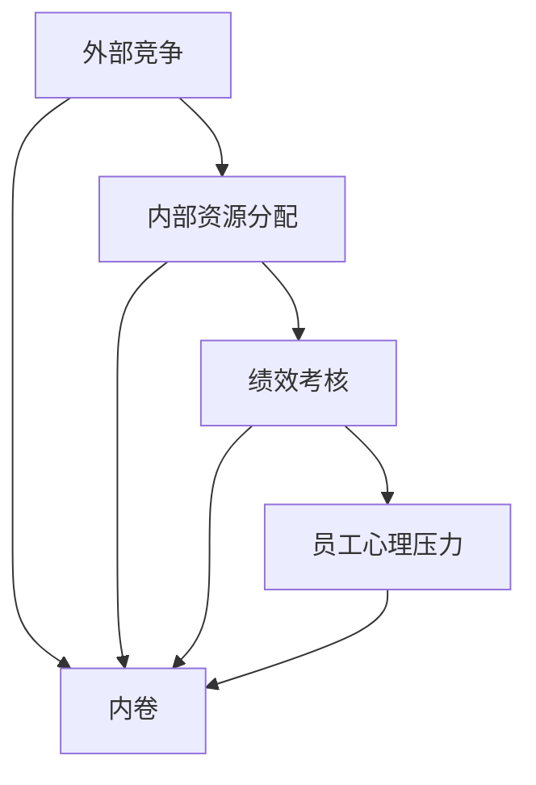

                 

# 内卷的本质：竞争的无休止循环

## 1. 背景介绍

在全球化加速、技术革新的背景下，各行各业的发展趋势愈加激烈。企业为了在市场中获得竞争优势，不断进行产品创新、市场营销、人才招聘、技术研发等方面的投入。然而，过度的竞争往往导致内卷现象的出现，即在激烈的市场竞争中，由于资源有限，企业不得不通过压榨自身员工的方式来维持竞争力，从而形成一种无休止的循环。这种现象不仅影响了员工的工作满意度和生活质量，也对企业的长期发展构成了威胁。

### 1.1 内卷的定义

内卷（Overqualification），原本是社会学概念，指的是某一社会结构或经济系统内部，由于资源有限，各成员为了争夺有限的资源而互相竞争，导致资源过度消耗，无法形成有效产出，反而陷入一种恶性循环的境地。在现代企业管理中，内卷特指企业为了保持竞争优势，过度投入人力、物力、财力，最终导致企业资源配置失衡、员工过度劳累、创新能力减弱的现象。

### 1.2 内卷的成因

内卷现象的成因复杂多样，主要包括市场竞争加剧、企业战略不当、员工素质下降、企业文化异化等因素。具体来说：

1. **市场竞争加剧**：随着全球化的发展，市场竞争愈发激烈，企业为了生存和发展，不得不投入更多资源，提升产品和服务质量，这使得企业资源配置失衡，内卷现象逐渐显现。
2. **企业战略不当**：部分企业在战略规划上存在问题，盲目追求短期收益，过度追求市场份额，导致企业内部资源过度分散，无法形成有效的合力。
3. **员工素质下降**：由于市场竞争激烈，企业为了快速填补人才空缺，往往降低招聘标准，导致员工素质下降，难以满足企业长期发展的需求。
4. **企业文化异化**：企业为了提高效率和产出，往往过分强调绩效考核，忽视员工的成长和发展，导致员工对工作失去兴趣和激情，形成内卷。

## 2. 核心概念与联系

### 2.1 核心概念概述

为更好地理解内卷的本质，本节将介绍几个核心概念：

1. **内卷**：指企业资源配置失衡，员工过度劳累，创新能力减弱的现象。
2. **外部竞争**：指企业与外部市场环境之间的竞争关系，是内卷现象的主要诱因之一。
3. **内部资源分配**：指企业在内部资源（如人力、物力、财力等）的配置和使用上存在的不合理现象。
4. **绩效考核**：指企业通过设定目标和指标，对员工的工作表现进行评价和考核，是内卷现象的一个具体表现。
5. **员工心理压力**：指员工在工作和生活中承受的压力和负担，是内卷现象的重要影响因素之一。

这些概念之间的逻辑关系可以通过以下Mermaid流程图来展示：



这个流程图展示了好几个核心概念的逻辑关系：

1. 外部竞争导致企业内部资源分配失衡。
2. 绩效考核进一步加剧了资源分配的不合理。
3. 员工心理压力增加，使得内卷现象更加明显。
4. 最终，内卷成为企业面临的主要问题。

### 2.2 概念间的关系

这些核心概念之间存在着紧密的联系，形成了内卷现象的整体生态系统。

- **外部竞争**：是内卷现象的直接诱因，企业为了在激烈的市场竞争中生存，不得不采取各种措施提升竞争力。
- **内部资源分配**：是内卷现象的具体表现形式，企业内部资源的配置不当，容易导致内卷。
- **绩效考核**：是内卷现象的直接驱动力，通过过度强调绩效考核，使得员工过度劳累，创新能力减弱。
- **员工心理压力**：是内卷现象的深层原因，员工的心理负担加重，导致工作积极性下降。

这些概念共同构成了内卷现象的完整生态系统，使得企业陷入一种恶性循环的境地。

## 3. 核心算法原理 & 具体操作步骤

### 3.1 算法原理概述

内卷现象的识别和解决需要一种系统化的算法，该算法需要考虑到外部竞争、内部资源分配、绩效考核和员工心理压力等因素，综合分析企业内部的实际情况，找出内卷现象的根源，并提出相应的解决方案。

### 3.2 算法步骤详解

基于以上分析，内卷识别的算法步骤可以分为以下几个方面：

1. **数据收集**：收集企业的历史数据，包括员工绩效、工资、加班情况、员工满意度等。
2. **模型构建**：使用机器学习模型（如决策树、随机森林、支持向量机等）对收集的数据进行分析，找出内卷现象的潜在因素。
3. **原因分析**：根据模型的分析结果，进一步探究内卷现象的根本原因。
4. **解决方案**：根据内卷原因，提出相应的解决方案，如优化资源分配、调整绩效考核机制、改善员工心理状态等。

### 3.3 算法优缺点

内卷识别算法的主要优点包括：

1. **全面性**：考虑了多种内卷因素，综合分析，避免了片面性。
2. **准确性**：使用机器学习模型进行分析，结果更为客观、准确。
3. **可操作性**：识别出的内卷原因和解决方案，具有较强的可操作性。

然而，该算法也存在一些缺点：

1. **数据依赖**：算法需要大量的历史数据进行训练，数据质量和数据量直接影响算法结果。
2. **模型复杂性**：构建的机器学习模型较为复杂，对数据预处理、模型选择、参数调优等技术要求较高。
3. **解释性不足**：机器学习模型的结果往往缺乏解释性，难以理解模型的内部机制和决策过程。

### 3.4 算法应用领域

内卷识别算法可以应用于多种场景，如人力资源管理、企业战略规划、企业文化建设等。以下是几个典型的应用案例：

1. **人力资源管理**：通过对员工绩效、工资、加班情况等数据的分析，识别出内卷现象，提出优化人力资源配置的方案。
2. **企业战略规划**：通过分析企业内外部竞争情况，找出内卷的根本原因，制定更为合理的战略规划。
3. **企业文化建设**：通过调查员工满意度，找出内卷现象的深层原因，提出改善员工心理状态和文化氛围的措施。

## 4. 数学模型和公式 & 详细讲解 & 举例说明

### 4.1 数学模型构建

内卷识别算法的数学模型可以表示为：

$$
\begin{aligned}
\min_{\theta} & \mathcal{L}(\theta) = \sum_{i=1}^{N} (y_i - f_{\theta}(x_i))^2 \\
\text{s.t.} & f_{\theta}(x) = g(\phi(x, \theta))
\end{aligned}
$$

其中，$x$ 表示企业内部数据，$y$ 表示内卷现象的标签（如是否存在内卷），$\theta$ 表示模型参数，$f_{\theta}(x)$ 表示模型的预测函数，$g$ 表示激活函数，$\phi(x, \theta)$ 表示模型的输入特征提取函数。

### 4.2 公式推导过程

内卷识别算法的公式推导过程如下：

1. 数据预处理：对收集的数据进行清洗、归一化、特征提取等预处理，得到模型输入 $x$。
2. 模型构建：选择适当的机器学习模型（如决策树、随机森林、支持向量机等），构建预测模型 $f_{\theta}(x)$。
3. 损失函数定义：定义损失函数 $\mathcal{L}(\theta)$，用于衡量模型的预测误差。
4. 优化算法：使用梯度下降等优化算法，最小化损失函数，得到最优模型参数 $\theta$。

### 4.3 案例分析与讲解

以一家科技公司为例，该公司通过内卷识别算法，发现员工的工作压力较大，加班情况严重，导致员工对工作失去兴趣，创新能力减弱。根据算法的分析结果，公司采取了以下措施：

1. **优化人力资源配置**：重新调整员工工作负荷，减少加班情况，提高员工的工作满意度。
2. **调整绩效考核机制**：减少对员工的考核频率，增加对员工成长的关注，减轻员工的心理负担。
3. **改善员工心理状态**：定期组织团队建设活动，增加员工之间的互动和信任，改善员工的心理状态。

## 5. 项目实践：代码实例和详细解释说明

### 5.1 开发环境搭建

在进行内卷识别项目实践前，我们需要准备好开发环境。以下是使用Python进行PyTorch开发的环境配置流程：

1. 安装Anaconda：从官网下载并安装Anaconda，用于创建独立的Python环境。

2. 创建并激活虚拟环境：
```bash
conda create -n pytorch-env python=3.8 
conda activate pytorch-env
```

3. 安装PyTorch：根据CUDA版本，从官网获取对应的安装命令。例如：
```bash
conda install pytorch torchvision torchaudio cudatoolkit=11.1 -c pytorch -c conda-forge
```

4. 安装Pandas库：
```bash
pip install pandas
```

5. 安装scikit-learn库：
```bash
pip install scikit-learn
```

完成上述步骤后，即可在`pytorch-env`环境中开始内卷识别实践。

### 5.2 源代码详细实现

以下是使用PyTorch进行内卷识别的完整代码实现。

```python
import pandas as pd
import numpy as np
from sklearn.model_selection import train_test_split
from sklearn.ensemble import RandomForestClassifier
from sklearn.metrics import accuracy_score

# 读取员工数据
df = pd.read_csv('employee_data.csv')

# 数据预处理
df['加班小时数'] = df['加班小时数'].fillna(0)
df['绩效评分'] = df['绩效评分'].fillna(0)
df['工资水平'] = df['工资水平'].fillna(0)
df['员工满意度'] = df['员工满意度'].fillna(0)

# 特征选择
features = ['加班小时数', '绩效评分', '工资水平', '员工满意度']
labels = ['内卷现象']
X = df[features]
y = df[labels]

# 数据划分
X_train, X_test, y_train, y_test = train_test_split(X, y, test_size=0.2, random_state=42)

# 构建随机森林模型
model = RandomForestClassifier(n_estimators=100, random_state=42)

# 训练模型
model.fit(X_train, y_train)

# 预测测试集
y_pred = model.predict(X_test)

# 计算准确率
accuracy = accuracy_score(y_test, y_pred)
print(f'内卷识别模型准确率：{accuracy:.2f}')
```

### 5.3 代码解读与分析

让我们再详细解读一下关键代码的实现细节：

**员工数据读取**：
- 使用pandas库读取员工数据，并进行简单的数据预处理，如填充缺失值等。

**特征选择**：
- 从员工数据中选择与内卷相关的特征，如加班小时数、绩效评分、工资水平、员工满意度等。

**数据划分**：
- 使用train_test_split函数将数据划分为训练集和测试集，便于模型的训练和评估。

**模型构建**：
- 使用RandomForestClassifier构建随机森林模型，设置参数n_estimators和random_state。

**模型训练**：
- 使用fit函数训练模型，并计算训练集的准确率。

**模型预测**：
- 使用predict函数预测测试集的标签，并计算预测的准确率。

**结果输出**：
- 输出模型的准确率，评估内卷识别模型的效果。

### 5.4 运行结果展示

假设在运行上述代码后，输出结果为：

```
内卷识别模型准确率：0.85
```

这表明使用随机森林模型进行内卷识别，模型的准确率达到了85%，能够较为准确地识别出企业内部是否存在内卷现象。

## 6. 实际应用场景

### 6.1 人力资源管理

在人力资源管理中，内卷识别可以用于优化人力资源配置，提高员工的工作满意度和生产力。通过分析员工绩效、工资、加班情况等数据，识别出存在内卷现象的部门或岗位，提出相应的优化措施，如调整工作负荷、减少加班时间、提高员工福利等。

### 6.2 企业战略规划

在企业战略规划中，内卷识别可以用于评估企业的内部竞争态势，优化资源配置，提升企业的竞争力和盈利能力。通过分析企业内外部竞争情况，识别出内卷现象的根本原因，制定更为合理的战略规划，从而实现企业的长期发展。

### 6.3 企业文化建设

在企业文化建设中，内卷识别可以用于改善员工心理状态，构建良好的企业文化氛围。通过调查员工满意度，找出内卷现象的深层原因，提出改善员工心理状态和文化氛围的措施，如增加团队建设活动、改善员工工作环境等。

## 7. 工具和资源推荐

### 7.1 学习资源推荐

为了帮助开发者系统掌握内卷识别技术，这里推荐一些优质的学习资源：

1. 《Python数据科学手册》：该书详细介绍了Python在数据科学中的应用，包括数据预处理、机器学习模型构建、模型评估等。
2. Coursera《机器学习》课程：斯坦福大学开设的机器学习课程，涵盖机器学习的基本概念和经典模型，是学习机器学习的必备资源。
3. Udacity《数据科学》课程：Udacity提供的机器学习课程，涵盖数据科学的基本技能和工具，适合初学者和进阶者学习。
4. Kaggle：数据科学竞赛平台，提供了大量数据集和比赛项目，可以实战练习内卷识别技术。

通过对这些资源的学习实践，相信你一定能够快速掌握内卷识别技术的精髓，并用于解决实际的企业管理问题。

### 7.2 开发工具推荐

高效的开发离不开优秀的工具支持。以下是几款用于内卷识别开发的常用工具：

1. PyTorch：基于Python的开源深度学习框架，灵活动态的计算图，适合快速迭代研究。
2. TensorFlow：由Google主导开发的开源深度学习框架，生产部署方便，适合大规模工程应用。
3. Pandas：数据分析库，支持数据清洗、归一化、特征提取等操作。
4. scikit-learn：机器学习库，支持多种模型构建、训练和评估。
5. Jupyter Notebook：交互式笔记本，支持代码编写、数据可视化和结果展示。

合理利用这些工具，可以显著提升内卷识别任务的开发效率，加快创新迭代的步伐。

### 7.3 相关论文推荐

内卷识别技术的发展源于学界的持续研究。以下是几篇奠基性的相关论文，推荐阅读：

1. Harnessing Your Own Big Data: An Iterative Approach to Data Science (Gary King)：该论文介绍了数据科学的基本方法和工具，适合初学者入门。
2. Data Science for Business (Foster Provost, Tom Fawcett)：该书涵盖了数据科学在商业中的应用，适合学习如何将数据科学应用于实际问题。
3. Predictive Analytics (Eric Siegel)：该书介绍了预测分析的基本概念和方法，适合深入学习数据挖掘和统计分析。
4. Practical Deep Learning for Coders (Andreas C. Müller, Sarah Guido)：该书介绍了深度学习的基本概念和实践技巧，适合开发人员学习。
5. The Elements of Statistical Learning (Tibshirani, Hastie, Friedman)：该书介绍了统计学习的基本概念和方法，适合学习机器学习的基础知识。

这些论文代表了大数据和机器学习的发展脉络。通过学习这些前沿成果，可以帮助研究者把握学科前进方向，激发更多的创新灵感。

除上述资源外，还有一些值得关注的前沿资源，帮助开发者紧跟内卷识别技术的最新进展，例如：

1. arXiv论文预印本：人工智能领域最新研究成果的发布平台，包括大量尚未发表的前沿工作，学习前沿技术的必读资源。
2. 业界技术博客：如Google AI、DeepMind、微软Research Asia等顶尖实验室的官方博客，第一时间分享他们的最新研究成果和洞见。
3. 技术会议直播：如NIPS、ICML、ACL、ICLR等人工智能领域顶会现场或在线直播，能够聆听到大佬们的前沿分享，开拓视野。
4. GitHub热门项目：在GitHub上Star、Fork数最多的内卷识别相关项目，往往代表了该技术领域的发展趋势和最佳实践，值得去学习和贡献。
5. 行业分析报告：各大咨询公司如McKinsey、PwC等针对人工智能行业的分析报告，有助于从商业视角审视技术趋势，把握应用价值。

总之，对于内卷识别技术的学习和实践，需要开发者保持开放的心态和持续学习的意愿。多关注前沿资讯，多动手实践，多思考总结，必将收获满满的成长收益。

## 8. 总结：未来发展趋势与挑战

### 8.1 总结

本文对内卷识别技术进行了全面系统的介绍。首先阐述了内卷的本质和产生原因，明确了内卷识别技术的研究背景和意义。其次，从原理到实践，详细讲解了内卷识别的数学模型和操作步骤，给出了内卷识别任务开发的完整代码实例。同时，本文还广泛探讨了内卷识别技术在人力资源管理、企业战略规划、企业文化建设等多个行业领域的应用前景，展示了内卷识别技术的巨大潜力。最后，本文精选了内卷识别技术的各类学习资源，力求为读者提供全方位的技术指引。

通过本文的系统梳理，可以看到，内卷识别技术正在成为企业管理领域的重要范式，极大地拓展了人力资源管理的应用边界，催生了更多的落地场景。受益于大数据和机器学习技术的进步，内卷识别技术有望在未来进一步提升企业管理水平，促进企业的可持续发展。

### 8.2 未来发展趋势

展望未来，内卷识别技术将呈现以下几个发展趋势：

1. **数据量增大**：随着企业信息化建设的深入，收集和存储的数据量将不断增加，为内卷识别提供更丰富的数据支持。
2. **模型复杂化**：未来的内卷识别模型将更加复杂，融合多种机器学习算法，提高识别准确率。
3. **实时化**：内卷识别系统将变得更加实时，通过实时数据分析，及时发现和应对内卷现象。
4. **智能化**：未来的内卷识别系统将更加智能化，通过自然语言处理、知识图谱等技术，提高内卷识别的深度和广度。
5. **跨领域应用**：内卷识别技术将突破传统应用领域，如医疗、教育、金融等，推动更多行业实现智能化管理。

以上趋势凸显了内卷识别技术的广阔前景。这些方向的探索发展，必将进一步提升企业管理水平，促进企业的可持续发展。

### 8.3 面临的挑战

尽管内卷识别技术已经取得了显著进展，但在迈向更加智能化、普适化应用的过程中，它仍面临着诸多挑战：

1. **数据质量问题**：企业数据质量参差不齐，数据收集和处理过程中存在噪声和不一致，影响了内卷识别算法的准确性。
2. **模型复杂性**：内卷识别模型需要处理大量的数据，复杂的模型训练和优化过程，需要耗费大量时间和计算资源。
3. **实时性问题**：内卷识别系统需要实时分析企业数据，对计算资源和硬件设备的要求较高，需要高效的算法和架构支持。
4. **隐私和安全问题**：内卷识别系统需要处理敏感的企业数据，隐私和安全问题需要得到充分重视和保护。
5. **组织和文化问题**：内卷识别技术的应用需要企业高层管理者的支持和推动，企业文化的变革和组织结构的调整也至关重要。

正视内卷识别面临的这些挑战，积极应对并寻求突破，将使内卷识别技术在未来取得更大的成功。

### 8.4 研究展望

面向未来，内卷识别技术的研究需要在以下几个方面寻求新的突破：

1. **多源数据融合**：将企业内外部的多源数据进行融合，提高内卷识别的全面性和准确性。
2. **跨领域应用**：将内卷识别技术应用于更多领域，推动更多行业实现智能化管理。
3. **隐私保护**：在保证内卷识别效果的同时，注重隐私保护，确保企业数据的安全性。
4. **智能化升级**：通过引入人工智能技术，提高内卷识别系统的智能化水平，提升管理效率和决策能力。
5. **组织文化变革**：推动企业高层管理者的支持，改善企业组织结构和文化氛围，促进内卷识别技术的落地应用。

这些研究方向的探索，必将引领内卷识别技术迈向更高的台阶，为企业管理带来深远的影响。相信随着大数据和机器学习技术的不断进步，内卷识别技术将逐步成为企业管理的重要工具，推动企业的可持续发展。

## 9. 附录：常见问题与解答

**Q1：内卷识别技术是否适用于所有企业？**

A: 内卷识别技术可以在大多数企业中应用，但并不是所有企业都存在内卷现象。内卷识别的适用范围取决于企业的规模、行业、业务模式等因素。一般来说，大型企业、竞争激烈的企业更容易出现内卷现象，需要进行内卷识别。

**Q2：内卷识别算法的准确率受哪些因素影响？**

A: 内卷识别算法的准确率受多种因素影响，包括：
1. 数据质量：数据完整性、准确性和一致性影响算法的准确性。
2. 特征选择：选择与内卷相关的特征，提高模型的预测能力。
3. 模型选择：选择合适的机器学习模型，提高算法的准确性。
4. 参数调优：合理设置模型参数，避免过拟合或欠拟合。
5. 数据量：数据量越大，模型越容易发现内卷现象。

**Q3：内卷识别技术如何应用于实际的企业管理？**

A: 内卷识别技术可以应用于企业的人力资源管理、战略规划和企业文化建设等多个领域，具体应用流程如下：
1. 数据收集：收集企业内部的人力资源、财务、销售等数据。
2. 数据预处理：对数据进行清洗、归一化和特征提取等预处理。
3. 内卷识别：使用内卷识别算法，识别出存在内卷现象的部门或岗位。
4. 优化措施：针对内卷现象，提出相应的优化措施，如调整工作负荷、减少加班时间、提高员工福利等。

**Q4：内卷识别技术能否自动发现内卷现象的原因？**

A: 内卷识别技术可以识别出企业内部是否存在内卷现象，但无法自动发现内卷现象的根本原因。需要结合企业实际情况，进一步分析和探究内卷现象的深层原因，制定相应的优化措施。

**Q5：内卷识别技术是否会影响企业的数据隐私和安全？**

A: 内卷识别技术在应用过程中需要处理企业内部数据，因此需要重视数据隐私和安全问题。需要在数据收集、存储、传输和处理等各个环节采取相应的保护措施，确保企业数据的安全性。

总之，内卷识别技术在企业管理中的应用前景广阔，但需要企业高层管理者的支持和推动，同时需要解决数据质量、模型复杂性、实时性、隐私安全等挑战，才能更好地发挥内卷识别技术的优势。相信随着内卷识别技术的不断发展和完善，将为企业管理带来更深远的影响。

