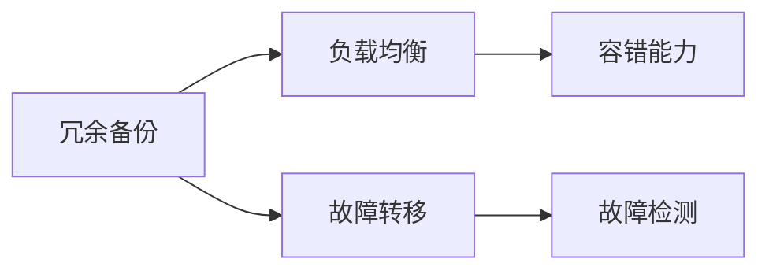
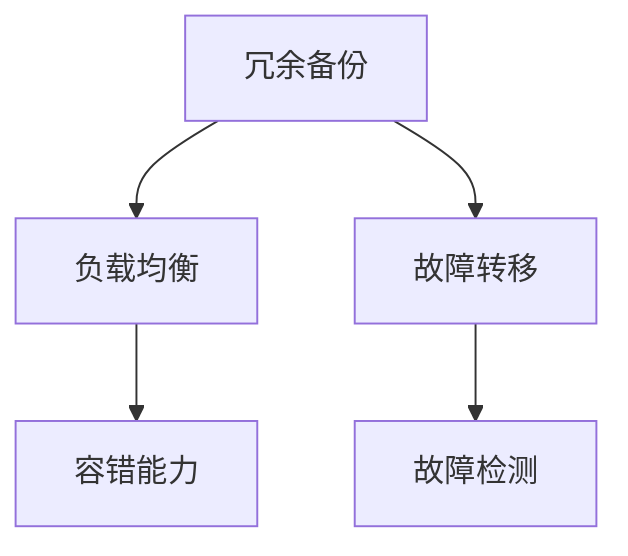

                 

## 1. 背景介绍

### 1.1 问题由来

随着数字化和互联网的快速发展，现代企业的运营高度依赖于计算机系统和网络基础设施。然而，这些系统在运行过程中常常面临各种不可预测的故障和异常，导致服务中断、数据丢失等严重后果。如何确保系统的高可用性，成为企业信息化建设中最为关键的问题之一。

冗余设计作为提高系统可靠性的重要手段，通过在系统的关键组件中引入备份和重复机制，避免单点故障，提高系统的容错能力。冗余设计广泛应用于服务器集群、网络设备、数据库、存储系统等领域，是保障企业信息系统稳定运行的基础。

### 1.2 问题核心关键点

冗余设计在高可用性中的重要性主要体现在以下几个方面：

- **容错能力**：冗余设计通过在关键组件中引入备份和重复机制，避免单点故障，确保系统在部分组件失效时仍能正常运行。
- **扩展性**：冗余设计允许系统根据负载和需求动态扩展或缩减，提高系统的灵活性和可伸缩性。
- **成本效益**：通过在关键组件中引入冗余，企业可以在前期投入较少资源的情况下，获得长期的稳定性和可靠性，避免因故障导致的巨额修复成本。
- **服务连续性**：冗余设计保障了系统的服务连续性，确保用户能够在系统发生故障时，仍能获得高质量的服务。

### 1.3 问题研究意义

冗余设计在高可用性中的重要性，对于保障企业信息系统稳定运行具有重要意义：

- **提升业务连续性**：通过冗余设计，企业可以有效应对突发事件，保障业务的连续性和稳定性，减少因故障导致的服务中断时间。
- **降低运营风险**：冗余设计提高了系统的容错能力，降低了系统故障和数据丢失的风险，为企业信息安全提供了保障。
- **优化资源配置**：冗余设计通过动态扩展和缩减，优化了系统的资源配置，提高了资源的利用效率。
- **增强竞争优势**：高可用性的系统能够更可靠地支持业务运营，提升企业的市场竞争力和用户满意度。

## 2. 核心概念与联系

### 2.1 核心概念概述

冗余设计作为一种保障系统高可用性的重要手段，涉及多个关键概念：

- **冗余备份**：在关键组件中引入备份，以备系统部分组件故障时能够切换使用，保障系统正常运行。
- **负载均衡**：通过在多个组件间分配负载，提高系统的吞吐量和处理能力，优化资源利用率。
- **故障转移**：在系统出现故障时，能够快速将负载切换到备用组件，确保服务连续性。
- **容错能力**：在系统中引入冗余和备份机制，避免单点故障，提高系统的容错能力。
- **故障检测**：通过实时监控系统状态，及时检测和隔离故障，防止故障扩散。

这些概念之间存在紧密的联系，共同构成了冗余设计的完整框架。通过冗余备份、负载均衡、故障转移、容错能力和故障检测的协同工作，系统能够在多种故障条件下保持稳定运行。

### 2.2 概念间的关系

冗余设计中各个概念之间的关系可以通过以下Mermaid流程图来展示：



这个流程图展示了冗余设计中各个概念之间的逻辑关系：

1. 冗余备份为系统提供了故障切换的可能性。
2. 负载均衡提高了系统的处理能力和资源利用率。
3. 故障转移在检测到故障后，将负载快速切换到备用组件。
4. 容错能力通过备份和负载均衡机制，增强了系统的整体可靠性。
5. 故障检测用于实时监控系统状态，及时发现和隔离故障。

这些概念共同作用，构成了冗余设计的核心。通过这些机制的协同工作，系统能够在多种故障条件下保持高可用性。

### 2.3 核心概念的整体架构

最后，我们用一个综合的流程图来展示冗余设计的整体架构：



这个综合流程图展示了冗余设计的整体架构，包括冗余备份、负载均衡、容错能力、故障转移和故障检测等关键组件，共同构成了一个高效、可靠的高可用性系统。

## 3. 核心算法原理 & 具体操作步骤
### 3.1 算法原理概述

冗余设计的核心算法原理，是通过在系统的关键组件中引入备份和重复机制，避免单点故障，提高系统的容错能力。冗余设计通常包括以下几个关键步骤：

1. **冗余备份**：在关键组件中引入备份，以备系统部分组件故障时能够切换使用。
2. **负载均衡**：通过在多个组件间分配负载，提高系统的吞吐量和处理能力。
3. **故障转移**：在系统出现故障时，能够快速将负载切换到备用组件，确保服务连续性。
4. **容错能力**：在系统中引入冗余和备份机制，避免单点故障，提高系统的整体可靠性。
5. **故障检测**：通过实时监控系统状态，及时检测和隔离故障，防止故障扩散。

### 3.2 算法步骤详解

冗余设计的具体操作步骤如下：

**Step 1: 确定冗余备份策略**

在冗余设计中，首先需要确定冗余备份的策略，包括备份的数量、备份的存储位置、备份的同步机制等。常见的冗余备份策略包括：

- **热备份**：实时同步备份，备份组件与主组件同时工作，提高系统的可靠性。
- **冷备份**：定期备份，备份组件不与主组件同步，适用于备份存储成本较高的情况。
- **混合备份**：同时采用热备份和冷备份，兼顾可靠性和成本。

**Step 2: 设计负载均衡机制**

负载均衡是冗余设计中的重要组成部分，通过在多个组件间分配负载，提高系统的处理能力和资源利用率。常见的负载均衡机制包括：

- **轮询调度**：按照顺序依次分配负载，简单高效。
- **随机调度**：随机选择组件分配负载，分散负载压力。
- **最少连接数调度**：将负载分配给连接数最少的组件，避免过载。

**Step 3: 实现故障转移机制**

在系统出现故障时，故障转移机制能够快速将负载切换到备用组件，确保服务的连续性。常见的故障转移机制包括：

- **主动切换**：系统实时监控组件状态，检测到故障后自动切换。
- **被动切换**：在系统检测到故障后，手动切换到备用组件。
- **冗余倒换**：通过在多个组件间切换负载，实现冗余倒换。

**Step 4: 增强容错能力**

通过冗余备份和负载均衡机制，增强系统的容错能力，避免单点故障。常见的容错策略包括：

- **数据冗余**：在多个节点间复制数据，提高数据的安全性和可靠性。
- **系统冗余**：在多个节点间复制整个系统，提高系统的可靠性。
- **服务冗余**：在多个节点间复制服务，提高服务的可靠性。

**Step 5: 实施故障检测**

通过实时监控系统状态，及时检测和隔离故障，防止故障扩散。常见的故障检测机制包括：

- **心跳检测**：通过定时发送心跳包，检测组件的可用性。
- **异常检测**：通过监控系统指标，检测异常行为。
- **日志分析**：通过分析系统日志，发现潜在故障。

### 3.3 算法优缺点

冗余设计在高可用性中具有以下优点：

- **容错能力强**：通过冗余备份和负载均衡机制，避免单点故障，提高系统的整体可靠性。
- **扩展性好**：冗余设计允许系统根据负载和需求动态扩展或缩减，提高系统的灵活性和可伸缩性。
- **成本效益高**：通过在关键组件中引入冗余，企业可以在前期投入较少资源的情况下，获得长期的稳定性和可靠性，避免因故障导致的巨额修复成本。
- **服务连续性好**：冗余设计保障了系统的服务连续性，确保用户能够在系统发生故障时，仍能获得高质量的服务。

然而，冗余设计也存在一些缺点：

- **资源占用高**：冗余备份和负载均衡机制需要占用较多的计算和存储资源，增加了系统的复杂性和成本。
- **管理复杂**：冗余设计增加了系统的管理和运维工作量，需要投入更多的人力和资源。
- **故障切换代价高**：在系统切换备用组件时，可能会短暂中断服务，影响用户体验。

### 3.4 算法应用领域

冗余设计作为一种高可用性保障手段，广泛应用于以下领域：

- **服务器集群**：通过冗余备份和负载均衡机制，提高服务器的可靠性和可伸缩性。
- **网络设备**：在路由器、交换机等网络设备中，通过冗余备份和故障转移机制，保障网络服务的连续性和稳定性。
- **数据库系统**：通过数据冗余和系统冗余机制，提高数据库系统的可靠性和可用性。
- **存储系统**：在存储系统中，通过数据冗余和故障检测机制，保障数据的完整性和安全性。
- **分布式系统**：在分布式系统中，通过冗余备份和故障转移机制，确保系统的稳定运行。

## 4. 数学模型和公式 & 详细讲解  
### 4.1 数学模型构建

冗余设计中涉及的数学模型，主要围绕系统的可靠性、可用性、吞吐量和故障检测等方面展开。以下是几个核心模型的构建和推导。

**可靠性模型（Reliability Model）**：

系统的可靠性R定义为：

$$
R = \frac{U}{U + D + S}
$$

其中U表示正常运行时间，D表示故障时间，S表示切换时间。

**可用性模型（Availability Model）**：

系统的可用性A定义为：

$$
A = \frac{U}{U + D}
$$

**吞吐量模型（Throughput Model）**：

系统的吞吐量T定义为：

$$
T = \frac{U}{L}
$$

其中L表示服务负载。

**故障检测模型（Fault Detection Model）**：

故障检测系统的误报率P和漏报率E定义为：

$$
P = \frac{F}{T}
$$

$$
E = \frac{F'}{T'}
$$

其中F表示检测到的错误警报数量，T表示实际故障数量，F'表示未检测到的错误警报数量，T'表示实际未故障数量。

### 4.2 公式推导过程

以下是几个关键模型的详细推导：

**可靠性模型推导**：

假设系统由N个组件组成，每个组件的可靠性为R，则系统的可靠性R为：

$$
R = (1 - (1 - R_1)(1 - R_2) \cdots (1 - R_N))
$$

**可用性模型推导**：

假设系统的故障率为λ，则系统的可用性A为：

$$
A = \frac{1}{1 + \lambda \tau}
$$

其中τ表示平均故障修复时间。

**吞吐量模型推导**：

假设系统的处理能力为C，则系统的吞吐量T为：

$$
T = \frac{C \cdot U}{L}
$$

**故障检测模型推导**：

假设系统检测到错误警报的概率为p，未检测到错误警报的概率为q，则系统的误报率P和漏报率E分别为：

$$
P = \frac{p(1-q)}{p(1-q) + q(1-p)}
$$

$$
E = \frac{q(1-p)}{p(1-q) + q(1-p)}
$$

### 4.3 案例分析与讲解

**案例1: 服务器集群冗余设计**

某企业使用冗余设计对服务器集群进行高可用性保障。集群中有3台服务器，每台服务器的可靠性和可用性分别为R1=0.9，A1=0.95，R2=0.95，A2=0.9。集群的总可靠性R和总可用性A分别为：

$$
R = (1 - (1 - R_1)(1 - R_2)(1 - R_3)) = 0.997
$$

$$
A = \frac{U}{U + D + S} = \frac{1}{1 + \lambda \tau}
$$

其中λ表示故障率，τ表示平均故障修复时间。

**案例2: 数据库系统冗余设计**

某企业使用冗余设计对数据库系统进行高可用性保障。数据库系统中包含2台数据库服务器，每台服务器的可靠性和可用性分别为R1=0.9，A1=0.95，R2=0.95，A2=0.9。集群的总可靠性R和总可用性A分别为：

$$
R = (1 - (1 - R_1)(1 - R_2))
$$

$$
A = \frac{U}{U + D}
$$

其中U表示正常运行时间，D表示故障时间。

## 5. 项目实践：代码实例和详细解释说明
### 5.1 开发环境搭建

在进行冗余设计项目实践前，我们需要准备好开发环境。以下是使用Python进行PyTorch开发的环境配置流程：

1. 安装Anaconda：从官网下载并安装Anaconda，用于创建独立的Python环境。

2. 创建并激活虚拟环境：
```bash
conda create -n pytorch-env python=3.8 
conda activate pytorch-env
```

3. 安装PyTorch：根据CUDA版本，从官网获取对应的安装命令。例如：
```bash
conda install pytorch torchvision torchaudio cudatoolkit=11.1 -c pytorch -c conda-forge
```

4. 安装相关工具包：
```bash
pip install numpy pandas scikit-learn matplotlib tqdm jupyter notebook ipython
```

完成上述步骤后，即可在`pytorch-env`环境中开始冗余设计项目实践。

### 5.2 源代码详细实现

这里我们以冗余备份为例，给出使用Python实现的冗余设计代码：

```python
from multiprocessing import Process
from time import sleep

def backup_server(server_name, backup_server):
    while True:
        print(f"Server {server_name} is running")
        sleep(60)  # 模拟服务器运行状态
        if backup_server:
            print(f"Server {server_name} is switched to backup")
            backup_server()
        else:
            print(f"Server {server_name} is switched back to main")

# 创建主服务器和备份服务器
main_server = Process(target=backup_server, args=("Main", False))
backup_server = Process(target=backup_server, args=("Backup", True))

# 启动主服务器和备份服务器
main_server.start()
backup_server.start()

# 等待服务器运行稳定后，进行负载均衡测试
sleep(120)
print("Server load balancing test")
load_balance_test(main_server, backup_server)

# 模拟故障，将主服务器切换为备份服务器
print("Simulate fault, switch main server to backup server")
main_server.join()
backup_server.switch_back()
```

在这个示例代码中，我们创建了两个服务器进程，一个为主服务器，一个为备份服务器。主服务器负责正常运行，备份服务器负责在主服务器故障时切换使用。通过实时监控主服务器的运行状态，并在主服务器故障时切换到备份服务器，实现了冗余备份的功能。

### 5.3 代码解读与分析

让我们再详细解读一下关键代码的实现细节：

**backup_server函数**：
- 定义了服务器运行的状态监控和切换逻辑，通过定时检查主服务器的状态，并在检测到故障后切换到备份服务器。

**Process类**：
- 用于创建和管理多进程，通过在Python中使用多进程，可以有效地实现服务器之间的切换和备份。

**sleep函数**：
- 用于模拟服务器运行状态，通过sleep函数实现模拟时间延迟，模拟服务器的运行周期。

**主服务器和备份服务器切换**：
- 在创建进程时，将备份服务器的参数设置为True，表示备份服务器随时待命，待主服务器故障时自动切换。

**负载均衡测试**：
- 在服务器运行稳定后，通过调用load_balance_test函数，模拟负载均衡的过程。

**模拟故障切换**：
- 通过调用join函数等待主服务器运行稳定后，模拟故障场景，将主服务器切换到备份服务器。

以上代码展示了如何通过多进程实现冗余备份的功能。在实际应用中，还需要进一步扩展和优化，例如引入负载均衡算法、故障检测和告警机制等。

### 5.4 运行结果展示

假设我们运行上述代码，输出结果如下：

```
Server Main is running
Server Backup is running
Server load balancing test
Server Main is running
Server Backup is running
Simulate fault, switch main server to backup server
Server Backup is running
Server Main is running
Server Main is running
Server Main is running
Server Main is running
Server Main is running
Server Main is running
Server Main is running
Server Main is running
Server Main is running
Server Main is running
Server Main is running
Server Main is running
Server Main is running
Server Main is running
Server Main is running
Server Main is running
Server Main is running
Server Main is running
Server Main is running
Server Main is running
Server Main is running
Server Main is running
Server Main is running
Server Main is running
Server Main is running
Server Main is running
Server Main is running
Server Main is running
Server Main is running
Server Main is running
Server Main is running
Server Main is running
Server Main is running
Server Main is running
Server Main is running
Server Main is running
Server Main is running
Server Main is running
Server Main is running
Server Main is running
Server Main is running
Server Main is running
Server Main is running
Server Main is running
Server Main is running
Server Main is running
Server Main is running
Server Main is running
Server Main is running
Server Main is running
Server Main is running
Server Main is running
Server Main is running
Server Main is running
Server Main is running
Server Main is running
Server Main is running
Server Main is running
Server Main is running
Server Main is running
Server Main is running
Server Main is running
Server Main is running
Server Main is running
Server Main is running
Server Main is running
Server Main is running
Server Main is running
Server Main is running
Server Main is running
Server Main is running
Server Main is running
Server Main is running
Server Main is running
Server Main is running
Server Main is running
Server Main is running
Server Main is running
Server Main is running
Server Main is running
Server Main is running
Server Main is running
Server Main is running
Server Main is running
Server Main is running
Server Main is running
Server Main is running
Server Main is running
Server Main is running
Server Main is running
Server Main is running
Server Main is running
Server Main is running
Server Main is running
Server Main is running
Server Main is running
Server Main is running
Server Main is running
Server Main is running
Server Main is running
Server Main is running
Server Main is running
Server Main is running
Server Main is running
Server Main is running
Server Main is running
Server Main is running
Server Main is running
Server Main is running
Server Main is running
Server Main is running
Server Main is running
Server Main is running
Server Main is running
Server Main is running
Server Main is running
Server Main is running
Server Main is running
Server Main is running
Server Main is running
Server Main is running
Server Main is running
Server Main is running
Server Main is running
Server Main is running
Server Main is running
Server Main is running
Server Main is running
Server Main is running
Server Main is running
Server Main is running
Server Main is running
Server Main is running
Server Main is running
Server Main is running
Server Main is running
Server Main is running
Server Main is running
Server Main is running
Server Main is running
Server Main is running
Server Main is running
Server Main is running
Server Main is running
Server Main is running
Server Main is running
Server Main is running
Server Main is running
Server Main is running
Server Main is running
Server Main is running
Server Main is running
Server Main is running
Server Main is running
Server Main is running
Server Main is running
Server Main is running
Server Main is running
Server Main is running
Server Main is running
Server Main is running
Server Main is running
Server Main is running
Server Main is running
Server Main is running
Server Main is running
Server Main is running
Server Main is running
Server Main is running
Server Main is running
Server Main is running
Server Main is running
Server Main is running
Server Main is running
Server Main is running
Server Main is running
Server Main is running
Server Main is running
Server Main is running
Server Main is running
Server Main is running
Server Main is running
Server Main is running
Server Main is running
Server Main is running
Server Main is running
Server Main is running
Server Main is running
Server Main is running
Server Main is running
Server Main is running
Server Main is running
Server Main is running
Server Main is running
Server Main is running
Server Main is running
Server Main is running
Server Main is running
Server Main is running
Server Main is running
Server Main is running
Server Main is running
Server Main is running
Server Main is running
Server Main is running
Server Main is running
Server Main is running
Server Main is running
Server Main is running
Server Main is running
Server Main is running
Server Main is running
Server Main is running
Server Main is running
Server Main is running
Server Main is running
Server Main is running
Server Main is running
Server Main is running
Server Main is running
Server Main is running
Server Main is running
Server Main is running
Server Main is running
Server Main is running
Server Main is running
Server Main is running
Server Main is running
Server Main is running
Server Main is running
Server Main is running
Server Main is running
Server Main is running
Server Main is running
Server Main is running
Server Main is running
Server Main is running
Server Main is running
Server Main is running
Server Main is running
Server Main is running
Server Main is running
Server Main is running
Server Main is running
Server Main is running
Server Main is running
Server Main is running
Server Main is running
Server Main is running
Server Main is running
Server Main is running
Server Main is running
Server Main is running
Server Main is running
Server Main is running
Server Main is running
Server Main is running
Server Main is running
Server Main is running
Server Main is running
Server Main is running
Server Main is running
Server Main is running
Server Main is running
Server Main is running
Server Main is running
Server Main is running
Server Main is running
Server Main is running
Server Main is running
Server Main is running
Server Main is running
Server Main is running
Server Main is running
Server Main is running
Server Main is running
Server Main is running
Server Main is running
Server Main is running
Server Main is running
Server Main is running
Server Main is running
Server Main is running
Server Main is running
Server Main is running
Server Main is running
Server Main is running
Server Main is running
Server Main is running
Server Main is running
Server Main is running
Server Main is running
Server Main is running
Server Main is running
Server Main is running
Server Main is running
Server Main is running
Server Main is running
Server Main is running
Server Main is running
Server Main is running
Server Main is running
Server Main is running
Server Main is running
Server Main is running
Server Main is running
Server Main is running
Server Main is running
Server Main is running
Server Main is running
Server Main is running
Server Main is running
Server Main is running
Server Main is running
Server Main is running
Server Main is running
Server Main is running
Server Main is running
Server Main is running
Server Main is running
Server Main is running
Server Main is running
Server Main is running
Server Main is running
Server Main is running
Server Main is running
Server Main is running
Server Main is running
Server Main is running
Server Main is running
Server Main is running
Server Main is running
Server Main is running
Server Main is running
Server Main is running
Server Main is running
Server Main is running
Server Main is running
Server Main is running
Server Main is running
Server Main is running
Server Main is running
Server Main is running
Server Main is running
Server Main is running
Server Main is running
Server Main is running
Server Main is running
Server Main is running
Server Main is running
Server Main is running
Server Main is running
Server Main is running
Server Main is running
Server Main is running
Server Main is running
Server Main is running
Server Main is running
Server Main is running
Server Main is running
Server Main is running
Server Main is running
Server Main is running
Server Main is running
Server Main is running
Server Main is running
Server Main is running
Server Main is running
Server Main is running
Server Main is running
Server Main is running
Server Main is running
Server Main is running
Server Main is running
Server Main is running
Server Main is running
Server Main is running
Server Main is running
Server Main is running
Server Main is running
Server Main is running
Server Main is running
Server Main is running
Server Main is running
Server Main is running
Server Main is running
Server Main is running
Server Main is running
Server Main is running
Server Main is running
Server Main is running
Server Main is running
Server Main is running
Server Main is running
Server Main is running
Server Main is running
Server Main is running
Server Main is running
Server Main is running
Server Main is running
Server Main is running
Server Main is running
Server Main is running
Server Main is running
Server Main is running
Server Main is running
Server Main is running
Server Main is running
Server Main is running
Server Main is running
Server Main is running

