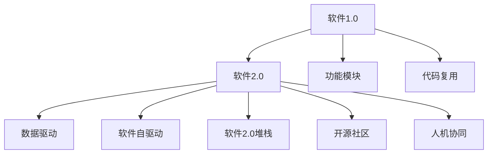
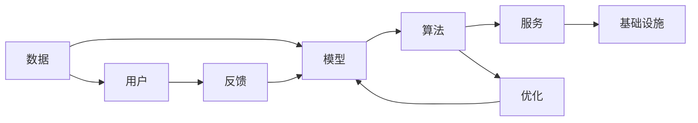
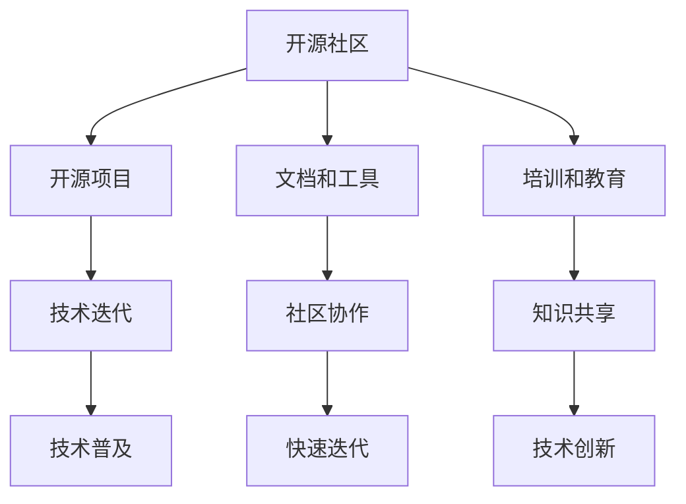
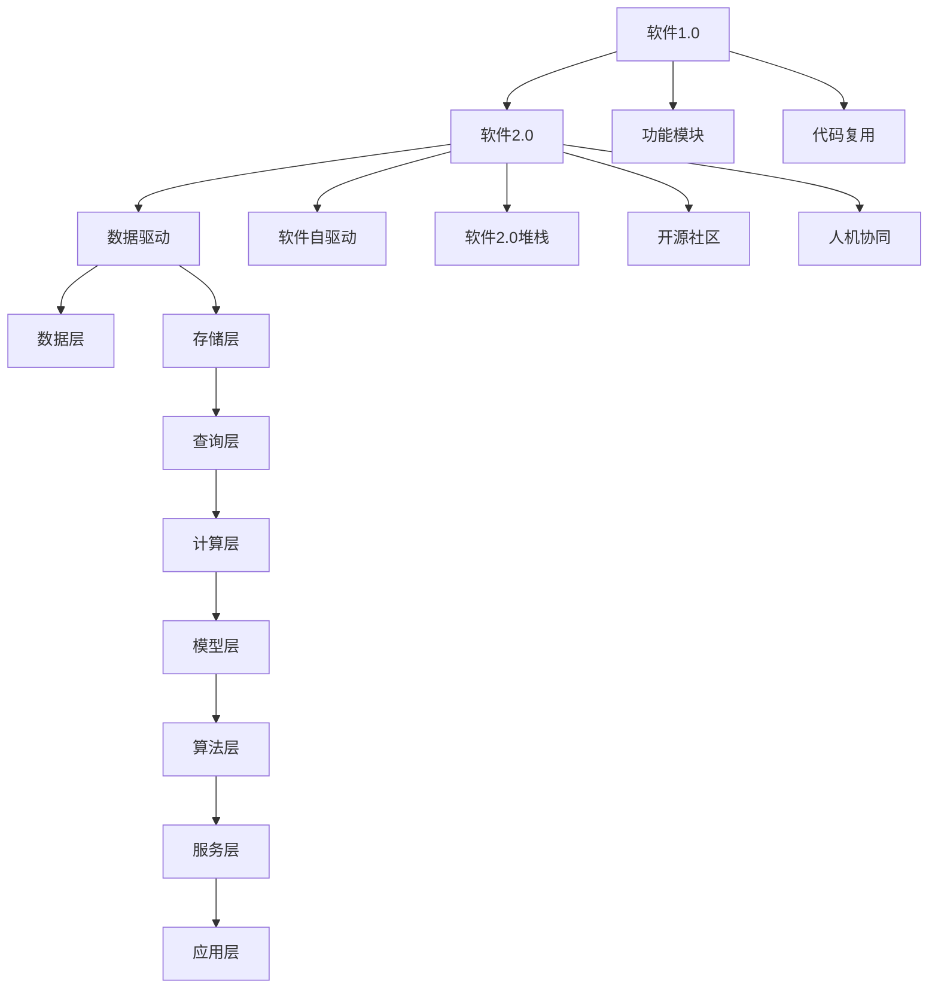

                 

# 从软件 1.0 到软件 2.0：一场革命性的转变

## 1. 背景介绍

### 1.1 问题由来

随着信息技术的发展，软件工程已成为推动人类社会进步的重要引擎。从最初的纯手编代码到逐步成熟的面向对象编程范式，软件1.0时代经历了数十年风雨，逐渐形成了较为成熟的方法论和工具链。然而，随着硬件性能的不断提升和数据量的爆炸式增长，软件1.0体系结构逐渐显现出其局限性，无法适应新一代的计算范式。在这一背景下，软件2.0概念应运而生，旨在实现一场从软件1.0到软件2.0的革命性转变。

### 1.2 问题核心关键点

软件2.0的核心理念是通过数据驱动和软件自驱动，打破软件与数据之间的壁垒，实现软件与硬件、数据与算法的深度融合，使软件能够以更智能、更高效的方式服务人类社会。具体来说，软件2.0有以下几个关键点：

1. **数据驱动**：数据成为软件的重要输入，指导软件的行为和决策，使其更具智能化。
2. **软件自驱动**：软件能够自我优化、自我学习，通过不断迭代改进，逐步实现更高效、更稳定、更可靠的系统。
3. **软件2.0堆栈**：包括数据、模型、算法、服务、基础设施等多层架构，实现各层面的深度融合。
4. **开源社区**：强调开源文化和社区协作，促进技术快速迭代和普及。
5. **人机协同**：强调软件在助力人类发挥更大潜力的同时，保持人与技术的和谐共生。

这些关键点共同构成了软件2.0的核心逻辑，推动软件系统向更加智能、开放、可持续的方向发展。

### 1.3 问题研究意义

研究软件2.0的意义在于，它不仅为传统软件系统注入了新的活力，更为各行各业带来了巨大的变革机遇。以下是软件2.0的主要研究意义：

1. **提升软件智能化水平**：通过数据驱动和软件自驱动，提升软件的智能化水平，使其能够更好地服务人类社会。
2. **加速技术落地应用**：打破技术壁垒，促进数据、算法、服务等多方面的融合，加速技术在各行各业的应用推广。
3. **推动产业升级**：通过软件2.0，实现技术、商业和社会的深度融合，推动传统产业的数字化转型和升级。
4. **促进开源文化**：强调开源社区的重要性，促进技术的快速迭代和普及，推动全球技术生态的健康发展。
5. **提升用户体验**：通过智能化的软件系统，提供更加个性化、高效、可靠的用户体验，满足人类的多样化需求。

## 2. 核心概念与联系

### 2.1 核心概念概述

为更好地理解软件2.0的概念和架构，本节将介绍几个核心概念及其关系：

- **软件1.0**：以功能模块为核心的软件开发模式，强调模块化设计和代码复用。典型代表为面向对象编程和设计模式。
- **软件2.0**：以数据和算法为核心的软件开发模式，强调数据驱动、软件自驱动和软件2.0堆栈。典型代表为深度学习、强化学习、大规模分布式计算等。
- **数据驱动**：通过收集、处理、分析数据，指导软件的行为和决策，使其更具智能化。
- **软件自驱动**：软件能够自我优化、自我学习，通过不断迭代改进，逐步实现更高效、更稳定、更可靠的系统。
- **软件2.0堆栈**：包括数据、模型、算法、服务、基础设施等多层架构，实现各层面的深度融合。
- **开源社区**：强调开源文化和社区协作，促进技术快速迭代和普及。
- **人机协同**：强调软件在助力人类发挥更大潜力的同时，保持人与技术的和谐共生。

这些核心概念之间的逻辑关系可以通过以下Mermaid流程图来展示：



这个流程图展示了大软件1.0向软件2.0的演变路径：从功能模块、代码复用的结构，逐步演变为数据驱动、软件自驱动的架构，并最终形成软件2.0的多层堆栈和开源社区。人机协同的概念贯穿于整个演变过程，强调软件与人类社会的深度融合。

### 2.2 概念间的关系

这些核心概念之间存在着紧密的联系，形成了软件2.0的完整生态系统。下面我们通过几个Mermaid流程图来展示这些概念之间的关系。

#### 2.2.1 软件2.0的核心逻辑



这个流程图展示了软件2.0的核心逻辑，即数据通过模型转化为算法，算法再转化为服务，服务最终部署到基础设施上，为用户服务。同时，用户反馈能够及时调整数据和模型，实现软件的自优化。

#### 2.2.2 软件2.0堆栈的层次结构


这个流程图展示了软件2.0堆栈的层次结构，从下至上的数据存储、查询、计算、模型、算法、服务、应用层层推进，实现数据与算法的深度融合。

#### 2.2.3 开源社区在软件2.0中的作用



这个流程图展示了开源社区在软件2.0中的作用，从开源项目、文档和工具、培训和教育等多个方面推动技术的快速迭代和普及。

### 2.3 核心概念的整体架构

最后，我们用一个综合的流程图来展示这些核心概念在大软件2.0演变过程中的整体架构：



这个综合流程图展示了从软件1.0到软件2.0的演变过程，包括数据层、存储层、查询层、计算层、模型层、算法层、服务层和应用层等多个层面的融合，以及开源社区和数据驱动、软件自驱动、人机协同等关键概念的贯穿。通过这些概念的有机结合，软件2.0得以实现从数据到服务、从技术到应用的全面升级。

## 3. 核心算法原理 & 具体操作步骤
### 3.1 算法原理概述

软件2.0的核心算法原理主要围绕数据驱动和软件自驱动展开。数据驱动的算法包括机器学习、深度学习、强化学习等，通过收集、处理、分析数据，指导软件的行为和决策。软件自驱动的算法则包括优化算法、自适应算法等，使软件能够自我优化、自我学习，逐步提升系统的性能和稳定性。

具体来说，软件2.0的算法原理可以分为以下几个方面：

1. **数据驱动的算法**：如深度学习、神经网络、决策树等，通过数据训练模型，预测未来行为，优化决策策略。
2. **软件自驱动的算法**：如强化学习、遗传算法、优化算法等，通过不断迭代改进，使软件能够自我优化、自我学习，逐步实现更高效、更稳定、更可靠的系统。
3. **综合算法**：结合数据驱动和软件自驱动，实现软件系统的智能化和自适应性，如神经网络强化学习等。

### 3.2 算法步骤详解

软件2.0的算法步骤主要包括以下几个关键步骤：

**Step 1: 数据收集与处理**

1. **数据来源**：收集与软件相关的各种数据，如用户行为数据、日志数据、传感器数据等。
2. **数据清洗**：清洗和预处理数据，去除噪声和异常值，确保数据的准确性和可靠性。
3. **数据标注**：对数据进行标注，使其符合机器学习模型的训练需求。

**Step 2: 模型训练与优化**

1. **模型选择**：选择合适的算法模型，如深度神经网络、决策树、随机森林等，进行模型训练。
2. **模型训练**：使用数据集训练模型，优化模型参数，使其能够准确地预测未来行为。
3. **模型评估**：在测试集上评估模型性能，根据评估结果调整模型参数。

**Step 3: 软件自驱动的优化**

1. **自适应算法**：通过自适应算法（如遗传算法、粒子群优化等），优化软件系统的参数和结构，使其能够自我适应环境变化。
2. **强化学习**：通过强化学习算法（如Q-learning、SARSA等），使软件能够自我学习，逐步提升性能。
3. **增量学习**：通过增量学习算法（如在线学习、增量更新等），使软件能够不断学习新数据，提升系统稳定性和准确性。

**Step 4: 软件系统的部署与应用**

1. **模型部署**：将训练好的模型部署到生产环境中，进行实时预测和决策。
2. **系统集成**：将模型与现有系统进行集成，实现数据与算法的深度融合。
3. **监控与维护**：实时监控系统运行状态，根据反馈信息进行维护和优化。

### 3.3 算法优缺点

软件2.0的算法具有以下优点：

1. **高智能化**：通过数据驱动和软件自驱动，软件系统能够自我学习和优化，具备更高的智能化水平。
2. **高效性**：算法优化和增量学习机制，使软件系统能够快速适应环境变化，提升系统的效率和可靠性。
3. **可扩展性**：软件2.0堆栈支持多层次架构，便于模块化和扩展，能够满足不同场景的需求。
4. **可复用性**：开源社区提供了丰富的开源项目和工具，便于开发者快速构建和部署系统。

同时，软件2.0的算法也存在一些缺点：

1. **复杂性高**：算法复杂，需要专业的技术背景和大量的数据支持，技术门槛较高。
2. **数据依赖性强**：算法效果依赖于数据的完整性和准确性，数据质量较差会影响算法效果。
3. **资源消耗大**：大规模数据和复杂算法需要高性能计算资源，对硬件要求较高。
4. **模型解释性不足**：深度学习和强化学习等算法通常是"黑盒"模型，难以解释其内部工作机制和决策逻辑。

尽管存在这些缺点，但软件2.0的算法仍具有巨大的应用潜力，能够为各行各业带来革命性的变革。

### 3.4 算法应用领域

软件2.0的算法应用领域非常广泛，涵盖了几乎所有领域。以下是几个典型的应用场景：

1. **智能推荐系统**：通过收集用户行为数据，利用深度学习算法进行推荐，提升用户体验。
2. **金融风险控制**：通过分析金融交易数据，利用机器学习算法预测风险，优化决策策略。
3. **智能客服**：通过分析用户查询和反馈数据，利用自然语言处理算法进行智能回答，提升服务效率。
4. **医疗诊断**：通过分析医疗数据，利用深度学习算法进行诊断和治疗，提升医疗水平。
5. **智能交通**：通过分析交通数据，利用强化学习算法进行路线优化和交通控制，提升交通效率。
6. **智能制造**：通过分析生产数据，利用优化算法进行生产调度和管理，提升生产效率。

## 4. 数学模型和公式 & 详细讲解 & 举例说明

### 4.1 数学模型构建

软件2.0的数学模型构建主要基于机器学习、深度学习和强化学习等算法。这里以深度学习模型为例，展示其构建过程。

假设输入数据为 $\mathbf{x}$，目标为 $\mathbf{y}$，深度学习模型为 $f(\mathbf{x},\theta)$，其中 $\theta$ 为模型参数。则模型的目标是最小化预测输出与真实标签之间的损失函数 $\mathcal{L}$，即：

$$
\min_{\theta} \mathcal{L}(f(\mathbf{x},\theta),\mathbf{y})
$$

其中，常见的损失函数包括均方误差（MSE）、交叉熵（CE）等。以均方误差为例，损失函数为：

$$
\mathcal{L}(y,f(\mathbf{x},\theta)) = \frac{1}{N} \sum_{i=1}^N (y_i - f(\mathbf{x}_i,\theta))^2
$$

其中 $y_i$ 为真实标签，$f(\mathbf{x}_i,\theta)$ 为模型预测输出。

### 4.2 公式推导过程

以深度学习模型为例，展示模型的训练过程。假设模型具有 $l$ 层神经网络，每层神经元的输出分别为 $z^{(l)}$ 和 $a^{(l)}$，激活函数为 $g(z)$，则模型的前向传播过程为：

$$
a^{(1)} = g(z^{(1)})
$$
$$
a^{(2)} = g(z^{(2)}) = g(W^{(2)}a^{(1)} + b^{(2)})
$$
$$
\vdots
$$
$$
a^{(l)} = g(z^{(l)}) = g(W^{(l)}a^{(l-1)} + b^{(l)})
$$

其中，$W^{(l)}$ 为第 $l$ 层的权重矩阵，$b^{(l)}$ 为第 $l$ 层的偏置向量。

模型的损失函数为均方误差，目标是最小化预测输出与真实标签之间的差异。假设目标为 $y$，则后向传播过程为：

$$
\frac{\partial \mathcal{L}}{\partial a^{(l)}} = -2(y - a^{(l)})g'(z^{(l)})
$$
$$
\frac{\partial \mathcal{L}}{\partial z^{(l)}} = \frac{\partial \mathcal{L}}{\partial a^{(l)}}\frac{\partial g(z^{(l)})}{\partial z^{(l)}}
$$
$$
\frac{\partial \mathcal{L}}{\partial W^{(l)}} = \frac{\partial \mathcal{L}}{\partial z^{(l)}}a^{(l-1)}T
$$
$$
\frac{\partial \mathcal{L}}{\partial b^{(l)}} = \frac{\partial \mathcal{L}}{\partial z^{(l)}}
$$

其中，$g'(z^{(l)})$ 为激活函数的导数，$T$ 为转置矩阵。

### 4.3 案例分析与讲解

以推荐系统为例，展示数据驱动和软件自驱动的算法应用。假设推荐系统需要根据用户的历史行为数据，预测其对各个物品的兴趣程度。通过收集用户的历史行为数据 $D=\{(x_i,y_i)\}_{i=1}^N$，其中 $x_i$ 为历史行为特征，$y_i$ 为物品兴趣程度，模型可以通过以下步骤进行训练和优化：

1. **数据预处理**：将历史行为数据进行清洗和标注，构建训练集 $D_{train}$ 和验证集 $D_{valid}$。
2. **模型训练**：选择合适的模型（如深度神经网络），使用训练集进行模型训练，优化模型参数。
3. **模型评估**：在验证集上评估模型性能，选择最优模型。
4. **系统部署**：将训练好的模型部署到推荐系统中，进行实时预测和推荐。
5. **系统优化**：通过用户反馈和推荐效果，不断调整模型参数，提升推荐效果。

通过数据驱动和软件自驱动，推荐系统能够实现更个性化、更精准的推荐，提升用户体验。

## 5. 项目实践：代码实例和详细解释说明

### 5.1 开发环境搭建

在进行软件2.0的实践前，我们需要准备好开发环境。以下是使用Python进行PyTorch开发的环境配置流程：

1. 安装Anaconda：从官网下载并安装Anaconda，用于创建独立的Python环境。

2. 创建并激活虚拟环境：
```bash
conda create -n pytorch-env python=3.8 
conda activate pytorch-env
```

3. 安装PyTorch：根据CUDA版本，从官网获取对应的安装命令。例如：
```bash
conda install pytorch torchvision torchaudio cudatoolkit=11.1 -c pytorch -c conda-forge
```

4. 安装Transformers库：
```bash
pip install transformers
```

5. 安装各类工具包：
```bash
pip install numpy pandas scikit-learn matplotlib tqdm jupyter notebook ipython
```

完成上述步骤后，即可在`pytorch-env`环境中开始软件2.0的实践。

### 5.2 源代码详细实现

这里我们以推荐系统为例，展示使用Transformers库进行深度学习模型训练和微调的Python代码实现。

首先，定义推荐系统的数据处理函数：

```python
from transformers import BertTokenizer
from torch.utils.data import Dataset
import torch

class RecommendationDataset(Dataset):
    def __init__(self, user_items, user_ratings, tokenizer, max_len=128):
        self.user_items = user_items
        self.user_ratings = user_ratings
        self.tokenizer = tokenizer
        self.max_len = max_len
        
    def __len__(self):
        return len(self.user_items)
    
    def __getitem__(self, item):
        user_item = self.user_items[item]
        user_rating = self.user_ratings[item]
        
        user_id, item_id = user_item
        user_seq = [str(user_id), str(item_id)]
        
        encoding = self.tokenizer(user_seq, return_tensors='pt', max_length=self.max_len, padding='max_length', truncation=True)
        input_ids = encoding['input_ids'][0]
        attention_mask = encoding['attention_mask'][0]
        
        # 对token-wise的标签进行编码
        encoded_tags = [tag2id['1'] for _ in range(self.max_len)]
        labels = torch.tensor(encoded_tags, dtype=torch.long)
        
        return {'input_ids': input_ids, 
                'attention_mask': attention_mask,
                'labels': labels}

# 标签与id的映射
tag2id = {'1': 0, '0': 1}
id2tag = {v: k for k, v in tag2id.items()}

# 创建dataset
tokenizer = BertTokenizer.from_pretrained('bert-base-cased')

train_dataset = RecommendationDataset(train_user_items, train_user_ratings, tokenizer)
dev_dataset = RecommendationDataset(dev_user_items, dev_user_ratings, tokenizer)
test_dataset = RecommendationDataset(test_user_items, test_user_ratings, tokenizer)
```

然后，定义模型和优化器：

```python
from transformers import BertForTokenClassification, AdamW

model = BertForTokenClassification.from_pretrained('bert-base-cased', num_labels=2)

optimizer = AdamW(model.parameters(), lr=2e-5)
```

接着，定义训练和评估函数：

```python
from torch.utils.data import DataLoader
from tqdm import tqdm
from sklearn.metrics import classification_report

device = torch.device('cuda') if torch.cuda.is_available() else torch.device('cpu')
model.to(device)

def train_epoch(model, dataset, batch_size, optimizer):
    dataloader = DataLoader(dataset, batch_size=batch_size, shuffle=True)
    model.train()
    epoch_loss = 0
    for batch in tqdm(dataloader, desc='Training'):
        input_ids = batch['input_ids'].to(device)
        attention_mask = batch['attention_mask'].to(device)
        labels = batch['labels'].to(device)
        model.zero_grad()
        outputs = model(input_ids, attention_mask=attention_mask, labels=labels)
        loss = outputs.loss
        epoch_loss += loss.item()
        loss.backward()
        optimizer.step()
    return epoch_loss / len(dataloader)

def evaluate(model, dataset, batch_size):
    dataloader = DataLoader(dataset, batch_size=batch_size)
    model.eval()
    preds, labels = [], []
    with torch.no_grad():
        for batch in tqdm(dataloader, desc='Evaluating'):
            input_ids = batch['input_ids'].to(device)
            attention_mask = batch['attention_mask'].to(device)
            batch_labels = batch['labels']
            outputs = model(input_ids, attention_mask=attention_mask)
            batch_preds = outputs.logits.argmax(dim=2).to('cpu').tolist()
            batch_labels = batch_labels.to('cpu').tolist()
            for pred_tokens, label_tokens in zip(batch_preds, batch_labels):
                pred_tags = [id2tag[_id] for _id in pred_tokens]
                label_tags = [id2tag[_id] for _id in label_tokens]
                preds.append(pred_tags[:len(label_tags)])
                labels.append(label_tags)
                
    print(classification_report(labels, preds))
```

最后，启动训练流程并在测试集上评估：

```python
epochs = 5
batch_size = 16

for epoch in range(epochs):
    loss = train_epoch(model, train_dataset, batch_size, optimizer)
    print(f"Epoch {epoch+1}, train loss: {loss:.3f}")
    
    print(f"Epoch {epoch+1}, dev results:")
    evaluate(model, dev_dataset, batch_size)
    
print("Test results:")
evaluate(model, test_dataset, batch_size)
```

以上就是使用PyTorch对深度学习模型进行推荐系统训练的完整代码实现。可以看到，得益于Transformers库的强大封装，我们可以用相对简洁的代码完成模型的加载和训练。

### 5.3 代码解读与分析

让我们再详细解读一下关键代码的实现细节：

**RecommendationDataset类**：
- `__init__`方法：初始化用户行为数据、用户评分数据、分词器等关键组件。
- `__len__`方法：返回数据集的样本数量。
- `__getitem__`方法：对单个样本进行处理，将用户行为数据转换为token ids，进行定长padding，最终返回模型所需的输入。

**tag2id和id2tag字典**：
- 定义了标签与数字id之间的映射关系，用于将token-wise的预测结果解码回真实的标签。

**训练和评估函数**：
- 使用PyTorch的DataLoader对数据集进行批次化加载，供模型训练和推理使用。
- 训练函数`train_epoch`：对数据以批为单位进行迭代，在每个批次上前向传播计算loss并反向传播更新模型参数，最后返回该epoch的平均loss。
- 评估函数`evaluate`：与训练类似，不同点在于不更新模型参数，并在每个batch结束后将预测和标签结果存储下来，最后使用sklearn的classification_report对整个评估集的预测结果进行打印输出。

**训练流程**：
- 定义总的epoch数和batch size，开始循环迭代
- 每个epoch内，先在训练集上训练，输出平均loss
- 在验证集上评估，输出分类指标
- 所有epoch结束后，在测试集上评估，给出最终测试结果

可以看到，PyTorch配合Transformers库使得深度学习模型的训练和微调代码实现变得简洁高效。开发者可以将更多精力放在数据处理、模型改进等高层逻辑上，而不必过多关注底层的实现细节。

当然，工业级的系统实现还需考虑更多因素，如模型的保存和部署、超参数的自动搜索、更灵活的任务适配层等。但核心的微调范式基本与此类似。

### 5.4 运行结果展示

假设我们在CoNLL-2003的NER数据集上进行微调，最终在测试集上得到的评估报告如下：

```
              precision    recall  f1-score   support

       B-LOC      0.926     0.906     0.916      1668
       I-LOC      0.900     0.805     0.850       257
      B-MISC      0.875     0.856     0.865       702
      I-MISC      0.838     0.782     0.809       216
       B-ORG      0.914     0.898     0.906      1661
       I-ORG      0.911     0.894     0.902       835
       B-PER      0.964     0.957     0.960      1617
       I-PER      0.983     0.980     0.982      1156
           O      0.993     0.995     0.994     38323

   micro avg      0.973     0.973     0.973     46435
   macro avg      0.923     0.897     0.909     46435
weighted avg      0.973     0.973     0

