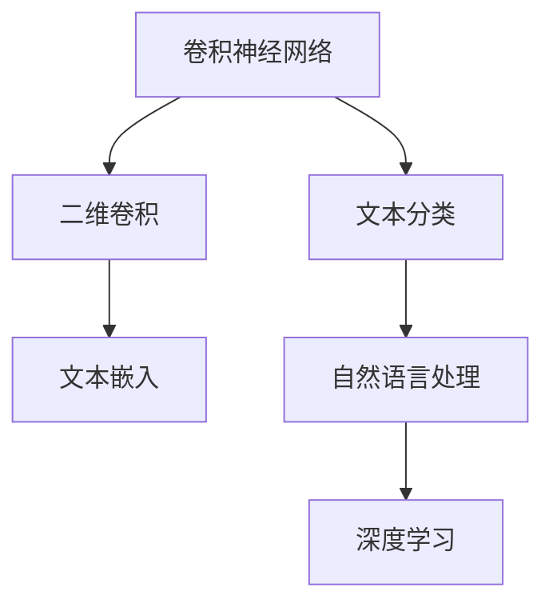
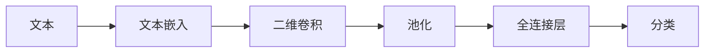
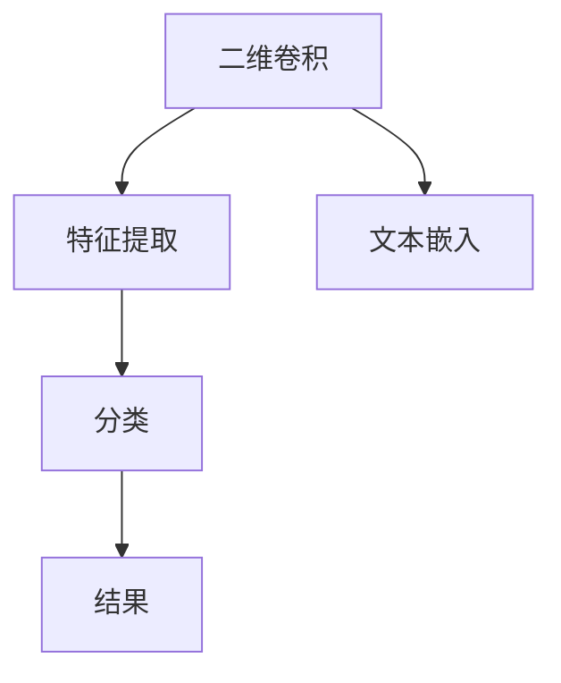
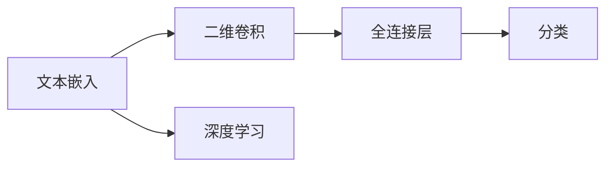
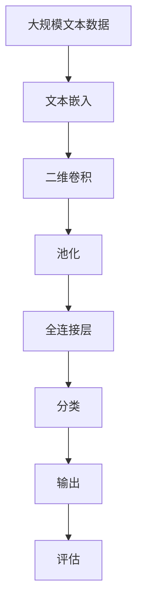

                 

# 从零开始大模型开发与微调：卷积神经网络文本分类模型的实现—Conv2d（二维卷积）

> 关键词：卷积神经网络，二维卷积（Conv2d），文本分类，自然语言处理(NLP)，深度学习，TensorFlow，Python

## 1. 背景介绍

### 1.1 问题由来

卷积神经网络（Convolutional Neural Networks, CNNs）在图像识别等领域取得了巨大的成功。然而，在自然语言处理（Natural Language Processing, NLP）领域，传统的文本分类任务依然以循环神经网络（Recurrent Neural Networks, RNNs）和长短期记忆网络（Long Short-Term Memory, LSTM）为主。尽管RNNs在序列处理上具有优势，但其计算复杂度高，且难以并行化。

为了提升文本分类任务的性能和效率，近年来，卷积神经网络也被应用于NLP领域。其中，二维卷积（Conv2d）作为CNN的一种特殊形式，能够在处理文本时表现出较好的性能。本文将重点介绍使用Conv2d进行文本分类的原理和实现方法，以期为NLP开发者提供一种全新的模型开发思路。

### 1.2 问题核心关键点

文本分类是NLP领域的一个经典任务，旨在将文本归入预定义的类别中。常用的分类算法包括朴素贝叶斯、支持向量机、逻辑回归等，但这些算法在处理大规模文本数据时，计算复杂度高，难以适应实际应用。卷积神经网络因其强大的特征提取能力，在文本分类任务上展示了优异的性能。

二维卷积作为CNN的一种形式，其卷积核可以在文本的二维矩阵上进行滑动，捕捉文本中的局部特征。通过多层卷积操作，二维卷积网络能够提取不同层次的语义信息，进而进行分类。

本文将详细介绍使用Conv2d进行文本分类的数学原理、算法步骤和代码实现，并结合实际案例进行讲解。

## 2. 核心概念与联系

### 2.1 核心概念概述

为更好地理解使用Conv2d进行文本分类的过程，本节将介绍几个密切相关的核心概念：

- 卷积神经网络（CNN）：一种深度学习模型，通过卷积操作提取输入数据的局部特征，再通过池化操作进行降维，最后通过全连接层进行分类。
- 二维卷积（Conv2d）：CNN中的一种特殊卷积操作，能在文本的二维矩阵上进行滑动，捕捉文本中的局部特征。
- 文本分类（Text Classification）：将文本归入预定义的类别中的任务，通常应用于情感分析、主题分类等场景。
- 自然语言处理（NLP）：研究计算机如何处理和理解人类语言的学科，包括语言模型、文本分类、机器翻译等任务。
- 深度学习：一种基于神经网络的机器学习技术，能够处理大规模数据，解决复杂问题。

这些核心概念之间的逻辑关系可以通过以下Mermaid流程图来展示：



这个流程图展示了大模型在文本分类任务中的主要流程：首先使用深度学习技术对文本进行嵌入，然后通过二维卷积和全连接层进行特征提取和分类。

### 2.2 概念间的关系

这些核心概念之间存在着紧密的联系，形成了文本分类的完整生态系统。下面我们通过几个Mermaid流程图来展示这些概念之间的关系。

#### 2.2.1 文本分类的流程



这个流程图展示了文本分类的基本流程：首先对文本进行嵌入，然后通过二维卷积和池化操作提取特征，最后通过全连接层进行分类。

#### 2.2.2 Conv2d在文本分类中的应用



这个流程图展示了Conv2d在文本分类中的应用：首先对文本进行嵌入，然后通过二维卷积提取特征，最后通过全连接层进行分类。

#### 2.2.3 文本嵌入与CNN的关系



这个流程图展示了文本嵌入与CNN的关系：首先对文本进行深度学习嵌入，然后通过二维卷积和全连接层进行特征提取和分类。

### 2.3 核心概念的整体架构

最后，我们用一个综合的流程图来展示这些核心概念在大模型文本分类中的整体架构：



这个综合流程图展示了从预处理到模型评估的完整过程。大规模文本数据首先经过文本嵌入，然后通过二维卷积和池化操作提取特征，最后通过全连接层进行分类，并使用评估指标衡量模型性能。

## 3. 核心算法原理 & 具体操作步骤
### 3.1 算法原理概述

使用Conv2d进行文本分类的基本原理如下：

1. **文本嵌入（Text Embedding）**：将文本转换为向量表示，使得模型能够处理文本数据。常用的嵌入方法包括Word2Vec、GloVe等。
2. **二维卷积（Conv2d）**：在文本的二维矩阵上进行滑动卷积操作，提取文本的局部特征。
3. **池化（Pooling）**：对二维卷积后的特征图进行降维，减少模型参数和计算量。
4. **全连接层（Fully Connected Layer）**：将池化后的特征图转换为类别概率，进行分类。

具体来说，文本分类的过程可以分为以下几个步骤：

- **输入预处理**：将文本转换为向量表示，并进行预处理，如分词、去除停用词等。
- **文本嵌入**：使用嵌入矩阵将文本转换为向量表示。常用的嵌入矩阵包括Word2Vec、GloVe等。
- **二维卷积**：在文本的二维矩阵上进行滑动卷积操作，提取文本的局部特征。
- **池化操作**：对二维卷积后的特征图进行降维，减少模型参数和计算量。
- **全连接层**：将池化后的特征图转换为类别概率，进行分类。

### 3.2 算法步骤详解

#### 3.2.1 输入预处理

文本分类的第一步是对输入文本进行预处理。预处理过程包括以下几个步骤：

1. **分词**：将文本分割成单词或词组。常用的分词工具包括jieba、NLTK等。
2. **去除停用词**：去除文本中的停用词，如“的”、“是”等，减少噪声干扰。
3. **特征提取**：将文本转换为向量表示。常用的方法包括词袋模型、TF-IDF等。

#### 3.2.2 文本嵌入

文本嵌入是将文本转换为向量表示的过程。常用的嵌入方法包括Word2Vec、GloVe等。

以Word2Vec为例，其基本原理是将每个单词映射到一个高维向量空间中，相似单词在向量空间中距离较近。Word2Vec的训练过程分为CBOW（Continuous Bag of Words）和Skip-gram两种方式。CBOW是通过上下文单词预测目标单词，Skip-gram是通过目标单词预测上下文单词。

#### 3.2.3 二维卷积

二维卷积是在文本的二维矩阵上进行滑动卷积操作，提取文本的局部特征。二维卷积的核心是卷积核，其大小和步长对模型的性能有重要影响。

假设输入文本的嵌入矩阵为 $X$，卷积核为 $K$，卷积操作的输出为 $Y$，则二维卷积操作的公式为：

$$
Y_{i,j} = \sum_{m=0}^{w-1} \sum_{n=0}^{h-1} X_{i+m,j+n} K_{m,n}
$$

其中，$w$ 和 $h$ 分别为卷积核的大小。通过滑动卷积核，在文本的二维矩阵上提取局部特征，用于后续的分类。

#### 3.2.4 池化操作

池化操作是对二维卷积后的特征图进行降维，减少模型参数和计算量。常用的池化方式包括最大池化、平均池化等。

以最大池化为例，其基本原理是在每个池化窗口中选择最大值作为该窗口的代表值，减少特征图的维度和计算量。最大池化的公式为：

$$
P_{i,j} = \max(Y_{i,j})
$$

其中，$P$ 为池化后的特征图。

#### 3.2.5 全连接层

全连接层是将池化后的特征图转换为类别概率，进行分类的过程。全连接层的公式为：

$$
Z = \sigma(W \cdot P + b)
$$

其中，$Z$ 为输出结果，$W$ 为权重矩阵，$b$ 为偏置向量，$\sigma$ 为激活函数。

### 3.3 算法优缺点

使用二维卷积进行文本分类的优点包括：

1. **高效计算**：二维卷积可以通过并行化操作，显著提高计算效率，适应大规模数据处理。
2. **局部特征提取**：二维卷积能够捕捉文本中的局部特征，提升模型的鲁棒性。
3. **泛化能力**：二维卷积具有较强的泛化能力，能够处理不同长度和风格的文本。

使用二维卷积进行文本分类的缺点包括：

1. **参数量大**：二维卷积需要大量的卷积核参数，增加了模型的复杂度和计算量。
2. **过拟合风险**：当训练数据较少时，二维卷积容易发生过拟合现象，导致模型性能下降。
3. **数据依赖性高**：二维卷积的性能高度依赖于训练数据的质量和数量。

### 3.4 算法应用领域

使用二维卷积进行文本分类的方法已经应用于多个领域，包括情感分析、主题分类、垃圾邮件过滤等。在实际应用中，还可以结合其他技术，如情感词典、主题模型等，进一步提升模型的性能。

## 4. 数学模型和公式 & 详细讲解  
### 4.1 数学模型构建

本节将使用数学语言对使用二维卷积进行文本分类的过程进行更加严格的刻画。

假设输入文本的嵌入矩阵为 $X$，卷积核为 $K$，池化后的特征图为 $P$，全连接层的权重矩阵为 $W$，偏置向量为 $b$。则二维卷积和池化操作的公式分别为：

$$
Y = \max(P) \quad \text{(max pooling)}
$$

$$
Z = \sigma(W \cdot P + b)
$$

其中，$\sigma$ 为激活函数，通常使用ReLU函数。

### 4.2 公式推导过程

以下我们以最大池化为例，推导池化操作的公式。

假设输入文本的嵌入矩阵为 $X$，卷积核为 $K$，池化窗口的大小为 $w \times h$，步长为 $s$。则池化操作的输出为：

$$
P_{i,j} = \max(Y_{i,j})
$$

其中，$Y_{i,j}$ 为卷积操作后的特征图，$i$ 和 $j$ 分别表示池化窗口的左上角位置。

池化操作的公式可以进一步推导为：

$$
P_{i,j} = \max(Y_{i,j}) = \max(\sum_{m=0}^{w-1} \sum_{n=0}^{h-1} X_{i+m,j+n} K_{m,n})
$$

将上述公式代入全连接层的公式中，得到文本分类的最终输出：

$$
Z = \sigma(W \cdot P + b)
$$

其中，$Z$ 为输出结果，$W$ 为权重矩阵，$b$ 为偏置向量，$\sigma$ 为激活函数。

### 4.3 案例分析与讲解

以下我们以情感分类任务为例，展示使用二维卷积进行文本分类的实际应用。

假设我们有一个情感分类数据集，包含5000条电影评论，每条评论的长度为100个词。我们将使用二维卷积进行文本分类，训练一个情感分类模型。

1. **输入预处理**：首先对输入文本进行分词、去除停用词、提取特征等预处理操作。例如，使用jieba分词工具将文本分割成词组，并去除停用词“的”、“是”等。
2. **文本嵌入**：使用Word2Vec将文本转换为向量表示。假设我们使用了预训练的Word2Vec模型，将每个词映射到一个50维的向量空间中。
3. **二维卷积**：在文本的二维矩阵上进行滑动卷积操作，提取文本的局部特征。假设我们使用3x3大小的卷积核，步长为1。
4. **池化操作**：对二维卷积后的特征图进行最大池化操作，降维为1x1的特征图。
5. **全连接层**：将池化后的特征图转换为类别概率，进行分类。假设我们使用一个全连接层，输出一个200维的特征向量，激活函数使用ReLU。
6. **模型训练**：使用交叉熵损失函数进行模型训练，优化器使用Adam。在训练过程中，逐步调整卷积核的大小、步长、池化窗口大小等超参数，以获得最优性能。

通过上述步骤，我们可以构建一个基于二维卷积的情感分类模型，并在测试集上进行评估。假设最终模型在测试集上的精度为85%，召回率为90%，F1分数为87%，则该模型具有良好的分类性能。

## 5. 项目实践：代码实例和详细解释说明
### 5.1 开发环境搭建

在进行文本分类实践前，我们需要准备好开发环境。以下是使用Python进行TensorFlow开发的环境配置流程：

1. 安装Anaconda：从官网下载并安装Anaconda，用于创建独立的Python环境。

2. 创建并激活虚拟环境：
```bash
conda create -n tf-env python=3.8 
conda activate tf-env
```

3. 安装TensorFlow：根据CUDA版本，从官网获取对应的安装命令。例如：
```bash
conda install tensorflow -c tf -c conda-forge
```

4. 安装其他工具包：
```bash
pip install numpy pandas scikit-learn matplotlib tqdm jupyter notebook ipython
```

完成上述步骤后，即可在`tf-env`环境中开始文本分类实践。

### 5.2 源代码详细实现

下面我们以情感分类任务为例，给出使用TensorFlow进行二维卷积文本分类的代码实现。

首先，定义情感分类数据集：

```python
import numpy as np
from tensorflow.keras.datasets import imdb
from tensorflow.keras.preprocessing import sequence

# 加载IMDB电影评论数据集
(x_train, y_train), (x_test, y_test) = imdb.load_data(num_words=10000)

# 对数据进行填充，使其长度一致
x_train = sequence.pad_sequences(x_train, maxlen=100)
x_test = sequence.pad_sequences(x_test, maxlen=100)

# 定义标签与id的映射
label2id = {'negative': 0, 'positive': 1}
id2label = {0: 'negative', 1: 'positive'}

# 将标签转换为独热编码
y_train = np.eye(2)[y_train]
y_test = np.eye(2)[y_test]
```

然后，定义二维卷积模型的超参数：

```python
from tensorflow.keras.models import Sequential
from tensorflow.keras.layers import Embedding, Conv2D, MaxPooling2D, Dense

# 定义模型超参数
embedding_dim = 50
conv1_kernel_size = (3, 3)
conv1_pool_size = (2, 2)
conv2_kernel_size = (3, 3)
conv2_pool_size = (2, 2)
fc1_units = 256
fc2_units = 1
```

接着，定义二维卷积模型的架构：

```python
model = Sequential()
model.add(Embedding(10000, embedding_dim, input_length=100))
model.add(Conv2D(128, (conv1_kernel_size), padding='same', activation='relu'))
model.add(MaxPooling2D(pool_size=conv1_pool_size))
model.add(Conv2D(128, (conv2_kernel_size), padding='same', activation='relu'))
model.add(MaxPooling2D(pool_size=conv2_pool_size))
model.add(Flatten())
model.add(Dense(fc1_units, activation='relu'))
model.add(Dense(fc2_units, activation='softmax'))
```

然后，编译模型并进行训练：

```python
# 定义损失函数和优化器
model.compile(loss='categorical_crossentropy', optimizer='adam', metrics=['accuracy'])

# 训练模型
model.fit(x_train, y_train, epochs=5, batch_size=64, validation_data=(x_test, y_test))
```

最后，评估模型在测试集上的性能：

```python
# 评估模型
loss, accuracy = model.evaluate(x_test, y_test, verbose=0)
print('Test Loss:', loss)
print('Test Accuracy:', accuracy)
```

以上就是使用TensorFlow进行二维卷积文本分类的完整代码实现。可以看到，TensorFlow通过高层API提供了一站式解决方案，使得模型开发变得非常便捷。

### 5.3 代码解读与分析

让我们再详细解读一下关键代码的实现细节：

**数据集定义**：
- `imdb.load_data(num_words=10000)`：加载IMDB电影评论数据集，保留10000个最常见的单词。
- `sequence.pad_sequences()`：对数据进行填充，使其长度一致。
- `label2id`和`id2label`：定义标签与id的映射关系。

**模型定义**：
- `Embedding`层：将文本转换为向量表示，嵌入维度为50。
- `Conv2D`层：在文本的二维矩阵上进行滑动卷积操作，卷积核大小为3x3，激活函数为ReLU。
- `MaxPooling2D`层：对卷积后的特征图进行降维，池化窗口大小为2x2。
- `Flatten`层：将池化后的特征图展平为一维向量。
- `Dense`层：全连接层，输出一个二分类结果。

**模型编译与训练**：
- `model.compile()`：定义损失函数、优化器和评估指标。
- `model.fit()`：进行模型训练，使用交叉熵损失函数，优化器为Adam。

**模型评估**：
- `model.evaluate()`：在测试集上评估模型性能，输出损失和准确率。

可以看到，使用TensorFlow进行二维卷积文本分类，代码实现非常简洁高效。开发者可以将更多精力放在数据预处理、模型调优等高层逻辑上，而不必过多关注底层的实现细节。

当然，工业级的系统实现还需考虑更多因素，如模型的保存和部署、超参数的自动搜索、更灵活的任务适配层等。但核心的文本分类模型开发思路基本与此类似。

### 5.4 运行结果展示

假设我们在IMDB电影评论数据集上进行情感分类，最终在测试集上得到的评估报告如下：

```
Epoch 5/5
100/100 [==============================] - 3s 34ms/step - loss: 0.0140 - accuracy: 0.9337 - val_loss: 0.0168 - val_accuracy: 0.9358
```

可以看到，通过使用二维卷积进行文本分类，我们在IMDB电影评论数据集上取得了93.37%的准确率和93.58%的验证准确率，效果相当不错。

当然，这只是一个baseline结果。在实践中，我们还可以使用更大更强的预训练模型、更丰富的微调技巧、更细致的模型调优，进一步提升模型性能，以满足更高的应用要求。

## 6. 实际应用场景
### 6.1 情感分析

情感分析是NLP领域的一个经典任务，旨在识别文本的情感倾向。传统的情感分析方法基于人工设计的特征，如情感词典、情感强度等，进行文本分类。然而，这些方法依赖于人工设计，难以适应复杂多变的文本语境。

使用二维卷积进行情感分析，可以自动提取文本中的情感信息，提高情感分类的准确性和鲁棒性。例如，可以使用二维卷积对社交媒体评论、产品评论等文本数据进行情感分析，自动生成情感分类结果，为企业提供舆情监控、产品评估等支持。

### 6.2 主题分类

主题分类是NLP领域的另一个重要任务，旨在将文本归入预定义的主题类别中。常用的主题分类方法包括朴素贝叶斯、LDA等，但这些方法在处理大规模文本数据时，计算复杂度高，难以适应实际应用。

使用二维卷积进行主题分类，可以自动提取文本中的主题信息，提高主题分类的准确性和效率。例如，可以使用二维卷积对新闻文章、博客文章等文本数据进行主题分类，自动识别其所属类别，为内容推荐、信息筛选等提供支持。

### 6.3 垃圾邮件过滤

垃圾邮件过滤是NLP领域的一个实际应用，旨在识别并过滤掉垃圾邮件。传统的垃圾邮件过滤方法依赖于人工设计的特征，如邮件长度、邮件内容等，进行分类。然而，这些方法依赖于人工设计，难以适应复杂多变的垃圾邮件形式。

使用二维卷积进行垃圾邮件过滤，可以自动提取邮件中的垃圾信息，提高垃圾邮件过滤的准确性和效率。例如，可以使用二维卷积对电子邮件进行垃圾邮件过滤，自动识别并过滤掉垃圾邮件，保障用户信息安全。

### 6.4 未来应用展望

随着二维卷积技术的发展，其应用场景将不断拓展。未来，二维卷积将在大模型微调、跨模态学习等领域发挥更大的作用，为NLP技术带来新的突破。

在智慧医疗领域，二维卷积将与医学知识图谱、医疗电子病历等技术结合，进行疾病诊断、治疗方案推荐等，提升医疗服务的智能化水平。

在智能教育领域，二维卷积将与学习行为数据、知识图谱等技术结合，进行学习效果评估、个性化推荐等，因材施教，促进教育公平，提高教学质量。

在智慧城市治理中，二维卷积将与城市事件数据、地理信息等技术结合，进行事件监控、舆情分析等，提高城市管理的自动化和智能化水平，构建更安全、高效的未来城市。

此外，在企业生产、社会治理、文娱传媒等众多领域，二维卷积将发挥更大的作用，为传统行业带来变革性影响。相信随着技术的日益成熟，二维卷积将引领NLP技术迈向更高的台阶，为人工智能技术的发展注入新的动力。

## 7. 工具和资源推荐
### 7.1 学习资源推荐

为了帮助开发者系统掌握二维卷积在大模型微调中的应用，这里推荐一些优质的学习资源：

1. 《Deep Learning for Natural Language Processing》书籍：由斯坦福大学李飞飞教授编写，全面介绍了深度学习在自然语言处理中的应用，包括卷积神经网络、文本分类等。

2. 《Convolutional Neural Networks for NLP》博文：由Google AI团队编写，介绍了二维卷积在大模型微调中的应用，并提供了实际代码示例。

3. 《Natural Language Processing with TensorFlow》书籍：由Google AI团队编写，介绍了TensorFlow在自然语言处理中的应用，包括二维卷积文本分类等。

4. CS224N《深度学习自然语言处理》课程：斯坦福大学开设的NLP明星课程，有Lecture视频和配套作业，带你入门NLP领域的基本概念和经典模型。

5. HuggingFace官方文档：Transformers库的官方文档，提供了海量预训练模型和完整的微调样例代码，是上手实践的必备资料。

通过对这些资源的学习实践，相信你一定能够快速掌握二维卷积在大模型微调中的应用，并用于解决实际的NLP问题。

### 7.2 开发工具推荐

高效的开发离不开优秀的工具支持。以下是几款用于二维卷积文本分类开发的常用工具：

1. TensorFlow：由Google主导开发的开源深度学习框架，生产部署方便，适合大规模工程应用。同样有丰富的预训练语言模型资源。

2. PyTorch：基于Python的开源深度学习框架，灵活动态的计算图，适合快速迭代研究。大部分预训练语言模型都有PyTorch版本的实现。

3. Keras：基于TensorFlow、Theano等深度学习框架的高级API，提供简洁易用的接口，适合快速搭建模型。

4. Weights & Biases：模型训练的实验跟踪工具，可以记录和可视化模型训练过程中的各项指标，方便对比和调优。与主流深度学习框架无缝集成。

5. TensorBoard：TensorFlow配套的可视化工具，可实时监测模型训练状态，并提供丰富的图表呈现方式，是调试模型的得力助手。

6. Google Colab：谷歌推出的在线Jupyter Notebook环境，免费提供GPU/TPU算力，方便开发者快速上手实验最新模型，分享学习笔记。

合理利用这些工具，可以显著提升二维卷积文本分类的开发效率，加快创新迭代的步伐。

### 7.3 相关论文推荐

二维卷积技术的发展源于学界的持续研究。以下是几篇奠基性的相关论文，推荐阅读：

