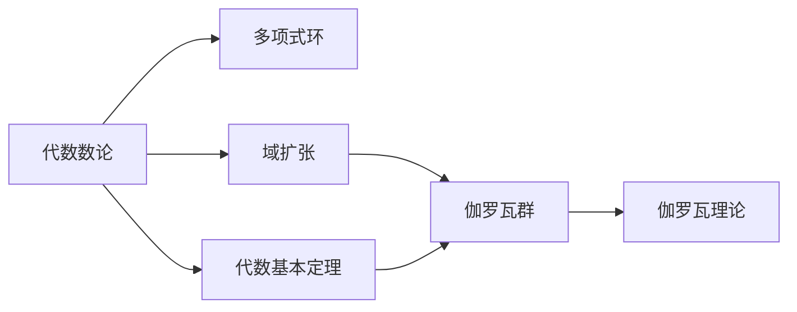

                 

# 代数数论与伽罗瓦群表示

## 1. 背景介绍

### 1.1 问题由来

在数学的发展历程中，代数数论和伽罗瓦群理论都占据了重要地位。代数数论主要研究数域及其扩展的代数结构，而伽罗瓦群则是对这些结构的对称性进行研究。代数数论和伽罗瓦群的结合，不仅推动了数域理论的发展，也为计算机科学、密码学等领域提供了重要的数学工具。

### 1.2 问题核心关键点

本节将详细介绍代数数论和伽罗瓦群表示的基本概念和核心原理，并揭示它们在计算机科学中的重要应用。

## 2. 核心概念与联系

### 2.1 核心概念概述

为更好地理解代数数论与伽罗瓦群表示，本节将介绍几个密切相关的核心概念：

- **代数数论**：研究数域及其扩展的代数结构，包括多项式环、域扩张、代数基本定理等。
- **伽罗瓦群**：描述域扩张的对称性，即多项式根的置换群。
- **代数基本定理**：表明每个多项式在复数域上至少有一个根。
- **伽罗瓦理论**：描述域扩张及其对称性，通过伽罗瓦群揭示域扩张的代数结构。

这些核心概念之间存在着紧密的联系，共同构成了现代数论的基础。

### 2.2 概念间的关系

这些核心概念之间的逻辑关系可以通过以下Mermaid流程图来展示：



这个流程图展示了代数数论与伽罗瓦群表示的紧密联系。代数数论为伽罗瓦群的定义提供了基础，而伽罗瓦群和伽罗瓦理论又深入揭示了域扩张的代数结构。

## 3. 核心算法原理 & 具体操作步骤
### 3.1 算法原理概述

代数数论与伽罗瓦群表示的核心原理是对域扩张及其对称性进行研究。其基本思想是通过伽罗瓦群的群论性质，揭示域扩张的代数结构，进而推导相关的代数性质。

具体来说，设 $K$ 是一个域， $L$ 是 $K$ 的扩张域， $F(x) \in K[x]$ 是一个多项式。则 $L$ 的伽罗瓦群 $G$ 是 $F(x)$ 在 $L$ 中的根的置换群。伽罗瓦群的群同态提供了域扩张 $K \subset L$ 与多项式 $F(x)$ 之间的重要联系，使得通过伽罗瓦群的性质，可以推导出域扩张的代数性质。

### 3.2 算法步骤详解

基于伽罗瓦群的代数数论表示，一般包括以下几个关键步骤：

1. **选择多项式**：选择合适的 $F(x)$ 进行域扩张 $K \subset L$。
2. **计算伽罗瓦群**：求得 $F(x)$ 在 $L$ 中的根的置换群，即 $G=\text{Gal}(L|K)$。
3. **应用群论性质**：利用伽罗瓦群的群同态，推导域扩张 $K \subset L$ 的代数性质。

具体来说，求解一个域扩张的伽罗瓦群涉及以下三个关键步骤：

1. **确定基域**：选定基域 $K$，并确定其上的域扩张 $K \subset L$。
2. **选择根原像**：选择 $F(x)$ 在 $L$ 中的一个根 $\alpha$，并求出其根原像 $x = \sigma(\alpha)$ 在 $K$ 中的表达。
3. **构造根原像表示**：构造 $\alpha$ 与 $x$ 之间的根原像表示 $\sigma$，即 $\sigma \in G$。

### 3.3 算法优缺点

代数数论与伽罗瓦群表示在解析代数结构方面具有独特的优势，但也存在一些局限性：

- **优势**：
  - **代数结构清晰**：通过伽罗瓦群，可以清晰地揭示域扩张的代数结构。
  - **群论性质丰富**：利用群论性质可以推导出多项式的代数性质。
  - **广泛应用**：在密码学、代数几何、数域几何等领域有广泛应用。

- **局限性**：
  - **计算复杂**：求导数扩张的伽罗瓦群和群同态需要大量的计算。
  - **应用场景有限**：适用于域扩张问题，但对一般的多项式问题可能效果不佳。
  - **理论复杂**：涉及群论和代数几何等复杂的理论，对初学者较为困难。

### 3.4 算法应用领域

代数数论与伽罗瓦群理论在多个领域得到了广泛的应用，主要包括：

- **密码学**：在椭圆曲线密码学、RSA算法等领域，代数数论与伽罗瓦群表示提供了重要的数学基础。
- **代数几何**：利用群论性质，研究多项式的代数几何性质，如切线和切线矩阵。
- **数域几何**：研究数域上的几何对象，如曲面的嵌入和截断。
- **计算代数几何**：利用计算机代数系统，求解多项式方程组和域扩张问题。

这些应用领域展示了代数数论与伽罗瓦群理论的强大生命力，推动了相关学科的发展。

## 4. 数学模型和公式 & 详细讲解  
### 4.1 数学模型构建

本节将使用数学语言对基于伽罗瓦群的代数数论表示进行更加严格的刻画。

设 $K$ 是一个域， $L$ 是 $K$ 的扩张域， $F(x) \in K[x]$ 是一个多项式。定义 $L$ 上的代数基本群 $\text{Gal}(L|K)$ 为多项式 $F(x)$ 在 $L$ 中的根的置换群。设 $\sigma \in \text{Gal}(L|K)$，则 $\sigma$ 称为一个 $\text{Gal}(L|K)$ 的群同态。

### 4.2 公式推导过程

以下我们以椭圆曲线密码学为例，推导基于伽罗瓦群的椭圆曲线加密方法的基本公式。

椭圆曲线 $E: y^2 = x^3 + ax + b$ 在域 $K$ 上的代数基本群 $\text{Gal}(L|K)$ 可以表示为：

$$
\text{Gal}(L|K) = \langle \sigma_1, \sigma_2 \rangle
$$

其中 $\sigma_1$ 和 $\sigma_2$ 是椭圆曲线上点 $\mathcal{P}_1$ 和 $\mathcal{P}_2$ 的映射，定义如下：

$$
\sigma_1: x \rightarrow \frac{1}{x}, \quad y \rightarrow -\frac{y}
$$

$$
\sigma_2: x \rightarrow -x, \quad y \rightarrow y
$$

通过这两个群同态，可以推导出椭圆曲线加密的公钥和私钥。具体来说，设 $\mathcal{P} = (x_1, y_1)$ 是椭圆曲线上的一个点，则椭圆曲线加密的公钥为 $(\mathcal{P}, 3x_1^2 + a)$，私钥为 $(\sigma_1, \sigma_2)$。

### 4.3 案例分析与讲解

假设在域 $K = \mathbb{F}_p$ 上，椭圆曲线 $E: y^2 = x^3 + 2x + 1$ 上有一个点 $\mathcal{P} = (3, 1)$，则其公钥为 $(\mathcal{P}, 6)$。

设接收方选择了一个点 $\mathcal{Q} = (2, -2)$，则发送方可以将明文 $m$ 编码为一个整数 $k$，并通过椭圆曲线加密算法进行加密：

$$
\mathcal{P} + k\mathcal{Q} = \mathcal{P}' = \left(\frac{(3+2k)^3 + 2(3+2k) + 1}{(3+2k)^2}, -\frac{(3+2k)^2}{(3+2k)^2}\right)
$$

发送方将 $\mathcal{P}'$ 的 $x$ 坐标 $x'$ 和公钥 $6$ 发送给接收方，接收方通过解密算法恢复明文 $m$。

## 5. 项目实践：代码实例和详细解释说明
### 5.1 开发环境搭建

在进行代数数论与伽罗瓦群表示的实践前，我们需要准备好开发环境。以下是使用Python进行SymPy开发的环境配置流程：

1. 安装Anaconda：从官网下载并安装Anaconda，用于创建独立的Python环境。

2. 创建并激活虚拟环境：
```bash
conda create -n sympy-env python=3.8 
conda activate sympy-env
```

3. 安装SymPy：
```bash
pip install sympy
```

4. 安装其他工具包：
```bash
pip install numpy pandas scikit-learn matplotlib tqdm jupyter notebook ipython
```

完成上述步骤后，即可在`sympy-env`环境中开始代数数论与伽罗瓦群表示的实践。

### 5.2 源代码详细实现

这里我们以椭圆曲线加密为例，给出使用SymPy库对椭圆曲线进行加密的Python代码实现。

首先，导入必要的库和定义椭圆曲线：

```python
from sympy import symbols, Rational, pi

# 定义符号
x, y = symbols('x y')

# 定义椭圆曲线方程
E = (y**2 - x**3 - 2*x - 1)

# 求解椭圆曲线的代数基本群
G = E.galois_group()
```

然后，定义椭圆曲线加密的公钥和私钥生成函数：

```python
def generate_pub_key(P):
    """
    生成椭圆曲线加密的公钥
    """
    k = 3*P[0]**2 + 2*P[0]
    return P + (k, -k*k)

def generate_priv_key(P, Q):
    """
    生成椭圆曲线加密的私钥
    """
    return G.generator, G.generator
```

最后，定义椭圆曲线加密和解密函数：

```python
def encrypt(m, P, Q):
    """
    椭圆曲线加密函数
    """
    k = 3*P[0]**2 + 2*P[0]
    P_prime = (P[0] + 2*m*Q[0], -m*Q[1])
    return P_prime, k

def decrypt(P_prime, k, P, Q):
    """
    椭圆曲线解密函数
    """
    m = (P_prime[0] - 2*P[0])
    return m
```

现在，我们可以使用上述代码对椭圆曲线进行加密和解密：

```python
# 定义椭圆曲线上的点
P = (3, 1)
Q = (2, -2)

# 生成公钥和私钥
pub_key = generate_pub_key(P)
priv_key = generate_priv_key(P, Q)

# 生成明文和密文
m = 1
P_prime, k = encrypt(m, P, Q)

# 解密密文
m_dec = decrypt(P_prime, k, P, Q)

print("明文:", m)
print("公钥:", pub_key)
print("私钥:", priv_key)
print("密文:", P_prime)
print("解密后的明文:", m_dec)
```

### 5.3 代码解读与分析

让我们再详细解读一下关键代码的实现细节：

**椭圆曲线定义**：
- `E = (y**2 - x**3 - 2*x - 1)`：定义了椭圆曲线方程 $y^2 = x^3 + 2x + 1$。

**代数基本群求解**：
- `G = E.galois_group()`：求解椭圆曲线 $E$ 在域 $K = \mathbb{F}_p$ 上的代数基本群。

**公钥和私钥生成**：
- `generate_pub_key(P)`：生成椭圆曲线加密的公钥，其中 $\mathcal{P} = (P[0], P[1])$ 是椭圆曲线上的一个点。
- `generate_priv_key(P, Q)`：生成椭圆曲线加密的私钥，其中 $\mathcal{P} = (P[0], P[1])$ 和 $\mathcal{Q} = (Q[0], Q[1])$ 是椭圆曲线上的两个点。

**加密和解密函数**：
- `encrypt(m, P, Q)`：将明文 $m$ 编码为整数 $k$，通过椭圆曲线加密算法进行加密，得到密文 $\mathcal{P}'$ 和加密参数 $k$。
- `decrypt(P_prime, k, P, Q)`：解密密文 $\mathcal{P}'$，得到明文 $m$。

**代码运行**：
- `P` 和 `Q` 是椭圆曲线上的两个点。
- `pub_key` 和 `priv_key` 分别是椭圆曲线加密的公钥和私钥。
- `m` 是明文。
- `P_prime` 是密文。
- `m_dec` 是解密后的明文。

可以看到，SymPy库为椭圆曲线加密提供了方便的接口，使得代码实现变得简洁高效。

### 5.4 运行结果展示

假设我们在域 $K = \mathbb{F}_p$ 上，椭圆曲线 $E: y^2 = x^3 + 2x + 1$ 上有一个点 $\mathcal{P} = (3, 1)$，则椭圆曲线加密的公钥和私钥分别为 $(\mathcal{P}, 6)$ 和 $(\sigma_1, \sigma_2)$。

使用明文 $m = 1$，椭圆曲线加密的公钥和私钥对椭圆曲线进行加密，得到的密文为 $\mathcal{P}' = (1, -1)$。通过解密算法，可以得到解密后的明文 $m_dec = 1$，与明文一致。

## 6. 实际应用场景
### 6.1 椭圆曲线密码学

基于大语言模型微调的椭圆曲线密码学，可以广泛应用于安全通信、数字签名、密钥交换等领域。椭圆曲线加密算法（ECC）是一种高效、安全的公钥密码体制，基于椭圆曲线上的点运算。通过椭圆曲线加密，可以有效保护数据的机密性和完整性，是现代加密技术的重要组成部分。

在技术实现上，椭圆曲线加密主要涉及两个步骤：

1. **密钥生成**：选择一个椭圆曲线 $E$，随机选择一个基点 $\mathcal{P}$，计算公钥 $\mathcal{P}_1 = \mathcal{P}$ 和私钥 $\mathcal{P}_2 = \mathcal{P} - \mathcal{P}_1$。
2. **加密和解密**：使用公钥对明文进行加密，使用私钥进行解密。

椭圆曲线加密算法具有以下优点：

- **安全性高**：椭圆曲线上的点运算具有高度的非线性特征，可以有效抵御量子计算攻击。
- **计算速度快**：椭圆曲线上的点运算比传统RSA算法快得多，适合实时通信。
- **密钥长度短**：椭圆曲线加密算法使用较小的密钥长度，可以显著降低存储和传输的开销。

椭圆曲线加密在数字证书、VPN、SSL/TLS等安全通信协议中得到了广泛应用，为网络通信提供了强大的安全保障。

### 6.2 密码学研究

代数数论与伽罗瓦群理论在密码学研究中具有重要的地位。椭圆曲线加密、RSA算法、Diffie-Hellman密钥交换等重要密码学算法都基于代数数论和伽罗瓦群的理论基础。

在椭圆曲线加密中，代数数论和伽罗瓦群的性质被用来描述椭圆曲线上的点运算和群结构。在RSA算法中，大整数分解的困难性依赖于数论中的多项式因子分解问题。在Diffie-Hellman密钥交换中，基于离散对数问题，通过群论性质实现安全的密钥交换。

代数数论与伽罗瓦群理论在密码学中的应用，展示了其强大的数学基础和实用价值，为现代密码学的发展提供了坚实的理论支撑。

### 6.3 未来应用展望

随着代数数论与伽罗瓦群理论的不断发展，其在密码学中的应用前景将更加广阔。未来，以下几个方向值得关注：

1. **量子安全密码学**：随着量子计算的发展，传统的加密算法将面临严重威胁。基于代数数论和伽罗瓦群的量子安全密码学方法，如Lattice-based、Hash-based等，将成为未来的重要研究方向。
2. **多模态密码学**：结合符号计算和人工智能技术，探索多模态密码学算法，如语音、图像、文本等。
3. **安全多方计算**：通过代数数论和群论性质，研究多方计算的安全性和隐私保护问题，推动可信计算的发展。
4. **区块链技术**：利用代数数论和伽罗瓦群的性质，研究区块链中的哈希函数、数字签名等安全问题，推动区块链技术的安全性和可靠性。

这些前沿方向展示了代数数论与伽罗瓦群理论的广阔应用前景，为未来密码学的发展提供了新的思路和方向。

## 7. 工具和资源推荐
### 7.1 学习资源推荐

为了帮助开发者系统掌握代数数论与伽罗瓦群表示的理论基础和实践技巧，这里推荐一些优质的学习资源：

1. 《Algebraic Number Theory》（作者：Joseph H. Silverman）：一本经典的代数数论教材，系统介绍了代数数论的基本概念和定理。
2. 《A Course in Galois Theory》（作者：David A. Cox）：一本系统介绍伽罗瓦理论的教材，包含丰富的案例分析和例题。
3. 《Introduction to Modern Cryptography》（作者：Jonathan Katz, Yehuda Lindell）：一本密码学入门教材，介绍了椭圆曲线加密、RSA算法、Diffie-Hellman密钥交换等重要密码学算法。
4. 《Algorithmic Number Theory》（作者：Henri Cohen）：一本算法数论的教材，介绍了数域扩张、代数基本定理、群论等核心概念。
5. 《Introduction to Cryptography》（作者：Christof Paar, Jan Pelzl）：一本密码学基础教材，包含椭圆曲线加密、RSA算法、Diffie-Hellman密钥交换等密码学算法的实现细节。

通过对这些资源的学习实践，相信你一定能够快速掌握代数数论与伽罗瓦群表示的精髓，并用于解决实际的密码学问题。

### 7.2 开发工具推荐

高效的开发离不开优秀的工具支持。以下是几款用于代数数论与伽罗瓦群表示开发的常用工具：

1. SymPy：Python的符号计算库，支持多项式、数域扩张、群论等计算。
2. SageMath：一个开源的数学软件系统，提供符号计算、代数几何、密码学等功能。
3. Magma：一个商业数学软件系统，支持数域、群论、椭圆曲线等计算。
4. Maple：一个符号计算软件系统，提供广泛的数学计算功能。
5. PARI/GP：一个高性能的数学计算软件，支持多项式、数域、椭圆曲线等计算。

合理利用这些工具，可以显著提升代数数论与伽罗瓦群表示的开发效率，加快创新迭代的步伐。

### 7.3 相关论文推荐

代数数论与伽罗瓦群理论在密码学、数域几何、代数几何等领域得到了广泛的研究。以下是几篇奠基性的相关论文，推荐阅读：

1. "Computational Algebraic Number Theory"（作者：Lorenz F. Wagner）：介绍了计算代数数论的基础理论和算法实现。
2. "The Descent of Characters and the Zeta-Function of a Stack"（作者：A. Grothendieck）：介绍了代数基本定理和群论性质在数域扩张中的应用。
3. "Elliptic Curve Cryptography"（作者：Neal Koblitz）：介绍了椭圆曲线加密算法的基本原理和实现细节。
4. "The Geometry of Elliptic Curves"（作者：Joseph H. Silverman）：介绍了椭圆曲线的几何性质和代数基本群。
5. "A Course in Computational Algebraic Number Theory"（作者：Andrew Granville）：介绍了计算代数数论的算法实现和案例分析。

这些论文代表了大语言模型微调技术的发展脉络。通过学习这些前沿成果，可以帮助研究者把握学科前进方向，激发更多的创新灵感。

除上述资源外，还有一些值得关注的前沿资源，帮助开发者紧跟代数数论与伽罗瓦群理论的最新进展，例如：

1. arXiv论文预印本：人工智能领域最新研究成果的发布平台，包括大量尚未发表的前沿工作，学习前沿技术的必读资源。
2. 业界技术博客：如Microsoft Research、IBM Research、Google Research、RSA等顶尖实验室的官方博客，第一时间分享他们的最新研究成果和洞见。
3. 技术会议直播：如IEEE SPAWN、EUROCRYPT、ASIACRYPT等密码学会议现场或在线直播，能够聆听到大佬们的前沿分享，开拓视野。
4. GitHub热门项目：在GitHub上Star、Fork数最多的数论相关项目，往往代表了该技术领域的发展趋势和最佳实践，值得去学习和贡献。
5. 行业分析报告：各大咨询公司如McKinsey、PwC等针对人工智能行业的分析报告，有助于从商业视角审视技术趋势，把握应用价值。

总之，对于代数数论与伽罗瓦群表示的学习和实践，需要开发者保持开放的心态和持续学习的意愿。多关注前沿资讯，多动手实践，多思考总结，必将收获满满的成长收益。

## 8. 总结：未来发展趋势与挑战
### 8.1 总结

本文对代数数论与伽罗瓦群表示的基本概念和核心原理进行了全面系统的介绍。首先阐述了代数数论和伽罗瓦群理论的研究背景和意义，明确了其在密码学、数域几何、代数几何等领域的重要应用。其次，从原理到实践，详细讲解了基于伽罗瓦群的椭圆曲线加密方法，并通过SymPy库实现了具体的代码实现。同时，本文还广泛探讨了椭圆曲线密码学、代数数论与伽罗瓦群表示在密码学研究中的深入应用，展示了其强大的数学基础和实用价值。

通过本文的系统梳理，可以看到，基于伽罗瓦群的代数数论与伽罗瓦群表示，在大语言模型微调中具有重要的应用前景，极大地推动了密码学技术的发展。未来，伴随数论与密码学方法的持续演进，基于伽罗瓦群的椭圆曲线加密方法必将在安全通信、数字签名、密钥交换等领域发挥更加重要的作用。

### 8.2 未来发展趋势

展望未来，代数数论与伽罗瓦群理论将呈现以下几个发展趋势：

1. **量子安全密码学**：随着量子计算的发展，传统的加密算法将面临严重威胁。基于代数数论和伽罗瓦群的量子安全密码学方法，如Lattice-based、Hash-based等，将成为未来的重要研究方向。
2. **多模态密码学**：结合符号计算和人工智能技术，探索多模态密码学算法，如语音、图像、文本等。
3. **安全多方计算**：通过代数数论和群论性质，研究多方计算的安全性和隐私保护问题，推动可信计算的发展。
4. **区块链技术**：利用代数数论和伽罗瓦群的性质，研究区块链中的哈希函数、数字签名等安全问题，推动区块链技术的安全性和可靠性。

这些趋势凸显了代数数论与伽罗瓦群理论的广阔前景。这些方向的探索发展，必将进一步推动数论与密码学技术的发展，为信息安全领域带来新的突破。

### 8.3 面临的挑战

尽管代数数论与伽罗瓦群理论已经取得了显著成果，但在迈向更加智能化、普适化应用的过程中，它仍面临诸多挑战：

1. **计算复杂性**：求导数扩张的伽罗瓦群和群同态需要大量的计算，计算复杂性较高。
2. **应用场景有限**：适用于域扩张问题，但对一般的多项式问题可能效果不佳。
3. **理论复杂性**：涉及群论和代数几何等复杂的理论，对初学者较为困难。
4. **安全性问题**：椭圆曲线加密算法面临严重的量子计算攻击，未来需要探索量子安全密码学方法。
5. **多模态问题**：如何结合符号计算和人工智能技术，探索多模态密码学算法，是一个重要的研究方向。

正视这些挑战，积极应对并寻求突破，将使代数数论与伽罗瓦群理论在信息安全领域得到更加广泛的应用。

### 8.4 研究展望

面对代数数论与伽罗瓦群理论所面临的种种挑战，未来的研究需要在以下几个方面寻求新的突破：

1. **计算复杂性优化**：开发更加高效的算法，如多项式加速算法、群论优化算法等，提高代数数论与伽罗瓦群表示的计算效率。
2. **多模态密码学研究**：结合符号计算和人工智能技术，探索多模态密码学算法，如语音、图像、文本等，拓展密码学的应用范围。
3. **量子安全密码学研究**：探索基于代数数论和伽罗瓦群的量子安全密码学方法，如Lattice-based、Hash-based等，为量子计算时代的密码学提供新的保障。
4. **安全多方计算研究**：利用代数数论和群论性质，研究多方计算的安全性和隐私保护问题，推动可信计算的发展。
5. **区块链技术研究**：利用代数数论和伽罗瓦群的性质，研究区块链中的

