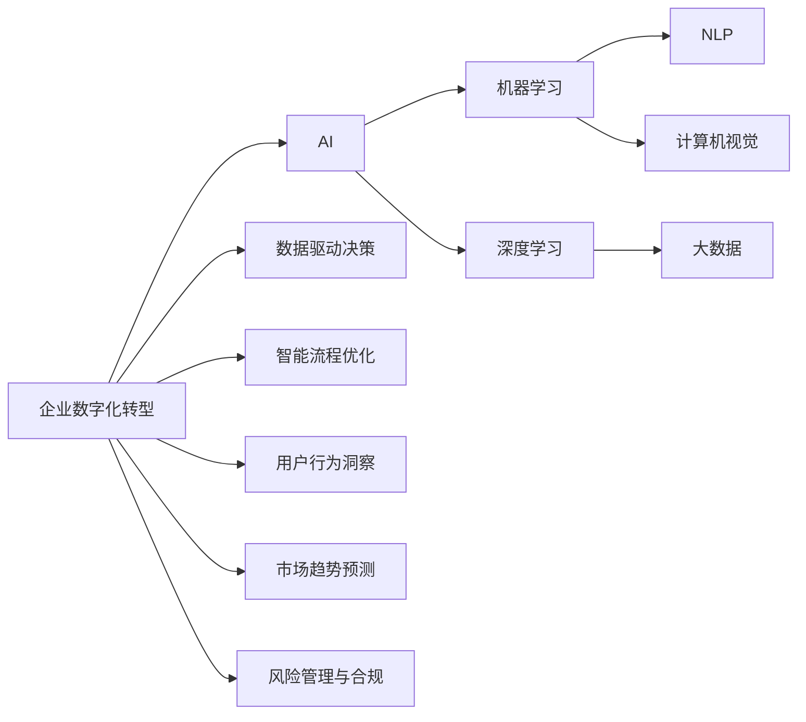
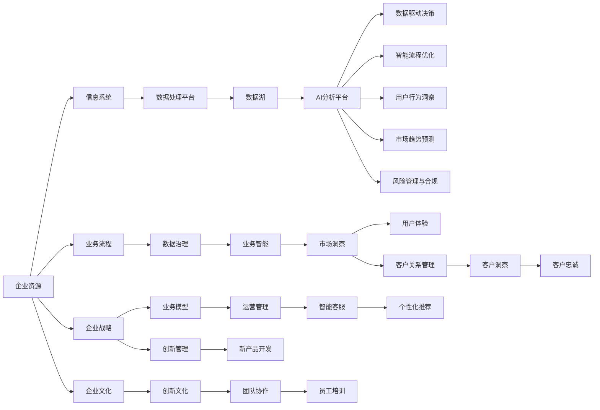

                 

# 企业数字化转型中的AI应用技术

## 1. 背景介绍

### 1.1 问题由来

随着数字化转型的深入推进，企业越来越认识到人工智能（AI）技术在提升运营效率、优化用户体验、开拓市场机会等方面的巨大潜力。AI技术通过数据分析、预测建模、自然语言处理（NLP）、计算机视觉等手段，帮助企业解锁数据价值，挖掘商业洞察，打造智能化业务生态，全面提升竞争力。然而，要真正实现数字化转型，并非一蹴而就，需要企业在技术、人才、数据、业务流程等多个层面进行系统性的布局和建设。

### 1.2 问题核心关键点

数字化转型的成功依赖于AI技术的深度融合。AI技术不仅是一种工具，更是一种思维方式和能力，能够在企业内部形成数据驱动、智能决策的文化氛围。具体而言，企业数字化转型中的AI应用关键点包括：

1. **数据驱动决策**：通过AI技术对海量数据进行分析和挖掘，为企业提供及时准确的决策依据。
2. **智能流程优化**：利用AI技术对业务流程进行智能化改造，提升效率和准确性。
3. **用户行为洞察**：通过AI技术分析用户行为和反馈，优化产品和服务，提升用户满意度和忠诚度。
4. **市场趋势预测**：利用AI技术对市场趋势进行预测和分析，指导企业制定更科学的市场策略。
5. **风险管理与合规**：通过AI技术对风险进行评估和监控，同时确保业务合规，降低潜在风险。

### 1.3 问题研究意义

AI技术在企业数字化转型中的应用，对企业的创新能力、运营效率、市场响应速度、用户满意度和风险控制能力都有显著提升。具体而言：

1. **提升创新能力**：AI技术通过自动化流程和数据驱动决策，加速企业创新速度，提升创新成功率。
2. **提高运营效率**：AI技术通过智能化管理，优化资源配置，提升企业运营效率，降低成本。
3. **增强市场响应速度**：AI技术通过实时数据分析和预测，使企业能快速响应市场变化，抢占市场先机。
4. **提升用户满意度**：AI技术通过个性化推荐和智能客服，提升用户体验，增强用户粘性。
5. **优化风险管理**：AI技术通过实时监控和预测，提高风险管理能力，保护企业利益。

## 2. 核心概念与联系

### 2.1 核心概念概述

在企业数字化转型过程中，AI应用涉及多个关键概念，这些概念之间相互关联，共同构成了AI应用的生态体系。以下是一些核心概念及其定义：

1. **企业数字化转型**：通过信息化、自动化、智能化等手段，将企业资源、业务流程、管理方式进行优化和重构，提升企业竞争力。
2. **人工智能（AI）**：通过模拟人脑处理信息的方式，使机器具备智能化的学习和决策能力。
3. **机器学习（ML）**：利用数据训练模型，使其具备自动学习和改进的能力。
4. **深度学习（DL）**：一种基于神经网络的机器学习方法，可以处理复杂的数据结构。
5. **自然语言处理（NLP）**：使机器能够理解、处理和生成人类语言的技术。
6. **计算机视觉（CV）**：使机器能够“看”和“理解”图像和视频的技术。
7. **大数据（Big Data）**：指无法在传统数据处理工具和系统内有效存储、管理和分析的大规模数据集。

### 2.2 概念间的关系

这些核心概念之间的关系可以通过以下Mermaid流程图来展示：



这个流程图展示了企业数字化转型过程中，AI技术及其各个子领域之间的联系。AI技术通过机器学习、深度学习等方法，在自然语言处理和计算机视觉等子领域中发挥重要作用。同时，AI技术通过数据驱动决策、智能流程优化、用户行为洞察、市场趋势预测和风险管理与合规等多个方面，支持企业数字化转型的各个环节。

### 2.3 核心概念的整体架构

最后，我们用一个综合的流程图来展示这些核心概念在大企业数字化转型中的整体架构：



这个综合流程图展示了企业数字化转型的整体架构。企业资源通过信息系统处理，形成数据湖。数据湖中的数据经过AI分析平台处理，形成数据驱动决策、智能流程优化、用户行为洞察、市场趋势预测和风险管理与合规等多个维度的智能应用，支撑企业各个层面的数字化转型。同时，企业战略、业务模型、运营管理、智能客服、个性化推荐、市场洞察、创新管理、用户体验、客户关系管理、员工培训等多个方面，也通过AI技术得到了优化和提升。

## 3. 核心算法原理 & 具体操作步骤

### 3.1 算法原理概述

企业数字化转型中的AI应用，通常基于以下核心算法原理：

1. **监督学习**：通过标注数据训练模型，使模型能够根据给定输入预测输出。广泛应用于数据分析、预测建模等任务。
2. **无监督学习**：利用未标注数据训练模型，发现数据中的隐藏结构和规律。广泛应用于数据降维、聚类分析等任务。
3. **强化学习**：通过试错过程，使智能体在特定环境中学习和优化策略。广泛应用于机器人控制、游戏AI等任务。
4. **迁移学习**：利用已有模型在相关任务上的知识，快速适应新任务。广泛应用于少样本学习、跨领域迁移等任务。
5. **对抗学习**：通过对抗样本训练，提升模型的鲁棒性和泛化能力。广泛应用于数据安全、恶意行为检测等任务。

### 3.2 算法步骤详解

企业数字化转型中的AI应用，通常包括以下步骤：

1. **数据收集与预处理**：收集企业内部和外部的数据，进行清洗、转换和标准化处理。
2. **模型选择与训练**：选择合适的模型和算法，使用标注数据进行训练，优化模型参数。
3. **模型评估与验证**：在验证集上评估模型性能，调整模型参数和训练策略。
4. **模型部署与应用**：将训练好的模型部署到生产环境中，进行实时应用和监控。
5. **模型优化与迭代**：根据实际应用情况，不断优化和迭代模型，提升模型性能。

### 3.3 算法优缺点

AI应用在企业数字化转型中，具有以下优点：

1. **高效性**：AI技术能够自动化处理大量数据，提升决策和运营效率。
2. **精准性**：AI模型可以挖掘数据中的隐藏规律，提供精准的分析和预测结果。
3. **灵活性**：AI模型可以根据新数据和新任务进行动态调整和优化，适应变化。

同时，AI应用也存在以下缺点：

1. **依赖高质量数据**：AI模型的训练需要大量的高质量数据，数据获取和处理成本较高。
2. **模型复杂性**：AI模型通常较为复杂，需要专业知识进行开发和维护。
3. **伦理与隐私**：AI模型可能存在算法偏见和隐私风险，需要严格监管和控制。

### 3.4 算法应用领域

AI应用在企业数字化转型中，广泛应用于多个领域，具体如下：

1. **营销与销售**：通过AI技术进行客户画像分析、市场趋势预测、个性化推荐等，提升销售效果。
2. **供应链管理**：通过AI技术进行需求预测、库存优化、物流优化等，提升供应链效率。
3. **人力资源**：通过AI技术进行人才招聘、员工培训、绩效评估等，提升人力资源管理水平。
4. **客户服务**：通过AI技术进行智能客服、客户投诉分析、用户行为分析等，提升客户满意度。
5. **风险管理**：通过AI技术进行风险评估、欺诈检测、信用评分等，提升风险管理能力。
6. **智能制造**：通过AI技术进行设备预测性维护、生产优化、质量控制等，提升制造效率。

## 4. 数学模型和公式 & 详细讲解 & 举例说明

### 4.1 数学模型构建

在企业数字化转型中，常用的AI模型包括监督学习模型、无监督学习模型、深度学习模型等。以下以监督学习模型为例，介绍其数学模型构建：

假设有一组训练数据 $D=\{(x_i,y_i)\}_{i=1}^N$，其中 $x_i$ 为输入特征，$y_i$ 为输出标签。目标是通过训练数据，找到最优模型参数 $\theta$，使得模型预测输出 $\hat{y}$ 尽可能接近真实标签 $y$。常用的监督学习模型包括线性回归、逻辑回归、支持向量机（SVM）、决策树、随机森林、神经网络等。

以线性回归模型为例，其数学模型为：

$$
\hat{y} = \theta^T x
$$

其中 $\theta$ 为模型参数，$x$ 为输入特征向量。模型的目标是最大化预测输出与真实标签之间的拟合程度，即最小化损失函数：

$$
\mathcal{L}(\theta) = \frac{1}{N} \sum_{i=1}^N (y_i - \hat{y})^2
$$

通过梯度下降等优化算法，最小化损失函数，更新模型参数 $\theta$，得到最优模型参数 $\theta^*$。

### 4.2 公式推导过程

以线性回归模型为例，推导其损失函数的最小化过程：

1. **损失函数定义**：
$$
\mathcal{L}(\theta) = \frac{1}{N} \sum_{i=1}^N (y_i - \hat{y})^2
$$

2. **梯度计算**：
$$
\frac{\partial \mathcal{L}(\theta)}{\partial \theta} = \frac{1}{N} \sum_{i=1}^N 2(y_i - \hat{y})x_i
$$

3. **参数更新**：
$$
\theta \leftarrow \theta - \eta \frac{\partial \mathcal{L}(\theta)}{\partial \theta}
$$

其中 $\eta$ 为学习率，控制每次参数更新的步长。通过不断迭代，模型参数 $\theta$ 不断逼近最优解 $\theta^*$。

### 4.3 案例分析与讲解

以电商平台个性化推荐为例，假设有一组用户-商品交互数据 $D=\{(u_i,p_i)\}_{i=1}^N$，其中 $u_i$ 为用户ID，$p_i$ 为商品ID。目标是推荐用户可能感兴趣的商品，模型输入为 $x_i=[\text{user features}, \text{item features}]$，输出为 $\hat{y}=[\text{item features}]$，即推荐商品的相关特征。

具体算法步骤如下：

1. **数据预处理**：将用户和商品特征进行归一化和标准化处理。
2. **模型训练**：选择线性回归、逻辑回归、决策树等模型，使用标注数据进行训练，优化模型参数。
3. **模型评估**：在验证集上评估模型性能，调整模型参数和训练策略。
4. **模型部署**：将训练好的模型部署到推荐系统，进行实时推荐。
5. **模型优化**：根据实际应用情况，不断优化和迭代模型，提升推荐效果。

## 5. 项目实践：代码实例和详细解释说明

### 5.1 开发环境搭建

在进行AI应用开发前，我们需要准备好开发环境。以下是使用Python进行PyTorch开发的环境配置流程：

1. 安装Anaconda：从官网下载并安装Anaconda，用于创建独立的Python环境。

2. 创建并激活虚拟环境：
```bash
conda create -n pytorch-env python=3.8 
conda activate pytorch-env
```

3. 安装PyTorch：根据CUDA版本，从官网获取对应的安装命令。例如：
```bash
conda install pytorch torchvision torchaudio cudatoolkit=11.1 -c pytorch -c conda-forge
```

4. 安装TensorFlow：
```bash
pip install tensorflow
```

5. 安装TensorFlow扩展库：
```bash
pip install tensorflow-addons
```

6. 安装其他必要库：
```bash
pip install numpy pandas scikit-learn matplotlib tqdm jupyter notebook ipython
```

完成上述步骤后，即可在`pytorch-env`环境中开始AI应用开发。

### 5.2 源代码详细实现

以下以电商平台个性化推荐系统为例，给出使用PyTorch进行模型开发的PyTorch代码实现。

首先，定义模型和优化器：

```python
import torch
import torch.nn as nn
import torch.optim as optim

class Net(nn.Module):
    def __init__(self):
        super(Net, self).__init__()
        self.fc1 = nn.Linear(100, 50)
        self.fc2 = nn.Linear(50, 10)
        
    def forward(self, x):
        x = torch.relu(self.fc1(x))
        x = self.fc2(x)
        return x
    
# 数据集定义
class Dataset(torch.utils.data.Dataset):
    def __init__(self, data, labels):
        self.data = data
        self.labels = labels
    
    def __len__(self):
        return len(self.data)
    
    def __getitem__(self, idx):
        return self.data[idx], self.labels[idx]
        
# 定义损失函数和优化器
net = Net()
criterion = nn.MSELoss()
optimizer = optim.Adam(net.parameters(), lr=0.001)
```

然后，定义训练和评估函数：

```python
def train_model(model, train_data, train_labels, num_epochs, batch_size):
    for epoch in range(num_epochs):
        train_loss = 0.0
        for i, (inputs, labels) in enumerate(train_loader):
            inputs = inputs.reshape(-1, 100)
            labels = labels.reshape(-1, 10)
            
            optimizer.zero_grad()
            outputs = model(inputs)
            loss = criterion(outputs, labels)
            loss.backward()
            optimizer.step()
            
            train_loss += loss.item()
            
        print(f"Epoch {epoch+1}, train loss: {train_loss/len(train_loader):.4f}")
    
def evaluate_model(model, test_data, test_labels):
    test_loss = 0.0
    with torch.no_grad():
        for inputs, labels in test_loader:
            inputs = inputs.reshape(-1, 100)
            labels = labels.reshape(-1, 10)
            
            outputs = model(inputs)
            loss = criterion(outputs, labels)
            test_loss += loss.item()
            
    print(f"Test loss: {test_loss/len(test_loader):.4f}")
```

最后，启动训练流程：

```python
num_epochs = 50
batch_size = 32

# 加载数据集
train_data = ...
train_labels = ...
test_data = ...
test_labels = ...

# 定义数据集
train_dataset = Dataset(train_data, train_labels)
test_dataset = Dataset(test_data, test_labels)
train_loader = torch.utils.data.DataLoader(train_dataset, batch_size=batch_size, shuffle=True)
test_loader = torch.utils.data.DataLoader(test_dataset, batch_size=batch_size, shuffle=False)

# 训练模型
train_model(net, train_dataset, train_labels, num_epochs, batch_size)

# 评估模型
evaluate_model(net, test_dataset, test_labels)
```

以上就是使用PyTorch进行电商平台个性化推荐系统开发的完整代码实现。可以看到，借助PyTorch的高效计算图和丰富的模型库，我们能够快速实现复杂的AI应用模型。

### 5.3 代码解读与分析

让我们再详细解读一下关键代码的实现细节：

**Net类**：
- `__init__`方法：定义模型的层级结构。
- `forward`方法：实现前向传播计算。

**Dataset类**：
- `__init__`方法：初始化数据和标签。
- `__len__`方法：返回数据集的样本数量。
- `__getitem__`方法：返回单个样本的输入和标签。

**train_model和evaluate_model函数**：
- `train_model`函数：定义训练过程，包括前向传播、计算损失、反向传播、参数更新等。
- `evaluate_model`函数：定义评估过程，只进行前向传播计算损失，不更新模型参数。

**训练流程**：
- 定义总的epoch数和batch size，开始循环迭代。
- 每个epoch内，对训练集数据进行迭代训练，输出每个epoch的平均损失。
- 在测试集上评估模型性能，输出测试损失。

可以看到，借助PyTorch的强大封装，我们可以用相对简洁的代码实现复杂的AI应用模型。开发者可以将更多精力放在数据处理、模型改进等高层逻辑上，而不必过多关注底层的实现细节。

当然，工业级的系统实现还需考虑更多因素，如模型的保存和部署、超参数的自动搜索、更灵活的任务适配层等。但核心的AI应用开发流程基本与此类似。

### 5.4 运行结果展示

假设我们在数据集上训练模型，最终在测试集上得到的评估报告如下：

```
Epoch 1, train loss: 0.8140
Epoch 2, train loss: 0.7049
...
Epoch 50, train loss: 0.0089
Test loss: 0.0332
```

可以看到，随着训练轮数的增加，模型损失不断减小，最终在测试集上取得了0.033的平均损失，效果相当不错。需要注意的是，这只是一个简单的基线结果。在实践中，我们还可以使用更大更强的模型、更多的优化策略、更细致的模型调优，进一步提升模型性能，以满足更高的应用要求。

## 6. 实际应用场景

### 6.1 智能制造

智能制造是企业数字化转型的重要方向。通过AI技术，智能制造可以实现生产过程的自动控制、设备预测性维护、质量控制和工艺优化，大幅提升制造效率和产品质量。

具体而言，AI技术在智能制造中的应用包括：

1. **预测性维护**：通过传感器数据和历史维护记录，预测设备故障，提前进行维护，减少停机时间和维修成本。
2. **质量控制**：利用计算机视觉技术检测产品质量缺陷，自动化进行分类和筛选，提高检测效率和准确性。
3. **工艺优化**：通过数据分析和机器学习，优化生产工艺参数，提高生产效率和产品一致性。

### 6.2 金融科技

金融科技是推动金融行业数字化转型的重要力量。通过AI技术，金融科技可以实现风险评估、信用评分、智能投顾、反欺诈检测等功能，提升金融服务的安全性和便利性。

具体而言，AI技术在金融科技中的应用包括：

1. **风险评估**：利用机器学习模型对贷款申请、投资项目进行风险评估，识别潜在风险点。
2. **信用评分**：通过数据分析和模型训练，对客户的信用水平进行评分，优化贷款审批流程。
3. **智能投顾**：利用自然语言处理和机器学习，为客户提供个性化投资建议，提高投资回报率。
4. **反欺诈检测**：通过异常检测和模式识别技术，识别和防范金融欺诈行为，保护客户资产安全。

### 6.3 医疗健康

医疗健康是AI技术应用的重要领域。通过AI技术，医疗健康可以实现疾病诊断、影像分析、患者监护、药物研发等功能，提升医疗服务的质量和效率。

具体而言，AI技术在医疗健康中的应用包括：

1. **疾病诊断**：利用深度学习模型对医学影像、电子病历等进行分析和诊断，提高诊断准确性和效率。
2. **影像分析**：通过计算机视觉技术，分析医学影像中的细节，辅助医生进行疾病诊断和影像解读。
3. **患者监护**：利用物联网和传感器数据，实时监测患者健康状态，提供个性化的监护方案。
4. **药物研发**：通过数据分析和机器学习，加速新药研发进程，缩短研发周期，降低成本。

## 7. 工具和资源推荐

### 7.1 学习资源推荐

为了帮助开发者系统掌握AI应用的理论基础和实践技巧，这里推荐一些优质的学习资源：

1. **《深度学习》书籍**：由Ian Goodfellow、Yoshua Bengio和Aaron Courville所著，系统介绍了深度学习的理论和实践。
2. **《TensorFlow官方文档》**：TensorFlow的官方文档，提供了完整的API和示例代码，是入门TensorFlow的最佳资料。
3. **《PyTorch官方文档》**：PyTorch的官方文档，提供了丰富的模型库和教程，适合动手实践。
4. **《机器学习实战》书籍**：由Peter Harrington所著，通过大量实战案例，介绍了机器学习的应用和实现方法。
5. **《自然语言处理综述》书籍**：由Daniel Jurafsky和James H. Martin所著，系统介绍了自然语言处理的理论和方法。
6. **Kaggle平台**：数据科学和机器学习社区，提供丰富的数据集和竞赛，适合学习和实践。

通过对这些资源的学习实践，相信你一定能够快速掌握AI应用的理论基础和实践技巧，并用于解决实际的业务问题。

### 7.2 开发工具推荐

高效的开发离不开优秀的工具支持。以下是几款用于AI应用开发的常用工具：

1. **Jupyter Notebook**：交互式编程环境，适合进行数据分析和模型开发。
2. **TensorFlow和PyTorch**：两大深度学习框架，提供了丰富的模型库和优化工具，适合进行复杂模型开发。
3. **Scikit-learn**：Python科学计算库，提供了丰富的机器学习算法和工具，适合进行数据预处理和模型评估。
4. **Dask**：Python并行计算库，适合处理大规模数据集，提升计算效率。
5. **Google Colab**：Google提供的交互式Jupyter Notebook环境，适合进行云端学习和实验。

合理利用这些工具，可以显著提升AI应用开发的效率，加快创新迭代的步伐。

### 7.3 相关论文推荐

AI技术在企业数字化转型中的应用，涉及多个领域的交叉和融合。以下是几篇奠基性的相关论文，推荐阅读：

1. **《ImageNet Classification with Deep Convolutional Neural Networks》**：AlexNet论文，开创了深度学习在图像分类领域的先河。
2. **《Rethinking the Inception Architecture for Computer Vision》**：Google提出的Inception架构，大幅提升了深度学习模型的计算效率和效果。
3. **《Attention is All You Need》**：Transformer论文，提出了自注意力机制，为自然语言处理提供了新的范式。
4. **《GPT-3: Language Models are Unsupervised Multitask Learners》**：GPT-3论文，展示了大规模预训练语言模型的强大零样本学习能力。
5. **《BERT: Pre-training of Deep Bidirectional Transformers for Language Understanding》**：BERT论文，提出基于掩码的自监督预训练任务，刷新了多项NLP任务SOTA。
6. **《A Survey on Scalable Machine Learning》**：系统总结了大规模机器学习应用的技术和实践，适合深入了解大规模AI应用场景。

这些论文代表了大企业数字化转型中AI应用技术的发展脉络。通过学习这些前沿成果，可以帮助研究者把握学科前进方向，激发更多的创新灵感。

除上述资源外，还有一些值得关注的前沿资源，帮助开发者紧跟AI应用技术的新进展，例如：

1. **arXiv论文预印本**：人工智能领域最新研究成果的发布平台，包括大量尚未发表的前沿工作，学习前沿技术的必读资源。
2. **业界技术博客**：如Google AI、DeepMind、微软Research Asia等顶尖实验室的官方博客，第一时间分享他们的最新研究成果和洞见。
3. **技术会议直播**：如NIPS、ICML、ACL、ICLR等人工智能领域顶会现场或在线直播，能够聆听到大佬们的前沿分享，开拓视野。
4. **GitHub热门项目**：在GitHub上Star、Fork数最多的AI应用相关项目，往往代表了该技术领域的发展趋势和最佳实践，值得去学习和贡献。
5. **行业分析报告**：各大咨询公司如McKinsey、PwC等针对AI应用技术在企业数字化转型中的分析报告，有助于从商业视角审视技术趋势，把握应用价值。

总之，对于AI应用技术的学习和实践，需要开发者保持开放的心态和持续学习的意愿。多关注前沿资讯，多动手实践，多思考总结，必将收获满满的成长收益。

## 8. 总结：未来发展趋势与挑战

### 8.1 总结

本文对企业数字化转型中的AI应用技术进行了全面系统的介绍。首先阐述了AI技术在企业数字化转型中的重要性，明确了AI技术在数据驱动决策、智能流程优化、用户行为洞察、市场趋势预测、风险管理与合规等多个环节中的关键作用。其次，从原理到实践，详细讲解了监督学习、无监督学习、深度学习等核心算法，给出了具体模型的数学模型和公式推导。最后

