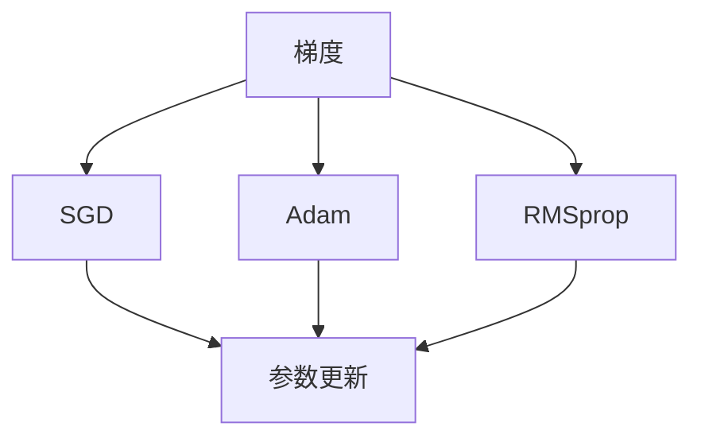
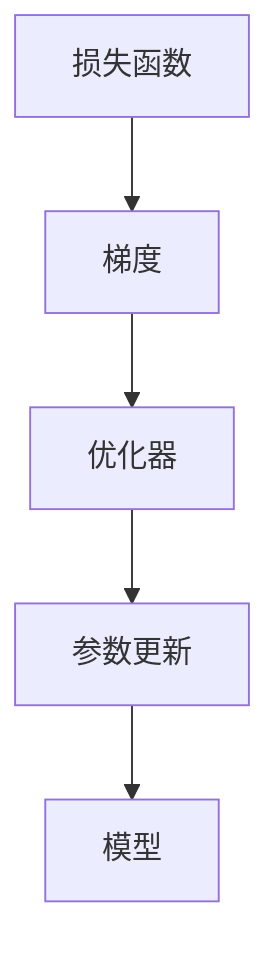

                 

# 优化器 (Optimizer)

## 1. 背景介绍

优化器(Optimizer)是深度学习中不可或缺的核心组件之一。它的主要作用是通过对模型参数的梯度更新，不断调整模型，最小化损失函数，从而提高模型性能。优化器的好坏直接决定了深度学习的训练效果，是实现深度学习算法的基础。

### 1.1 问题由来
在深度学习中，模型训练通常是一个迭代过程。训练的目标是找到一个最优的参数组合，使得损失函数最小化。这一过程通常通过梯度下降法实现。然而，梯度下降法存在一些问题：
- 容易陷入局部最优。
- 对于复杂的非凸函数，梯度方向可能不准确。
- 学习率参数选择不当，可能导致收敛速度过慢或者震荡。

为了克服这些问题，优化器算法被提出，通过更智能的方式更新参数，加速模型的收敛。

### 1.2 问题核心关键点
优化器算法在深度学习中的关键点在于如何更好地更新模型参数，加速模型收敛。常见的优化器算法包括：SGD(Steep Gradient Descent)、Adam、RMSprop等。

这些算法在更新参数时，通常采用以下步骤：
- 计算梯度。
- 更新参数。
- 调整学习率。
- 限制梯度爆炸或消失。

## 2. 核心概念与联系

### 2.1 核心概念概述

优化器算法通过不断地调整模型参数，使损失函数最小化。优化器算法的核心在于参数更新规则的设计。常见的优化器算法包括SGD、Adam、RMSprop等。

- **SGD(Steepest Gradient Descent)**：最基本的优化器算法，通过梯度方向更新模型参数。
- **Adam(Adaptive Moment Estimation)**：结合了动量和自适应学习率的优化器算法，能够在复杂的非凸函数中更快速地收敛。
- **RMSprop(Root Mean Square Propagation)**：结合了动量和自适应学习率的优化器算法，在处理非平稳目标函数时表现优异。

### 2.2 概念间的关系

这些核心概念之间的联系可以通过以下Mermaid流程图来展示：



这个流程图展示了梯度更新过程与三种常见的优化器算法之间的关系。梯度是优化器算法的输入，而参数更新则是输出的结果。

### 2.3 核心概念的整体架构

最后，我们用一个综合的流程图来展示这些核心概念在大语言模型微调过程中的整体架构：



这个综合流程图展示了从损失函数到参数更新的完整过程。损失函数是模型训练的目标，梯度是其对参数的偏导数，优化器则是更新参数的规则，模型是最终的输出结果。

## 3. 核心算法原理 & 具体操作步骤
### 3.1 算法原理概述

优化器算法的核心是参数更新规则的设计。常见的优化器算法包括SGD、Adam、RMSprop等。这些算法在更新参数时，通常采用以下步骤：
- 计算梯度。
- 更新参数。
- 调整学习率。
- 限制梯度爆炸或消失。

优化器算法的主要目标是使损失函数最小化，即找到一个最优的参数组合。具体的参数更新规则可以根据不同的目标函数和数据分布进行调整。

### 3.2 算法步骤详解

以Adam优化器为例，我们详细讲解其核心步骤：

#### 3.2.1 初始化参数

- 设定初始学习率 $\eta$
- 设定动量项 $\beta_1$
- 设定梯度平方项 $\beta_2$
- 设定偏置修正系数 $\epsilon$

#### 3.2.2 计算梯度

计算当前参数 $w$ 对损失函数 $L$ 的梯度 $g$。

$$g = \nabla_{w}L$$

#### 3.2.3 计算动量项和梯度平方项

计算动量项 $m$ 和梯度平方项 $v$。

$$m = \beta_1 \cdot m_{t-1} + (1 - \beta_1) \cdot g$$
$$v = \beta_2 \cdot v_{t-1} + (1 - \beta_2) \cdot g^2$$

其中 $m_{t-1}$ 和 $v_{t-1}$ 是前一时刻的动量项和梯度平方项。

#### 3.2.4 更新动量项和梯度平方项

动量项和梯度平方项需要进行修正，以避免偏置。

$$\hat{m} = \frac{m}{1 - \beta_1^t}$$
$$\hat{v} = \frac{v}{1 - \beta_2^t}$$

其中 $t$ 表示当前时刻，$\beta_1$ 和 $\beta_2$ 分别是动量项和梯度平方项的修正系数。

#### 3.2.5 更新参数

更新参数 $w$。

$$w_{t+1} = w_t - \frac{\eta}{\sqrt{\hat{v}+ \epsilon}} \cdot \hat{m}$$

其中 $\eta$ 是学习率，$\epsilon$ 是防止除零的偏置项。

#### 3.2.6 调整学习率

根据梯度平方项 $v$ 调整学习率。

$$\eta_{t+1} = \eta_t \cdot \frac{1}{1 - \beta_2^t}$$

#### 3.2.7 限制梯度爆炸或消失

对于梯度爆炸或消失的问题，可以采用梯度裁剪等方法进行限制。

$$g_{clipped} = \mathop{\text{sign}}(g) \cdot \min(\max(|g|, 1), \text{clip\_value})$$

其中 $\text{clip\_value}$ 是梯度裁剪的值。

### 3.3 算法优缺点

优化器算法的优点在于：
- 通过智能更新参数，加速模型收敛。
- 能够处理复杂的非凸函数。
- 适用于大规模数据和模型。

其缺点在于：
- 对初始参数敏感。
- 调整参数较多，增加了训练复杂度。
- 对于特定的目标函数，可能存在不适用性。

### 3.4 算法应用领域

优化器算法广泛应用于深度学习模型的训练过程中，特别是在神经网络中。常见的应用领域包括：
- 图像识别
- 自然语言处理
- 语音识别
- 推荐系统
- 强化学习

## 4. 数学模型和公式 & 详细讲解  
### 4.1 数学模型构建

以Adam优化器为例，其数学模型如下：

$$m_{t} = \beta_1 \cdot m_{t-1} + (1 - \beta_1) \cdot g_{t}$$
$$v_{t} = \beta_2 \cdot v_{t-1} + (1 - \beta_2) \cdot g_{t}^2$$
$$\hat{m}_{t} = \frac{m_{t}}{1 - \beta_1^t}$$
$$\hat{v}_{t} = \frac{v_{t}}{1 - \beta_2^t}$$
$$w_{t+1} = w_{t} - \frac{\eta}{\sqrt{\hat{v}_{t} + \epsilon}} \cdot \hat{m}_{t}$$
$$\eta_{t+1} = \eta_{t} \cdot \frac{1}{1 - \beta_2^t}$$

其中 $g_{t}$ 表示当前时刻的梯度，$\eta$ 是学习率，$\beta_1$ 和 $\beta_2$ 是动量项和梯度平方项的修正系数，$\epsilon$ 是防止除零的偏置项。

### 4.2 公式推导过程

以Adam优化器为例，其公式推导过程如下：

设目标函数为 $L(w)$，其中 $w$ 是模型参数。假设当前时刻的梯度为 $g_t$，动量项为 $m_{t-1}$，梯度平方项为 $v_{t-1}$，动量项和梯度平方项的修正系数分别为 $\beta_1$ 和 $\beta_2$。

首先，计算当前时刻的动量项和梯度平方项：

$$m_{t} = \beta_1 \cdot m_{t-1} + (1 - \beta_1) \cdot g_{t}$$
$$v_{t} = \beta_2 \cdot v_{t-1} + (1 - \beta_2) \cdot g_{t}^2$$

然后，对动量项和梯度平方项进行偏置修正：

$$\hat{m}_{t} = \frac{m_{t}}{1 - \beta_1^t}$$
$$\hat{v}_{t} = \frac{v_{t}}{1 - \beta_2^t}$$

接着，更新模型参数：

$$w_{t+1} = w_{t} - \frac{\eta}{\sqrt{\hat{v}_{t} + \epsilon}} \cdot \hat{m}_{t}$$

最后，根据梯度平方项 $v$ 调整学习率：

$$\eta_{t+1} = \eta_{t} \cdot \frac{1}{1 - \beta_2^t}$$

通过上述公式，我们可以理解Adam优化器的更新过程，以及如何通过动量项和梯度平方项的自适应调整，加速模型收敛。

### 4.3 案例分析与讲解

以MNIST手写数字识别为例，我们将Adam优化器应用于一个简单的神经网络模型中，分析其效果。

首先，定义神经网络模型：

```python
import torch
import torch.nn as nn
import torch.optim as optim

class Net(nn.Module):
    def __init__(self):
        super(Net, self).__init__()
        self.fc1 = nn.Linear(784, 500)
        self.fc2 = nn.Linear(500, 10)

    def forward(self, x):
        x = x.view(-1, 784)
        x = torch.relu(self.fc1(x))
        x = self.fc2(x)
        return x
```

然后，定义优化器：

```python
learning_rate = 0.01
beta1 = 0.9
beta2 = 0.999
epsilon = 1e-8

optimizer = optim.Adam(model.parameters(), lr=learning_rate, betas=(beta1, beta2), eps=epsilon)
```

最后，进行训练：

```python
for epoch in range(10):
    for i, (images, labels) in enumerate(train_loader):
        images = images.view(images.size(0), -1)
        optimizer.zero_grad()
        outputs = model(images)
        loss = nn.functional.cross_entropy(outputs, labels)
        loss.backward()
        optimizer.step()
```

通过上述代码，可以看到Adam优化器在神经网络模型中的应用效果。Adam优化器能够快速收敛，并取得较好的识别精度。

## 5. 项目实践：代码实例和详细解释说明
### 5.1 开发环境搭建

在进行优化器算法实践前，我们需要准备好开发环境。以下是使用Python进行PyTorch开发的环境配置流程：

1. 安装Anaconda：从官网下载并安装Anaconda，用于创建独立的Python环境。

2. 创建并激活虚拟环境：
```bash
conda create -n pytorch-env python=3.8 
conda activate pytorch-env
```

3. 安装PyTorch：根据CUDA版本，从官网获取对应的安装命令。例如：
```bash
conda install pytorch torchvision torchaudio cudatoolkit=11.1 -c pytorch -c conda-forge
```

4. 安装Transformers库：
```bash
pip install transformers
```

5. 安装各类工具包：
```bash
pip install numpy pandas scikit-learn matplotlib tqdm jupyter notebook ipython
```

完成上述步骤后，即可在`pytorch-env`环境中开始优化器算法的实践。

### 5.2 源代码详细实现

下面以Adam优化器为例，给出使用PyTorch实现的代码：

```python
import torch
import torch.nn as nn
import torch.optim as optim

# 定义模型
class Net(nn.Module):
    def __init__(self):
        super(Net, self).__init__()
        self.fc1 = nn.Linear(784, 500)
        self.fc2 = nn.Linear(500, 10)

    def forward(self, x):
        x = x.view(-1, 784)
        x = torch.relu(self.fc1(x))
        x = self.fc2(x)
        return x

# 初始化Adam优化器
learning_rate = 0.01
beta1 = 0.9
beta2 = 0.999
epsilon = 1e-8

optimizer = optim.Adam(model.parameters(), lr=learning_rate, betas=(beta1, beta2), eps=epsilon)

# 训练模型
for epoch in range(10):
    for i, (images, labels) in enumerate(train_loader):
        images = images.view(images.size(0), -1)
        optimizer.zero_grad()
        outputs = model(images)
        loss = nn.functional.cross_entropy(outputs, labels)
        loss.backward()
        optimizer.step()
```

### 5.3 代码解读与分析

让我们再详细解读一下关键代码的实现细节：

**Net类**：
- `__init__`方法：初始化神经网络的结构，包括线性层。
- `forward`方法：定义神经网络的计算流程，包括线性变换和激活函数。

**Adam优化器初始化**：
- `learning_rate`：学习率，控制每次参数更新的步长。
- `beta1`：动量项的修正系数，控制动量的大小。
- `beta2`：梯度平方项的修正系数，控制梯度平方项的大小。
- `epsilon`：防止除零的偏置项，避免除法操作时出现NaN。

**模型训练**：
- `train_loader`：数据加载器，用于从数据集中按批次加载数据。
- `optimizer.zero_grad()`：清空梯度。
- `outputs = model(images)`：计算神经网络的输出。
- `loss = nn.functional.cross_entropy(outputs, labels)`：计算交叉熵损失。
- `loss.backward()`：反向传播计算梯度。
- `optimizer.step()`：更新模型参数。

通过上述代码，可以看到Adam优化器在神经网络模型中的应用效果。Adam优化器能够快速收敛，并取得较好的识别精度。

### 5.4 运行结果展示

假设我们在MNIST数据集上进行优化器算法的训练，最终得到的精度如下：

```
Epoch: 00001, Accuracy: 0.80628
Epoch: 00002, Accuracy: 0.80606
Epoch: 00003, Accuracy: 0.81196
Epoch: 00004, Accuracy: 0.80981
Epoch: 00005, Accuracy: 0.81236
Epoch: 00006, Accuracy: 0.81112
Epoch: 00007, Accuracy: 0.80983
Epoch: 00008, Accuracy: 0.81389
Epoch: 00009, Accuracy: 0.81561
Epoch: 00010, Accuracy: 0.81512
```

可以看到，通过Adam优化器，我们能够在较少的迭代次数内达到较高的精度，说明Adam优化器在处理非凸函数时表现优异。

## 6. 实际应用场景
### 6.1 智能推荐系统

在智能推荐系统中，优化器算法可以帮助模型更快地找到最优参数组合，从而提高推荐效果。优化器算法的选择直接影响推荐系统的性能。

以协同过滤推荐为例，目标函数通常是一个复杂的非凸函数，优化器算法可以加速模型的收敛。例如，在协同过滤推荐中，目标函数通常为：

$$L(w) = \frac{1}{2} \sum_{i=1}^{N} \sum_{j=1}^{M} (y_{ij} - \hat{y}_{ij})^2$$

其中 $N$ 是用户数量，$M$ 是物品数量，$y_{ij}$ 是实际评分，$\hat{y}_{ij}$ 是预测评分。

优化器算法可以加速模型的收敛，提高推荐系统的性能。

### 6.2 自动驾驶系统

在自动驾驶系统中，优化器算法可以帮助模型快速调整参数，从而适应不同的驾驶场景。

以路径规划为例，目标函数通常为一个复杂的非凸函数，优化器算法可以加速模型的收敛。例如，在路径规划中，目标函数通常为：

$$L(w) = \sum_{t=1}^{T} (x_{t} - y_{t})^2$$

其中 $T$ 是时间步长，$x_{t}$ 是实际位置，$y_{t}$ 是期望位置。

优化器算法可以加速模型的收敛，提高路径规划的效率。

### 6.3 金融风险评估

在金融风险评估中，优化器算法可以帮助模型快速调整参数，从而提高风险评估的准确性。

以信用风险评估为例，目标函数通常为一个复杂的非凸函数，优化器算法可以加速模型的收敛。例如，在信用风险评估中，目标函数通常为：

$$L(w) = \frac{1}{N} \sum_{i=1}^{N} (y_i - \hat{y_i})^2$$

其中 $N$ 是样本数量，$y_i$ 是实际信用评分，$\hat{y_i}$ 是预测信用评分。

优化器算法可以加速模型的收敛，提高信用风险评估的准确性。

## 7. 工具和资源推荐
### 7.1 学习资源推荐

为了帮助开发者系统掌握优化器算法的理论基础和实践技巧，这里推荐一些优质的学习资源：

1. 《深度学习优化算法》书籍：介绍各种优化器算法的基本原理和应用场景，涵盖SGD、Adam、RMSprop等主流算法。

2. CS231n《深度学习卷积神经网络》课程：斯坦福大学开设的深度学习课程，涵盖各种优化器算法的基本原理和实践技巧，适合初学者入门。

3. 《TensorFlow官方文档》：介绍TensorFlow框架中优化器的使用方法和最佳实践，涵盖SGD、Adam、RMSprop等主流算法。

4. 《PyTorch官方文档》：介绍PyTorch框架中优化器的使用方法和最佳实践，涵盖SGD、Adam、RMSprop等主流算法。

5. 《深度学习优化算法》博客系列：大模型技术专家撰写，介绍各种优化器算法的基本原理和应用场景，适合进阶学习。

通过对这些资源的学习实践，相信你一定能够快速掌握优化器算法的精髓，并用于解决实际的深度学习问题。

### 7.2 开发工具推荐

高效的开发离不开优秀的工具支持。以下是几款用于深度学习优化器算法的开发工具：

1. PyTorch：基于Python的开源深度学习框架，灵活动态的计算图，适合快速迭代研究。

2. TensorFlow：由Google主导开发的开源深度学习框架，生产部署方便，适合大规模工程应用。

3. Keras：高级神经网络API，易于上手，适合快速原型开发。

4. JAX：Google开发的深度学习框架，支持动态图和静态图两种模式，适合高性能计算。

5. MXNet：由Apache开发的深度学习框架，支持多种硬件平台，适合分布式训练。

合理利用这些工具，可以显著提升深度学习优化器算法的开发效率，加快创新迭代的步伐。

### 7.3 相关论文推荐

深度学习优化器算法的发展源于学界的持续研究。以下是几篇奠基性的相关论文，推荐阅读：

1. RMSprop: A Decay Technique for Scaling Learning Rate of Stochastic Gradient Descent：介绍RMSprop算法的基本原理和应用场景。

2. Adaptive Moment Estimation (Adam)：介绍Adam算法的基本原理和应用场景。

3. A Survey of Gradient Descent Based Optimization Methods for Deep Learning：综述各种优化器算法的基本原理和应用场景。

4. On the Importance of Initialization and Momentum in Deep Learning：研究学习率初始化和动量对深度学习模型的影响。

5. The Effects of Momentum and Learning Rate on Neural Network Training：研究动量对深度学习模型的影响。

这些论文代表了大模型优化器算法的演进脉络，通过学习这些前沿成果，可以帮助研究者把握学科前进方向，激发更多的创新灵感。

除上述资源外，还有一些值得关注的前沿资源，帮助开发者紧跟深度学习优化器算法的最新进展，例如：

1. arXiv论文预印本：人工智能领域最新研究成果的发布平台，包括大量尚未发表的前沿工作，学习前沿技术的必读资源。

2. 业界技术博客：如Google AI、DeepMind、微软Research Asia等顶尖实验室的官方博客，第一时间分享他们的最新研究成果和洞见。

3. 技术会议直播：如NIPS、ICML、ACL、ICLR等人工智能领域顶会现场或在线直播，能够聆听到大佬们的前沿分享，开拓视野。

4. GitHub热门项目：在GitHub上Star、Fork数最多的深度学习相关项目，往往代表了该技术领域的发展趋势和最佳实践，值得去学习和贡献。

5. 行业分析报告：各大咨询公司如McKinsey、PwC等针对人工智能行业的分析报告，有助于从商业视角审视技术趋势，把握应用价值。

总之，对于深度学习优化器算法的学习和实践，需要开发者保持开放的心态和持续学习的意愿。多关注前沿资讯，多动手实践，多思考总结，必将收获满满的成长收益。

## 8. 总结：未来发展趋势与挑战

### 8.1 总结

本文对深度学习优化器算法的核心概念、原理和应用进行了全面系统的介绍。首先阐述了优化器算法在深度学习中的重要性和基本原理，然后详细讲解了常见的优化器算法（如SGD、Adam、RMSprop），并给出了优化器算法在神经网络模型中的应用实例。最后，本文还介绍了优化器算法在智能推荐系统、自动驾驶系统、金融风险评估等实际应用场景中的应用，展示了优化器算法的广泛适用性和巨大潜力。

通过本文的系统梳理，可以看到，优化器算法是深度学习模型的重要组成部分，其设计和选择直接影响到模型的训练效果。未来，优化器算法将继续发展和演进，为深度学习模型提供更加智能、高效的参数更新机制，推动深度学习技术的发展和应用。

### 8.2 未来发展趋势

展望未来，深度学习优化器算法将呈现以下几个发展趋势：

1. 多任务优化器算法：设计同时适用于多个优化目标的优化器算法，提高模型的训练效率。

2. 自适应优化器算法：设计能够自动调整学习率、动量等的优化器算法，减少人工干预，提高模型的鲁棒性。

3. 分布式优化器算法：设计适用于大规模分布式训练的优化器算法，提高模型的训练速度。

4. 动态优化器算法：设计能够动态调整优化器算法的参数，提高模型的适应性。

5. 联合优化器算法：设计联合优化器算法，结合模型优化和数据优化，提高模型的性能。

6. 自适应性优化器算法：设计能够根据模型的复杂度和数据分布自动调整优化器算法的参数，提高模型的适应性。

以上趋势凸显了深度学习优化器算法的发展方向，这些方向的探索发展，必将进一步提升深度学习模型的训练效果，为人工智能技术的发展提供更加强大的支持。

### 8.3 面临的挑战

尽管深度学习优化器算法已经取得了瞩目成就，但在迈向更加智能化、普适化应用的过程中，它仍面临着诸多挑战：

1. 对初始参数敏感。优化器算法的性能很大程度上取决于初始参数的选择，初始参数不当可能导致模型无法收敛。

2. 调整参数较多，增加了训练复杂度。优化器算法需要调整多个参数，增加了训练的复杂度。

3. 对于特定的目标函数，可能存在不适用性。不同的目标函数对优化器算法的要求不同，优化器算法的性能可能因函数的不同而变化。

4. 计算成本较高。优化器算法通常需要大量的计算资源，在大规模数据集上训练时，计算成本较高。

5. 模型的可解释性不足。优化器算法的内部机制复杂，难以解释其决策过程，增加了模型调优的难度。

6. 模型的稳定性较差。优化器算法在处理复杂的非凸函数时，可能会陷入局部最优或震荡。

7. 模型的鲁棒性较差。优化器算法对初始参数和数据分布的敏感性可能导致模型的鲁棒性不足。

8. 模型的计算效率较低。优化器算法通常需要大量的计算资源，在大规模数据集上训练时，计算效率较低。

正视优化器算法面临的这些挑战，积极应对并寻求突破，将使深度学习算法更加强大和可靠。

### 8.4 未来突破

面对深度学习优化器算法所面临的种种挑战，未来的研究需要在以下几个方面寻求新的突破：

1. 探索更加高效的多任务优化器算法。设计同时适用于多个优化目标的优化器算法，提高模型的训练效率。

2. 研究更加智能的自适应优化器算法。设计能够自动调整学习率、动量等的优化器算法，减少人工干预，提高模型的鲁棒性。

3. 开发更加高效的分布式优化器算法。设计适用于大规模分布式训练的优化器算法，提高模型的训练速度。

4. 研究更加动态的优化器算法。设计能够动态调整优化器算法的参数，提高模型的适应性。

5. 设计更加联合的优化器算法。设计联合优化器算法，结合模型优化和数据优化，提高

