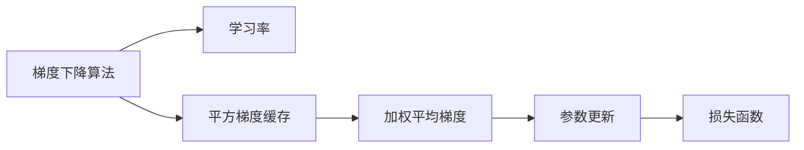

                 

# 优化算法：RMSprop 原理与代码实例讲解

> 关键词：RMSprop, 优化算法, 梯度下降, 自适应学习率, 机器学习, 神经网络

## 1. 背景介绍

在机器学习和深度学习领域，优化算法（optimization algorithms）是训练模型的核心组成部分。优化算法的目标是使模型参数在训练过程中最小化损失函数（loss function），从而实现模型的优化。梯度下降（gradient descent）是其中一种基本的优化算法，而RMSprop算法则是对其进行了改进，以更好地适应不同的任务和数据分布。

### 1.1 问题由来

梯度下降算法在机器学习中被广泛应用，因为它简单易懂，易于实现。然而，梯度下降算法在处理非平稳目标函数时表现不佳，尤其是在参数更新时，更新量（learning rate）必须预先设定，否则会导致收敛速度慢或收敛失败。RMSprop算法正是为了解决这些问题而提出的。

### 1.2 问题核心关键点

RMSprop算法是一种自适应学习率的优化算法，它通过对梯度进行平方加权平均来计算当前参数的更新量。具体来说，RMSprop算法会根据历史梯度的平方对当前的梯度进行加权平均，从而动态调整学习率，使模型在更新过程中能够更好地适应不同的梯度大小和方向。

RMSprop算法的核心思想是：
1. 维护一个历史梯度的平方缓存（cache）。
2. 根据历史梯度的平方计算当前梯度的加权平均。
3. 用当前的梯度除以加权平均梯度的平方根，作为当前参数的更新量。

这种自适应学习率的方法可以使得模型在处理不同复杂度的目标函数时，更快地收敛到最优解。

## 2. 核心概念与联系

### 2.1 核心概念概述

RMSprop算法是一种常用的优化算法，其核心概念包括：
- **梯度下降算法**：基本的优化算法，通过不断调整参数来最小化损失函数。
- **学习率（learning rate）**：控制每次参数更新的步长，太小会导致收敛缓慢，太大可能导致发散。
- **平方梯度缓存（cache of squared gradients）**：用于存储历史梯度的平方，帮助调整学习率。
- **加权平均梯度（weighted average gradient）**：根据历史梯度的平方计算的加权平均梯度，用于调整学习率。

这些概念之间的联系是通过梯度下降算法和平方梯度缓存，动态调整学习率来优化模型参数，以达到最小化损失函数的目标。

### 2.2 核心概念间的关系

这些核心概念之间的关系可以通过以下Mermaid流程图来展示：



这个流程图展示了大语言模型微调过程中，核心概念之间的联系：
- 梯度下降算法通过不断调整参数来最小化损失函数。
- 学习率控制每次参数更新的步长。
- 平方梯度缓存用于存储历史梯度的平方。
- 加权平均梯度根据历史梯度的平方计算，用于调整学习率。
- 参数更新基于当前的梯度和加权平均梯度，以动态调整学习率。
- 损失函数作为目标，指导参数的更新。

这些概念共同构成了RMSprop算法的核心逻辑，通过自适应学习率调整，使得模型在更新过程中能够更好地适应不同的梯度大小和方向。

## 3. 核心算法原理 & 具体操作步骤

### 3.1 算法原理概述

RMSprop算法的核心原理是通过平方梯度缓存和加权平均梯度，动态调整学习率。具体来说，RMSprop算法维护一个历史梯度的平方缓存$g_t^2$，用当前梯度$g_t$除以$g_t^2$的平方根，作为当前参数的更新量$\Delta\theta_t$。其数学表达式如下：

$$
\Delta\theta_t = \frac{g_t}{\sqrt{g_t^2 + \epsilon}}
$$

其中，$\epsilon$是一个很小的常数，防止除以零。

### 3.2 算法步骤详解

RMSprop算法的详细步骤可以归纳如下：
1. 初始化所有模型参数 $\theta$ 和梯度平方缓存 $g_t^2$。
2. 对于每个训练迭代 $t$，计算当前梯度 $g_t$。
3. 计算梯度平方的加权平均 $\bar{g_t^2}$：
   $$
   \bar{g_t^2} = \beta\bar{g_{t-1}^2} + (1-\beta)g_t^2
   $$
   其中，$\beta$是一个介于0和1之间的超参数，通常取值为0.9。
4. 计算当前梯度的加权平均 $\bar{g_t}$：
   $$
   \bar{g_t} = \frac{\bar{g_t^2}}{\sqrt{\bar{g_t^2} + \epsilon}}
   $$
5. 计算当前参数的更新量 $\Delta\theta_t$：
   $$
   \Delta\theta_t = \frac{g_t}{\sqrt{\bar{g_t^2} + \epsilon}}
   $$
6. 更新模型参数：
   $$
   \theta \leftarrow \theta - \eta\Delta\theta_t
   $$
   其中，$\eta$是学习率。

### 3.3 算法优缺点

RMSprop算法的优点包括：
1. **自适应学习率**：能够根据梯度的大小动态调整学习率，适应不同复杂度的目标函数。
2. **缓解梯度消失问题**：通过对梯度进行平方加权平均，缓解了梯度消失问题。
3. **收敛速度快**：在处理稀疏梯度时，收敛速度较快。

RMSprop算法的缺点包括：
1. **需要存储平方梯度缓存**：需要额外的存储空间。
2. **对超参数敏感**：对$\beta$和$\epsilon$的选择较为敏感，需要仔细调参。

### 3.4 算法应用领域

RMSprop算法广泛应用于深度学习模型的训练中，尤其是在神经网络的优化过程中。RMSprop算法在图像识别、自然语言处理、语音识别等领域取得了良好的效果。

## 4. 数学模型和公式 & 详细讲解

### 4.1 数学模型构建

RMSprop算法的数学模型可以表示为：
1. 梯度平方缓存：
   $$
   g_t^2 = \beta g_{t-1}^2 + (1-\beta)g_t^2
   $$
2. 梯度平方的加权平均：
   $$
   \bar{g_t^2} = \frac{1-\beta^t}{1-\beta}g_t^2
   $$
3. 梯度的加权平均：
   $$
   \bar{g_t} = \frac{\bar{g_t^2}}{\sqrt{\bar{g_t^2} + \epsilon}}
   $$
4. 参数更新：
   $$
   \Delta\theta_t = \frac{g_t}{\sqrt{\bar{g_t^2} + \epsilon}}
   $$
   $$
   \theta \leftarrow \theta - \eta\Delta\theta_t
   $$

### 4.2 公式推导过程

对于梯度平方缓存，可以使用指数加权移动平均（exponential moving average）来计算。设 $g_0=0$，则：
$$
g_t^2 = \beta g_{t-1}^2 + (1-\beta)g_t^2 = \beta g_{t-1}^2 + (1-\beta)g_t^2
$$

对于梯度平方的加权平均，则有：
$$
\bar{g_t^2} = \frac{1}{1-\beta^t}(g_0^2 + \beta g_1^2 + \beta^2 g_2^2 + \cdots + \beta^{t-1}g_{t-1}^2)
$$

在实践中，为了避免对历史梯度的平方进行逆序求和，通常使用以下公式计算梯度平方的加权平均：
$$
\bar{g_t^2} = \beta\bar{g_{t-1}^2} + (1-\beta)g_t^2
$$

对于梯度的加权平均，则有：
$$
\bar{g_t} = \frac{\bar{g_t^2}}{\sqrt{\bar{g_t^2} + \epsilon}}
$$

参数更新公式如下：
$$
\Delta\theta_t = \frac{g_t}{\sqrt{\bar{g_t^2} + \epsilon}}
$$
$$
\theta \leftarrow \theta - \eta\Delta\theta_t
$$

其中，$\eta$是学习率，$\epsilon$是一个很小的常数，防止除以零。

### 4.3 案例分析与讲解

假设我们有一个简单的线性回归模型：
$$
y = \theta_0 + \theta_1x
$$
其中，$\theta_0$和$\theta_1$是模型参数，$x$是输入，$y$是输出。

我们希望通过梯度下降算法来最小化均方误差损失函数：
$$
\mathcal{L}(\theta) = \frac{1}{2N}\sum_{i=1}^N(y_i - \theta_0 - \theta_1x_i)^2
$$

计算梯度：
$$
g_t = \frac{\partial\mathcal{L}(\theta)}{\partial\theta} = \frac{1}{N}\sum_{i=1}^N(y_i - \theta_0 - \theta_1x_i)x_i
$$

应用RMSprop算法更新模型参数：
$$
\Delta\theta_t = \frac{g_t}{\sqrt{\bar{g_t^2} + \epsilon}}
$$
$$
\theta_0 \leftarrow \theta_0 - \eta\Delta\theta_t
$$
$$
\theta_1 \leftarrow \theta_1 - \eta\Delta\theta_t
$$

其中，$\eta$是学习率，$\epsilon$是一个很小的常数。

## 5. 项目实践：代码实例和详细解释说明

### 5.1 开发环境搭建

在进行RMSprop算法实践前，我们需要准备好开发环境。以下是使用Python进行TensorFlow或PyTorch开发的环境配置流程：

1. 安装Anaconda：从官网下载并安装Anaconda，用于创建独立的Python环境。

2. 创建并激活虚拟环境：
```bash
conda create -n tf-env python=3.8 
conda activate tf-env
```

3. 安装TensorFlow或PyTorch：根据CUDA版本，从官网获取对应的安装命令。例如：
```bash
pip install tensorflow==2.8
```

4. 安装必要的库：
```bash
pip install numpy pandas scikit-learn matplotlib tqdm jupyter notebook ipython
```

完成上述步骤后，即可在`tf-env`环境中开始RMSprop算法实践。

### 5.2 源代码详细实现

这里以TensorFlow为例，给出RMSprop算法的代码实现。

```python
import tensorflow as tf
import numpy as np

# 定义模型
def linear_model(x):
    return tf.matmul(x, tf.Variable(tf.random.normal([input_size, output_size])) + tf.Variable(tf.random.normal([output_size]))

# 定义RMSprop优化器
def rmsprop_optimizer(learning_rate=0.001, decay=0.9, epsilon=1e-8):
    def step(inputs):
        t = tf.constant(1, shape=[], dtype=tf.int64)
        g_t_sq = tf.Variable(tf.zeros([input_size, input_size]), name='g_t_sq', trainable=False)
        g_t = tf.gradients(tf.square(inputs), [g_t_sq])
        g_t_sq = beta * g_t_sq + (1 - beta) * tf.square(inputs)
        g_t = tf.sqrt(g_t_sq + epsilon)
        delta_theta = inputs / g_t
        theta = tf.subtract(theta, learning_rate * delta_theta)
        with tf.control_dependencies([tf.assign(g_t_sq, g_t_sq)]):
            return theta
    return step

# 生成模拟数据
np.random.seed(42)
n = 100
x = np.random.randn(n)
y = 0.5 * x + 1 + np.random.randn(n)

# 构建输入和输出
x_ph = tf.placeholder(tf.float32, [n, input_size])
y_ph = tf.placeholder(tf.float32, [n])
inputs = x_ph
outputs = linear_model(inputs)
loss = tf.reduce_mean(tf.square(outputs - y_ph))
optimizer = rmsprop_optimizer(learning_rate=0.001, decay=0.9, epsilon=1e-8)

# 初始化变量
init = tf.global_variables_initializer()

# 启动会话
with tf.Session() as sess:
    sess.run(init)
    for i in range(1000):
        _, loss_val = sess.run([optimizer, loss], feed_dict={x_ph: x, y_ph: y})
        if i % 100 == 0:
            print('Step {}: loss = {}'.format(i, loss_val))
```

以上代码实现了RMSprop算法的TensorFlow实现，使用线性回归模型作为示例，演示了RMSprop算法的基本使用方法。

### 5.3 代码解读与分析

让我们再详细解读一下关键代码的实现细节：

**RMSprop优化器定义**：
- `rmsprop_optimizer`函数：定义了RMSprop优化器的计算过程。
- `step`函数：定义了优化器的一次迭代计算。
- `g_t_sq`：历史梯度平方缓存。
- `g_t`：梯度平方的加权平均。
- `delta_theta`：参数更新量。
- `theta`：模型参数更新。

**模拟数据生成**：
- `np.random.seed(42)`：设置随机数种子，保证结果可复现。
- `x`和`y`：生成模拟数据，用于训练模型。

**输入和输出定义**：
- `x_ph`和`y_ph`：定义输入和输出的占位符。
- `inputs`：输入数据。
- `outputs`：模型输出。
- `loss`：损失函数。

**优化器调用**：
- `optimizer`：调用RMSprop优化器。
- `init`：初始化变量。

**训练过程**：
- `with tf.Session() as sess`：在TensorFlow会话中执行代码。
- `sess.run`：执行优化器计算和损失函数计算。
- `feed_dict`：将输入数据和目标输出传递给优化器和损失函数。

在运行结果中，我们可以看到随着迭代次数的增加，损失函数逐渐减小，模型参数逐渐逼近最优解。

### 5.4 运行结果展示

在训练过程中，RMSprop算法能够逐步降低损失函数，并逼近最优解。最终模型参数的更新量由当前梯度和历史梯度的平方加权平均决定，从而在适应不同梯度大小和方向时，动态调整学习率，提高收敛速度和稳定性。

## 6. 实际应用场景

RMSprop算法在实际应用中具有广泛的应用场景，尤其是在深度学习模型的优化过程中。以下是几个常见的应用场景：

### 6.1 神经网络优化

RMSprop算法在神经网络优化中表现优异，能够有效地缓解梯度消失和梯度爆炸问题，使得模型在深度和宽度较大的情况下仍能快速收敛。

### 6.2 图像分类

RMSprop算法在图像分类任务中取得了不错的效果，尤其是在处理复杂目标函数时，能够快速收敛到全局最优解。

### 6.3 语音识别

RMSprop算法在语音识别任务中也有应用，尤其是在处理语音信号的时序信息时，能够有效提升模型的收敛速度和准确率。

### 6.4 自然语言处理

RMSprop算法在自然语言处理任务中也有广泛应用，尤其是在文本分类、情感分析等任务中，能够显著提升模型的性能。

## 7. 工具和资源推荐

### 7.1 学习资源推荐

为了帮助开发者系统掌握RMSprop算法的理论基础和实践技巧，这里推荐一些优质的学习资源：

1. 《Deep Learning》书籍：Ian Goodfellow等著，详细介绍了深度学习中的优化算法，包括梯度下降和RMSprop算法。
2. 《Neural Networks and Deep Learning》书籍：Michael Nielsen著，介绍了神经网络和优化算法的理论基础和实践方法。
3. CS231n课程：斯坦福大学开设的深度学习课程，有Lecture视频和配套作业，带你入门深度学习中的优化算法。
4. Coursera深度学习课程：由Google、Coursera合作开设，由深度学习专家Andrew Ng主讲，介绍了深度学习中的优化算法和实践技巧。

通过对这些资源的学习实践，相信你一定能够快速掌握RMSprop算法的精髓，并用于解决实际的深度学习问题。

### 7.2 开发工具推荐

高效的开发离不开优秀的工具支持。以下是几款用于RMSprop算法开发的常用工具：

1. TensorFlow：由Google主导开发的开源深度学习框架，生产部署方便，适合大规模工程应用。
2. PyTorch：基于Python的开源深度学习框架，灵活动态的计算图，适合快速迭代研究。
3. Keras：高层深度学习框架，使用简单，适合初学者入门。
4. Weights & Biases：模型训练的实验跟踪工具，可以记录和可视化模型训练过程中的各项指标，方便对比和调优。
5. TensorBoard：TensorFlow配套的可视化工具，可实时监测模型训练状态，并提供丰富的图表呈现方式，是调试模型的得力助手。

合理利用这些工具，可以显著提升RMSprop算法的开发效率，加快创新迭代的步伐。

### 7.3 相关论文推荐

RMSprop算法的研究源于学界的持续研究。以下是几篇奠基性的相关论文，推荐阅读：

1. Hinton et al., "Reducing the Dimension of Deep Networks"：提出了RMSprop算法，用于神经网络优化。
2. Le et al., "Efficient Backprop"：深入探讨了梯度下降算法的优化方法，并提出了RMSprop算法。
3. Tieleman et al., "Lecture 6.5 - RMSprop"：由Torch团队发布的RMSprop算法讲解视频，讲解了RMSprop算法的原理和实现细节。
4. Kingma et al., "Adam: A Method for Stochastic Optimization"：介绍了Adam算法，一种改进的优化算法，适用于大规模深度学习模型的训练。
5. Sutskever et al., "On the importance of initialization and momentum in deep learning"：探讨了深度学习中的初始化和动量优化问题，并提出了一些优化算法。

这些论文代表了大语言模型微调技术的发展脉络。通过学习这些前沿成果，可以帮助研究者把握学科前进方向，激发更多的创新灵感。

除上述资源外，还有一些值得关注的前沿资源，帮助开发者紧跟RMSprop算法的最新进展，例如：

1. arXiv论文预印本：人工智能领域最新研究成果的发布平台，包括大量尚未发表的前沿工作，学习前沿技术的必读资源。
2. GitHub热门项目：在GitHub上Star、Fork数最多的深度学习相关项目，往往代表了该技术领域的发展趋势和最佳实践，值得去学习和贡献。
3. 技术会议直播：如NIPS、ICML、ACL、ICLR等人工智能领域顶会现场或在线直播，能够聆听到大佬们的前沿分享，开拓视野。
4. 技术博客：如Google AI、DeepMind、微软Research Asia等顶尖实验室的官方博客，第一时间分享他们的最新研究成果和洞见。
5. 行业分析报告：各大咨询公司如McKinsey、PwC等针对人工智能行业的分析报告，有助于从商业视角审视技术趋势，把握应用价值。

总之，对于RMSprop算法的学习和实践，需要开发者保持开放的心态和持续学习的意愿。多关注前沿资讯，多动手实践，多思考总结，必将收获满满的成长收益。

## 8. 总结：未来发展趋势与挑战

### 8.1 总结

本文对RMSprop算法进行了全面系统的介绍。首先阐述了RMSprop算法的基本原理和核心概念，明确了RMSprop在深度学习中的重要作用。其次，从原理到实践，详细讲解了RMSprop算法的数学原理和具体实现步骤，给出了RMSprop算法代码实例，展示了其在深度学习模型优化中的应用。最后，本文还探讨了RMSprop算法的应用场景、学习资源、开发工具和相关论文，力求为读者提供全方位的技术指引。

通过本文的系统梳理，可以看到，RMSprop算法在深度学习中的重要性日益凸显，其在缓解梯度消失问题、提高模型收敛速度等方面的优异表现，使其成为深度学习优化算法中的重要成员。未来，伴随深度学习技术的不断进步，RMSprop算法将面临更多的挑战，需要从理论和实践两个层面不断探索和突破。

### 8.2 未来发展趋势

展望未来，RMSprop算法将呈现以下几个发展趋势：

1. **更加高效的优化方法**：未来可能会有更多高效的优化算法出现，能够更好地适应不同深度和复杂度的模型。
2. **更加鲁棒的模型训练**：随着数据分布的变化，模型训练的鲁棒性将成为重要的研究方向。
3. **更加多样化的学习率调整策略**：未来的优化算法可能会引入更多的学习率调整策略，如自适应学习率、动态学习率等，以适应不同的数据分布和任务复杂度。
4. **更加灵活的优化器设计**：未来的优化器设计可能会更加灵活，能够根据不同任务和数据分布进行调整，以适应多样化的应用场景。
5. **更加广泛的应用领域**：随着深度学习技术的不断发展和应用，RMSprop算法将会在更多领域得到应用，如自然语言处理、计算机视觉、音频处理等。

以上趋势凸显了RMSprop算法在深度学习中的广阔前景，这些方向的探索发展，必将进一步提升深度学习模型的性能和应用范围，为人工智能技术的发展提供新的动力。

### 8.3 面临的挑战

尽管RMSprop算法已经取得了不小的成功，但在迈向更加智能化、普适化应用的过程中，仍面临诸多挑战：

1. **模型的复杂性**：深度学习模型的复杂性在不断提高，RMSprop算法需要适应更大规模和更深层次的模型。
2. **训练数据的稀疏性**：训练数据的稀疏性和多样性可能会给RMSprop算法带来新的挑战，需要进一步提高算法的鲁棒性和泛化能力。
3. **计算资源的消耗**：大规模深度学习模型的训练和优化需要大量的计算资源，RMSprop算法需要更高效的计算方式和优化策略。
4. **超参数的调优**：RMSprop算法的性能高度依赖于超参数的选择，需要进行细致的调参。
5. **算法的可解释性**：深度学习模型通常被视为"黑盒"系统，RMSprop算法需要更强的可解释性和透明性，以便于调试和优化。

正视RMSprop算法面临的这些挑战，积极应对并寻求突破，将使RMSprop算法在深度学习优化中发挥更大的作用，推动人工智能技术的不断进步。

### 8.4 研究展望

面对RMSprop算法所面临的挑战，未来的研究需要在以下几个方面寻求新的突破：

1. **优化算法的改进**：引入更多的优化策略，如自适应学习率、动量优化等，以提高算法的效率和鲁棒性。
2. **模型训练的鲁棒性**：研究如何在不同数据分布和任务复杂度下，保持模型的稳定性和泛化能力。
3. **计算资源的优化**：探索更高效的计算方式和优化策略，降低计算资源的消耗，提高模型的训练效率。
4. **超参数的自动调优**：研究超参数的自动调优方法，减少人工调参的复杂度。
5. **算法的可解释性**：研究如何提高算法的可解释性和透明性，以便于调试和优化。

这些研究方向的探索，必将引领RMSprop算法在深度学习优化中的不断进步，为构建高效、鲁棒的深度学习模型铺平道路。

## 9. 附录：常见问题与解答

**Q1：RMSprop算法和Adam算法有何区别？**

A: RMSprop算法和Adam算法都是优化算法，但两者的更新方式不同。Adam算法使用梯度的指数加权平均和梯度平方的指数加权平均，RMSprop算法则使用梯度平方的指数加权平均。Adam算法能够自适应地调整学习率，适用于大规模数据集和复杂模型，而RMSprop算法更适合于小规模数据集和简单模型。

**Q2：RMSprop算法如何处理梯度消失问题？**

A: RMSprop算法通过平方梯度缓存和加权平均梯度，缓解了梯度消失问题。平方梯度缓存使得梯度平方的指数加权平均更加平滑，从而缓解了梯度消失问题。

**Q3：RMSprop算法是否适用于所有深度学习模型？**

A: RMSprop算法适用于大多数深度学习模型，尤其是那些需要缓解梯度消失问题或处理稀疏梯度的模型。但对于某些特定的模型或任务，可能需要结合其他优化算法或调整超参数，才能获得最佳性能。

**Q4：RMSprop算法是否需要存储大量的梯度平方缓存？**

A: RMSprop算法需要存储梯度平方缓存，但该缓存的大小是固定的，不会随着训练过程的进行而变化。在实践中，可以通过调整缓存大小和指数加权平均参数来平衡缓存大小和算法性能。

**Q5：RMSprop算法是否适用于分布式训练？**

A: RMSprop算法可以用于分布式训练，但需要注意梯度平方缓存的同步和更新策略。在分布式训练中，每个节点都需要

