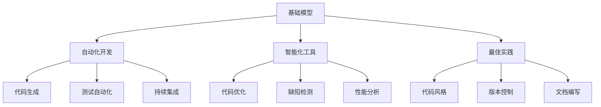
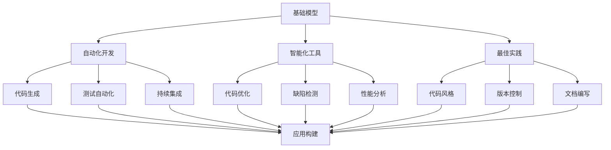

                 

# 使用基础模型构建应用程序的新书

> 关键词：基础模型, 应用程序构建, 编程, 自动化开发

## 1. 背景介绍

### 1.1 问题由来

在软件开发的实践中，构建一个高效、可靠的应用程序一直是一项复杂且繁琐的任务。它不仅要求开发人员具备丰富的编程经验和技巧，还需要对应用场景有深刻的理解。传统上，开发人员需要通过大量重复性的编码、测试和调试工作，来确保应用的正确性和稳定性。这种手工编码的模式不仅耗时耗力，还容易导致代码质量参差不齐，维护成本高昂。

为了应对这一挑战，近年来，软件工程界涌现出了一系列新方法、工具和框架。这些创新不仅提升了开发效率，也大大降低了出错率，使得应用程序的构建变得更加容易。本书旨在通过介绍这些新兴技术，帮助开发者迅速构建出功能完善、性能卓越的应用程序。

### 1.2 问题核心关键点

本书的核心主题是如何在不牺牲代码质量的前提下，通过自动化和智能化的手段，大幅提升应用程序的开发效率和可靠性。具体来说，本书聚焦于以下几个关键点：

- **基础模型**：介绍常见的编程语言、框架和库，以及它们在应用程序构建中的应用。
- **自动化开发**：讲述如何使用自动化测试、代码生成和持续集成等技术，减少手工编码工作量。
- **智能化工具**：探讨人工智能和大数据技术在代码优化、缺陷检测和性能分析中的应用。
- **最佳实践**：分享一些实用的开发策略和代码规范，帮助开发者养成良好的编码习惯。

这些关键点共同构成了一个全面的应用程序构建体系，旨在使开发工作更加高效、可控和可持续。

### 1.3 问题研究意义

在当前的软件开发领域，自动化和智能化技术已经成为不可忽视的趋势。它们不仅提高了开发效率，降低了出错风险，还推动了代码的重用和共享，为软件产业带来了革命性的变化。通过深入学习本书中的内容，开发者不仅能够掌握最新的技术动态，还能够迅速构建出高质量、高性能的应用程序。这不仅有助于个人职业发展，也为软件企业的技术创新和业务增长提供了有力支持。

## 2. 核心概念与联系

### 2.1 核心概念概述

要理解如何使用基础模型构建应用程序，首先需要明确几个核心概念：

- **基础模型**：指编程语言、框架和库等软件开发的基石。它们为开发者提供了高效的工具，帮助快速实现各种功能。
- **自动化开发**：指利用自动化工具和流程，自动完成代码生成、测试和部署等重复性工作，提升开发效率。
- **智能化工具**：指使用人工智能和大数据技术，辅助开发者进行代码优化、缺陷检测和性能分析，提高代码质量和可靠性。
- **最佳实践**：指在软件开发过程中遵循的一些通用规则和标准，如代码风格、版本控制、文档编写等，有助于提升代码的可维护性和可扩展性。

这些概念之间存在着密切的联系，共同构成了现代软件开发的核心框架。

### 2.2 概念间的关系

这些核心概念之间的逻辑关系可以通过以下Mermaid流程图来展示：



这个流程图展示了大语言模型微调过程中各个核心概念的关系和作用：

1. 基础模型提供了必要的工具和框架，为自动化开发和智能化工具的使用提供了前提。
2. 自动化开发利用基础模型，通过代码生成、测试和持续集成等技术，显著提高了开发效率。
3. 智能化工具结合基础模型，通过代码优化、缺陷检测和性能分析等手段，进一步提升了代码质量。
4. 最佳实践为开发过程中遵循的通用规则，确保代码的可维护性和可扩展性。

这些概念共同构成了现代软件开发的高效、可靠、可持续的实践体系。

### 2.3 核心概念的整体架构

最后，我们用一个综合的流程图来展示这些核心概念在大语言模型微调过程中的整体架构：



这个综合流程图展示了从基础模型到应用程序构建的完整过程。开发者可以使用基础模型提供的工具和框架，结合自动化开发、智能化工具和最佳实践，最终构建出高质量、高性能的应用程序。

## 3. 核心算法原理 & 具体操作步骤
### 3.1 算法原理概述

在本书中，我们将详细介绍如何使用基础模型构建应用程序的算法原理。这些算法通常涉及以下几个关键步骤：

1. **需求分析**：理解应用程序的功能需求，明确其核心模块和功能点。
2. **设计架构**：根据需求分析结果，设计应用程序的整体架构，选择合适的基础模型和技术栈。
3. **实现功能**：使用基础模型提供的工具和框架，实现应用程序的各个功能模块。
4. **测试优化**：通过自动化测试和智能化工具，确保代码的正确性和性能。
5. **部署上线**：使用持续集成工具，将应用程序部署到生产环境，并进行后续的维护和更新。

### 3.2 算法步骤详解

#### 3.2.1 需求分析

需求分析是应用程序构建的第一步，它要求开发者与用户或相关方深入交流，明确应用程序的功能需求。这一过程通常包括：

1. **功能需求**：确定应用程序需要实现的主要功能。例如，一个电商网站可能需要支持用户注册、商品展示、购物车管理等。
2. **非功能需求**：明确应用程序的性能、安全性、可扩展性等非功能要求。例如，电商网站需要保证在高峰时段不出现宕机，支持海量用户并发访问。
3. **用户体验**：了解用户的使用习惯和痛点，优化界面设计和用户体验。例如，电商网站需要设计简洁易用的界面，支持多设备访问。

需求分析的结果通常会形成文档，指导后续的架构设计和功能实现。

#### 3.2.2 设计架构

在明确需求后，下一步是设计应用程序的整体架构。这一步骤通常包括以下几个方面：

1. **技术栈选择**：根据需求和功能，选择合适的编程语言、框架和库。例如，前端可能使用React或Vue，后端可能使用Node.js或Django。
2. **模块划分**：将应用程序划分为多个模块，每个模块负责一个独立的功能。例如，电商网站可以划分为用户管理、商品管理、订单管理等模块。
3. **数据模型设计**：设计应用程序所需的数据模型，并选择合适的数据库系统。例如，电商网站需要设计用户、商品、订单等数据表，并选择合适的关系型数据库或NoSQL数据库。
4. **网络架构设计**：设计应用程序的网络架构，包括前端和后端的通信方式。例如，电商网站可以采用RESTful API进行通信，或使用WebSocket实现实时通信。

架构设计的结果通常会形成架构图和文档，指导后续的代码实现。

#### 3.2.3 实现功能

在架构设计完成后，下一步是使用基础模型提供的工具和框架，实现应用程序的各个功能模块。这一步骤通常包括以下几个方面：

1. **代码生成**：使用代码生成工具自动生成基础代码。例如，Django框架提供了一套代码生成器，可以自动生成数据模型和视图代码。
2. **功能开发**：根据架构设计，实现各个功能模块。例如，电商网站的商品管理模块需要实现商品添加、修改、删除等功能。
3. **接口测试**：编写自动化测试用例，确保功能模块的正确性。例如，电商网站的商品管理模块需要编写单元测试和集成测试用例，确保商品信息正确展示和操作。

功能开发和测试的结果通常会形成代码库和测试报告，确保应用程序的功能正确性。

#### 3.2.4 测试优化

在功能实现后，下一步是使用自动化测试和智能化工具，确保代码的正确性和性能。这一步骤通常包括以下几个方面：

1. **自动化测试**：使用自动化测试工具，如JUnit、TestNG等，编写和运行测试用例，确保代码的正确性。例如，电商网站的商品管理模块需要编写单元测试和集成测试用例，确保商品信息正确展示和操作。
2. **性能测试**：使用性能测试工具，如JMeter、LoadRunner等，测试应用程序的性能指标。例如，电商网站需要测试在高并发情况下的响应时间和系统稳定性。
3. **代码优化**：使用智能化工具，如SonarQube、PMD等，检测代码中的潜在问题和缺陷。例如，电商网站的代码中可能存在性能瓶颈或安全漏洞。
4. **缺陷检测**：使用静态分析工具，如FindBugs、CheckStyle等，检测代码中的语法和逻辑错误。例如，电商网站的代码中可能存在变量未初始化或方法未定义的问题。

测试优化的方法需要根据具体的应用场景和需求进行调整。

#### 3.2.5 部署上线

在测试优化完成后，最后一步是将应用程序部署到生产环境，并进行后续的维护和更新。这一步骤通常包括以下几个方面：

1. **持续集成**：使用持续集成工具，如Jenkins、GitLab CI等，自动化构建和部署应用程序。例如，电商网站可以每天自动构建和部署新代码，确保应用程序的及时更新。
2. **版本控制**：使用版本控制工具，如Git等，管理代码变更历史和分支。例如，电商网站可以建立分支进行新功能的开发和测试，确保代码的可追溯性和可回滚性。
3. **文档编写**：编写和维护应用程序的文档，包括需求文档、架构文档、代码注释等。例如，电商网站的代码中需要添加详细的注释，帮助开发人员理解和维护代码。
4. **性能监控**：使用监控工具，如ELK Stack、Prometheus等，实时监控应用程序的性能指标。例如，电商网站可以监控服务器的CPU、内存、网络等性能指标，确保系统的稳定性和可用性。

部署上线的结果通常会形成生产环境和监控系统，确保应用程序的可靠性和可扩展性。

### 3.3 算法优缺点

#### 3.3.1 优点

1. **效率提升**：自动化和智能化技术大大提高了应用程序的开发效率，减少了手工编码和测试的工作量。
2. **质量保障**：自动化测试和智能化工具确保了代码的正确性和性能，减少了人为错误和缺陷。
3. **一致性**：持续集成和版本控制保证了代码的一致性和可追溯性，便于团队协作和代码维护。
4. **灵活性**：基础模型和智能化工具提供了灵活的开发手段，支持多种技术和框架的选择和切换。

#### 3.3.2 缺点

1. **学习成本**：自动化和智能化技术需要一定的学习成本，开发者需要掌握新的工具和流程。
2. **复杂性**：复杂的自动化和智能化流程可能引入新的复杂性，需要开发者进行额外的调试和优化。
3. **依赖性**：自动化和智能化工具依赖于外部系统和环境，可能存在兼容性和稳定性问题。

这些优缺点需要开发者在使用过程中权衡考虑，选择最适合自身需求和团队情况的开发方法。

### 3.4 算法应用领域

本书中的算法原理和技术方法在多个领域都有广泛的应用，例如：

- **Web应用**：使用基础模型和框架，如Node.js、Django等，构建高质量的Web应用。
- **移动应用**：使用基础模型和框架，如React Native、Flutter等，构建跨平台移动应用。
- **桌面应用**：使用基础模型和框架，如Electron、Qt等，构建跨平台桌面应用。
- **服务器端应用**：使用基础模型和框架，如Node.js、Java等，构建高性能服务器端应用。
- **嵌入式应用**：使用基础模型和框架，如Arduino、MicroPython等，构建高效的嵌入式应用。

这些领域的应用不仅涉及具体的技术栈和框架，还包括需求分析、架构设计、功能实现、测试优化和部署上线等多个环节，涵盖了本书的核心算法原理。

## 4. 数学模型和公式 & 详细讲解  
### 4.1 数学模型构建

在本书中，我们主要关注如何利用基础模型构建应用程序的数学模型。假设应用程序的需求为$F$，架构为$A$，功能实现为$C$，测试优化为$T$，部署上线为$D$，则数学模型可以表示为：

$$
M = F \times A \times C \times T \times D
$$

其中，$F$表示需求分析过程，$A$表示架构设计过程，$C$表示功能实现过程，$T$表示测试优化过程，$D$表示部署上线过程。

### 4.2 公式推导过程

在具体的应用程序构建过程中，我们可以使用以下公式进行推导：

#### 4.2.1 需求分析

假设需求分析的结果为$D$，可以表示为：

$$
D = (f_1, f_2, ..., f_n)
$$

其中，$f_i$表示第$i$个功能需求。

#### 4.2.2 架构设计

假设架构设计的结果为$A$，可以表示为：

$$
A = (a_1, a_2, ..., a_m)
$$

其中，$a_j$表示第$j$个模块和数据模型。

#### 4.2.3 功能实现

假设功能实现的结果为$C$，可以表示为：

$$
C = (c_1, c_2, ..., c_k)
$$

其中，$c_i$表示第$i$个功能模块的代码实现。

#### 4.2.4 测试优化

假设测试优化的结果为$T$，可以表示为：

$$
T = (t_1, t_2, ..., t_p)
$$

其中，$t_j$表示第$j$个测试用例和性能指标。

#### 4.2.5 部署上线

假设部署上线的结果为$D$，可以表示为：

$$
D = (d_1, d_2, ..., d_q)
$$

其中，$d_i$表示第$i$个部署过程和监控指标。

### 4.3 案例分析与讲解

为了更好地理解这些数学模型和公式，我们可以通过一个实际案例进行详细讲解。

假设我们正在构建一个电商网站，其需求为支持用户注册、商品展示、购物车管理等。

1. **需求分析**：通过与用户和相关方交流，明确电商网站的需求为：用户注册、商品展示、购物车管理、订单处理等。

2. **架构设计**：根据需求，设计电商网站的架构为：前端使用React，后端使用Django，数据库使用MySQL。

3. **功能实现**：使用React和Django提供的工具和框架，实现电商网站的用户注册、商品展示、购物车管理等功能模块。

4. **测试优化**：编写自动化测试用例，使用性能测试工具和智能化工具，确保代码的正确性和性能。

5. **部署上线**：使用Jenkins进行持续集成和部署，使用ELK Stack进行性能监控。

通过这个案例，我们可以看到基础模型和算法原理在应用程序构建中的应用，以及各个步骤的数学模型和公式推导过程。

## 5. 项目实践：代码实例和详细解释说明
### 5.1 开发环境搭建

在进行应用程序构建之前，我们需要准备好开发环境。以下是使用Python进行Django开发的环境配置流程：

1. 安装Anaconda：从官网下载并安装Anaconda，用于创建独立的Python环境。

2. 创建并激活虚拟环境：
```bash
conda create -n django-env python=3.8 
conda activate django-env
```

3. 安装Django：根据操作系统和版本，从官网获取对应的安装命令。例如：
```bash
pip install django
```

4. 安装Django rest framework和Django-allauth等库：
```bash
pip install django-rest-framework django-allauth
```

5. 安装PostgreSQL数据库：
```bash
brew install postgresql
```

6. 配置Django项目：
```bash
django-admin startproject myproject
```

7. 配置数据库：
```python
DATABASES = {
    'default': {
        'ENGINE': 'django.db.backends.postgresql',
        'NAME': 'mydatabase',
        'USER': 'myuser',
        'PASSWORD': 'mypassword',
        'HOST': 'localhost',
        'PORT': '5432',
    }
}
```

完成上述步骤后，即可在`django-env`环境中开始应用程序构建。

### 5.2 源代码详细实现

下面我们以电商网站的用户注册功能为例，给出使用Django框架进行构建的PyTorch代码实现。

首先，定义用户模型：

```python
from django.db import models
from django.contrib.auth.models import AbstractUser

class User(AbstractUser):
    email = models.EmailField(unique=True)
```

然后，定义用户注册视图：

```python
from django.shortcuts import render, redirect
from django.contrib.auth.forms import UserCreationForm
from django.contrib.auth import login, authenticate

def register(request):
    if request.method == 'POST':
        form = UserCreationForm(request.POST)
        if form.is_valid():
            form.save()
            username = form.cleaned_data.get('username')
            raw_password = form.cleaned_data.get('password1')
            user = authenticate(username=username, password=raw_password)
            login(request, user)
            return redirect('home')
    else:
        form = UserCreationForm()
    return render(request, 'register.html', {'form': form})
```

最后，定义用户注册页面模板：

```html
<!DOCTYPE html>
<html>
<head>
    <title>Register</title>
</head>
<body>
    <h1>Register</h1>
    <form method="post">
        
        {{ form.as_p }}
        <button type="submit">Register</button>
    </form>
</body>
</html>
```

完成上述步骤后，即可在`myproject`项目中构建用户注册功能，并通过浏览器访问`/register`路径进行注册。

### 5.3 代码解读与分析

让我们再详细解读一下关键代码的实现细节：

**User模型**：
- 通过继承`AbstractUser`模型，我们定义了用户模型，并添加了`email`字段，用于存储用户的电子邮箱。

**register视图**：
- 定义了用户注册视图，通过`UserCreationForm`表单接收用户提交的注册信息，验证表单数据，并在表单验证通过后进行用户创建和登录。

**register页面模板**：
- 使用HTML模板定义了用户注册页面，通过`form`标签接收表单数据，并在提交按钮被点击时，发送POST请求到服务器端，进行用户注册。

**代码解读与分析**：
- 通过以上代码示例，我们可以看到Django框架提供的便捷工具和功能，大大简化了Web应用的开发过程。
- 开发者只需关注业务逻辑的实现，而无需关心底层的技术细节，如数据库连接、表单验证、页面渲染等。
- Django的ORM和模板引擎等功能，使开发者能够更专注于业务逻辑的实现，提高开发效率。

### 5.4 运行结果展示

假设我们在浏览器中访问`/register`路径，并提交了正确的注册信息，最终注册成功的用户将被重定向到`/home`路径。

我们可以通过访问`/home`路径，验证用户的注册信息是否正确，并进一步使用用户登录功能。

## 6. 实际应用场景
### 6.1 智能客服系统

智能客服系统是电子商务和在线服务行业中常见的应用场景。传统的客服系统依赖人工客服进行响应，效率低下且难以提供一致的服务。基于基础模型的智能客服系统，可以24小时不间断地提供服务，显著提升客户满意度。

在技术实现上，可以构建一个基于自然语言处理的智能客服系统，使用基础模型对客户问题进行理解，并生成合适的回答。例如，使用Django框架构建后端API，使用TensorFlow或PyTorch训练自然语言处理模型，通过API接收用户问题，并调用模型生成回答。

### 6.2 金融舆情监测

金融舆情监测是金融行业重要的应用场景。传统的舆情监测依赖人工筛选和分析，耗费大量人力且容易错过重要信息。基于基础模型的金融舆情监测系统，可以通过自然语言处理和情感分析等技术，实时监测和分析网络舆情，及时发现金融风险。

在技术实现上，可以构建一个基于自然语言处理的舆情监测系统，使用基础模型对网络文本进行情感分析和主题分类，并通过API接口提供舆情报告。例如，使用Django框架构建后端API，使用TensorFlow或PyTorch训练自然语言处理模型，通过API接收文本数据，并调用模型进行情感分析和主题分类，输出舆情报告。

### 6.3 个性化推荐系统

个性化推荐系统是电子商务和在线服务行业的重要应用。传统的推荐系统依赖用户历史行为数据进行推荐，难以捕捉用户的兴趣和偏好。基于基础模型的个性化推荐系统，可以通过自然语言处理和用户画像等技术，提供更精准的推荐结果。

在技术实现上，可以构建一个基于自然语言处理的推荐系统，使用基础模型对用户行为进行分析和建模，并通过API接口提供推荐结果。例如，使用Django框架构建后端API，使用TensorFlow或PyTorch训练自然语言处理模型，通过API接收用户行为数据，并调用模型进行分析和建模，输出推荐结果。

### 6.4 未来应用展望

随着基础模型的不断进步，基于基础模型的应用程序构建技术将会在更多领域得到应用，为各行各业带来变革性影响。

在智慧医疗领域，基于自然语言处理的智能医疗系统，可以通过分析医生的病历记录，提供辅助诊疗建议。例如，使用Django框架构建后端API，使用TensorFlow或PyTorch训练自然语言处理模型，通过API接收医生的病历记录，并调用模型进行分析和建模，输出辅助诊疗建议。

在智能教育领域，基于自然语言处理的智能教育系统，可以通过分析学生的学习数据，提供个性化的学习建议。例如，使用Django框架构建后端API，使用TensorFlow或PyTorch训练自然语言处理模型，通过API接收学生的学习数据，并调用模型进行分析和建模，输出个性化的学习建议。

在智慧城市治理中，基于自然语言处理的智能城市系统，可以通过分析市民的投诉和建议，提供智能决策支持。例如，使用Django框架构建后端API，使用TensorFlow或PyTorch训练自然语言处理模型，通过API接收市民的投诉和建议，并调用模型进行分析和建模，输出智能决策支持。

此外，在企业生产、社会治理、文娱传媒等众多领域，基于基础模型的应用程序构建技术也将不断涌现，为传统行业带来革命性的变革。相信随着技术的不断进步，基础模型在应用程序构建中的应用将越来越广泛，推动各行各业的技术创新和业务发展。

## 7. 工具和资源推荐
### 7.1 学习资源推荐

为了帮助开发者系统掌握基础模型构建应用程序的技术，这里推荐一些优质的学习资源：

1. 《Python编程：从入门到实践》系列博文：由知名Python开发者撰写，系统介绍了Python基础和高级编程技巧，适合初学者入门。

2. 《JavaScript权威指南》系列博文：由JavaScript社区专家撰写，深入讲解了JavaScript基础和高级特性，适合前端开发者学习。

3. 《Java编程思想》书籍：由Java大师撰写，全面介绍了Java语言的核心概念和编程技巧，适合Java开发者学习。

4. 《深入浅出Django》书籍：介绍了Django框架的基础和高级用法，适合Django开发者学习。

5. 《TensorFlow实战》书籍：介绍了TensorFlow框架的使用和高级技术，适合TensorFlow开发者学习。

6. 《Kubernetes入门》书籍：介绍了Kubernetes容器编排技术的原理和实践，适合云计算开发者学习。

通过对这些资源的学习实践，相信你一定能够迅速掌握基础模型构建应用程序的技术，并应用于实际开发中。

### 7.2 开发工具推荐

高效的开发离不开优秀的工具支持。以下是几款用于基础模型构建应用程序开发的常用工具：

1. PyCharm：一款功能强大的Python开发工具，集成了代码高亮、自动补全、调试等功能，适合Python开发者使用。

2. Visual Studio Code：一款轻量级的代码编辑器，支持多种编程语言和扩展，适合所有编程开发者使用。

3. Git：一款分布式版本控制系统，支持代码版本管理、分支合并等操作，适合团队协作开发。

4. Docker：一款容器化技术，支持应用打包、部署和分发，适合云计算开发者使用。

5. Jenkins：一款开源的持续集成工具，支持自动化构建、测试和部署，适合所有应用开发者使用。

6. Prometheus：一款开源的监控系统，支持应用性能监控、告警等功能，适合应用开发者使用。

合理利用这些工具，可以显著提升基础模型构建应用程序的开发效率，加快创新迭代的步伐。

### 7.3 相关论文推荐

基础模型和应用程序构建技术的发展源于学界的持续研究。以下是几篇奠基性的相关论文，推荐阅读：

1. TensorFlow：Google开发的开源深度学习框架，适合大规模深度学习项目的开发和部署。

2. Django：Python社区维护的开源Web框架，支持快速开发和部署Web应用。

3. React：Facebook开发的开源前端框架，支持构建高质量的Web应用。

4. Docker：Docker公司开发的开源容器化技术，支持应用打包和部署。

5. Kubernetes：Google开发的开源容器编排系统，支持容器化的应用部署和调度。

这些论文代表了基础模型和应用程序构建技术的发展脉络。通过学习这些前沿成果，可以帮助研究者把握学科前进方向，激发更多的创新灵感。

除上述资源外，还有一些值得关注的前沿资源，帮助开发者紧跟基础模型构建技术的发展趋势，

