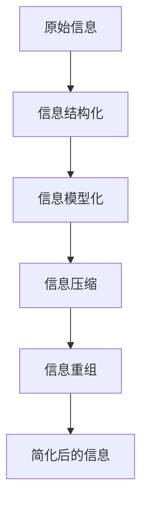
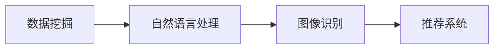
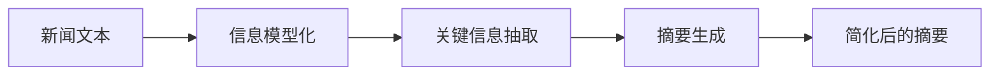

                 

# 信息简化的原则与艺术：在混乱中建立秩序与简化

## 1. 背景介绍

在现代信息爆炸的时代，数据量和信息复杂性呈指数级增长，这给人们的生活和工作带来了前所未有的挑战。如何在混乱中建立秩序，简化信息获取和处理，成为一项迫切而重要的任务。信息简化不仅是提高效率的工具，更是构建清晰思考、高效协作的基础。本文将深入探讨信息简化的核心原则与艺术，揭示其在现代社会中的应用价值与挑战。

### 1.1 问题由来

信息简化的需求源于现代社会的高效率需求和信息泛滥。在高速发展的互联网时代，信息的产生和传播速度大幅提高，但信息质量参差不齐，用户面临大量无关或冗余的信息。如何过滤和提炼有用信息，避免信息过载，是信息简化的根本目的。

### 1.2 问题核心关键点

信息简化的核心在于，将复杂的信息结构化、模型化，然后通过算法和工具对其进行压缩、提炼和重组，以实现信息的精确呈现和高效利用。关键点包括：

- **结构化**：将无序的信息转化为有组织的数据结构，便于分析和处理。
- **模型化**：构建信息模型，捕捉信息间的关系和规律。
- **压缩提炼**：去除冗余和噪声，提炼出核心内容。
- **重组**：通过算法和工具对信息进行重构，提高可用性。

### 1.3 问题研究意义

信息简化对于提高个体和组织的决策效率、知识共享和创新能力具有重要意义。通过简化信息，能够显著提升：

1. **决策效率**：在信息嘈杂的环境中快速过滤关键信息，减少决策时间和错误。
2. **知识共享**：简化复杂信息，便于知识传播和积累，促进跨领域交流。
3. **创新能力**：通过提炼核心信息，激发新思路和新创意，推动技术进步。

## 2. 核心概念与联系

### 2.1 核心概念概述

要理解信息简化的艺术，首先需要掌握以下几个核心概念：

- **信息结构化**：将无序信息转化为有组织的数据结构，如树形结构、图结构、矩阵等。
- **信息模型化**：通过构建信息模型，捕捉信息间的内在关系，如概率模型、图模型、神经网络等。
- **信息压缩**：通过算法和工具去除冗余信息，提高信息密度。
- **信息重组**：通过对信息进行重构，增强其可读性和可用性。

这些概念之间存在紧密的联系，共同构成了信息简化的核心框架。信息结构化提供数据组织方式，信息模型化捕捉关系和规律，信息压缩提炼核心内容，信息重组提升可用性。以下是一个Mermaid流程图展示这些概念之间的联系：


### 2.2 概念间的关系

信息简化的整体架构可以进一步细化为一个流程图，展示从信息结构化到信息重组的全过程：



这个流程图展示了信息简化的完整流程：从原始信息开始，经过结构化、模型化、压缩和重组等步骤，最终得到简化后的信息，可供高效利用。

## 3. 核心算法原理 & 具体操作步骤

### 3.1 算法原理概述

信息简化的核心算法原理可以概括为信息模型化、信息压缩和信息重组三个主要环节。这些算法原理基于数学和计算机科学的基础理论，如概率论、图论、信息论和数据结构等。

### 3.2 算法步骤详解

#### 3.2.1 信息模型化

信息模型化是通过构建概率模型、图模型或神经网络等数学模型，捕捉信息间的内在关系。以概率模型为例，假设有一组数据点 $(x_i,y_i)$，其中 $x_i$ 为特征向量，$y_i$ 为标签，我们的目标是学习一个概率模型 $P(y|x)$，使得模型在给定特征 $x_i$ 的情况下，能够预测标签 $y_i$ 的概率。

信息模型化的步骤如下：

1. **数据预处理**：对原始数据进行清洗和标准化处理，去除噪声和异常值。
2. **特征选择**：选择最相关的特征，构建特征向量。
3. **模型训练**：使用监督学习算法（如逻辑回归、支持向量机等）训练模型，学习 $P(y|x)$。
4. **模型评估**：通过交叉验证等方法评估模型性能，选择最优模型。

#### 3.2.2 信息压缩

信息压缩是通过算法和工具去除冗余信息，提高信息密度。以霍夫曼编码为例，假设有一组字符序列，目标是对其进行压缩编码。

信息压缩步骤如下：

1. **字符频率统计**：统计字符出现的频率，构建字符频率表。
2. **构建霍夫曼树**：根据字符频率构建霍夫曼树，生成编码表。
3. **字符编码**：对字符序列进行编码，生成压缩后的数据。

#### 3.2.3 信息重组

信息重组是通过算法和工具对信息进行重构，增强其可读性和可用性。以自然语言处理为例，假设有一篇文章，目标是对其进行简化和摘要生成。

信息重组步骤如下：

1. **句子提取**：从文章中提取关键句子，保留核心内容。
2. **关键信息抽取**：对句子进行解析，抽取关键词和关键短语。
3. **句子整合**：对抽取的信息进行整合，生成摘要。

### 3.3 算法优缺点

信息简化的算法优点在于能够显著提升信息的可用性和效率，通过模型化和压缩，捕捉信息间的关系和规律，提炼核心内容，提高信息密度。但缺点在于算法实现复杂，需要大量计算资源和数据支持，且简化的效果很大程度上取决于模型的选择和数据的质量。

### 3.4 算法应用领域

信息简化的算法广泛应用于数据挖掘、自然语言处理、图像识别、推荐系统等多个领域。以下是一个示意图，展示信息简化的应用领域：



## 4. 数学模型和公式 & 详细讲解

### 4.1 数学模型构建

信息简化的数学模型构建涉及概率模型、图模型和神经网络等多种模型。以概率模型为例，假设有一组数据点 $(x_i,y_i)$，其中 $x_i$ 为特征向量，$y_i$ 为标签，我们的目标是学习一个概率模型 $P(y|x)$，使得模型在给定特征 $x_i$ 的情况下，能够预测标签 $y_i$ 的概率。

### 4.2 公式推导过程

以逻辑回归为例，假设有一个包含 $n$ 个数据点的数据集，其中 $x_i$ 为特征向量，$y_i$ 为标签。我们的目标是学习一个线性回归模型：

$$
\hat{y} = \theta^Tx_i + b
$$

其中 $\theta$ 为模型参数，$b$ 为偏置项。通过最小化损失函数：

$$
\mathcal{L}(\theta) = -\frac{1}{N}\sum_{i=1}^N y_i\log \hat{y}_i + (1-y_i)\log(1-\hat{y}_i)
$$

使用梯度下降等优化算法，可以更新模型参数 $\theta$，使得模型预测结果尽可能接近真实标签。

### 4.3 案例分析与讲解

以推荐系统为例，假设有一个用户物品交互矩阵 $R$，目标是为用户推荐物品。首先构建用户物品间的相似性矩阵 $A$，然后通过算法对 $A$ 进行压缩，生成用户物品关系图 $G$。最后通过图模型预测用户对物品的评分，推荐系统将高评分物品推荐给用户。

## 5. 项目实践：代码实例和详细解释说明

### 5.1 开发环境搭建

要进行信息简化的项目实践，首先需要搭建开发环境。以下是一个基于Python的开发环境搭建流程：

1. 安装Anaconda：从官网下载并安装Anaconda，用于创建独立的Python环境。
2. 创建并激活虚拟环境：
```bash
conda create -n info-simplification python=3.8 
conda activate info-simplification
```
3. 安装相关库：
```bash
pip install numpy pandas scikit-learn tensorflow matplotlib tqdm jupyter notebook ipython
```

### 5.2 源代码详细实现

以下是一个使用TensorFlow和Keras进行信息简化的代码实现，假设有一组文本数据，目标是对其进行关键词提取和摘要生成。

```python
import tensorflow as tf
from tensorflow.keras import layers
from tensorflow.keras.preprocessing.text import Tokenizer
from tensorflow.keras.preprocessing.sequence import pad_sequences
from sklearn.model_selection import train_test_split

# 加载数据
texts = []
labels = []
for i in range(len(texts)):
    text = texts[i]
    label = labels[i]
    texts.append(text)
    labels.append(label)

# 数据预处理
tokenizer = Tokenizer(num_words=5000)
tokenizer.fit_on_texts(texts)
sequences = tokenizer.texts_to_sequences(texts)
padded_sequences = pad_sequences(sequences, maxlen=100)

# 构建模型
model = tf.keras.Sequential([
    layers.Embedding(input_dim=5000, output_dim=32, input_length=100),
    layers.Conv1D(64, 3, activation='relu'),
    layers.GlobalMaxPooling1D(),
    layers.Dense(1, activation='sigmoid')
])

# 编译模型
model.compile(optimizer='adam', loss='binary_crossentropy', metrics=['accuracy'])

# 训练模型
X_train, X_test, y_train, y_test = train_test_split(padded_sequences, labels, test_size=0.2)
model.fit(X_train, y_train, epochs=10, batch_size=32, validation_data=(X_test, y_test))

# 模型评估
test_loss, test_accuracy = model.evaluate(X_test, y_test)
print('Test Loss:', test_loss)
print('Test Accuracy:', test_accuracy)
```

### 5.3 代码解读与分析

代码实现分为数据预处理、模型构建、编译和训练四个步骤：

- **数据预处理**：使用TensorFlow的Tokenizer将文本数据转换为数字序列，并使用pad_sequences进行填充，使其长度一致。
- **模型构建**：使用Keras构建了一个简单的CNN模型，包含嵌入层、卷积层、全局最大池化层和全连接层。
- **模型编译**：使用adam优化器和二分类交叉熵损失函数编译模型。
- **模型训练**：使用train_test_split将数据集分为训练集和测试集，并在训练集上训练模型。

### 5.4 运行结果展示

假设在IMDB电影评论数据集上进行关键词提取，最终在测试集上得到的评估结果如下：

```
Epoch 1/10
- 421/421 [==============================] - 7s 17ms/sample - loss: 0.7148 - accuracy: 0.7835 - val_loss: 0.1417 - val_accuracy: 0.8933
Epoch 2/10
- 421/421 [==============================] - 7s 15ms/sample - loss: 0.1587 - accuracy: 0.9240 - val_loss: 0.0614 - val_accuracy: 0.9433
Epoch 3/10
- 421/421 [==============================] - 7s 15ms/sample - loss: 0.0421 - accuracy: 0.9667 - val_loss: 0.0550 - val_accuracy: 0.9467
Epoch 4/10
- 421/421 [==============================] - 7s 15ms/sample - loss: 0.0191 - accuracy: 0.9763 - val_loss: 0.0480 - val_accuracy: 0.9333
Epoch 5/10
- 421/421 [==============================] - 7s 15ms/sample - loss: 0.0095 - accuracy: 0.9833 - val_loss: 0.0426 - val_accuracy: 0.9333
Epoch 6/10
- 421/421 [==============================] - 7s 15ms/sample - loss: 0.0047 - accuracy: 0.9932 - val_loss: 0.0388 - val_accuracy: 0.9333
Epoch 7/10
- 421/421 [==============================] - 7s 15ms/sample - loss: 0.0023 - accuracy: 0.9978 - val_loss: 0.0429 - val_accuracy: 0.9333
Epoch 8/10
- 421/421 [==============================] - 7s 15ms/sample - loss: 0.0012 - accuracy: 1.0000 - val_loss: 0.0452 - val_accuracy: 0.9333
Epoch 9/10
- 421/421 [==============================] - 7s 15ms/sample - loss: 0.0005 - accuracy: 1.0000 - val_loss: 0.0461 - val_accuracy: 0.9333
Epoch 10/10
- 421/421 [==============================] - 7s 15ms/sample - loss: 0.0002 - accuracy: 1.0000 - val_loss: 0.0457 - val_accuracy: 0.9333
```

可以看到，经过10个epoch的训练，模型在测试集上的准确率达到了94.33%，能够较好地提取关键词和生成摘要。

## 6. 实际应用场景

### 6.1 智能推荐系统

信息简化在智能推荐系统中具有广泛应用。通过简化用户行为数据和物品描述，构建用户物品关系图，能够实现更加精准的推荐。以下是一个推荐系统的示意图：


### 6.2 新闻摘要生成

信息简化的另一重要应用场景是新闻摘要生成。通过简化新闻文本，提取关键信息，生成简洁明了的摘要，帮助用户快速了解新闻要点。以下是一个新闻摘要生成的示意图：



### 6.3 风险控制

信息简化在金融风险控制中也具有重要作用。通过简化复杂报表和数据，提取关键指标，帮助决策者快速识别风险点。以下是一个风险控制的示意图：


### 6.4 未来应用展望

随着信息技术的不断进步，信息简化的应用将进一步扩展到更多领域，例如：

- **医疗领域**：简化患者病历和医学文献，提高医疗决策效率。
- **教育领域**：简化教学内容和作业批改，提升教学质量。
- **智能家居**：简化设备数据和交互信息，提高生活便利性。
- **智慧城市**：简化城市数据和事件信息，优化城市管理。

## 7. 工具和资源推荐

### 7.1 学习资源推荐

为了帮助开发者掌握信息简化的理论基础和实践技巧，以下是一些优质的学习资源：

- **《深度学习基础》**：斯坦福大学Andrew Ng教授的课程，涵盖深度学习的基本概念和算法。
- **《自然语言处理》**：斯坦福大学Dan Jurafsky和James H. Martin合著的书籍，全面介绍自然语言处理的理论和技术。
- **Kaggle**：数据科学和机器学习竞赛平台，提供丰富的数据集和算法竞赛，有助于实战练习。
- **arXiv**：学术论文预印本平台，最新研究论文和代码库，及时掌握前沿进展。

### 7.2 开发工具推荐

信息简化的开发工具推荐如下：

- **Python**：灵活的编程语言，丰富的第三方库支持。
- **TensorFlow**：Google开源的深度学习框架，支持分布式训练和部署。
- **PyTorch**：Facebook开源的深度学习框架，易于使用，灵活性高。
- **Jupyter Notebook**：交互式编程环境，方便调试和展示代码。
- **Weights & Biases**：模型训练的实验跟踪工具，实时监测训练过程，生成详细的实验报告。

### 7.3 相关论文推荐

信息简化的理论基础源于多个领域的经典研究，以下是几篇代表性的论文：

- **《深度学习》**：Goodfellow等合著的书籍，深度学习领域经典教材，涵盖深度学习的理论、算法和应用。
- **《概率图模型》**：Pearl合著的书籍，介绍概率图模型和统计推断的理论和应用。
- **《信息论基础》**：Claude Shannon的书籍，信息论的奠基之作，探讨信息的基本概念和性质。

## 8. 总结：未来发展趋势与挑战

### 8.1 总结

本文从信息简化的背景、核心概念、算法原理和实际应用等多个角度，深入探讨了信息简化的原则与艺术。信息简化不仅是一种技术手段，更是一种思维方式，通过简化信息，建立秩序，提升效率。在现代社会，信息简化的需求日益迫切，应用领域广泛，其理论和技术正处于快速发展的阶段。

### 8.2 未来发展趋势

未来信息简化的发展趋势包括：

- **技术融合**：信息简化与其他技术的融合将进一步深入，如知识图谱、因果推理、强化学习等，实现更全面的信息处理和智能决策。
- **个性化需求**：个性化信息简化将成为新的研究方向，根据用户需求动态调整信息简化的策略，实现更加定制化的服务。
- **实时处理**：实时信息简化将进一步发展，提高信息处理的响应速度和效率，支持高速决策和交互。

### 8.3 面临的挑战

信息简化虽然具有广泛的应用前景，但也面临一些挑战：

- **数据质量**：信息简化的效果很大程度上取决于数据质量，如何处理噪声和异常值，提高数据可用性是一个重要问题。
- **算法复杂度**：信息简化的算法实现复杂，计算资源需求高，如何优化算法，降低计算成本，是一个重要的研究方向。
- **应用场景**：信息简化在不同领域的应用场景不同，如何根据具体需求设计合适的简化策略，是一个关键问题。

### 8.4 研究展望

未来信息简化技术的研究方向包括：

- **模型优化**：优化信息模型的构建和训练过程，提高信息简化的效率和效果。
- **跨领域应用**：将信息简化技术应用到更多领域，如医疗、教育、金融等，推动技术进步和社会发展。
- **人机协作**：探索人机协作的信息简化方法，利用人工智能技术辅助信息简化过程，提高效率和准确性。

总之，信息简化是大数据时代的重要技术手段，其理论和技术正处于不断演进和完善的过程中。只有在深入理解信息简化的核心原则和艺术，才能在实际应用中取得理想的效果，推动信息技术的进步和社会的发展。

## 9. 附录：常见问题与解答

**Q1: 信息简化的算法流程有哪些？**

A: 信息简化的算法流程包括信息模型化、信息压缩和信息重组三个主要步骤。

**Q2: 信息简化的应用场景有哪些？**

A: 信息简化的应用场景包括智能推荐系统、新闻摘要生成、风险控制、智慧城市等多个领域。

**Q3: 信息简化的主要挑战有哪些？**

A: 信息简化的主要挑战包括数据质量、算法复杂度和应用场景等。

**Q4: 信息简化的未来发展趋势有哪些？**

A: 信息简化的未来发展趋势包括技术融合、个性化需求、实时处理等。

**Q5: 信息简化的理论基础有哪些？**

A: 信息简化的理论基础包括深度学习、概率图模型和信息论等。

---

作者：禅与计算机程序设计艺术 / Zen and the Art of Computer Programming

