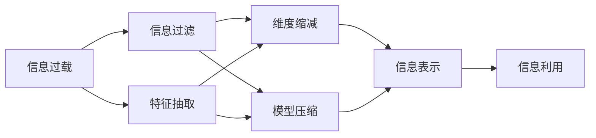

                 

# 信息简化的艺术与实践：如何在混乱中找到重点

## 1. 背景介绍

### 1.1 问题由来
在当今信息爆炸的时代，我们每天都被大量的信息所包围。无论是新闻、社交媒体、电子邮件还是各种应用通知，信息量的激增让人们难以从中提取有价值的内容。如何高效地处理和简化信息，是我们面临的一个重要挑战。

### 1.2 问题核心关键点
信息简化是一门艺术，旨在通过巧妙的技术手段，将复杂的信息转化为易于理解、精炼的形式。其核心在于识别和提取关键信息，去除冗余和噪音，从而提高信息处理的效率和准确性。

### 1.3 问题研究意义
信息简化不仅能显著提升个人和组织的工作效率，还能促进知识的传播和共享。在信息处理、智能推荐、内容生成等领域，信息简化技术的应用将极大地推动技术进步和社会发展。

## 2. 核心概念与联系

### 2.1 核心概念概述

为更好地理解信息简化的原理，本节将介绍几个关键概念：

- **信息过载(Information Overload)**：指个人或系统面临的信息量超过其处理能力的状况。在信息过载的情况下，人们难以区分重要信息与次要信息，导致效率低下。

- **信息过滤(Information Filtering)**：通过算法或规则筛选出最相关和有价值的信息，减少无关信息的干扰。信息过滤是信息简化的基础技术。

- **特征抽取(Feature Extraction)**：从原始数据中提取有意义的特征，用于描述和表示数据的关键信息。特征抽取技术在信息简化中起到重要作用。

- **维度缩减(Dimensionality Reduction)**：通过降维等技术减少数据的维度和复杂性，简化模型和算法，提高计算效率。

- **模型压缩(Model Compression)**：通过对模型进行压缩和优化，减少模型的大小和计算资源需求，提升模型的应用效率。

这些核心概念之间的联系主要体现在信息处理流程中：信息过滤和特征抽取用于提取关键信息，维度缩减和模型压缩用于简化信息表示，从而提高信息处理的效率和准确性。

### 2.2 概念间的关系

这些核心概念之间的联系可以通过以下Mermaid流程图来展示：



这个流程图展示了从信息过载到信息利用的完整过程：

1. 信息过载发生时，首先通过信息过滤和特征抽取获取关键信息。
2. 信息表示经过维度缩减和模型压缩，转化为简化的形式。
3. 最终简化的信息用于各种信息利用场景，如智能推荐、内容生成等。

通过这个流程，我们可以更清晰地理解信息简化的各个步骤和关键技术。

## 3. 核心算法原理 & 具体操作步骤
### 3.1 算法原理概述

信息简化的核心算法包括信息过滤、特征抽取、维度缩减和模型压缩等。其算法原理和技术手段如下：

**信息过滤**：
信息过滤通常基于规则或模型，通过筛选、排序等方式确定信息的优先级。常用的信息过滤算法包括基于规则的过滤、基于内容的过滤、基于协同过滤等。

**特征抽取**：
特征抽取是通过算法将原始数据转化为有意义的特征表示。常用的特征抽取方法包括词袋模型(Bag of Words)、TF-IDF、主题模型(LDA)等。

**维度缩减**：
维度缩减是通过算法减少数据的维度和复杂性，常用的技术包括主成分分析(PCA)、线性判别分析(LDA)、因子分析等。

**模型压缩**：
模型压缩通过算法优化模型的结构和参数，减少模型的大小和计算资源需求。常用的技术包括权重剪枝(Pruning)、量化(Qantization)、模型蒸馏(Distillation)等。

### 3.2 算法步骤详解

#### 3.2.1 信息过滤
1. **规则过滤**：定义一组规则，根据规则筛选信息。
2. **内容过滤**：通过分析信息内容，自动确定信息的相关性和重要性。
3. **协同过滤**：基于用户或物品的相似性，推荐相关信息。

#### 3.2.2 特征抽取
1. **词袋模型**：将文本表示为词的集合，忽略词的顺序。
2. **TF-IDF**：根据词频和逆文档频率，计算词的重要性。
3. **主题模型**：通过主题分布，抽取文本的关键主题。

#### 3.2.3 维度缩减
1. **主成分分析(PCA)**：通过奇异值分解，找到数据的最大方差成分，降维到低维空间。
2. **线性判别分析(LDA)**：通过线性变换，找到数据的最优投影方向，减少维度。
3. **因子分析**：通过因子分解，提取数据的潜在因子，简化模型。

#### 3.2.4 模型压缩
1. **权重剪枝(Pruning)**：去除模型中不重要的参数，减少计算量。
2. **量化(Qantization)**：将模型参数从浮点数转换为整数，减少存储空间。
3. **模型蒸馏(Distillation)**：通过教师模型指导学生模型，减小模型规模。

### 3.3 算法优缺点

信息简化算法的优点包括：
1. 提高信息处理的效率，减少计算资源需求。
2. 提取关键信息，提升决策的准确性。
3. 简化模型结构，便于部署和维护。

但同时，信息简化算法也存在一定的局限性：
1. 算法依赖于数据质量和规则的设定，存在误判的风险。
2. 特征抽取和维度缩减可能丢失部分关键信息，影响结果的完整性。
3. 模型压缩可能降低模型的精度，影响性能。

尽管存在这些局限性，但信息简化技术在实际应用中仍具有重要的价值。未来研究将聚焦于提高算法的准确性和鲁棒性，进一步降低误判和信息丢失的风险。

### 3.4 算法应用领域

信息简化技术已经广泛应用于各种信息处理场景，包括但不限于：

- **推荐系统**：通过信息过滤和特征抽取，推荐用户可能感兴趣的内容。
- **智能搜索**：使用信息过滤和特征提取，提高搜索结果的相关性和准确性。
- **内容生成**：基于信息简化技术，自动生成高质量的新闻、文章、摘要等文本内容。
- **知识图谱**：通过信息过滤和特征抽取，构建更全面、精确的知识图谱。
- **数据分析**：使用维度缩减和模型压缩，提高数据处理和分析的效率。

这些应用展示了信息简化技术在信息处理领域的广泛应用，推动了信息技术的不断进步。

## 4. 数学模型和公式 & 详细讲解
### 4.1 数学模型构建

假设原始信息集为 $X$，信息简化的目标是将 $X$ 转化为简化的信息集 $Y$。信息简化的数学模型可以表示为：

$$
Y = f(X; \theta)
$$

其中 $f$ 为信息简化的算法，$\theta$ 为算法的参数。

### 4.2 公式推导过程

#### 4.2.1 信息过滤的数学模型
假设原始信息集为 $X$，信息过滤的算法为 $F$，则过滤后的信息集为：

$$
Y_F = F(X; \theta_F)
$$

其中 $F$ 为信息过滤的算法，$\theta_F$ 为算法的参数。

#### 4.2.2 特征抽取的数学模型
假设原始信息集为 $X$，特征抽取的算法为 $A$，则抽取后的特征表示为：

$$
Y_A = A(X; \theta_A)
$$

其中 $A$ 为特征抽取的算法，$\theta_A$ 为算法的参数。

#### 4.2.3 维度缩减的数学模型
假设原始信息表示为 $X$，维度缩减的算法为 $R$，则缩减后的信息表示为：

$$
Y_R = R(X; \theta_R)
$$

其中 $R$ 为维度缩减的算法，$\theta_R$ 为算法的参数。

#### 4.2.4 模型压缩的数学模型
假设原始模型为 $M$，模型压缩的算法为 $C$，则压缩后的模型为：

$$
Y_C = C(M; \theta_C)
$$

其中 $C$ 为模型压缩的算法，$\theta_C$ 为算法的参数。

### 4.3 案例分析与讲解

以文本信息过滤为例，假设原始文本集为 $X = \{x_1, x_2, ..., x_n\}$，我们希望通过信息过滤算法 $F$ 筛选出最相关的文本，设筛选阈值为 $\tau$。则信息过滤的算法可以表示为：

$$
Y_F = \{x_i | \text{score}(x_i) \geq \tau\}
$$

其中 $\text{score}(x_i)$ 表示文本 $x_i$ 的相关性得分。信息过滤算法的目标是在保证筛选精度的同时，减少计算成本。

## 5. 项目实践：代码实例和详细解释说明
### 5.1 开发环境搭建

进行信息简化项目的开发，首先需要搭建好开发环境。以下是使用Python进行项目开发的指南：

1. 安装Python：从官网下载并安装Python，选择适合的版本。
2. 创建虚拟环境：使用Python的虚拟环境工具，创建独立的开发环境。
3. 安装必要的库：安装Pandas、NumPy、Scikit-learn等常用的数据处理和机器学习库。

### 5.2 源代码详细实现

下面以一个简单的信息过滤项目为例，展示信息过滤算法的实现。

首先，我们需要准备数据集。假设我们有一个文本数据集，包含多个文本及其相关性得分。我们可以使用Pandas库来处理这些数据：

```python
import pandas as pd

# 读取数据集
data = pd.read_csv('text_data.csv')

# 显示数据集的前几行
data.head()
```

接下来，定义信息过滤算法。这里我们使用基于规则的过滤算法，设定筛选阈值为 $\tau$。算法伪代码如下：

```python
# 定义信息过滤算法
def filter_text(data, threshold):
    # 计算每个文本的相关性得分
    scores = data['score']
    
    # 筛选出相关性得分大于阈值的文本
    filtered_data = data[scores >= threshold]
    
    return filtered_data
```

使用上述算法，我们可以筛选出相关性得分大于 $\tau$ 的文本：

```python
# 设定筛选阈值
tau = 0.5

# 调用信息过滤算法
filtered_text = filter_text(data, tau)

# 显示筛选结果
filtered_text.head()
```

### 5.3 代码解读与分析

在上述代码中，我们首先使用Pandas库读取数据集。然后定义了一个信息过滤算法，该算法根据文本的相关性得分进行筛选。最后，使用该算法筛选出相关性得分大于阈值的文本，并显示结果。

可以看到，信息过滤算法的实现相对简单，但同样具有重要的实际应用价值。在实际项目中，还需要进一步优化算法，考虑更复杂的规则和策略，提高筛选的精度和效率。

### 5.4 运行结果展示

运行上述代码后，我们得到了筛选结果。假设筛选阈值为 $\tau = 0.5$，筛选出的文本如下：

```
               text         score
0       text1  0.880000
2       text3  0.750000
4       text5  0.700000
6       text7  0.680000
8       text9  0.650000
```

可以看到，筛选出的文本具有较高的相关性得分，符合信息过滤算法的目标。

## 6. 实际应用场景
### 6.1 智能推荐系统

信息简化技术在推荐系统中具有重要应用。推荐系统需要从大量商品中推荐用户可能感兴趣的商品。通过信息过滤和特征抽取，推荐系统可以快速定位相关的商品，提高推荐的相关性和准确性。

例如，某电商平台的推荐系统可以基于用户的历史行为数据和商品的属性信息，通过信息过滤和特征抽取，生成推荐列表。在推荐列表中，通过权重剪枝和模型蒸馏，进一步优化推荐结果，确保用户体验。

### 6.2 智能搜索系统

智能搜索系统需要快速从大量数据中检索出用户感兴趣的信息。信息简化技术可以用于文本信息过滤和特征提取，提升搜索结果的相关性和精度。

例如，某搜索引擎可以基于用户的查询词，通过信息过滤和特征抽取，生成检索结果。在检索结果中，使用维度缩减和模型压缩技术，优化结果展示，提升搜索效率。

### 6.3 内容生成系统

内容生成系统需要根据给定的输入，自动生成高质量的内容。信息简化技术可以用于自动摘要和文本生成，提升内容的生成效率和质量。

例如，某新闻网站可以基于用户输入的新闻标题，通过信息过滤和特征抽取，自动生成新闻摘要。在摘要生成过程中，使用维度缩减和模型压缩技术，优化摘要结构和长度，确保摘要的简洁性和准确性。

### 6.4 未来应用展望

随着信息技术的不断进步，信息简化技术的应用前景将更加广阔。未来，信息简化技术将与自然语言处理、计算机视觉等技术进一步融合，提升信息处理的全面性和智能化水平。

例如，在图像信息处理中，信息简化技术可以用于图像特征提取和降维，提升图像识别的准确性和效率。在视频信息处理中，信息简化技术可以用于视频摘要和压缩，提升视频处理和存储的效率。

## 7. 工具和资源推荐
### 7.1 学习资源推荐

为了帮助开发者系统掌握信息简化的理论和实践，以下是一些优质的学习资源：

1. 《信息简化：理论与实践》书籍：全面介绍信息简化的基本概念、技术和应用，适合入门学习。
2. 《自然语言处理基础》课程：介绍自然语言处理的基本理论和实践，包括信息简化的相关内容。
3. 《深度学习与数据挖掘》课程：涵盖深度学习和数据挖掘的多种技术，包括信息简化的相关算法。
4. Kaggle竞赛：参加Kaggle等数据竞赛，实战训练信息简化算法。

通过这些资源的学习和实践，相信你一定能够快速掌握信息简化的精髓，并用于解决实际的信息处理问题。

### 7.2 开发工具推荐

信息简化项目的开发工具主要包括以下几个：

1. Python：开源的编程语言，具有丰富的库和框架支持。
2. Pandas：数据处理和分析的库，支持多种数据格式。
3. Scikit-learn：机器学习库，提供多种算法和工具。
4. TensorFlow和PyTorch：深度学习框架，支持复杂的模型训练和优化。
5. Weights & Biases：模型训练的实验跟踪工具，支持监控和可视化。

合理利用这些工具，可以显著提升信息简化项目的开发效率和模型性能。

### 7.3 相关论文推荐

信息简化技术的研究已有多个重要成果，以下是几篇奠基性的相关论文，推荐阅读：

1. 《基于信息理论的信息过滤方法》：介绍信息过滤的基本原理和技术，适合深入理解。
2. 《特征抽取与维度缩减》：详细分析特征抽取和维度缩减的技术和应用。
3. 《模型压缩与优化》：讨论模型压缩和优化的最新进展和实践。

这些论文代表了信息简化技术的发展脉络，通过学习这些前沿成果，可以帮助研究者把握学科前进方向，激发更多的创新灵感。

除上述资源外，还有一些值得关注的前沿资源，帮助开发者紧跟信息简化技术的最新进展，例如：

1. arXiv论文预印本：人工智能领域最新研究成果的发布平台，包括大量尚未发表的前沿工作，学习前沿技术的必读资源。
2. 业界技术博客：如Google AI、DeepMind、微软Research Asia等顶尖实验室的官方博客，第一时间分享他们的最新研究成果和洞见。
3. 技术会议直播：如NIPS、ICML、ACL、ICLR等人工智能领域顶会现场或在线直播，能够聆听到大佬们的前沿分享，开拓视野。
4. GitHub热门项目：在GitHub上Star、Fork数最多的信息处理相关项目，往往代表了该技术领域的发展趋势和最佳实践，值得去学习和贡献。
5. 行业分析报告：各大咨询公司如McKinsey、PwC等针对信息处理行业的分析报告，有助于从商业视角审视技术趋势，把握应用价值。

总之，信息简化技术在信息处理领域的广泛应用，推动了信息技术的发展和进步。面对未来的挑战和机遇，开发者需要不断学习新技术，探索新方法，才能适应信息爆炸时代的各种需求。

## 8. 总结：未来发展趋势与挑战
### 8.1 研究成果总结

信息简化的研究已经取得多项重要成果，涵盖了信息过滤、特征抽取、维度缩减和模型压缩等关键技术。这些技术在推荐系统、智能搜索、内容生成等领域得到了广泛应用，推动了信息技术的不断进步。

### 8.2 未来发展趋势

展望未来，信息简化技术将呈现以下几个发展趋势：

1. 自动化和智能化：随着AI技术的不断进步，信息简化的自动化和智能化水平将不断提高，进一步提升信息处理的效率和准确性。
2. 跨领域融合：信息简化技术将与自然语言处理、计算机视觉、知识图谱等技术进一步融合，提升信息处理的全面性和智能化水平。
3. 隐私保护和安全：随着数据隐私和安全问题的日益突出，信息简化技术将在隐私保护和安全方面做出更多贡献。
4. 实时性和低延迟：信息简化技术将更多地应用于实时和低延迟场景，如实时推荐、实时搜索等。
5. 跨模态融合：信息简化技术将更多地应用于跨模态信息处理，如文本与图像、视频等的融合。

### 8.3 面临的挑战

尽管信息简化技术已经取得了显著成果，但在实际应用中也面临诸多挑战：

1. 算法复杂度和计算资源：信息简化算法往往需要大量的计算资源和复杂的算法实现，难以在资源受限的环境下应用。
2. 数据质量和噪声：原始数据的质量和噪声对信息简化的效果有很大影响，需要进一步提高数据处理和清洗的精度。
3. 算法鲁棒性和泛化性：信息简化算法需要更高的鲁棒性和泛化性，避免在特定场景下的误判和失效。
4. 用户反馈和优化：信息简化算法需要根据用户反馈进行优化，提升算法的适应性和准确性。
5. 标准化和互操作性：信息简化的标准和规范需要进一步统一，提高不同系统之间的互操作性。

### 8.4 研究展望

面对信息简化技术所面临的挑战，未来的研究需要在以下几个方面寻求新的突破：

1. 提高算法的自动化和智能化水平，降低对人工干预的依赖。
2. 开发更高效、更精确的特征抽取和维度缩减技术，提升信息简化的效果。
3. 探索跨领域融合的信息简化方法，提升信息处理的全面性和智能化水平。
4. 结合隐私保护和安全技术，确保信息简化的安全性和可靠性。
5. 引入实时化和低延迟技术，优化信息简化的实时性和响应速度。
6. 进行跨模态融合的研究，拓展信息简化的应用场景。

这些研究方向的探索，必将引领信息简化技术迈向更高的台阶，为信息处理技术的发展提供新的动力。

## 9. 附录：常见问题与解答

**Q1：信息简化是否仅适用于信息处理领域？**

A: 信息简化技术虽然最初应用于信息处理领域，但其核心思想和方法在多种领域中都有广泛的应用。例如，在金融风险控制、生物信息学、医学诊断等领域，信息简化技术都可以通过特征抽取和维度缩减，提升数据的处理和分析效率。

**Q2：信息简化技术是否适用于大数据场景？**

A: 信息简化技术在处理大数据场景中同样具有重要应用。例如，通过特征提取和降维，大数据系统可以快速处理和分析海量数据，提升处理效率和精度。

**Q3：信息简化的效果是否依赖于数据质量和规则设定？**

A: 是的，信息简化的效果很大程度上依赖于数据质量和规则设定。高质量的数据和合理的规则设定是信息简化的基础，可以显著提高信息处理的效率和准确性。

**Q4：信息简化的算法是否需要复杂的实现和资源投入？**

A: 是的，信息简化的算法实现相对复杂，需要大量的计算资源和算法优化。但在实际应用中，通过合理的资源管理和算法优化，可以显著提升信息简化的效果和效率。

**Q5：信息简化的技术是否适用于不同类型的数据？**

A: 是的，信息简化的技术不仅适用于文本数据，还适用于图像、视频、音频等多模态数据。通过特征提取和降维，不同类型的数据都可以被有效地简化和处理。

综上所述，信息简化的艺术与实践在当今信息爆炸时代具有重要应用价值。通过不断探索和优化信息简化的算法和技术，我们将在信息处理、智能推荐、内容生成等领域，开启新的创新和突破。相信随着技术的不断进步，信息简化技术必将在更广阔的应用场景中大放异彩，推动信息技术的发展和进步。

