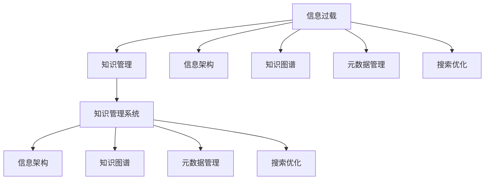
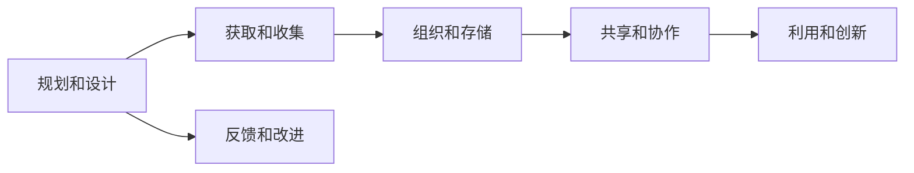
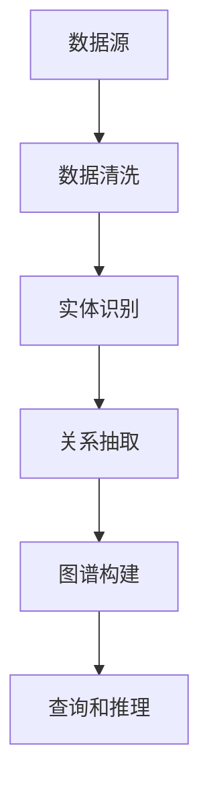
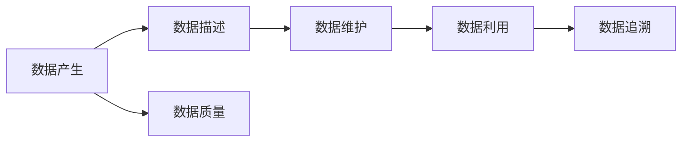
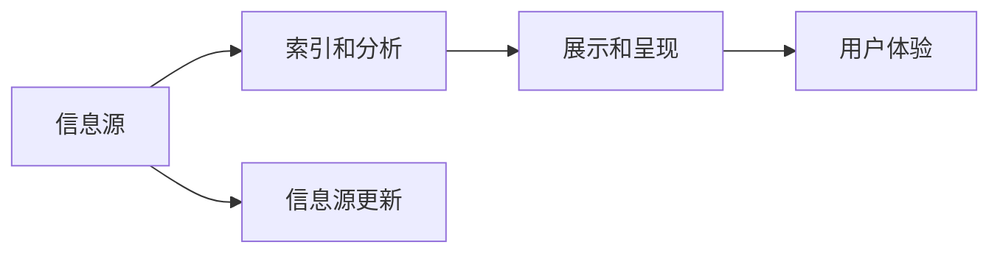
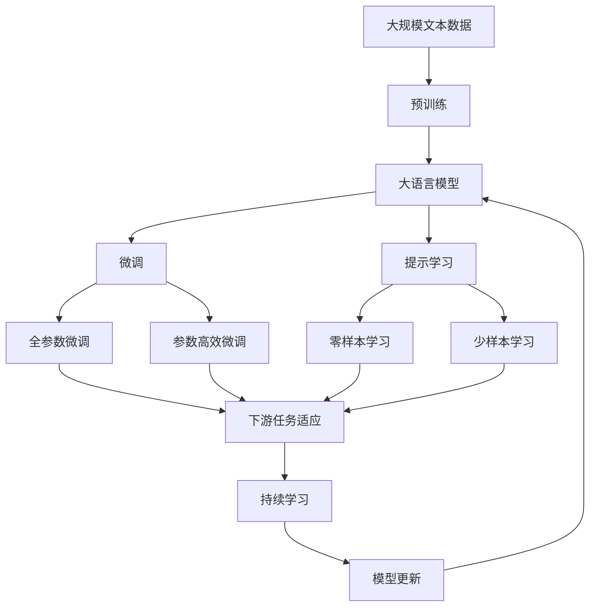

                 

# 信息过载与知识管理系统实施指南：管理和组织信息

> 关键词：信息过载,知识管理,系统实施,信息架构,知识图谱,元数据管理,搜索优化

## 1. 背景介绍

### 1.1 问题由来
随着信息技术的发展，信息获取、存储、处理和共享的方式发生了翻天覆地的变化。传统的纸质文件、纸质档案已经逐渐被电子文档、数据库、云存储所取代。在过去几十年间，企业积累了大量的文档、邮件、报告、项目文件等，这些信息资源成为了企业的宝贵资产。然而，随着信息量的爆炸式增长，信息过载成为了困扰企业的普遍问题。

### 1.2 问题核心关键点
信息过载指的是信息量过多，超出了人类和组织处理和分析的能力，导致信息的质量下降、决策困难、工作效率降低等一系列问题。其主要表现有：
- 文档数量巨大，无法有效检索和利用。
- 文档命名不规范，缺乏统一标准，导致信息难以归档和检索。
- 信息孤岛现象严重，各业务系统之间的数据无法互通，造成资源浪费。
- 信息质量参差不齐，错误和冗余信息混杂其中，难以甄别和修正。

这些问题的核心在于信息管理方式的滞后，传统的文档管理系统难以满足现代企业的需求，需要引入更先进的信息管理技术来解决这些问题。

## 2. 核心概念与联系

### 2.1 核心概念概述

为更好地理解信息过载及其解决方案，本节将介绍几个密切相关的核心概念：

- **信息过载（Information Overload）**：指信息量过多，超出了人类和组织处理和分析的能力，导致信息的质量下降、决策困难、工作效率降低等一系列问题。

- **知识管理（Knowledge Management）**：通过规划、创建、获取、组织、共享、集成和利用知识，使组织和个人能够更有效地利用知识和经验，提升决策质量和工作效率。

- **知识管理系统（Knowledge Management System, KMS）**：通过信息化手段实现知识管理的自动化、标准化和协作化，支持知识的收集、存储、检索、分享和应用，为组织提供知识服务。

- **信息架构（Information Architecture）**：对信息进行系统的规划、设计、组织和呈现，以实现信息的有序化、易用化和可访问性。

- **知识图谱（Knowledge Graph）**：一种语义化的知识表示方式，以图结构形式展现实体、属性和关系，支持复杂的查询和推理。

- **元数据管理（Metadata Management）**：对数据的基本描述信息和维护信息进行管理和利用，支持数据的完整性、一致性和可追溯性。

- **搜索优化（Search Optimization）**：通过对信息资源的索引、分析和展示，提高信息检索的准确性和效率，降低信息获取的难度和时间。

这些核心概念之间的逻辑关系可以通过以下Mermaid流程图来展示：



这个流程图展示了大语言模型微调过程中各个核心概念的关系和作用：

1. 信息过载是引发问题的本质，需要通过知识管理来解决。
2. 知识管理是一个系统性的过程，需要依托知识管理系统来实施。
3. 知识管理系统包括信息架构、知识图谱、元数据管理和搜索优化等多个方面，共同支持知识管理的实现。

### 2.2 概念间的关系

这些核心概念之间存在着紧密的联系，形成了知识管理的完整生态系统。下面我们通过几个Mermaid流程图来展示这些概念之间的关系。

#### 2.2.1 知识管理的过程



这个流程图展示了知识管理的基本流程：从规划设计开始，到获取收集、组织存储、共享协作，再到利用创新和反馈改进，形成了一个持续的闭环。

#### 2.2.2 知识图谱的构建



这个流程图展示了知识图谱构建的基本过程：从数据源开始，经过数据清洗、实体识别、关系抽取，最终构建出知识图谱，支持复杂的查询和推理。

#### 2.2.3 元数据管理的流程



这个流程图展示了元数据管理的全流程：从数据产生开始，经过数据描述、数据维护，再到数据利用和数据追溯，保障数据的质量和可追溯性。

#### 2.2.4 搜索优化的实现



这个流程图展示了搜索优化的全流程：从信息源开始，经过索引分析、展示呈现，再到用户体验和信息源更新，提升信息检索的准确性和效率。

### 2.3 核心概念的整体架构

最后，我们用一个综合的流程图来展示这些核心概念在大语言模型微调过程中的整体架构：



这个综合流程图展示了从预训练到微调，再到持续学习的完整过程。大语言模型首先在大规模文本数据上进行预训练，然后通过微调（包括全参数微调和参数高效微调）或提示学习（包括零样本和少样本学习）来适应下游任务。最后，通过持续学习技术，模型可以不断更新和适应新的任务和数据。 通过这些流程图，我们可以更清晰地理解信息过载问题解决过程中各个核心概念的关系和作用。

## 3. 核心算法原理 & 具体操作步骤

### 3.1 算法原理概述

知识管理系统的核心目标是实现信息的有序化、标准化和协作化，从而提升组织和个人的工作效率和决策质量。其基本原理是通过规划和设计信息架构、构建知识图谱、管理元数据、优化搜索，实现信息的有效管理和利用。

知识管理系统的核心算法包括：

- **信息架构设计**：通过对信息进行系统的规划和设计，实现信息的有序化和标准化。信息架构设计包括信息分类、命名规范、元数据标准等。
- **知识图谱构建**：通过语义化的方式将信息表示为实体、属性和关系，支持复杂的查询和推理。
- **元数据管理**：通过对数据的基本描述信息和维护信息进行管理和利用，保障数据的完整性、一致性和可追溯性。
- **搜索优化**：通过对信息资源的索引、分析和展示，提高信息检索的准确性和效率，降低信息获取的难度和时间。

这些算法共同构成了一个全面的知识管理系统，支持知识的收集、存储、检索、分享和应用，为组织和个人提供知识服务。

### 3.2 算法步骤详解

基于知识管理系统的核心算法，知识管理系统的实施步骤包括：

**Step 1: 信息架构设计**

- 设计信息分类体系，定义信息类别和子类别，明确信息内容。
- 制定信息命名规范，确保信息命名唯一且易于理解。
- 设计信息元数据标准，定义信息的基本属性和结构。

**Step 2: 知识图谱构建**

- 收集和清洗数据源，提取实体、属性和关系。
- 进行实体识别和关系抽取，构建知识图谱。
- 进行图谱验证和调整，确保知识图谱的准确性和完整性。

**Step 3: 元数据管理**

- 定义数据的基本描述信息，如数据来源、数据格式、数据更新频率等。
- 定义数据维护信息，如数据的创建者、修改者、修改时间等。
- 进行数据质量和可追溯性管理，确保数据的一致性和完整性。

**Step 4: 搜索优化**

- 设计信息索引方案，确保信息资源的有效索引。
- 设计信息展示方案，确保信息展示的清晰和易用。
- 优化信息检索算法，确保信息检索的准确性和效率。

**Step 5: 系统集成和应用**

- 将知识管理系统的各个模块进行集成，形成完整的知识管理系统。
- 对知识管理系统进行测试和优化，确保系统的稳定性和可用性。
- 将知识管理系统应用于实际业务场景，提升组织和个人的工作效率和决策质量。

### 3.3 算法优缺点

基于知识管理系统的核心算法，知识管理系统具有以下优点：

1. **系统性**：通过规划和设计信息架构、构建知识图谱、管理元数据、优化搜索，实现信息的全面管理和利用。
2. **标准化**：通过制定信息命名规范和元数据标准，确保信息的一致性和可追溯性。
3. **协作性**：支持信息的共享和协作，提升组织和个人的协同效率。
4. **灵活性**：支持信息的灵活管理和应用，适应不同的业务需求。

同时，知识管理系统也存在一些缺点：

1. **复杂性**：系统设计和管理过程复杂，需要专业知识和技能。
2. **成本高**：系统建设和维护需要较高的成本和资源投入。
3. **技术依赖**：系统实施依赖于先进的信息技术和工具，需要持续的技术支持和维护。
4. **灵活性不足**：系统的灵活性和适应性可能受限于架构设计，难以快速响应业务变化。

### 3.4 算法应用领域

基于知识管理系统的核心算法，知识管理系统已经在多个领域得到了广泛应用，包括但不限于：

- **企业信息化**：提升企业信息管理水平，支持企业的决策和运营。
- **政府信息化**：提升政府信息公开和共享水平，支持政府的决策和治理。
- **科研信息化**：提升科研信息的收集、管理和应用水平，支持科研工作的开展和创新。
- **教育信息化**：提升教育信息的收集、管理和应用水平，支持教育资源的共享和利用。
- **医疗信息化**：提升医疗信息的收集、管理和应用水平，支持医疗服务的提供和改进。

## 4. 数学模型和公式 & 详细讲解 & 举例说明

### 4.1 数学模型构建

为了更好地理解知识管理系统的实现，我们将通过数学模型来描述知识图谱的构建过程。

假设我们有一个知识图谱 $G=(V,E)$，其中 $V$ 为节点集，表示实体；$E$ 为边集，表示实体之间的关系。知识图谱的构建过程可以描述为：

- **数据收集和清洗**：从数据源中收集和清洗数据，提取实体、属性和关系。
- **实体识别**：通过自然语言处理技术，识别出文本中的实体。
- **关系抽取**：通过自然语言处理技术，抽取实体之间的关系。
- **图谱构建**：将实体和关系构成知识图谱。

知识图谱构建的数学模型可以描述为：

$$
G = \{ (v_1, v_2, e) \mid e = R(V_1, V_2) \land V_1 \in V \land V_2 \in V \}
$$

其中，$v_1$ 和 $v_2$ 为知识图谱中的节点，$e$ 为知识图谱中的边，$R$ 为关系函数。

### 4.2 公式推导过程

在知识图谱构建的过程中，实体识别和关系抽取是两个关键步骤。下面我们通过两个具体的例子，来详细解释这两个步骤的数学推导过程。

**例子1：实体识别**

假设我们有一段文本：“John Smith is a software engineer at Google.”，我们需要从中识别出实体“John Smith”和“Google”。

- **实体识别模型**：使用自然语言处理技术，将文本转化为实体序列。
- **实体序列**：将文本转化为词序列，并对每个词进行实体标注，判断其是否为实体。

假设文本中的每个词都通过词嵌入向量表示，那么实体识别的数学模型可以描述为：

$$
\text{Entity}_i = f(\text{Embedding}_i) \land \text{Label}_i = \{0,1\}
$$

其中，$\text{Embedding}_i$ 为第 $i$ 个词的词嵌入向量，$f$ 为实体识别模型，$\text{Label}_i$ 为实体标签，$0$ 表示非实体，$1$ 表示实体。

**例子2：关系抽取**

假设我们有一段文本：“John Smith is a software engineer at Google.”，我们需要从中抽取实体之间的关系“软件工程师”和“Google”。

- **关系抽取模型**：使用自然语言处理技术，将文本转化为关系序列。
- **关系序列**：将文本转化为词序列，并对每个词进行关系标注，判断其是否为关系。

假设文本中的每个词都通过词嵌入向量表示，那么关系抽取的数学模型可以描述为：

$$
\text{Relationship}_i = f(\text{Embedding}_i) \land \text{Label}_i = \{0,1\}
$$

其中，$\text{Embedding}_i$ 为第 $i$ 个词的词嵌入向量，$f$ 为关系抽取模型，$\text{Label}_i$ 为关系标签，$0$ 表示非关系，$1$ 表示关系。

### 4.3 案例分析与讲解

这里我们以医疗领域的知识图谱构建为例，详细讲解知识图谱的构建过程。

**案例背景**：
假设我们要构建一个医疗领域的知识图谱，以便支持医生的诊断和治疗工作。

**数据收集和清洗**：
- 从医疗数据库中收集和清洗数据，包括病人的病历、治疗方案、药品信息等。
- 提取实体和关系，如病人的姓名、病情、治疗方案等。

**实体识别**：
- 使用自然语言处理技术，对病历文本进行实体标注，识别出病人的姓名、病情、治疗方案等。
- 将实体转化为知识图谱中的节点。

**关系抽取**：
- 使用自然语言处理技术，对病历文本进行关系抽取，识别出病人和医生之间的关系、病人和病情之间的关系、病情和治疗方案之间的关系等。
- 将关系转化为知识图谱中的边。

**图谱构建**：
- 将实体和关系构成知识图谱，支持医生的诊断和治疗工作。

通过上述过程，我们可以构建一个医疗领域的知识图谱，支持医生的诊断和治疗工作。该知识图谱可以帮助医生快速查找病人的病历、治疗方案等信息，提升诊疗的效率和准确性。

## 5. 项目实践：代码实例和详细解释说明

### 5.1 开发环境搭建

在进行知识管理系统实施过程中，我们需要准备好开发环境。以下是使用Python进行知识管理系统开发的环境配置流程：

1. 安装Anaconda：从官网下载并安装Anaconda，用于创建独立的Python环境。

2. 创建并激活虚拟环境：
```bash
conda create -n kms-env python=3.8 
conda activate kms-env
```

3. 安装必要的Python包：
```bash
pip install pandas numpy matplotlib nltk spaCy py2neo graph-tool pyarrow pydantic 
```

4. 安装知识管理系统框架：
```bash
pip install django-elasticsearch-dsl-drf django-elasticsearch-dsl
```

完成上述步骤后，即可在`kms-env`环境中开始知识管理系统实施。

### 5.2 源代码详细实现

下面是一个简单的知识管理系统代码实现，使用Django框架构建。

**settings.py**

```python
INSTALLED_APPS = [
    'django_elasticsearch_dsl_drf',
    'django_elasticsearch_dsl',
    ...
]

Django_ELASTICSEARCH_DSL = {
    'BACKEND': 'elasticsearch_dsl_backends每天早上6:00自动备份你的DataBase及app

```


