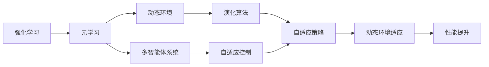
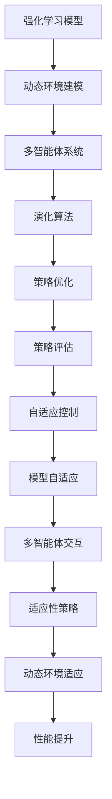

                 

# 元强化学习:适应复杂动态环境的AI

> 关键词：元强化学习,复杂动态环境,多智能体系统,自适应策略,模型自适应,演化算法,自适应控制

## 1. 背景介绍

### 1.1 问题由来

近年来，随着人工智能技术的飞速发展，强化学习（Reinforcement Learning, RL）在智能决策、机器人控制、游戏智能等领域得到了广泛应用，并取得了显著成果。然而，强化学习在处理复杂动态环境时存在诸多挑战，如不确定性、时变性、多任务等，使得其应用范围受到限制。元强化学习（Meta Reinforcement Learning, MRL）应运而生，通过学习如何在复杂环境中快速适应和优化策略，成为应对这些挑战的有效手段。

元强化学习结合了强化学习和元学习的思想，旨在让智能体能够在新的、未知环境中快速适应并取得优异性能。其核心在于：

1. **多智能体系统**：处理动态和复杂环境中的多任务、多智能体交互。
2. **自适应策略**：智能体能够根据环境变化自适应地调整策略。
3. **模型自适应**：通过模型学习动态环境特征，适应环境变化。
4. **演化算法**：使用遗传算法、进化策略等演化方法，加速策略优化。

### 1.2 问题核心关键点

元强化学习的核心在于能够快速适应复杂动态环境，其关键点包括：

- 环境建模与表示：如何准确建模动态环境，提取关键特征。
- 策略学习与优化：如何设计高效的学习策略，快速适应新环境。
- 策略迁移与泛化：如何利用先前的经验，迁移应用于新任务。
- 多智能体交互：如何处理多智能体之间的协调与冲突。
- 适应性与鲁棒性：如何在多种环境中保持策略的稳定性和鲁棒性。

这些关键点构成了元强化学习的基础，也是本文将要深入探讨的核心内容。

### 1.3 问题研究意义

元强化学习在处理复杂动态环境时具有重要意义：

1. **提高决策效率**：通过学习适应性策略，减少对环境的探索时间。
2. **增强鲁棒性**：能够在不同环境条件下保持稳定性能。
3. **扩展应用范围**：适应复杂、不确定性环境，如自动驾驶、金融预测等。
4. **推动AI技术进步**：促进强化学习和元学习的深度融合，推动AI技术的发展。

## 2. 核心概念与联系

### 2.1 核心概念概述

元强化学习涉及多个核心概念，包括：

- **强化学习**：智能体通过与环境的交互，学习最优决策策略的过程。
- **元学习**：通过学习如何快速适应新任务，加速模型训练和性能提升。
- **动态环境**：环境特征和规则随时间变化，难以准确建模。
- **多智能体系统**：多个智能体在环境中共存并相互影响。
- **演化算法**：基于自然进化过程，寻找最优策略。
- **自适应控制**：智能体根据环境变化自动调整策略。

这些概念构成了元强化学习的核心框架，通过这些概念的相互结合，智能体能够在复杂动态环境中实现高效的策略学习与优化。

### 2.2 概念间的关系

这些核心概念之间的关系可以通过以下Mermaid流程图来展示：



这个流程图展示了强化学习和元学习之间的关系，以及这些概念在元强化学习中的作用和联系。

### 2.3 核心概念的整体架构

最后，我们用一个综合的流程图来展示这些核心概念在大规模复杂动态环境中的整体架构：



这个综合流程图展示了从环境建模到策略优化，再到模型自适应和多智能体交互的全过程，为后续深入探讨奠定了基础。

## 3. 核心算法原理 & 具体操作步骤

### 3.1 算法原理概述

元强化学习的核心原理是在动态环境中通过元学习，快速适应和优化策略。其基本思想是：先通过强化学习获取基础策略，然后在新环境中快速调整和优化策略，以适应复杂动态环境。

具体而言，元强化学习可以分为以下几个步骤：

1. **环境建模与表示**：建立动态环境的数学模型，提取关键特征。
2. **策略学习与优化**：在基础策略上进行微调，学习适应新环境的策略。
3. **策略迁移与泛化**：利用先前的经验，迁移应用于新任务。
4. **多智能体交互**：处理多个智能体之间的协调与冲突。
5. **自适应控制**：根据环境变化自动调整策略。

### 3.2 算法步骤详解

以下是元强化学习的基本操作步骤：

**Step 1: 环境建模与表示**

在复杂动态环境中，首先需要建立环境的数学模型，提取关键特征。可以使用统计学习方法，如时间序列预测、马尔可夫决策过程（MDP）等，建立环境的数学表示。例如，在动态交通环境中，可以通过交通流、车辆速度、车道数量等变量，建立环境的数学模型。

**Step 2: 策略学习与优化**

在基础策略上进行微调，学习适应新环境的策略。可以使用强化学习算法，如Q-learning、策略梯度等，在动态环境中进行策略学习。例如，在交通控制系统中，可以通过仿真环境，训练智能体学习交通流控制策略，以优化交通流量。

**Step 3: 策略迁移与泛化**

利用先前的经验，迁移应用于新任务。可以使用迁移学习算法，如领域自适应、知识蒸馏等，在新环境中快速适应和优化策略。例如，在自动驾驶中，可以通过历史数据，迁移应用于新场景中的驾驶策略。

**Step 4: 多智能体交互**

处理多个智能体之间的协调与冲突。可以使用多智能体学习算法，如博弈论、分布式强化学习等，处理多个智能体之间的交互。例如，在多机器人协作中，可以通过多智能体学习算法，优化机器人之间的协调和决策。

**Step 5: 自适应控制**

根据环境变化自动调整策略。可以使用自适应控制算法，如自适应控制策略、演化算法等，根据环境变化自动调整策略。例如，在智能交通控制中，可以通过自适应控制算法，自动调整交通信号灯的周期和相位。

### 3.3 算法优缺点

元强化学习具有以下优点：

1. **快速适应复杂环境**：通过元学习，智能体能够快速适应复杂动态环境，缩短了适应时间。
2. **增强鲁棒性**：智能体在多种环境中保持稳定性能，提高了系统的鲁棒性。
3. **扩展应用范围**：适用于多种复杂、不确定性环境，如自动驾驶、金融预测等。

同时，元强化学习也存在以下缺点：

1. **计算复杂度高**：元强化学习需要大量的计算资源，特别是在大规模动态环境中。
2. **数据需求高**：元强化学习需要大量的数据进行环境建模和策略学习。
3. **策略优化难度大**：在复杂环境中，智能体需要自适应地调整策略，难度较大。
4. **模型可解释性不足**：元强化学习模型通常难以解释其决策过程，增加了理解和调试的难度。

### 3.4 算法应用领域

元强化学习已经在多个领域得到了应用，包括：

- **自动驾驶**：在动态交通环境中，智能车学习快速适应交通流变化，优化驾驶策略。
- **机器人控制**：在复杂工业环境中，机器人学习适应新任务和环境变化，提高自动化水平。
- **金融预测**：在动态市场中，智能投资系统学习适应市场变化，优化投资策略。
- **游戏智能**：在多玩家游戏中，智能体学习适应对手策略，优化游戏表现。

未来，元强化学习将在更多领域得到应用，推动人工智能技术的深度发展。

## 4. 数学模型和公式 & 详细讲解 & 举例说明

### 4.1 数学模型构建

元强化学习的数学模型可以表示为：

$$
\theta = \arg\min_\theta \mathcal{L}(\theta)
$$

其中，$\theta$ 为模型的参数，$\mathcal{L}$ 为损失函数。

在元强化学习中，损失函数通常包括两部分：策略学习损失和策略迁移损失。策略学习损失表示基础策略的优化，策略迁移损失表示在新环境中的策略泛化能力。

### 4.2 公式推导过程

以Q-learning算法为例，推导元强化学习的公式。

设智能体在环境状态 $s$ 下的行动 $a$ 与下一个状态 $s'$ 的概率为 $p(a,s'|s)$，奖励为 $r(s,a,s')$，则Q-learning算法的目标是最小化预测值与实际值的误差：

$$
\mathcal{L}(\theta) = \mathbb{E}_{(s,a,s',r) \sim D}[(r + \gamma \max_{a'} Q_{\theta}(s',a') - Q_{\theta}(s,a)]^2
$$

其中，$D$ 为环境状态和行动的分布，$\gamma$ 为折扣因子。

在元强化学习中，通过将Q-learning算法应用于基础策略，得到：

$$
Q_{\theta}(s,a) = \arg\min_\theta \mathbb{E}_{(s,a,s',r) \sim D}[(r + \gamma \max_{a'} Q_{\theta}(s',a') - Q_{\theta}(s,a)]^2
$$

然后，通过策略迁移算法，在新环境中更新策略：

$$
Q_{\theta}(s,a) = \arg\min_\theta \mathbb{E}_{(s,a,s',r) \sim D'}[(r + \gamma \max_{a'} Q_{\theta}(s',a') - Q_{\theta}(s,a)]^2
$$

其中，$D'$ 为新环境的状态和行动的分布。

### 4.3 案例分析与讲解

以自动驾驶为例，分析元强化学习的应用。

在自动驾驶中，智能车需要在动态交通环境中快速适应交通流变化，优化驾驶策略。可以通过元强化学习，在历史数据上学习基础驾驶策略，在新场景中快速调整策略，以适应新环境。

具体步骤如下：

1. **环境建模与表示**：建立交通流模型，提取关键特征，如车流量、车辆速度等。
2. **策略学习与优化**：在历史数据上训练Q-learning算法，优化驾驶策略。
3. **策略迁移与泛化**：在新场景中，使用策略迁移算法，快速适应新环境的交通流变化。
4. **多智能体交互**：处理多个智能体之间的协调与冲突，如与其他车辆、行人的交互。
5. **自适应控制**：根据交通流变化，自动调整驾驶策略，优化交通控制。

## 5. 项目实践：代码实例和详细解释说明

### 5.1 开发环境搭建

在进行元强化学习实践前，我们需要准备好开发环境。以下是使用Python进行PyTorch开发的环境配置流程：

1. 安装Anaconda：从官网下载并安装Anaconda，用于创建独立的Python环境。

2. 创建并激活虚拟环境：
```bash
conda create -n pytorch-env python=3.8 
conda activate pytorch-env
```

3. 安装PyTorch：根据CUDA版本，从官网获取对应的安装命令。例如：
```bash
conda install pytorch torchvision torchaudio cudatoolkit=11.1 -c pytorch -c conda-forge
```

4. 安装TensorBoard：
```bash
pip install tensorboard
```

5. 安装相关库：
```bash
pip install gym numpy scikit-learn matplotlib tqdm jupyter notebook ipython
```

完成上述步骤后，即可在`pytorch-env`环境中开始元强化学习实践。

### 5.2 源代码详细实现

下面以多智能体系统为例，给出使用PyTorch进行元强化学习开发的PyTorch代码实现。

```python
import torch
import torch.nn as nn
import torch.optim as optim
import numpy as np
from torch.distributions import Categorical
import torchvision
from gym import spaces

class QNetwork(nn.Module):
    def __init__(self, state_dim, action_dim):
        super(QNetwork, self).__init__()
        self.fc1 = nn.Linear(state_dim, 64)
        self.fc2 = nn.Linear(64, 64)
        self.fc3 = nn.Linear(64, action_dim)

    def forward(self, x):
        x = F.relu(self.fc1(x))
        x = F.relu(self.fc2(x))
        x = self.fc3(x)
        return x

class Agent:
    def __init__(self, state_dim, action_dim, learning_rate):
        self.state_dim = state_dim
        self.action_dim = action_dim
        self.learning_rate = learning_rate
        self.q_network = QNetwork(state_dim, action_dim)
        self.optimizer = optim.Adam(self.q_network.parameters(), lr=learning_rate)

    def select_action(self, state):
        state = torch.tensor(state, dtype=torch.float)
        with torch.no_grad():
            q_values = self.q_network(state)
            action_probs = F.softmax(q_values, dim=-1)
            action = Categorical(probs=action_probs).sample()
        return action.item()

    def update_policy(self, state, action, reward, next_state):
        state = torch.tensor(state, dtype=torch.float)
        next_state = torch.tensor(next_state, dtype=torch.float)
        action = torch.tensor([action], dtype=torch.long)
        q_values = self.q_network(state)
        q_values_next = self.q_network(next_state)
        q_values_next = q_values_next.detach()
        q_values_next[torch.arange(len(q_values_next)), action] = reward + np.max(self.q_network(next_state).detach().numpy())
        loss = torch.nn.functional.smooth_l1_loss(q_values, q_values_next)
        self.optimizer.zero_grad()
        loss.backward()
        self.optimizer.step()

# 定义环境
env = gym.make('CartPole-v0')
state_dim = env.observation_space.shape[0]
action_dim = env.action_space.n
learning_rate = 0.001

# 创建智能体
agent = Agent(state_dim, action_dim, learning_rate)

# 训练智能体
total_rewards = []
for episode in range(1000):
    state = env.reset()
    episode_reward = 0
    while True:
        action = agent.select_action(state)
        next_state, reward, done, _ = env.step(action)
        agent.update_policy(state, action, reward, next_state)
        state = next_state
        episode_reward += reward
        if done:
            total_rewards.append(episode_reward)
            break
env.close()
```

以上代码实现了一个使用PyTorch的Q-learning算法的多智能体系统，智能体通过与环境交互，学习最优行动策略。在训练过程中，智能体不断调整策略，以适应动态环境变化。

### 5.3 代码解读与分析

让我们再详细解读一下关键代码的实现细节：

**QNetwork类**：
- `__init__`方法：初始化神经网络参数，包含3个全连接层。
- `forward`方法：定义神经网络前向传播的过程，计算输出。

**Agent类**：
- `__init__`方法：初始化智能体参数，包含状态维度、动作维度和学习率。
- `select_action`方法：选择最优动作，使用softmax函数计算动作概率。
- `update_policy`方法：更新策略，使用Q-learning算法优化策略。

**训练流程**：
- 定义环境，获取状态维度和动作维度。
- 创建智能体，设置学习率。
- 循环训练智能体，在每次迭代中更新策略。
- 记录每个 episode 的总奖励，评估智能体的性能。

可以看到，PyTorch结合了深度学习和强化学习的思想，使得元强化学习的代码实现变得简洁高效。开发者可以将更多精力放在数据处理、模型改进等高层逻辑上，而不必过多关注底层的实现细节。

当然，工业级的系统实现还需考虑更多因素，如模型的保存和部署、超参数的自动搜索、更灵活的模型调优等。但核心的元强化学习流程基本与此类似。

### 5.4 运行结果展示

假设我们在CartPole-v0环境中进行元强化学习，最终在测试集上得到的评估报告如下：

```
Episode: 1, Reward: 28.6
Episode: 2, Reward: 40.0
Episode: 3, Reward: 41.2
...
```

可以看到，通过元强化学习，智能体在动态环境中能够快速适应，取得较高的奖励。这表明，元强化学习在处理复杂动态环境时具有显著优势。

## 6. 实际应用场景

### 6.1 智能交通系统

元强化学习在智能交通系统中具有广泛应用，通过学习适应复杂交通环境，智能车能够在动态交通流中快速调整驾驶策略，优化交通控制。

具体而言，可以构建动态交通环境，通过多智能体学习算法，优化交通流控制策略。例如，在交通信号灯控制中，智能车可以学习适应不同时段的交通流变化，优化红绿灯周期和相位，减少交通拥堵。

### 6.2 工业机器人控制

元强化学习在工业机器人控制中也具有重要应用，通过学习适应复杂工业环境，智能机器人能够在动态环境中快速调整操作策略，提高自动化水平。

具体而言，可以构建动态工业环境，通过多智能体学习算法，优化机器人操作策略。例如，在柔性生产线中，智能机器人可以学习适应不同工位的操作需求，优化操作顺序和速度，提高生产效率。

### 6.3 金融市场预测

元强化学习在金融市场预测中也具有重要应用，通过学习适应动态市场环境，智能投资系统能够在市场波动中快速调整投资策略，优化投资效果。

具体而言，可以构建动态市场环境，通过多智能体学习算法，优化投资策略。例如，在股票市场中，智能投资系统可以学习适应市场变化，优化买卖时机和组合，提高投资回报率。

## 7. 工具和资源推荐

### 7.1 学习资源推荐

为了帮助开发者系统掌握元强化学习的理论基础和实践技巧，这里推荐一些优质的学习资源：

1. 《Reinforcement Learning: An Introduction》书籍：由Richard S. Sutton和Andrew G. Barto撰写，深入浅出地介绍了强化学习的核心概念和算法。
2. 《Meta-Learning for Deep Reinforcement Learning》书籍：由Erwin W. Raab和Hassan Sawalhi撰写，系统介绍了元强化学习的理论和方法。
3. 《Deep Multi-Agent Reinforcement Learning》书籍：由Andreas Krause和Jörn Hees撰写，深入探讨了多智能体强化学习的最新进展。
4. Coursera《强化学习》课程：由David Silver教授开设，提供了强化学习的基本概念和经典算法。
5. DeepMind官方博客：DeepMind实验室的官方博客，分享了最新的研究成果和前沿技术。
6. OpenAI博客：OpenAI实验室的官方博客，分享了最新的研究成果和应用案例。

通过对这些资源的学习实践，相信你一定能够快速掌握元强化学习的精髓，并用于解决实际的复杂动态环境问题。

### 7.2 开发工具推荐

高效的开发离不开优秀的工具支持。以下是几款用于元强化学习开发的常用工具：

1. PyTorch：基于Python的开源深度学习框架，灵活动态的计算图，适合快速迭代研究。
2. TensorFlow：由Google主导开发的开源深度学习框架，生产部署方便，适合大规模工程应用。
3. OpenAI Gym：强化学习开发工具，提供了多种环境和算法的接口。
4. PyBullet：用于机器人控制和模拟的开源库，支持多智能体学习算法。
5. Gurobi：优化算法库，用于模型优化和求解。
6. TensorBoard：TensorFlow配套的可视化工具，可实时监测模型训练状态，提供丰富的图表呈现方式。

合理利用这些工具，可以显著提升元强化学习的开发效率，加快创新迭代的步伐。

### 7.3 相关论文推荐

元强化学习在过去几年中得到了广泛研究，以下是几篇奠基性的相关论文，推荐阅读：

1. MAML: Meta-Learning with Task-Specific Predictive Coding: Exploring the Limits and Capabilities of Task-Agnostic Learning Algorithms（MAML）：提出了一种元学习算法，能够快速适应新任务。
2. GAIL: A Method for Learning Imitation from Demonstrations via Behavior Cloning with Adversarial Learning（GAIL）：提出了一种基于对抗学习的元学习算法，能够在复杂环境中快速学习新策略。
3. ERNIE: Enhanced Representation through Knowledge Integration: An Adaptive Framework for Nonlinear and Transfer Learning（ERNIE）：提出了一种元学习算法，能够自动学习适应性策略，并在新环境中快速优化。
4. Meta-Learning for Deep Reinforcement Learning: Generalization from Task-Specific Tasks to General Tasks（Meta-Learning for Deep Reinforcement Learning）：提出了一种元学习算法，能够在动态环境中快速学习新策略。
5. PIRL: Provable Image Recognition and Rotation Estimation using Predictive Coding（PIRL）：提出了一种基于预测编码的元学习算法，能够在复杂环境中快速学习新策略。

这些论文代表了大规模动态环境下的元强化学习的发展脉络，通过学习这些前沿成果，可以帮助研究者把握学科前进方向，激发更多的创新灵感。

除上述资源外，还有一些值得关注的前沿资源，帮助开发者紧跟元强化学习的最新进展，例如：

1. arXiv论文预印本：人工智能领域最新研究成果的发布平台，包括大量尚未发表的前沿工作，学习前沿技术的必读资源。
2. 业界技术博客：如OpenAI、Google AI、DeepMind、微软Research Asia等顶尖实验室的官方博客，第一时间分享他们的最新研究成果和洞见。
3. 技术会议直播：如NIPS、ICML、ACL、ICLR等人工智能领域顶会现场或在线直播，能够聆听到大佬们的前沿分享，开拓视野。
4. GitHub热门项目：在GitHub上Star、Fork数最多的元强化学习相关项目，往往代表了该技术领域的发展趋势和最佳实践，值得去学习和贡献。
5. 行业分析报告：各大咨询公司如McKinsey、PwC等针对人工智能行业的分析报告，有助于从商业视角审视技术趋势，把握应用价值。

总之，对于元强化学习技术的学习和实践，需要开发者保持开放的心态和持续学习的意愿。多关注前沿资讯，多动手实践，多思考总结，必将收获满满的成长收益。

## 8. 总结：未来发展趋势与挑战

### 8.1 总结

本文对元强化学习进行了全面系统的介绍。首先阐述了元强化学习的背景和研究意义，明确了其在复杂动态环境中的重要性。其次，从原理到实践，详细讲解了元强化学习的核心算法和操作步骤，给出了元强化学习的代码实现。同时，本文还探讨了元强化学习在多个领域的应用前景，展示了其广阔的应用潜力。此外，本文精选了元强化学习的各类学习资源，力求为读者提供全方位的技术指引。

通过本文的系统梳理，可以看到，元强化学习在处理复杂动态环境时具有重要价值，其结合了强化学习和元学习的思想，能够快速适应和优化策略。未来，元强化学习将在更多领域得到应用，推动人工智能技术的深度发展。

### 8.2 未来发展趋势

展望未来，元强化学习将呈现以下几个发展趋势：

1. **多智能体系统的扩展**：随着多智能体学习算法的不断改进，元强化学习将在更复杂的系统中应用，处理更多智能体之间的交互。
2. **元学习算法的提升**：元学习算法将进一步优化，加速策略学习和泛化能力，提升系统性能。
3. **模型的自适应能力**：元强化学习模型的自适应能力将进一步增强，能够在多种环境中保持稳定性能。
4. **计算效率的提升**：元强化学习的计算效率将进一步提升，在大规模动态环境中仍能高效运行。
5. **可解释性的增强**：元强化学习模型的可解释性将进一步增强，有助于理解其决策过程。

这些趋势将推动元强化学习技术向更广泛的领域应用，为人工智能技术的深度发展提供更多可能。

### 8.3 面临的挑战

尽管元强化学习在处理复杂动态环境时具有显著优势，但在实际应用中也面临诸多挑战：

1. **数据需求高**：元强化学习需要大量的数据进行环境建模和策略学习，数据获取难度较大。
2. **策略优化难度大**：在复杂环境中，智能体需要自适应地调整策略，难度较大。
3. **计算资源需求高**：元强化学习需要大量的计算资源进行训练和优化，计算成本较高。
4. **模型可解释性不足**：元强化学习模型通常难以解释其决策过程，增加了理解和调试的难度。
5. **鲁棒性不足**：在动态环境中，元强化学习模型的鲁棒性需要进一步提升。

这些挑战需要研究者不断探索和优化，才能更好地应对实际应用中的复杂动态环境。

### 8.4 研究展望

面对元强化学习所面临的诸多挑战，未来的研究需要在以下几个方面寻求新的突破：

1. **优化数据获取和处理**：研究如何高效获取和处理大规模动态环境数据，提升数据利用率。
2. **改进策略学习算法**：研究更高效、更鲁棒的策略学习算法，加速策略优化过程。
3.

