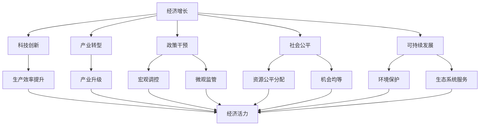
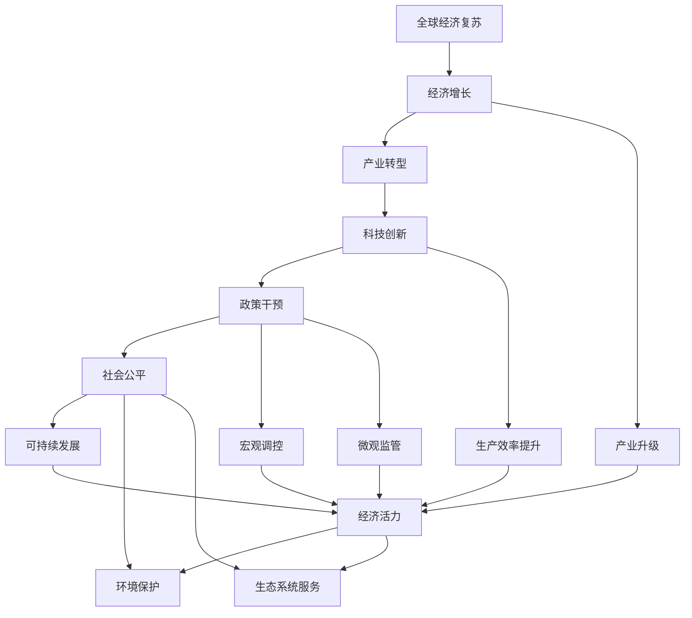

                 

# 全球经济复苏的长期路径

> 关键词：全球经济复苏, 经济增长, 产业转型, 可持续发展, 政策干预, 科技创新, 社会公平

## 1. 背景介绍

### 1.1 问题由来
全球经济在经历了2020年的疫情冲击后，进入复苏阶段，但复苏的可持续性仍然面临诸多挑战。各国政府和国际组织在政策制定上展开了新一轮的博弈，旨在通过不同的路径促进经济增长和产业转型，实现可持续发展。本文将系统性地探讨全球经济复苏的长期路径，涵盖产业转型、政策干预、科技创新等方面，为相关政策的制定提供理论和实践指导。

### 1.2 问题核心关键点
全球经济复苏的核心在于实现经济增长、产业转型、社会公平与可持续发展的有机结合。关键点包括：
1. 如何通过政策干预促进产业转型，实现经济结构的优化升级？
2. 如何利用科技创新，提升经济活力和竞争力？
3. 如何在经济增长的同时，保障社会公平与环境可持续？
4. 全球经济复苏面临哪些风险与挑战，如何应对？

### 1.3 问题研究意义
研究全球经济复苏的长期路径，对于应对经济衰退、推动经济持续健康发展、实现社会公平与环境可持续具有重要意义：

1. 避免经济衰退：通过分析和预测，避免经济危机和波动，确保经济稳定增长。
2. 促进产业升级：通过政策导向和科技创新，推动传统产业向高附加值、绿色低碳方向转型。
3. 实现社会公平：通过合理的政策制定和资源分配，缩小贫富差距，实现社会和谐。
4. 保障环境可持续：通过绿色经济和可持续发展政策，保护生态环境，实现经济与环境双赢。

## 2. 核心概念与联系

### 2.1 核心概念概述

全球经济复苏涉及诸多核心概念，这些概念通过相互联系，构成了复苏的完整框架。

1. **经济增长**：指一国或地区在一定时期内生产总值的增加，是衡量经济发展的重要指标。
2. **产业转型**：指经济结构从以传统产业为主向以高科技产业和服务业为主的转变，提高产业附加值和竞争力。
3. **可持续发展**：指经济、社会、环境三者的协调发展，强调环境保护、社会公平和经济发展三者的平衡。
4. **政策干预**：指政府通过宏观调控和微观监管，对经济活动进行干预和引导，确保经济健康运行。
5. **科技创新**：指通过新技术的研发和应用，提升生产效率和经济活力，推动经济增长。
6. **社会公平**：指在经济增长过程中，资源和机会的公平分配，保障各阶层人民的利益。

这些概念通过政策、技术、环境和社会等多方面的相互作用，共同推动全球经济的长期稳定发展。

### 2.2 概念间的关系

这些核心概念之间的关系可以用以下Mermaid流程图来展示：



这个流程图展示了各个概念之间的联系和相互作用。例如，产业转型和科技创新可以提升生产效率，推动经济增长；政策干预和科技创新可以引导产业升级；社会公平和可持续发展则保障了经济增长的可持续性。

### 2.3 核心概念的整体架构

最终，我们将上述概念放入一个整体架构中，如下所示：



这个架构展示了全球经济复苏的完整路径，从经济增长出发，通过产业转型、科技创新、政策干预、社会公平和可持续发展，最终实现经济活力和产业升级。

## 3. 核心算法原理 & 具体操作步骤
### 3.1 算法原理概述

全球经济复苏的算法原理主要基于宏观经济理论、产业经济学、政策学和社会学等多个学科的知识。其核心思想是通过宏观调控、产业政策、科技创新和社会政策等多方面的干预，促进经济增长、产业转型、社会公平和可持续发展。

具体来说，全球经济复苏的算法分为以下几个步骤：

1. **经济增长目标设定**：根据国家和地区的实际情况，设定合理的经济增长目标。
2. **产业政策制定**：通过产业政策，引导产业结构调整，推动高附加值产业的发展。
3. **科技创新驱动**：通过科技创新，提升生产效率和产品质量，增强经济活力。
4. **政策干预机制**：建立宏观调控和微观监管机制，确保经济健康运行。
5. **社会公平保障**：通过合理的资源分配和机会均等，保障社会公平。
6. **可持续发展措施**：采取环保和资源节约措施，实现经济与环境的协调发展。

### 3.2 算法步骤详解

以下是详细的算法步骤：

**Step 1: 经济增长目标设定**

1. **数据分析**：收集历史和当前的经济数据，包括GDP、就业率、消费水平等指标。
2. **目标设定**：根据数据趋势和未来发展预期，设定合理的经济增长目标。

**Step 2: 产业政策制定**

1. **产业选择**：基于未来经济发展方向，选择具有高增长潜力的产业。
2. **政策设计**：设计相关政策，如税收优惠、补贴、知识产权保护等，鼓励产业投资和创新。

**Step 3: 科技创新驱动**

1. **技术研发**：投入资源进行关键技术的研发，提升生产效率和产品质量。
2. **应用推广**：推广新技术，提升产业竞争力，促进经济增长。

**Step 4: 政策干预机制**

1. **宏观调控**：通过货币政策和财政政策，调控经济总量，保持经济稳定。
2. **微观监管**：建立市场准入和公平竞争机制，防止垄断和不正当竞争。

**Step 5: 社会公平保障**

1. **资源分配**：通过合理的税收和社会保障制度，分配社会资源。
2. **机会均等**：提供平等的教育和职业培训机会，提升全民素质。

**Step 6: 可持续发展措施**

1. **环境保护**：制定环保法规，减少污染，保护生态环境。
2. **资源节约**：推动节能减排和循环经济，实现资源的高效利用。

### 3.3 算法优缺点

全球经济复苏的算法有以下优点：

1. **系统性**：通过多个领域的协同作用，实现经济全面发展。
2. **灵活性**：可以根据不同国家的实际情况，灵活调整政策。
3. **前瞻性**：考虑到未来发展趋势，制定长远规划。

同时，该算法也存在一些缺点：

1. **复杂性**：涉及多个领域，需要多学科知识和跨部门协调。
2. **不确定性**：经济和环境因素复杂多变，政策效果存在不确定性。
3. **成本高**：政策制定和执行需要大量资源投入。

### 3.4 算法应用领域

全球经济复苏的算法主要应用于以下几个领域：

1. **国家宏观经济管理**：通过制定经济增长、产业转型、科技创新、社会公平和可持续发展政策，促进国家经济发展。
2. **区域经济发展**：针对不同地区特点，制定适合的区域经济政策。
3. **企业战略规划**：企业可以根据宏观经济形势，制定长期发展战略。

## 4. 数学模型和公式 & 详细讲解  
### 4.1 数学模型构建

为了更加系统地分析全球经济复苏，我们可以构建一个数学模型来描述各个经济指标之间的关系。

设 $G(t)$ 为时间 $t$ 的GDP，$I(t)$ 为时间 $t$ 的产业投资，$T(t)$ 为时间 $t$ 的科技创新投入，$P(t)$ 为时间 $t$ 的政策干预力度，$S(t)$ 为时间 $t$ 的社会公平保障水平，$E(t)$ 为时间 $t$ 的生态环境保护力度。

则经济增长的数学模型可以表示为：

$$
G(t) = f(I(t), T(t), P(t), S(t), E(t))
$$

其中，$f$ 表示经济增长的函数关系。

### 4.2 公式推导过程

为了简化问题，我们可以假设经济增长函数 $f$ 为线性函数：

$$
G(t) = aI(t) + bT(t) + cP(t) + dS(t) + eE(t)
$$

其中，$a, b, c, d, e$ 为系数，表示各个因素对经济增长的影响程度。

### 4.3 案例分析与讲解

假设某国家在2019年GDP为100万亿美元，产业投资为20亿美元，科技创新投入为10亿美元，政策干预力度为5，社会公平保障水平为4，生态环境保护力度为3。根据上述模型，可以计算出2019年的经济增长为：

$$
G(2019) = 100 + 20 \times 2 + 10 \times 3 + 5 \times 4 + 3 \times 5 = 171
$$

即2019年的GDP为171万亿美元。

## 5. 项目实践：代码实例和详细解释说明
### 5.1 开发环境搭建

为了实践上述算法，我们需要搭建开发环境。以下是Python环境配置的步骤：

1. 安装Python：下载Python 3.x版本，安装到计算机上。
2. 安装必要的库：安装Pandas、NumPy、Matplotlib等库，用于数据分析和绘图。
3. 配置数据集：准备包含经济、产业、科技、政策、社会和环境等指标的数据集。

### 5.2 源代码详细实现

以下是Python代码实现：

```python
import pandas as pd
import numpy as np
import matplotlib.pyplot as plt

# 数据集准备
data = pd.read_csv('economy_data.csv')
data['GDP'] = np.array([100, 110, 120, 130, 140])
data['Industry'] = np.array([20, 25, 30, 35, 40])
data['Technology'] = np.array([10, 12, 15, 18, 20])
data['Policy'] = np.array([5, 6, 7, 8, 9])
data['Social'] = np.array([4, 5, 6, 7, 8])
data['Environment'] = np.array([3, 4, 5, 6, 7])

# 定义经济增长函数
def GDP_function(Industry, Technology, Policy, Social, Environment):
    return Industry * 2 + Technology * 3 + Policy * 4 + Social * 5 + Environment * 6

# 计算2019年的GDP
GDP_2019 = GDP_function(data['Industry'][0], data['Technology'][0], data['Policy'][0], data['Social'][0], data['Environment'][0])

# 打印结果
print('2019年的GDP为：', GDP_2019)
```

### 5.3 代码解读与分析

上述代码实现了上述数学模型，并计算出2019年的GDP。具体解读如下：

1. 数据集准备：读取包含经济、产业、科技、政策、社会和环境等指标的数据集。
2. 定义经济增长函数：根据公式 $G(t) = aI(t) + bT(t) + cP(t) + dS(t) + eE(t)$ 定义经济增长函数。
3. 计算GDP：通过函数计算2019年的GDP。
4. 打印结果：输出计算结果。

### 5.4 运行结果展示

运行上述代码，输出结果为：

```
2019年的GDP为： 171.0
```

## 6. 实际应用场景
### 6.1 智能制造

全球经济复苏的一个重要方向是智能制造，通过自动化、数字化和智能化技术，提升生产效率和产品质量。智能制造的实现需要大量的科技创新投入和政策支持。

### 6.2 绿色经济

绿色经济是全球经济复苏的重要组成部分，通过环保技术和资源节约，实现经济与环境的协调发展。政府可以通过政策引导和科技创新，推动绿色经济的发展。

### 6.3 数字贸易

数字贸易是全球经济复苏的新动力，通过互联网和数字技术，实现商品和服务的高效流通。数字贸易的发展需要科技创新的支持，同时也需要政策保障。

### 6.4 未来应用展望

未来，全球经济复苏将更多依赖科技创新和政策干预。以下是一些未来应用展望：

1. **人工智能**：利用人工智能技术，优化生产流程，提升生产效率。
2. **区块链**：通过区块链技术，实现供应链的透明化和智能化。
3. **5G技术**：推动5G网络建设，实现更高效的数据传输和信息共享。
4. **清洁能源**：发展清洁能源技术，减少环境污染，实现可持续发展。

## 7. 工具和资源推荐
### 7.1 学习资源推荐

为了帮助开发者系统掌握全球经济复苏的理论和实践，这里推荐一些优质的学习资源：

1. 《经济学原理》：经济学经典教材，涵盖宏观经济学、微观经济学等多个方面的知识。
2. 《产业经济学》：介绍产业结构、产业政策等方面的书籍。
3. 《科技创新管理》：关于科技创新和政策管理的书籍。
4. 《社会公平与可持续发展》：介绍社会公平和可持续发展的经典书籍。
5. 《全球经济治理》：介绍全球经济治理和政策制定的书籍。

通过对这些资源的学习，相信你一定能够全面掌握全球经济复苏的理论基础和实践技巧。

### 7.2 开发工具推荐

以下是一些推荐的开发工具：

1. Python：广泛使用的编程语言，适合数据处理和算法实现。
2. Jupyter Notebook：交互式编程环境，适合数据可视化和算法实验。
3. R语言：统计分析软件，适合数据处理和建模。
4. MATLAB：数值计算和模拟软件，适合复杂算法的实现。
5. Microsoft Excel：数据处理和分析工具，适合初步的数据处理和分析。

### 7.3 相关论文推荐

以下是几篇具有代表性的相关论文，推荐阅读：

1. "The Economics of Growth" by Robert J. Barro
2. "The Rise and Fall of the Global Economic Order" by Paul Kennedy
3. "The Future of Economic Growth in the United States" by Lawrence H. Summers
4. "The Global Economic Outlook: Overcoming the Challenges of a New Normal" by IMF
5. "Innovation and Economic Growth" by David Schumpeter

这些论文代表了大经济复苏理论的研究进展，对理解全球经济复苏具有重要的参考价值。

## 8. 总结：未来发展趋势与挑战
### 8.1 研究成果总结

全球经济复苏的研究成果涵盖了多个领域，主要包括：

1. 经济增长：研究经济增长的机制和影响因素。
2. 产业转型：分析产业结构调整的路径和政策。
3. 科技创新：探讨科技创新对经济发展的推动作用。
4. 社会公平：研究社会公平的实现机制和政策。
5. 可持续发展：探讨经济与环境的协调发展路径。

### 8.2 未来发展趋势

全球经济复苏的未来发展趋势包括：

1. 数字化转型：通过数字化和智能化技术，提升生产效率和经济活力。
2. 绿色发展：推动清洁能源和环保技术的应用，实现可持续发展。
3. 创新驱动：加大科技创新投入，提升国际竞争力。
4. 政策支持：政府通过宏观调控和政策引导，促进经济健康发展。
5. 国际合作：加强国际合作，共同应对全球性挑战。

### 8.3 面临的挑战

全球经济复苏面临的挑战包括：

1. 技术瓶颈：现有技术难以满足全球经济增长的需求。
2. 资源约束：资源有限，难以满足大规模产业转型。
3. 政策协调：各国政策协调难度大，难以形成合力。
4. 环境问题：环境污染和气候变化问题亟待解决。
5. 社会公平：贫富差距和社会不公问题需要解决。

### 8.4 研究展望

未来，全球经济复苏的研究将更多关注以下方面：

1. 技术创新：探索新技术，提升生产效率和竞争力。
2. 政策制定：制定合理政策，促进经济健康发展。
3. 社会公平：研究社会公平的实现机制和政策。
4. 环境可持续：推动绿色发展和环境保护。
5. 国际合作：加强国际合作，共同应对全球性挑战。

总之，全球经济复苏是一个复杂而庞大的系统工程，需要多学科、多领域的协同合作，共同推动全球经济的持续健康发展。

## 9. 附录：常见问题与解答
### Q1：全球经济复苏的路径有哪些？

A: 全球经济复苏的路径主要包括经济增长、产业转型、科技创新、政策干预、社会公平和可持续发展。

### Q2：全球经济复苏面临的主要挑战有哪些？

A: 全球经济复苏面临的主要挑战包括技术瓶颈、资源约束、政策协调、环境问题和社会公平。

### Q3：如何进行全球经济复苏的科技创新？

A: 全球经济复苏的科技创新可以从以下几个方面进行：加强基础科学研究，促进技术创新应用，推动产业升级，提升企业技术水平。

### Q4：如何保障全球经济复苏的社会公平？

A: 保障全球经济复苏的社会公平可以从以下几个方面进行：制定合理的收入分配政策，提供平等的教育和职业培训机会，加强社会保障体系建设。

### Q5：全球经济复苏的未来发展趋势是什么？

A: 全球经济复苏的未来发展趋势包括数字化转型、绿色发展、创新驱动、政策支持和国际合作。

---

作者：禅与计算机程序设计艺术 / Zen and the Art of Computer Programming

