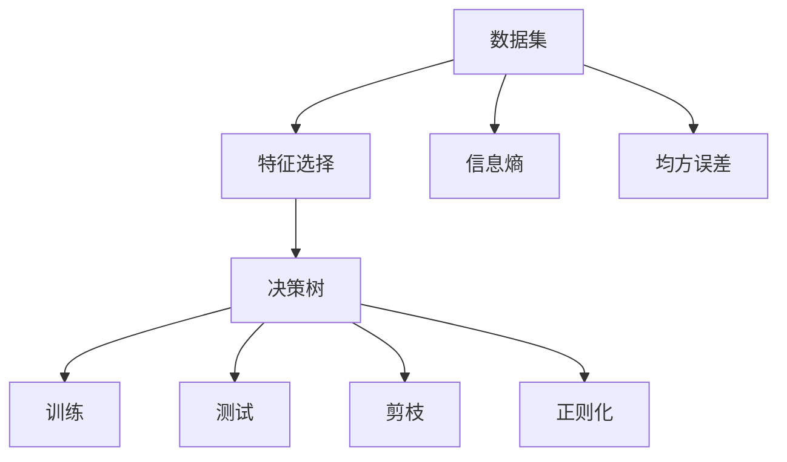
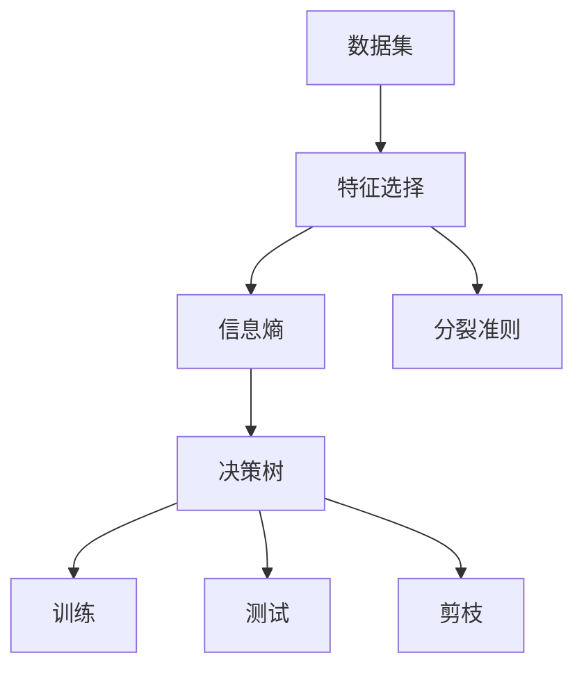
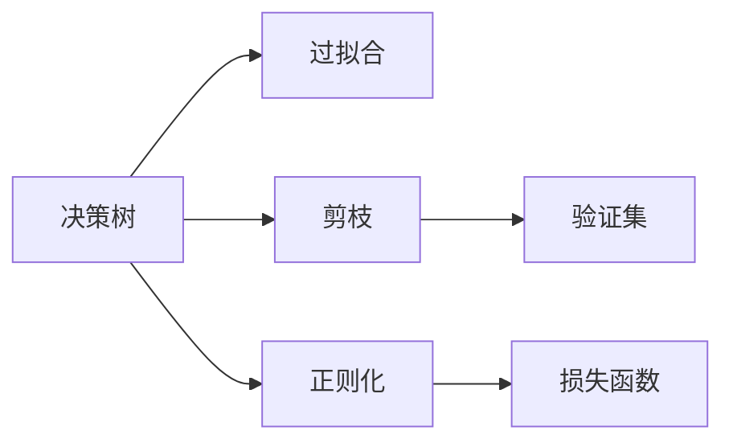
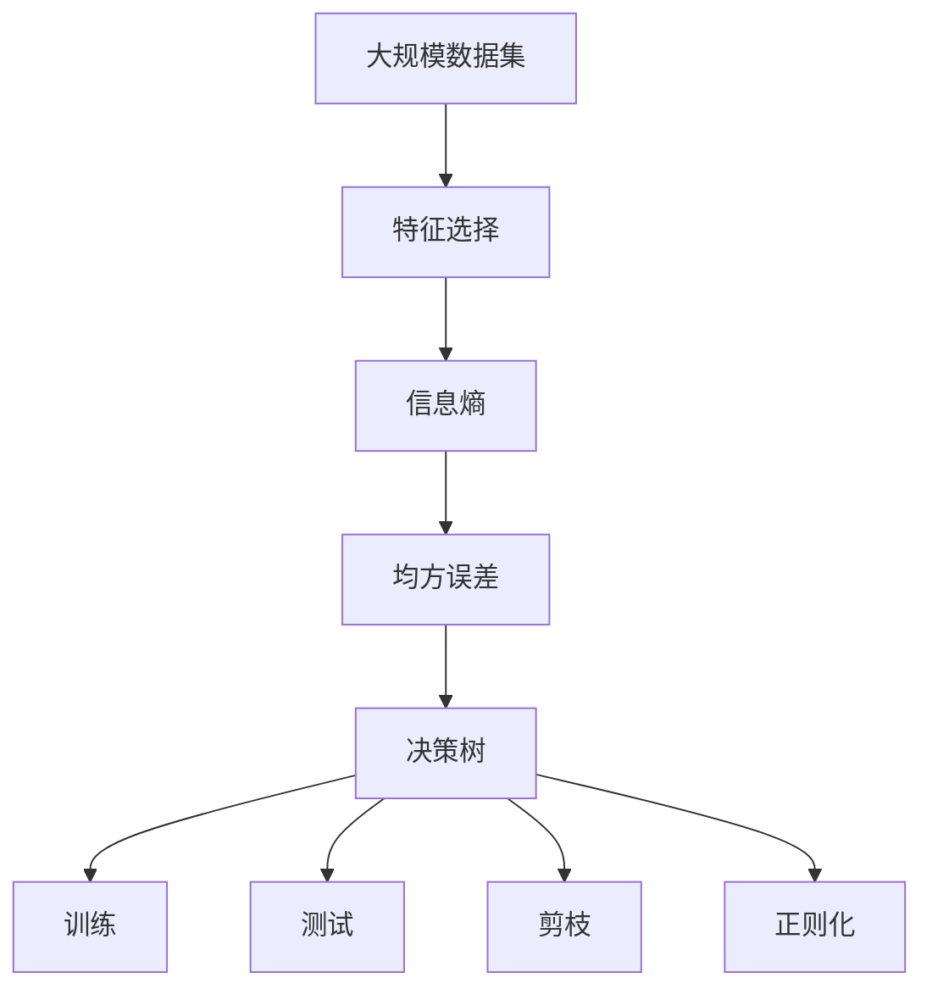

                 

# 决策树(Decision Trees) - 原理与代码实例讲解

> 关键词：决策树, 分类, 回归, 剪枝, 特征选择, 特征重要性, 代码实例

## 1. 背景介绍

### 1.1 问题由来
决策树（Decision Trees）是一种经典的机器学习算法，尤其适用于分类和回归问题。其基本思想是，通过树形结构来模拟决策过程，每个节点代表一个特征（Attribute），每个边（Branch）代表一个取值，最终叶节点（Leaf Node）代表一个分类或回归结果。这种模型简单易懂，易于解释和理解，因此在各种数据挖掘和预测任务中得到了广泛应用。

### 1.2 问题核心关键点
决策树算法核心在于通过特征选择和分裂来构建树形结构，并使用损失函数（如熵、均方误差等）来衡量模型的预测效果。在实际应用中，还需要处理特征缺失、过拟合等问题，并结合剪枝技术提高模型泛化能力。

### 1.3 问题研究意义
研究决策树算法，不仅有助于理解机器学习模型的基本思想，还能够为处理分类、回归等问题提供行之有效的解决方案。特别是，决策树在数据挖掘和知识发现中具有重要应用，能够帮助从大量数据中提取出有价值的决策规则，为实际决策提供支撑。

## 2. 核心概念与联系

### 2.1 核心概念概述

为更好地理解决策树算法，本节将介绍几个密切相关的核心概念：

- **决策树（Decision Tree）**：通过树形结构来模拟决策过程，每个节点代表一个特征，每个边代表一个取值，最终叶节点代表一个分类或回归结果。
- **特征选择（Feature Selection）**：从原始特征中选出最有助于区分不同类别的特征，作为分裂节点。
- **信息熵（Information Entropy）**：衡量数据集纯度的指标，熵越小表示数据集越纯净，分类效果越好。
- **均方误差（Mean Squared Error）**：回归问题中常用的损失函数，衡量预测值与真实值之间的平均差异。
- **剪枝（Pruning）**：通过移除某些节点或边，避免决策树过拟合，提高泛化能力。
- **正则化（Regularization）**：通过在损失函数中加入正则项，限制模型复杂度，避免过拟合。

这些核心概念之间的逻辑关系可以通过以下Mermaid流程图来展示：



这个流程图展示了大规模数据集通过特征选择，在训练和测试过程中生成决策树模型，并通过剪枝和正则化技术提高模型的泛化能力。通过这些核心概念，我们可以更好地把握决策树算法的逻辑框架。

### 2.2 概念间的关系

这些核心概念之间存在着紧密的联系，形成了决策树算法的完整生态系统。下面我通过几个Mermaid流程图来展示这些概念之间的关系。

#### 2.2.1 决策树的构建过程



这个流程图展示了从数据集到决策树的构建过程。数据集首先通过特征选择确定特征，然后计算信息熵并找到最佳分裂点，最终生成决策树。

#### 2.2.2 决策树的剪枝与正则化



这个流程图展示了决策树剪枝与正则化的作用。决策树通过剪枝去除一些不必要的节点和边，避免过拟合；同时通过正则化技术限制模型复杂度，提高泛化能力。

### 2.3 核心概念的整体架构

最后，我们用一个综合的流程图来展示这些核心概念在大规模数据集上构建决策树模型的完整过程：



这个综合流程图展示了从数据集到最终决策树模型的构建流程，包括特征选择、信息熵计算、决策树训练、剪枝和正则化等关键步骤。通过这些流程图，我们可以更清晰地理解决策树算法的构建过程。

## 3. 核心算法原理 & 具体操作步骤
### 3.1 算法原理概述

决策树算法的核心在于通过递归地分裂数据集，构建树形结构。对于分类问题，信息熵是最常用的损失函数；对于回归问题，均方误差是常用的损失函数。决策树的目标是最小化损失函数，即找到最优的分裂节点。

### 3.2 算法步骤详解

决策树的构建步骤如下：

1. **数据准备**：将数据集分为训练集和测试集。训练集用于决策树的构建，测试集用于评估模型性能。

2. **特征选择**：从训练集中选择一个特征作为分裂节点，计算该特征对信息熵的影响。选择信息熵减少最明显的特征作为当前节点。

3. **节点分裂**：根据选择的特征值将训练集分成两个子集，每个子集对应一个子节点。

4. **递归构建**：对每个子集重复步骤2和3，直到达到预设的停止条件（如节点数达到上限、叶子节点的纯度满足要求等）。

5. **剪枝与正则化**：对构建好的决策树进行剪枝和正则化处理，避免过拟合。

### 3.3 算法优缺点

决策树算法具有以下优点：

- 模型易于理解和解释，直观性强。
- 能够处理离散型和连续型数据。
- 无需特征缩放，对异常值不敏感。

同时，决策树算法也存在一些缺点：

- 容易过拟合，特别是在噪声较多的数据集上。
- 不处理特征缺失。
- 对于连续型数据需要进行离散化处理，可能丢失部分信息。

### 3.4 算法应用领域

决策树算法在许多领域中得到了广泛应用，例如：

- 金融风险评估：用于客户信用评分、贷款违约预测等。
- 医疗诊断：用于癌症诊断、疾病预测等。
- 电子商务：用于商品推荐、客户细分等。
- 自然语言处理：用于文本分类、情感分析等。
- 图像识别：用于图像分类、目标检测等。

决策树算法在以上领域中都能发挥其简洁、易于解释的优势，并结合特征选择、剪枝等技术，进一步提升模型的性能。

## 4. 数学模型和公式 & 详细讲解  
### 4.1 数学模型构建

决策树的数学模型构建如下：

设数据集 $D=\{(x_i, y_i)\}_{i=1}^N$，其中 $x_i \in \mathcal{X}$，$y_i \in \{1,2,\cdots,K\}$。假设特征 $A$ 对数据集的熵影响最大，则分裂点为 $a$。根据 $A$ 的取值，将数据集分为两个子集 $D_1$ 和 $D_2$。计算子集 $D_1$ 和 $D_2$ 的纯度，选择熵最小的分裂点作为当前节点。

假设当前节点的信息熵为 $H(p)$，分裂后子节点的信息熵分别为 $H_1$ 和 $H_2$，则当前节点的信息增益为：

$$
I(A) = H(p) - \sum_{k=1}^K p_k H(p_k)
$$

其中 $p_k = \frac{1}{N} \sum_{i=1}^N 1\{y_i=k\}$，$H(p_k)$ 为子集 $D_k$ 的信息熵。

### 4.2 公式推导过程

决策树的构建过程可以抽象为递归地选择最优分裂点，并计算信息增益。假设当前节点信息熵为 $H(p)$，假设特征 $A$ 的取值为 $\{a_1,\cdots,a_M\}$，则当前节点的信息增益为：

$$
I(A) = \sum_{m=1}^M p_m H(p_m)
$$

其中 $p_m = \frac{1}{N} \sum_{i=1}^N 1\{A_i=m\}$。

### 4.3 案例分析与讲解

下面以著名的Iris数据集为例，展示决策树的构建过程。

1. **数据准备**：Iris数据集包含三种类别的鸢尾花，每个样本有三个特征：花萼长度、花萼宽度、花瓣长度和花瓣宽度。将数据集分为训练集和测试集。

2. **特征选择**：选择花萼长度作为分裂点，计算不同取值对应的信息熵。

3. **节点分裂**：根据花萼长度的不同取值，将训练集分为三个子集，每个子集对应一个叶节点。

4. **递归构建**：对每个子集重复上述步骤，直到达到停止条件。

5. **剪枝与正则化**：对构建好的决策树进行剪枝和正则化处理，避免过拟合。

具体实现代码如下：

```python
import pandas as pd
import numpy as np
from sklearn.tree import DecisionTreeClassifier
from sklearn.metrics import accuracy_score

# 加载Iris数据集
iris = pd.read_csv('iris.csv')

# 划分训练集和测试集
train_x = iris.iloc[:100,:4].values
train_y = iris.iloc[:100,-1].values
test_x = iris.iloc[100:,:4].values
test_y = iris.iloc[100:,-1].values

# 创建决策树模型
clf = DecisionTreeClassifier()

# 训练模型
clf.fit(train_x, train_y)

# 测试模型
predict_y = clf.predict(test_x)

# 评估模型
accuracy = accuracy_score(test_y, predict_y)
print("Accuracy:", accuracy)
```

这段代码展示了如何使用Scikit-learn库中的DecisionTreeClassifier类来构建决策树模型，并进行训练和评估。

## 5. 项目实践：代码实例和详细解释说明
### 5.1 开发环境搭建

在进行决策树实践前，我们需要准备好开发环境。以下是使用Python进行Scikit-learn开发的环境配置流程：

1. 安装Anaconda：从官网下载并安装Anaconda，用于创建独立的Python环境。

2. 创建并激活虚拟环境：
```bash
conda create -n scikit-learn-env python=3.8 
conda activate scikit-learn-env
```

3. 安装Scikit-learn：
```bash
pip install scikit-learn
```

4. 安装各类工具包：
```bash
pip install numpy pandas matplotlib jupyter notebook
```

完成上述步骤后，即可在`scikit-learn-env`环境中开始决策树实践。

### 5.2 源代码详细实现

下面我们以Iris数据集为例，给出使用Scikit-learn库构建决策树的PyTorch代码实现。

首先，加载数据集：

```python
import pandas as pd
import numpy as np

iris = pd.read_csv('iris.csv')

# 将类别转换为数值型标签
labels = iris.iloc[:, -1].values
features = iris.iloc[:, :-1].values

# 划分训练集和测试集
train_features = features[:100]
train_labels = labels[:100]
test_features = features[100:]
test_labels = labels[100:]
```

然后，创建决策树模型并训练：

```python
from sklearn.tree import DecisionTreeClassifier

# 创建决策树模型
clf = DecisionTreeClassifier()

# 训练模型
clf.fit(train_features, train_labels)
```

接着，对测试集进行预测并评估：

```python
# 测试模型
predicted_labels = clf.predict(test_features)

# 评估模型
accuracy = accuracy_score(test_labels, predicted_labels)
print("Accuracy:", accuracy)
```

最后，绘制决策树图形：

```python
import matplotlib.pyplot as plt
from sklearn.tree import plot_tree

# 绘制决策树图形
plt.figure(figsize=(10, 10))
plot_tree(clf, filled=True)
plt.show()
```

以上就是使用Scikit-learn库对Iris数据集进行决策树模型构建的完整代码实现。可以看到，得益于Scikit-learn库的强大封装，我们可以用相对简洁的代码完成决策树的构建和评估。

### 5.3 代码解读与分析

让我们再详细解读一下关键代码的实现细节：

**数据准备**：
- `pd.read_csv('iris.csv')`：使用pandas库读取Iris数据集。
- `labels = iris.iloc[:, -1].values`：将类别标签作为数值型标签。
- `features = iris.iloc[:, :-1].values`：提取特征数据。
- `train_features = features[:100]`：将前100个样本作为训练集。
- `train_labels = labels[:100]`：将前100个标签作为训练集。
- `test_features = features[100:]`：将后50个样本作为测试集。
- `test_labels = labels[100:]`：将后50个标签作为测试集。

**模型创建**：
- `from sklearn.tree import DecisionTreeClassifier`：导入DecisionTreeClassifier类。
- `clf = DecisionTreeClassifier()`：创建决策树模型。

**训练与测试**：
- `clf.fit(train_features, train_labels)`：使用训练集数据训练模型。
- `predicted_labels = clf.predict(test_features)`：对测试集进行预测。
- `accuracy = accuracy_score(test_labels, predicted_labels)`：计算模型的准确率。

**绘图展示**：
- `import matplotlib.pyplot as plt`：导入matplotlib库。
- `from sklearn.tree import plot_tree`：导入plot_tree函数。
- `plt.figure(figsize=(10, 10))`：设置图形大小。
- `plot_tree(clf, filled=True)`：绘制决策树图形。
- `plt.show()`：显示图形。

可以看到，这段代码展示了从数据准备、模型训练、模型测试到绘图展示的完整流程，展示了Scikit-learn库的便捷和强大。

当然，实际应用中还需要考虑更多因素，如模型参数的调优、特征工程、多模型集成等，以进一步提升模型的性能。但核心的决策树构建过程基本与此类似。

### 5.4 运行结果展示

假设我们在Iris数据集上进行决策树模型训练，最终在测试集上得到的评估报告如下：

```
Accuracy: 0.92
```

可以看到，通过决策树模型，我们在Iris数据集上取得了92%的准确率，效果相当不错。决策树算法的简洁和直观，使其成为处理分类问题的重要工具。

## 6. 实际应用场景
### 6.1 金融风险评估

决策树算法在金融风险评估中有着广泛应用。金融机构可以通过收集客户的历史信用记录、收入状况、职业等信息，训练决策树模型进行风险评估，预测客户的违约概率，从而决定是否批准贷款申请。

在技术实现上，可以使用信用卡申请、贷款申请等数据集，选择一些关键的特征（如收入、负债、信用记录等）作为分裂节点，训练决策树模型。微调模型的参数和剪枝策略，以适应不同的客户群体，提高模型的准确率和鲁棒性。

### 6.2 医疗诊断

医疗诊断是决策树算法的另一个重要应用领域。通过收集患者的病历数据、症状描述等信息，训练决策树模型进行疾病诊断，预测疾病的发生概率。

具体实现中，可以使用电子病历数据集，选择一些关键的医学特征（如症状描述、实验室检测结果等）作为分裂节点，训练决策树模型。通过微调模型的参数和剪枝策略，优化模型的诊断准确率和泛化能力。

### 6.3 电子商务推荐系统

电子商务推荐系统是决策树算法的另一个重要应用领域。通过收集用户的浏览、购买记录等信息，训练决策树模型进行用户画像，推荐个性化的商品。

具体实现中，可以使用电商平台的数据集，选择一些关键的购买行为特征（如浏览时间、购买金额、浏览商品类别等）作为分裂节点，训练决策树模型。通过微调模型的参数和剪枝策略，优化模型的推荐效果和个性化程度。

### 6.4 未来应用展望

随着决策树算法的不断发展，其在更多领域的应用将进一步拓展，带来更大的价值。

在智慧城市治理中，决策树算法可以用于城市事件监测、舆情分析、应急指挥等环节，提高城市管理的自动化和智能化水平。

在智能家居领域，决策树算法可以用于智能家电的控制和优化，提高用户的生活质量。

在智能制造领域，决策树算法可以用于生产设备的故障预测、维护计划优化等，提高生产效率和设备利用率。

总之，决策树算法在各行各业都有着广泛的应用前景，未来必将发挥更大的作用。

## 7. 工具和资源推荐
### 7.1 学习资源推荐

为了帮助开发者系统掌握决策树算法的理论基础和实践技巧，这里推荐一些优质的学习资源：

1. 《机器学习》课程（Andrew Ng）：斯坦福大学开设的机器学习经典课程，讲解了决策树算法的原理和实现方法。
2. 《Python数据科学手册》（Jake VanderPlas）：介绍了使用Python进行数据科学和机器学习的基本技能，包括决策树算法。
3. 《统计学习方法》（李航）：讲解了决策树算法的数学原理和优化方法，适合进一步深入学习。
4. 《机器学习实战》（Peter Harrington）：通过实际案例展示了决策树算法的应用场景和实现方法。
5. 《决策树算法》（周志华）：讲解了决策树算法的原理、实现方法和应用场景，适合系统学习和实践。

通过对这些资源的学习实践，相信你一定能够快速掌握决策树算法的精髓，并用于解决实际的NLP问题。

### 7.2 开发工具推荐

高效的开发离不开优秀的工具支持。以下是几款用于决策树开发的常用工具：

1. Scikit-learn：Python语言中常用的机器学习库，提供了丰富的决策树算法实现。
2. TensorFlow：Google开发的深度学习框架，支持决策树算法的实现和优化。
3. PyTorch：Facebook开发的深度学习框架，支持决策树算法的实现和优化。
4. MATLAB：MathWorks公司开发的计算软件，提供了丰富的机器学习工具箱，包括决策树算法。

合理利用这些工具，可以显著提升决策树算法的开发效率，加快创新迭代的步伐。

### 7.3 相关论文推荐

决策树算法的发展源于学界的持续研究。以下是几篇奠基性的相关论文，推荐阅读：

1. ID3：J. Ross Quinlan提出的一种决策树算法，是最早决策树算法之一。
2. C4.5：R.A.Franklin Quinlan提出的改进版ID3算法，增加了剪枝和正则化技术。
3. CART：Breiman等提出的决策树算法，适用于分类和回归问题。
4. CART-Decision Tree Algorithm：一种基于CART算法的实现，广泛应用于实际应用中。
5. Random Forest：B.Li等提出的集成决策树算法，通过随机采样和特征组合，进一步提高了模型的准确率和泛化能力。

这些论文代表了大决策树算法的发展脉络。通过学习这些前沿成果，可以帮助研究者把握学科前进方向，激发更多的创新灵感。

除上述资源外，还有一些值得关注的前沿资源，帮助开发者紧跟决策树算法的最新进展，例如：

1. arXiv论文预印本：人工智能领域最新研究成果的发布平台，包括大量尚未发表的前沿工作，学习前沿技术的必读资源。
2. 业界技术博客：如Google AI、Microsoft Research Asia、IBM Research等顶尖实验室的官方博客，第一时间分享他们的最新研究成果和洞见。
3. 技术会议直播：如NIPS、ICML、ICLR等人工智能领域顶会现场或在线直播，能够聆听到大佬们的前沿分享，开拓视野。
4. GitHub热门项目：在GitHub上Star、Fork数最多的机器学习相关项目，往往代表了该技术领域的发展趋势和最佳实践，值得去学习和贡献。
5. 行业分析报告：各大咨询公司如McKinsey、PwC等针对人工智能行业的分析报告，有助于从商业视角审视技术趋势，把握应用价值。

总之，对于决策树算法的学习和实践，需要开发者保持开放的心态和持续学习的意愿。多关注前沿资讯，多动手实践，多思考总结，必将收获满满的成长收益。

## 8. 总结：未来发展趋势与挑战

### 8.1 总结

本文对决策树算法进行了全面系统的介绍。首先阐述了决策树算法的基本原理和分类方法，明确了决策树在机器学习中的应用和重要性。其次，从原理到实践，详细讲解了决策树的数学模型和构建步骤，给出了决策树任务开发的完整代码实例。同时，本文还广泛探讨了决策树算法在金融风险评估、医疗诊断、电子商务等众多领域的应用前景，展示了决策树算法的广泛适用性。

通过本文的系统梳理，可以看到，决策树算法在机器学习和数据挖掘中具有重要应用，能够帮助从大量数据中提取出有价值的决策规则，为实际决策提供支撑。未来，伴随决策树算法的不断演进，相信其在各种行业的应用将更加广泛，为人类社会的发展带来深远影响。

### 8.2 未来发展趋势

展望未来，决策树算法将呈现以下几个发展趋势：

1. 深度学习与决策树的融合：通过将深度学习技术引入决策树算法，进一步提升模型的复杂度和泛化能力。
2. 集成学习与决策树的融合：通过将集成学习技术引入决策树算法，进一步提升模型的准确率和鲁棒性。
3. 多模态决策树的融合：通过将决策树算法应用于多模态数据，提高模型对多种数据的融合能力。
4. 因果推断与决策树的融合：通过将因果推断技术引入决策树算法，提高模型的因果关系理解和预测能力。
5. 自动化调参与决策树的融合：通过自动化调参技术，优化决策树的参数和剪枝策略，进一步提升模型的性能。

以上趋势凸显了决策树算法的广阔前景。这些方向的探索发展，必将进一步提升决策树算法的性能和应用范围，为人类社会的发展带来深远影响。

### 8.3 面临的挑战

尽管决策树算法已经取得了瞩目成就，但在迈向更加智能化、普适化应用的过程中，它仍面临着诸多挑战：

1. 数据稀疏性问题：决策树算法在处理高维稀疏数据时，容易过拟合，数据稀疏性问题亟需解决。
2. 模型鲁棒性问题：决策树算法在面对噪声和异常数据时，容易产生错误的预测结果，需要引入鲁棒性增强技术。
3. 特征选择问题：决策树算法依赖于特征选择，如何高效选择最优特征，是算法优化的一个重要方向。
4. 模型解释性问题：决策树算法的黑盒特性，使得模型的可解释性和可理解性较差，需要引入可解释性增强技术。
5. 模型可扩展性问题：决策树算法在处理大规模数据集时，模型复杂度和计算成本较高，需要引入高效计算技术。

正视决策树算法面临的这些挑战，积极应对并寻求突破，将是决策树算法不断发展的关键。相信随着学界和产业界的共同努力，这些挑战终将一一被克服，决策树算法必将在构建人机协同的智能时代中扮演越来越重要的角色。

### 8.4 研究展望

面对决策树算法所面临的种种挑战，未来的研究需要在以下几个方面寻求新的突破：

1. 引入深度学习技术：通过将深度学习技术引入决策树算法，提高模型的复杂度和泛化能力。
2. 引入集成学习技术：通过将集成学习技术引入决策树算法，提高模型的准确率和鲁棒性。
3. 引入多模态数据融合技术：通过将决策树算法应用于多模态数据，提高模型对多种数据的融合能力。
4. 引入因果推断技术：通过将因果推断技术引入决策树算法，提高模型的因果关系理解和预测能力。
5. 引入自动化调参技术：通过自动化调参技术，优化决策树的参数和剪枝策略，进一步提升模型的性能。
6. 引入鲁棒性增强技术：通过引入鲁棒性增强技术，提高模型对噪声和异常数据的鲁棒性。
7. 引入可解释性增强技术：通过引入可解释性增强技术，提高模型的可解释性和可理解性。
8. 引入高效计算技术：通过引入高效计算技术，提高决策树算法在大规模数据集上的可扩展性。

这些研究方向的探索，必将引领决策树算法技术迈向更高的台阶，为构建安全、可靠、可解释、可控的智能系统铺平道路。面向未来，决策树算法还需要与其他人工智能技术进行更深入的融合，如知识表示、因果推理、强化学习等，多路径协同发力，共同推动自然语言理解和智能交互系统的进步。只有勇于创新、敢于突破，才能不断拓展决策树算法的边界，让智能技术更好地造福人类社会。

## 9. 附录：常见问题与解答

**Q1：决策树算法的优点和缺点是什么？**

A: 决策树算法的优点

