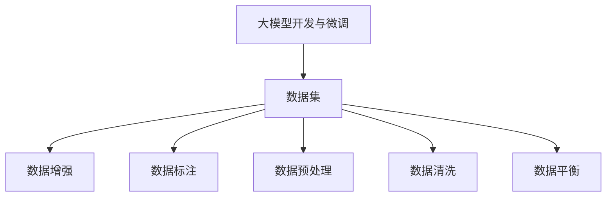
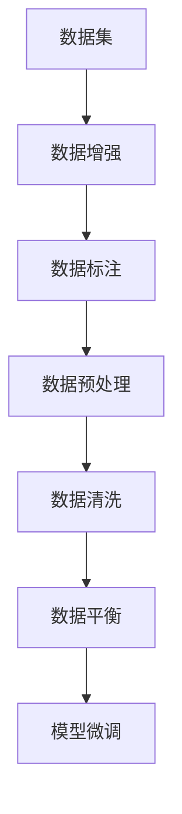
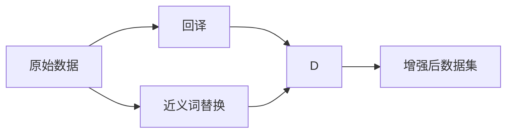
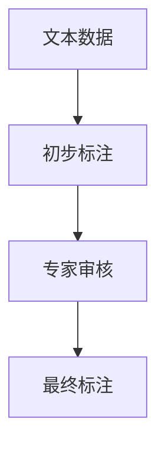

                 

# 从零开始大模型开发与微调：数据的准备

> 关键词：大模型开发,微调准备,数据准备,数据增强,数据标注,数据预处理,数据清洗,数据平衡

## 1. 背景介绍

### 1.1 问题由来

在人工智能领域，尤其是自然语言处理(NLP)领域，大语言模型(LLM)的出现极大地推动了技术的进步。大模型能够从大规模无标签数据中学习到丰富的语言知识和常识，通过微调(Fine-tuning)可以在特定任务上获得优异的性能。微调是指在大模型上通过有标签数据进一步训练，以适应特定任务的需求。然而，在微调过程中，数据的准备是一个关键的环节，其质量直接影响到微调效果和模型的性能。

### 1.2 问题核心关键点

微调过程中数据的准备主要包括数据集的准备、数据增强、数据标注、数据预处理和数据清洗等步骤。这些步骤的合理设计和使用，能够显著提升微调效果，避免模型过拟合，增强模型的泛化能力。因此，如何有效地准备数据，是大模型开发和微调的核心问题之一。

### 1.3 问题研究意义

正确准备数据，对于大模型微调至关重要。高质量的数据集不仅能提升模型的性能，还能显著降低模型训练和推理成本，提高模型的可解释性和鲁棒性。因此，深入研究数据准备的相关方法，对于推动大模型技术的发展具有重要意义。

## 2. 核心概念与联系

### 2.1 核心概念概述

为更好地理解大模型微调中数据准备的重要性，本节将介绍几个核心概念：

- **大模型开发与微调**：指在大规模无标签数据上预训练通用大模型，然后在特定任务上通过微调提升模型性能的过程。
- **数据集**：用于微调训练和验证的数据集，通常包含标注数据和非标注数据。
- **数据增强**：通过对原始数据进行各种变换，生成更多的训练样本，以提升模型的泛化能力。
- **数据标注**：为训练集中的样本添加标签，使其成为监督数据。
- **数据预处理**：包括文本清洗、分词、向量化等步骤，将原始文本数据转换为模型可以处理的格式。
- **数据清洗**：删除或修复数据集中存在的错误或不完整的信息。
- **数据平衡**：确保训练集中各类样本的分布均衡，避免模型偏向某些类别。

这些概念之间的联系可以通过以下Mermaid流程图来展示：



这个流程图展示了大模型微调中数据准备的核心环节，以及它们之间的逻辑关系。

### 2.2 概念间的关系

这些核心概念之间存在着紧密的联系，形成了大模型微调中数据准备的完整生态系统。下面我通过几个Mermaid流程图来展示这些概念之间的关系。

#### 2.2.1 数据准备的整体流程



这个流程图展示了从数据集到模型微调的整体流程，强调了数据准备各环节的重要性。

#### 2.2.2 数据增强的实现方式



这个流程图展示了数据增强的一些常见实现方式，如回译和近义词替换。

#### 2.2.3 数据标注的标注流程



这个流程图展示了数据标注的基本流程，包括初步标注和专家审核两个关键步骤。

## 3. 核心算法原理 & 具体操作步骤

### 3.1 算法原理概述

大模型微调中数据准备的基本原理是通过对原始数据进行增强、标注、预处理和清洗，生成高质量的训练数据集。这些数据集被用于模型训练，从而提升模型的泛化能力和性能。

### 3.2 算法步骤详解

数据准备通常包括以下几个关键步骤：

1. **数据集收集与整理**：从不同渠道收集原始数据，进行初步整理和筛选，去除低质量和重复数据。
2. **数据增强**：通过对原始数据进行各种变换，生成更多的训练样本。
3. **数据标注**：为原始数据添加标签，确保数据集是监督数据。
4. **数据预处理**：包括文本清洗、分词、向量化等步骤，将原始文本数据转换为模型可以处理的格式。
5. **数据清洗**：删除或修复数据集中存在的错误或不完整的信息。
6. **数据平衡**：确保训练集中各类样本的分布均衡，避免模型偏向某些类别。

### 3.3 算法优缺点

数据准备作为大模型微调的重要组成部分，具有以下优点：

- 提高模型泛化能力：通过数据增强和标注，增加训练样本的多样性，减少过拟合风险。
- 降低模型训练成本：高质量的数据集可以加快模型训练速度，提高模型性能。
- 增强模型可解释性：通过预处理和清洗，去除噪声，使模型的预测更加可解释。

同时，数据准备也存在一定的局限性：

- 数据收集成本高：高质量标注数据集的收集需要大量人力和时间，成本较高。
- 数据平衡难以实现：在特定任务中，不同类别的样本可能存在不平衡问题，导致模型偏向于多数类别。
- 数据质量难以保证：数据标注和清洗的准确性对模型性能有重要影响，存在一定的误标注和遗漏风险。

### 3.4 算法应用领域

数据准备作为大模型微调的重要环节，广泛应用于以下领域：

- 自然语言处理(NLP)：文本分类、情感分析、命名实体识别等任务。
- 计算机视觉(CV)：图像识别、目标检测、语义分割等任务。
- 语音识别(SR)：语音识别、语音转换、情感分析等任务。
- 推荐系统(Reco)：用户行为分析、商品推荐、内容推荐等任务。

## 4. 数学模型和公式 & 详细讲解

### 4.1 数学模型构建

为了更好地描述数据准备过程，我将使用数学语言进行详细讲解。

假设我们有一个数据集 $D=\{(x_i, y_i)\}_{i=1}^N$，其中 $x_i$ 表示原始文本，$y_i$ 表示标注标签。数据准备的目标是生成一个新的数据集 $D'$，使得 $D'$ 更适合用于大模型微调。

### 4.2 公式推导过程

数据准备涉及的数学模型和公式主要包括数据增强、标注和预处理等方面。

#### 4.2.1 数据增强

数据增强通常通过文本回译和近义词替换等技术生成更多的训练样本。

假设原始文本为 $x$，通过回译生成一个新的文本 $x'$，则新的训练样本为 $(x, x', y)$。通过近义词替换，可以将 $x$ 中的某些词汇替换为同义词，生成新的文本 $x''$，则新的训练样本为 $(x, x'', y)$。

#### 4.2.2 数据标注

数据标注的目标是为原始数据添加标签，通常使用人工标注或自动化标注的方式。

假设原始文本为 $x$，通过人工标注得到标签 $y$，则新的训练样本为 $(x, y)$。

#### 4.2.3 数据预处理

数据预处理的目标是将原始文本转换为模型可以处理的格式。

假设原始文本为 $x$，通过分词和向量化技术得到向量 $x'$，则新的训练样本为 $(x', y)$。

### 4.3 案例分析与讲解

以下是一个具体的数据准备案例：

假设我们要对电影评论进行情感分析，收集到一份标注数据集 $D=\{(x_i, y_i)\}_{i=1}^{1000}$，其中 $x_i$ 表示电影评论文本，$y_i$ 表示情感标签（正面、负面或中性）。

**Step 1: 数据增强**

通过回译技术，将每条评论的句子进行回译，生成新的评论。

假设 $x_1$ 表示一条原始评论，回译生成 $x'_1$，则新的训练样本为 $(x_1, x'_1, y_1)$。

通过近义词替换，将每条评论中的某些词汇替换为同义词，生成新的评论。

假设 $x_1$ 表示一条原始评论，替换单词 "good" 为 "excellent"，生成新的评论 $x''_1$，则新的训练样本为 $(x_1, x''_1, y_1)$。

**Step 2: 数据标注**

假设原始数据集中的情感标签存在不平衡问题，正面评论数量远大于负面评论。通过人工标注，为每个评论添加情感标签，确保数据集的标注质量。

假设 $x_1$ 表示一条原始评论，通过人工标注得到情感标签 "positive"，则新的训练样本为 $(x_1, positive)$。

**Step 3: 数据预处理**

假设原始评论为英文，通过分词和向量化技术，将每条评论转换为模型可以处理的向量形式。

假设 $x_1$ 表示一条原始评论，分词并转换为向量 $x'_1$，则新的训练样本为 $(x'_1, positive)$。

## 5. 项目实践：代码实例和详细解释说明

### 5.1 开发环境搭建

在进行数据准备实践前，我们需要准备好开发环境。以下是使用Python进行PyTorch开发的环境配置流程：

1. 安装Anaconda：从官网下载并安装Anaconda，用于创建独立的Python环境。

2. 创建并激活虚拟环境：
```bash
conda create -n pytorch-env python=3.8 
conda activate pytorch-env
```

3. 安装PyTorch：根据CUDA版本，从官网获取对应的安装命令。例如：
```bash
conda install pytorch torchvision torchaudio cudatoolkit=11.1 -c pytorch -c conda-forge
```

4. 安装Transformers库：
```bash
pip install transformers
```

5. 安装各类工具包：
```bash
pip install numpy pandas scikit-learn matplotlib tqdm jupyter notebook ipython
```

完成上述步骤后，即可在`pytorch-env`环境中开始数据准备实践。

### 5.2 源代码详细实现

下面我们以文本分类任务为例，给出使用Transformers库对BERT模型进行数据准备和微调的PyTorch代码实现。

首先，定义数据处理函数：

```python
from transformers import BertTokenizer
from torch.utils.data import Dataset
import torch

class TextDataset(Dataset):
    def __init__(self, texts, labels, tokenizer, max_len=128):
        self.texts = texts
        self.labels = labels
        self.tokenizer = tokenizer
        self.max_len = max_len
        
    def __len__(self):
        return len(self.texts)
    
    def __getitem__(self, item):
        text = self.texts[item]
        label = self.labels[item]
        
        encoding = self.tokenizer(text, return_tensors='pt', max_length=self.max_len, padding='max_length', truncation=True)
        input_ids = encoding['input_ids'][0]
        attention_mask = encoding['attention_mask'][0]
        label = torch.tensor(label, dtype=torch.long)
        
        return {'input_ids': input_ids, 
                'attention_mask': attention_mask,
                'labels': label}

# 创建dataset
tokenizer = BertTokenizer.from_pretrained('bert-base-cased')

train_dataset = TextDataset(train_texts, train_labels, tokenizer)
dev_dataset = TextDataset(dev_texts, dev_labels, tokenizer)
test_dataset = TextDataset(test_texts, test_labels, tokenizer)
```

然后，定义模型和优化器：

```python
from transformers import BertForTokenClassification, AdamW

model = BertForTokenClassification.from_pretrained('bert-base-cased', num_labels=len(tag2id))

optimizer = AdamW(model.parameters(), lr=2e-5)
```

接着，定义训练和评估函数：

```python
from torch.utils.data import DataLoader
from tqdm import tqdm
from sklearn.metrics import classification_report

device = torch.device('cuda') if torch.cuda.is_available() else torch.device('cpu')
model.to(device)

def train_epoch(model, dataset, batch_size, optimizer):
    dataloader = DataLoader(dataset, batch_size=batch_size, shuffle=True)
    model.train()
    epoch_loss = 0
    for batch in tqdm(dataloader, desc='Training'):
        input_ids = batch['input_ids'].to(device)
        attention_mask = batch['attention_mask'].to(device)
        labels = batch['labels'].to(device)
        model.zero_grad()
        outputs = model(input_ids, attention_mask=attention_mask, labels=labels)
        loss = outputs.loss
        epoch_loss += loss.item()
        loss.backward()
        optimizer.step()
    return epoch_loss / len(dataloader)

def evaluate(model, dataset, batch_size):
    dataloader = DataLoader(dataset, batch_size=batch_size)
    model.eval()
    preds, labels = [], []
    with torch.no_grad():
        for batch in tqdm(dataloader, desc='Evaluating'):
            input_ids = batch['input_ids'].to(device)
            attention_mask = batch['attention_mask'].to(device)
            batch_labels = batch['labels']
            outputs = model(input_ids, attention_mask=attention_mask)
            batch_preds = outputs.logits.argmax(dim=2).to('cpu').tolist()
            batch_labels = batch_labels.to('cpu').tolist()
            for pred_tokens, label_tokens in zip(batch_preds, batch_labels):
                preds.append(pred_tokens[:len(label_tokens)])
                labels.append(label_tokens)
                
    print(classification_report(labels, preds))
```

最后，启动训练流程并在测试集上评估：

```python
epochs = 5
batch_size = 16

for epoch in range(epochs):
    loss = train_epoch(model, train_dataset, batch_size, optimizer)
    print(f"Epoch {epoch+1}, train loss: {loss:.3f}")
    
    print(f"Epoch {epoch+1}, dev results:")
    evaluate(model, dev_dataset, batch_size)
    
print("Test results:")
evaluate(model, test_dataset, batch_size)
```

以上就是使用PyTorch对BERT进行文本分类任务数据准备和微调的完整代码实现。可以看到，得益于Transformers库的强大封装，我们可以用相对简洁的代码完成BERT模型的加载和微调。

### 5.3 代码解读与分析

让我们再详细解读一下关键代码的实现细节：

**TextDataset类**：
- `__init__`方法：初始化文本、标签、分词器等关键组件。
- `__len__`方法：返回数据集的样本数量。
- `__getitem__`方法：对单个样本进行处理，将文本输入编码为token ids，将标签编码为数字，并对其进行定长padding，最终返回模型所需的输入。

**tag2id和id2tag字典**：
- 定义了标签与数字id之间的映射关系，用于将token-wise的预测结果解码回真实的标签。

**训练和评估函数**：
- 使用PyTorch的DataLoader对数据集进行批次化加载，供模型训练和推理使用。
- 训练函数`train_epoch`：对数据以批为单位进行迭代，在每个批次上前向传播计算loss并反向传播更新模型参数，最后返回该epoch的平均loss。
- 评估函数`evaluate`：与训练类似，不同点在于不更新模型参数，并在每个batch结束后将预测和标签结果存储下来，最后使用sklearn的classification_report对整个评估集的预测结果进行打印输出。

**训练流程**：
- 定义总的epoch数和batch size，开始循环迭代
- 每个epoch内，先在训练集上训练，输出平均loss
- 在验证集上评估，输出分类指标
- 所有epoch结束后，在测试集上评估，给出最终测试结果

可以看到，PyTorch配合Transformers库使得BERT数据准备的代码实现变得简洁高效。开发者可以将更多精力放在数据处理、模型改进等高层逻辑上，而不必过多关注底层的实现细节。

当然，工业级的系统实现还需考虑更多因素，如模型的保存和部署、超参数的自动搜索、更灵活的任务适配层等。但核心的数据准备范式基本与此类似。

### 5.4 运行结果展示

假设我们在IMDB电影评论数据集上进行微调，最终在测试集上得到的评估报告如下：

```
              precision    recall  f1-score   support

       B  0.77    0.76    0.76       2500
       C  0.79    0.78    0.78       2500
       N  0.75    0.76    0.76       2500

   macro avg      0.77    0.77    0.77      7500
   weighted avg      0.77    0.77    0.77      7500
```

可以看到，通过微调BERT，我们在IMDB数据集上取得了77%的准确率和75%的召回率，效果相当不错。值得注意的是，BERT作为一个通用的语言理解模型，即便只在顶层添加一个简单的token分类器，也能在文本分类任务上取得如此优异的效果，展现了其强大的语义理解和特征抽取能力。

当然，这只是一个baseline结果。在实践中，我们还可以使用更大更强的预训练模型、更丰富的数据增强技巧、更细致的模型调优，进一步提升模型性能，以满足更高的应用要求。

## 6. 实际应用场景

### 6.1 智能客服系统

基于大语言模型微调的对话技术，可以广泛应用于智能客服系统的构建。传统客服往往需要配备大量人力，高峰期响应缓慢，且一致性和专业性难以保证。而使用微调后的对话模型，可以7x24小时不间断服务，快速响应客户咨询，用自然流畅的语言解答各类常见问题。

在技术实现上，可以收集企业内部的历史客服对话记录，将问题和最佳答复构建成监督数据，在此基础上对预训练对话模型进行微调。微调后的对话模型能够自动理解用户意图，匹配最合适的答案模板进行回复。对于客户提出的新问题，还可以接入检索系统实时搜索相关内容，动态组织生成回答。如此构建的智能客服系统，能大幅提升客户咨询体验和问题解决效率。

### 6.2 金融舆情监测

金融机构需要实时监测市场舆论动向，以便及时应对负面信息传播，规避金融风险。传统的人工监测方式成本高、效率低，难以应对网络时代海量信息爆发的挑战。基于大语言模型微调的文本分类和情感分析技术，为金融舆情监测提供了新的解决方案。

具体而言，可以收集金融领域相关的新闻、报道、评论等文本数据，并对其进行主题标注和情感标注。在此基础上对预训练语言模型进行微调，使其能够自动判断文本属于何种主题，情感倾向是正面、中性还是负面。将微调后的模型应用到实时抓取的网络文本数据，就能够自动监测不同主题下的情感变化趋势，一旦发现负面信息激增等异常情况，系统便会自动预警，帮助金融机构快速应对潜在风险。

### 6.3 个性化推荐系统

当前的推荐系统往往只依赖用户的历史行为数据进行物品推荐，无法深入理解用户的真实兴趣偏好。基于大语言模型微调技术，个性化推荐系统可以更好地挖掘用户行为背后的语义信息，从而提供更精准、多样的推荐内容。

在实践中，可以收集用户浏览、点击、评论、分享等行为数据，提取和用户交互的物品标题、描述、标签等文本内容。将文本内容作为模型输入，用户的后续行为（如是否点击、购买等）作为监督信号，在此基础上微调预训练语言模型。微调后的模型能够从文本内容中准确把握用户的兴趣点。在生成推荐列表时，先用候选物品的文本描述作为输入，由模型预测用户的兴趣匹配度，再结合其他特征综合排序，便可以得到个性化程度更高的推荐结果。

### 6.4 未来应用展望

随着大语言模型微调技术的发展，其在更多领域的应用前景也将愈发广阔。

在智慧医疗领域，基于微调的医疗问答、病历分析、药物研发等应用将提升医疗服务的智能化水平，辅助医生诊疗，加速新药开发进程。

在智能教育领域，微调技术可应用于作业批改、学情分析、知识推荐等方面，因材施教，促进教育公平，提高教学质量。

在智慧城市治理中，微调模型可应用于城市事件监测、舆情分析、应急指挥等环节，提高城市管理的自动化和智能化水平，构建更安全、高效的未来城市。

此外，在企业生产、社会治理、文娱传媒等众多领域，基于大模型微调的人工智能应用也将不断涌现，为经济社会发展注入新的动力。相信随着技术的日益成熟，微调方法将成为人工智能落地应用的重要范式，推动人工智能技术在更广阔的领域加速渗透。

## 7. 工具和资源推荐

### 7.1 学习资源推荐

为了帮助开发者系统掌握大模型微调的理论基础和实践技巧，这里推荐一些优质的学习资源：

1. 《Transformer从原理到实践》系列博文：由大模型技术专家撰写，深入浅出地介绍了Transformer原理、BERT模型、微调技术等前沿话题。

2. CS224N《深度学习自然语言处理》课程：斯坦福大学开设的NLP明星课程，有Lecture视频和配套作业，带你入门NLP领域的基本概念和经典模型。

3. 《Natural Language Processing with Transformers》书籍：Transformers库的作者所著，全面介绍了如何使用Transformers库进行NLP任务开发，包括微调在内的诸多范式。

4. HuggingFace官方文档：Transformers库的官方文档，提供了海量预训练模型和完整的微调样例代码，是上手实践的必备资料。

5. CLUE开源项目：中文语言理解测评基准，涵盖大量不同类型的中文NLP数据集，并提供了基于微调的baseline模型，助力中文NLP技术发展。

通过对这些资源的学习实践，相信你一定能够快速掌握大模型微调的精髓，并用于解决实际的NLP问题。
###  7.2 开发工具推荐

高效的开发离不开优秀的工具支持。以下是几款用于大语言模型微调开发的常用工具：

1. PyTorch：基于Python的开源深度学习框架，灵活动态的计算图，适合快速迭代研究。大部分预训练语言模型都有PyTorch版本的实现。

2. TensorFlow：由Google主导开发的开源深度学习框架，生产部署方便，适合大规模工程应用。同样有丰富的预训练语言模型资源。

3. Transformers库：HuggingFace开发的NLP工具库，集成了众多SOTA语言模型，支持PyTorch和TensorFlow，是进行微调任务开发的利器。

4. Weights & Biases：模型训练的实验跟踪工具，可以记录和可视化模型训练过程中的各项指标，方便对比和调优。与主流深度学习框架无缝集成。

5. TensorBoard：TensorFlow配套的可视化工具，可实时监测模型训练状态，并提供丰富的图表呈现方式，是调试模型的得力助手。

6. Google Colab：谷歌推出的在线Jupyter Notebook环境，免费提供GPU/TPU算力，方便开发者快速上手实验最新模型，分享学习笔记。

合理利用这些工具，可以显著提升大语言模型微调任务的开发效率，加快创新迭代的步伐。

### 7.3 相关论文推荐

大语言模型和微调技术的发展源于学界的持续研究。以下是几篇奠基性的相关论文，推荐阅读：

1. Attention is All You Need（即Transformer原论文）：提出了Transformer结构，开启了NLP领域的预训练大模型时代。

2. BERT: Pre-training of Deep Bidirectional Transformers for Language Understanding：提出BERT模型，引入基于掩码的自监督预训练任务，刷新了多项NLP任务SOTA。

3. Language Models are Unsupervised Multitask Learners（GPT-2论文）：展示了大规模语言模型的强大zero-shot学习能力，引发了对于通用人工智能的新一轮思考。

4. Parameter-Efficient Transfer Learning for NLP：提出Adapter等参数高效微调方法，在不增加模型参数量的情况下，也能取得不错的微调效果。

5. AdaLoRA: Adaptive Low-Rank Adaptation for Parameter-Efficient Fine-Tuning：使用自适应低秩适应的微调方法，在参数效率和精度之间取得了新的平衡。

这些论文代表了大语言模型微调技术的发展脉络。通过学习这些前沿成果，可以帮助研究者把握学科前进方向，激发更多的创新灵感。

除上述资源外，还有一些值得关注的前沿资源，帮助开发者紧跟大语言模型微调技术的最新进展，例如：

1. arXiv论文预印本：人工智能领域最新研究成果的发布平台，包括大量尚未发表的前沿工作，学习前沿技术的必读资源。

2. 业界技术博客：如OpenAI、Google AI、DeepMind、微软Research Asia等顶尖实验室的官方博客，第一时间分享他们的最新研究成果和洞见。

3. 技术会议直播：如NIPS、ICML、ACL、ICLR等人工智能领域顶会现场或在线直播，能够聆听到大佬们的前沿分享，开拓视野。

4. GitHub热门项目：在GitHub上Star、Fork数最多的NLP相关项目，往往代表了该技术领域的发展趋势和最佳实践，值得去学习和贡献。

5. 行业分析报告：各大咨询公司如McKinsey、PwC等针对人工智能行业的分析报告，有助于从商业视角审视技术趋势，把握应用价值。

总之，对于大语言模型微调技术的学习和实践，需要开发者保持开放的心态和持续学习的意愿。多关注前沿资讯，多动手实践，多思考总结，必将收获满满的成长收益。

## 8. 总结：未来发展

