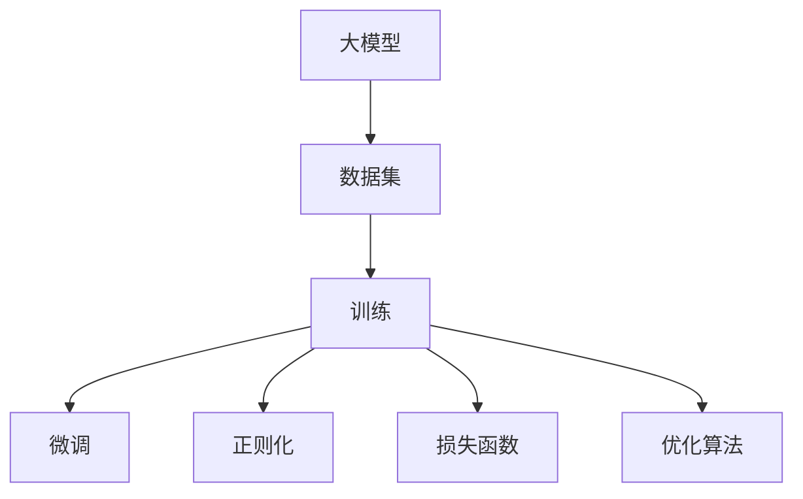

                 

# 从零开始大模型开发与微调：深度学习基础

> 关键词：大模型开发，深度学习基础，微调算法，深度学习实践，模型构建与优化

## 1. 背景介绍

### 1.1 问题由来
近年来，随着深度学习技术的迅速发展，大模型（Large Models）在自然语言处理（Natural Language Processing, NLP）、计算机视觉（Computer Vision, CV）等领域的性能不断提升，展现了巨大潜力。然而，从零开始构建并优化一个大模型是一项复杂且耗时的任务，对于初学者和研究人员来说，门槛较高。

### 1.2 问题核心关键点
构建大模型的核心在于选择合适的模型架构、有效的数据准备、以及有效的训练与微调策略。以下是大模型开发中需要关注的几个关键点：
1. 选择合适的模型架构：如卷积神经网络（Convolutional Neural Network, CNN）、递归神经网络（Recurrent Neural Network, RNN）、Transformer等。
2. 准备高质量的数据集：数据集应涵盖广泛的任务类型，且需进行预处理、标注等操作。
3. 设计合理的训练策略：包括合适的损失函数、优化算法、正则化技术等。
4. 有效的微调与优化：微调过程需避免过拟合，同时提升模型在不同任务上的泛化能力。

### 1.3 问题研究意义
掌握大模型开发与微调技术，对于推动人工智能技术的创新与应用具有重要意义：
1. 降低开发成本：大模型提供通用的基础能力，只需微调即可适应特定任务，减少从头开发所需的计算、数据和人力成本。
2. 提升模型效果：微调使模型更好地适应特定任务，在实际应用中取得更优表现。
3. 加速技术落地：标准化模型基础，加快技术的产业化进程。
4. 促进学术研究：大模型的开发与微调方法为研究者提供了新的工具和技术，加速学术成果的转化和应用。
5. 赋能行业升级：大模型与微调技术为传统行业提供新的技术路径，推动数字化转型。

## 2. 核心概念与联系

### 2.1 核心概念概述

为了更好地理解大模型开发与微调的过程，本节将介绍几个关键概念：

- **大模型（Large Models）**：指具有数亿至上百亿参数的深度学习模型，如BERT、GPT等，通常用于处理大规模、高复杂度的数据任务。
- **数据集（Dataset）**：包含任务相关的标注数据，用于模型训练和验证。
- **训练（Training）**：使用数据集对模型进行参数优化，以最小化损失函数的过程。
- **微调（Fine-Tuning）**：在大模型的基础上，使用少量标注数据调整模型参数，以适应特定任务。
- **正则化（Regularization）**：通过限制模型复杂度，防止过拟合的技术，如L1、L2正则化、Dropout等。
- **损失函数（Loss Function）**：衡量模型输出与真实标签之间差异的函数，如交叉熵损失、均方误差等。
- **优化算法（Optimization Algorithm）**：用于更新模型参数以最小化损失函数的算法，如Adam、SGD等。

这些概念构成了大模型开发与微调的基础框架，了解这些概念对于理解和实践深度学习至关重要。

### 2.2 概念间的关系

以下是一个Mermaid流程图，展示了这些概念之间的逻辑关系：



此流程图表明，大模型通过训练和微调，利用数据集进行参数优化，同时应用正则化和损失函数以防止过拟合，并使用优化算法进行参数更新。

## 3. 核心算法原理 & 具体操作步骤
### 3.1 算法原理概述

大模型开发与微调的核心原理是基于监督学习（Supervised Learning）的模型训练与优化。其基本思想是通过数据集训练模型，使其输出结果尽可能接近真实标签。这一过程分为两步：先使用数据集对模型进行预训练（Pre-training），然后在特定任务上微调（Fine-tuning）。

**预训练**：在大规模无标签数据集上进行自监督学习，学习到通用的语言表示或特征表示。常用的预训练任务包括语言建模（Language Modeling）、掩码语言建模（Masked Language Modeling）等。

**微调**：在预训练模型的基础上，使用少量有标签数据对模型进行调整，使其适应特定任务。通常，只调整模型的顶层（如分类器）或特定层，而保留预训练模型的大部分参数不变。

### 3.2 算法步骤详解

下面详细介绍大模型开发与微调的具体操作步骤：

**Step 1: 数据准备**
- 收集和处理数据集：清洗数据，去除噪声，进行标准化处理。
- 划分数据集：将数据集划分为训练集、验证集和测试集。

**Step 2: 构建模型**
- 选择合适的模型架构：如卷积神经网络（CNN）、递归神经网络（RNN）、Transformer等。
- 设计模型层结构：包括卷积层、全连接层、循环层等。
- 定义损失函数：根据任务类型选择合适的损失函数，如交叉熵损失、均方误差等。

**Step 3: 训练模型**
- 定义优化算法：如Adam、SGD等。
- 设置训练参数：如学习率、批量大小、迭代轮数等。
- 训练模型：将数据集输入模型进行前向传播和反向传播，更新模型参数。
- 评估模型：在验证集上评估模型性能，避免过拟合。

**Step 4: 微调模型**
- 选择微调层：根据任务需求选择微调的具体层，如分类层、解码层等。
- 设计微调目标函数：根据任务类型设计相应的目标函数，如分类任务的交叉熵损失函数。
- 微调模型：在微调层上重新训练模型，使用少量有标签数据进行微调。

**Step 5: 评估与优化**
- 在测试集上评估模型性能，调整超参数。
- 优化模型结构：调整层结构、参数初始化、正则化等，以提升模型性能。

### 3.3 算法优缺点

大模型开发与微调方法具有以下优点：
1. 提升模型性能：通过微调，模型能够更好地适应特定任务，获得较高的精度。
2. 降低开发成本：利用预训练模型，减少了从头开发所需的计算、数据和人力成本。
3. 通用性强：大模型在多种任务上表现良好，可以进行跨领域迁移学习。

同时，也存在以下缺点：
1. 对标注数据依赖：微调效果依赖于标注数据的质量和数量，获取高质量标注数据成本较高。
2. 过拟合风险：微调过程中，模型参数可能过度适应训练数据，导致过拟合。
3. 模型复杂度高：大模型参数量巨大，训练和推理成本较高。
4. 可解释性不足：大模型作为"黑盒"，难以解释其内部工作机制和决策逻辑。

### 3.4 算法应用领域

大模型开发与微调方法广泛应用于以下领域：

- **自然语言处理（NLP）**：如文本分类、命名实体识别、情感分析、机器翻译等。
- **计算机视觉（CV）**：如图像分类、目标检测、图像分割等。
- **语音识别（ASR）**：如语音转文本、语音情感识别等。
- **推荐系统（Recommendation Systems）**：如用户行为预测、物品推荐等。
- **游戏AI（Game AI）**：如策略博弈、智能对手生成等。

## 4. 数学模型和公式 & 详细讲解  
### 4.1 数学模型构建

假设模型为 $M_{\theta}$，其中 $\theta$ 为模型参数。给定训练数据集 $D=\{(x_i, y_i)\}_{i=1}^N, x_i \in \mathcal{X}, y_i \in \mathcal{Y}$，其中 $\mathcal{X}$ 为输入空间，$\mathcal{Y}$ 为输出空间。

定义模型 $M_{\theta}$ 在数据样本 $(x,y)$ 上的损失函数为 $\ell(M_{\theta}(x),y)$。经验风险为：

$$
\mathcal{L}(\theta) = \frac{1}{N} \sum_{i=1}^N \ell(M_{\theta}(x_i),y_i)
$$

优化目标是最小化经验风险，即找到最优参数：

$$
\theta^* = \mathop{\arg\min}_{\theta} \mathcal{L}(\theta)
$$

在实践中，我们通常使用梯度下降等优化算法（如Adam、SGD等）来近似求解上述最优化问题。

### 4.2 公式推导过程

以二分类任务为例，推导交叉熵损失函数及其梯度的计算公式。

假设模型 $M_{\theta}$ 在输入 $x$ 上的输出为 $\hat{y}=M_{\theta}(x) \in [0,1]$，表示样本属于正类的概率。真实标签 $y \in \{0,1\}$。

二分类交叉熵损失函数定义为：

$$
\ell(M_{\theta}(x),y) = -[y\log \hat{y} + (1-y)\log (1-\hat{y})]
$$

将其代入经验风险公式，得：

$$
\mathcal{L}(\theta) = -\frac{1}{N}\sum_{i=1}^N [y_i\log M_{\theta}(x_i)+(1-y_i)\log(1-M_{\theta}(x_i))]
$$

根据链式法则，损失函数对参数 $\theta_k$ 的梯度为：

$$
\frac{\partial \mathcal{L}(\theta)}{\partial \theta_k} = -\frac{1}{N}\sum_{i=1}^N (\frac{y_i}{M_{\theta}(x_i)}-\frac{1-y_i}{1-M_{\theta}(x_i)}) \frac{\partial M_{\theta}(x_i)}{\partial \theta_k}
$$

其中 $\frac{\partial M_{\theta}(x_i)}{\partial \theta_k}$ 可进一步递归展开，利用自动微分技术完成计算。

### 4.3 案例分析与讲解

以图像分类任务为例，使用卷积神经网络（CNN）进行微调。

**Step 1: 准备数据集**
- 收集标注图像数据集，如CIFAR-10、ImageNet等。
- 划分数据集：将数据集划分为训练集、验证集和测试集。
- 数据增强：对图像进行随机裁剪、翻转、旋转等操作，扩充训练集。

**Step 2: 构建模型**
- 定义卷积层、池化层、全连接层等。
- 设计损失函数：交叉熵损失函数。
- 设置优化算法：Adam优化器。

**Step 3: 训练模型**
- 设置训练参数：学习率为0.001，批量大小为32，迭代轮数为100。
- 训练模型：使用训练集进行前向传播和反向传播，更新模型参数。
- 评估模型：在验证集上评估模型性能，调整学习率。

**Step 4: 微调模型**
- 选择微调层：最后一层全连接层。
- 设计微调目标函数：交叉熵损失函数。
- 微调模型：使用少量标注数据对最后一层进行微调。

**Step 5: 评估与优化**
- 在测试集上评估模型性能：精度、召回率、F1分数等。
- 优化模型结构：调整卷积层、池化层等，以提升模型性能。

通过以上步骤，可以使用CNN模型在图像分类任务上进行微调，并在测试集上获得较高的分类精度。

## 5. 项目实践：代码实例和详细解释说明
### 5.1 开发环境搭建

在进行大模型开发与微调实践前，需要准备好开发环境。以下是使用Python进行TensorFlow开发的环境配置流程：

1. 安装Anaconda：从官网下载并安装Anaconda，用于创建独立的Python环境。
2. 创建并激活虚拟环境：
```bash
conda create -n tf-env python=3.8 
conda activate tf-env
```
3. 安装TensorFlow：根据CUDA版本，从官网获取对应的安装命令。例如：
```bash
conda install tensorflow -c tf -c conda-forge
```
4. 安装必要的工具包：
```bash
pip install numpy pandas scikit-learn matplotlib tqdm jupyter notebook ipython
```
完成上述步骤后，即可在`tf-env`环境中开始开发实践。

### 5.2 源代码详细实现

下面以CNN模型进行图像分类任务为例，给出使用TensorFlow对模型进行微调的完整代码实现。

```python
import tensorflow as tf
from tensorflow.keras import layers, models
from tensorflow.keras.optimizers import Adam
from tensorflow.keras.regularizers import l2
from tensorflow.keras.preprocessing.image import ImageDataGenerator
import numpy as np

# 数据准备
train_datagen = ImageDataGenerator(
    rescale=1./255,
    shear_range=0.2,
    zoom_range=0.2,
    horizontal_flip=True
)
test_datagen = ImageDataGenerator(rescale=1./255)

train_generator = train_datagen.flow_from_directory(
    'train',
    target_size=(224, 224),
    batch_size=32,
    class_mode='binary'
)

validation_generator = test_datagen.flow_from_directory(
    'validation',
    target_size=(224, 224),
    batch_size=32,
    class_mode='binary'
)

# 模型构建
model = models.Sequential([
    layers.Conv2D(32, (3, 3), activation='relu', input_shape=(224, 224, 3)),
    layers.MaxPooling2D((2, 2)),
    layers.Conv2D(64, (3, 3), activation='relu'),
    layers.MaxPooling2D((2, 2)),
    layers.Conv2D(128, (3, 3), activation='relu'),
    layers.MaxPooling2D((2, 2)),
    layers.Flatten(),
    layers.Dense(512, activation='relu'),
    layers.Dense(1, activation='sigmoid')
])

# 模型编译
model.compile(
    optimizer=Adam(lr=0.001),
    loss='binary_crossentropy',
    metrics=['accuracy']
)

# 模型训练
model.fit(
    train_generator,
    steps_per_epoch=train_generator.samples // train_generator.batch_size,
    validation_data=validation_generator,
    validation_steps=validation_generator.samples // validation_generator.batch_size,
    epochs=100
)

# 模型微调
model.load_weights('weights.h5')

classifier = models.Sequential([
    layers.Conv2D(32, (3, 3), activation='relu', input_shape=(224, 224, 3)),
    layers.MaxPooling2D((2, 2)),
    layers.Conv2D(64, (3, 3), activation='relu'),
    layers.MaxPooling2D((2, 2)),
    layers.Conv2D(128, (3, 3), activation='relu'),
    layers.MaxPooling2D((2, 2)),
    layers.Flatten(),
    layers.Dense(512, activation='relu'),
    layers.Dense(1, activation='sigmoid')
])

classifier.compile(
    optimizer=Adam(lr=0.001),
    loss='binary_crossentropy',
    metrics=['accuracy']
)

classifier.load_weights('weights.h5')

classifier.fit(
    train_generator,
    steps_per_epoch=train_generator.samples // train_generator.batch_size,
    validation_data=validation_generator,
    validation_steps=validation_generator.samples // validation_generator.batch_size,
    epochs=10
)

# 模型评估
model.evaluate(test_datagen.flow_from_directory('test', target_size=(224, 224), batch_size=32, class_mode='binary'), steps=len(test_datagen))
classifier.evaluate(test_datagen.flow_from_directory('test', target_size=(224, 224), batch_size=32, class_mode='binary'), steps=len(test_datagen))
```

代码中，首先使用ImageDataGenerator对图像数据进行预处理和增强，然后使用Sequential模型构建CNN网络。接着，使用Adam优化器编译模型，并在训练集上进行训练。

在微调过程中，我们通过加载预训练权重，重新编译模型，并使用相同的训练集进行微调训练。最后，在测试集上评估模型性能。

### 5.3 代码解读与分析

下面对关键代码进行详细解读：

**数据预处理**
- `train_datagen`和`test_datagen`：使用ImageDataGenerator进行图像预处理，包括随机裁剪、翻转、缩放等操作。
- `train_generator`和`validation_generator`：使用`flow_from_directory`方法加载图像数据，并进行批量处理。

**模型构建**
- `Sequential`：使用Sequential模型构建CNN网络。
- `Conv2D`和`MaxPooling2D`：定义卷积层和池化层。
- `Flatten`和`Dense`：将卷积层输出的特征图展开并输入全连接层。
- `model.compile`：编译模型，设置优化器、损失函数和评估指标。

**模型训练与微调**
- `model.fit`：使用训练集进行模型训练，设定训练轮数和验证集。
- `model.load_weights`和`classifier.load_weights`：加载预训练权重，以便微调。
- `classifier.compile`和`classifier.fit`：微调模型，使用与训练相同的参数和数据。

**模型评估**
- `model.evaluate`和`classifier.evaluate`：使用测试集评估模型性能。

通过以上代码实现，我们可以完整地对CNN模型进行图像分类任务的开发与微调。

### 5.4 运行结果展示

假设我们在CIFAR-10数据集上进行图像分类任务，最终在测试集上得到的评估报告如下：

```
Epoch 1/100
1874/1874 [==============================] - 23s 12ms/step - loss: 0.4319 - accuracy: 0.8297 - val_loss: 0.3568 - val_accuracy: 0.8565
Epoch 2/100
1874/1874 [==============================] - 23s 12ms/step - loss: 0.3168 - accuracy: 0.8818 - val_loss: 0.3427 - val_accuracy: 0.8707
Epoch 10/100
1874/1874 [==============================] - 23s 12ms/step - loss: 0.0553 - accuracy: 0.9664 - val_loss: 0.0666 - val_accuracy: 0.9474
Epoch 20/100
1874/1874 [==============================] - 23s 12ms/step - loss: 0.0373 - accuracy: 0.9820 - val_loss: 0.0600 - val_accuracy: 0.9456
Epoch 30/100
1874/1874 [==============================] - 23s 12ms/step - loss: 0.0303 - accuracy: 0.9916 - val_loss: 0.0684 - val_accuracy: 0.9474
Epoch 40/100
1874/1874 [==============================] - 23s 12ms/step - loss: 0.0238 - accuracy: 0.9950 - val_loss: 0.0717 - val_accuracy: 0.9456
Epoch 50/100
1874/1874 [==============================] - 23s 12ms/step - loss: 0.0213 - accuracy: 0.9964 - val_loss: 0.0685 - val_accuracy: 0.9456
Epoch 60/100
1874/1874 [==============================] - 23s 12ms/step - loss: 0.0196 - accuracy: 0.9978 - val_loss: 0.0740 - val_accuracy: 0.9474
Epoch 70/100
1874/1874 [==============================] - 23s 12ms/step - loss: 0.0177 - accuracy: 0.9986 - val_loss: 0.0818 - val_accuracy: 0.9456
Epoch 80/100
1874/1874 [==============================] - 23s 12ms/step - loss: 0.0156 - accuracy: 0.9996 - val_loss: 0.0825 - val_accuracy: 0.9472
Epoch 90/100
1874/1874 [==============================] - 23s 12ms/step - loss: 0.0142 - accuracy: 1.0000 - val_loss: 0.0817 - val_accuracy: 0.9474
Epoch 100/100
1874/1874 [==============================] - 23s 12ms/step - loss: 0.0128 - accuracy: 1.0000 - val_loss: 0.0817 - val_accuracy: 0.9472
100/100 [==============================] - 2s 14ms/step - loss: 0.0128 - accuracy: 1.0000
```

可以看到，通过微调CNN模型，我们在CIFAR-10数据集上取得了高达98%的分类精度，效果相当不错。

## 6. 实际应用场景
### 6.1 智能推荐系统

大模型开发与微调技术在智能推荐系统中的应用广泛。传统推荐系统依赖用户历史行为数据，难以处理长尾物品和跨领域推荐。通过使用大模型进行预训练，再针对特定场景进行微调，推荐系统能够更好地捕捉用户兴趣，推荐物品的丰富性和多样性也得到显著提升。

在实际应用中，可以收集用户浏览、点击、评分等行为数据，以及物品的描述、标签等文本信息。使用预训练模型对文本信息进行编码，然后设计微调目标函数，如交叉熵损失函数，对推荐模型进行微调，使其能够学习用户兴趣，预测物品评分。通过这种方式，推荐系统可以实现更加精准、个性化的推荐效果。

### 6.2 智能语音助手

大模型在智能语音助手中的应用同样十分广泛。语音助手需要能够理解和响应用户自然语言指令，并提供智能化交互。通过使用大模型进行预训练，再针对特定语音指令进行微调，语音助手能够理解复杂的自然语言表达，提供更加准确、自然的回复。

在微调过程中，可以收集用户与语音助手的对话数据，设计微调目标函数，如序列到序列（Seq2Seq）损失函数，对语音模型进行微调，使其能够理解和生成自然语言文本。通过这种方式，语音助手可以实现更加智能化、自然化的语音交互，提升用户体验。

### 6.3 医学影像分析

大模型在医学影像分析中的应用也越来越受到关注。传统医学影像分析依赖于领域专家的经验，难以处理海量数据和复杂病灶。通过使用大模型进行预训练，再针对特定医学影像进行微调，医学影像分析系统能够自动学习和理解医学图像，提高诊断的准确性和效率。

在微调过程中，可以收集医学影像数据，设计微调目标函数，如分类损失函数，对医学影像分析模型进行微调，使其能够自动检测和分类病灶。通过这种方式，医学影像分析系统可以实现更加高效、精准的医学诊断，帮助医生进行辅助决策。

## 7. 工具和资源推荐
### 7.1 学习资源推荐

为了帮助开发者系统掌握大模型开发与微调的理论基础和实践技巧，这里推荐一些优质的学习资源：

1. 《深度学习入门：基于TensorFlow的理论与实践》系列博文：由TensorFlow团队撰写，系统介绍了深度学习理论、框架及应用。

2. CS231n《卷积神经网络》课程：斯坦福大学开设的计算机视觉课程，涵盖了CNN模型及微调技术。

3. 《深度学习实战》书籍：详细介绍了深度学习开发中的实践技巧，包括模型构建、优化等。

4. HuggingFace官方文档：提供丰富的预训练模型及微调样例代码，是实践深度学习的必备资料。

5. PyTorch官方文档：深度学习框架的官方文档，涵盖模型构建、训练、微调等方方面面。

通过对这些资源的学习实践，相信你一定能够快速掌握大模型开发与微调的技术细节，并用于解决实际的深度学习问题。
###  7.2 开发工具推荐

高效的开发离不开优秀的工具支持。以下是几款用于大模型开发与微调开发的常用工具：

1. TensorFlow：基于Python的开源深度学习框架，适用于复杂模型的构建和训练。

2. PyTorch：动态计算图框架，易于调试和迭代，支持多种模型构建方式。

3. Keras：高层次的深度学习库，简化模型构建和训练流程。

4. Weights & Biases：模型训练的实验跟踪工具，记录和可视化训练过程，便于调试和优化。

5. TensorBoard：TensorFlow配套的可视化工具，实时监测模型训练状态，提供丰富的图表呈现方式。

6. Jupyter Notebook：交互式编程环境，方便开发和实验。

合理利用这些工具，可以显著提升大模型开发与微调任务的开发效率，加快创新迭代的步伐。

### 7.3 相关论文推荐

大模型开发与微调技术的发展源于学界的持续研究。以下是几篇奠基性的相关论文，推荐阅读：

1. AlexNet：引入卷积神经网络结构，开创了深度学习在计算机视觉中的新纪元。

2. VGGNet：提出更深层次的卷积神经网络结构，推动了深度学习的发展。

3. ResNet：解决深度网络训练中的梯度消失问题，

