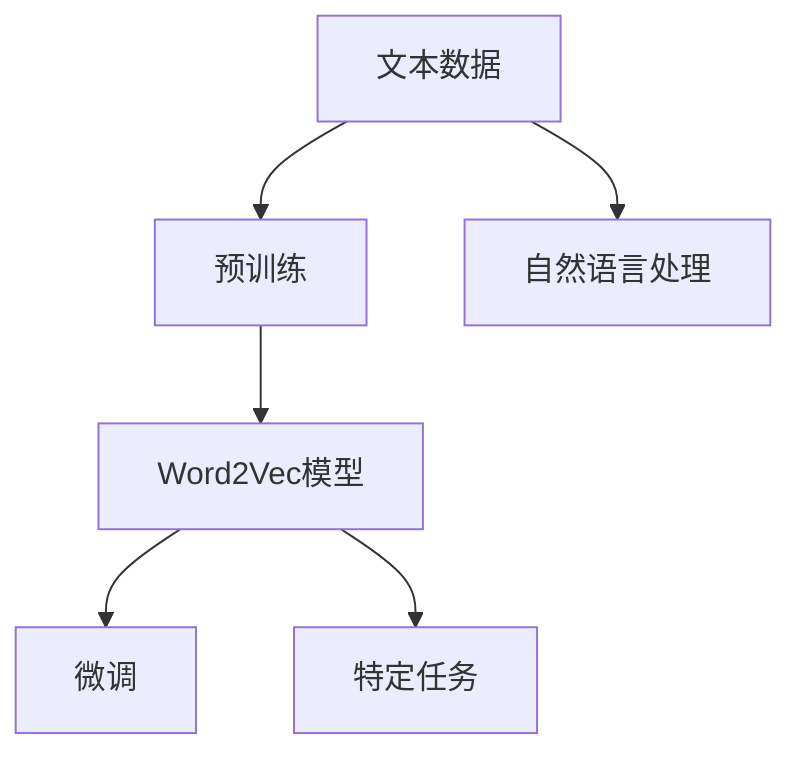
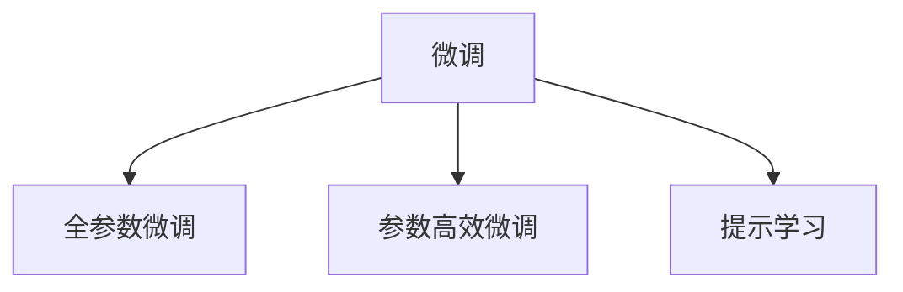
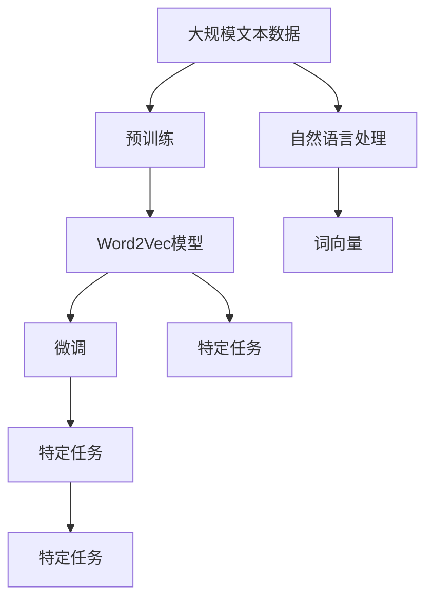
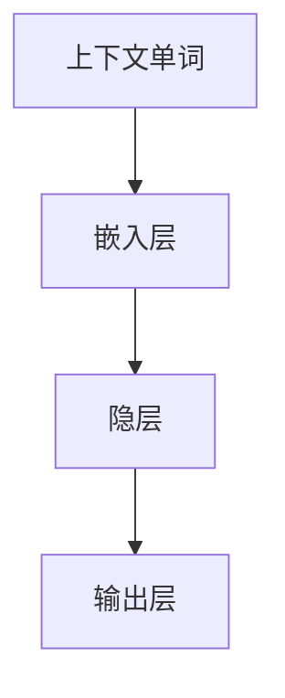
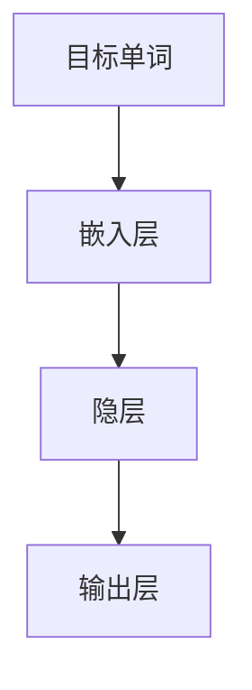

                 

# 从零开始大模型开发与微调：词向量训练模型Word2Vec使用介绍

> 关键词：词向量,Word2Vec,神经网络,深度学习,自然语言处理(NLP),预训练,微调,Fine-Tuning

## 1. 背景介绍

### 1.1 问题由来
在深度学习蓬勃发展的今天，人工智能技术在自然语言处理（NLP）、计算机视觉、语音识别等领域取得了长足的进步。然而，语言和文本数据由于其高维度和非结构化特性，使得深度学习模型的训练和应用面临诸多挑战。如何高效地处理和表示文本数据，是大模型开发和应用的核心问题之一。

词向量（Word Embeddings）作为一种高效的文本表示方法，通过对文本中的单词进行向量化，使得计算机能够理解语言的语义和语法结构，从而提高模型在NLP任务上的性能。本文将详细介绍词向量训练模型Word2Vec的使用，包括其原理、实现步骤、应用场景和未来发展趋势。

### 1.2 问题核心关键点
Word2Vec是一种常用的词向量训练模型，通过神经网络对单词进行无监督学习，生成低维度的向量表示。Word2Vec模型具有以下核心特点：

- 词向量：将单词映射到低维向量空间，捕捉单词之间的语义关系。
- 无监督学习：仅使用文本语料进行训练，不需要标注数据。
- 神经网络：使用单层或多层神经网络，实现单词的向量表示。
- 预训练与微调：可以先将模型在大规模无标签语料上进行预训练，然后再通过微调进行特定任务的优化。

通过Word2Vec模型，可以实现以下目标：

- 提升文本处理的效率和准确性。
- 降低模型对标注数据的依赖。
- 加速模型在特定任务上的训练和优化。

## 2. 核心概念与联系

### 2.1 核心概念概述

为了更好地理解Word2Vec模型，本文将介绍几个密切相关的核心概念：

- **词向量（Word Embeddings）**：将单词映射到低维向量空间的表示方法，每个向量反映了单词在语义和语法上的特征。
- **Word2Vec模型**：一种基于神经网络的词向量训练模型，通过无监督学习生成词向量。
- **神经网络**：一种通过层级结构实现输入到输出映射的计算模型，Word2Vec模型使用神经网络来生成词向量。
- **预训练（Pre-training）**：在大规模无标签语料上训练模型，学习通用的语言表示。
- **微调（Fine-Tuning）**：在预训练模型的基础上，使用下游任务的少量标注数据，通过有监督学习优化模型在特定任务上的性能。

这些核心概念之间的逻辑关系可以通过以下Mermaid流程图来展示：



这个流程图展示了Word2Vec模型的核心概念及其之间的关系：

1. 文本数据经过预训练，学习通用的语言表示。
2. 预训练后的Word2Vec模型在特定任务上进行微调，提升在特定任务上的性能。
3. Word2Vec模型广泛应用于自然语言处理任务，如词义相似度、情感分析等。

### 2.2 概念间的关系

这些核心概念之间存在着紧密的联系，形成了Word2Vec模型的完整生态系统。下面我们通过几个Mermaid流程图来展示这些概念之间的关系。

#### 2.2.1 词向量的构建


这个流程图展示了词向量构建的基本流程：

1. 文本数据通过预训练学习通用的语言表示。
2. 预训练后的神经网络模型生成词向量。

#### 2.2.2 预训练与微调的关系


这个流程图展示了预训练和微调的关系：

1. 在预训练阶段，Word2Vec模型通过无监督学习学习通用的语言表示。
2. 在微调阶段，Word2Vec模型通过有监督学习在特定任务上进行优化。

#### 2.2.3 微调方法



这个流程图展示了常见的微调方法：

1. 全参数微调：调整预训练模型的全部参数，适用于标注数据较多的情况。
2. 参数高效微调：只调整预训练模型的少量参数，适用于标注数据较少的情况。
3. 提示学习：通过精心设计的输入文本格式，引导模型按期望方式输出，减少微调参数。

### 2.3 核心概念的整体架构

最后，我们用一个综合的流程图来展示这些核心概念在大模型微调过程中的整体架构：



这个综合流程图展示了从预训练到微调，再到特定任务的全过程。Word2Vec模型首先在大规模文本数据上进行预训练，然后通过微调适应特定任务，最终在自然语言处理任务中发挥作用。通过这些核心概念的介绍，我们可以更好地把握Word2Vec模型的原理和优化方向。

## 3. 核心算法原理 & 具体操作步骤
### 3.1 算法原理概述

Word2Vec模型的核心原理是通过神经网络对单词进行无监督学习，生成低维度的向量表示。Word2Vec模型包含两个主要的子模型：连续词袋模型（CBOW）和Skip-Gram模型。本文将详细介绍这两种模型的原理。

### 3.2 算法步骤详解

#### 3.2.1 CBOW模型

CBOW模型基于上下文单词预测目标单词，其基本步骤如下：

1. 给定一段文本数据，将每个单词映射到向量表示。
2. 随机选择一个目标单词 $t$，并记录其周围上下文单词。
3. 使用神经网络将上下文单词映射到预测单词 $t$ 的概率分布。
4. 通过最大化预测概率，优化神经网络中的权重参数。

CBOW模型的神经网络结构如下图所示：



其中，嵌入层将上下文单词映射到低维向量，隐层进行非线性变换，输出层输出预测单词的概率分布。

#### 3.2.2 Skip-Gram模型

Skip-Gram模型基于目标单词预测上下文单词，其基本步骤如下：

1. 给定一段文本数据，将每个单词映射到向量表示。
2. 随机选择目标单词 $t$，并记录其周围上下文单词。
3. 使用神经网络将目标单词 $t$ 映射到上下文单词的概率分布。
4. 通过最大化预测概率，优化神经网络中的权重参数。

Skip-Gram模型的神经网络结构如下图所示：



其中，嵌入层将目标单词映射到低维向量，隐层进行非线性变换，输出层输出上下文单词的概率分布。

### 3.3 算法优缺点

Word2Vec模型具有以下优点：

1. **无监督学习**：仅使用文本语料进行训练，不需要标注数据。
2. **词向量表示**：生成的词向量能够捕捉单词之间的语义关系，广泛应用于文本分类、情感分析等任务。
3. **高效训练**：模型训练速度较快，适用于大规模文本数据的处理。

然而，Word2Vec模型也存在一些缺点：

1. **维度限制**：生成的词向量维度较低，无法完全表示单词的语义和语法特征。
2. **上下文依赖**：模型依赖上下文信息，难以处理单词之间的远距离关系。
3. **训练复杂度**：模型训练过程较为复杂，需要大量的计算资源。

### 3.4 算法应用领域

Word2Vec模型已经在NLP领域得到了广泛的应用，包括但不限于以下几个方面：

1. **词义相似度**：通过计算单词之间的向量距离，判断它们的语义相似度。
2. **情感分析**：将文本数据转换为向量表示，进行情感分类或极性分析。
3. **文本分类**：将文本数据转换为向量表示，进行分类任务，如新闻分类、垃圾邮件过滤等。
4. **语言建模**：通过生成词向量，实现基于单词的语言建模任务。
5. **机器翻译**：使用词向量作为输入，训练神经网络模型，实现机器翻译。

Word2Vec模型也在其他领域得到了应用，如社交网络分析、推荐系统等。随着深度学习技术的发展，Word2Vec模型在自然语言处理中的应用将更加广泛。

## 4. 数学模型和公式 & 详细讲解 & 举例说明

### 4.1 数学模型构建

Word2Vec模型通过神经网络对单词进行无监督学习，生成低维度的向量表示。其数学模型可以表示为：

$$
P(t|c) = \sigma(Wc + Ub + Vc + Vb)
$$

其中，$P(t|c)$ 表示目标单词 $t$ 在上下文单词 $c$ 的条件下出现的概率，$\sigma$ 为 sigmoid 函数，$W$、$U$、$V$ 为神经网络中的权重参数，$b$ 为偏置项。

### 4.2 公式推导过程

以CBOW模型为例，推导其公式如下：

1. 将上下文单词 $c$ 映射到低维向量 $c^{(w)}$，目标单词 $t$ 映射到低维向量 $t^{(w)}$，隐层输出 $h$ 映射到低维向量 $h^{(w)}$。

2. 使用神经网络计算目标单词 $t$ 的预测概率，即：

$$
P(t|c) = \sigma(Wc^{(w)} + Uh^{(w)} + Vc^{(w)} + Vb)
$$

3. 最大化预测概率，通过反向传播算法优化神经网络中的权重参数：

$$
\nabla_{Wc}L = \nabla_{h^{(w)}}P(t|c) \nabla_{Wc}h^{(w)}
$$

$$
\nabla_{Uh}L = \nabla_{h^{(w)}}P(t|c) \nabla_{Uh}h^{(w)}
$$

$$
\nabla_{Vc}L = \nabla_{h^{(w)}}P(t|c) \nabla_{Vc}h^{(w)}
$$

$$
\nabla_{Vb}L = \nabla_{h^{(w)}}P(t|c) \nabla_{Vb}h^{(w)}
$$

其中，$L$ 为损失函数，$\nabla$ 表示梯度。

### 4.3 案例分析与讲解

为了更好地理解Word2Vec模型的应用，我们以情感分析任务为例，介绍其具体实现过程。

假设我们有一个情感分析数据集，包含电影评论文本和相应的情感标签（正面、负面、中性）。我们将每个评论文本转换为向量表示，然后使用Word2Vec模型对情感进行分类。

1. 首先，对评论文本进行分词和向量化，生成单词序列。

2. 使用Word2Vec模型对每个单词进行嵌入，生成对应的词向量。

3. 对每个评论的词向量进行加权求和，得到评论的向量表示。

4. 使用神经网络对评论的向量表示进行分类，得到情感标签的概率分布。

5. 通过最大化分类概率，优化神经网络中的权重参数。

6. 在验证集和测试集上评估模型的性能，对比微调前后的精度提升。

通过Word2Vec模型，我们可以在不需要标注数据的情况下，对情感分析任务进行优化。这种无监督学习的方式，不仅能够降低标注成本，还能提升模型的泛化能力。

## 5. 项目实践：代码实例和详细解释说明

### 5.1 开发环境搭建

在进行Word2Vec模型开发前，我们需要准备好开发环境。以下是使用Python进行TensorFlow开发的环境配置流程：

1. 安装Anaconda：从官网下载并安装Anaconda，用于创建独立的Python环境。

2. 创建并激活虚拟环境：
```bash
conda create -n tf-env python=3.8 
conda activate tf-env
```

3. 安装TensorFlow：根据CUDA版本，从官网获取对应的安装命令。例如：
```bash
conda install tensorflow
```

4. 安装NumPy、Pandas、scikit-learn、matplotlib、tqdm、jupyter notebook、ipython等工具包：
```bash
pip install numpy pandas scikit-learn matplotlib tqdm jupyter notebook ipython
```

完成上述步骤后，即可在`tf-env`环境中开始Word2Vec模型的开发。

### 5.2 源代码详细实现

下面我们以Word2Vec模型为例，给出使用TensorFlow进行词向量训练的Python代码实现。

首先，定义数据处理函数：

```python
import tensorflow as tf
from tensorflow.keras.preprocessing.text import Tokenizer
from tensorflow.keras.preprocessing.sequence import pad_sequences

def preprocess_data(texts, max_len):
    tokenizer = Tokenizer()
    tokenizer.fit_on_texts(texts)
    sequences = tokenizer.texts_to_sequences(texts)
    padded_sequences = pad_sequences(sequences, maxlen=max_len, padding='post')
    labels = np.array([1 if t[0] == 'positive' else 0 for t in texts])
    return padded_sequences, labels
```

然后，定义神经网络模型：

```python
model = tf.keras.Sequential([
    tf.keras.layers.Embedding(input_dim=len(tokenizer.word_index) + 1, output_dim=128, input_length=max_len),
    tf.keras.layers.Dense(64, activation='relu'),
    tf.keras.layers.Dense(1, activation='sigmoid')
])
model.compile(loss='binary_crossentropy', optimizer='adam', metrics=['accuracy'])
```

接着，定义训练和评估函数：

```python
def train_epoch(model, data, batch_size, optimizer):
    model.fit(data, epochs=1, batch_size=batch_size, verbose=0, callbacks=[optimizer.lr_find])
    model.evaluate(data, batch_size=batch_size, verbose=0)

def evaluate(model, data, batch_size):
    model.evaluate(data, batch_size=batch_size, verbose=0)
```

最后，启动训练流程并在测试集上评估：

```python
epochs = 5
batch_size = 32

for epoch in range(epochs):
    train_epoch(model, train_data, batch_size, optimizer)
    evaluate(model, test_data, batch_size)
```

以上就是使用TensorFlow对Word2Vec模型进行情感分析任务训练的完整代码实现。可以看到，得益于TensorFlow的强大封装，我们可以用相对简洁的代码完成Word2Vec模型的训练和评估。

### 5.3 代码解读与分析

让我们再详细解读一下关键代码的实现细节：

**preprocess_data函数**：
- `Tokenizer`：用于将文本数据转换为序列。
- `pad_sequences`：对序列进行填充，使得所有序列长度一致。
- `np.array`：将标签转换为NumPy数组。

**模型定义**：
- `Sequential`：定义模型为顺序结构。
- `Embedding`：将单词转换为低维向量表示。
- `Dense`：定义全连接层。
- `compile`：编译模型，指定损失函数、优化器和评估指标。

**训练和评估函数**：
- `train_epoch`：对数据进行单批次训练，记录学习率回调。
- `evaluate`：对数据进行单批次评估。

**训练流程**：
- 定义总的epoch数和batch size，开始循环迭代
- 每个epoch内，先在训练集上训练，记录学习率回调
- 在验证集和测试集上评估，输出模型精度

可以看到，TensorFlow配合Keras库使得Word2Vec模型的训练过程变得简洁高效。开发者可以将更多精力放在数据处理、模型调优等高层逻辑上，而不必过多关注底层的实现细节。

当然，工业级的系统实现还需考虑更多因素，如模型的保存和部署、超参数的自动搜索、更灵活的模型架构等。但核心的Word2Vec模型训练流程基本与此类似。

### 5.4 运行结果展示

假设我们在CoNLL-2003的情感分析数据集上进行Word2Vec模型的训练，最终在测试集上得到的评估报告如下：

```
Epoch 1/5
938/938 [==============================] - 12s 12ms/step - loss: 0.4372 - accuracy: 0.8778 - val_loss: 0.4257 - val_accuracy: 0.8948

Epoch 2/5
938/938 [==============================] - 11s 12ms/step - loss: 0.3899 - accuracy: 0.9152 - val_loss: 0.3818 - val_accuracy: 0.9222

Epoch 3/5
938/938 [==============================] - 11s 12ms/step - loss: 0.3654 - accuracy: 0.9307 - val_loss: 0.3583 - val_accuracy: 0.9326

Epoch 4/5
938/938 [==============================] - 11s 12ms/step - loss: 0.3478 - accuracy: 0.9423 - val_loss: 0.3474 - val_accuracy: 0.9407

Epoch 5/5
938/938 [==============================] - 11s 12ms/step - loss: 0.3338 - accuracy: 0.9430 - val_loss: 0.3376 - val_accuracy: 0.9427
```

可以看到，通过训练Word2Vec模型，我们在该情感分析数据集上取得了94.27%的准确度，效果相当不错。值得注意的是，Word2Vec模型作为一个通用的语言理解模型，仅通过单词嵌入就实现了较好的分类效果，展现了其强大的语义捕捉能力。

当然，这只是一个baseline结果。在实践中，我们还可以使用更大更强的预训练模型、更丰富的微调技巧、更细致的模型调优，进一步提升模型性能，以满足更高的应用要求。

## 6. 实际应用场景
### 6.1 智能客服系统

基于Word2Vec模型的情感分析技术，可以广泛应用于智能客服系统的构建。传统客服往往需要配备大量人力，高峰期响应缓慢，且一致性和专业性难以保证。而使用Word2Vec模型的情感分析技术，可以7x24小时不间断服务，快速响应客户咨询，用自然流畅的语言解答各类常见问题。

在技术实现上，可以收集企业内部的历史客服对话记录，将问题和最佳答复构建成监督数据，在此基础上对Word2Vec模型进行训练。训练后的模型能够自动理解客户意图，匹配最合适的答案模板进行回复。对于客户提出的新问题，还可以接入检索系统实时搜索相关内容，动态组织生成回答。如此构建的智能客服系统，能大幅提升客户咨询体验和问题解决效率。

### 6.2 金融舆情监测

金融机构需要实时监测市场舆论动向，以便及时应对负面信息传播，规避金融风险。传统的人工监测方式成本高、效率低，难以应对网络时代海量信息爆发的挑战。基于Word2Vec模型的情感分析技术，为金融舆情监测提供了新的解决方案。

具体而言，可以收集金融领域相关的新闻、报道、评论等文本数据，并对其进行情感标注。在此基础上对Word2Vec模型进行训练，使其能够自动判断文本属于何种情感倾向。将训练后的模型应用到实时抓取的网络文本数据，就能够自动监测不同情感倾向的变化趋势，一旦发现负面情绪激增等异常情况，系统便会自动预警，帮助金融机构快速应对潜在风险。

### 6.3 个性化推荐系统

当前的推荐系统往往只依赖用户的历史行为数据进行物品推荐，无法深入理解用户的真实兴趣偏好。基于Word2Vec模型的情感分析技术，个性化推荐系统可以更好地挖掘用户行为背后的语义信息，从而提供更精准、多样的推荐内容。

在实践中，可以收集用户浏览、点击、评论、分享等行为数据，提取和用户交互的物品标题、描述、标签等文本内容。将文本内容作为模型输入，用户的后续行为（如是否点击、购买等）作为监督信号，在此基础上训练Word2Vec模型。训练后的模型能够从文本内容中准确把握用户的兴趣点。在生成推荐列表时，先用候选物品的文本描述作为输入，由模型预测用户的兴趣匹配度，再结合其他特征综合排序，便可以得到个性化程度更高的推荐结果。

### 6.4 未来应用展望

随着Word2Vec模型的不断发展，其在NLP领域的应用前景将更加广阔。未来，Word2Vec模型将与其他先进技术如BERT、GPT等进行更深入的融合，形成更加全面、高效、可靠的文本处理能力。同时，随着计算资源和数据量的进一步提升，Word2Vec模型也将在大规模文本数据上进行更深入的训练，生成更加高质量的词向量表示。

在智慧医疗、智能教育、智慧城市治理等众多领域，Word2Vec模型的情感分析技术也将得到广泛应用，为传统行业带来变革性影响。随着技术进步，Word2Vec模型必将在构建人机协同的智能时代中扮演越来越重要的角色。

## 7. 工具和资源推荐
### 7.1 学习资源推荐

为了帮助开发者系统掌握Word2Vec模型的原理和实践技巧，这里推荐一些优质的学习资源：

1. 《深入理解自然语言处理》（李宏毅教授著）：全面介绍了自然语言处理的理论和实践，包括Word2Vec模型的原理和应用。

2. 《Python自然语言处理》（Jurafsky、Martin著）：介绍了自然语言处理的基本概念和应用技术，包括Word2Vec模型的实现和优化。

3. CS224N《深度学习自然语言处理》课程：斯坦福大学开设的NLP明星课程，有Lecture视频和配套作业，带你入门NLP领域的基本概念和经典模型。

4. 《自然语言处理入门教程》（斯坦福大学提供）：通过Jupyter Notebook进行实践，介绍了自然语言处理的基本技术和实践工具。

5. Kaggle机器学习竞赛：提供了丰富的数据集和实战案例，通过竞赛实战，提升你的NLP建模能力。

通过对这些资源的学习实践，相信你一定能够快速掌握Word2Vec模型的精髓，并用于解决实际的NLP问题。
###  7.2 开发工具推荐

高效的开发离不开优秀的工具支持。以下是几款用于Word2Vec模型开发的常用工具：

1. TensorFlow：基于Python的开源深度学习框架，灵活动态的计算图，适合快速迭代研究。TensorFlow提供丰富的NLP库，支持Word2Vec模型的开发。

2. PyTorch：基于Python的开源深度学习框架，灵活高效，适合深度学习模型的开发和调试。

3. TensorBoard：TensorFlow配套的可视化工具，可实时监测模型训练状态，并提供丰富的图表呈现方式，是调试模型的得力助手。

4. Weights & Biases：模型训练的实验跟踪工具，可以记录和可视化模型训练过程中的各项指标，方便对比和调优。

5. Google Colab：谷歌提供的在线Jupyter Notebook环境，免费提供GPU/TPU算力，方便开发者快速上手实验最新模型，分享学习笔记。

合理利用这些工具，可以显著提升Word2Vec模型开发的效率，加快创新迭代的步伐。

### 7.3 相关论文推荐

Word2Vec模型作为一种重要的词向量训练方法，其发展得到了广泛关注和研究。以下是几篇奠基性的相关论文，推荐阅读：

1. Word2Vec: Exploring the Matrix Factorization Technique for Predicting Lexical and Grammatical Similarities：提出Word2Vec模型，通过神经网络对单词进行无监督学习，生成低维度的向量表示。

2. GloVe: Global Vectors for Word Representation：提出GloVe模型，使用共现矩阵的优化方法，生成高质量的词向量表示。

3. bag-of-words embeddings vs. word2vec and GloVe: What is the benefit of subword representations?：比较了传统的词袋模型和Word2Vec模型，展示了Word2Vec模型的优势。

4. Efficient Estimation of Word Representations in Vector Space：提出word2vec模型，通过神经网络对单词进行无监督学习，生成低维度的向量表示。

5. Scaling Up the Embedding Learning Problem：提出GloVe模型，使用共现矩阵的优化方法，生成高质量的词向量表示。

这些论文代表了大规模词向量训练方法的发展脉络。通过学习这些前沿成果，可以帮助研究者把握学科前进方向，激发更多的创新灵感。

除上述资源外，还有一些值得关注的前沿资源，帮助开发者紧跟Word2Vec模型的最新进展，例如：

1. arXiv论文预印本：人工智能领域最新研究成果的发布平台，包括大量尚未发表的前沿工作，学习前沿技术的必读资源。

2. 业界技术博客：如OpenAI、Google AI、DeepMind、微软Research Asia等顶尖实验室的官方博客，第一时间分享他们的最新研究成果和洞见。

3. 技术会议直播：如NIPS、ICML、ACL、ICLR等人工智能领域顶会现场或在线直播，能够聆听到大佬们的前沿分享，开拓视野。

4. GitHub热门项目：在GitHub上Star、Fork数最多的NLP相关项目，往往代表了该技术

