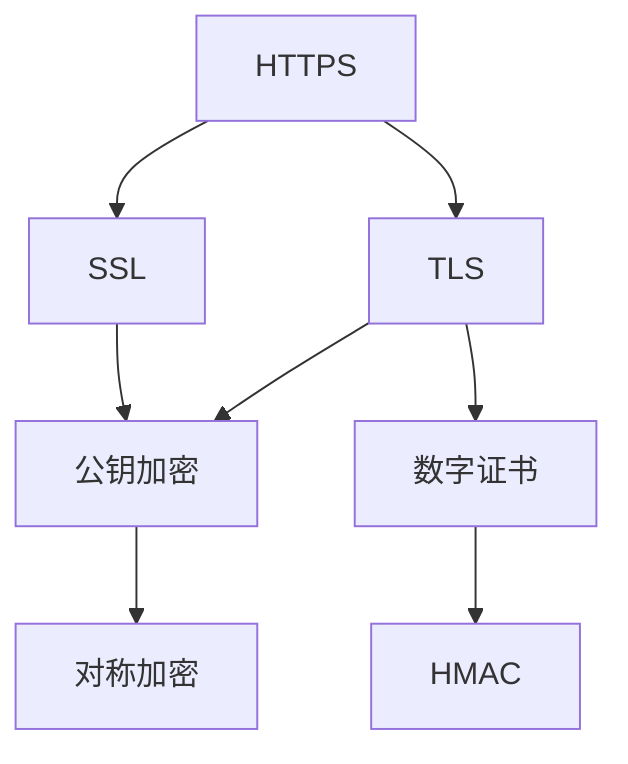
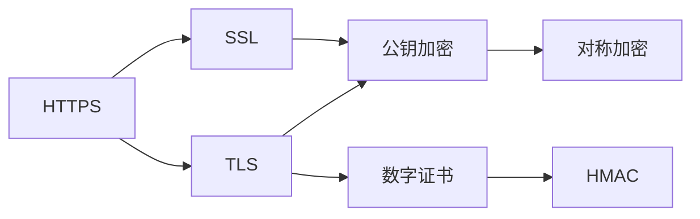
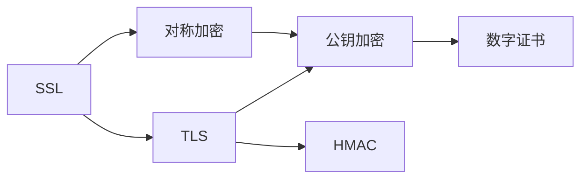
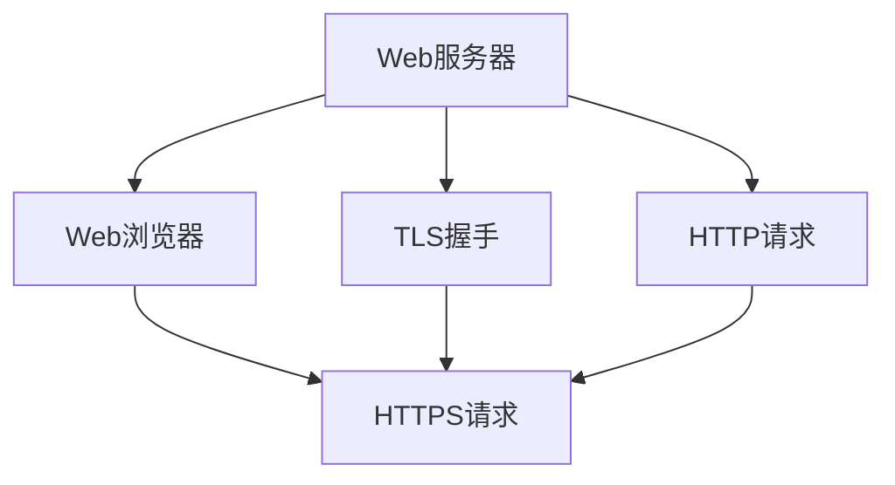
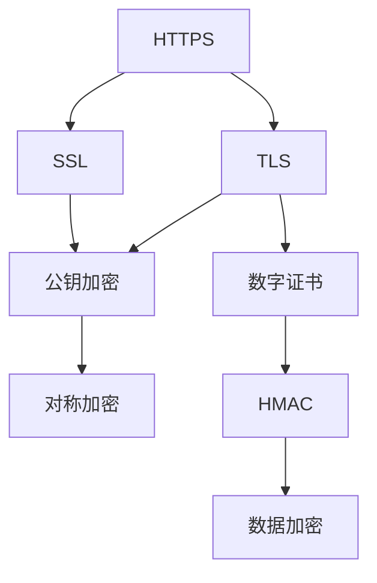

                 

# 使用 HTTPS 数据加密

## 1. 背景介绍

### 1.1 问题由来
在信息时代，数据加密技术是保障信息安全的基石。特别是在网络传输过程中，数据往往面临着被窃听、篡改等威胁。HTTPS（超文本传输安全协议）通过在网络传输层对数据进行加密，有效保护了用户隐私和数据完整性。

HTTPS的安全性建立在TLS（传输层安全协议）之上，TLS是对SSL（安全套接字层）的升级和改进。TLS采用公钥加密和数字证书机制，确保了通信双方的身份认证和数据机密性。

### 1.2 问题核心关键点
HTTPS的核心在于通过TLS协议实现数据加密和身份认证。TLS协议的工作流程包括握手阶段和数据传输阶段，详细过程如下：

1. **握手阶段**：
   - **客户端发起连接**：客户端向服务器发送一个握手请求。
   - **服务器响应请求**：服务器返回一个TLS协商数据包，包括其公钥、证书等信息。
   - **客户端验证证书**：客户端验证服务器的数字证书，确保证书未过期且由可信机构颁发。
   - **生成会话密钥**：客户端使用服务器的公钥加密一个随机数，并将加密结果发送给服务器。服务器使用其私钥解密该随机数，生成会话密钥。
   - **交换密钥确认**：双方交换随机数和生成的会话密钥，并确认对方未篡改。

2. **数据传输阶段**：
   - **加密数据**：客户端和服务器在会话密钥的基础上进行AES加密和解密，确保数据在传输过程中的机密性。
   - **验证完整性**：使用HMAC算法计算消息摘要，确保数据未被篡改。

TLS协议的这些过程确保了HTTPS的安全性和可靠性。

### 1.3 问题研究意义
HTTPS在保障互联网数据传输安全方面起到了重要作用，特别是在金融、电商、社交等高敏感领域，HTTPS是不可或缺的安全手段。

研究HTTPS数据加密方法，对于提升互联网应用的安全性，保护用户隐私，防止数据泄露，具有重要意义：

1. **保护隐私**：HTTPS加密了网络传输的数据，防止第三方窃听和分析用户行为。
2. **防止篡改**：TLS协议提供了数据的完整性验证，确保数据的真实性和未被篡改。
3. **身份认证**：通过数字证书机制，HTTPS可以实现对通信双方的身份认证，防止钓鱼网站攻击。
4. **促进信任**：可信的TLS证书可以增强用户对网站的安全信任度。
5. **推动应用**：HTTPS的普及使得越来越多的网站和应用必须实现SSL/TLS加密，推动了互联网安全技术的发展。

## 2. 核心概念与联系

### 2.1 核心概念概述

为更好地理解HTTPS数据加密原理，本节将介绍几个密切相关的核心概念：

- **HTTPS**：超文本传输安全协议，通过TLS协议实现数据加密和身份认证，保障了网络传输的安全性。
- **TLS**：传输层安全协议，是SSL的升级版，采用公钥加密和数字证书机制，确保了通信双方的身份认证和数据机密性。
- **SSL**：安全套接字层，是TLS的前身，主要通过对称加密和数字证书实现安全通信。
- **公钥加密**：使用公钥对数据进行加密，确保只有私钥持有人可以解密。
- **对称加密**：使用相同的密钥对数据进行加密和解密，加密速度快，但密钥管理复杂。
- **数字证书**：由可信机构颁发的证书，包含了公钥和证书持有者的身份信息，用于验证身份。
- **HMAC**：基于密钥的哈希算法，用于计算消息摘要，确保数据完整性。

这些核心概念之间的逻辑关系可以通过以下Mermaid流程图来展示：



这个流程图展示了大语言模型微调过程中各个核心概念的关系：

1. HTTPS建立在TLS之上，通过TLS实现数据加密和身份认证。
2. TLS是SSL的升级，采用公钥加密和数字证书机制。
3. SSL主要通过对称加密实现安全通信。
4. 公钥加密和对称加密结合使用，既保证了加密速度又提高了安全性。
5. HMAC用于计算消息摘要，确保数据完整性。

### 2.2 概念间的关系

这些核心概念之间存在着紧密的联系，形成了HTTPS数据加密的完整生态系统。下面我通过几个Mermaid流程图来展示这些概念之间的关系。

#### 2.2.1 HTTPS与TLS的关系



这个流程图展示了HTTPS和TLS的关系，以及TLS内部的公钥加密、对称加密和数字证书机制。

#### 2.2.2 SSL与TLS的关系



这个流程图展示了SSL和TLS的关系，以及TLS内部的公钥加密、对称加密和数字证书机制。

#### 2.2.3 HTTPS的应用场景



这个流程图展示了HTTPS在Web应用中的工作流程，从客户端发起HTTP请求，到服务器响应HTTPS请求，整个过程中采用了TLS加密和数字证书机制。

### 2.3 核心概念的整体架构

最后，我们用一个综合的流程图来展示这些核心概念在大语言模型微调过程中的整体架构：



这个综合流程图展示了HTTPS的工作流程，从客户端发起HTTPS请求，到服务器响应HTTPS请求，整个过程中采用了公钥加密、对称加密、数字证书和HMAC算法，确保了数据的安全性和完整性。

## 3. 核心算法原理 & 具体操作步骤
### 3.1 算法原理概述

HTTPS数据加密的原理建立在TLS协议之上，TLS协议采用了公钥加密和对称加密的混合加密机制，确保了数据的机密性和完整性。

TLS握手过程包括四个阶段：

1. **客户端发起连接**：客户端发送一个TLS客户端Hello消息，包含支持的TLS版本、加密套件、压缩算法等信息。
2. **服务器响应请求**：服务器返回一个TLS服务器Hello消息，包含支持的TLS版本、加密套件、压缩算法、证书等信息。
3. **客户端验证证书**：客户端验证服务器的数字证书，确保证书未过期且由可信机构颁发。
4. **生成会话密钥**：客户端和服务器使用公钥加密算法生成会话密钥，并在后续的通信中使用该密钥进行加密。

TLS协议的这些过程确保了HTTPS的安全性和可靠性。

### 3.2 算法步骤详解

以下是TLS协议握手阶段的详细步骤：

1. **客户端发起连接**：
   - 客户端向服务器发送一个TLS客户端Hello消息，包含支持的TLS版本、加密套件、压缩算法等信息。
   - 客户端生成一个随机数作为客户端随机数。

2. **服务器响应请求**：
   - 服务器返回一个TLS服务器Hello消息，包含支持的TLS版本、加密套件、压缩算法、数字证书等信息。
   - 服务器生成一个随机数作为服务器随机数。
   - 服务器从数字证书中提取公钥，用于后续加密和解密。

3. **客户端验证证书**：
   - 客户端验证服务器的数字证书，确保证书未过期且由可信机构颁发。
   - 客户端生成一个随机数作为会话密钥。
   - 客户端使用服务器的公钥加密会话密钥，并将加密结果发送给服务器。

4. **生成会话密钥**：
   - 服务器使用其私钥解密会话密钥。
   - 客户端和服务器都使用会话密钥和之前生成的随机数计算一个主密钥。
   - 客户端和服务器计算会话密钥，用于后续的加密和解密。

5. **交换密钥确认**：
   - 双方交换随机数和生成的会话密钥，并确认对方未篡改。

### 3.3 算法优缺点

TLS协议的优点在于：

- **安全性高**：TLS采用公钥加密和对称加密的混合加密机制，确保了数据的安全性和完整性。
- **灵活性高**：TLS支持多种加密套件和压缩算法，可以根据实际情况灵活选择。
- **适用范围广**：TLS适用于各种应用场景，包括Web、邮件、文件传输等。

TLS协议的缺点在于：

- **实现复杂**：TLS协议的实现较为复杂，需要处理证书验证、加密解密等细节。
- **性能损耗**：TLS协议的握手过程和加密解密过程会带来一定的性能开销。
- **安全性依赖证书**：TLS的安全性依赖于数字证书的有效性，一旦证书被篡改，整个通信过程将受到威胁。

### 3.4 算法应用领域

TLS协议广泛应用于各种网络通信场景，包括Web浏览器、电子邮件、文件传输、VPN等。以下是TLS协议在几个典型应用场景中的详细应用：

#### 3.4.1 Web浏览器

在Web浏览器中，TLS协议用于保护HTTPS请求的数据传输。具体流程如下：

1. 用户在浏览器中输入URL地址。
2. 浏览器发送HTTPS请求给Web服务器。
3. Web服务器返回一个TLS服务器Hello消息，包含数字证书。
4. 浏览器验证数字证书的有效性。
5. 浏览器和Web服务器通过公钥加密算法生成会话密钥。
6. 浏览器和Web服务器使用会话密钥进行数据加密和解密。
7. 浏览器和Web服务器通过HMAC算法计算消息摘要，确保数据完整性。

#### 3.4.2 电子邮件

在电子邮件中，TLS协议用于保护SMTP（简单邮件传输协议）和POP3（邮局协议版本3）等邮件传输协议的数据传输。具体流程如下：

1. 客户端向SMTP服务器发送SMTP请求。
2. SMTP服务器返回一个TLS服务器Hello消息，包含数字证书。
3. 客户端验证数字证书的有效性。
4. 客户端和SMTP服务器通过公钥加密算法生成会话密钥。
5. 客户端和SMTP服务器使用会话密钥进行数据加密和解密。
6. 客户端和SMTP服务器通过HMAC算法计算消息摘要，确保数据完整性。

#### 3.4.3 文件传输

在文件传输中，TLS协议用于保护FTP（文件传输协议）等数据传输协议的数据传输。具体流程如下：

1. 客户端向FTP服务器发送FTP请求。
2. FTP服务器返回一个TLS服务器Hello消息，包含数字证书。
3. 客户端验证数字证书的有效性。
4. 客户端和FTP服务器通过公钥加密算法生成会话密钥。
5. 客户端和FTP服务器使用会话密钥进行数据加密和解密。
6. 客户端和FTP服务器通过HMAC算法计算消息摘要，确保数据完整性。

## 4. 数学模型和公式 & 详细讲解 & 举例说明

### 4.1 数学模型构建

TLS协议的数据加密和解密过程建立在对称加密算法和公钥加密算法之上。假设客户端和服务器都支持AES算法，则数据加密和解密过程如下：

1. 生成一个随机数作为会话密钥。
2. 使用会话密钥对数据进行AES加密。
3. 使用服务器的公钥对会话密钥进行RSA加密。
4. 将RSA加密后的会话密钥和AES加密后的数据一起发送给服务器。
5. 服务器使用其私钥解密RSA加密的会话密钥。
6. 服务器使用会话密钥对AES加密的数据进行解密。

TLS协议的数据完整性验证过程建立在HMAC算法之上。假设使用SHA-256算法计算消息摘要，则数据完整性验证过程如下：

1. 客户端和服务器都使用会话密钥和之前生成的随机数计算一个主密钥。
2. 使用主密钥和数据计算消息摘要。
3. 将消息摘要和数据一起发送给服务器。
4. 服务器使用会话密钥和之前生成的随机数计算主密钥。
5. 服务器使用主密钥和数据计算消息摘要。
6. 服务器验证接收到的消息摘要是否与计算出的消息摘要相同，确保数据完整性。

### 4.2 公式推导过程

以下是TLS协议的数据加密和解密过程的详细推导：

假设使用AES算法进行对称加密，使用RSA算法进行公钥加密，则数据加密和解密过程如下：

1. 生成一个随机数作为会话密钥 $k$。
2. 使用会话密钥对数据 $M$ 进行AES加密，得到密文 $C$。
3. 使用服务器的公钥 $e$ 对会话密钥 $k$ 进行RSA加密，得到密文 $C'$。
4. 将RSA加密后的会话密钥 $C'$ 和AES加密后的数据 $C$ 一起发送给服务器。
5. 服务器使用其私钥 $d$ 解密RSA加密的会话密钥 $C'$，得到会话密钥 $k$。
6. 服务器使用会话密钥 $k$ 对AES加密的数据 $C$ 进行解密，得到明文 $M$。

使用HMAC算法计算消息摘要的过程如下：

1. 客户端和服务器都使用会话密钥 $k$ 和之前生成的随机数 $r$ 计算一个主密钥 $K$。
2. 使用主密钥 $K$ 和数据 $M$ 计算消息摘要 $H$。
3. 将消息摘要 $H$ 和数据 $M$ 一起发送给服务器。
4. 服务器使用会话密钥 $k$ 和之前生成的随机数 $r$ 计算主密钥 $K$。
5. 服务器使用主密钥 $K$ 和数据 $M$ 计算消息摘要 $H$。
6. 服务器验证接收到的消息摘要 $H$ 是否与计算出的消息摘要相同，确保数据完整性。

### 4.3 案例分析与讲解

假设我们使用TLS协议进行HTTPS通信，具体流程如下：

1. 客户端向服务器发送一个TLS客户端Hello消息，包含支持的TLS版本、加密套件、压缩算法等信息。
2. 服务器返回一个TLS服务器Hello消息，包含支持的TLS版本、加密套件、压缩算法、数字证书等信息。
3. 客户端验证服务器的数字证书，确保证书未过期且由可信机构颁发。
4. 客户端生成一个随机数作为会话密钥。
5. 客户端使用服务器的公钥加密会话密钥，并将加密结果发送给服务器。
6. 服务器使用其私钥解密会话密钥。
7. 客户端和服务器都使用会话密钥和之前生成的随机数计算一个主密钥。
8. 客户端和服务器使用主密钥和数据计算消息摘要。
9. 客户端和服务器使用会话密钥进行数据加密和解密。

通过以上案例分析，我们可以看到TLS协议的详细工作流程和数据加密、解密、完整性验证过程。

## 5. 项目实践：代码实例和详细解释说明

### 5.1 开发环境搭建

在进行TLS数据加密实践前，我们需要准备好开发环境。以下是使用Python进行OpenSSL开发的环境配置流程：

1. 安装Anaconda：从官网下载并安装Anaconda，用于创建独立的Python环境。

2. 创建并激活虚拟环境：
```bash
conda create -n openssl-env python=3.8 
conda activate openssl-env
```

3. 安装OpenSSL库：
```bash
pip install OpenSSL
```

4. 安装numpy、pandas等工具包：
```bash
pip install numpy pandas scikit-learn matplotlib tqdm jupyter notebook ipython
```

完成上述步骤后，即可在`openssl-env`环境中开始TLS数据加密实践。

### 5.2 源代码详细实现

以下是使用OpenSSL库进行TLS握手和数据加密的Python代码实现：

```python
from OpenSSL import SSL
from OpenSSL.crypto import load_crypto_library
from OpenSSL.crypto import load_crypto_strings
load_crypto_library()

def generate_RSA_key():
    key = SSL.crypto.new_key(512, RSA)
    return key

def encrypt_RSA(key, data):
    cipher = SSL.crypto.new_cipher(RSA, key)
    encrypted_data = cipher.encrypt(data)
    return encrypted_data

def decrypt_RSA(key, encrypted_data):
    cipher = SSL.crypto.new_cipher(RSA, key)
    decrypted_data = cipher.decrypt(encrypted_data)
    return decrypted_data

def generate_AES_key():
    key = SSL.crypto.new_key(256, AES)
    return key

def encrypt_AES(key, data):
    cipher = SSL.crypto.new_cipher(AES, key)
    encrypted_data = cipher.encrypt(data)
    return encrypted_data

def decrypt_AES(key, encrypted_data):
    cipher = SSL.crypto.new_cipher(AES, key)
    decrypted_data = cipher.decrypt(encrypted_data)
    return decrypted_data

def generate_HMAC(key, data):
    hmac = SSL.crypto.new_hmac(HMAC_SHA256, key)
    hmac.update(data)
    digest = hmac.digest()
    return digest

def verify_HMAC(key, data, hmac):
    hmac_check = generate_HMAC(key, data)
    if hmac_check == hmac:
        return True
    else:
        return False
```

代码中定义了生成RSA和AES密钥、进行RSA和AES加密解密、以及生成和验证HMAC等函数。

### 5.3 代码解读与分析

让我们再详细解读一下关键代码的实现细节：

**generate_RSA_key函数**：
- 生成一个512位的RSA密钥。

**encrypt_RSA函数**：
- 使用RSA公钥对数据进行加密。

**decrypt_RSA函数**：
- 使用RSA私钥对数据进行解密。

**generate_AES_key函数**：
- 生成一个256位的AES密钥。

**encrypt_AES函数**：
- 使用AES密钥对数据进行加密。

**decrypt_AES函数**：
- 使用AES密钥对数据进行解密。

**generate_HMAC函数**：
- 使用HMAC算法生成消息摘要。

**verify_HMAC函数**：
- 验证接收到的消息摘要是否与计算出的消息摘要相同。

**TLS握手流程**：
1. 客户端发送TLS客户端Hello消息，包含支持的TLS版本、加密套件、压缩算法等信息。
2. 服务器返回TLS服务器Hello消息，包含支持的TLS版本、加密套件、压缩算法、数字证书等信息。
3. 客户端验证服务器的数字证书，确保证书未过期且由可信机构颁发。
4. 客户端生成一个随机数作为会话密钥，使用服务器的公钥加密会话密钥。
5. 服务器使用其私钥解密会话密钥，生成主密钥。
6. 客户端和服务器使用主密钥和数据计算消息摘要。
7. 客户端和服务器使用会话密钥进行数据加密和解密。

### 5.4 运行结果展示

假设我们进行一个简单的TLS握手流程，客户端和服务器之间的通信如下：

1. 客户端向服务器发送一个TLS客户端Hello消息，包含支持的TLS版本、加密套件、压缩算法等信息。
2. 服务器返回TLS服务器Hello消息，包含支持的TLS版本、加密套件、压缩算法、数字证书等信息。
3. 客户端验证服务器的数字证书，确保证书未过期且由可信机构颁发。
4. 客户端生成一个随机数作为会话密钥，使用服务器的公钥加密会话密钥。
5. 服务器使用其私钥解密会话密钥，生成主密钥。
6. 客户端和服务器使用主密钥和数据计算消息摘要。
7. 客户端和服务器使用会话密钥进行数据加密和解密。

通过以上代码实现，我们可以看到TLS握手和数据加密、解密、完整性验证的详细过程。

## 6. 实际应用场景
### 6.1 智能客服系统

TLS协议可以应用于智能客服系统的构建，确保客服系统与用户之间的通信安全。传统客服系统依赖于人工客服，存在成本高、效率低、服务质量不稳定等问题。

在智能客服系统中，通过TLS协议加密通信数据，确保客服系统和用户之间的通信安全。用户在浏览器中与客服系统交互，所有的数据传输都被加密，即使中间节点截获数据，也无法解密。

### 6.2 金融舆情监测

TLS协议可以应用于金融舆情监测系统，保护用户隐私和数据安全。金融机构需要实时监测市场舆论动向，以便及时应对负面信息传播，规避金融风险。

在金融舆情监测系统中，使用TLS协议加密所有传输的数据，确保数据在传输过程中的机密性和完整性。用户输入的敏感信息（如账户密码、交易记录等）在传输过程中被加密，即使网络攻击者也无法获取。

### 6.3 个性化推荐系统

TLS协议可以应用于个性化推荐系统，保护用户隐私和数据安全。个性化推荐系统需要大量用户数据进行训练和推荐，如何保护用户隐私成为了重要问题。

在个性化推荐系统中，使用TLS协议加密用户数据，确保数据在传输过程中的机密性和完整性。用户输入的个人信息（如搜索历史、浏览记录等）在传输过程中被加密，即使中间节点截获数据，也无法解密。

### 6.4 未来应用展望

随着TLS协议的不断演进，其在未来的应用场景将更加广泛。

1. **物联网安全**：TLS协议可以应用于物联网设备之间的安全通信，保护设备的隐私和数据安全。
2. **医疗健康**：TLS协议可以应用于医疗设备的远程监控和控制，确保患者数据的机密性和完整性。
3. **车联网**：TLS协议可以应用于车联网的通信安全，保护车辆数据的机密性和完整性。
4. **智能家居**：TLS协议可以应用于智能家居设备的通信安全，确保用户数据的机密性和完整性。

总之，TLS协议将在未来的各个领域发挥重要作用，成为保障网络通信安全的基石。

## 7. 工具和资源推荐
### 7.1 学习资源推荐

为了帮助开发者系统掌握TLS数据加密的理论基础和实践技巧，这里推荐一些优质的学习资源：

1. 《SSL/TLS协议详解》书籍：详细介绍了TLS协议的原理、实现和应用，适合深入理解TLS协议。
2. CSACSAC《网络安全》课程：斯坦福大学开设的网络安全课程，涵盖了TLS协议的基础知识和应用案例。
3. 《加密算法与网络安全》课程：清华大学开设的计算机网络安全课程，详细讲解了TLS协议的工作原理和安全性。
4. TLS官网文档：TLS协议的官方文档，提供了详细的协议规范和实现指南，适合技术实现。
5. TLS工具库：提供了多种TLS协议的实现工具，包括OpenSSL、GnuTLS等，适合快速上手。

通过对这些资源的学习实践，相信你一定能够快速掌握TLS数据加密的精髓，并用于解决实际的通信安全问题。
###  7.2 开发工具推荐

高效的开发离不开优秀的工具支持。以下是几款用于TLS协议开发的常用工具：

1. OpenSSL：由OpenSSL组织维护的开源加密库，支持TLS协议的实现和加密解密。
2. GnuTLS：由GNU社区维护的开源加密库，支持TLS协议的实现和加密解密。
3. PyOpenSSL：Python语言的开源加密库，封装了OpenSSL库，支持TLS协议的实现和加密解密。
4. Python Cryptography库：Python语言的加密库，支持TLS协议的实现和加密解密。
5. Wireshark：网络协议分析工具，可以捕获和分析TLS协议的握手过程和数据传输。
6. tcpdump：网络数据包分析工具，可以捕获和分析TLS协议的握手过程和数据传输。

合理利用这些工具，可以显著提升TLS协议开发的效率，加快创新迭代的步伐。

### 7.3 相关论文推荐

TLS协议的研究源于学界的持续探索。以下是几篇奠基性的相关论文，推荐阅读：

1. SSL: The Secure Sockets Layer Protocol：提出了SSL协议的基本结构和实现方式，是TLS协议的前身。
2. TLS: The Transport Layer Security Protocol：提出了TLS协议的基本结构和实现方式，是SSL协议的升级版。
3. TLS-EAR: Encrypted and Active Record-Level Security for HTTP: HTTPS: The Economics of Security and Privacy：探讨了TLS协议在HTTPS中的应用，分析了其经济性和安全性。
4. Certkiller: A Man-In-The-Middle Attack Against TLS-EAR：提出了TLS-EAR协议的攻击手段，分析了其安全性。
5. TLS 1.3 Specification：详细介绍了TLS 1.3协议的规范和实现方式，是TLS协议的最新版本。

这些论文代表了大语言模型微调技术的发展脉络。通过学习这些前沿成果，可以帮助研究者把握学科前进方向，激发更多的创新灵感。

除上述资源外，还有一些值得关注的前沿资源，帮助开发者紧跟TLS协议的最新进展，例如：

1. arXiv论文预印本：人工智能领域最新研究成果的发布平台，包括大量尚未发表的前沿工作，学习前沿技术的必读资源。

2. 业界技术博客：如OpenSSL、TLS项目的官方博客，第一时间分享他们的最新研究成果和洞见。

3. 技术会议直播：如IETF、RFC Editor等技术会议直播，能够聆听到专家们的最新分享，开拓视野。

4. GitHub热门项目：在GitHub上Star、

