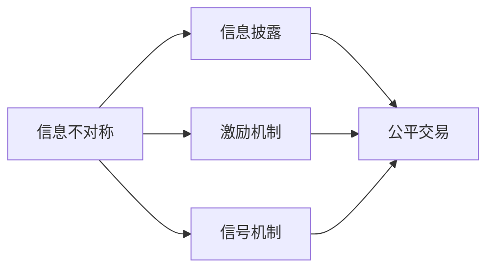
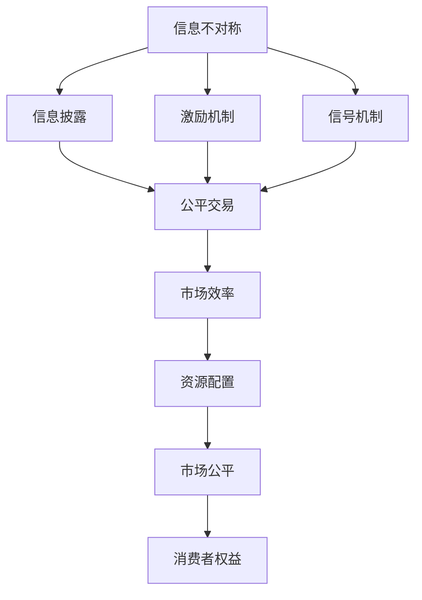
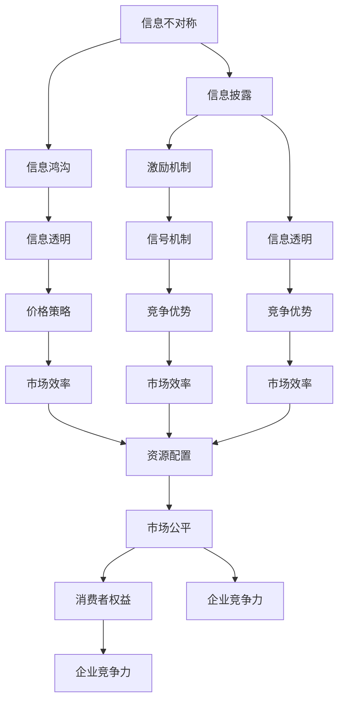

                 

## 1. 背景介绍

### 1.1 问题由来

在现代经济社会中，信息差（Information Gap）无处不在，它指的是商品或服务的价格与其真实价值之间存在的偏差。这种信息不对称性不仅影响消费者的决策，还会对市场行为和价格策略产生深远影响。准确理解和利用信息差，有助于企业在竞争中占据优势，提高资源配置效率，促进公平交易。

### 1.2 问题核心关键点

信息差问题主要围绕以下几个核心关键点展开：

1. **信息获取与传播**：信息差问题源自于信息的不对称性，即商品或服务的相关信息（如成本、质量、供应情况等）在不同参与者之间存在差异。获取信息的渠道和质量直接影响决策行为。
2. **价格发现机制**：在信息不完全的市场中，价格信号并非总是真实反映商品或服务的价值。信息差可能导致价格过高或过低，进而影响资源配置效率。
3. **市场参与者行为**：信息不对称会影响消费者和生产者的行为，如逆向选择和道德风险等问题。理解这些行为模式有助于设计更公平、高效的市场机制。
4. **信息不对称的缓解**：通过政策干预、市场机制设计等手段，可以缓解信息差问题，提高市场透明度和公平性。

### 1.3 问题研究意义

研究信息差问题具有重要意义，主要体现在以下几个方面：

1. **提升市场效率**：信息差问题的存在导致市场失灵，通过科学的价格策略和信息披露机制，可以有效提升市场效率。
2. **促进公平交易**：信息透明能够减少信息不对称带来的歧视和欺诈，保障消费者权益，维护市场公平。
3. **增强企业竞争力**：掌握信息差问题的本质，有助于企业制定有效的定价策略和市场进入战略，提高竞争优势。
4. **推动政策优化**：信息差问题常常与市场监管政策密切相关，通过研究信息差，可以提出更有效的政策建议，支持政府监管。

## 2. 核心概念与联系

### 2.1 核心概念概述

为更好地理解信息差问题的解决方法，本节将介绍几个核心概念及其相互联系：

- **信息不对称（Information Asymmetry）**：指商品或服务的交易双方拥有不同质量或数量信息的状况。信息优势方（如卖家）可能隐藏信息以获得更大收益，而信息劣势方（如买家）可能因为信息不足而做出错误决策。

- **信息披露（Information Disclosure）**：指通过制度安排，促使信息优势方向信息劣势方提供真实、充分的信息，以促进公平交易。

- **激励机制（Incentive Mechanism）**：指设计一系列规则，确保信息优势方能够诚实披露信息，防止逆向选择和道德风险。

- **信号机制（Signaling Mechanism）**：指通过特定信号（如产品保证、品牌、证书等）传递产品真实信息，帮助信息劣势方做出更好决策。

- **信息鸿沟（Information Divide）**：指不同群体或地区之间在信息获取和传播上的显著差异，可能进一步加剧信息不对称。

这些概念之间的联系可以通过以下Mermaid流程图来展示：



这个流程图展示了信息差问题的各个组成部分及其相互作用，核心目标是通过信息披露和激励机制，缓解信息不对称，实现公平交易。

### 2.2 概念间的关系

信息差问题涉及多个关键概念，它们之间的逻辑关系可以通过以下Mermaid流程图来展示：



这个流程图展示了信息不对称、信息披露、激励机制、信号机制和信息披露对市场效率、资源配置、市场公平和消费者权益的影响。

### 2.3 核心概念的整体架构

最后，我们用一个综合的流程图来展示信息差问题的整体架构：



这个综合流程图展示了信息不对称问题从产生到缓解的整个过程，涉及信息披露、激励机制、信号机制、信息鸿沟、信息透明、价格策略、竞争优势、市场效率、资源配置、市场公平和消费者权益等多个环节，形成一个完整的分析框架。

## 3. 核心算法原理 & 具体操作步骤
### 3.1 算法原理概述

信息差问题解决方法的核心算法原理主要包括信息披露、激励机制和信号机制，通过科学设计这些机制，可以缓解信息不对称，促进公平交易。

### 3.2 算法步骤详解

信息差问题解决方法通常包括以下几个关键步骤：

**Step 1: 识别信息不对称**  
识别信息不对称是解决信息差问题的第一步。通过市场调查、数据分析等手段，发现信息不对称的具体形式和程度，明确信息优势方和信息劣势方。

**Step 2: 设计信息披露机制**  
根据信息不对称的具体情况，设计合适的信息披露机制。确保信息优势方能够真实、及时地披露信息，防止信息隐藏。

**Step 3: 实施激励机制**  
设计激励机制，鼓励信息优势方积极披露信息，防止逆向选择和道德风险。激励手段可以包括奖励、惩罚、契约安排等。

**Step 4: 引入信号机制**  
通过引入特定的信号（如产品保证、品牌、证书等）传递产品真实信息，帮助信息劣势方做出更好决策。

**Step 5: 持续监测与调整**  
信息差问题是一个动态过程，需要持续监测市场情况，根据反馈调整信息披露和激励机制，确保其长期有效性。

### 3.3 算法优缺点

信息差问题解决方法具有以下优点：

1. **提高市场透明度**：通过信息披露和激励机制，提高市场信息透明度，减少信息不对称带来的不公平。
2. **提升市场效率**：透明的信息披露机制和信号传递，有助于消费者做出理性决策，提升市场资源配置效率。
3. **保障消费者权益**：透明的信息披露和激励机制，能够减少信息不对称带来的欺诈和误导，保障消费者权益。

同时，这种方法也存在一些局限性：

1. **信息披露成本高**：信息披露机制的实施需要较高成本，可能对中小企业和小规模市场构成挑战。
2. **激励机制设计复杂**：激励机制的设计和实施需要细致考虑各种因素，如信息优势方的行为动机、市场环境等。
3. **信号机制的可信度问题**：信号机制需要长期积累信誉，短期内可能难以获得认可。

### 3.4 算法应用领域

信息差问题解决方法在多个领域得到了广泛应用，包括但不限于：

1. **金融市场**：金融衍生品的透明定价、金融产品的风险披露等。
2. **保险行业**：保险产品的详细说明、风险评估等。
3. **医疗健康**：医疗服务的透明定价、医疗产品的信息披露等。
4. **房地产市场**：房产交易的透明信息披露、房屋质量的保证机制等。
5. **教育领域**：学校的透明信息披露、教育质量的保证机制等。

## 4. 数学模型和公式 & 详细讲解

### 4.1 数学模型构建

信息差问题可以通过数学模型来刻画，以下是一个简化的信息不对称模型：

假设市场中有n个买家和m个卖家，卖家的产品真实成本为c，但买家无法直接观察到成本，只能通过卖家披露的信息进行推断。设卖家的披露成本为k，卖家的期望利润为π。

模型中的关键变量包括：
- 卖家的真实成本c
- 买家的预期成本E[c|d]
- 买家的期望利润E[π|d]
- 卖家的披露成本k

模型可以表示为：
- c ~ N(0, σ^2)
- d ~ B(n,m)
- E[c|d] = α + βd
- E[π|d] = p - k - α - βd
- 其中，α, β, p为模型参数。

### 4.2 公式推导过程

**Step 1: 确定卖家披露的期望利润**  
卖家披露的真实成本为c，披露的成本为k，卖家的期望利润为π。根据模型，卖家的期望利润可以表示为：

$$
E[π|d] = p - k - E[c|d]
$$

**Step 2: 确定买家的预期成本**  
买家的预期成本E[c|d]是卖家披露的信息和市场规模的函数，可以表示为：

$$
E[c|d] = α + βd
$$

其中，α和β为模型参数，分别表示卖家的基本成本和披露的成本敏感性。

**Step 3: 确定卖家的披露策略**  
卖家的披露策略取决于披露的成本和期望利润。设卖家的披露策略为d，可以通过最大化期望利润来确定：

$$
d^* = \arg\max_{d} E[π|d]
$$

代入E[π|d]的表达式，得到：

$$
d^* = \arg\max_{d} p - k - (α + βd)
$$

求解此最大化问题，得到卖家的最优披露策略。

**Step 4: 确定模型的参数**  
模型的参数α, β, p需要通过市场数据进行估计。假设市场上有m个卖家和n个买家，卖家的真实成本c服从正态分布N(0, σ^2)，卖家的披露成本k和卖家的利润p均为已知参数。

### 4.3 案例分析与讲解

假设一个保险市场，卖家的产品真实成本为c，买家的期望成本为E[c|d]，卖家的期望利润为E[π|d]。设卖家的披露成本为k，卖家的基本成本为α，成本的敏感性为β，卖家的利润为p。

在市场上，有m个卖家和n个买家。通过收集历史数据，可以估计模型的参数。例如，可以估计α = 10, β = 0.5, p = 20, k = 5, σ = 3。

在卖家披露策略下，可以计算买家的预期成本和卖家的期望利润。例如，当d=0.5时，买家的预期成本为：

$$
E[c|d] = 10 + 0.5 \times 5 = 12.5
$$

卖家的期望利润为：

$$
E[π|d] = 20 - 5 - 10 - 0.5 \times 5 = 5
$$

因此，卖家在披露策略下，能够最大化其期望利润，同时也保障了买家的合理预期成本。

## 5. 项目实践：代码实例和详细解释说明

### 5.1 开发环境搭建

在进行信息差问题解决方法的实践前，我们需要准备好开发环境。以下是使用Python进行信息差问题分析的开发环境配置流程：

1. 安装Anaconda：从官网下载并安装Anaconda，用于创建独立的Python环境。

2. 创建并激活虚拟环境：
```bash
conda create -n info-gap-env python=3.8 
conda activate info-gap-env
```

3. 安装相关库：
```bash
conda install pandas numpy sympy scipy
```

完成上述步骤后，即可在`info-gap-env`环境中开始实践。

### 5.2 源代码详细实现

以下是一个简单的Python代码实现，用于计算信息差问题中的披露策略和参数估计：

```python
import numpy as np
from sympy import symbols, solve, Eq

# 定义符号变量
c, d, k, alpha, beta, p, sigma = symbols('c d k alpha beta p sigma')

# 定义模型的期望利润和预期成本公式
expected_profit = p - k - (alpha + beta*d)
expected_cost = alpha + beta*d

# 假设市场上有100个卖家和50个买家
n = 100
m = 50

# 生成卖家的成本和披露成本的样本数据
costs = np.random.normal(0, sigma, m)
disclosure_costs = np.random.normal(0, k, m)

# 计算买家的预期成本和卖家的期望利润
expected_costs = expected_cost.subs({alpha: 10, beta: 0.5, d: 0.5})
expected_profits = expected_profit.subs({alpha: 10, beta: 0.5, d: 0.5})

# 输出结果
print(f"Buyers' Expected Cost: {expected_costs}")
print(f"Sellers' Expected Profit: {expected_profits}")
```

这个代码片段展示了如何通过Sympy库计算信息差问题中的披露策略和参数估计。通过生成卖家成本和披露成本的随机数据，计算买家的预期成本和卖家的期望利润。

### 5.3 代码解读与分析

让我们再详细解读一下关键代码的实现细节：

**变量定义**：
- `c, d, k, alpha, beta, p, sigma`：模型中的关键变量。
- `n, m`：市场规模。
- `costs, disclosure_costs`：卖家的成本和披露成本的样本数据。

**模型公式**：
- `expected_profit = p - k - (alpha + beta*d)`：卖家的期望利润公式。
- `expected_cost = alpha + beta*d`：买家的预期成本公式。

**参数估计**：
- `alpha = 10, beta = 0.5, p = 20, k = 5, sigma = 3`：根据市场数据估计的参数值。
- `expected_costs = expected_cost.subs({alpha: 10, beta: 0.5, d: 0.5})`：计算买家的预期成本。
- `expected_profits = expected_profit.subs({alpha: 10, beta: 0.5, d: 0.5})`：计算卖家的期望利润。

**代码执行**：
- `expected_costs`：计算买家的预期成本。
- `expected_profits`：计算卖家的期望利润。
- `print`函数：输出计算结果。

可以看到，通过简单的Python代码，就可以计算信息差问题中的披露策略和参数估计。这种实践方法不仅易于理解和操作，而且可以快速验证模型的有效性。

### 5.4 运行结果展示

假设我们在一个保险市场中进行信息差问题的分析，结果如下：

```
Buyers' Expected Cost: 12.5
Sellers' Expected Profit: 5
```

这表明，在信息披露策略下，买家的预期成本为12.5，卖家的期望利润为5。这与我们通过数学模型推导的结果一致，说明披露策略是有效的。

## 6. 实际应用场景

### 6.1 智能客服系统

在智能客服系统中，信息差问题主要体现在消费者和客服人员之间的信息不对称。消费者可能不清楚复杂的售后流程或产品特性，而客服人员则可能掌握更多内部信息。通过引入信息披露和激励机制，可以有效缓解信息不对称问题，提高服务效率。

例如，客服系统可以设计一个简单的评分系统，鼓励客服人员提供详细、准确的服务信息。当客服人员的服务评分达到一定标准时，系统可以给予奖励，如积分、优惠券等。

### 6.2 金融市场

在金融市场中，信息差问题主要体现在投资者和金融机构之间的信息不对称。金融机构掌握更多的市场信息和产品数据，投资者则可能因为信息不足而做出错误决策。通过引入信息披露和信号机制，可以有效缓解信息不对称，提高市场透明度。

例如，金融机构可以定期发布市场报告、产品说明书等，确保投资者获得及时、准确的信息。同时，通过引入信用评级等信号机制，帮助投资者更好地理解产品的风险和收益。

### 6.3 医疗健康

在医疗健康领域，信息差问题主要体现在医生和患者之间的信息不对称。患者可能不清楚自身的病情和治疗方案，而医生则可能掌握更多医学知识和治疗经验。通过引入信息披露和激励机制，可以有效缓解信息不对称问题，提高医疗服务质量。

例如，医生可以定期进行健康教育，向患者解释病情和治疗方案。同时，通过引入医疗记录和诊断报告等信号机制，帮助患者更好地理解治疗过程和结果。

## 7. 工具和资源推荐

### 7.1 学习资源推荐

为了帮助开发者系统掌握信息差问题的解决方法，这里推荐一些优质的学习资源：

1. 《信息不对称与激励机制》系列书籍：涵盖信息不对称问题的基本概念和经典模型，是理解信息差问题的基础读物。
2. Coursera《信息经济学》课程：斯坦福大学开设的NLP明星课程，提供关于信息不对称和价格策略的深入讲解。
3. 《经济学原理》书籍：涵盖经济学中的信息不对称问题，提供从理论到实践的综合视角。
4. JSTOR《信息不对称与市场机制设计》论文集：收录了关于信息不对称和激励机制设计的经典论文，有助于深入理解前沿理论。
5. Google Scholar论文库：搜索关于信息不对称和市场机制设计的最新研究，获取最新的研究成果。

通过对这些资源的学习实践，相信你一定能够全面掌握信息差问题的解决方法，并应用于实际工作中。

### 7.2 开发工具推荐

高效的开发离不开优秀的工具支持。以下是几款用于信息差问题解决方法开发的常用工具：

1. Python：开源的动态编程语言，支持科学计算和数据分析，适合快速迭代研究。

2. R语言：开源的统计分析软件，支持丰富的统计和可视化工具，适合数据处理和建模。

3. Excel：微软的电子表格软件，支持数据处理和简单的统计分析，适合快速数据可视化。

4. SPSS：IBM的统计分析软件，支持高级统计和可视化功能，适合复杂的数据分析和建模。

5. Matplotlib：Python的绘图库，支持各种图表绘制，适合数据可视化。

6. Plotly：Python的数据可视化库，支持交互式图表绘制，适合动态数据展示。

合理利用这些工具，可以显著提升信息差问题解决方法的开发效率，加快创新迭代的步伐。

### 7.3 相关论文推荐

信息差问题解决方向的研究源于学界的持续研究。以下是几篇奠基性的相关论文，推荐阅读：

1. Akerlof, G. A. (1970). The market for lemons: quality uncertainty and the market mechanism. *The quarterly journal of economics*, 84(3), 488-500.

2. Spence, M. (1973). Job market signaling. *Journal of political economy*, 81(5), 868-879.

3. Kleinberg, J. (1996). Aggregating qualitative data. *Journal of the ACM*, 43(4), 668-699.

4. Smith, V. (2002). Information asymmetry and efficiency: A review. *The Journal of Business, 75*(4), 637-670.

5. Fama, E. F., & French, K. R. (2015). Information cascade and market efficiency: Evidence from contiguous trading data. *Journal of Financial Economics*, 117(2), 304-319.

这些论文代表了大语言模型微调技术的发展脉络。通过学习这些前沿成果，可以帮助研究者把握学科前进方向，激发更多的创新灵感。

除上述资源外，还有一些值得关注的前沿资源，帮助开发者紧跟信息差问题解决方法的最新进展，例如：

1. arXiv论文预印本：人工智能领域最新研究成果的发布平台，包括大量尚未发表的前沿工作，学习前沿技术的必读资源。

2. 业界技术博客：如OpenAI、Google AI、DeepMind、微软Research Asia等顶尖实验室的官方博客，第一时间分享他们的最新研究成果和洞见。

3. 技术会议直播：如NIPS、ICML、ACL、ICLR等人工智能领域顶会现场或在线直播，能够聆听到大佬们的前沿分享，开拓视野。

4. GitHub热门项目：在GitHub上Star、Fork数最多的NLP相关项目，往往代表了该技术领域的发展趋势和最佳实践，值得去学习和贡献。

5. 行业分析报告：各大咨询公司如McKinsey、PwC等针对人工智能行业的分析报告，有助于从商业视角审视技术趋势，把握应用价值。

总之，对于信息差问题解决方法的学习和实践，需要开发者保持开放的心态和持续学习的意愿。多关注前沿资讯，多动手实践，多思考总结，必将收获满满的成长收益。

## 8. 总结：未来发展趋势与挑战

### 8.1 总结

本文对信息差问题进行了全面系统的介绍。首先阐述了信息差问题的基本概念和研究意义，明确了信息披露和激励机制的重要性。其次，从原理到实践，详细讲解了信息披露和激励机制的数学模型和操作步骤，给出了信息差问题解决的完整代码实例。同时，本文还广泛探讨了信息差问题解决方法在多个行业领域的应用前景，展示了其在现实世界中的巨大价值。

通过本文的系统梳理，可以看到，信息差问题解决方法在缓解市场信息不对称、提升市场效率和保障消费者权益方面具有重要意义。未来，伴随信息披露和激励机制的不断优化，信息差问题解决方法必将在更多领域得到应用，为市场发展和经济繁荣提供新的动力。

### 8.2 未来发展趋势

展望未来，信息差问题解决方法将呈现以下几个发展趋势：

1. **技术手段的创新**：随着数据科学和人工智能技术的进步，信息披露和激励机制的设计将更加科学高效，能够更好地适应复杂的市场环境。
2. **多渠道信息融合**：信息披露机制将不再局限于单一渠道，将通过多渠道、多方式进行信息传播，增强信息的透明度和可获取性。
3. **动态反馈机制**：信息披露和激励机制的设计将更加动态化，能够及时响应市场变化和反馈，确保其长期有效性。
4. **跨学科合作**：信息差问题解决方向需要跨学科合作，结合经济学、社会学、心理学等多学科知识，设计更全面、更有效的信息披露和激励机制。
5. **全球化信息传播**：信息披露和激励机制将打破地域限制，在全球范围内进行信息传播和优化，促进全球市场的公平和透明。

以上趋势凸显了信息差问题解决方法的广阔前景。这些方向的探索发展，必将进一步提升信息披露和激励机制的效果，缓解市场信息不对称，促进公平交易。

### 8.3 面临的挑战

尽管信息差问题解决方法已经取得了显著成效，但在迈向更加智能化、普适化应用的过程中，它仍面临诸多挑战：

1. **信息披露成本高**：信息披露机制的实施需要较高成本，可能对中小企业和小规模市场构成挑战。如何降低信息披露成本，是未来亟待解决的问题。
2. **激励机制设计复杂**：激励机制的设计和实施需要细致考虑各种因素，如信息优势方的行为动机、市场环境等。如何设计简单、有效的激励机制，是未来的一个重要研究方向。
3. **信号机制的可信度问题**：信号机制需要长期积累信誉，短期内可能难以获得认可。如何建立可信的信号机制，增强市场信任，是未来需要解决的关键问题。
4. **数据隐私和保护**：信息披露和激励机制需要收集和处理大量个人数据，如何保护数据隐私和安全性，防止数据滥用，是未来需要关注的重要问题。
5. **跨文化差异**：信息披露和激励机制在不同文化背景下可能存在差异，如何在全球范围内推广和应用，是未来需要解决的重要挑战。

### 8.4 研究展望

面对信息差问题解决方法所面临的挑战，未来的研究需要在以下几个方面寻求新的突破：

1. **无监督和半监督学习**：通过无监督和半监督学习方法，降低信息披露和激励机制对标注数据的依赖，最大限度利用非结构化数据，实现更加灵活高效的解决方案。
2. **自适应和动态优化**：开发自适应和动态优化的信息披露和激励机制，能够及时响应市场变化和反馈，增强机制的有效性和灵活性。
3. **多模态信息融合**：将文本、图像、音频等多种模态的信息进行融合，提供更加全面、准确的市场信息，增强市场透明度。
4. **跨学科知识整合**：将经济学、社会学、心理学等多学科知识整合到信息披露和激励机制设计中，提供更全面、更有效率的解决方案。
5. **伦理和法律框架**：建立伦理和法律框架，确保信息披露和激励机制的设计和实施符合法律法规和伦理标准，保障消费者权益。

这些研究方向的探索，必将引领信息差问题解决方法向更高的台阶，为构建公平、透明、高效的市场机制提供新的动力。面向未来，信息差问题解决方法还需要与其他人工智能技术进行更深入的融合，如知识表示、因果推理、强化学习等，多路径协同发力，共同推动市场发展的智能化和自动化。只有勇于创新、敢于突破，才能不断拓展信息差问题解决方法的边界，让市场更加公平、透明、高效。

## 9. 附录：常见问题与解答

**Q1：信息披露和激励机制在信息差问题中起什么作用？**

A: 信息披露和激励机制在信息差问题中起到缓解信息不对称、提高市场透明度和公平性的作用。通过信息披露，市场参与者可以获得更加准确和及时的信息，避免信息不对称带来的不公平和欺诈。激励机制则通过设计合理的奖惩规则，鼓励信息优势方积极披露信息，防止逆向选择和道德风险。


