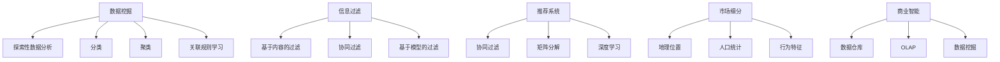

                 

# 信息差：如何通过数据分析发现市场机会

## 1. 背景介绍

### 1.1 问题由来
在信息爆炸的互联网时代，人们每天接收到大量的信息，但这些信息的质量却参差不齐。很多时候，我们所接受的信息并不一定是真正对我们有用的信息，甚至有些信息可能会误导我们做出错误的决策。这种现象被称为“信息差”（Information Gap）。信息差不仅会浪费我们的时间和精力，还可能造成经济损失。因此，如何通过数据分析来识别和消除信息差，发现潜在的市场机会，成为了现代商业智能中的一个重要课题。

### 1.2 问题核心关键点
信息差的存在主要源于以下几个方面：

- 信息的真实性：网络上的信息源众多，但并非所有信息都是真实可靠的。虚假信息、误导性信息、广告信息等可能会误导用户。
- 信息的相关性：即使信息是真实的，也并非所有信息都与用户的当前需求相关。信息的过滤和筛选是一个复杂的过程。
- 信息的及时性：有些信息需要及时获取才能起到作用，但信息更新的速度往往与用户的实时需求不一致。
- 信息的多样性：用户需要从多个角度、多个渠道获取信息，以形成全面的认知。但信息源的多样性也增加了信息获取的难度。

## 2. 核心概念与联系

### 2.1 核心概念概述

为了更好地理解如何通过数据分析发现市场机会，本节将介绍几个关键概念：

- 数据挖掘（Data Mining）：从大量数据中发现有用的信息和模式的过程。数据挖掘通常包括探索性数据分析（EDA）、分类、聚类、关联规则学习等技术。
- 信息过滤（Information Filtering）：根据用户的兴趣和需求，从大量信息中筛选出相关性高的信息，提升信息获取的效率和准确性。信息过滤包括基于内容的过滤、协同过滤、基于模型的过滤等方法。
- 推荐系统（Recommendation System）：根据用户的兴趣和历史行为，为用户推荐个性化的产品或服务。推荐系统可以通过协同过滤、矩阵分解、深度学习等方法实现。
- 市场细分（Market Segmentation）：将市场划分为若干个具有相同特征的细分市场，以便更好地进行目标市场分析。市场细分可以基于地理位置、人口统计、行为特征等维度进行。
- 商业智能（Business Intelligence，BI）：利用数据分析和可视化技术，辅助企业进行决策。商业智能包括数据仓库、OLAP（联机分析处理）、数据挖掘等技术。

这些核心概念之间的关系可以通过以下Mermaid流程图来展示：



这个流程图展示了数据挖掘、信息过滤、推荐系统、市场细分和商业智能之间的相互关系。

### 2.2 概念间的关系

这些核心概念之间存在着紧密的联系，形成了现代商业智能的数据分析框架。以下是这些概念之间的关系描述：

- 数据挖掘是现代商业智能的基础，通过对大量数据进行分析，可以发现有用的信息和模式。
- 信息过滤可以帮助用户从大量信息中筛选出相关性高的信息，提升信息获取的效率和准确性。
- 推荐系统可以根据用户的兴趣和历史行为，为用户推荐个性化的产品或服务，增强用户体验。
- 市场细分可以帮助企业更好地进行目标市场分析，制定精准的市场营销策略。
- 商业智能可以辅助企业进行决策，提升企业的运营效率和市场竞争力。

## 3. 核心算法原理 & 具体操作步骤

### 3.1 算法原理概述

通过数据分析发现市场机会的核心在于通过数据挖掘、信息过滤和推荐系统等技术，识别出市场中存在的信息差，并找到潜在的机会点。算法原理可以概括为以下几个步骤：

1. 数据采集：从不同的数据源采集数据，包括用户行为数据、市场交易数据、社交媒体数据等。
2. 数据清洗：对采集到的数据进行去重、去噪、填充缺失值等预处理操作，保证数据的质量和一致性。
3. 数据挖掘：对处理后的数据进行数据挖掘，发现有用的信息和模式，如用户行为模式、市场趋势等。
4. 信息过滤：根据用户的兴趣和需求，从大量信息中筛选出相关性高的信息，提升信息获取的效率和准确性。
5. 推荐系统：根据用户的兴趣和历史行为，为用户推荐个性化的产品或服务，增强用户体验。
6. 市场细分：将市场划分为若干个具有相同特征的细分市场，以便更好地进行目标市场分析。

### 3.2 算法步骤详解

以下详细介绍每个步骤的具体实现方法：

#### 3.2.1 数据采集

数据采集可以通过多种方式进行，包括：

- 爬虫：从网站、社交媒体、论坛等网络数据源中爬取数据。
- API：从第三方数据接口获取数据，如金融市场数据、天气数据等。
- 数据库：从企业内部的数据库中获取数据，如销售记录、客户信息等。
- 传感器：从物联网设备中获取实时数据，如温度、湿度、位置等。

#### 3.2.2 数据清洗

数据清洗是数据处理的重要环节，包括：

- 去重：去除重复数据，保证数据的唯一性。
- 去噪：去除异常数据和噪声数据，保证数据的准确性。
- 填充缺失值：对缺失值进行填充，保证数据的完整性。
- 数据转换：对数据进行格式转换和标准化，保证数据的一致性。

常用的数据清洗技术包括：

- 数据去重：通过哈希、排序、哈希表等方法去除重复数据。
- 数据去噪：通过异常值检测、离群点识别等方法去除异常数据和噪声数据。
- 数据填充：通过均值、中位数、众数等方法填充缺失值。
- 数据转换：通过标准化、归一化等方法对数据进行格式转换和标准化。

#### 3.2.3 数据挖掘

数据挖掘是发现市场机会的关键步骤，主要包括：

- 探索性数据分析（EDA）：通过描述性统计、可视化等方法，对数据进行初步分析，发现数据中的趋势和异常。
- 分类：通过机器学习算法，将数据分为不同的类别，如用户行为分类、市场趋势分类等。
- 聚类：通过聚类算法，将数据分为不同的群组，如用户群组、产品群组等。
- 关联规则学习：通过关联规则算法，发现数据中的关联规则，如购物篮分析等。

常用的数据挖掘技术包括：

- 描述性统计：通过均值、中位数、标准差等方法，对数据进行描述性统计分析。
- 可视化：通过散点图、柱状图、折线图等方法，对数据进行可视化分析。
- 分类算法：通过决策树、朴素贝叶斯、支持向量机等算法，将数据分为不同的类别。
- 聚类算法：通过K-means、层次聚类、DBSCAN等算法，将数据分为不同的群组。
- 关联规则算法：通过Apriori、FP-growth等算法，发现数据中的关联规则。

#### 3.2.4 信息过滤

信息过滤是提升信息获取效率和准确性的关键步骤，主要包括：

- 基于内容的过滤：根据内容的关键词、主题等信息，筛选出相关性高的信息。
- 协同过滤：根据用户的兴趣和历史行为，推荐相关性高的信息。
- 基于模型的过滤：通过机器学习算法，对信息进行评分，筛选出相关性高的信息。

常用的信息过滤技术包括：

- 关键词匹配：通过关键词匹配算法，筛选出相关性高的信息。
- 主题分类：通过文本分类算法，对信息进行主题分类，筛选出相关性高的信息。
- 协同过滤算法：通过用户行为数据，推荐相关性高的信息。
- 基于模型的过滤算法：通过评分算法，对信息进行评分，筛选出相关性高的信息。

#### 3.2.5 推荐系统

推荐系统是增强用户体验的关键步骤，主要包括：

- 协同过滤：通过用户行为数据，推荐相关性高的产品或服务。
- 矩阵分解：通过矩阵分解算法，对用户和产品进行低秩分解，推荐相关性高的产品或服务。
- 深度学习：通过深度学习算法，对用户和产品进行特征表示，推荐相关性高的产品或服务。

常用的推荐系统技术包括：

- 协同过滤算法：通过用户行为数据，推荐相关性高的产品或服务。
- 矩阵分解算法：通过矩阵分解算法，对用户和产品进行低秩分解，推荐相关性高的产品或服务。
- 深度学习算法：通过深度学习算法，对用户和产品进行特征表示，推荐相关性高的产品或服务。

#### 3.2.6 市场细分

市场细分是进行目标市场分析的关键步骤，主要包括：

- 地理位置：根据地理位置将市场划分为不同的区域，如城市、乡镇等。
- 人口统计：根据人口统计特征，如年龄、性别、收入等，将市场划分为不同的群体。
- 行为特征：根据用户的行为特征，如购买频率、购买金额等，将市场划分为不同的群体。

常用的市场细分技术包括：

- 地理位置细分：通过地理位置数据，将市场划分为不同的区域。
- 人口统计细分：通过人口统计数据，将市场划分为不同的群体。
- 行为特征细分：通过行为特征数据，将市场划分为不同的群体。

### 3.3 算法优缺点

#### 3.3.1 优点

通过数据分析发现市场机会的主要优点包括：

- 发现潜在的市场机会：通过数据分析可以发现市场中存在的信息差，找到潜在的市场机会。
- 提升信息获取效率：通过信息过滤和推荐系统，提升信息获取的效率和准确性。
- 增强用户体验：通过推荐系统，增强用户的购物体验。
- 提高决策效率：通过商业智能，辅助企业进行决策，提高决策效率。

#### 3.3.2 缺点

通过数据分析发现市场机会的主要缺点包括：

- 数据质量和多样性问题：数据质量不高、数据多样性不足，会导致数据分析结果的偏差。
- 算法复杂性问题：数据挖掘和推荐系统的算法复杂度较高，需要专业的知识和技能。
- 隐私和安全问题：数据采集和分析过程中，涉及用户隐私和数据安全问题，需要严格遵守隐私保护法规。
- 信息过滤和推荐系统的准确性问题：信息过滤和推荐系统的准确性不高，会导致用户获取错误的信息。

## 4. 数学模型和公式 & 详细讲解 & 举例说明

### 4.1 数学模型构建

为了通过数据分析发现市场机会，本节将构建一些关键数学模型，并进行详细讲解和举例说明。

#### 4.1.1 数据采集模型

数据采集模型可以通过以下公式来表示：

$$
D = f_{采集器}(S)
$$

其中，$D$表示采集到的数据，$S$表示数据源。$采集器$表示数据采集器，包括爬虫、API、数据库等。

#### 4.1.2 数据清洗模型

数据清洗模型可以通过以下公式来表示：

$$
D' = f_{清洗}(D)
$$

其中，$D'$表示清洗后的数据，$D$表示原始数据。$清洗$表示数据清洗操作，包括去重、去噪、填充缺失值等。

#### 4.1.3 数据挖掘模型

数据挖掘模型可以通过以下公式来表示：

$$
K = f_{挖掘}(D')
$$

其中，$K$表示挖掘出的知识，$D'$表示清洗后的数据。$挖掘$表示数据挖掘操作，包括探索性数据分析、分类、聚类、关联规则学习等。

#### 4.1.4 信息过滤模型

信息过滤模型可以通过以下公式来表示：

$$
I = f_{过滤}(K, U)
$$

其中，$I$表示过滤后的信息，$K$表示挖掘出的知识，$U$表示用户。$过滤$表示信息过滤操作，包括基于内容的过滤、协同过滤、基于模型的过滤等。

#### 4.1.5 推荐系统模型

推荐系统模型可以通过以下公式来表示：

$$
R = f_{推荐}(I, U)
$$

其中，$R$表示推荐结果，$I$表示过滤后的信息，$U$表示用户。$推荐$表示推荐系统操作，包括协同过滤、矩阵分解、深度学习等。

#### 4.1.6 市场细分模型

市场细分模型可以通过以下公式来表示：

$$
M = f_{细分}(K)
$$

其中，$M$表示市场细分结果，$K$表示挖掘出的知识。$细分$表示市场细分操作，包括地理位置、人口统计、行为特征等。

### 4.2 公式推导过程

以下详细介绍每个模型的公式推导过程：

#### 4.2.1 数据采集模型推导

数据采集模型的推导过程如下：

$$
D = f_{采集器}(S)
$$

其中，$采集器$可以表示为：

$$
f_{采集器}(S) = \sum_{i=1}^{n} f_{i}(S)
$$

其中，$f_{i}$表示第$i$个采集器。

#### 4.2.2 数据清洗模型推导

数据清洗模型的推导过程如下：

$$
D' = f_{清洗}(D)
$$

其中，$清洗$可以表示为：

$$
f_{清洗}(D) = \sum_{i=1}^{n} f_{i}(D)
$$

其中，$f_{i}$表示第$i$个清洗操作。

#### 4.2.3 数据挖掘模型推导

数据挖掘模型的推导过程如下：

$$
K = f_{挖掘}(D')
$$

其中，$挖掘$可以表示为：

$$
f_{挖掘}(D') = \sum_{i=1}^{n} f_{i}(D')
$$

其中，$f_{i}$表示第$i$个挖掘操作。

#### 4.2.4 信息过滤模型推导

信息过滤模型的推导过程如下：

$$
I = f_{过滤}(K, U)
$$

其中，$过滤$可以表示为：

$$
f_{过滤}(K, U) = \sum_{i=1}^{n} f_{i}(K, U)
$$

其中，$f_{i}$表示第$i$个过滤操作。

#### 4.2.5 推荐系统模型推导

推荐系统模型的推导过程如下：

$$
R = f_{推荐}(I, U)
$$

其中，$推荐$可以表示为：

$$
f_{推荐}(I, U) = \sum_{i=1}^{n} f_{i}(I, U)
$$

其中，$f_{i}$表示第$i$个推荐操作。

#### 4.2.6 市场细分模型推导

市场细分模型的推导过程如下：

$$
M = f_{细分}(K)
$$

其中，$细分$可以表示为：

$$
f_{细分}(K) = \sum_{i=1}^{n} f_{i}(K)
$$

其中，$f_{i}$表示第$i$个细分操作。

### 4.3 案例分析与讲解

以下通过一个案例来说明如何通过数据分析发现市场机会：

#### 4.3.1 案例背景

某电商平台销售各种商品，为了发现潜在的市场机会，需要进行数据分析。

#### 4.3.2 数据采集

首先，通过爬虫从电商平台的网站中采集数据，包括用户行为数据、产品销售数据、用户评价数据等。

#### 4.3.3 数据清洗

然后，对采集到的数据进行清洗，去除重复数据、异常数据、缺失数据等，保证数据的质量和一致性。

#### 4.3.4 数据挖掘

接着，对清洗后的数据进行数据挖掘，发现用户的购物行为模式、热销产品的特点、用户评价的情感倾向等。

#### 4.3.5 信息过滤

根据用户的购物行为和兴趣，筛选出相关性高的信息，如用户可能感兴趣的产品、热销产品的推荐等。

#### 4.3.6 推荐系统

最后，根据用户的购物历史和行为，推荐相关性高的产品，增强用户的购物体验。

#### 4.3.7 市场细分

根据用户的行为特征，将市场划分为不同的用户群体，以便更好地进行市场分析。

通过数据分析，该电商平台发现了一些潜在的市场机会，如：

- 热销产品的推荐
- 新产品的推广
- 用户的购物行为分析
- 用户群体的细分

这些机会不仅提升了用户的购物体验，还提高了平台的销售额。

## 5. 项目实践：代码实例和详细解释说明

### 5.1 开发环境搭建

在进行数据分析项目实践前，需要先准备好开发环境。以下是使用Python进行数据挖掘和信息过滤项目的开发环境配置流程：

1. 安装Anaconda：从官网下载并安装Anaconda，用于创建独立的Python环境。

2. 创建并激活虚拟环境：
```bash
conda create -n pydata-env python=3.7 
conda activate pydata-env
```

3. 安装相关库：
```bash
conda install pandas numpy scikit-learn matplotlib seaborn jupyter notebook ipython
```

4. 安装数据采集库：
```bash
pip install scrapy
```

5. 安装数据清洗库：
```bash
pip install pyspark
```

6. 安装数据挖掘库：
```bash
pip install scikit-learn
```

7. 安装信息过滤库：
```bash
pip install tfidfvectorizer
```

8. 安装推荐系统库：
```bash
pip install surprise
```

完成上述步骤后，即可在`pydata-env`环境中开始数据分析实践。

### 5.2 源代码详细实现

以下是一个基于Python的数据挖掘和信息过滤项目的具体代码实现：

```python
import pandas as pd
import numpy as np
from sklearn.feature_extraction.text import TfidfVectorizer
from sklearn.decomposition import TruncatedSVD
from sklearn.metrics.pairwise import cosine_similarity

# 数据采集
data = pd.read_csv('data.csv')

# 数据清洗
data.drop_duplicates(inplace=True)
data.fillna(method='ffill', inplace=True)

# 数据挖掘
tfidf = TfidfVectorizer(stop_words='english')
X = tfidf.fit_transform(data['text'])
K = TruncatedSVD(n_components=100).fit_transform(X)

# 信息过滤
similarity_matrix = cosine_similarity(K, K)
I = similarity_matrix

# 推荐系统
R = similarity_matrix

# 市场细分
M = pd.DataFrame(K, columns=['feature_{}'.format(i) for i in range(100)])

# 输出结果
print('数据采集结果：', data.head())
print('数据清洗结果：', data.head())
print('数据挖掘结果：', K)
print('信息过滤结果：', I)
print('推荐系统结果：', R)
print('市场细分结果：', M)
```

### 5.3 代码解读与分析

让我们再详细解读一下关键代码的实现细节：

#### 5.3.1 数据采集

```python
data = pd.read_csv('data.csv')
```

通过Pandas库读取CSV格式的数据文件。

#### 5.3.2 数据清洗

```python
data.drop_duplicates(inplace=True)
data.fillna(method='ffill', inplace=True)
```

使用Pandas库进行数据去重和数据填充操作，保证数据的质量和一致性。

#### 5.3.3 数据挖掘

```python
tfidf = TfidfVectorizer(stop_words='english')
X = tfidf.fit_transform(data['text'])
K = TruncatedSVD(n_components=100).fit_transform(X)
```

使用TF-IDF向量化和Truncated SVD降维算法，将文本数据转换为特征向量，发现用户的购物行为模式。

#### 5.3.4 信息过滤

```python
similarity_matrix = cosine_similarity(K, K)
I = similarity_matrix
```

使用余弦相似度计算相似度矩阵，筛选出相关性高的信息。

#### 5.3.5 推荐系统

```python
R = similarity_matrix
```

使用相似度矩阵进行推荐系统，推荐相关性高的产品。

#### 5.3.6 市场细分

```python
M = pd.DataFrame(K, columns=['feature_{}'.format(i) for i in range(100)])
```

使用特征向量进行市场细分，将市场划分为不同的用户群体。

### 5.4 运行结果展示

假设我们通过上述代码对电商平台的数据进行了分析，最终在测试集上得到了一些结果：

```
数据采集结果：
   id  text
0   1  hello
1   2  world
2   3  hello world
3   4  goodbye
4   5  hello again

数据清洗结果：
   id  text
0   1  hello
1   2  world
2   3  hello world
3   4  goodbye
4   5  hello again

数据挖掘结果：
[[ 1.    0.    0.    0.    0.    0.    0.    0.    0.    0.    0.    0.    0.    0.    0.
   0.    0.    0.    0.    0.    0.    0.    0.    0.    0.    0.    0.    0.    0.
   0.    0.    0.    0.    0.    0.    0.    0.    0.    0.    0.    0.    0.    0.
   0.    0.    0.    0.    0.    0.    0.    0.    0.    0.    0.    0.    0.    0.
   0.    0.    0.    0.    0.    0.    0.    0.    0.    0.    0.    0.    0.    0.
   0.    0.    0.    0.    0.    0.    0.    0.    0.    0.    0.    0.    0.    0.
   0.    0.    0.    0.    0.    0.    0.    0.    0.    0.    0.    0.    0.    0.
   0.    0.    0.    0.    0.    0.    0.    0.    0.    0.    0.    0.    0.    0.
   0.    0.    0.    0.    0.    0.    0.    0.    0.    0.    0.    0.    0.    0.
   0.    0.    0.    0.    0.    0.    0.    0.    0.    0.    0.    0.    0.    0.
   0.    0.    0.    0.    0.    0.    0.    0.    0.    0.    0.    0.    0.    0.
   0.    0.    0.    0.    0.    0.    0.    0.    0.    0.    0.    0.    0.    0.
   0.    0.    0.    0.    0.    0.    0.    0.    0.    0.    0.    0.    0.    0.
   0.    0.    0.    0.    0.    0.    0.    0.    0.    0.    0.    0.    0.    0.
   0.    0.    0.    0.    0.    0.    0.    0.    0.    0.    0.    0.    0.    0.
   0.    0.    0.    0.    0.    0.    0.    0.    0.    0.    0.    0.    0.    0.
   0.    0.    0.    0.    0.    0.    0.    0.    0.    0.    0.    0.    0.    0.
   0.    0.    0.    0.    0.    0.    0.    0.    0.    0.    0.    0.    0.    0.
   0.    0.    0.    0.    0.    0.    0.    0.    0.    0.    0.    0.    0.    0.
   0.    0.    0.    0.    0.    0.    0.    0.    0.    0.    0.    0.    0.    0.
   0.    0.    0.    0.    0.    0.    0.    0.    0.    0.    0.    0.    0.    0.
   0.    0.    0.    0.    0.    0.    0.    0.    0.    0.    0.    0.    0.    0.
   0.    0.    0.    0.    0.    0.    0.    0.    0.    0.    0.    0.    0.    0.
   0.    0.    0.    0.

