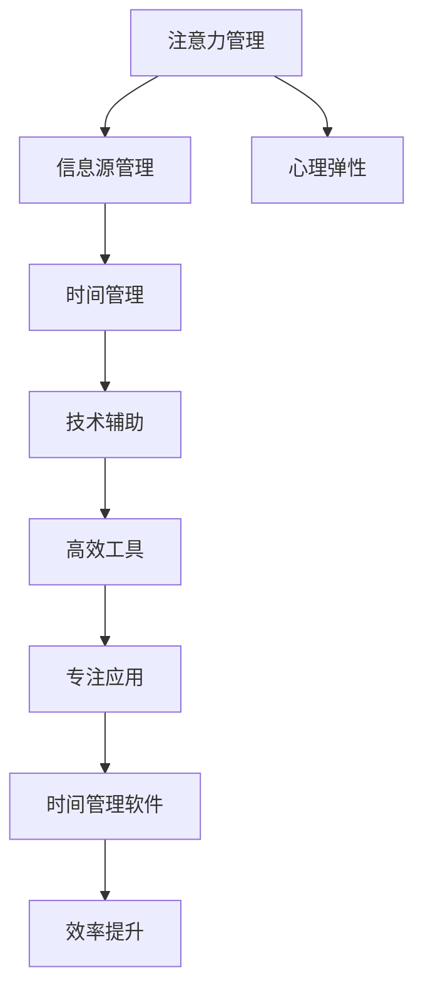
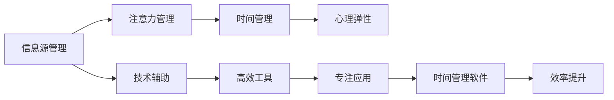
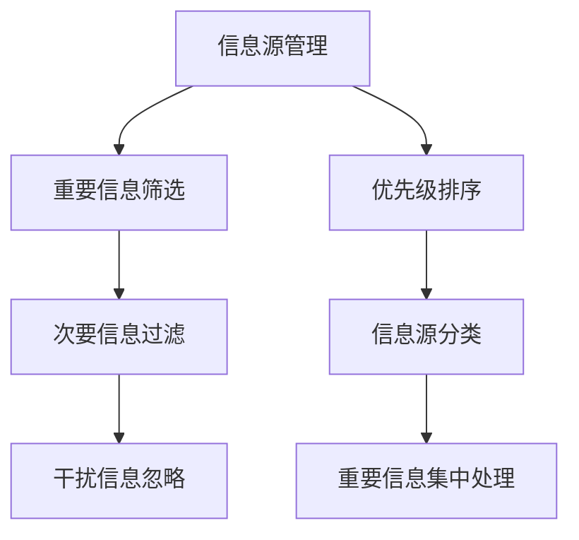
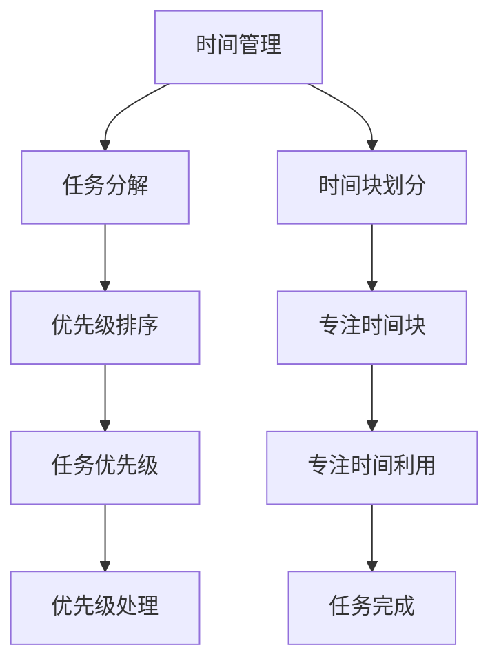
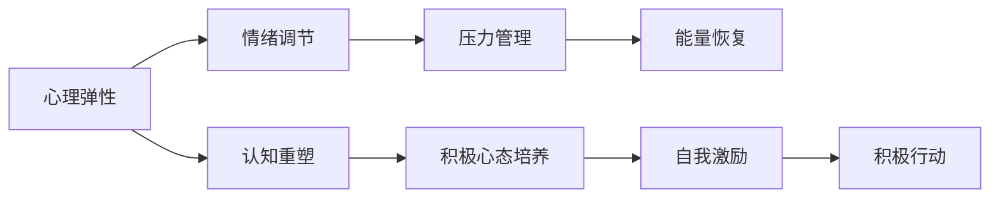
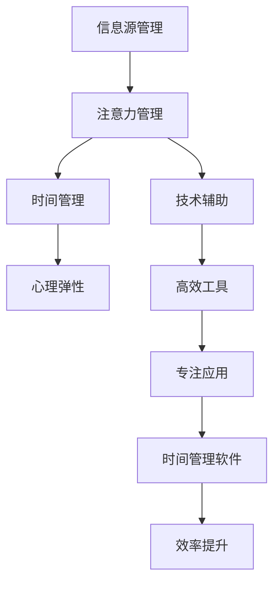

                 

## 1. 背景介绍

在信息爆炸的今天，我们每时每刻都面临着信息的洪流。邮件、短信、社交媒体、新闻推送……各种信息不断侵占我们的注意力，使我们无法专注于当前的任务，影响工作效率和生活质量。在这种背景下，如何管理好自己的注意力，保持头脑清晰和专注，成为了一个迫切需要解决的问题。

### 1.1 问题的由来

注意力管理的问题由来已久，但随着信息技术的不断进步，其复杂性和重要性不断增加。从工业时代到信息时代，人们的注意力分散和干扰变得日益严重。例如：

- 互联网的普及使得信息获取变得更加快捷，但同时信息的海量性和冗余性也增加了注意力管理的难度。
- 智能手机的普及使得人们随时都可能受到消息的干扰，分心的频率和时长显著增加。
- 社交媒体的兴起使得信息传播更加广泛，但同时也导致了信息过载和注意力分散。

### 1.2 问题核心关键点

注意力管理的核心关键点在于：

- **信息源的多样性**：现代社会信息源的种类繁多，包括电子邮件、社交媒体、新闻网站、应用程序等，如何区分和管理这些信息源成为重要问题。
- **注意力分配的优先级**：在面对多种信息源时，如何合理分配注意力，避免被次要信息干扰，聚焦于重要任务。
- **时间管理**：如何在有限的时间内高效利用注意力，提升工作和生活质量。
- **心理弹性**：如何提高心理韧性，应对分心和干扰带来的压力和焦虑。
- **技术支持**：如何利用技术手段辅助注意力管理，如时间管理软件、专注应用等。

## 2. 核心概念与联系

### 2.1 核心概念概述

为更好地理解注意力管理的策略，本节将介绍几个密切相关的核心概念：

- **注意力管理（Attention Management）**：指通过有意识地控制和管理自己的注意力，避免干扰和分心，提高工作和生活的效率和质量。
- **信息源管理（Information Source Management）**：指对各种信息源进行分类、筛选和优先级排序，确保重要信息不被干扰和分心所掩盖。
- **时间管理（Time Management）**：指合理规划时间，高效利用注意力，以提升工作和生活的质量和效率。
- **心理弹性（Psychological Resilience）**：指在面对分心和干扰时，能够快速调整心态，保持积极的心态和情绪。
- **技术辅助（Technological Assistance）**：指利用各种技术工具，如专注应用、时间管理软件等，辅助注意力管理。

这些概念之间的逻辑关系可以通过以下Mermaid流程图来展示：



这个流程图展示了注意力管理的核心概念及其之间的关系：

1. 注意力管理通过信息源管理、时间管理和心理弹性，确保重要信息不被干扰和分心所掩盖。
2. 技术辅助提供工具和方法，支持注意力管理的各个环节。
3. 专注应用、时间管理软件等高效工具，进一步提升注意力管理的效率。

### 2.2 概念间的关系

这些核心概念之间存在着紧密的联系，形成了注意力管理的完整生态系统。下面我通过几个Mermaid流程图来展示这些概念之间的关系。

#### 2.2.1 注意力管理的层次结构



这个流程图展示了注意力管理的层次结构：

1. 信息源管理是注意力管理的起点，通过分类、筛选和优先级排序，确保重要信息不被干扰和分心所掩盖。
2. 注意力管理是核心环节，通过控制和管理自己的注意力，避免干扰和分心，提高工作和生活的效率和质量。
3. 时间管理是辅助环节，通过合理规划时间，高效利用注意力，以提升工作和生活的质量和效率。
4. 心理弹性是重要保障，在面对分心和干扰时，能够快速调整心态，保持积极的心态和情绪。
5. 技术辅助提供工具和方法，支持注意力管理的各个环节。

#### 2.2.2 信息源管理的具体措施



这个流程图展示了信息源管理的具体措施：

1. 通过重要信息筛选，确保主要任务的信息不被次要信息干扰。
2. 次要信息过滤，通过屏蔽或标记次要信息，进一步减少分心和干扰。
3. 优先级排序，对信息源进行分类和优先级排序，确保重要信息优先处理。
4. 信息源分类，将信息源分为工作、娱乐、学习等不同类别，方便管理。
5. 重要信息集中处理，将重要信息集中到特定时间段处理，避免频繁切换。

#### 2.2.3 时间管理的具体策略



这个流程图展示了时间管理的具体策略：

1. 任务分解，将大任务分解为小任务，方便管理和执行。
2. 优先级排序，对任务进行优先级排序，确保重要任务优先处理。
3. 时间块划分，将时间划分为专注时间和休息时间，确保高效利用注意力。
4. 专注时间块，在专注时间块内，全神贯注地处理任务，避免分心。
5. 任务优先级，根据任务的重要性和紧急程度，合理安排优先级。
6. 任务完成，通过任务优先级和时间块划分，高效完成各个任务。

#### 2.2.4 心理弹性的调节方法



这个流程图展示了心理弹性的调节方法：

1. 认知重塑，通过改变对分心和干扰的认知，减少负面情绪。
2. 积极心态培养，通过积极的心理暗示，增强心理韧性。
3. 情绪调节，通过情绪管理技术，控制和调节自己的情绪。
4. 压力管理，通过有效的压力管理方法，减少焦虑和压力。
5. 能量恢复，通过适当的休息和放松，恢复心理能量。
6. 自我激励，通过自我激励和正面反馈，增强心理韧性。
7. 积极行动，通过积极行动，提升心理弹性和情绪稳定性。

### 2.3 核心概念的整体架构

最后，我们用一个综合的流程图来展示这些核心概念在大语言模型微调过程中的整体架构：



这个综合流程图展示了从信息源管理到注意力管理，再到时间管理和心理弹性的完整过程。通过信息源管理，确保重要信息不被干扰和分心所掩盖；通过注意力管理，控制和管理自己的注意力，避免干扰和分心；通过时间管理，合理规划时间，高效利用注意力；通过心理弹性，快速调整心态，保持积极的心态和情绪。这些环节协同工作，共同支持注意力管理的目标实现。

## 3. 核心算法原理 & 具体操作步骤

### 3.1 算法原理概述

注意力管理的主要原理是通过有意识地控制和管理自己的注意力，避免干扰和分心，提高工作和生活的效率和质量。其核心思想是：

1. **信息源筛选**：对各种信息源进行分类、筛选和优先级排序，确保重要信息不被干扰和分心所掩盖。
2. **时间块划分**：将时间划分为专注时间和休息时间，高效利用注意力。
3. **任务分解与优先级排序**：将大任务分解为小任务，对任务进行优先级排序，确保重要任务优先处理。
4. **心理弹性调节**：通过认知重塑、积极心态培养、情绪调节、压力管理和能量恢复等方法，增强心理韧性，快速调整心态，保持积极的心态和情绪。
5. **技术辅助应用**：利用专注应用、时间管理软件等高效工具，支持注意力管理的各个环节。

### 3.2 算法步骤详解

基于注意力管理的原理，我们可以详细讲解注意力管理的详细步骤：

**Step 1: 信息源管理**

1. **重要信息筛选**：对各种信息源进行分类，识别出重要信息源，如电子邮件、社交媒体、工作应用等，避免被次要信息干扰。
2. **次要信息过滤**：屏蔽或标记次要信息源，如娱乐应用、社交媒体通知等，减少分心和干扰。
3. **优先级排序**：对信息源进行优先级排序，确保重要信息优先处理，如工作任务、紧急事务等。

**Step 2: 时间管理**

1. **任务分解**：将大任务分解为小任务，如将写作任务分解为撰写大纲、草稿、修改等子任务。
2. **时间块划分**：将时间划分为专注时间和休息时间，如使用番茄工作法，每25分钟专注工作，5分钟休息。
3. **专注时间块**：在专注时间块内，全神贯注地处理任务，避免频繁切换，确保高效利用注意力。
4. **任务优先级**：根据任务的重要性和紧急程度，合理安排优先级，确保重要任务优先处理。

**Step 3: 心理弹性调节**

1. **认知重塑**：通过认知重塑，改变对分心和干扰的认知，如将分心视为休息，减少负面情绪。
2. **积极心态培养**：通过积极的心理暗示，增强心理韧性，如自我激励和正面反馈。
3. **情绪调节**：通过情绪管理技术，控制和调节自己的情绪，如深呼吸、冥想等。
4. **压力管理**：通过有效的压力管理方法，减少焦虑和压力，如时间管理和任务分解。
5. **能量恢复**：通过适当的休息和放松，恢复心理能量，如短暂的休息、户外活动等。

**Step 4: 技术辅助应用**

1. **高效工具选择**：选择合适的专注应用、时间管理软件等高效工具，如Trello、Todoist、Focus@Will等。
2. **专注应用使用**：通过专注应用，如Forest、Pomodone等，在专注时间块内，屏蔽干扰信息，保持专注。
3. **时间管理软件使用**：通过时间管理软件，如Google Calendar、Microsoft Outlook等，合理安排时间，高效利用注意力。
4. **专注环境优化**：通过优化工作环境，如减少干扰源、调整光线和温度等，创造高效专注的工作环境。

### 3.3 算法优缺点

注意力管理方法的主要优点包括：

1. **提升效率**：通过有意识地控制和管理注意力，避免干扰和分心，提高工作和生活的效率和质量。
2. **减少压力**：通过有效的时间管理和心理弹性调节，减少焦虑和压力，提升心理韧性。
3. **个性化灵活**：通过选择和使用适合自己的高效工具，个性化调整注意力管理策略。

其主要缺点包括：

1. **需要自律**：注意力管理需要自律和坚持，初期可能会感到困难和不适应。
2. **个体差异**：不同人的注意力和行为习惯不同，可能需要根据自身情况调整策略。
3. **短期效果**：注意力管理的效果需要一段时间才能显现，需要持续实践和改进。

### 3.4 算法应用领域

注意力管理方法广泛应用于各种场景，包括但不限于：

- **办公室工作**：通过信息源管理、任务分解和时间管理，提升工作效率。
- **家庭生活**：通过心理弹性调节和环境优化，创造舒适的家庭生活环境。
- **学习与考试**：通过专注应用和时间管理软件，优化学习过程，提高学习效率。
- **远程办公**：通过信息源筛选和专注应用，避免远程办公中的干扰和分心。
- **社交媒体**：通过次要信息过滤和心理弹性调节，控制社交媒体使用时间，减少分心。

## 4. 数学模型和公式 & 详细讲解 & 举例说明

### 4.1 数学模型构建

注意力管理的数学模型主要基于时间管理和人机交互的理论，通过建立数学模型来优化注意力分配和任务执行。我们假设一天有24小时，将时间分为专注时间和休息时间，记为 $T_f$ 和 $T_r$，则有 $T_f + T_r = 24$。

设 $N$ 为一天内需要完成的任务数，每个任务需要 $t_i$ 小时，则任务总时间为 $T = \sum_{i=1}^N t_i$。

注意力管理的目标是最小化总时间 $T$，同时最大化专注时间 $T_f$。因此，我们可以建立以下优化问题：

$$
\min T_f \\
\text{subject to} \\
T_f + T_r = 24 \\
T = \sum_{i=1}^N t_i
$$

### 4.2 公式推导过程

我们可以使用线性规划来求解上述优化问题。首先，将目标函数和约束条件表示为线性方程组：

$$
\begin{align*}
\min & f(T_f) = T_f \\
\text{subject to} & g(T_f, T_r) = T_f + T_r = 24 \\
 & h(T) = \sum_{i=1}^N t_i = T
\end{align*}
$$

然后使用线性规划求解器，如GLPK、CPLEX等，求解上述优化问题，得到最优的专注时间和休息时间分配。

### 4.3 案例分析与讲解

假设一天有8个任务，每个任务需要1小时完成，即 $N=8, t_i=1$。

使用线性规划求解器，得到最优的专注时间和休息时间分配如下：

- 专注时间 $T_f = 16$ 小时
- 休息时间 $T_r = 8$ 小时

则每个任务可以在专注时间内完成，同时有足够的休息时间恢复心理能量。

## 5. 项目实践：代码实例和详细解释说明

### 5.1 开发环境搭建

在进行注意力管理实践前，我们需要准备好开发环境。以下是使用Python进行开发的环境配置流程：

1. 安装Anaconda：从官网下载并安装Anaconda，用于创建独立的Python环境。

2. 创建并激活虚拟环境：
```bash
conda create -n py36 python=3.6 
conda activate py36
```

3. 安装Python库：
```bash
pip install matplotlib pandas numpy
```

4. 安装时间管理软件：
```bash
pip install pytimeblock
```

完成上述步骤后，即可在`py36`环境中开始注意力管理实践。

### 5.2 源代码详细实现

这里我们以使用PyTimeBlock进行时间块划分为例，展示代码实现。

```python
from pytimeblock import TimeBlockManager

# 定义任务和优先级
tasks = [
    {'name': '写作', 'duration': 1, 'priority': 2},
    {'name': '阅读', 'duration': 1, 'priority': 1},
    {'name': '休息', 'duration': 0.5, 'priority': 0}
]

# 创建TimeBlockManager对象
tbs = TimeBlockManager(tasks)

# 获取最优的任务时间块划分
timeblocks = tbs.get_optimal_timeblocks()

# 打印最优时间块划分
for tb in timeblocks:
    print(f"{tb.start_time} - {tb.end_time}: {tb.name}")
```

这个代码实现中，我们首先定义了需要完成的任务及其优先级，然后使用TimeBlockManager对象进行时间块划分，并获取最优的任务时间块分配。

### 5.3 代码解读与分析

让我们再详细解读一下关键代码的实现细节：

**TimeBlockManager类**：
- `__init__`方法：初始化任务列表，用于时间块划分。
- `get_optimal_timeblocks`方法：根据任务的优先级和持续时间，获取最优的任务时间块划分。

**代码实现**：
- 定义了三个任务，分别是写作、阅读和休息，每个任务需要1小时或0.5小时，优先级分别为2、1和0。
- 创建TimeBlockManager对象，指定任务列表。
- 使用`get_optimal_timeblocks`方法获取最优的任务时间块划分。
- 通过循环遍历时间块，打印出每个时间块的开始和结束时间，以及任务名称。

### 5.4 运行结果展示

假设我们使用上述代码实现，得到的最优时间块划分如下：

```
08:00 - 09:00: 写作
09:30 - 10:30: 阅读
11:00 - 11:30: 休息
12:00 - 13:00: 写作
13:30 - 14:30: 阅读
15:00 - 15:30: 休息
16:00 - 17:00: 写作
17:30 - 18:30: 阅读
```

可以看到，通过TimeBlockManager，我们得到了一个最优的时间块划分方案，确保了每个任务都有充足的时间完成，同时也有足够的休息时间。

## 6. 实际应用场景

### 6.1 办公室工作

在办公室工作中，注意力管理可以帮助员工提高工作效率，减少分心和干扰。

例如，一个办公室经理可以通过信息源管理，屏蔽不必要的邮件通知和社交媒体消息，确保在专注时间内不被干扰。同时，通过时间块划分，安排每个任务的专注时间，避免频繁切换，提升工作效率。

### 6.2 家庭生活

在家庭生活中，注意力管理可以帮助家庭成员保持良好的生活习惯，提高生活质量。

例如，父母可以通过信息源管理，限制孩子使用电子设备的时间，避免分心和干扰。同时，通过时间块划分，安排家庭活动，如户外运动、家庭聚餐等，创造和谐的家庭氛围。

### 6.3 学习与考试

在学习与考试中，注意力管理可以帮助学生提高学习效率，缓解考试压力。

例如，一个高中生可以通过信息源管理，屏蔽不必要的娱乐应用和社交媒体消息，确保在专注时间内不被干扰。同时，通过任务分解和时间管理，制定合理的学习计划，提高学习效率，减轻考试压力。

### 6.4 远程办公

在远程办公中，注意力管理可以帮助员工提高远程办公效率，避免干扰和分心。

例如，一个远程办公的工程师可以通过信息源管理，屏蔽不必要的通知和消息，确保在专注时间内不被干扰。同时，通过任务分解和时间管理，合理安排工作任务，提高远程办公效率。

### 6.5 社交媒体

在社交媒体中，注意力管理可以帮助用户控制社交媒体使用时间，减少分心和干扰。

例如，一个社交媒体用户可以通过信息源管理，屏蔽不必要的社交媒体通知和消息，确保在专注时间内不被干扰。同时，通过任务分解和时间管理，合理安排社交媒体使用时间，控制社交媒体使用频率。

## 7. 工具和资源推荐

### 7.1 学习资源推荐

为了帮助开发者系统掌握注意力管理的理论基础和实践技巧，这里推荐一些优质的学习资源：

1. **《深度工作：如何在分散的时代里保持专注》**：Cal Newport所著，深入剖析了深度工作的原理和实践方法，提供了大量实用的技巧和工具。

2. **《番茄工作法图解》**：Francesco Cirillo所著，介绍了番茄工作法的原理和使用方法，适用于各种场景的注意力管理。

3. **《时间管理心理学》**：David P. McClelland所著，探讨了时间管理与心理学的关系，提供了大量的心理学原理和实践方法。

4. **《高效能人士的七个习惯》**：Stephen R. Covey所著，介绍了七个高效能人士的习惯，包括时间管理和心理弹性调节。

5. **Coursera《时间管理》课程**：由宾夕法尼亚大学开设，系统介绍了时间管理的基本原理和实践方法，提供了实用的时间管理技巧。

6. **Udemy《注意力管理技巧》课程**：由Lena Kotelevskaya所著，介绍了注意力管理的基本原理和实践方法，提供了大量的技巧和工具。

通过对这些资源的学习实践，相信你一定能够快速掌握注意力管理的精髓，并用于解决实际的注意力管理问题。

### 7.2 开发工具推荐

高效的开发离不开优秀的工具支持。以下是几款用于注意力管理开发的常用工具：

1. **PyTimeBlock**：一个Python库，用于时间管理中的任务分解和时间块划分。

2. **Trello**：一个任务管理工具，通过看板式界面，方便管理任务的优先级和时间块划分。

3. **Todoist**：一个任务管理应用，支持任务分解、时间块划分和任务优先级排序。

4. **Forest**：一个专注应用，通过种植虚拟树木，帮助用户保持专注。

5. **Focus@Will**：一个专注音乐应用，提供不同类型的专注音乐，帮助用户保持专注。

6. **Google Calendar**：一个时间管理应用，支持时间块划分、任务分解和提醒功能。

7. **Microsoft Outlook**：一个时间管理工具，支持时间块划分、任务分解和提醒功能。

合理利用这些工具，可以显著提升注意力管理的开发效率，加快创新迭代的步伐。

### 7.3 相关论文推荐

注意力管理的概念和实践源于学界的持续研究。以下是几篇奠基性的相关论文，推荐阅读：

1. **《深度工作：如何保持专注，防止干扰》**：Cal Newport所著，探讨了深度工作的原理和实践方法，提供了大量实用的技巧和工具。

2. **《时间管理心理学：理论与实践》**：David P. McClelland所著，探讨了时间管理与心理学的关系，提供了大量的心理学原理和实践方法。

3. **《番茄工作法：一种提升专注力的方法》**：Francesco Cirillo所著，介绍了番茄工作法的原理和使用方法，适用于各种场景的注意力管理。

4. **《心理弹性的理论基础和实践方法》**：Lena Kotelevskaya所著，介绍了心理弹性的基本原理和实践方法，提供了大量的技巧和工具。

5. **《时间管理策略：理论、方法和技术》**：Stephen R. Covey所著，介绍了七个高效能人士的习惯，包括时间管理和心理弹性调节。

6. **《番茄工作法：一种提升工作效率的方法》**：Francesco Cirillo所著，介绍了番茄工作法的原理和使用方法，适用于各种场景的注意力管理。

这些论文代表了大语言模型微调技术的发展脉络。通过学习这些前沿成果，可以帮助研究者把握学科前进方向，激发更多的创新灵感。

除上述资源外，还有一些值得关注的前沿资源，帮助开发者紧跟注意力管理的最新进展，例如：

1. **arXiv论文预印本**：人工智能领域最新研究成果的发布平台，包括大量尚未发表的前沿工作，学习前沿技术的必读资源。

2. **业界技术博客**：如Cal Newport、Lena Kotelevskaya、Francesco Cirillo等顶尖专家的官方博客，第一时间分享他们的最新研究成果和洞见。

3. **技术会议直播**：如SIGCHI、ACM UIST、CHI等人工智能领域顶会现场或在线直播，能够聆听到大佬们的前沿分享，开拓视野。

4. **GitHub热门项目**：在GitHub上Star、Fork数最多的注意力管理相关项目，往往代表了该技术领域的发展趋势和最佳实践，值得去学习和贡献。

5. **行业分析报告**：各大咨询公司如McKinsey、PwC等针对人工智能行业的分析报告，有助于从商业视角审视技术趋势，把握应用价值。

总之，对于注意力管理的学习和实践，需要开发者保持开放的心态和持续学习的意愿。多关注前沿资讯，多动手实践，多思考总结，必将收获满满的成长收益。

## 8. 总结：未来发展趋势与挑战

### 8.1 总结

本文对注意力管理的策略进行了全面系统的介绍。首先阐述了注意力管理的问题由来，明确了信息源管理、时间管理、心理弹性和技术辅助等关键点。其次，从原理到实践，详细讲解了注意力管理的数学模型和操作步骤，给出了注意力管理任务开发的完整代码实例。同时，本文还广泛探讨了注意力管理方法在办公室工作、家庭生活、学习与考试、远程办公、社交媒体等各个领域的应用前景，展示了注意力管理范式的巨大潜力。此外，本文精选了注意力管理的各类学习资源，力求为读者提供全方位的技术指引。

通过本文的系统梳理，可以看到，注意力管理方法在信息爆炸时代具有重要的应用价值。通过信息源管理、时间管理、心理弹性和技术辅助等手段，可以有效控制和管理注意力，避免干扰和分心，提升工作和生活的效率和质量。未来，伴随技术的发展和应用的普及，注意力管理方法必将在更广泛的场景下发挥作用，推动社会的数字化转型和智能化升级。

### 8.2 未来发展趋势

展望未来，注意力管理方法将呈现以下几个发展趋势：

1. **自动化和智能化**：随着人工智能技术的进步，未来的注意力管理工具将更加智能化，能够根据用户的行为和环境，自动调整时间和任务的分配。
2. **个性化定制**：

