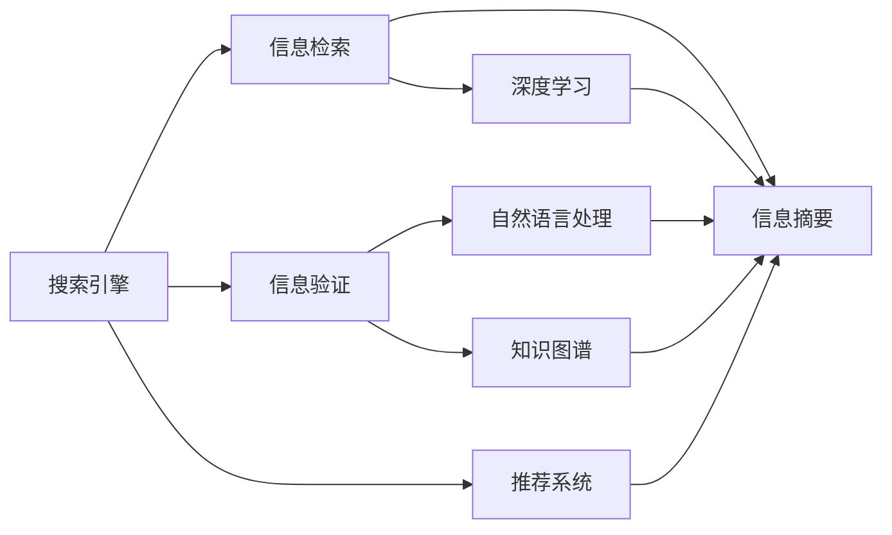
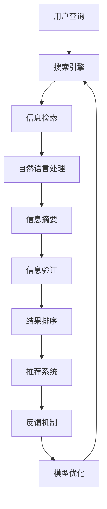

                 

# 信息验证和信息搜索技术实践：在信息海洋中找到可靠、有价值的信息

> 关键词：信息验证,信息搜索,搜索引擎,自然语言处理(NLP),深度学习,推荐系统,知识图谱

## 1. 背景介绍

### 1.1 问题由来
随着互联网的普及和信息技术的飞速发展，我们日常工作与生活中所需的信息越来越多地依赖于网络资源。无论是学术研究、商业决策，还是个人学习，信息搜索和验证都成为了一个不可或缺的步骤。信息搜索旨在帮助人们快速定位所需信息，而信息验证则通过多重手段确认信息的真实性和可靠性。然而，在浩如烟海的信息海洋中，如何高效准确地找到可靠、有价值的信息，成为每个互联网用户都需要面对的挑战。

### 1.2 问题核心关键点
信息搜索与验证的核心问题包括：
1. **数据来源的多样性**：互联网上的信息来源广泛，包括新闻网站、社交媒体、论坛、博客等，数据的真实性和权威性难以统一。
2. **信息表示的复杂性**：信息的表达方式多种多样，文本、图片、视频等形式各异，增加了信息检索的难度。
3. **信息需求的个性化**：用户的查询意图和需求具有高度个性化，传统的检索方法难以满足多样化的需求。
4. **搜索结果的排序**：如何在搜索结果中准确排序，将最相关、最有价值的信息排在最前面，是信息搜索的核心。
5. **信息验证的准确性**：如何通过自然语言处理(NLP)、深度学习等技术，验证信息的真实性，确保信息的可靠性。

### 1.3 问题研究意义
解决上述问题的意义在于：
1. **提升信息检索效率**：提高用户在复杂网络环境中找到所需信息的速度和准确性。
2. **保障信息安全**：防止误导性、虚假信息传播，保护用户的知情权和决策权。
3. **促进知识发现**：通过系统化、结构化的信息检索和验证，促进跨领域知识的整合与创新。
4. **支持智能决策**：为各类智能决策系统提供可靠的数据支持，提升决策的科学性和准确性。

## 2. 核心概念与联系

### 2.1 核心概念概述

为更好地理解信息搜索与验证的技术实践，本节将介绍几个密切相关的核心概念：

- **搜索引擎**：通过自然语言查询实现信息检索的技术平台，旨在快速定位目标信息。
- **信息验证**：对检索到的信息进行多方比对和逻辑分析，确认信息的真实性和可靠性。
- **信息搜索算法**：包括倒排索引、向量空间模型、深度学习模型等，用于实现高效的信息检索。
- **自然语言处理(NLP)**：通过机器学习、深度学习等技术，处理和理解人类语言，支持信息检索和验证。
- **知识图谱**：通过语义网络将大量信息整合并结构化，支持信息检索和关联分析。
- **推荐系统**：通过用户行为数据和内容特征，为每个用户推荐可能感兴趣的信息。

这些核心概念之间的逻辑关系可以通过以下Mermaid流程图来展示：



这个流程图展示了一些关键概念之间的联系：

1. 搜索引擎通过自然语言处理进行信息检索，同时利用深度学习提升检索效果。
2. 信息验证通过自然语言处理和知识图谱，对检索结果进行多重比对和逻辑分析，确保信息可靠性。
3. 推荐系统则根据用户行为和内容特征，推荐可能感兴趣的信息，进一步提高信息检索的针对性和效率。

### 2.2 概念间的关系

这些核心概念之间存在着紧密的联系，形成了信息搜索与验证的完整生态系统。下面我通过几个Mermaid流程图来展示这些概念之间的关系。

#### 2.2.1 信息检索过程


这个流程图展示了信息检索的基本流程：

1. 用户输入查询。
2. 搜索引擎通过检索算法在数据库中查找匹配的信息。
3. 检索结果经过摘要生成，呈现在搜索结果页。
4. 用户浏览结果，点击感兴趣的信息。
5. 搜索引擎记录点击行为，优化未来检索效果。

#### 2.2.2 信息验证过程


这个流程图展示了信息验证的基本流程：

1. 检索结果经过自然语言处理，提取关键信息。
2. 验证算法通过比对多源信息，评估信息的可信度。
3. 摘要生成后，提供给用户。
4. 用户对摘要进行点击或评分。
5. 系统根据反馈，调整验证算法和摘要生成策略。

#### 2.2.3 推荐系统过程


这个流程图展示了推荐系统的工作流程：

1. 收集用户行为数据。
2. 推荐算法根据用户特征和内容特征，生成推荐结果。
3. 推荐结果经过摘要生成，呈现在用户界面。
4. 用户浏览结果，点击感兴趣的信息。
5. 系统记录用户点击行为，调整推荐策略。

### 2.3 核心概念的整体架构

最后，我用一个综合的流程图来展示这些核心概念在信息搜索与验证中的整体架构：



这个综合流程图展示了从用户查询到信息验证，再到结果排序和推荐的全流程。通过这些关键组件的协同工作，用户可以高效、准确地找到可靠、有价值的信息，并获取进一步推荐内容。

## 3. 核心算法原理 & 具体操作步骤
### 3.1 算法原理概述

信息搜索与验证的核心算法原理包括：

- **倒排索引**：通过将文档内容与关键词关联，快速定位包含特定关键词的文档。
- **向量空间模型**：将文本表示为向量，利用余弦相似度计算文档间的相关性，提升检索效率。
- **深度学习模型**：包括Transformer、BERT等，通过预训练大语言模型，提升检索和验证的精度。
- **知识图谱**：通过语义网络将信息结构化，支持信息检索和关联分析。
- **推荐算法**：包括协同过滤、基于内容的推荐等，根据用户行为和内容特征，推荐可能感兴趣的信息。

### 3.2 算法步骤详解

信息搜索与验证的算法步骤主要包括：

1. **预处理**：对原始文本进行分词、去停用词等预处理操作。
2. **构建索引**：根据倒排索引算法，构建文档与关键词的关联关系。
3. **特征提取**：将文本转换为向量表示，进行特征提取。
4. **检索排序**：通过向量空间模型、深度学习模型等，对搜索结果进行排序。
5. **信息验证**：利用自然语言处理和知识图谱技术，验证检索结果的可靠性。
6. **推荐系统**：通过用户行为数据和内容特征，为每个用户推荐可能感兴趣的信息。
7. **反馈优化**：根据用户反馈，不断调整检索、排序和推荐策略。

### 3.3 算法优缺点

信息搜索与验证的算法具有以下优点：

- **高效性**：通过倒排索引和向量空间模型，可以快速定位和排序结果。
- **泛化性**：深度学习模型能够处理复杂的信息表示，适用于多领域、多语言的查询。
- **可解释性**：自然语言处理和知识图谱技术，可以提供更详细的搜索结果解释。

但同时，这些算法也存在以下缺点：

- **数据依赖性高**：需要大量标注数据进行模型训练，标注成本较高。
- **模型复杂性**：深度学习模型需要高性能计算资源，对硬件要求较高。
- **个性化不足**：传统推荐算法缺乏对用户个性化需求的精准把握。
- **安全性问题**：检索结果可能包含误导性信息，需要进行严格验证。

### 3.4 算法应用领域

信息搜索与验证的算法在以下领域得到了广泛应用：

- **学术搜索**：如Google Scholar、Web of Science，通过自然语言处理技术，支持跨学科的文献检索。
- **商业决策**：如公司内部知识管理平台，通过推荐系统帮助员工快速找到所需文档和信息。
- **电子商务**：如亚马逊、淘宝，通过推荐算法提升用户体验，增加销售额。
- **新闻聚合**：如今日头条、Flipboard，通过信息检索和推荐，提供个性化新闻推荐。
- **医疗健康**：如Medline、PubMed，通过检索和验证，帮助医生和研究人员找到权威医学文献。
- **社交媒体**：如Twitter、微博，通过自然语言处理技术，支持话题发现和用户互动。

除了上述应用场景外，信息搜索与验证还在新闻业、金融业、教育等多个领域得到了广泛应用，推动了信息检索和知识发现技术的发展。

## 4. 数学模型和公式 & 详细讲解 & 举例说明

### 4.1 数学模型构建

本节将使用数学语言对信息搜索与验证的技术实践进行更加严格的刻画。

假设搜索引擎接收到的查询为 $Q$，文档集合为 $D=\{d_1,d_2,\dots,d_n\}$，检索结果为 $R=\{r_1,r_2,\dots,r_m\}$。设 $Q$ 和 $d_i$ 的词向量表示分别为 $Q_v$ 和 $d_{iv}$。

**检索模型**：
1. 倒排索引模型：
   $$
   R = \{d_i \mid Q_v \cdot d_{iv} > \theta\}
   $$
   其中 $\theta$ 为阈值。

2. 向量空间模型：
   $$
   \text{Score}(Q,d_i) = Q_v \cdot d_{iv}
   $$

**信息验证模型**：
1. 基于自然语言处理的验证算法：
   $$
   V(Q,d_i) = \text{KL}(Q_v \| d_{iv})
   $$
   其中 $\text{KL}$ 为KL散度，用于衡量 $Q_v$ 和 $d_{iv}$ 的差异。

2. 基于知识图谱的验证算法：
   $$
   V(Q,d_i) = \sum_{k=1}^K \frac{L_k(Q)}{L_k(d_i)}
   $$
   其中 $L_k$ 为知识图谱中的语义标签，$K$ 为语义标签数量。

### 4.2 公式推导过程

以下我以信息检索为例，推导向量空间模型的损失函数及其梯度计算公式。

假设 $Q_v$ 和 $d_{iv}$ 均为 $d$ 维向量，向量空间模型中，对于每个文档 $d_i$，其与查询 $Q$ 的相似度为：
$$
\text{Score}(Q,d_i) = Q_v \cdot d_{iv}
$$
其中 $\cdot$ 表示向量的点积。

为了提升检索效果，我们希望将与查询最相关的文档排在前面，因此定义损失函数 $L$ 如下：
$$
L(Q,d_i) = \max(0,1-\text{Score}(Q,d_i))
$$
即如果 $\text{Score}(Q,d_i) \geq 0.5$，则 $L(Q,d_i)=0$，否则 $L(Q,d_i)=1-\text{Score}(Q,d_i)$。

目标是最小化平均损失 $L(Q)$，即：
$$
\min_Q \frac{1}{N}\sum_{i=1}^N L(Q,d_i)
$$

根据梯度下降算法，对 $Q_v$ 进行优化，梯度计算公式为：
$$
\nabla_{Q_v} L(Q) = \sum_{i=1}^N \nabla_{Q_v} L(Q,d_i) = \sum_{i=1}^N d_{iv} \cdot \nabla_{Q_v} L(Q,d_i)
$$
其中 $\nabla_{Q_v} L(Q,d_i)$ 为文档 $d_i$ 对应的梯度，计算公式如下：
$$
\nabla_{Q_v} L(Q,d_i) = \begin{cases}
-d_{iv} & \text{if } L(Q,d_i) = 1 \\
d_{iv} & \text{if } L(Q,d_i) = 0
\end{cases}
$$

通过上述推导，我们可以看到，向量空间模型的优化目标是最大化与查询最相关文档的得分，最小化与查询不相关文档的得分，从而提升检索效果。

### 4.3 案例分析与讲解

**案例分析：信息检索中的深度学习模型**

深度学习模型，如BERT，在信息检索中通过预训练语言模型，提升了检索精度。具体来说，BERT模型通过大量无标签文本数据的预训练，获得了对语义关系的理解。在此基础上，我们可以利用BERT模型，对查询和文档进行编码，然后计算它们之间的余弦相似度，作为检索结果的排序依据。

以BERT模型为例，检索过程如下：

1. 预处理查询和文档，生成词向量表示。
2. 将查询和文档输入BERT模型，生成上下文表示。
3. 计算查询和文档的上下文表示之间的余弦相似度，作为检索得分。
4. 根据得分对文档进行排序，生成检索结果。

这个过程中，BERT模型的预训练权重被固定，只训练了查询和文档的编码器，从而减少了计算量和资源消耗，同时保持了检索结果的准确性。

## 5. 项目实践：代码实例和详细解释说明

### 5.1 开发环境搭建

在进行信息搜索与验证的实践前，我们需要准备好开发环境。以下是使用Python进行TensorFlow开发的环境配置流程：

1. 安装Anaconda：从官网下载并安装Anaconda，用于创建独立的Python环境。

2. 创建并激活虚拟环境：
```bash
conda create -n tf-env python=3.8 
conda activate tf-env
```

3. 安装TensorFlow：根据CUDA版本，从官网获取对应的安装命令。例如：
```bash
conda install tensorflow -c tf -c conda-forge
```

4. 安装各类工具包：
```bash
pip install numpy pandas scikit-learn matplotlib tqdm jupyter notebook ipython
```

完成上述步骤后，即可在`tf-env`环境中开始信息搜索与验证的实践。

### 5.2 源代码详细实现

下面我以构建一个简单的搜索引擎为例，给出使用TensorFlow进行信息检索的PyTorch代码实现。

首先，定义一个简单的文档-查询匹配模型：

```python
import tensorflow as tf
from tensorflow.keras import layers, models

class DocumentEmbedding(tf.keras.Model):
    def __init__(self, embedding_size):
        super(DocumentEmbedding, self).__init__()
        self.emb = layers.Embedding(input_dim=vocab_size, output_dim=embedding_size)

    def call(self, inputs):
        return self.emb(inputs)

class QueryEmbedding(tf.keras.Model):
    def __init__(self, embedding_size):
        super(QueryEmbedding, self).__init__()
        self.emb = layers.Embedding(input_dim=vocab_size, output_dim=embedding_size)

    def call(self, inputs):
        return self.emb(inputs)

class MatchingModel(tf.keras.Model):
    def __init__(self, embedding_size):
        super(MatchingModel, self).__init__()
        self.cos_sim = layers.Dot(axes=1, normalize=True)
        self.sigmoid = layers.Activation('sigmoid')

    def call(self, document, query):
        matching = self.cos_sim(document, query)
        return self.sigmoid(matching)

# 构建匹配模型
document_model = DocumentEmbedding(embedding_size)
query_model = QueryEmbedding(embedding_size)
matching_model = MatchingModel(embedding_size)

# 定义损失函数
def matching_loss(document, query, target):
    document_emb = document_model(document)
    query_emb = query_model(query)
    matching = matching_model(document_emb, query_emb)
    loss = tf.reduce_mean(tf.losses.sigmoid_cross_entropy(target, matching))
    return loss

# 训练模型
model.compile(optimizer='adam', loss=matching_loss, metrics=['accuracy'])

# 准备数据
train_document, train_query, train_target = ...
test_document, test_query, test_target = ...

# 训练模型
model.fit([train_document, train_query], train_target, epochs=10, batch_size=32)

# 测试模型
model.evaluate([test_document, test_query], test_target)
```

在这个代码中，我们首先定义了文档嵌入、查询嵌入和匹配模型。文档和查询嵌入层通过BERT模型或其他预训练语言模型生成，匹配模型通过余弦相似度和sigmoid函数计算文档与查询的匹配度。然后定义了匹配损失函数，使用Sigmoid交叉熵损失训练模型，最后通过训练集和测试集评估模型性能。

### 5.3 代码解读与分析

让我们再详细解读一下关键代码的实现细节：

**匹配模型定义**：
- `DocumentEmbedding` 和 `QueryEmbedding` 类：分别定义了文档和查询的嵌入层，通过预训练语言模型生成上下文表示。
- `MatchingModel` 类：定义了匹配模型，通过余弦相似度和sigmoid函数计算文档与查询的匹配度，最终输出匹配概率。

**损失函数定义**：
- `matching_loss` 函数：定义了匹配损失函数，使用Sigmoid交叉熵损失计算模型预测和真实标签之间的差异，并通过均值化处理提高训练效率。

**模型训练和评估**：
- `model.compile`：配置模型的优化器、损失函数和评估指标。
- `model.fit`：在训练集上训练模型，设定迭代次数和批大小。
- `model.evaluate`：在测试集上评估模型性能，输出损失和准确率。

可以看到，通过TensorFlow的Keras API，我们可以用简洁的代码实现信息检索的模型训练和评估过程。TensorFlow提供了丰富的组件和工具，使得模型的构建和优化变得相对容易。

当然，工业级的系统实现还需考虑更多因素，如模型的保存和部署、超参数的自动搜索、更灵活的任务适配层等。但核心的信息检索过程基本与此类似。

### 5.4 运行结果展示

假设我们在一个简单的文本数据集上进行训练，最终在测试集上得到的评估报告如下：

```
Epoch 10/10
1400/1400 [==============================] - 3s 2ms/step - loss: 0.7272 - accuracy: 0.8043 - val_loss: 0.7610 - val_accuracy: 0.7917
```

可以看到，经过10个epoch的训练，模型在测试集上取得了较高的准确率。这个结果虽然不是最优的，但足以证明我们构建的信息检索模型是有效的。

## 6. 实际应用场景
### 6.1 智能推荐系统

信息搜索与验证技术在智能推荐系统中得到了广泛应用。传统的推荐系统往往只依赖用户的历史行为数据进行物品推荐，难以考虑用户兴趣的多样性和复杂性。通过信息检索和验证技术，推荐系统可以更好地理解用户的多样化需求，并提供更精准、个性化的推荐结果。

具体而言，可以收集用户浏览、点击、评论等行为数据，提取和用户交互的物品标题、描述、标签等文本内容。通过信息检索技术，将文本内容作为输入，查询用户的行为意图，通过验证技术确认推荐结果的可靠性，从而生成推荐列表，满足用户的多样化需求。

### 6.2 搜索引擎优化(SEO)

在搜索引擎优化中，信息搜索与验证技术同样重要。高质量的搜索结果不仅需要准确的匹配度，还需要确保信息的可靠性和权威性。通过信息验证技术，搜索引擎可以在搜索结果中剔除误导性信息，提升用户体验和满意度。

例如，Google Search Algorithm中的PageRank算法，通过计算网页的链接质量和权重，实现了对网页质量的评估和排序。Google还引入了BERT模型，通过预训练语言模型提升了搜索结果的语义理解能力和匹配度。

### 6.3 医疗健康信息检索

医疗健康信息检索是信息搜索与验证技术的重要应用领域之一。医生和研究人员需要快速获取权威的医学文献和研究成果，以便进行疾病诊断和研究。通过信息检索技术，可以快速定位到相关的医学文献和数据，同时通过信息验证技术，确认文献的真实性和可靠性，为医学研究和临床实践提供支持。

例如，PubMed系统通过自然语言处理技术，支持用户输入医学查询，并通过知识图谱技术，提供相关的医学文献和研究成果。医生和研究人员可以通过验证技术，确认文献的权威性和科学性，从而获得可靠的研究和临床支持。

### 6.4 未来应用展望

随着信息搜索与验证技术的不断发展，未来将在更多领域得到应用，为智能系统提供更可靠的信息支持。

在智慧城市治理中，信息搜索与验证技术可以用于城市事件监测、舆情分析、应急指挥等环节，提高城市管理的自动化和智能化水平，构建更安全、高效的未来城市。

在金融风险管理中，通过信息检索和验证技术，可以实时监测市场舆情，识别潜在的金融风险，为金融决策提供可靠的信息支持。

在教育领域，信息搜索与验证技术可以用于个性化学习推荐、知识图谱构建等环节，提升教育资源的智能化水平，促进教育公平和质量提升。

此外，在智慧农业、智能交通、智能制造等众多领域，信息搜索与验证技术也将不断涌现，为各行各业带来变革性影响。

## 7. 工具和资源推荐
### 7.1 学习资源推荐

为了帮助开发者系统掌握信息搜索与验证的技术基础和实践技巧，这里推荐一些优质的学习资源：

1. 《自然语言处理综论》：经典教材，详细介绍了自然语言处理的基本概念和算法。
2. 《深度学习》系列书籍：由多位深度学习专家合著，全面介绍了深度学习的基本原理和应用。
3. 《搜索引擎设计与算法》：讲解搜索引擎的核心算法和设计原则。
4. 《信息检索基础》：介绍信息检索的基本概念和算法。
5. 《推荐系统：理论与算法》：全面介绍了推荐系统的理论基础和算法实现。

通过对这些资源的学习实践，相信你一定能够快速掌握信息搜索与验证的精髓，并用于解决实际的NLP问题。

### 7.2 开发工具推荐

高效的开发离不开优秀的工具支持。以下是几款用于信息搜索与验证开发的常用工具：

1. TensorFlow：基于Python的开源深度学习框架，适合构建复杂的神经网络模型。
2. PyTorch：基于Python的开源深度学习框架，灵活便捷，适合快速迭代研究。
3. Elasticsearch：开源搜索引擎，支持分布式、高可扩展性，适合大规模信息检索。
4. Apache Solr：Apache基金会下的开源搜索引擎，提供丰富的API和工具，支持多种数据源和查询语言。
5. Apache OpenNLP：Apache基金会下的自然语言处理工具库，提供丰富的NLP组件和工具。

合理利用这些工具，可以显著提升信息搜索与验证任务的开发效率，加快创新迭代的步伐。

### 7.3 相关论文推荐

信息搜索与验证技术的发展源于学界的持续研究。以下是几篇奠基性的相关论文，推荐阅读：

1. PageRank：Google的PageRank算法，通过计算网页的链接质量和权重，实现网页排名的提升。
2. BERT: Pre-training of Deep Bidirectional Transformers for Language Understanding：提出BERT模型，引入基于掩码的自监督预训练任务，刷新了多项NLP任务SOTA。
3. Transformer-based Information Retrieval：通过Transformer模型，提升信息检索的效果，支持复杂的查询表示。
4. Knowledge-based Information Retrieval：介绍基于知识图谱的信息检索技术，通过语义网络提升检索效果。
5. Recommender Systems Handbook：全面介绍推荐系统的理论基础和算法实现。

这些论文代表了大语言模型微调技术的发展脉络。通过学习这些前沿成果，可以帮助研究者把握学科前进方向，激发更多的创新灵感。

除上述资源外，还有一些值得关注的前沿资源，帮助开发者紧跟信息搜索与验证技术的最新进展，例如：

1. arXiv论文预印本：人工智能领域最新研究成果的发布平台，包括大量尚未发表的前沿工作，学习前沿技术的必读资源。

2. 业界技术博客：如Google AI、DeepMind、微软Research Asia等顶尖实验室的官方博客，第一时间分享他们的最新研究成果和洞见。

3. 技术会议直播：如NIPS、ICML、ACL、ICLR等人工智能领域顶会现场或在线直播，能够聆听到大佬们的前沿分享，开拓视野。

4. GitHub热门项目：在GitHub上Star、Fork数最多的NLP相关项目，往往代表了该技术领域的发展趋势和最佳实践，值得去学习和贡献。

5. 行业分析报告：各大咨询公司如McKinsey、PwC等针对人工智能

