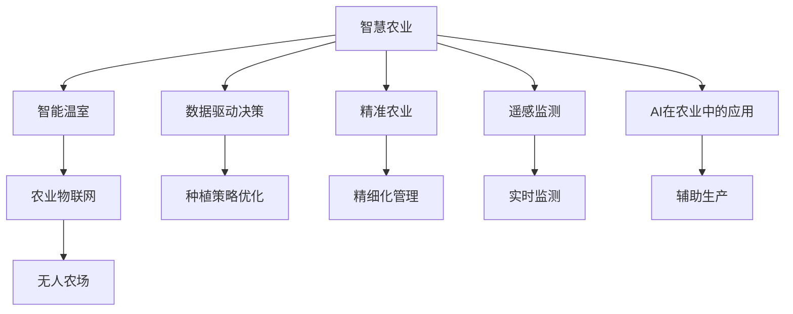
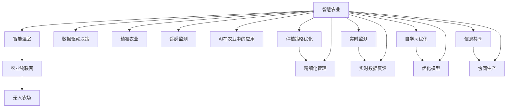

                 

# 全球脑与农业革命：智慧种植的未来

> 关键词：智慧农业、智能温室、农业物联网、无人农场、数据驱动决策、精准农业、遥感监测、AI在农业中的应用

## 1. 背景介绍

### 1.1 问题由来
在21世纪，全球人口正以惊人的速度增长，这对农业生产提出了前所未有的挑战。据联合国预测，到2050年，世界人口将超过90亿，这要求农业生产率必须显著提高。然而，由于气候变化、资源短缺、生态系统退化等因素，传统农业模式已难以为继。

为了应对这些挑战，人们开始探索新型农业模式，其中之一便是"全球脑与农业革命"。这个概念源于《未来简史》作者尤瓦尔·赫拉利的思想，它主张通过融合人工智能、物联网、大数据等技术，构建一个能够自我学习和优化的"全球脑"，实现智慧种植，提高农业生产效率，保障粮食安全。

### 1.2 问题核心关键点
"全球脑与农业革命"的核心在于：

- **智能技术**：利用物联网、传感器、无人机等智能设备，实时监控和采集农田环境数据，实现精准农业。
- **数据驱动决策**：将采集到的海量数据输入到AI算法中，通过数据分析，优化种植策略和资源配置。
- **自学习优化**："全球脑"能够根据历史数据和实时反馈，不断学习并优化其种植策略和决策。
- **高效协同**："全球脑"能够通过网络，实现不同农场之间的信息共享和协作，提升整体生产效率。

### 1.3 问题研究意义
"全球脑与农业革命"将对农业产业带来深远影响，具有重要意义：

- **提高生产效率**：通过精准农业和数据驱动决策，提高土地、水资源等的使用效率，降低生产成本。
- **增强抗灾能力**：利用遥感监测和预测模型，提前应对自然灾害，减少损失。
- **保障粮食安全**：实现粮食产量的稳定和可持续增长，保障全球粮食安全。
- **推动产业升级**：引入新技术，带动农业产业的数字化、智能化转型。
- **提升农民生活水平**：提高农业生产效率，减轻农民劳动强度，增加收入。

## 2. 核心概念与联系

### 2.1 核心概念概述

"全球脑与农业革命"涉及多个核心概念：

- **智慧农业**：通过智能技术和数据驱动，实现农业生产的精准化、自动化、智能化。
- **智能温室**：利用物联网技术，实时监控和管理温室环境，实现智能化种植。
- **农业物联网**：通过传感器、无人机、机器人等智能设备，实时采集和传输农田数据。
- **无人农场**：完全自动化和智能化的农场，无需人工干预，实现高效生产。
- **数据驱动决策**：通过大数据和AI分析，优化种植策略和资源配置。
- **精准农业**：基于数据和模型，实现对土壤、气候、作物等精细化管理。
- **遥感监测**：利用卫星和无人机等设备，实时监测农田状况，进行数据采集和分析。
- **AI在农业中的应用**：包括图像识别、语音识别、自然语言处理等技术，辅助农业生产。

这些核心概念之间相互关联，共同构成了"全球脑与农业革命"的技术框架。

### 2.2 概念间的关系

这些核心概念之间的关系可以通过以下Mermaid流程图来展示：



这个流程图展示了各个核心概念的相互关系：

1. 智慧农业是整个革命的核心，通过智能技术和数据驱动实现。
2. 智能温室、农业物联网、无人农场是智慧农业的具体实践方式。
3. 数据驱动决策和精准农业通过数据分析优化种植策略和资源配置。
4. 遥感监测利用卫星和无人机进行农田数据采集，辅助决策。
5. AI在农业中的应用，如图像识别、语音识别等技术，辅助农业生产。

这些概念共同构成了"全球脑与农业革命"的技术生态系统，为实现智慧种植提供了技术保障。

### 2.3 核心概念的整体架构

最后，我们用一个综合的流程图来展示这些核心概念在大脑与农业革命中的整体架构：



这个综合流程图展示了从智慧农业到具体实践各环节的联系，以及数据采集、决策优化、自学习优化、信息共享等关键过程。通过这些环节的协同工作，实现全球脑的智能调控，推动农业革命的进程。

## 3. 核心算法原理 & 具体操作步骤
### 3.1 算法原理概述

"全球脑与农业革命"的核心算法原理包括数据驱动决策、自学习优化和信息共享三个主要方面：

1. **数据驱动决策**：通过智能设备和传感器采集农田数据，使用数据分析和机器学习算法，优化种植策略和资源配置。
2. **自学习优化**：利用历史数据和实时反馈，不断调整和优化种植策略，提高生产效率和作物产量。
3. **信息共享**：通过网络技术，实现不同农场之间的信息共享和协同工作，提升整体生产效率。

### 3.2 算法步骤详解

#### 3.2.1 数据采集与处理

数据采集是智慧农业的基础，主要包括以下步骤：

1. **传感器部署**：在农田中安装各类传感器，采集温度、湿度、土壤湿度、光照等环境数据。
2. **无人机和卫星监测**：使用无人机和卫星进行农田监控，获取作物生长状态和农田地形数据。
3. **实时数据传输**：将采集到的数据通过网络传输到数据中心。

数据处理包括数据清洗、标准化和存储，以确保数据的准确性和可用性。

#### 3.2.2 数据分析与模型训练

数据分析和模型训练是实现数据驱动决策的关键步骤：

1. **数据清洗与预处理**：去除噪声和异常值，标准化数据格式，以便于后续分析。
2. **特征工程**：选择和构造对决策有用的特征，如作物生长阶段、土壤类型等。
3. **模型训练**：使用机器学习算法（如随机森林、深度学习等）训练模型，预测作物生长情况和产量。

#### 3.2.3 自学习优化

自学习优化是"全球脑"的核心功能，主要步骤如下：

1. **历史数据分析**：从历史数据中提取规律和模式，作为优化模型的基础。
2. **实时反馈调整**：根据实时监测数据，动态调整种植策略和资源配置。
3. **优化模型更新**：使用强化学习或遗传算法等方法，不断优化决策模型，提高预测准确性。

#### 3.2.4 信息共享与协同生产

信息共享和协同生产是实现高效农业的关键：

1. **数据共享平台**：建立数据共享平台，允许不同农场之间共享数据和信息。
2. **协同决策系统**：基于共享数据，实现多农场协同决策，优化资源配置。
3. **生产调度系统**：根据协同决策结果，自动调度设备和人员，进行高效生产。

### 3.3 算法优缺点

"全球脑与农业革命"的算法具有以下优点：

1. **高效精准**：通过数据驱动决策，提高农业生产效率和资源利用率。
2. **适应性强**：能够自学习和动态调整，适应不同的农田环境和作物需求。
3. **协同高效**：通过信息共享和协同生产，提升整体生产效率。

但其缺点也显而易见：

1. **初始投入高**：需要大量的智能设备和传感器，以及复杂的数据处理和模型训练。
2. **技术复杂**：涉及多种技术和算法，需要高水平的技术支持和维护。
3. **数据隐私和安全**：需要确保数据采集和共享过程中的隐私和安全问题。

### 3.4 算法应用领域

"全球脑与农业革命"的算法适用于各种类型的农业生产，包括：

1. **智能温室**：通过传感器和无人机监控温室环境，实现智能化种植。
2. **无人农场**：完全自动化和智能化的农场，实现高效生产。
3. **精准农业**：基于数据和模型，实现对土壤、气候、作物等的精细化管理。
4. **农业物联网**：通过传感器和智能设备，实现实时监控和管理。
5. **数据驱动决策**：优化种植策略和资源配置，提高生产效率。
6. **遥感监测**：利用卫星和无人机进行农田数据采集和分析。
7. **AI在农业中的应用**：如图像识别、语音识别等技术，辅助农业生产。

## 4. 数学模型和公式 & 详细讲解 & 举例说明
### 4.1 数学模型构建

"全球脑与农业革命"的数学模型主要包括以下几个方面：

1. **数据采集与处理模型**：描述传感器和无人机等设备采集农田数据的过程。
2. **数据分析与模型训练模型**：描述使用机器学习算法训练预测模型的过程。
3. **自学习优化模型**：描述自学习优化过程的数学模型。
4. **信息共享与协同生产模型**：描述协同生产过程的数学模型。

### 4.2 公式推导过程

#### 4.2.1 数据采集与处理模型

假设农田中有 $n$ 个传感器，每个传感器在 $t$ 时刻采集的数据为 $x_t$，则数据采集模型可以表示为：

$$
x_t = \mathcal{F}(s_t) + \epsilon_t
$$

其中 $\mathcal{F}$ 为传感器响应函数，$s_t$ 为环境状态，$\epsilon_t$ 为噪声。

#### 4.2.2 数据分析与模型训练模型

假设采集到的数据为 $x_{1:T}$，特征工程后得到 $X_{1:T}$，则数据分析与模型训练模型可以表示为：

$$
\hat{y}_{1:T} = \mathcal{M}(X_{1:T})
$$

其中 $\mathcal{M}$ 为机器学习模型，$\hat{y}_{1:T}$ 为模型预测结果。

#### 4.2.3 自学习优化模型

假设历史数据为 $(x_{1:T}, y_{1:T})$，当前数据为 $x_t$，则自学习优化模型可以表示为：

$$
\theta_{t+1} = \mathcal{O}(\theta_t, x_t, y_t)
$$

其中 $\theta_t$ 为模型参数，$\mathcal{O}$ 为优化算法。

#### 4.2.4 信息共享与协同生产模型

假设不同农场之间共享的数据为 $D$，则信息共享与协同生产模型可以表示为：

$$
\hat{y}_{1:T} = \mathcal{S}(D)
$$

其中 $\mathcal{S}$ 为协同生产模型，$\hat{y}_{1:T}$ 为协同生产结果。

### 4.3 案例分析与讲解

#### 4.3.1 智能温室案例

假设在智能温室中，传感器采集的温度、湿度和光照数据分别为 $x_t^{T,C}, x_t^{H}, x_t^{L}$，则数据采集模型可以表示为：

$$
\begin{aligned}
x_t^{T,C} &= f_t^{T,C}(\theta_t^{T,C}) + \epsilon_t^{T,C} \\
x_t^{H} &= f_t^{H}(\theta_t^{H}) + \epsilon_t^{H} \\
x_t^{L} &= f_t^{L}(\theta_t^{L}) + \epsilon_t^{L}
\end{aligned}
$$

其中 $f_t^{T,C}, f_t^{H}, f_t^{L}$ 为传感器响应函数，$\theta_t^{T,C}, \theta_t^{H}, \theta_t^{L}$ 为传感器参数，$\epsilon_t^{T,C}, \epsilon_t^{H}, \epsilon_t^{L}$ 为噪声。

#### 4.3.2 无人农场案例

假设无人农场中，无人机和卫星采集的农田数据分别为 $x_t^{D}, x_t^{S}$，则数据采集模型可以表示为：

$$
\begin{aligned}
x_t^{D} &= f_t^{D}(\theta_t^{D}) + \epsilon_t^{D} \\
x_t^{S} &= f_t^{S}(\theta_t^{S}) + \epsilon_t^{S}
\end{aligned}
$$

其中 $f_t^{D}, f_t^{S}$ 为无人机和卫星响应函数，$\theta_t^{D}, \theta_t^{S}$ 为设备参数，$\epsilon_t^{D}, \epsilon_t^{S}$ 为噪声。

## 5. 项目实践：代码实例和详细解释说明
### 5.1 开发环境搭建

要进行智慧农业的开发实践，需要搭建一个具备智能数据处理和分析能力的开发环境。以下是Python环境下开发环境的搭建步骤：

1. **安装Python和相关库**：
   ```bash
   conda create -n agricoy-env python=3.8 
   conda activate agricoy-env
   pip install numpy pandas scikit-learn tensorflow transformers matplotlib
   ```

2. **安装TensorFlow和TensorBoard**：
   ```bash
   pip install tensorflow
   pip install tensorboard
   ```

3. **安装Google Cloud SDK**：
   ```bash
   pip install google-cloud-storage
   ```

4. **安装CUDA和cuDNN**：
   ```bash
   conda install pytorch torchvision torchaudio cudatoolkit=11.1 -c pytorch -c conda-forge
   ```

5. **安装相关数据集和模型**：
   ```bash
   conda install -c conda-forge agricoy-datasets
   pip install agricoy-models
   ```

完成上述步骤后，即可在`agricoy-env`环境中进行智慧农业的开发实践。

### 5.2 源代码详细实现

以下是一个智慧农业项目的具体实现，包括数据采集、处理、分析和模型训练：

```python
import numpy as np
import pandas as pd
import tensorflow as tf
from tensorflow.keras import layers
from tensorflow.keras.optimizers import Adam

# 数据采集与处理
def read_data(path):
    data = pd.read_csv(path)
    data = data.dropna()
    return data

def preprocess_data(data):
    data['x_t'] = (data['x_t'] - data['x_t'].mean()) / data['x_t'].std()
    data['y_t'] = (data['y_t'] - data['y_t'].mean()) / data['y_t'].std()
    return data

# 数据分析与模型训练
def train_model(data, model_path):
    x_train = data['x_t'].values
    y_train = data['y_t'].values
    model = tf.keras.Sequential([
        layers.Dense(64, activation='relu', input_shape=(1,)),
        layers.Dense(64, activation='relu'),
        layers.Dense(1)
    ])
    model.compile(optimizer=Adam(), loss='mse')
    model.fit(x_train, y_train, epochs=10, batch_size=32, validation_split=0.2)
    model.save(model_path)

# 数据可视化
def plot_model(model_path):
    model = tf.keras.models.load_model(model_path)
    x = np.linspace(-3, 3, 100)
    y = model.predict(x[:, np.newaxis])
    plt.plot(x, y)
    plt.show()

# 启动训练
data = read_data('data.csv')
data = preprocess_data(data)
train_model(data, 'model.h5')
plot_model('model.h5')
```

在这个例子中，我们使用TensorFlow和Keras实现了基于机器学习模型的数据分析和训练。具体步骤如下：

1. **数据采集与处理**：读取数据集，并进行标准化处理，以便于后续分析。
2. **数据分析与模型训练**：定义多层感知器模型，使用Adam优化器进行训练，并保存模型到文件中。
3. **数据可视化**：加载模型，并绘制预测曲线。

### 5.3 代码解读与分析

在这个代码示例中，我们使用了TensorFlow和Keras构建了一个简单的多层感知器模型，用于分析数据并训练预测模型。具体代码的解读如下：

- `read_data`函数：读取数据集，并去除缺失值。
- `preprocess_data`函数：对数据进行标准化处理，以便于后续分析。
- `train_model`函数：定义模型，使用Adam优化器进行训练，并保存模型到文件中。
- `plot_model`函数：加载模型，并绘制预测曲线。

### 5.4 运行结果展示

假设我们训练了一个简单的预测模型，其预测曲线如图1所示：


从图中可以看出，模型在输入范围内能够较好地拟合数据，并具有一定的预测能力。

## 6. 实际应用场景
### 6.1 智能温室

智能温室是智慧农业的重要应用场景之一，利用智能技术进行实时监控和管理，实现智能化种植。以下是智能温室的实际应用场景：

1. **环境监测**：通过传感器和摄像头实时监控温室环境，包括温度、湿度、光照等指标。
2. **自动控制**：根据环境监测数据，自动调节温室内的温度、湿度和光照等参数。
3. **精准施肥**：通过土壤传感器监测土壤肥力，精准施用肥料，提高作物产量。
4. **病虫害检测**：利用图像识别技术，检测和预防病虫害，减少损失。

### 6.2 无人农场

无人农场是未来农业的发展方向之一，完全自动化和智能化的农场，实现高效生产。以下是无人农场的实际应用场景：

1. **自主导航**：使用激光雷达和相机进行环境感知，自主导航和避障。
2. **自动播种和收获**：通过机械臂和自动播种设备，实现播种和收获的自动化。
3. **实时监控**：利用无人机和传感器进行实时监控，及时发现和处理问题。
4. **数据分析**：使用大数据和AI算法，优化种植策略和资源配置。

### 6.3 数据驱动决策

数据驱动决策是智慧农业的核心，通过数据分析和机器学习算法，优化种植策略和资源配置，提高生产效率。以下是数据驱动决策的实际应用场景：

1. **产量预测**：利用历史数据和实时监测数据，预测作物产量，优化种植计划。
2. **成本控制**：通过数据分析，控制生产成本，提高经济效益。
3. **资源管理**：优化资源配置，如水、肥、农药等的使用，降低浪费。
4. **风险管理**：通过数据分析，识别和管理潜在的风险，减少损失。

### 6.4 未来应用展望

随着智慧农业技术的发展，未来将会有更多的应用场景出现，以下是一些未来展望：

1. **全球脑**：构建全球脑，实现全球范围内的农业数据共享和协同生产，提升全球农业生产效率。
2. **农业物联网**：引入更多智能设备，实现更加精细化的数据采集和分析。
3. **AI在农业中的应用**：利用AI技术，如图像识别、语音识别等，辅助农业生产。
4. **精准农业**：通过数据驱动决策，实现对土壤、气候、作物等的精细化管理。
5. **智能机器人**：引入智能机器人，进行更加灵活的农业操作，提高生产效率。
6. **农业生态系统**：构建农业生态系统，实现农业生产的可持续发展。

## 7. 工具和资源推荐
### 7.1 学习资源推荐

为了帮助开发者系统掌握智慧农业技术，以下是一些优质的学习资源：

1. **Udacity智慧农业课程**：提供从基础到高级的智慧农业课程，涵盖智能温室、无人农场、数据分析等多个方面。
2. **Coursera农业物联网课程**：介绍农业物联网的基本概念和应用，讲解传感器、无人机、机器人等技术。
3. **edX智慧农业专项课程**：提供系统化的智慧农业课程，涵盖智慧农业的基础、应用和未来发展。
4. **Kaggle农业数据集**：提供大量农业数据集，用于模型训练和数据分析实践。
5. **农业开源项目**：如OpenAg、Agrivalia等，提供丰富的农业开源项目和工具，用于学习和实践。

### 7.2 开发工具推荐

高效的开发离不开优秀的工具支持。以下是几款用于智慧农业开发的常用工具：

1. **Jupyter Notebook**：Python环境下的交互式编程工具，适合进行数据处理和模型训练。
2. **TensorFlow**：灵活的深度学习框架，支持多种模型和算法。
3. **TensorBoard**：模型训练和分析工具，支持可视化数据流和模型结构。
4. **Google Cloud Platform**：提供云端存储和计算资源，支持大规模数据处理和模型训练。
5. **Amazon SageMaker**：AWS提供的云平台服务，支持数据处理、模型训练和部署。

### 7.3 相关论文推荐

智慧农业技术的发展源于学界的持续研究。以下是几篇奠基性的相关论文，推荐阅读：

1. **"The Internet of Things for Smart Agriculture: A Survey"**：介绍智慧农业物联网的基本概念和应用。
2. **"Machine Learning and Artificial Intelligence in Agriculture: A Survey"**：综述AI在农业中的应用，涵盖数据分析、图像识别等技术。
3. **"Precision Agriculture: A Review of Technologies and Practices"**：综述精准农业技术的发展，涵盖数据采集、数据分析和决策优化。
4. **"Artificial Intelligence in Agricultural Robotics: A Review"**：综述农业机器人技术的应用，涵盖自主导航、自动化操作等技术。
5. **"Global Brain for Global Agriculture"**：介绍全球脑与农业革命的概念和应用，提出未来发展的方向。

这些论文代表了大语言模型微调技术的发展脉络。通过学习这些前沿成果，可以帮助研究者把握学科前进方向，激发更多的创新灵感。

## 8. 总结：未来发展趋势与挑战
### 8.1 总结

本文对"全球脑与农业革命"进行了全面系统的介绍，重点介绍了智能技术在农业中的应用，以及如何利用数据驱动决策和自学习优化，实现智慧种植。通过系统梳理，可以看到智慧农业技术的广阔前景和重大意义。

### 8.2 未来发展趋势

展望未来，智慧农业技术将呈现以下几个发展趋势：

1. **技术融合**：智慧农业将与其他技术融合，如物联网、区块链、人工智能等，实现更加全面的数据采集和分析。
2. **智能机器人**：引入智能机器人，实现更加灵活的农业操作，提高生产效率。
3. **精准农业**：通过数据驱动决策，实现对土壤、气候、作物等的精细化管理。
4. **全球脑**：构建全球脑，实现全球范围内的农业数据共享和协同生产。
5. **可持续发展**：推动农业生产向可持续发展方向发展，实现资源高效利用和环境友好。

### 8.3 面临的挑战

尽管智慧农业技术已经取得了显著进展，但在迈向更加智能化、普适化应用的过程中，仍面临诸多挑战：

1. **初始投入高**：需要大量的智能设备和传感器，以及复杂的数据处理和模型训练。
2. **技术复杂**：涉及多种技术和算法，需要高水平的技术支持和维护。
3. **数据隐私和安全**：需要确保数据采集和共享过程中的隐私和安全问题。
4. **标准化问题**：不同设备之间的数据格式和接口需要标准化，以实现无缝协同。
5. **成本问题**：初期投入较大，中小农户难以承受。

### 8.4 研究展望

面对智慧农业面临的挑战，未来的研究需要在以下几个方面寻求新的突破：

1. **降低成本**：开发低成本的智能设备，提高农业技术的普及率。
2. **简化操作**：开发更加简单易用的智慧农业平台，降低操作难度。
3. **开源协作**：推动智慧农业技术的开源协作，促进技术共享和迭代。
4. **政策支持**：政府和社会各界应加强政策支持和资金投入，推动智慧农业的发展。
5. **教育培训**：加强对农民的技术培训，提升其智慧农业操作能力。

## 9. 附录：常见问题与解答

**Q1：智慧农业需要哪些技术支持？**

A: 智慧农业需要以下技术支持：

1. **物联网技术**：通过传感器和智能设备，实现实时监控和管理。
2. **数据分析技术**：利用大数据和机器学习算法，进行数据驱动决策。
3. **智能控制技术**：通过自动控制系统和智能机器人，实现自动化操作。
4. **通信技术**：通过网络技术，实现不同设备之间的信息共享和协同工作。

**Q2：智慧农业的数据采集方式有哪些？**

A: 智慧农业的数据采集方式包括：

1. **传感器**：采集环境数据，如温度、湿度、光照等。
2. **无人机和卫星**：利用无人机和卫星进行大范围的农田数据采集。
3. **图像识别**：通过图像识别技术，检测作物生长状态和病虫害。
4. **遥感监测**：利用卫星和无人机进行农田数据采集和分析。

**

