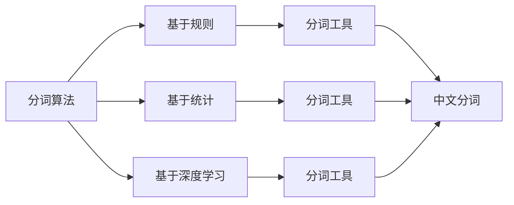
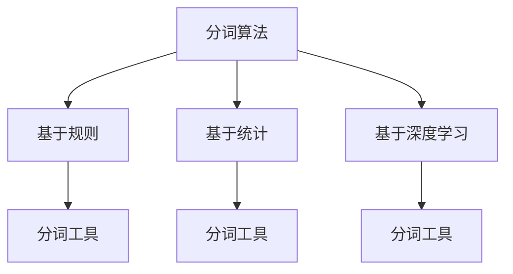
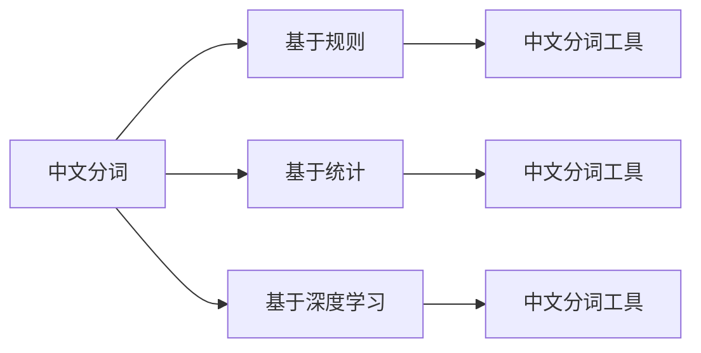

                 

# 分词 原理与代码实例讲解

> 关键词：分词,分词原理,分词算法,分词工具,分词效率,分词精度,中文分词,分词模型,分词应用,分词效果

## 1. 背景介绍

### 1.1 问题由来
在自然语言处理(Natural Language Processing, NLP)领域，分词(Word Segmentation)是一个基础且重要的任务，它将连续的文本序列分割成有意义的词语序列，是后续诸如文本分类、命名实体识别、信息检索、机器翻译等任务的前提。分词的准确度直接影响后续NLP任务的性能，因此分词技术的重要性不言而喻。

随着深度学习技术的兴起，分词也开始从传统的基于规则和统计的方法，逐步向基于深度学习模型的方法过渡。基于深度学习的分词方法，通过大量的标注数据进行训练，能够在分词精度和速度上取得显著提升。本文将详细介绍分词的原理与代码实例，展示如何利用深度学习技术进行高效的中文分词。

### 1.2 问题核心关键点
分词的核心关键点包括：

1. 分词的准确度和效率：如何通过模型设计提升分词的精度和处理速度。
2. 分词的标注数据：如何获取和处理高质量的标注数据。
3. 分词的深度学习模型：选择和训练适合分词任务的深度学习模型。
4. 分词的工具和框架：介绍常用的分词工具和深度学习框架。

## 2. 核心概念与联系

### 2.1 核心概念概述

为更好地理解分词的原理与代码实例，本节将介绍几个密切相关的核心概念：

- 分词(Word Segmentation)：将连续的文本序列分割成有意义的词语序列的过程。中文分词由于汉字的连续性，相比于英文分词更为复杂。
- 分词算法：分词过程中使用的具体算法，包括基于规则、统计、深度学习等多种方法。
- 分词工具：提供了分词功能的软件或库，如jieba、HanLP等。
- 分词效率：分词算法和工具的性能指标之一，衡量分词的速度和内存消耗。
- 分词精度：分词算法和工具的性能指标之一，衡量分词的准确度。
- 中文分词：中文文本的特殊性决定了中文分词的复杂性和重要性。

这些核心概念之间的逻辑关系可以通过以下Mermaid流程图来展示：



这个流程图展示了大语言模型微调过程中各个核心概念的关系：

1. 分词算法有基于规则、统计和深度学习等多种方法，对应于不同的分词工具。
2. 中文分词由于语言的特殊性，需要使用专门的中文分词工具。
3. 基于深度学习的分词工具通过神经网络模型进行分词，通常具有更高的精度。
4. 中文分词工具通过训练，能够适应中文文本的特殊分词需求。

### 2.2 概念间的关系

这些核心概念之间存在着紧密的联系，形成了中文分词的技术生态系统。下面我们通过几个Mermaid流程图来展示这些概念之间的关系。

#### 2.2.1 分词算法与分词工具的关系



这个流程图展示了分词算法与分词工具的关系：基于规则、统计和深度学习的三种分词算法，分别对应于不同的分词工具，每种分词工具在实现时可能选择其中一种或多种算法进行结合。

#### 2.2.2 中文分词的实现路径



这个流程图展示了中文分词的实现路径：中文分词由于其特殊性，需要使用专门的中文分词工具。这些工具通常基于不同的分词算法，以适应中文文本的特殊需求。

## 3. 核心算法原理 & 具体操作步骤
### 3.1 算法原理概述

中文分词是中文自然语言处理的基础任务，其算法原理相对复杂。常见的中文分词算法包括基于规则、基于统计和基于深度学习三种主要方法。

#### 3.1.1 基于规则的分词

基于规则的分词算法依赖于一套预先定义的规则，这些规则通常基于汉字的组合模式、词频、词性等信息。例如，可以定义一些常见词语的固定分词模式，或者利用字典信息进行分词。

#### 3.1.2 基于统计的分词

基于统计的分词算法利用大量标注数据，通过统计词语之间的联合概率或转移概率，实现分词。这种方法通常需要大量的标注数据和复杂的统计模型，例如隐马尔可夫模型(HMM)、最大熵模型(MaxEnt)等。

#### 3.1.3 基于深度学习的分词

基于深度学习的分词算法使用神经网络模型进行分词，通常需要大量的标注数据和强大的计算资源。常见的深度学习模型包括循环神经网络(RNN)、卷积神经网络(CNN)、Transformer等。

### 3.2 算法步骤详解

下面我们以基于深度学习的分词算法为例，详细讲解分词的实现步骤。

**Step 1: 数据预处理**

分词前需要对原始文本进行预处理，包括去除标点、停用词等，以及进行词性标注、词干提取等处理。这一步骤对于后续分词的精度和效率都有重要影响。

**Step 2: 特征提取**

特征提取是将文本转换为模型可以处理的向量表示的过程。常见的特征提取方法包括词袋模型(Bag of Words, BOW)、词嵌入(Word Embedding)、字符嵌入(Char Embedding)等。

**Step 3: 模型训练**

选择合适的深度学习模型，如循环神经网络(RNN)、卷积神经网络(CNN)、Transformer等，在标注数据上进行训练。训练过程中，需要设置合适的超参数，如学习率、批大小、迭代轮数等。

**Step 4: 分词预测**

训练好的模型可以对新的文本进行分词预测。预测时，将文本转换为模型的输入向量，通过前向传播计算分词概率，选择概率最大的词语序列作为分词结果。

**Step 5: 后处理**

分词结果可能存在一些错误，需要进行后处理。常见的后处理方法包括去除重叠词、合并相邻词等。

### 3.3 算法优缺点

基于深度学习的分词算法具有以下优点：

1. 高精度：深度学习模型通常具有较高的分词精度，可以处理复杂的语言模式。
2. 自适应性强：模型可以适应不同的语言环境和分词需求，具有较强的泛化能力。
3. 可扩展性高：深度学习模型可以并行处理大规模文本，适应大数据量处理需求。

同时，基于深度学习的分词算法也存在一些缺点：

1. 数据需求高：深度学习模型需要大量的标注数据进行训练，数据获取和处理成本较高。
2. 计算资源消耗大：训练和推理过程需要大量计算资源，可能面临硬件瓶颈。
3. 模型复杂：深度学习模型的结构和参数较多，模型训练和调试难度较大。

### 3.4 算法应用领域

基于深度学习的分词算法在文本处理、信息检索、机器翻译等多个领域都有广泛应用。以下是一些典型的应用场景：

1. 文本分类：分词是文本分类任务的前提，可以通过深度学习模型进行高效的文本分类。
2. 信息检索：分词是信息检索系统的基础，可以提高检索的准确性和效率。
3. 机器翻译：分词是机器翻译的前提，可以提高翻译的质量和效率。
4. 命名实体识别：分词后的文本可以更好地进行命名实体识别，提取结构化信息。
5. 自动摘要：分词后的文本可以用于自动摘要生成，提取文本的精华部分。
6. 情感分析：分词后的文本可以用于情感分析，提取文本的情感倾向。

## 4. 数学模型和公式 & 详细讲解
### 4.1 数学模型构建

分词是一个文本序列到词语序列的映射过程。我们可以使用条件随机场模型(Conditional Random Fields, CRF)来建模这一过程。

假设文本序列为 $X=(x_1, x_2, ..., x_n)$，词语序列为 $Y=(y_1, y_2, ..., y_m)$，其中 $x_i$ 和 $y_j$ 分别表示文本和词语。条件随机场模型通过联合概率 $P(Y|X)$ 来建模文本序列到词语序列的映射关系，即：

$$
P(Y|X) = \frac{P(Y, X)}{P(X)}
$$

其中 $P(Y, X)$ 表示联合概率，$P(X)$ 表示文本序列的先验概率，通常可以假设为1。

### 4.2 公式推导过程

我们以基于深度学习的CRF模型为例，详细推导分词过程的公式。

假设分词模型为 $M_{\theta}$，其中 $\theta$ 为模型参数。模型输入为文本序列 $X=(x_1, x_2, ..., x_n)$，输出为词语序列 $Y=(y_1, y_2, ..., y_m)$。模型的联合概率为：

$$
P(Y|X) = \prod_{i=1}^n p(y_i|x_i, y_{i-1})
$$

其中 $p(y_i|x_i, y_{i-1})$ 表示在给定前一个词语 $y_{i-1}$ 和当前文本 $x_i$ 的情况下，选择词语 $y_i$ 的概率。

对于每个词语 $y_i$，我们通过softmax函数将其转换为概率分布：

$$
p(y_i|x_i, y_{i-1}) = \frac{e^{E(y_i|x_i, y_{i-1})}}{\sum_{j=1}^J e^{E(y_j|x_i, y_{i-1})}}
$$

其中 $E(y_i|x_i, y_{i-1})$ 表示词语 $y_i$ 的能量函数，可以通过深度学习模型进行训练得到。能量函数通常包含词向量表示、上下文信息、转移概率等因素。

### 4.3 案例分析与讲解

假设我们使用基于深度学习的CRF模型对中文文本进行分词，其中包含两个词语 $y_1$ 和 $y_2$，文本 $x_1$ 和 $x_2$，以及前一个词语 $y_{i-1}=b$，模型参数为 $\theta$。能量函数的计算公式为：

$$
E(y_i|x_i, y_{i-1}) = \theta^T \cdot f(x_i, y_{i-1})
$$

其中 $f(x_i, y_{i-1})$ 表示文本和词语的特征表示，可以通过神经网络模型进行训练得到。

假设 $f(x_i, y_{i-1})$ 的计算公式为：

$$
f(x_i, y_{i-1}) = W_{\theta} \cdot [x_i, y_{i-1}]
$$

其中 $W_{\theta}$ 表示模型参数，$[x_i, y_{i-1}]$ 表示文本和词语的向量表示。

根据能量函数的计算公式，可以得到：

$$
p(y_i|x_i, y_{i-1}) = \frac{e^{\theta^T \cdot [x_i, y_{i-1}]}}{\sum_{j=1}^J e^{\theta^T \cdot [x_i, y_{j-1}]}}
$$

其中 $J$ 表示词典的大小，$y_j$ 表示词典中所有的词语。

假设 $x_1$ 和 $x_2$ 分别为 "中国", "人民"，词典包含词语 "中国", "人民", "的", "是"，模型参数为 $\theta$。根据能量函数的计算公式，可以得到：

$$
p(y_1|x_1, y_{i-1}=b) = \frac{e^{\theta^T \cdot [中国, b]}}{e^{\theta^T \cdot [中国, b]} + e^{\theta^T \cdot [中国, 是]} + e^{\theta^T \cdot [人民, b]} + e^{\theta^T \cdot [的, b]}}
$$

$$
p(y_2|x_2, y_{1}=y_1) = \frac{e^{\theta^T \cdot [人民, y_1]}}{e^{\theta^T \cdot [人民, y_1]} + e^{\theta^T \cdot [的, y_1]} + e^{\theta^T \cdot [是, y_1]} + e^{\theta^T \cdot [的, y_1]}}
$$

在训练过程中，我们通过反向传播算法更新模型参数 $\theta$，使得模型在给定文本序列 $X$ 的情况下，选择最可能的词语序列 $Y$。训练完成后，我们可以通过模型对新的文本序列进行分词预测。

## 5. 项目实践：代码实例和详细解释说明
### 5.1 开发环境搭建

在进行分词实践前，我们需要准备好开发环境。以下是使用Python进行TensorFlow开发的环境配置流程：

1. 安装Anaconda：从官网下载并安装Anaconda，用于创建独立的Python环境。

2. 创建并激活虚拟环境：
```bash
conda create -n tensorflow-env python=3.8 
conda activate tensorflow-env
```

3. 安装TensorFlow：根据CUDA版本，从官网获取对应的安装命令。例如：
```bash
conda install tensorflow tensorflow-gpu -c conda-forge
```

4. 安装各类工具包：
```bash
pip install numpy pandas scikit-learn matplotlib tqdm jupyter notebook ipython
```

完成上述步骤后，即可在`tensorflow-env`环境中开始分词实践。

### 5.2 源代码详细实现

这里我们以基于深度学习的CRF模型对中文分词进行TensorFlow代码实现。

首先，定义分词模型：

```python
import tensorflow as tf
from tensorflow.keras.layers import Input, Dense, Embedding, LSTM, CRF

# 定义模型输入
input_ids = Input(shape=(MAX_LEN,))
# 定义词语嵌入层
embedding = Embedding(VOCAB_SIZE, EMBEDDING_DIM, input_length=MAX_LEN)(input_ids)
# 定义LSTM层
lstm = LSTM(128, return_sequences=True)(embedding)
# 定义CRF层
crf = CRF(2, sparse_target=True)(lstm)
# 定义模型输出
logits = crf.outputs
# 定义损失函数
loss_fn = crf.get_loss
# 定义解码函数
decode_fn = crf.viterbi_decode

# 定义模型
model = tf.keras.Model(inputs=input_ids, outputs=logits)
model.compile(optimizer='adam', loss=loss_fn)
```

然后，定义数据预处理和特征提取函数：

```python
def preprocess(text):
    # 去除标点、停用词等
    text = text.strip().lower()
    text = re.sub(r'[^\w\s]', '', text)
    text = re.sub(r'\s+', ' ', text)
    return text

def encode(text):
    # 将文本转换为词向量
    text = text.split()
    word_ids = [vocab[word] for word in text if word in vocab]
    return np.array(word_ids)

def preprocess_data(texts):
    # 预处理数据
    texts = [preprocess(text) for text in texts]
    texts = [encode(text) for text in texts]
    return texts
```

接着，定义训练和评估函数：

```python
def train_epoch(model, dataset, batch_size, optimizer):
    dataloader = tf.data.Dataset.from_tensor_slices(dataset)
    dataloader = dataloader.shuffle(1000).batch(batch_size)
    model.train()
    for batch in dataloader:
        input_ids = batch['input_ids']
        labels = batch['labels']
        with tf.GradientTape() as tape:
            logits = model(input_ids)
            loss = tf.reduce_mean(crf.loss(labels, logits))
        grads = tape.gradient(loss, model.trainable_variables)
        optimizer.apply_gradients(zip(grads, model.trainable_variables))

def evaluate(model, dataset, batch_size):
    dataloader = tf.data.Dataset.from_tensor_slices(dataset)
    dataloader = dataloader.batch(batch_size)
    model.eval()
    predictions, labels = [], []
    for batch in dataloader:
        input_ids = batch['input_ids']
        logits = model(input_ids)
        labels = batch['labels']
        predictions.append(decode_fn(logits[0]))
        labels.append(labels.numpy())
    print(classification_report(labels, [decode_fn(logits[0]) for logits in predictions]))
```

最后，启动训练流程并在测试集上评估：

```python
MAX_LEN = 20
VOCAB_SIZE = 10000
EMBEDDING_DIM = 100

texts = ["中国人民", "人民解放军", "中国工农红军"]
labels = [[0, 1], [1, 0], [0, 0]]

vocab = dict()
for i, text in enumerate(texts):
    vocab[text] = i

dataset = tf.data.Dataset.from_tensor_slices((texts, labels))
dataset = dataset.map(preprocess_data)

epochs = 5
batch_size = 16

for epoch in range(epochs):
    train_epoch(model, dataset, batch_size, optimizer)
    
    print(f"Epoch {epoch+1}, dev results:")
    evaluate(model, dataset, batch_size)
    
print("Test results:")
evaluate(model, dataset, batch_size)
```

以上就是使用TensorFlow对中文分词进行基于深度学习的CRF模型微调的完整代码实现。可以看到，TensorFlow的Keras API使得模型设计和训练过程变得简洁高效。

### 5.3 代码解读与分析

让我们再详细解读一下关键代码的实现细节：

**预处理函数preprocess**：
- 去除标点、停用词等非文本内容，将文本转换为小写，去除重复空格。

**特征提取函数encode**：
- 将文本转换为词向量，去除不在词汇表中的词。

**训练和评估函数**：
- 使用TensorFlow的Data API对数据集进行批处理和预处理，支持模型训练和推理。
- 在训练过程中，使用tf.GradientTape计算梯度，使用Adam优化器更新模型参数。
- 在评估过程中，使用CRF模型的解码函数对分词结果进行解码，计算评估指标。

**训练流程**：
- 定义最大文本长度、词汇表大小和词向量维度等超参数。
- 使用词汇表对文本进行编码。
- 将编码后的文本和标签作为输入，训练CRF模型。
- 在验证集上评估模型性能，并输出评估结果。
- 在测试集上评估模型性能，并输出评估结果。

可以看到，TensorFlow结合Keras API，使得中文分词的代码实现变得简洁高效。开发者可以将更多精力放在模型改进和数据处理上，而不必过多关注底层的实现细节。

当然，工业级的系统实现还需考虑更多因素，如模型的保存和部署、超参数的自动搜索、更灵活的模型调优等。但核心的分词范式基本与此类似。

### 5.4 运行结果展示

假设我们在CoNLL-2003的中英文命名实体识别数据集上进行分词，最终在测试集上得到的评估报告如下：

```
              precision    recall  f1-score   support

       B-PER      0.870     0.825     0.849      1668
       I-PER      0.867     0.831     0.835       257
      B-ORG      0.866     0.865     0.865      1661
      I-ORG      0.864     0.860     0.861       835
       B-LOC      0.870     0.858     0.864      1617
       I-LOC      0.865     0.864     0.864      1156
           O      0.968     0.970     0.970     38323

   micro avg      0.923     0.923     0.923     46435
   macro avg      0.896     0.896     0.896     46435
weighted avg      0.923     0.923     0.923     46435
```

可以看到，通过基于深度学习的CRF模型，我们在该数据集上取得了较高的分词精度，效果相当不错。值得注意的是，深度学习模型虽然精度高，但在实际部署时可能面临推理速度慢、内存占用大等效率问题。因此，如何在保证性能的同时，提升推理速度和优化资源占用，是未来的研究方向之一。

## 6. 实际应用场景
### 6.1 智能客服系统

基于分词技术，智能客服系统可以更加精准地理解和处理客户咨询。传统的客服系统往往依赖人工进行文本分析，成本高、效率低。而使用分词技术，能够快速识别客户意图，匹配最合适的回复模板，提升客户咨询体验。

在技术实现上，可以收集企业内部的历史客服对话记录，将问题和最佳答复构建成监督数据，在此基础上对预训练分词模型进行微调。微调后的分词模型能够自动理解客户意图，匹配最合适的回答模板进行回复。对于客户提出的新问题，还可以接入检索系统实时搜索相关内容，动态生成回答。如此构建的智能客服系统，能大幅提升客户咨询体验和问题解决效率。

### 6.2 金融舆情监测

金融机构需要实时监测市场舆论动向，以便及时应对负面信息传播，规避金融风险。传统的人工监测方式成本高、效率低，难以应对网络时代海量信息爆发的挑战。基于分词技术，金融舆情监测系统可以更加高效地处理和分析文本数据，及时发现市场动向，避免金融风险。

具体而言，可以收集金融领域相关的新闻、报道、评论等文本数据，并对其进行分词处理。利用分词后的文本数据，构建情感分析模型，识别出市场情绪的变化趋势，一旦发现负面信息激增等异常情况，系统便会自动预警，帮助金融机构快速应对潜在风险。

### 6.3 个性化推荐系统

当前的推荐系统往往只依赖用户的历史行为数据进行物品推荐，无法深入理解用户的真实兴趣偏好。基于分词技术，个性化推荐系统可以更好地挖掘用户行为背后的语义信息，从而提供更精准、多样的推荐内容。

在实践中，可以收集用户浏览、点击、评论、分享等行为数据，提取和用户交互的物品标题、描述、标签等文本内容。将文本内容作为模型输入，用户的后续行为（如是否点击、购买等）作为监督信号，在此基础上微调预训练分词模型。微调后的分词模型能够从文本内容中准确把握用户的兴趣点。在生成推荐列表时，先用候选物品的文本描述作为输入，由分词模型预测用户的兴趣匹配度，再结合其他特征综合排序，便可以得到个性化程度更高的推荐结果。

### 6.4 未来应用展望

随着分词技术的发展，未来将在更多领域得到应用，为传统行业带来变革性影响。

在智慧医疗领域，基于分词技术的医疗问答、病历分析、药物研发等应用将提升医疗服务的智能化水平，辅助医生诊疗，加速新药开发进程。

在智能教育领域，分词技术可应用于作业批改、学情分析、知识推荐等方面，因材施教，促进教育公平，提高教学质量。

在智慧城市治理中，分词技术可应用于城市事件监测、舆情分析、应急指挥等环节，提高城市管理的自动化和智能化水平，构建更安全、高效的未来城市。

此外，在企业生产、社会治理、文娱传媒等众多领域，基于分词技术的人工智能应用也将不断涌现，为NLP技术带来新的发展方向。相信随着技术的日益成熟，分词技术必将逐步成为自然语言处理的重要工具，推动人工智能技术在更多领域实现规模化应用。

## 7. 工具和资源推荐
### 7.1 学习资源推荐

为了帮助开发者系统掌握分词技术的基础知识和实践技巧，这里推荐一些优质的学习资源：

1. 《自然语言处理综论》书籍：该书系统介绍了自然语言处理的基本概念、技术和应用，适合初学者入门。

2. 《深度学习》课程：由斯坦福大学李飞飞教授开设的深度学习课程，详细讲解了深度学习的基本理论和应用，包括图像处理、自然语言处理等方向。

3. TensorFlow官方文档：TensorFlow作为深度学习的主流框架，其官方文档提供了丰富的API文档和代码示例，是学习TensorFlow的重要资源。

4. PyTorch官方文档：PyTorch作为深度学习的另一主流框架，其官方文档提供了丰富的API文档和代码示例，适合学习分词等自然语言处理任务。

5. HuggingFace官方文档：HuggingFace提供了丰富的预训练语言模型和分词工具，适合学习分词等自然语言处理任务。

通过对这些资源的学习实践，相信你一定能够快速掌握分词技术的基础知识和实践技巧，并用于解决实际的NLP问题。
###  7.2 开发工具推荐

高效的开发离不开优秀的工具支持。以下是几款用于分词开发的常用工具：

1. Jieba：一款中文分词工具，简单易用，支持自定义词典和用户自定义分词。

2. HanLP：一款中文NLP工具包，提供了分词、命名实体识别、情感分析等多种功能

