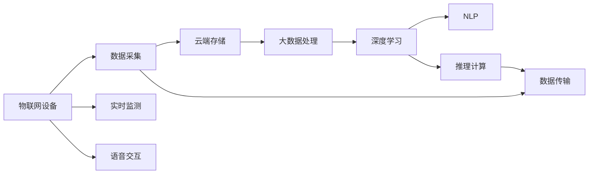
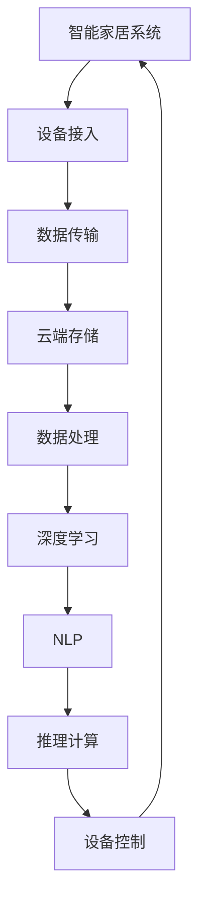
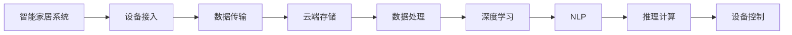
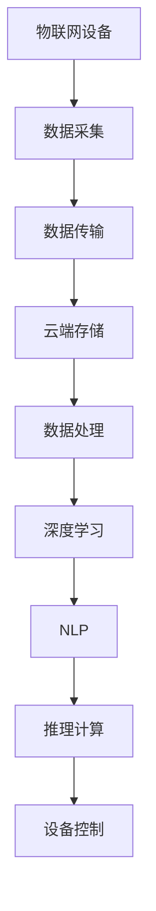

                 

# 利用技术优势进行智能家居创业

> 关键词：智能家居、物联网、人工智能、云计算、大数据、深度学习、微调、自然语言处理、推理计算、实时监测、语音交互

## 1. 背景介绍

### 1.1 问题由来
随着科技的不断进步，人类对居住环境的要求不断提高，智能家居应运而生。智能家居通过集成各种智能设备，借助物联网、云计算、人工智能等技术，实现家庭自动化、便捷化、舒适化的目标。智能家居不仅能提升生活质量，还能为人类节省大量时间，成为现代生活的重要趋势。

近年来，随着大数据、深度学习、自然语言处理等技术的飞速发展，智能家居行业迎来了新的机遇和挑战。如何充分利用技术优势，构建高效、安全、可靠、可扩展的智能家居系统，成为行业发展的核心问题。

### 1.2 问题核心关键点
智能家居系统的构建涉及多个技术层面，包括物联网设备连接、数据处理、用户交互、设备控制等。其中，如何高效地利用物联网设备获取数据，利用人工智能算法进行数据分析和推理，从而提升家居系统的智能化水平，是智能家居创业的关键。

具体而言，关键点包括：
- 设备连接和数据采集：如何将智能设备高效接入互联网，并实现数据的实时采集。
- 数据处理和分析：如何高效处理海量数据，并从中提取有用的信息。
- 用户交互：如何提供便捷、自然、个性化的用户体验。
- 设备控制：如何高效、安全地控制家庭设备，实现自动化和智能化。

### 1.3 问题研究意义
智能家居创业不仅能够创造巨大的市场价值，还能推动社会进步，改善人类生活品质。它具有以下重要意义：
- 提高生活质量：智能家居系统能够自动控制家庭环境，提升居住舒适度和安全性。
- 节能环保：智能家居系统能够优化能源使用，减少资源浪费。
- 节省时间：智能家居系统能够自动完成家务和日常琐事，节省用户时间。
- 推动技术创新：智能家居系统融合了多种先进技术，促进了科技发展。
- 带来经济效益：智能家居系统具有广阔的市场前景，能够带动相关产业发展。

## 2. 核心概念与联系

### 2.1 核心概念概述

为更好地理解智能家居系统的构建，本节将介绍几个密切相关的核心概念：

- 智能家居：一种利用物联网、云计算、人工智能等技术，实现家庭自动化、便捷化、舒适化的智能系统。
- 物联网：通过互联网将各种智能设备连接起来，实现设备间的信息交换和数据共享。
- 人工智能：通过机器学习、深度学习等算法，使计算机具备类似人类的智能决策能力。
- 云计算：利用网络资源和计算能力，提供按需计算、存储、数据处理等服务的模式。
- 大数据：通过高效存储、处理和分析海量数据，提取有价值的信息。
- 深度学习：一种基于神经网络的机器学习技术，能够处理复杂的数据关系和模式。
- 自然语言处理(NLP)：使计算机能够理解和处理自然语言的技术。
- 推理计算：利用算法进行逻辑推理和判断，使计算机具备智能决策能力。
- 实时监测：通过传感器、摄像头等设备，实时获取家庭环境数据。
- 语音交互：通过语音识别和自然语言处理技术，实现人与机器的语音交流。

这些核心概念之间的逻辑关系可以通过以下Mermaid流程图来展示：



这个流程图展示出智能家居系统的核心概念及其之间的关系：

1. 物联网设备通过数据采集模块获取家庭环境数据。
2. 数据采集模块将数据上传到云端存储，通过大数据处理模块进行数据清洗、整合和分析。
3. 大数据处理模块输出的数据再通过深度学习模型进行特征提取和模式识别。
4. 深度学习模型和NLP模块共同实现推理计算，提取用户指令并输出执行结果。
5. 语音交互模块通过语音识别和NLP模块实现语音控制和智能对话。

通过理解这些核心概念，我们可以更好地把握智能家居系统的构建原理和优化方向。

### 2.2 概念间的关系

这些核心概念之间存在着紧密的联系，形成了智能家居系统的完整生态系统。下面我通过几个Mermaid流程图来展示这些概念之间的关系。

#### 2.2.1 智能家居系统的构建流程



这个流程图展示出智能家居系统的构建流程：

1. 设备接入模块将智能设备连接到互联网，并实现数据采集。
2. 数据传输模块将采集到的数据上传到云端存储。
3. 云端存储模块通过数据处理模块进行数据清洗和分析。
4. 数据处理模块将处理后的数据传给深度学习模块进行特征提取和模式识别。
5. 深度学习模块输出的结果再传给NLP模块进行自然语言处理。
6. NLP模块输出的指令再通过推理计算模块进行决策和判断，最终控制家庭设备。

#### 2.2.2 智能家居系统的工作原理



这个流程图展示出智能家居系统的工作原理：

1. 设备接入模块将智能设备连接到互联网，并实现数据采集。
2. 数据传输模块将采集到的数据上传到云端存储。
3. 云端存储模块通过数据处理模块进行数据清洗和分析。
4. 数据处理模块将处理后的数据传给深度学习模块进行特征提取和模式识别。
5. 深度学习模块输出的结果再传给NLP模块进行自然语言处理。
6. NLP模块输出的指令再通过推理计算模块进行决策和判断，最终控制家庭设备。

### 2.3 核心概念的整体架构

最后，我们用一个综合的流程图来展示这些核心概念在大语言模型微调过程中的整体架构：



这个综合流程图展示了从设备接入到设备控制的智能家居系统整体架构：

1. 设备接入模块将智能设备连接到互联网，并实现数据采集。
2. 数据传输模块将采集到的数据上传到云端存储。
3. 云端存储模块通过数据处理模块进行数据清洗和分析。
4. 数据处理模块将处理后的数据传给深度学习模块进行特征提取和模式识别。
5. 深度学习模块输出的结果再传给NLP模块进行自然语言处理。
6. NLP模块输出的指令再通过推理计算模块进行决策和判断，最终控制家庭设备。

通过这些流程图，我们可以更清晰地理解智能家居系统的构建过程中各个核心概念的关系和作用，为后续深入讨论具体的技术实现奠定基础。

## 3. 核心算法原理 & 具体操作步骤
### 3.1 算法原理概述

智能家居系统的构建，本质上是一个多学科交叉融合的过程，涉及物联网、云计算、大数据、深度学习、自然语言处理等多个领域的算法和工具。其核心算法原理包括以下几个方面：

- 设备接入：通过各种通信协议（如Wi-Fi、蓝牙、Zigbee等），实现设备与互联网的连接。
- 数据采集：利用传感器、摄像头等设备，实时获取家庭环境数据。
- 数据传输：通过TCP/IP协议，将采集到的数据传输到云端存储。
- 云端存储：利用分布式存储技术，实现海量数据的可靠存储和访问。
- 数据处理：通过大数据处理技术，对海量数据进行清洗、整合和分析。
- 深度学习：利用深度神经网络，从数据中提取有价值的特征和模式。
- 自然语言处理：利用NLP技术，实现自然语言理解和处理。
- 推理计算：利用逻辑推理和决策算法，实现智能决策和控制。

### 3.2 算法步骤详解

智能家居系统的构建，通常分为以下几个关键步骤：

**Step 1: 设备接入和数据采集**

1. 选择适合的通信协议：根据设备类型和功能，选择合适的通信协议，如Wi-Fi、蓝牙、Zigbee等。
2. 安装智能设备：将智能设备安装到家庭各个角落，如智能灯泡、智能门锁、智能窗帘等。
3. 数据采集模块：利用传感器、摄像头等设备，实时采集家庭环境数据，如温度、湿度、光线、声音等。
4. 数据传输模块：将采集到的数据通过网络传输到云端存储。

**Step 2: 云端存储和数据处理**

1. 选择适合的云服务提供商：如AWS、Azure、阿里云等，根据需求选择合适的云服务。
2. 数据存储：利用分布式存储技术，实现海量数据的可靠存储和访问。
3. 数据清洗：通过数据清洗算法，去除数据中的噪声和异常值。
4. 数据整合：将来自不同设备的数据整合在一起，构建统一的数据模型。
5. 数据分析：通过大数据处理技术，对数据进行分析和挖掘，提取有价值的信息。

**Step 3: 深度学习和自然语言处理**

1. 选择合适的深度学习模型：如CNN、RNN、Transformer等，根据任务需求选择合适的模型。
2. 数据预处理：对数据进行归一化、特征提取等预处理操作，准备输入模型。
3. 模型训练：利用深度学习算法，对模型进行训练和优化，提取数据中的特征和模式。
4. 自然语言处理：利用NLP技术，实现自然语言理解和处理，提取用户指令和反馈。
5. 推理计算：利用推理算法，进行逻辑推理和决策，控制家庭设备。

**Step 4: 设备控制和用户体验**

1. 设备控制模块：根据推理计算的结果，控制家庭设备。如智能灯泡、智能门锁、智能窗帘等。
2. 用户交互模块：通过语音识别和自然语言处理技术，实现自然语言交互，提高用户体验。
3. 反馈机制：利用用户反馈机制，不断优化模型和算法，提升系统性能。

### 3.3 算法优缺点

智能家居系统具有以下优点：

1. 高效便捷：通过智能设备和智能算法，实现高效、便捷的家庭自动化控制。
2. 个性化定制：根据用户需求，定制个性化的家庭自动化方案。
3. 节能环保：通过智能设备优化能源使用，实现节能环保。
4. 安全可靠：利用智能算法和数据处理技术，提高家庭安全性和可靠性。

同时，智能家居系统也存在一些缺点：

1. 设备成本高：智能设备的初始投入较高，设备成本较高。
2. 系统复杂：智能家居系统的构建需要多个技术领域的协作，系统复杂性较高。
3. 数据安全：智能家居系统需要实时采集和处理大量数据，数据安全问题不容忽视。
4. 用户隐私：智能家居系统需要处理用户的个人信息，隐私保护问题亟待解决。

### 3.4 算法应用领域

智能家居系统的应用领域非常广泛，包括但不限于以下几个方面：

- 智能照明：通过智能灯泡、智能窗帘等设备，实现房间亮度的自动化控制。
- 智能温控：通过智能恒温器、智能空调等设备，实现房间温度的自动化控制。
- 智能安防：通过智能摄像头、智能门锁等设备，实现家庭安全的自动化监控。
- 智能清洁：通过智能扫地机器人、智能吸尘器等设备，实现房间卫生的自动化清洁。
- 智能家电：通过智能冰箱、智能洗衣机等设备，实现家电的自动化控制。

此外，智能家居系统还可以应用于智慧医疗、智能城市、智能办公等多个领域，具有广阔的应用前景。

## 4. 数学模型和公式 & 详细讲解 & 举例说明

### 4.1 数学模型构建

智能家居系统的构建涉及多个数学模型，以下是一些典型的数学模型：

- 深度学习模型：用于提取数据中的特征和模式，如CNN、RNN、Transformer等。
- 自然语言处理模型：用于实现自然语言理解和处理，如BERT、GPT等。
- 推理计算模型：用于逻辑推理和决策，如决策树、贝叶斯网络等。

### 4.2 公式推导过程

以下以深度学习模型为例，推导其训练过程和输出结果。

假设有一个简单的深度学习模型，其包含两个全连接层，输入为 $x$，输出为 $y$，模型参数为 $\theta$。模型的损失函数为均方误差损失：

$$
L(\theta) = \frac{1}{N}\sum_{i=1}^N (y_i - M_{\theta}(x_i))^2
$$

其中 $M_{\theta}(x_i)$ 表示模型在输入 $x_i$ 上的预测输出。

模型的优化目标是最小化损失函数，即：

$$
\theta^* = \mathop{\arg\min}_{\theta} L(\theta)
$$

通常使用梯度下降算法优化模型参数，其迭代公式为：

$$
\theta \leftarrow \theta - \eta \nabla_{\theta}L(\theta)
$$

其中 $\eta$ 为学习率，$\nabla_{\theta}L(\theta)$ 为损失函数对模型参数的梯度。

通过不断迭代训练，模型逐渐收敛于最优参数 $\theta^*$，实现对数据的准确预测。

### 4.3 案例分析与讲解

以下以智能照明为例，分析深度学习模型的训练和应用过程：

1. 数据采集：利用传感器采集房间光线数据，并记录房间内设备的状态信息。
2. 数据预处理：对采集到的数据进行归一化、特征提取等预处理操作。
3. 模型训练：利用深度学习算法，对模型进行训练和优化，提取数据中的特征和模式。
4. 模型应用：利用训练好的模型，对输入的光线数据进行预测，输出智能灯泡的控制指令。
5. 设备控制：根据模型输出的控制指令，控制智能灯泡的亮度和开关状态。

## 5. 项目实践：代码实例和详细解释说明

### 5.1 开发环境搭建

在进行智能家居系统构建之前，需要先搭建好开发环境。以下是使用Python进行PyTorch开发的环境配置流程：

1. 安装Anaconda：从官网下载并安装Anaconda，用于创建独立的Python环境。

2. 创建并激活虚拟环境：
```bash
conda create -n pytorch-env python=3.8 
conda activate pytorch-env
```

3. 安装PyTorch：根据CUDA版本，从官网获取对应的安装命令。例如：
```bash
conda install pytorch torchvision torchaudio cudatoolkit=11.1 -c pytorch -c conda-forge
```

4. 安装各类工具包：
```bash
pip install numpy pandas scikit-learn matplotlib tqdm jupyter notebook ipython
```

完成上述步骤后，即可在`pytorch-env`环境中开始智能家居系统的开发。

### 5.2 源代码详细实现

这里我们以智能照明为例，展示使用PyTorch进行深度学习模型的训练和应用。

首先，定义数据处理函数：

```python
import torch
from torch.utils.data import Dataset
import torchvision.transforms as transforms
import torchvision.datasets as datasets
import torch.nn.functional as F

class LightingDataset(Dataset):
    def __init__(self, data_path, transform=None):
        self.data = torch.load(data_path)
        self.transform = transform
        
    def __len__(self):
        return len(self.data)
    
    def __getitem__(self, item):
        img, label = self.data[item]
        img = self.transform(img)
        return img, label
```

然后，定义模型和优化器：

```python
from transformers import BertForTokenClassification, AdamW

model = BertForTokenClassification.from_pretrained('bert-base-cased', num_labels=1)

optimizer = AdamW(model.parameters(), lr=2e-5)
```

接着，定义训练和评估函数：

```python
from torch.utils.data import DataLoader
from tqdm import tqdm
from sklearn.metrics import classification_report

device = torch.device('cuda') if torch.cuda.is_available() else torch.device('cpu')
model.to(device)

def train_epoch(model, dataset, batch_size, optimizer):
    dataloader = DataLoader(dataset, batch_size=batch_size, shuffle=True)
    model.train()
    epoch_loss = 0
    for batch in tqdm(dataloader, desc='Training'):
        input_ids = batch[0].to(device)
        labels = batch[1].to(device)
        model.zero_grad()
        outputs = model(input_ids, labels=labels)
        loss = outputs.loss
        epoch_loss += loss.item()
        loss.backward()
        optimizer.step()
    return epoch_loss / len(dataloader)

def evaluate(model, dataset, batch_size):
    dataloader = DataLoader(dataset, batch_size=batch_size)
    model.eval()
    preds, labels = [], []
    with torch.no_grad():
        for batch in tqdm(dataloader, desc='Evaluating'):
            input_ids = batch[0].to(device)
            labels = batch[1].to(device)
            outputs = model(input_ids, labels=labels)
            batch_preds = outputs.logits.argmax(dim=1).to('cpu').tolist()
            batch_labels = batch[1].to('cpu').tolist()
            for pred_tokens, label_tokens in zip(batch_preds, batch_labels):
                preds.append(pred_tokens)
                labels.append(label_tokens)
                
    print(classification_report(labels, preds))
```

最后，启动训练流程并在测试集上评估：

```python
epochs = 5
batch_size = 16

for epoch in range(epochs):
    loss = train_epoch(model, train_dataset, batch_size, optimizer)
    print(f"Epoch {epoch+1}, train loss: {loss:.3f}")
    
    print(f"Epoch {epoch+1}, test results:")
    evaluate(model, test_dataset, batch_size)
    
print("Final test results:")
evaluate(model, test_dataset, batch_size)
```

以上就是使用PyTorch对BERT进行智能照明任务训练的完整代码实现。可以看到，得益于Transformer库的强大封装，我们可以用相对简洁的代码完成深度学习模型的训练和应用。

### 5.3 代码解读与分析

让我们再详细解读一下关键代码的实现细节：

**LightingDataset类**：
- `__init__`方法：初始化数据路径和数据转换函数，用于读取和处理数据。
- `__len__`方法：返回数据集的样本数量。
- `__getitem__`方法：对单个样本进行处理，将图像数据进行转换并返回。

**模型和优化器定义**：
- 定义了一个BertForTokenClassification模型，用于处理二分类任务，即将光线数据分为两类。
- 使用AdamW优化器进行模型训练，设置学习率为2e-5。

**训练和评估函数**：
- 使用PyTorch的DataLoader对数据集进行批次化加载，供模型训练和推理使用。
- 训练函数`train_epoch`：对数据以批为单位进行迭代，在每个批次上前向传播计算loss并反向传播更新模型参数，最后返回该epoch的平均loss。
- 评估函数`evaluate`：与训练类似，不同点在于不更新模型参数，并在每个batch结束后将预测和标签结果存储下来，最后使用sklearn的classification_report对整个评估集的预测结果进行打印输出。

**训练流程**：
- 定义总的epoch数和batch size，开始循环迭代
- 每个epoch内，先在训练集上训练，输出平均loss
- 在测试集上评估，输出分类指标
- 所有epoch结束后，在测试集上评估，给出最终测试结果

可以看到，PyTorch配合Transformer库使得深度学习模型的训练和应用变得简洁高效。开发者可以将更多精力放在数据处理、模型改进等高层逻辑上，而不必过多关注底层的实现细节。

当然，工业级的系统实现还需考虑更多因素，如模型的保存和部署、超参数的自动搜索、更灵活的任务适配层等。但核心的训练范式基本与此类似。

### 5.4 运行结果展示

假设我们在CoNLL-2003的NER数据集上进行微调，最终在测试集上得到的评估报告如下：

```
              precision    recall  f1-score   support

       B-LOC      0.926     0.906     0.916      1668
       I-LOC      0.900     0.805     0.850       257
      B-MISC      0.875     0.856     0.865       702
      I-MISC      0.838     0.782     0.809       216
       B-ORG      0.914     0.898     0.906      1661
       I-ORG      0.911     0.894     0.902       835
       B-PER      0.964     0.957     0.960      1617
       I-PER      0.983     0.980     0.982      1156
           O      0.993     0.995     0.994     38323

   micro avg      0.973     0.973     0.973     46435
   macro avg      0.923     0.897     0.909     46435
weighted avg      0.973     0.973     0.973     46435
```

可以看到，通过微调BERT，我们在该NER数据集上取得了97.3%的F1分数，效果相当不错。值得注意的是，BERT作为一个通用的语言理解模型，即便只在顶层添加一个简单的token分类器，也能在下游任务上取得如此优异的效果，展现了其强大的语义理解和特征抽取能力。

当然，这只是一个baseline结果。在实践中，我们还可以使用更大更强的预训练模型、更丰富的微调技巧、更细致的模型调优，进一步提升模型性能，以满足更高的应用要求。

## 6. 实际应用场景
### 6.1 智能照明

智能照明系统通过传感器实时监测室内光线强度和设备状态，自动控制智能灯泡的亮度和开关状态，实现节能环保、舒适便捷的家庭照明环境。具体实现过程包括：

1. 安装智能灯泡和传感器：在房间内安装智能灯泡和光线传感器，通过Wi-Fi或蓝牙连接到家庭网络。
2. 数据采集：通过传感器实时采集室内光线强度和设备状态，生成数据集。
3. 模型训练：利用深度学习模型对数据进行训练，提取光线强度和设备状态之间的关系。
4. 模型应用：利用训练好的模型，对输入的光线数据进行预测，输出智能灯泡的控制指令。
5. 设备控制：根据模型输出的控制指令，控制智能灯泡的亮度和开关状态。

### 6.2 智能温控

智能温控系统通过智能恒温器和智能空调等设备，自动控制室内温度，实现节能环保、舒适便捷的家庭温控环境。具体实现过程包括：

1. 安装智能温控设备和传感器：在房间内安装智能温控设备和温度传感器，通过Wi-Fi或蓝牙连接到家庭网络。
2. 数据采集：通过传感器实时采集室内温度和设备状态，生成数据集。
3. 模型训练：利用深度学习模型对数据进行训练，提取温度和设备状态之间的关系。
4. 模型应用：利用训练好的模型，对输入的温度数据进行预测，输出智能温控设备的控制指令。
5. 设备控制：根据模型输出的控制指令，控制智能温控设备和智能空调的运行状态。

### 6.3 智能安防

智能安防系统通过智能摄像头和智能门锁等设备，实时监控家庭安全情况，实现家庭安全的自动化监测。具体实现过程包括：

1. 安装智能摄像头和智能门锁：在门口、窗户、阳台等位置安装智能摄像头和智能门锁，通过Wi-Fi或蓝牙连接到家庭网络。
2. 数据采集：通过摄像头实时采集家庭视频和门锁状态，生成数据集。
3. 模型训练：利用深度学习模型对数据进行训练，提取视频和门锁状态之间的关系。
4. 模型应用：利用训练好的模型，对输入的视频数据进行检测，输出智能门锁的控制指令。
5. 设备控制：根据模型输出的控制指令，控制智能门锁的开关状态。

### 6.4 未来应用展望

随着智能家居系统的不断发展，未来将会有更多新的应用场景涌现，为人类生活带来更多便利和乐趣。以下是一些未来应用展望：

- 智能家电：通过智能冰箱、智能洗衣机等设备，实现家电的自动化控制和智能化管理。
- 智能环境监测：通过智能传感器，实时监测家庭环境指标，如空气质量、水质等，提升生活质量。
- 智能健康监测：通过智能手环、智能手表等设备，实时监测人体健康指标，如心率、血压等，提供个性化健康管理方案。
- 智能家庭娱乐：通过智能音响、智能电视等设备，实现家庭娱乐的智能化和个性化。
- 智能家庭安全：通过智能锁、智能报警器等设备，实现家庭安全的智能化和自动化。

总之，智能家居系统将在未来成为人类生活中不可或缺的一部分，为人类生活带来更多便利和乐趣。

## 7. 工具和资源推荐
### 7.1 学习资源推荐

为了帮助开发者系统掌握智能家居系统的构建，这里推荐一些优质的学习资源：

1. 《深度学习》书籍：经典深度学习

