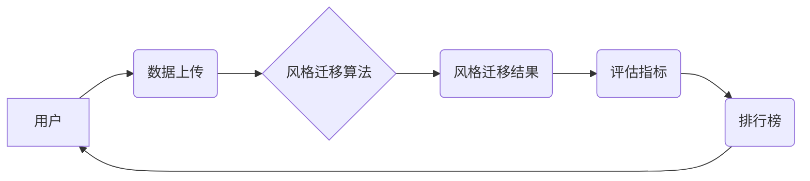

## 基于生成对抗网络的图像风格迁移竞赛平台建设

> 关键词：生成对抗网络（GAN）、图像风格迁移、竞赛平台、深度学习、图像处理

## 1. 背景介绍

图像风格迁移技术近年来备受关注，它能够将一种图像的风格应用到另一幅图像上，创造出具有独特艺术效果的图像。这种技术在艺术创作、图像编辑、电影特效等领域有着广泛的应用前景。

传统的图像风格迁移方法通常依赖于手工设计的特征提取和风格转换算法，效率较低，效果也难以达到理想状态。随着深度学习技术的快速发展，基于生成对抗网络（GAN）的图像风格迁移方法 emerged，取得了显著的成果。GANs 由两个神经网络组成：生成器和鉴别器。生成器负责生成新的图像，而鉴别器负责判断图像是否为真实图像或生成图像。通过对抗训练，生成器逐渐学习生成逼真的图像，而鉴别器也逐渐学习识别生成图像。

基于GANs的图像风格迁移方法能够自动学习图像的风格特征，并将其应用到目标图像上，从而实现更逼真的风格迁移效果。

然而，现有的图像风格迁移平台大多局限于单一算法或功能，缺乏交互性、可定制性和社区支持。为了促进图像风格迁移技术的进一步发展和应用，我们计划建设一个基于GANs的图像风格迁移竞赛平台，平台将提供多种先进的风格迁移算法、丰富的风格素材库以及完善的竞赛机制，吸引广大开发者和研究者参与，共同推动图像风格迁移技术的创新和发展。

## 2. 核心概念与联系

### 2.1 生成对抗网络（GAN）

GANs 是由 Ian Goodfellow 等人在 2014 年提出的生成模型，它由两个神经网络组成：

* **生成器 (Generator):** 负责生成新的数据样本，例如图像。
* **鉴别器 (Discriminator):** 负责判断数据样本是真实数据还是由生成器生成的伪造数据。

GANs 通过对抗训练的方式进行学习。生成器试图生成逼真的数据样本，而鉴别器试图区分真实数据和伪造数据。两者在不断对抗中相互提升，最终生成器能够生成与真实数据几乎 indistinguishable 的样本。

### 2.2 图像风格迁移

图像风格迁移是指将一幅图像的风格应用到另一幅图像上，生成具有目标风格的新图像。

**核心概念：**

* **内容图像:** 需要迁移风格的图像。
* **风格图像:** 提供风格信息的图像。
* **风格特征:** 图像中包含的风格信息，例如颜色、纹理、构图等。
* **内容特征:** 图像中包含的内容信息，例如物体、场景等。

**目标:**

将风格图像的风格特征迁移到内容图像上，生成具有目标风格的新图像，同时保留内容图像的内容信息。

### 2.3 竞赛平台

竞赛平台是一个提供竞赛规则、数据、评估指标和排行榜等功能的在线平台。

**核心功能:**

* **竞赛规则:** 明确竞赛目标、参赛条件、提交方式等规则。
* **数据提供:** 提供竞赛所需的训练数据、测试数据等。
* **评估指标:** 定义用于评估参赛作品的指标，例如风格迁移效果、内容保真度等。
* **排行榜:** 展示参赛作品的排名情况，激励参赛者积极参与。
* **社区互动:** 提供论坛、聊天室等功能，方便参赛者交流学习。

### 2.4 架构图



## 3. 核心算法原理 & 具体操作步骤

### 3.1 算法原理概述

基于GANs的图像风格迁移算法通常采用以下原理：

* **内容损失函数:** 确保生成的图像保留内容图像的内容信息。
* **风格损失函数:** 确保生成的图像与风格图像的风格特征一致。
* **对抗损失函数:** 训练生成器生成逼真的图像，并训练鉴别器区分真实图像和生成图像。

通过最小化这三个损失函数，生成器能够学习将风格图像的风格迁移到内容图像上，生成具有目标风格的新图像。

### 3.2 算法步骤详解

1. **数据预处理:** 将输入图像和风格图像预处理，例如调整尺寸、归一化像素值等。
2. **特征提取:** 使用卷积神经网络提取图像的内容特征和风格特征。
3. **损失函数计算:** 计算内容损失、风格损失和对抗损失。
4. **模型训练:** 使用梯度下降算法训练生成器和鉴别器，最小化损失函数。
5. **风格迁移:** 将训练好的生成器用于将风格图像的风格迁移到内容图像上，生成目标风格图像。

### 3.3 算法优缺点

**优点:**

* **效果逼真:** 基于GANs的图像风格迁移算法能够生成与真实图像几乎 indistinguishable 的风格迁移图像。
* **自动学习:** 算法能够自动学习图像的风格特征，无需人工设计特征提取方法。
* **可定制性强:** 可以通过调整算法参数和损失函数来控制风格迁移效果。

**缺点:**

* **训练复杂:** GANs 的训练过程比较复杂，容易出现训练不稳定等问题。
* **计算资源需求高:** 训练 GANs 需要大量的计算资源。
* **生成图像质量不稳定:** 即使训练成功，生成的图像质量也可能存在不稳定性。

### 3.4 算法应用领域

* **艺术创作:** 将艺术风格应用到照片上，创造出具有独特艺术效果的图像。
* **图像编辑:** 修改图像的风格，例如将照片转换为油画风格。
* **电影特效:** 在电影中实现风格迁移效果，例如将场景转换为不同的时代风格。
* **游戏开发:** 为游戏角色和场景添加不同的风格效果。

## 4. 数学模型和公式 & 详细讲解 & 举例说明

### 4.1 数学模型构建

**生成器 (G):**

* 输入：随机噪声向量 z
* 输出：风格迁移后的图像 x'

**鉴别器 (D):**

* 输入：图像 x (真实图像或生成图像)
* 输出：判断图像是否为真实图像的概率 p(x)

**损失函数:**

* **内容损失函数 (L_content):** 衡量生成图像 x' 和内容图像 x 的内容特征之间的差异。
* **风格损失函数 (L_style):** 衡量生成图像 x' 和风格图像 y 的风格特征之间的差异。
* **对抗损失函数 (L_adversarial):** 衡量鉴别器 D 对生成图像 x' 的判断能力。

### 4.2 公式推导过程

**内容损失函数:**

$$L_{content}(x', x) = ||F(x') - F(x)||^2$$

其中，F 是卷积神经网络，用于提取图像的内容特征。

**风格损失函数:**

$$L_{style}(x', y) = \sum_{i} ||G_i(x') - G_i(y)||^2$$

其中，Gi 是卷积神经网络，用于提取图像的风格特征。

**对抗损失函数:**

$$L_{adversarial}(G, D) = E_{x \sim p_{data}(x)}[log(D(x))] + E_{z \sim p_z(z)}[log(1 - D(G(z)))]$$

其中，p_data(x) 是真实图像的分布，p_z(z) 是随机噪声向量的分布。

### 4.3 案例分析与讲解

**举例说明:**

假设我们想要将梵高的风格迁移到一张风景照片上。

1. 选择一张梵高的油画作为风格图像，一张风景照片作为内容图像。
2. 使用卷积神经网络提取风格图像和内容图像的内容特征和风格特征。
3. 使用上述损失函数构建 GANs 模型，并训练模型。
4. 将训练好的生成器用于将梵高的风格迁移到风景照片上，生成具有梵高风格的风景图像。

## 5. 项目实践：代码实例和详细解释说明

### 5.1 开发环境搭建

* **操作系统:** Ubuntu 18.04 或更高版本
* **编程语言:** Python 3.6 或更高版本
* **深度学习框架:** TensorFlow 或 PyTorch
* **其他依赖:** numpy, matplotlib, scikit-learn 等

### 5.2 源代码详细实现

```python
# 生成器模型
class Generator(nn.Module):
    def __init__(self):
        super(Generator, self).__init__()
        # 定义生成器网络结构
        #...

    def forward(self, z):
        # 生成图像
        #...

# 鉴别器模型
class Discriminator(nn.Module):
    def __init__(self):
        super(Discriminator, self).__init__()
        # 定义鉴别器网络结构
        #...

    def forward(self, x):
        # 判断图像是否为真实图像
        #...

# 训练模型
def train(generator, discriminator, content_image, style_image, optimizer_G, optimizer_D, epochs):
    for epoch in range(epochs):
        #...
        # 训练生成器和鉴别器
        #...

# 风格迁移
def style_transfer(generator, content_image, style_image):
    # 使用生成器将风格迁移到内容图像上
    #...
```

### 5.3 代码解读与分析

* **生成器模型:** 负责生成风格迁移后的图像。
* **鉴别器模型:** 负责判断图像是否为真实图像或生成图像。
* **训练模型:** 使用梯度下降算法训练生成器和鉴别器，最小化损失函数。
* **风格迁移:** 使用训练好的生成器将风格迁移到内容图像上。

### 5.4 运行结果展示

* 展示风格迁移后的图像，并与原始图像和风格图像进行对比。
* 使用客观指标评估风格迁移效果，例如感知质量评价指标 (PSNR) 和结构相似度 (SSIM)。

## 6. 实际应用场景

### 6.1 艺术创作

* 艺术家可以使用风格迁移技术将自己的艺术风格应用到照片上，创造出具有独特艺术效果的图像。
* 艺术家可以将经典艺术作品的风格迁移到现代照片上，创作出具有历史文化意义的艺术作品。

### 6.2 图像编辑

* 用户可以使用风格迁移技术修改图像的风格，例如将照片转换为油画风格、水彩风格或素描风格。
* 用户可以将不同的风格混合在一起，创造出具有独特风格的图像。

### 6.3 电影特效

* 电影制作人员可以使用风格迁移技术在电影中实现风格迁移效果，例如将场景转换为不同的时代风格或艺术风格。
* 风格迁移技术可以用于创建虚拟角色和场景，并赋予它们独特的风格。

### 6.4 未来应用展望

* **个性化图像风格:** 用户可以根据自己的喜好定制图像风格，创造出独一无二的图像。
* **跨媒体风格迁移:** 将风格迁移技术应用到音频、视频等其他媒体类型。
* **风格迁移辅助设计:** 使用风格迁移技术辅助设计师进行创意设计，例如服装设计、建筑设计等。

## 7. 工具和资源推荐

### 7.1 学习资源推荐

* **书籍:**
    * Deep Learning by Ian Goodfellow, Yoshua Bengio, and Aaron Courville
    * Generative Adversarial Networks by David Foster
* **在线课程:**
    * Coursera: Deep Learning Specialization
    * Udacity: Deep Learning Nanodegree
* **博客和论坛:**
    * Distill.pub
    * Towards Data Science
    * Reddit: r/MachineLearning

### 7.2 开发工具推荐

* **深度学习框架:** TensorFlow, PyTorch
* **图像处理库:** OpenCV, Pillow
* **可视化工具:** Matplotlib, Seaborn

### 7.3 相关论文推荐

* **Generative Adversarial Networks** by Ian Goodfellow et al. (201