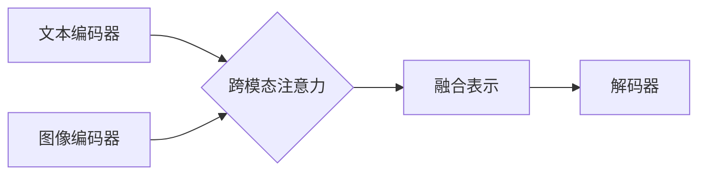

## 多模态大模型：技术原理与实战 应用背景和待解决的问题

> 关键词：多模态大模型、自然语言处理、计算机视觉、音频处理、跨模态学习、Transformer、BERT、GPT、DALL-E

### 1. 背景介绍

近年来，人工智能领域取得了令人瞩目的进展，其中大模型技术扮演着至关重要的角色。大模型，通常指参数规模庞大的深度学习模型，在自然语言处理、计算机视觉等领域展现出强大的能力。然而，现实世界的信息往往是多模态的，例如文本、图像、音频、视频等多种形式的混合。单模态模型难以捕捉这些不同模态之间的复杂关系，限制了其在理解和生成真实世界信息方面的能力。

多模态大模型 (Multimodal Large Models, MMLMs)应运而生，旨在学习和理解多种模态数据之间的关联性。MMLMs 能够将不同模态的信息融合在一起，从而获得更全面、更深入的理解，并能够在跨模态任务中表现出更优异的性能。

### 2. 核心概念与联系

多模态大模型的核心概念是跨模态学习 (Cross-Modal Learning)。它旨在学习不同模态之间的语义映射关系，从而实现跨模态理解和生成。

**2.1  跨模态学习的挑战:**

* **模态间语义鸿沟:** 不同模态的数据表示方式和语义特征存在差异，难以直接融合。
* **数据稀缺性:** 多模态数据往往比单模态数据稀缺，难以训练出高质量的模型。
* **计算资源需求:** MMLMs 通常具有庞大的参数规模，训练和推理需要大量的计算资源。

**2.2  MMLMs 的架构:**

MMLMs 通常采用以下几种架构：

* **共享表示:** 使用相同的编码器对不同模态数据进行编码，学习共享的语义表示。
* **跨模态注意力:** 使用注意力机制学习不同模态之间的关系，赋予不同模态不同的权重。
* **多任务学习:** 将多个跨模态任务联合训练，例如图像字幕生成、文本问答、视频理解等。

**Mermaid 流程图:**



### 3. 核心算法原理 & 具体操作步骤

**3.1  算法原理概述:**

MMLMs 的核心算法通常基于深度学习，特别是 Transformer 架构。Transformer 是一种强大的序列建模网络，能够有效地捕捉长距离依赖关系。

**3.2  算法步骤详解:**

1. **数据预处理:** 将文本、图像、音频等多模态数据进行预处理，例如文本分词、图像裁剪、音频降噪等。
2. **模态编码:** 使用不同的编码器对每个模态数据进行编码，例如 BERT 对文本编码，ResNet 对图像编码。
3. **跨模态融合:** 使用注意力机制或其他融合策略将不同模态的编码结果融合在一起，形成一个跨模态表示。
4. **解码:** 使用解码器生成最终的输出，例如文本、图像、音频等。

**3.3  算法优缺点:**

* **优点:**

    * 能够学习不同模态之间的语义关系，提升跨模态理解能力。
    * 在多个跨模态任务中表现出优异的性能。
    * 可以利用预训练模型进行微调，降低训练成本。

* **缺点:**

    * 数据稀缺性仍然是一个挑战，需要更多高质量的多模态数据进行训练。
    * 计算资源需求高，训练和推理需要大量的计算能力。
    * 模型解释性较差，难以理解模型是如何进行跨模态学习的。

**3.4  算法应用领域:**

* **图像字幕生成:** 将图像转换为文本描述。
* **文本问答:** 根据文本内容回答问题。
* **视频理解:** 理解视频内容，例如动作识别、事件检测。
* **多模态检索:** 根据文本或图像查询相关的多模态数据。
* **机器人交互:** 帮助机器人理解和响应人类的多模态指令。

### 4. 数学模型和公式 & 详细讲解 & 举例说明

**4.1  数学模型构建:**

MMLMs 通常使用以下数学模型进行建模:

* **嵌入层:** 将不同模态的数据映射到低维向量空间。
* **编码器:** 使用 Transformer 或其他深度学习架构对数据进行编码，学习数据之间的语义关系。
* **注意力机制:** 学习不同模态之间的关系，赋予不同模态不同的权重。
* **解码器:** 根据编码后的结果生成最终的输出。

**4.2  公式推导过程:**

* **嵌入层:**

$$
\mathbf{e}_i = \mathbf{W}_e \mathbf{x}_i
$$

其中，$\mathbf{e}_i$ 是第 $i$ 个数据点的嵌入向量，$\mathbf{x}_i$ 是原始数据，$\mathbf{W}_e$ 是嵌入矩阵。

* **Transformer 编码器:**

Transformer 编码器使用多头注意力机制和前馈神经网络进行编码。

$$
\mathbf{h}_i = \text{MultiHeadAttention}(\mathbf{h}_{i-1}, \mathbf{h}_{i-1}, \mathbf{h}_{i-1}) + \mathbf{h}_{i-1}
$$

$$
\mathbf{h}_i = \text{FFN}(\mathbf{h}_i)
$$

其中，$\mathbf{h}_i$ 是第 $i$ 层编码器的输出，$\text{MultiHeadAttention}$ 是多头注意力机制，$\text{FFN}$ 是前馈神经网络。

**4.3  案例分析与讲解:**

DALL-E 是一种著名的多模态大模型，能够根据文本描述生成图像。DALL-E 使用 Transformer 架构，并结合了 CLIP 模型进行跨模态学习。CLIP 模型能够学习文本和图像之间的语义关系，帮助 DALL-E 更准确地理解文本描述并生成相应的图像。

### 5. 项目实践：代码实例和详细解释说明

**5.1  开发环境搭建:**

* Python 3.7+
* PyTorch 或 TensorFlow
* CUDA 和 cuDNN

**5.2  源代码详细实现:**

由于篇幅限制，这里只提供一个简单的多模态文本-图像匹配模型的代码示例，完整的代码可以参考开源项目或论文实现。

```python
import torch
import torch.nn as nn

class MultiModalMatcher(nn.Module):
    def __init__(self, text_encoder, image_encoder):
        super(MultiModalMatcher, self).__init__()
        self.text_encoder = text_encoder
        self.image_encoder = image_encoder
        self.similarity = nn.CosineSimilarity(dim=1)

    def forward(self, text, image):
        text_embedding = self.text_encoder(text)
        image_embedding = self.image_encoder(image)
        similarity_score = self.similarity(text_embedding, image_embedding)
        return similarity_score

# 实例化模型
text_encoder = BERT()
image_encoder = ResNet()
matcher = MultiModalMatcher(text_encoder, image_encoder)

# 输入数据
text = "A cat sitting on a mat."
image = load_image("cat_on_mat.jpg")

# 计算相似度
similarity = matcher(text, image)
print(similarity)
```

**5.3  代码解读与分析:**

* 该代码定义了一个简单的多模态文本-图像匹配模型。
* 模型使用预训练的文本编码器 (BERT) 和图像编码器 (ResNet) 对文本和图像进行编码。
* 使用余弦相似度计算文本和图像的嵌入向量之间的相似度。

**5.4  运行结果展示:**

运行结果将输出文本和图像之间的相似度分数，分数越高表示文本和图像越匹配。

### 6. 实际应用场景

**6.1  图像字幕生成:**

MMLMs 可以用于自动生成图像的文本描述，例如用于辅助视障人士理解图像内容，或用于自动生成产品描述。

**6.2  文本问答:**

MMLMs 可以理解图像和文本中的信息，并根据问题回答相关问题，例如在博物馆展览中帮助游客了解展品信息。

**6.3  视频理解:**

MMLMs 可以理解视频内容，例如识别视频中的动作、事件和人物，并用于视频搜索、视频摘要等应用。

**6.4  未来应用展望:**

MMLMs 在未来将有更广泛的应用场景，例如：

* **增强现实 (AR) 和虚拟现实 (VR):** 为 AR 和 VR 应用提供更丰富的交互体验。
* **智能家居:** 理解用户的多模态指令，控制智能家居设备。
* **医疗保健:** 辅助医生诊断疾病，分析医学影像。

### 7. 工具和资源推荐

**7.1  学习资源推荐:**

* **书籍:**

    * "Deep Learning" by Ian Goodfellow, Yoshua Bengio, and Aaron Courville
    * "Speech and Language Processing" by Daniel Jurafsky and James H. Martin

* **课程:**

    * Stanford CS224N: Natural Language Processing with Deep Learning
    * MIT 6.S191: Introduction to Deep Learning

**7.2  开发工具推荐:**

* **PyTorch:** https://pytorch.org/
* **TensorFlow:** https://www.tensorflow.org/
* **Hugging Face Transformers:** https://huggingface.co/transformers/

**7.3  相关论文推荐:**

* "BERT: Pre-training of Deep Bidirectional Transformers for Language Understanding"
* "DALL-E: Creating Images from Text"
* "CLIP: Contrastive Language-Image Pre-training"

### 8. 总结：未来发展趋势与挑战

**8.1  研究成果总结:**

近年来，MMLMs 取得了显著进展，在多个跨模态任务中取得了优异的性能。

**8.2  未来发展趋势:**

* **模型规模和能力提升:** 随着计算资源的不断发展，MMLMs 的规模和能力将进一步提升。
* **跨模态学习方法创新:** 将探索新的跨模态学习方法，例如更有效的注意力机制、多模态生成模型等。
* **应用场景拓展:** MMLMs 将应用于更多领域，例如医疗保健、教育、娱乐等。

**8.3  面临的挑战:**

* **数据稀缺性:** 多模态数据仍然稀缺，需要更多高质量的数据进行训练。
* **计算资源需求:** 训练和推理 MMLMs 需要大量的计算资源，成本较高。
* **模型解释性:** MMLMs 的决策过程难以解释，需要进一步研究模型的可解释性。

**8.4  研究展望:**

未来研究将重点关注以下几个方面:

* **开发新的跨模态学习方法，提高模型的效率和性能。**
* **探索新的应用场景，将 MMLMs 应用于更多领域。**
* **研究 MMLMs 的可解释性，使其更易于理解和信任。**

### 9. 附录：常见问题与解答

* **Q: MMLMs 和单模态模型有什么区别？**

* **A:** MMLMs 可以学习和理解多种模态数据之间的关系，而单模态模型只能处理单一类型的模态数据。

* **Q: 如何训练 MMLMs？**

* **A:** MMLMs 的训练通常使用大量的多模态数据，并采用监督学习或自监督学习方法。

* **Q: MMLMs 的应用场景有哪些？**

* **A:** MMLMs 的应用场景非常广泛，例如图像字幕生成、文本问答、视频理解、多模态检索等。


作者：禅与计算机程序设计艺术 / Zen and the Art of Computer Programming