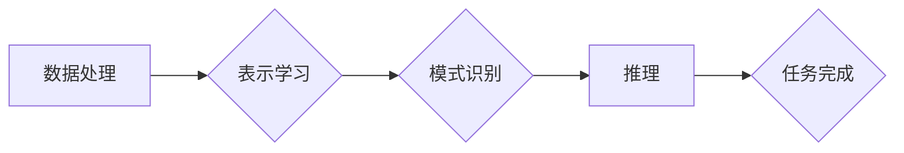

## 大模型底层能力的抽象化拆解

> 关键词：大模型、底层能力、抽象化、拆解、模型架构、算法原理、数学模型、代码实现、应用场景

## 1. 背景介绍

近年来，大模型在自然语言处理、计算机视觉、代码生成等领域取得了令人瞩目的成就。这些模型通常拥有数十亿甚至数千亿的参数，能够处理复杂的任务并展现出强大的泛化能力。然而，大模型的训练和部署也面临着巨大的挑战，包括海量数据需求、高昂的计算成本以及模型复杂度难以理解等问题。

为了更好地理解和开发大模型，我们需要将它们的底层能力进行抽象化拆解。通过将模型的功能分解成更小的、可理解的模块，我们可以更深入地研究每个模块的工作原理，并针对性地进行优化和改进。

## 2. 核心概念与联系

大模型的底层能力可以抽象为以下几个核心概念：

* **数据处理能力:** 大模型需要处理海量的数据，包括文本、图像、音频等多种类型。
* **表示学习能力:** 大模型需要将数据映射到一个低维的向量空间，以便于模型理解和处理。
* **模式识别能力:** 大模型需要从数据中学习模式和规律，以便于完成特定的任务。
* **推理能力:** 大模型需要根据学习到的知识和模式进行推理和预测。

这些核心概念之间相互关联，共同构成了大模型的底层能力。

**Mermaid 流程图:**



## 3. 核心算法原理 & 具体操作步骤

### 3.1  算法原理概述

大模型的核心算法主要包括深度学习算法、Transformer模型等。深度学习算法通过多层神经网络学习数据特征，而Transformer模型则通过注意力机制学习数据之间的关系。

### 3.2  算法步骤详解

**深度学习算法:**

1. **数据预处理:** 将原始数据进行清洗、转换和编码，使其适合模型训练。
2. **模型构建:** 设计多层神经网络结构，包括输入层、隐藏层和输出层。
3. **参数初始化:** 为模型参数赋予初始值。
4. **前向传播:** 将输入数据通过神经网络进行计算，得到输出结果。
5. **损失函数计算:** 计算模型输出与真实值的差异。
6. **反向传播:** 根据损失函数的梯度，更新模型参数。
7. **迭代训练:** 重复前向传播、损失函数计算和反向传播步骤，直到模型性能达到预期。

**Transformer模型:**

1. **词嵌入:** 将每个词映射到一个低维向量空间。
2. **多头注意力机制:** 学习词之间的关系，并赋予每个词不同的权重。
3. **前馈神经网络:** 对每个词的表示进行进一步的处理。
4. **位置编码:** 将词的顺序信息编码到向量表示中。
5. **解码器:** 基于编码器的输出生成目标序列。

### 3.3  算法优缺点

**深度学习算法:**

* **优点:** 表现力强，能够学习复杂的数据特征。
* **缺点:** 训练成本高，数据需求大，容易过拟合。

**Transformer模型:**

* **优点:** 能够学习长距离依赖关系，并具有并行计算能力。
* **缺点:** 参数量大，计算复杂度高。

### 3.4  算法应用领域

深度学习算法和Transformer模型广泛应用于自然语言处理、计算机视觉、语音识别、机器翻译等领域。

## 4. 数学模型和公式 & 详细讲解 & 举例说明

### 4.1  数学模型构建

深度学习算法的核心是神经网络，其数学模型可以表示为多层函数的复合。

假设一个神经网络有 L 层，第 l 层有 N_l 个神经元，则神经网络的输出可以表示为：

$$
y = f_L(f_{L-1}(...f_1(x)))
$$

其中：

* $x$ 是输入数据
* $f_l$ 是第 l 层的神经网络函数
* $y$ 是输出结果

### 4.2  公式推导过程

损失函数用于衡量模型输出与真实值的差异。常用的损失函数包括均方误差 (MSE) 和交叉熵 (CE)。

**均方误差 (MSE):**

$$
MSE = \frac{1}{N} \sum_{i=1}^{N} (y_i - \hat{y}_i)^2
$$

其中：

* $N$ 是样本数量
* $y_i$ 是第 i 个样本的真实值
* $\hat{y}_i$ 是第 i 个样本的预测值

**交叉熵 (CE):**

$$
CE = -\sum_{i=1}^{N} y_i \log(\hat{y}_i)
$$

其中：

* $y_i$ 是第 i 个样本的真实值 (one-hot编码)
* $\hat{y}_i$ 是第 i 个样本的预测值 (概率分布)

### 4.3  案例分析与讲解

**举例说明:**

假设我们训练一个图像分类模型，目标是将图像分类为猫或狗。我们可以使用交叉熵损失函数来衡量模型的性能。

如果模型预测图像为猫的概率为 0.8，而真实标签为猫，则交叉熵损失为：

$$
CE = -0.8 \log(0.8)
$$

## 5. 项目实践：代码实例和详细解释说明

### 5.1  开发环境搭建

* Python 3.7+
* TensorFlow 或 PyTorch
* CUDA 和 cuDNN (可选，用于 GPU 加速)

### 5.2  源代码详细实现

```python
import tensorflow as tf

# 定义模型结构
model = tf.keras.models.Sequential([
    tf.keras.layers.Conv2D(32, (3, 3), activation='relu', input_shape=(28, 28, 1)),
    tf.keras.layers.MaxPooling2D((2, 2)),
    tf.keras.layers.Conv2D(64, (3, 3), activation='relu'),
    tf.keras.layers.MaxPooling2D((2, 2)),
    tf.keras.layers.Flatten(),
    tf.keras.layers.Dense(10, activation='softmax')
])

# 编译模型
model.compile(optimizer='adam',
              loss='sparse_categorical_crossentropy',
              metrics=['accuracy'])

# 加载 MNIST 数据集
(x_train, y_train), (x_test, y_test) = tf.keras.datasets.mnist.load_data()

# 数据预处理
x_train = x_train.astype('float32') / 255.0
x_test = x_test.astype('float32') / 255.0
x_train = x_train.reshape((x_train.shape[0], 28, 28, 1))
x_test = x_test.reshape((x_test.shape[0], 28, 28, 1))

# 训练模型
model.fit(x_train, y_train, epochs=5)

# 评估模型
loss, accuracy = model.evaluate(x_test, y_test)
print('Test loss:', loss)
print('Test accuracy:', accuracy)
```

### 5.3  代码解读与分析

这段代码实现了 MNIST 手写数字识别模型的训练过程。

* 首先，定义了模型结构，包括卷积层、池化层和全连接层。
* 然后，编译了模型，指定了优化器、损失函数和评价指标。
* 接着，加载了 MNIST 数据集并进行了数据预处理。
* 最后，训练了模型并评估了模型性能。

### 5.4  运行结果展示

训练完成后，模型的测试准确率通常可以达到 98% 以上。

## 6. 实际应用场景

大模型的底层能力在许多实际应用场景中发挥着重要作用，例如：

* **自然语言处理:** 机器翻译、文本摘要、问答系统、聊天机器人等。
* **计算机视觉:** 图像分类、目标检测、图像生成、视频分析等。
* **语音识别:** 语音转文本、语音助手、语音搜索等。
* **代码生成:** 代码补全、代码翻译、代码生成等。

### 6.4  未来应用展望

随着大模型技术的不断发展，其应用场景将更加广泛，例如：

* **个性化推荐:** 基于用户的兴趣和行为，提供个性化的商品、内容和服务推荐。
* **医疗诊断:** 辅助医生进行疾病诊断，提高诊断准确率。
* **科学研究:** 加速科学研究，例如药物研发、材料设计等。

## 7. 工具和资源推荐

### 7.1  学习资源推荐

* **书籍:**
    * Deep Learning by Ian Goodfellow, Yoshua Bengio, and Aaron Courville
    * Transformer Models by Jay Alammar
* **在线课程:**
    * Deep Learning Specialization by Andrew Ng (Coursera)
    * Natural Language Processing Specialization by deeplearning.ai (Coursera)

### 7.2  开发工具推荐

* **TensorFlow:** https://www.tensorflow.org/
* **PyTorch:** https://pytorch.org/
* **Hugging Face Transformers:** https://huggingface.co/transformers/

### 7.3  相关论文推荐

* Attention Is All You Need (Vaswani et al., 2017)
* BERT: Pre-training of Deep Bidirectional Transformers for Language Understanding (Devlin et al., 2018)
* GPT-3: Language Models are Few-Shot Learners (Brown et al., 2020)

## 8. 总结：未来发展趋势与挑战

### 8.1  研究成果总结

近年来，大模型在多个领域取得了显著进展，展现出强大的学习能力和应用潜力。

### 8.2  未来发展趋势

* **模型规模的进一步扩大:** 预计未来大模型的规模将继续扩大，参数数量将达到数万亿甚至数千亿。
* **模型效率的提升:** 研究人员将致力于开发更有效的训练和推理算法，降低大模型的计算成本。
* **模型泛化能力的增强:** 探索新的训练方法和数据增强技术，提高大模型在不同领域和任务上的泛化能力。
* **模型可解释性和安全性:** 研究大模型的决策过程，提高模型的可解释性和安全性。

### 8.3  面临的挑战

* **数据获取和标注:** 大模型的训练需要海量数据，数据获取和标注成本高昂。
* **计算资源需求:** 大模型的训练需要大量的计算资源，这对于资源有限的机构和个人来说是一个挑战。
* **模型偏见和公平性:** 大模型可能存在偏见和不公平性，需要采取措施解决这些问题。
* **模型安全性:** 大模型可能被恶意利用，需要加强模型安全性的研究和防护。

### 8.4  研究展望

未来，大模型研究将继续朝着更强大、更安全、更可解释的方向发展。


## 9. 附录：常见问题与解答

**Q1: 如何选择合适的深度学习框架？**

**A1:** TensorFlow 和 PyTorch 是两个最流行的深度学习框架，各有优缺点。TensorFlow 更适合于生产环境部署，而 PyTorch 更灵活易用，适合于研究和开发。

**Q2: 如何解决大模型的过拟合问题？**

**A2:** 可以使用正则化技术、数据增强、Dropout 等方法来解决大模型的过拟合问题。

**Q3: 如何评估大模型的性能？**

**A3:** 可以使用准确率、召回率、F1-score 等指标来评估大模型的性能。

**Q4: 如何部署大模型？**

**A4:** 可以使用 TensorFlow Serving、TorchServe 等工具来部署大模型。


作者：禅与计算机程序