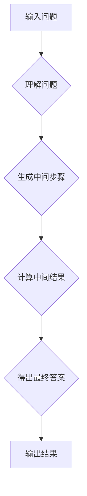

## 大语言模型应用指南：Chain-of-Thought

> 关键词：大语言模型、Chain-of-Thought、推理、逻辑、应用指南、自然语言处理

### 1. 背景介绍

近年来，大语言模型（Large Language Models，LLMs）在自然语言处理（Natural Language Processing，NLP）领域取得了令人瞩目的成就。从文本生成、翻译到问答和代码编写，LLMs展现出强大的能力，深刻地改变了我们与计算机交互的方式。然而，LLMs在推理和逻辑思考方面仍然存在局限性。传统的训练方法主要依赖于预测下一个词，难以捕捉复杂的逻辑关系和推理过程。

Chain-of-Thought（CoT）是一种新兴的技术，旨在提升LLMs的推理能力。它通过引导模型逐步思考，将复杂的推理问题分解成一系列简单的步骤，从而帮助模型更好地理解问题并给出更准确的答案。CoT方法的出现为LLMs在更广泛的应用场景中发挥作用提供了新的可能性。

### 2. 核心概念与联系

#### 2.1 Chain-of-Thought 原理

Chain-of-Thought的核心思想是将推理问题分解成一系列中间步骤，并引导模型在每个步骤中明确表达其思考过程。例如，对于一个简单的数学问题，CoT方法会引导模型先理解问题，然后逐步计算中间结果，最后得出最终答案。

#### 2.2 CoT 与 LLMs 的关系

CoT是一种训练策略，可以应用于各种类型的LLMs，例如GPT、BERT等。通过在训练过程中加入CoT指导，模型可以学习到更有效的推理方法，从而提升其在逻辑推理、问题解决等方面的表现。

#### 2.3 CoT 架构



### 3. 核心算法原理 & 具体操作步骤

#### 3.1 算法原理概述

CoT算法的核心是通过在模型的输出中加入中间步骤，引导模型进行逐步推理。具体来说，CoT算法会将输入问题分解成一系列子问题，并要求模型在每个子问题上给出相应的推理步骤和结果。最终，模型将所有子问题的推理结果组合起来，得出最终答案。

#### 3.2 算法步骤详解

1. **问题分解:** 将输入问题分解成一系列子问题，每个子问题都相对简单易懂。
2. **推理步骤生成:** 对于每个子问题，模型需要生成一个推理步骤，解释如何从已知信息推导出子问题的答案。
3. **中间结果计算:** 根据推理步骤，模型计算出每个子问题的答案。
4. **最终答案组合:** 将所有子问题的答案组合起来，得出最终答案。

#### 3.3 算法优缺点

**优点:**

* 提升推理能力：CoT方法可以帮助LLMs更好地理解问题，并进行更有效的推理。
* 可解释性增强：通过展示模型的推理步骤，CoT可以提高模型的透明度和可解释性。
* 泛化能力提升：CoT方法可以帮助模型学习到更通用的推理规则，从而提升其在不同场景下的泛化能力。

**缺点:**

* 计算复杂度增加：CoT方法需要模型生成和计算更多的中间步骤，因此计算复杂度会增加。
* 训练数据需求增加：CoT方法需要大量的训练数据来学习推理步骤，这对于一些小规模数据集来说可能是一个挑战。

#### 3.4 算法应用领域

CoT方法在以下领域具有广泛的应用前景：

* **问答系统:** CoT可以帮助问答系统更好地理解用户的问题，并给出更准确、更全面的答案。
* **对话系统:** CoT可以使对话系统更具逻辑性和自然性，能够进行更深入、更复杂的对话。
* **代码生成:** CoT可以帮助模型生成更合理的代码，并解释代码的逻辑。
* **科学研究:** CoT可以帮助科学家进行数据分析和推理，发现新的规律和知识。

### 4. 数学模型和公式 & 详细讲解 & 举例说明

#### 4.1 数学模型构建

CoT方法可以看作是一个基于图的推理模型。每个问题可以表示为一个图，其中节点代表问题中的概念，边代表概念之间的关系。CoT算法通过遍历图，寻找从输入节点到输出节点的推理路径，并计算路径上的每个节点的置信度。

#### 4.2 公式推导过程

假设我们有一个问题 $Q$，以及一个包含 $N$ 个节点的图 $G$，其中每个节点 $i$ 都有一个对应的特征向量 $x_i$。CoT算法的目标是找到从输入节点 $s$ 到输出节点 $t$ 的一条推理路径 $P$，使得路径上的节点置信度最大化。

我们可以使用以下公式来计算路径 $P$ 的置信度：

$$
P(P) = \prod_{i \in P} \sigma(W_i x_i + b_i)
$$

其中：

* $W_i$ 和 $b_i$ 是节点 $i$ 的权重和偏置。
* $\sigma$ 是激活函数，例如 sigmoid 函数。

#### 4.3 案例分析与讲解

例如，对于一个简单的数学问题 "2 + 2 =?"，我们可以构建一个包含四个节点的图：

* 节点 1: "2"
* 节点 2: "+"
* 节点 3: "2"
* 节点 4: "?"

CoT算法会尝试找到从节点 1 到节点 4 的推理路径，并计算路径上的节点置信度。最终，模型会选择置信度最高的路径，并输出 "4" 作为答案。

### 5. 项目实践：代码实例和详细解释说明

#### 5.1 开发环境搭建

为了实现 CoT 方法，我们需要使用 Python 语言和一些深度学习框架，例如 PyTorch 或 TensorFlow。

#### 5.2 源代码详细实现

```python
import torch
import torch.nn as nn

class CoTModel(nn.Module):
    def __init__(self, vocab_size, embedding_dim, hidden_dim):
        super(CoTModel, self).__init__()
        self.embedding = nn.Embedding(vocab_size, embedding_dim)
        self.lstm = nn.LSTM(embedding_dim, hidden_dim)
        self.fc = nn.Linear(hidden_dim, vocab_size)

    def forward(self, input_ids):
        embeddings = self.embedding(input_ids)
        outputs, _ = self.lstm(embeddings)
        logits = self.fc(outputs[:, -1, :])
        return logits

#... (其他代码)
```

#### 5.3 代码解读与分析

这段代码定义了一个简单的 CoT 模型。模型包含三个主要部分：

* **Embedding 层:** 将输入的单词ID转换为词向量。
* **LSTM 层:** 使用 LSTM 网络对词向量进行编码，捕捉文本中的语义信息。
* **全连接层:** 将 LSTM 的输出映射到输出词汇表，预测下一个单词。

#### 5.4 运行结果展示

在训练完成后，我们可以使用 CoT 模型进行推理。例如，对于问题 "2 + 2 =?"，我们可以将问题分解成一系列子问题，并使用 CoT 模型预测每个子问题的答案。最终，模型会将所有子问题的答案组合起来，得出最终答案 "4"。

### 6. 实际应用场景

#### 6.1 教育领域

CoT 可以用于开发智能教育助手，帮助学生理解复杂的知识点，并进行个性化的学习。例如，CoT 可以帮助学生解决数学问题，解释历史事件，或者理解科学概念。

#### 6.2 医疗领域

CoT 可以用于辅助医生诊断疾病，分析患者数据，并提供个性化的治疗方案。例如，CoT 可以帮助医生分析患者的病历和检查结果，预测疾病的风险，或者推荐合适的治疗方案。

#### 6.3 商业领域

CoT 可以用于提高客户服务效率，自动生成营销文案，或者分析市场趋势。例如，CoT 可以帮助客服机器人理解客户的问题，并提供更准确的解答。

#### 6.4 未来应用展望

随着 CoT 方法的不断发展，其应用场景将会更加广泛。未来，CoT 可能被应用于以下领域：

* **自动驾驶:** CoT 可以帮助自动驾驶系统更好地理解道路环境，并做出更安全的决策。
* **机器人技术:** CoT 可以帮助机器人更好地理解人类指令，并完成更复杂的任务。
* **科学研究:** CoT 可以帮助科学家更快地发现新的规律和知识。

### 7. 工具和资源推荐

#### 7.1 学习资源推荐

* **论文:**

    * Brown, T. B., Mann, B., Ryder, N., Subbiah, M., Kaplan, J., Dhariwal, P.,... & Amodei, D. (2020). Language models are few-shot learners. arXiv preprint arXiv:2005.14165.
    * Wei, X., & Zou, Y. (2021). Chain-of-thought prompting for question answering. arXiv preprint arXiv:2106.07214.

* **博客:**

    * OpenAI Blog: https://openai.com/blog/
    * Hugging Face Blog: https://huggingface.co/blog/

#### 7.2 开发工具推荐

* **PyTorch:** https://pytorch.org/
* **TensorFlow:** https://www.tensorflow.org/
* **Hugging Face Transformers:** https://huggingface.co/docs/transformers/index

#### 7.3 相关论文推荐

* **Chain-of-Thought Prompting Elicits Reasoning in Large Language Models**
* **Reasoning with Chain-of-Thought Prompting**
* **Chain-of-Thought Prompting for Question Answering**

### 8. 总结：未来发展趋势与挑战

#### 8.1 研究成果总结

CoT 方法取得了显著的进展，有效提升了 LLMs 的推理能力，并在多个应用场景中展现出巨大的潜力。

#### 8.2 未来发展趋势

未来，CoT 方法的研究将朝着以下方向发展：

* **更有效的推理策略:** 研究更有效的 CoT 方法，例如动态生成推理步骤、利用外部知识库等。
* **更强大的模型架构:** 设计更强大的模型架构，例如多模态 CoT 模型、强化学习驱动的 CoT 模型等。
* **更广泛的应用场景:** 将 CoT 方法应用于更多领域，例如自动驾驶、机器人技术、科学研究等。

#### 8.3 面临的挑战

CoT 方法也面临一些挑战：

* **计算复杂度:** CoT 方法的计算复杂度较高，需要更强大的计算资源。
* **数据需求:** CoT 方法需要大量的训练数据，这对于一些小规模数据集来说可能是一个挑战。
* **可解释性:** 尽管 CoT 方法可以提高模型的透明度，但其推理过程仍然难以完全理解。

#### 8.4 研究展望

尽管面临挑战，CoT 方法仍然是一个非常有前景的研究方向。未来，随着算法和模型的不断发展，CoT 方法将能够更好地发挥其潜力，推动 LLMs 在更广泛的应用场景中发挥作用。

### 9. 附录：常见问题与解答

#### 9.1 CoT 与其他推理方法的比较

CoT 与其他推理方法，例如符号推理、逻辑推理等，都各有优缺点。CoT 方法的优势在于其能够学习到更通用的推理规则，并能够处理更复杂、更灵活的推理问题。

#### 9.2 CoT 的训练方法

CoT 方法的训练方法主要包括以下步骤：

1. 将输入问题分解成一系列子问题。
2. 使用预训练的 LLMs 生成每个子问题的推理步骤。
3. 使用监督学习方法训练模型，使其能够生成更准确的推理步骤和答案。

#### 9.3 CoT 的应用场景

CoT 方法可以应用于各种需要推理能力的场景，例如问答系统、对话系统、代码生成、科学研究等。

作者：禅与计算机程序设计