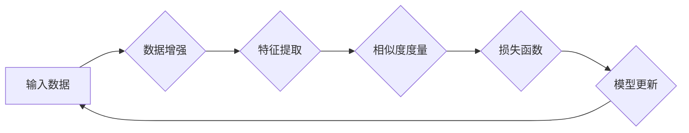

## 对比学习Contrastive Learning原理与代码实例讲解

> 关键词：对比学习、自监督学习、特征提取、相似度度量、迁移学习、Siamese网络、Triplet网络

## 1. 背景介绍

深度学习的蓬勃发展离不开海量标注数据的支持。然而，获取高质量标注数据往往成本高昂且耗时费力。为了解决这一瓶颈，自监督学习 (Self-Supervised Learning) 应运而生。自监督学习通过设计巧妙的预训练任务，利用无标注数据学习有效的特征表示，为下游任务提供强大的基础。

对比学习 (Contrastive Learning) 作为自监督学习的重要分支，通过学习数据点之间的相似性和差异性来进行特征学习。它巧妙地利用了数据本身的结构信息，无需人工标注，就能有效地提取出具有判别力的特征表示。

## 2. 核心概念与联系

对比学习的核心思想是：将相似的样本映射到特征空间的近邻区域，而将不同的样本映射到远离的区域。通过最小化相似样本之间的距离，最大化不同样本之间的距离，模型可以学习到更有效的特征表示。

**Mermaid 流程图:**



**核心概念:**

* **数据增强:** 对输入数据进行随机变换，例如旋转、翻转、裁剪等，生成多个不同的样本表示。
* **特征提取:** 使用神经网络提取数据特征，将数据映射到一个低维特征空间。
* **相似度度量:** 计算样本特征之间的相似度，常用的度量方法包括欧氏距离、余弦相似度等。
* **损失函数:** 用于衡量模型预测的相似度与真实相似度的差距，常见的损失函数包括对比损失 (Contrastive Loss)、triplet损失等。
* **模型更新:** 通过反向传播算法，根据损失函数的梯度更新模型参数，使得模型能够更好地学习数据之间的相似性和差异性。

## 3. 核心算法原理 & 具体操作步骤

### 3.1  算法原理概述

对比学习的核心是通过对比相似和不相似样本的特征表示来学习有效的特征。

**主要步骤:**

1. **数据增强:** 对输入数据进行随机增强，生成多个不同的样本表示。
2. **特征提取:** 使用神经网络提取增强后的样本特征。
3. **相似度度量:** 计算样本特征之间的相似度。
4. **损失函数:** 使用对比损失函数，最小化相似样本之间的距离，最大化不同样本之间的距离。
5. **模型更新:** 通过反向传播算法，根据损失函数的梯度更新模型参数。

### 3.2  算法步骤详解

1. **数据增强:** 对输入数据进行随机增强，例如旋转、翻转、裁剪等，生成多个不同的样本表示。例如，对于一张图像，可以生成多个旋转、翻转、裁剪后的版本。
2. **特征提取:** 使用神经网络提取增强后的样本特征。常用的网络结构包括卷积神经网络 (CNN) 和 Transformer。
3. **相似度度量:** 计算样本特征之间的相似度。常用的度量方法包括欧氏距离、余弦相似度等。
4. **损失函数:** 使用对比损失函数，最小化相似样本之间的距离，最大化不同样本之间的距离。常见的对比损失函数包括:
    * **SimCLR Loss:** 
    * **MoCo Loss:**
    * **NT-Xent Loss:**
5. **模型更新:** 通过反向传播算法，根据损失函数的梯度更新模型参数。

### 3.3  算法优缺点

**优点:**

* **无需人工标注:** 可以利用无标注数据进行预训练，降低数据标注成本。
* **学习到的特征具有判别力:** 通过对比学习，模型可以学习到数据之间的相似性和差异性，从而提取出具有判别力的特征表示。
* **迁移学习能力强:** 预训练好的对比学习模型可以迁移到下游任务中，提升模型性能。

**缺点:**

* **训练过程复杂:** 需要设计巧妙的对比学习任务和损失函数，训练过程相对复杂。
* **参数量大:** 对比学习模型通常参数量较大，需要较大的计算资源进行训练。
* **效果依赖于数据增强策略:** 数据增强策略对对比学习效果有重要影响，需要精心设计。

### 3.4  算法应用领域

对比学习在图像分类、目标检测、语义分割、文本分类等多种领域都有广泛的应用。

* **图像分类:** 使用对比学习预训练的模型可以提升图像分类的准确率。
* **目标检测:** 使用对比学习预训练的模型可以提高目标检测的精度和召回率。
* **语义分割:** 使用对比学习预训练的模型可以提升语义分割的性能。
* **文本分类:** 使用对比学习预训练的模型可以提高文本分类的准确率。

## 4. 数学模型和公式 & 详细讲解 & 举例说明

### 4.1  数学模型构建

对比学习的目标是学习一个映射函数 f，将数据点 x 映射到特征空间 Z 中，使得相似的样本在 Z 中的距离较近，而不同的样本在 Z 中的距离较远。

**数学模型:**

* 输入数据: x ∈ X
* 特征空间: Z
* 映射函数: f(x) ∈ Z
* 相似度度量: d(f(x1), f(x2))

### 4.2  公式推导过程

常用的对比损失函数包括 SimCLR Loss 和 MoCo Loss。

**SimCLR Loss:**

$$
L_{SimCLR} = -\frac{1}{N} \sum_{i=1}^{N} \log \frac{exp(sim(f(x_i), f(x_j)) / \tau)}{exp(sim(f(x_i), f(x_j)) / \tau) + \sum_{k \neq j} exp(sim(f(x_i), f(x_k)) / \tau)}
$$

其中:

* N 是样本数量
* sim(f(x_i), f(x_j)) 是样本 f(x_i) 和 f(x_j) 之间的相似度
* τ 是温度参数

**MoCo Loss:**

$$
L_{MoCo} = \frac{1}{N} \sum_{i=1}^{N} \log \frac{exp(sim(f(x_i), f(x_j)) / \tau)}{exp(sim(f(x_i), f(x_j)) / \tau) + \sum_{k \neq j} exp(sim(f(x_i), f(x_k)) / \tau)}
$$

其中:

* N 是样本数量
* sim(f(x_i), f(x_j)) 是样本 f(x_i) 和 f(x_j) 之间的相似度
* τ 是温度参数

### 4.3  案例分析与讲解

**SimCLR Loss:**

SimCLR Loss 的目标是最大化相似样本之间的相似度，最小化不同样本之间的相似度。

**MoCo Loss:**

MoCo Loss 是一种改进的对比损失函数，它引入了动量更新机制，可以更好地学习数据之间的相似性和差异性。

## 5. 项目实践：代码实例和详细解释说明

### 5.1  开发环境搭建

* Python 3.7+
* PyTorch 1.7+
* CUDA 10.2+

### 5.2  源代码详细实现

```python
import torch
import torch.nn as nn
import torchvision.transforms as transforms

# 定义 Siamese 网络
class SiameseNetwork(nn.Module):
    def __init__(self):
        super(SiameseNetwork, self).__init__()
        #...

    def forward_once(self, x):
        #...

    def forward(self, input1, input2):
        output1 = self.forward_once(input1)
        output2 = self.forward_once(input2)
        return output1, output2

# 定义对比损失函数
def contrastive_loss(output1, output2, margin=1.0):
    #...

# 实例化模型
model = SiameseNetwork()

# 定义优化器
optimizer = torch.optim.Adam(model.parameters(), lr=0.001)

# 定义训练数据
train_dataset =...

# 定义数据加载器
train_loader = torch.utils.data.DataLoader(train_dataset, batch_size=32, shuffle=True)

# 训练模型
for epoch in range(num_epochs):
    for batch_idx, (data1, data2) in enumerate(train_loader):
        #...
        optimizer.zero_grad()
        output1, output2 = model(data1, data2)
        loss = contrastive_loss(output1, output2)
        loss.backward()
        optimizer.step()

```

### 5.3  代码解读与分析

* **Siamese 网络:** Siamese 网络由两个相同的子网络组成，用于提取输入样本的特征。
* **对比损失函数:** 对比损失函数用于衡量模型预测的相似度与真实相似度的差距。
* **训练过程:** 训练过程包括数据加载、模型前向传播、损失函数计算、反向传播和模型参数更新。

### 5.4  运行结果展示

训练完成后，可以将预训练好的模型应用于下游任务中，例如图像分类、目标检测等。

## 6. 实际应用场景

对比学习在许多实际应用场景中取得了成功，例如:

* **图像检索:** 使用对比学习预训练的模型可以学习到图像的语义特征，从而实现高效的图像检索。
* **推荐系统:** 使用对比学习预训练的模型可以学习到用户和物品之间的相似性，从而提高推荐系统的准确率。
* **异常检测:** 使用对比学习预训练的模型可以学习到正常数据的特征分布，从而识别异常数据。

### 6.4  未来应用展望

对比学习作为一种强大的自监督学习方法，未来在以下领域有广阔的应用前景:

* **多模态学习:** 将对比学习应用于多模态数据，例如文本、图像、音频等，学习跨模态的表示。
* **强化学习:** 使用对比学习预训练的模型作为强化学习算法的策略网络，提升强化学习算法的效率。
* **联邦学习:** 将对比学习应用于联邦学习场景，保护用户隐私的同时学习有效的模型。

## 7. 工具和资源推荐

### 7.1  学习资源推荐

* **论文:**
    * SimCLR: A Simple Framework for Contrastive Learning of Visual Representations
    * MoCo: Momentum Contrast for Self-Supervised Visual Representation Learning
    * BYOL: Bootstrap Your Own Latent: A Simple Framework for Self-Supervised Learning
* **博客:**
    * https://blog.openai.com/self-supervised-learning/
    * https://towardsdatascience.com/contrastive-learning-with-pytorch-a-practical-guide-59949110143c

### 7.2  开发工具推荐

* **PyTorch:** https://pytorch.org/
* **TensorFlow:** https://www.tensorflow.org/

### 7.3  相关论文推荐

* **SimCLR:** https://arxiv.org/abs/2002.05709
* **MoCo:** https://arxiv.org/abs/1911.05722
* **BYOL:** https://arxiv.org/abs/2006.07733

## 8. 总结：未来发展趋势与挑战

### 8.1  研究成果总结

对比学习在自监督学习领域取得了显著的进展，成功地利用无标注数据学习有效的特征表示，并取得了优异的性能。

### 8.2