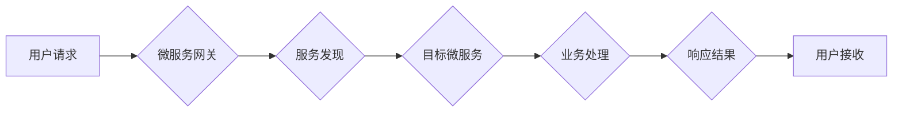

## 微服务在高扩展性中的优势

> 关键词：微服务架构、高扩展性、弹性伸缩、服务发现、分布式系统、云原生

### 1. 背景介绍

随着互联网技术的飞速发展，企业对系统性能、可靠性和可扩展性的需求越来越高。传统的单体架构在面对海量用户和数据时，往往难以满足这些需求。微服务架构应运而生，它将大型应用程序拆分成一系列小型、独立的服务，每个服务专注于特定的业务功能，并通过轻量级的通信协议进行交互。这种架构模式为构建高扩展性系统提供了新的思路和方法。

### 2. 核心概念与联系

#### 2.1 微服务架构

微服务架构是一种将应用程序分解成一系列独立、可部署的服务的软件架构风格。每个微服务都专注于特定的业务功能，并通过轻量级的通信协议（如RESTful API）进行交互。

#### 2.2 高扩展性

高扩展性是指系统能够根据需要动态地增加或减少资源，以满足不断变化的负载需求。

#### 2.3 联系

微服务架构的核心优势之一就是其高扩展性。由于每个微服务都是独立的，可以独立部署和扩展。当某个微服务面临高负载时，可以增加其实例数量，从而提高处理能力。而其他微服务不受影响，可以继续正常运行。

**Mermaid 流程图**



### 3. 核心算法原理 & 具体操作步骤

#### 3.1 算法原理概述

微服务架构中，实现高扩展性的关键算法主要包括：

* **负载均衡算法:** 将请求分配到不同的微服务实例上，以避免单个实例过载。常见的负载均衡算法包括轮询、加权轮询、最小连接数等。
* **服务发现机制:** 微服务之间需要能够动态地发现彼此的位置和状态。常用的服务发现机制包括注册中心、DNS解析等。
* **容错机制:** 当某个微服务实例出现故障时，需要能够自动将请求转发到其他可用实例，以保证系统的高可用性。

#### 3.2 算法步骤详解

**负载均衡算法**

1. 接收用户请求。
2. 根据负载均衡算法，选择一个可用微服务实例。
3. 将请求转发到选中的实例。
4. 收集实例的性能指标，例如响应时间、CPU利用率等。
5. 根据性能指标，动态调整负载均衡策略。

**服务发现机制**

1. 微服务注册到注册中心，注册自己的服务名称、地址和端口等信息。
2. 其他微服务通过注册中心查询目标服务的地址和端口。
3. 当目标服务的地址或端口发生变化时，微服务需要更新注册中心的信息。

**容错机制**

1. 微服务实例之间相互监控，检测彼此的健康状态。
2. 当某个实例出现故障时，其他实例会将其标记为不可用。
3. 负载均衡器会根据容错策略，将请求转发到其他可用实例。

#### 3.3 算法优缺点

**负载均衡算法**

* **优点:** 提高系统吞吐量，均衡资源利用率。
* **缺点:** 算法选择对性能影响较大，需要根据实际情况进行调整。

**服务发现机制**

* **优点:** 实现微服务之间的动态发现，提高系统灵活性。
* **缺点:** 需要额外的服务发现组件，增加系统复杂度。

**容错机制**

* **优点:** 提高系统可靠性，保证服务可用性。
* **缺点:** 需要复杂的监控和故障转移机制，增加系统维护成本。

#### 3.4 算法应用领域

* **电商平台:** 处理海量商品信息和用户订单。
* **社交网络:** 提供实时消息推送和用户互动功能。
* **金融系统:** 处理敏感的金融交易和数据。

### 4. 数学模型和公式 & 详细讲解 & 举例说明

#### 4.1 数学模型构建

假设一个微服务系统由 $n$ 个微服务实例组成，每个实例的处理能力为 $p$。系统接收的请求流量为 $q$。

* $n$: 微服务实例数量
* $p$: 单个实例处理能力
* $q$: 请求流量

系统处理能力 $C$ 可以表示为：

$$C = n \times p$$

#### 4.2 公式推导过程

系统吞吐量 $T$ 可以表示为：

$$T = \frac{q}{C}$$

将 $C$ 代入公式，得到：

$$T = \frac{q}{n \times p}$$

#### 4.3 案例分析与讲解

假设一个微服务系统由 10 个微服务实例组成，每个实例的处理能力为 1000 请求/秒，系统接收的请求流量为 10000 请求/秒。

根据公式，系统吞吐量为：

$$T = \frac{10000}{10 \times 1000} = 1 \text{ 秒}$$

这意味着系统每秒可以处理 10000 个请求。

### 5. 项目实践：代码实例和详细解释说明

#### 5.1 开发环境搭建

* JDK 11+
* Maven 3.6+
* Docker 20.10+
* Kubernetes 1.22+

#### 5.2 源代码详细实现

```java
// 微服务A
public class ServiceA {

    public String processRequest(String request) {
        // 业务逻辑处理
        return "Service A processed request: " + request;
    }
}

// 微服务B
public class ServiceB {

    public String processRequest(String request) {
        // 业务逻辑处理
        return "Service B processed request: " + request;
    }
}
```

#### 5.3 代码解读与分析

* 代码示例展示了两个简单的微服务，ServiceA 和 ServiceB。
* 每个微服务都包含一个 `processRequest` 方法，用于处理用户请求。
* 业务逻辑处理部分可以根据实际需求进行修改。

#### 5.4 运行结果展示

* 使用 Docker 和 Kubernetes 部署微服务。
* 通过微服务网关发送请求到微服务。
* 观察微服务响应结果。

### 6. 实际应用场景

#### 6.1 电商平台

* 商品推荐服务
* 订单处理服务
* 支付服务

#### 6.2 社交网络

* 消息推送服务
* 用户关系服务
* 内容推荐服务

#### 6.3 金融系统

* 交易处理服务
* 风险控制服务
* 数据分析服务

#### 6.4 未来应用展望

* 随着云计算和容器技术的不断发展，微服务架构将更加普及。
* 微服务将与人工智能、大数据等新技术深度融合，构建更加智能、高效的应用系统。

### 7. 工具和资源推荐

#### 7.1 学习资源推荐

* 微服务架构：https://microservices.io/
* Spring Cloud：https://spring.io/projects/spring-cloud
* Kubernetes：https://kubernetes.io/

#### 7.2 开发工具推荐

* Docker：https://www.docker.com/
* Kubernetes：https://kubernetes.io/
* Spring Boot：https://spring.io/projects/spring-boot

#### 7.3 相关论文推荐

* Martin Fowler. Microservices. 2014.
* Sam Newman. Building Microservices. 2015.

### 8. 总结：未来发展趋势与挑战

#### 8.1 研究成果总结

微服务架构为构建高扩展性系统提供了新的思路和方法。通过将应用程序分解成独立的服务，可以实现弹性伸缩、高可用性和易于维护等优势。

#### 8.2 未来发展趋势

* 微服务架构将更加成熟和完善，提供更加丰富的工具和技术支持。
* 微服务与云原生技术将深度融合，构建更加灵活、高效的云原生应用系统。
* 微服务将与人工智能、大数据等新技术深度融合，构建更加智能、高效的应用系统。

#### 8.3 面临的挑战

* 微服务架构的复杂性，需要更高的开发和运维能力。
* 微服务之间的通信和协调，需要更加完善的机制和工具。
* 微服务架构的安全性和可靠性，需要更加重视和关注。

#### 8.4 研究展望

* 研究更加高效、可靠的微服务通信和协调机制。
* 研究微服务架构的安全性和可靠性保障方法。
* 研究微服务与人工智能、大数据等新技术的融合应用。

### 9. 附录：常见问题与解答

* **Q1: 微服务架构与单体架构相比，有哪些优势？**

* **A1:** 微服务架构相比单体架构，具有以下优势：
    * **高扩展性:** 可以根据需要动态地增加或减少资源。
    * **高可用性:** 某个微服务出现故障时，其他微服务不受影响。
    * **易于维护:** 每个微服务都是独立的，可以独立部署和更新。
    * **技术多样性:** 可以使用不同的技术栈构建不同的微服务。

* **Q2: 微服务架构有哪些缺点？**

* **A2:** 微服务架构也存在一些缺点：
    * **复杂性:** 微服务架构比单体架构更加复杂，需要更高的开发和运维能力。
    * **通信成本:** 微服务之间需要进行通信，这会增加通信成本。
    * **数据一致性:** 需要解决微服务之间数据一致性的问题。

* **Q3: 如何选择合适的微服务架构？**

* **A3:** 选择合适的微服务架构需要考虑以下因素：
    * 系统规模和复杂度
    * 性能和可用性要求
    * 开发和运维能力
    * 技术栈


作者：禅与计算机程序设计艺术 / Zen and the Art of Computer Programming 
