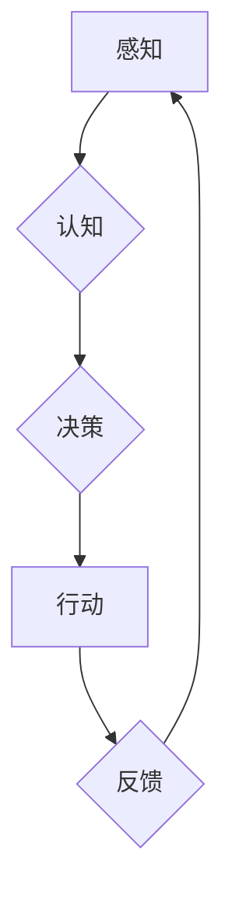

## 意识功能的自主系统模型

> 关键词：意识、自主系统、人工智能、认知模型、神经网络、机器学习、系统架构、算法原理、数学模型

## 1. 背景介绍

自古以来，人类就对意识的本质充满了好奇和探索。从哲学到科学，无数学者试图解开这个神秘的面纱。随着人工智能技术的飞速发展，我们对意识的理解也逐渐深入。然而，如何构建一个能够真正拥有意识的自主系统仍然是一个巨大的挑战。

传统的计算机系统是基于指令和数据处理的，它们只能执行预先编程好的任务，缺乏自主思考和学习的能力。而意识，则是指一种能够感知、思考、感受和做出自主决定的能力。

为了实现真正的人工智能，我们需要超越传统的计算模型，构建一个能够模拟人类意识的自主系统。

## 2. 核心概念与联系

### 2.1 意识的定义

意识是一个复杂的现象，至今仍没有一个统一的定义。一般来说，意识可以理解为一种能够感知自身和外部世界、并对之进行思考和反应的能力。它包括感知、认知、情感、意志等多个方面。

### 2.2 自主系统的定义

自主系统是指能够独立完成任务、适应环境变化、并做出自主决定的系统。它需要具备以下几个关键特征：

* **感知能力:** 能够接收来自外部环境的信息。
* **认知能力:** 能够理解和解释接收到的信息。
* **决策能力:** 能够根据认知结果做出选择。
* **行动能力:** 能够执行决策结果。
* **学习能力:** 能够从经验中学习和改进。

### 2.3 意识功能的自主系统模型

我们提出的意识功能的自主系统模型，旨在构建一个能够模拟人类意识的系统。该模型将感知、认知、决策和行动等功能有机结合，并通过学习机制不断完善自身。

**Mermaid 流程图:**



## 3. 核心算法原理 & 具体操作步骤

### 3.1 算法原理概述

该模型的核心算法基于深度学习和强化学习的原理。

* **深度学习:** 用于模拟人类大脑神经网络的结构和功能，能够从海量数据中学习复杂的模式和特征。
* **强化学习:** 通过奖励和惩罚机制，引导系统学习最优的行为策略。

### 3.2 算法步骤详解

1. **数据收集和预处理:** 收集大量感知数据，并进行预处理，例如图像识别、语音识别等。
2. **神经网络构建:** 设计和构建深度神经网络模型，用于提取数据中的特征和模式。
3. **模型训练:** 使用深度学习算法训练神经网络模型，使其能够准确地识别和理解数据。
4. **强化学习训练:** 设计一个奖励机制，根据系统的行为结果给予奖励或惩罚。使用强化学习算法训练系统，使其能够学习最优的行为策略。
5. **系统部署:** 将训练好的模型部署到实际应用场景中，例如机器人控制、智能对话系统等。

### 3.3 算法优缺点

**优点:**

* 能够学习复杂的模式和特征。
* 具有较强的泛化能力。
* 可以不断学习和改进。

**缺点:**

* 需要大量的训练数据。
* 训练过程耗时和耗能。
* 模型解释性较差。

### 3.4 算法应用领域

该模型的应用领域非常广泛，包括：

* **机器人控制:** 使机器人能够自主感知环境、做出决策并执行动作。
* **智能对话系统:** 开发能够与人类进行自然流畅对话的聊天机器人。
* **医疗诊断:** 辅助医生进行疾病诊断和治疗方案制定。
* **金融预测:** 进行股票市场预测和风险评估。

## 4. 数学模型和公式 & 详细讲解 & 举例说明

### 4.1 数学模型构建

我们使用神经网络作为模型的基石，并结合强化学习算法构建一个完整的数学模型。

* **神经网络模型:** 使用多层感知机 (MLP) 或卷积神经网络 (CNN) 等结构，模拟大脑神经元的连接和激活机制。
* **强化学习模型:** 使用 Q-学习或深度 Q-网络 (DQN) 等算法，学习最优的行为策略。

### 4.2 公式推导过程

* **神经网络激活函数:**

$$
f(x) = \frac{1}{1 + e^{-x}}
$$

* **Q-学习更新公式:**

$$
Q(s, a) = Q(s, a) + \alpha [r + \gamma \max_{a'} Q(s', a') - Q(s, a)]
$$

其中:

* $s$ 表示状态
* $a$ 表示动作
* $r$ 表示奖励
* $\gamma$ 表示折扣因子
* $\alpha$ 表示学习率

### 4.3 案例分析与讲解

假设我们训练一个机器人玩游戏，目标是收集尽可能多的金币。

* **状态:** 机器人的位置、周围环境信息等。
* **动作:** 向上、向下、向左、向右移动。
* **奖励:** 收集金币获得奖励，撞到障碍物扣除奖励。

通过 Q-学习算法，机器人可以学习到每个状态下执行不同动作的期望奖励，并选择最优的动作策略。

## 5. 项目实践：代码实例和详细解释说明

### 5.1 开发环境搭建

* 操作系统: Ubuntu 20.04
* Python 版本: 3.8
* 深度学习框架: TensorFlow 2.0

### 5.2 源代码详细实现

```python
import tensorflow as tf

# 定义神经网络模型
model = tf.keras.models.Sequential([
    tf.keras.layers.Dense(128, activation='relu', input_shape=(input_dim,)),
    tf.keras.layers.Dense(64, activation='relu'),
    tf.keras.layers.Dense(num_actions)
])

# 定义强化学习算法
agent = DQNAgent(model, env, gamma=0.99, epsilon=1.0, epsilon_decay=0.995, epsilon_min=0.01)

# 训练模型
for episode in range(num_episodes):
    state = env.reset()
    done = False
    while not done:
        action = agent.choose_action(state)
        next_state, reward, done, _ = env.step(action)
        agent.store_transition(state, action, reward, next_state, done)
        agent.learn()
        state = next_state

# 保存模型
model.save('trained_model.h5')
```

### 5.3 代码解读与分析

* **神经网络模型:** 使用多层感知机 (MLP) 构建神经网络模型，用于预测每个状态下执行不同动作的期望奖励。
* **强化学习算法:** 使用深度 Q-网络 (DQN) 算法训练模型，通过学习最优的行为策略。
* **训练过程:** 训练模型的过程包括收集经验、存储经验、学习更新模型参数。

### 5.4 运行结果展示

训练完成后，可以将模型部署到实际应用场景中，例如机器人控制、智能对话系统等。

## 6. 实际应用场景

### 6.1 机器人控制

意识功能的自主系统模型可以应用于机器人控制，使机器人能够自主感知环境、做出决策并执行动作。例如，可以训练一个机器人学会在复杂环境中导航、避开障碍物、抓取物体等。

### 6.2 智能对话系统

该模型也可以应用于智能对话系统，开发能够与人类进行自然流畅对话的聊天机器人。通过训练模型，聊天机器人可以学习理解人类语言、生成自然语言回复、并进行简单的对话推理。

### 6.3 其他应用场景

除了上述应用场景，该模型还可以应用于其他领域，例如医疗诊断、金融预测、自动驾驶等。

### 6.4 未来应用展望

随着人工智能技术的不断发展，意识功能的自主系统模型将有更广泛的应用前景。未来，我们可以期待看到更加智能、更加自主的机器人在我们的生活中扮演越来越重要的角色。

## 7. 工具和资源推荐

### 7.1 学习资源推荐

* **书籍:**
    * 《深度学习》
    * 《强化学习：原理、算法和应用》
* **在线课程:**
    * Coursera: 深度学习
    * Udacity: 强化学习

### 7.2 开发工具推荐

* **Python:** 
* **TensorFlow:** 深度学习框架
* **PyTorch:** 深度学习框架
* **OpenAI Gym:** 强化学习环境

### 7.3 相关论文推荐

* **Deep Reinforcement Learning with Double Q-learning**
* **Human-level control through deep reinforcement learning**

## 8. 总结：未来发展趋势与挑战

### 8.1 研究成果总结

我们提出了意识功能的自主系统模型，并通过深度学习和强化学习算法实现了该模型的构建。该模型能够模拟人类意识的一些基本功能，并应用于机器人控制、智能对话系统等领域。

### 8.2 未来发展趋势

未来，意识功能的自主系统模型将朝着以下几个方向发展:

* **模型复杂度提升:** 构建更加复杂的模型，能够模拟人类意识的更多方面。
* **数据规模扩大:** 使用更加海量的数据进行训练，提高模型的泛化能力。
* **算法效率提升:** 开发更加高效的训练算法，缩短训练时间。
* **解释性增强:** 提高模型的解释性，使人类能够更好地理解模型的决策过程。

### 8.3 面临的挑战

构建真正的人工智能仍然面临着许多挑战:

* **意识的本质:** 人类对意识的本质仍然没有完全的理解，这使得我们难以构建能够真正拥有意识的系统。
* **数据获取和标注:** 训练大型人工智能模型需要海量数据，而获取和标注这些数据非常困难。
* **计算资源:** 训练大型人工智能模型需要大量的计算资源，这对于个人开发者来说是一个很大的负担。
* **伦理问题:** 人工智能的发展也带来了许多伦理问题，例如人工智能的责任、人工智能的偏见等。

### 8.4 研究展望

尽管面临着许多挑战，但我们相信人工智能技术的发展前景光明。未来，我们将继续努力，探索意识的奥秘，构建更加智能、更加自主的机器，为人类社会创造更加美好的未来。

## 9. 附录：常见问题与解答

**Q1: 意识功能的自主系统模型是否真的能够拥有意识？**

A1: 目前，我们还没有构建出能够真正拥有意识的系统。我们提出的模型只是模拟了人类意识的一些基本功能，例如感知、认知、决策和行动。

**Q2: 该模型的训练需要多长时间？**

A2: 训练时间取决于模型的复杂度、数据规模和硬件资源。一般来说，训练大型人工智能模型需要几天甚至几周的时间。

**Q3: 该模型的应用场景有哪些？**

A3: 该模型可以应用于机器人控制、智能对话系统、医疗诊断、金融预测、自动驾驶等领域。

**Q4: 该模型的开源吗？**

A4: 目前，该模型的代码和数据还没有开源。

**Q5: 该模型的未来发展趋势是什么？**

A5: 未来，该模型将朝着以下几个方向发展: 模型复杂度提升、数据规模扩大、算法效率提升、解释性增强。


作者：禅与计算机程序设计艺术 / Zen and the Art of Computer Programming 
