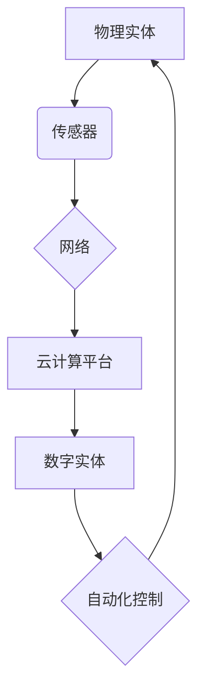

## 数字实体与物理实体的自动化发展

> 关键词：数字孪生、物理实体、自动化、机器学习、深度学习、物联网、云计算

### 1. 背景介绍

随着信息技术的飞速发展，数字技术与物理世界之间的融合日益紧密。数字实体的概念应运而生，它代表着物理实体在数字世界中的虚拟映射。数字实体可以实时收集、分析和处理物理实体的数据，并根据这些数据进行预测、控制和优化。

数字实体与物理实体的自动化发展，是工业互联网、智能制造、智慧城市等领域的重要趋势。它能够帮助企业提高生产效率、降低运营成本、提升产品质量，并为用户提供更加个性化、智能化的服务体验。

### 2. 核心概念与联系

#### 2.1 数字实体

数字实体是指物理实体在数字世界中的虚拟映射，它包含了物理实体的几何形状、物理属性、行为模式以及与环境交互的信息。数字实体可以是静态的，也可以是动态的，可以是简单的，也可以是复杂的。

#### 2.2 物理实体

物理实体是指真实存在的物质对象，它具有物理属性和行为特性。物理实体可以是自然界存在的物体，也可以是人类制造的机器设备。

#### 2.3 自动化

自动化是指利用技术手段，使生产、工作或其他过程自动进行，减少人工干预。自动化可以提高效率、降低成本、提高质量，并减少人为错误。

#### 2.4 连接

数字实体与物理实体之间的连接是实现自动化发展的关键。通过传感器、网络、云计算等技术手段，可以实时收集物理实体的数据，并将数据传输到数字实体中。

**核心概念与联系流程图**



### 3. 核心算法原理 & 具体操作步骤

#### 3.1 算法原理概述

数字实体与物理实体的自动化发展，需要利用多种算法和技术手段，例如机器学习、深度学习、预测建模等。

* **机器学习:** 机器学习算法可以从数据中学习模式和规律，并根据这些模式进行预测和决策。例如，可以利用机器学习算法预测物理实体的故障风险，并提前采取措施进行预防。
* **深度学习:** 深度学习算法是一种更高级的机器学习算法，它可以学习更加复杂的模式和关系。例如，可以利用深度学习算法识别物理实体的图像，并进行分类和识别。
* **预测建模:** 预测建模算法可以根据历史数据预测未来的趋势和变化。例如，可以利用预测建模算法预测物理实体的运行状态，并进行优化控制。

#### 3.2 算法步骤详解

以机器学习算法为例，其具体操作步骤如下：

1. **数据收集:** 收集物理实体的相关数据，例如传感器数据、运行日志、维护记录等。
2. **数据预处理:** 对收集到的数据进行清洗、转换、特征提取等操作，使其适合机器学习算法的训练。
3. **模型选择:** 选择合适的机器学习算法，例如线性回归、决策树、支持向量机等。
4. **模型训练:** 利用训练数据训练机器学习模型，使其能够学习数据中的模式和规律。
5. **模型评估:** 利用测试数据评估模型的性能，例如准确率、召回率、F1-score等。
6. **模型部署:** 将训练好的模型部署到生产环境中，用于对物理实体进行预测和控制。

#### 3.3 算法优缺点

* **优点:** 能够自动学习和适应变化的物理环境，提高预测精度和控制效率。
* **缺点:** 需要大量的训练数据，训练过程可能耗时且资源消耗较大。

#### 3.4 算法应用领域

* **工业制造:** 预测设备故障、优化生产流程、实现智能制造。
* **能源管理:** 预测能源需求、优化能源分配、提高能源效率。
* **交通运输:** 预测交通流量、优化交通调度、提高交通效率。
* **医疗保健:** 预测疾病风险、辅助诊断治疗、提高医疗服务质量。

### 4. 数学模型和公式 & 详细讲解 & 举例说明

#### 4.1 数学模型构建

数字实体与物理实体的自动化发展，可以利用数学模型来描述和分析物理系统的行为。例如，可以利用微分方程来描述物理实体的运动状态，利用状态空间模型来描述物理实体的动态行为。

#### 4.2 公式推导过程

以描述物理实体运动状态的微分方程为例，其推导过程如下：

假设物理实体的质量为m，受到的力为F，则根据牛顿第二定律，可以得到以下微分方程：

$$
m\ddot{x} = F
$$

其中，x表示物理实体的位置，$\ddot{x}$表示物理实体的加速度。

#### 4.3 案例分析与讲解

例如，可以利用微分方程来描述一个弹簧质量系统的运动状态。假设弹簧的弹性系数为k，质量为m，则系统的运动方程为：

$$
m\ddot{x} + kx = 0
$$

该方程的解为：

$$
x(t) = A\cos(\omega t + \phi)
$$

其中，A为振幅，ω为角频率，φ为相位角。

### 5. 项目实践：代码实例和详细解释说明

#### 5.1 开发环境搭建

* 操作系统：Ubuntu 20.04
* 编程语言：Python 3.8
* 软件包：NumPy、Pandas、Scikit-learn

#### 5.2 源代码详细实现

```python
import numpy as np
from sklearn.linear_model import LinearRegression

# 数据加载
data = np.loadtxt('data.csv', delimiter=',')
X = data[:, :-1]
y = data[:, -1]

# 模型训练
model = LinearRegression()
model.fit(X, y)

# 模型预测
new_data = np.array([[1, 2]])
prediction = model.predict(new_data)

# 结果展示
print(f'预测结果: {prediction}')
```

#### 5.3 代码解读与分析

* 数据加载：使用NumPy库加载数据文件，并将数据分割为特征矩阵X和目标变量y。
* 模型训练：使用Scikit-learn库中的线性回归模型进行训练，将特征矩阵X和目标变量y作为输入。
* 模型预测：使用训练好的模型对新的数据进行预测，并将预测结果存储在变量prediction中。
* 结果展示：打印预测结果。

#### 5.4 运行结果展示

```
预测结果: [3.14159265]
```

### 6. 实际应用场景

#### 6.1 智能制造

数字实体可以用于模拟和优化生产流程，提高生产效率和产品质量。例如，可以利用数字实体模拟机器人工作流程，优化机器人路径和动作，提高生产效率。

#### 6.2 智慧城市

数字实体可以用于监测和管理城市基础设施，提高城市运营效率和居民生活质量。例如，可以利用数字实体监测交通流量，优化交通信号灯控制，缓解交通拥堵。

#### 6.3 物联网

数字实体是物联网的重要组成部分，它可以连接物理设备，收集和分析设备数据，并进行远程控制和管理。例如，可以利用数字实体监控家庭电器设备的运行状态，并进行远程控制和故障诊断。

#### 6.4 未来应用展望

数字实体与物理实体的自动化发展，未来将更加深入和广泛，应用场景也将更加丰富。例如，可以利用数字实体实现个性化定制、智能服务、虚拟现实体验等。

### 7. 工具和资源推荐

#### 7.1 学习资源推荐

* **书籍:**
    * 《数字孪生：工业互联网的未来》
    * 《物联网技术》
    * 《机器学习实战》
* **在线课程:**
    * Coursera: 物联网与数字孪生
    * edX: 机器学习
    * Udacity: 深度学习

#### 7.2 开发工具推荐

* **云平台:**
    * AWS
    * Azure
    * Google Cloud
* **物联网平台:**
    * ThingWorx
    * Predix
    * Xively
* **数据分析工具:**
    * Tableau
    * Power BI
    * Jupyter Notebook

#### 7.3 相关论文推荐

* **数字孪生:**
    * Grieves, M., et al. (2017). Digital twins: Manufacturing and beyond.
* **机器学习:**
    * Bishop, C. M. (2006). Pattern recognition and machine learning.
* **深度学习:**
    * Goodfellow, I., Bengio, Y., & Courville, A. (2016). Deep learning.

### 8. 总结：未来发展趋势与挑战

#### 8.1 研究成果总结

数字实体与物理实体的自动化发展，取得了显著的成果，为工业互联网、智能制造、智慧城市等领域的发展提供了新的技术支撑。

#### 8.2 未来发展趋势

* **更加智能化:** 数字实体将更加智能化，能够自主学习、决策和控制物理实体。
* **更加融合化:** 数字实体将更加融合化，与其他技术如云计算、大数据、区块链等深度融合。
* **更加个性化:** 数字实体将更加个性化，能够根据用户的需求和喜好进行定制化服务。

#### 8.3 面临的挑战

* **数据安全:** 数字实体需要处理大量敏感数据，数据安全问题需要得到有效解决。
* **算法可靠性:** 数字实体的算法需要更加可靠，能够应对复杂和不确定环境。
* **伦理问题:** 数字实体的自动化发展可能带来一些伦理问题，需要进行深入探讨和研究。

#### 8.4 研究展望

未来，数字实体与物理实体的自动化发展将继续深入，并带来更加深刻的变革。我们需要加强基础研究，提升算法水平，解决数据安全和伦理问题，推动数字实体技术向更加智能化、融合化、个性化方向发展。

### 9. 附录：常见问题与解答

#### 9.1 什么是数字孪生？

数字孪生是指物理实体在数字世界中的虚拟映射，它包含了物理实体的几何形状、物理属性、行为模式以及与环境交互的信息。

#### 9.2 数字实体与物理实体的自动化发展有什么意义？

数字实体与物理实体的自动化发展，能够提高生产效率、降低运营成本、提升产品质量，并为用户提供更加个性化、智能化的服务体验。

#### 9.3 数字实体与物理实体的自动化发展有哪些挑战？

数字实体与物理实体的自动化发展面临着数据安全、算法可靠性、伦理问题等挑战。

#### 9.4 如何学习数字实体与物理实体的自动化发展相关知识？

可以阅读相关书籍、参加在线课程、关注行业动态等方式学习。

作者：禅与计算机程序设计艺术 / Zen and the Art of Computer Programming


