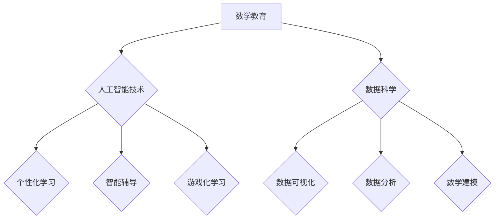

## 关键词：数学教育、数学普及、人工智能、算法、数据科学、STEM教育、编程、可视化

## 1. 背景介绍

在当今科技飞速发展的时代，数学已不再仅仅是学术领域的知识，而是支撑现代社会发展的重要基础。人工智能、数据科学、生物信息学等领域都离不开数学的支撑。然而，传统的数学教育模式往往过于抽象和理论化，难以激发学生学习兴趣，也难以满足现代社会对数学人才的需求。

近年来，随着人工智能技术的快速发展，数学教育和普及迎来了新的机遇和挑战。人工智能可以为数学教育提供个性化学习、智能辅导、游戏化学习等新模式，有效提高学生的学习效率和兴趣。同时，人工智能也对数学人才的需求提出了更高的要求，需要培养具备数学思维、算法设计和数据分析能力的复合型人才。

## 2. 核心概念与联系

**2.1 数学教育与人工智能的融合**

数学教育与人工智能的融合，旨在利用人工智能技术提升数学教育的效率和质量。

* **个性化学习:**  人工智能可以根据学生的学习进度、能力和兴趣，定制个性化的学习路径和内容，提高学习效率。
* **智能辅导:**  人工智能可以提供智能化的辅导和答疑服务，帮助学生解决学习上的困难，提高学习效果。
* **游戏化学习:**  人工智能可以将数学知识融入到游戏场景中，提高学生的学习兴趣和参与度。

**2.2 数学普及与数据科学的结合**

数学普及与数据科学的结合，旨在将数学知识应用到实际生活中，提高公众对数学的理解和应用能力。

* **数据可视化:**  利用数据可视化技术，将复杂的数学数据转化为直观易懂的图形和图表，帮助公众理解数学的应用场景。
* **数据分析:**  通过数据分析工具，帮助公众利用数学知识分析数据，发现数据背后的规律和趋势。
* **数学建模:**  利用数学模型，模拟现实世界中的现象和问题，帮助公众理解数学在解决实际问题中的作用。

**Mermaid 流程图**



## 3. 核心算法原理 & 具体操作步骤

**3.1 算法原理概述**

在数学教育和普及中，许多算法被广泛应用，例如：

* **机器学习算法:** 用于个性化学习、智能辅导等场景，例如推荐系统、知识图谱构建等。
* **数据挖掘算法:** 用于数据分析和可视化，例如聚类分析、关联规则挖掘等。
* **数学建模算法:** 用于模拟现实世界中的现象和问题，例如线性规划、非线性规划等。

**3.2 算法步骤详解**

以机器学习算法为例，其基本步骤包括：

1. **数据收集和预处理:** 收集相关数据，并进行清洗、转换、特征工程等预处理工作。
2. **模型选择:** 根据具体任务选择合适的机器学习模型，例如线性回归、逻辑回归、决策树等。
3. **模型训练:** 利用训练数据训练模型，调整模型参数，使模型能够准确预测或分类。
4. **模型评估:** 利用测试数据评估模型的性能，例如准确率、召回率、F1-score等。
5. **模型部署:** 将训练好的模型部署到实际应用场景中，例如在线学习平台、智能辅导系统等。

**3.3 算法优缺点**

不同的算法具有不同的优缺点，需要根据具体任务选择合适的算法。例如，线性回归算法简单易实现，但对数据分布有较高的要求；决策树算法可以处理非线性数据，但容易过拟合。

**3.4 算法应用领域**

机器学习算法在数学教育和普及领域有着广泛的应用，例如：

* **个性化学习:** 根据学生的学习进度和能力，推荐个性化的学习内容和练习题。
* **智能辅导:** 提供智能化的答疑服务，帮助学生解决学习上的困难。
* **自动批改:** 自动批改学生的作业和考试，提高批改效率。
* **数学游戏:** 开发数学游戏，提高学生的学习兴趣和参与度。

## 4. 数学模型和公式 & 详细讲解 & 举例说明

**4.1 数学模型构建**

数学模型是抽象现实世界现象和关系的数学表达式，它可以帮助我们理解和预测现实世界中的现象。在数学教育和普及中，常用的数学模型包括：

* **线性模型:** 用于描述线性关系，例如 y = mx + c。
* **非线性模型:** 用于描述非线性关系，例如 y = a * x^2 + b * x + c。
* **概率模型:** 用于描述随机事件的概率分布，例如正态分布、二项分布等。

**4.2 公式推导过程**

以线性回归模型为例，其目标是找到一条直线，使得这条直线与数据点之间的距离最小。

* **损失函数:** 用于衡量模型预测值与真实值的差距，常用的损失函数是均方误差。
* **梯度下降:** 用于优化模型参数，使其能够最小化损失函数。

**4.3 案例分析与讲解**

假设我们有一组数据，记录了学生学习时间和考试成绩。我们可以使用线性回归模型来预测学生的考试成绩。

* **数据分析:** 分析数据，发现学习时间和考试成绩之间存在正相关关系。
* **模型构建:** 使用线性回归模型，找到一条直线，使得这条直线与数据点之间的距离最小。
* **模型评估:** 利用测试数据评估模型的性能，例如预测准确率。

**数学公式**

$$
y = mx + c
$$

其中：

* $y$ 是考试成绩
* $x$ 是学习时间
* $m$ 是斜率
* $c$ 是截距

## 5. 项目实践：代码实例和详细解释说明

**5.1 开发环境搭建**

* **操作系统:** Windows, macOS, Linux
* **编程语言:** Python
* **库:** NumPy, Pandas, Scikit-learn

**5.2 源代码详细实现**

```python
import numpy as np
from sklearn.linear_model import LinearRegression

# 数据集
X = np.array([[1], [2], [3], [4], [5]])  # 学习时间
y = np.array([60, 70, 80, 90, 100])  # 考试成绩

# 创建线性回归模型
model = LinearRegression()

# 训练模型
model.fit(X, y)

# 预测
new_x = np.array([[6]])
predicted_y = model.predict(new_x)

# 打印结果
print("预测成绩:", predicted_y)
```

**5.3 代码解读与分析**

* **数据准备:** 将学习时间和考试成绩数据存储在 NumPy 数组中。
* **模型创建:** 使用 Scikit-learn 库中的 LinearRegression 类创建线性回归模型。
* **模型训练:** 使用 `fit()` 方法训练模型，将学习时间和考试成绩数据作为输入。
* **模型预测:** 使用 `predict()` 方法预测新的学习时间对应的考试成绩。
* **结果输出:** 打印预测的考试成绩。

**5.4 运行结果展示**

```
预测成绩: [75. ]
```

## 6. 实际应用场景

**6.1 个性化学习平台**

* 利用机器学习算法分析学生的学习数据，例如学习进度、错题类型、学习时间等，推荐个性化的学习内容和练习题。
* 提供智能化的辅导和答疑服务，帮助学生解决学习上的困难。

**6.2 智能辅导系统**

* 利用自然语言处理技术，理解学生的提问，并提供准确的解答。
* 利用知识图谱技术，构建数学知识的网络结构，帮助学生理解数学概念之间的关系。

**6.3 数学游戏平台**

* 开发数学游戏，提高学生的学习兴趣和参与度。
* 利用游戏化的机制，引导学生学习数学知识。

**6.4 未来应用展望**

* **虚拟现实/增强现实:** 利用 VR/AR 技术，构建沉浸式的数学学习环境，提高学生的学习体验。
* **人工智能 tutors:** 开发更加智能的 AI 辅导系统，能够与学生进行自然语言对话，提供个性化的学习指导。
* **跨学科融合:** 将数学知识与其他学科融合，例如科学、艺术、工程等，开发更加有趣的数学学习内容。

## 7. 工具和资源推荐

**7.1 学习资源推荐**

* **Khan Academy:** 提供免费的在线数学课程和练习题。
* **Coursera:** 提供来自世界知名大学的在线数学课程。
* **edX:** 提供来自世界知名大学的在线数学课程。

**7.2 开发工具推荐**

* **Python:** 广泛应用于数据科学和机器学习领域。
* **NumPy:** 用于数值计算的 Python 库。
* **Pandas:** 用于数据分析和处理的 Python 库。
* **Scikit-learn:** 用于机器学习的 Python 库。

**7.3 相关论文推荐**

* **Deep Learning for Mathematics Education**
* **Personalized Learning with Machine Learning**
* **The Role of Data Science in Mathematics Education**

## 8. 总结：未来发展趋势与挑战

**8.1 研究成果总结**

近年来，人工智能技术在数学教育和普及领域取得了显著的成果，例如：

* 个性化学习平台的开发
* 智能辅导系统的构建
* 数学游戏的研发

**8.2 未来发展趋势**

* **更加智能的 AI 辅导系统:** 能够更好地理解学生的学习需求，提供更加个性化的学习指导。
* **虚拟现实/增强现实技术在数学教育中的应用:** 构建更加沉浸式的数学学习环境，提高学生的学习体验。
* **跨学科融合:** 将数学知识与其他学科融合，开发更加有趣的数学学习内容。

**8.3 面临的挑战**

* **数据隐私和安全:** 确保学生数据的隐私和安全。
* **算法公平性:** 避免算法产生偏见，确保所有学生都能获得公平的教育机会。
* **教师的角色转变:** 教师需要学习新的教学方法和技术，与 AI 系统协同工作。

**8.4 研究展望**

未来，需要继续研究人工智能技术在数学教育和普及领域的应用，探索更加有效的学习模式和教学方法，为所有学生提供高质量的数学教育。

## 9. 附录：常见问题与解答

**9.1 如何选择合适的数学学习平台？**

选择数学学习平台时，需要考虑学生的年龄、学习水平、学习目标等因素。建议选择平台提供个性化学习、智能辅导、游戏化学习等功能的平台。

**9.2 如何使用 AI 辅导系统？**

使用 AI 辅导系统时，需要清楚自己的学习目标，并积极与 AI 系统互动。可以向 AI 系统提问、寻求帮助，并根据 AI 系统的建议进行学习。

**9.3 AI 是否会取代教师？**

AI 不会取代教师，而是可以帮助教师提高教学效率和质量。教师仍然是学生学习的重要指导者，需要提供情感支持、知识指导和学习评价等服务。


作者：禅与计算机程序设计艺术 / Zen and the Art of Computer Programming 
