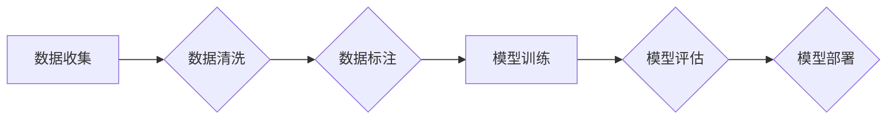

## 数据可用性与基础模型的发展

> 关键词：基础模型、数据可用性、模型训练、数据质量、数据标注、迁移学习、泛化能力、伦理问题

### 1. 背景介绍

近年来，深度学习在各个领域取得了突破性的进展，这得益于海量数据的积累和强大的计算能力。基础模型作为深度学习领域的新兴研究方向，以其强大的泛化能力和可迁移性，展现出巨大的潜力。基础模型通常是指在大量数据上预训练的强大模型，能够在各种下游任务中表现出色，例如自然语言处理、计算机视觉、语音识别等。

然而，基础模型的发展也面临着一些挑战，其中数据可用性是最为关键的因素之一。数据可用性是指数据能够被模型有效利用的程度，包括数据量、数据质量、数据标注等方面。数据不足、数据噪声、数据偏见等问题都会严重影响基础模型的训练效果和泛化能力。

### 2. 核心概念与联系

**2.1 数据可用性**

数据可用性是指数据能够被模型有效利用的程度，它是一个多维概念，包括以下几个方面：

* **数据量:** 模型训练需要大量的样本数据，数据量越大，模型的训练效果通常越好。
* **数据质量:** 数据的准确性、完整性、一致性等都会影响模型的训练效果。
* **数据标注:** 许多机器学习任务需要数据标注，例如图像分类、文本情感分析等。数据标注的质量直接影响模型的训练效果。
* **数据访问权限:** 模型训练需要对数据进行访问和使用，数据访问权限的限制也会影响模型的训练效果。

**2.2 基础模型**

基础模型是指在大量数据上预训练的强大模型，能够在各种下游任务中表现出色。基础模型的特点包括：

* **强大的泛化能力:** 基础模型能够在未见过的任务和数据上表现良好。
* **可迁移性:** 基础模型可以迁移到不同的下游任务，无需从头开始训练。
* **参数量大:** 基础模型通常拥有大量的参数，这使得它们能够学习更复杂的模式。

**2.3 数据可用性和基础模型的关系**

数据可用性是基础模型训练和应用的关键因素。

* **数据量:** 基础模型的训练需要大量的样本数据，数据量不足会导致模型的训练效果下降。
* **数据质量:** 数据的质量直接影响模型的训练效果。数据噪声、数据偏见等问题都会导致模型的泛化能力下降。
* **数据标注:** 数据标注的质量直接影响模型的训练效果。

**2.4 Mermaid 流程图**



### 3. 核心算法原理 & 具体操作步骤

**3.1 算法原理概述**

基础模型的训练通常采用自监督学习或半监督学习的方法。

* **自监督学习:** 在没有人工标注数据的情况下，通过设计特殊的预训练任务，让模型学习数据中的潜在结构和规律。例如，语言模型可以通过预测下一个词来学习语言的语法和语义。
* **半监督学习:** 利用少量人工标注数据和大量未标注数据进行训练。

**3.2 算法步骤详解**

1. **数据预处理:** 收集数据并进行清洗、格式化等预处理操作。
2. **模型选择:** 选择合适的模型架构，例如 Transformer、BERT 等。
3. **预训练:** 在大量数据上进行预训练，学习数据中的潜在结构和规律。
4. **下游任务 fine-tuning:** 将预训练好的模型用于特定下游任务，通过微调模型参数来提高任务性能。

**3.3 算法优缺点**

* **优点:** 
    * 强大的泛化能力
    * 可迁移性
    * 训练效率高
* **缺点:** 
    * 需要大量的训练数据
    * 训练成本高
    * 容易受到数据偏差的影响

**3.4 算法应用领域**

基础模型在各个领域都有广泛的应用，例如：

* **自然语言处理:** 文本分类、情感分析、机器翻译、问答系统等。
* **计算机视觉:** 图像分类、目标检测、图像生成等。
* **语音识别:** 语音转文本、语音合成等。

### 4. 数学模型和公式 & 详细讲解 & 举例说明

**4.1 数学模型构建**

基础模型的训练通常基于深度神经网络，其数学模型可以表示为：

$$
y = f(W x + b)
$$

其中：

* $y$ 是模型的输出
* $x$ 是输入数据
* $W$ 是模型的参数矩阵
* $b$ 是模型的偏置向量
* $f$ 是激活函数

**4.2 公式推导过程**

模型训练的目标是找到最优的参数 $W$ 和 $b$，使得模型的输出与真实值之间的误差最小。常用的优化算法包括梯度下降法、Adam 算法等。

梯度下降法的核心思想是通过不断调整参数 $W$ 和 $b$，使得模型的损失函数不断减小。

**4.3 案例分析与讲解**

例如，在训练一个图像分类模型时，损失函数可以定义为交叉熵损失函数：

$$
L = -\sum_{i=1}^{N} y_i \log(\hat{y}_i)
$$

其中：

* $N$ 是样本数量
* $y_i$ 是真实标签
* $\hat{y}_i$ 是模型预测的概率

通过梯度下降法，不断更新参数 $W$ 和 $b$，使得损失函数 $L$ 最小化。

### 5. 项目实践：代码实例和详细解释说明

**5.1 开发环境搭建**

* Python 3.x
* TensorFlow 或 PyTorch
* CUDA 和 cuDNN (可选，用于 GPU 加速)

**5.2 源代码详细实现**

```python
import tensorflow as tf

# 定义模型架构
model = tf.keras.models.Sequential([
    tf.keras.layers.Conv2D(32, (3, 3), activation='relu', input_shape=(28, 28, 1)),
    tf.keras.layers.MaxPooling2D((2, 2)),
    tf.keras.layers.Conv2D(64, (3, 3), activation='relu'),
    tf.keras.layers.MaxPooling2D((2, 2)),
    tf.keras.layers.Flatten(),
    tf.keras.layers.Dense(10, activation='softmax')
])

# 定义损失函数和优化器
model.compile(loss='sparse_categorical_crossentropy',
              optimizer='adam',
              metrics=['accuracy'])

# 加载 MNIST 数据集
(x_train, y_train), (x_test, y_test) = tf.keras.datasets.mnist.load_data()

# 数据预处理
x_train = x_train.astype('float32') / 255.0
x_test = x_test.astype('float32') / 255.0
x_train = x_train.reshape((x_train.shape[0], 28, 28, 1))
x_test = x_test.reshape((x_test.shape[0], 28, 28, 1))

# 模型训练
model.fit(x_train, y_train, epochs=5)

# 模型评估
loss, accuracy = model.evaluate(x_test, y_test)
print('Test loss:', loss)
print('Test accuracy:', accuracy)
```

**5.3 代码解读与分析**

* 代码首先定义了模型架构，使用 TensorFlow 的 Keras API。
* 然后定义了损失函数和优化器，用于训练模型。
* 加载 MNIST 数据集，并进行数据预处理。
* 最后使用 `model.fit()` 方法训练模型，并使用 `model.evaluate()` 方法评估模型性能。

**5.4 运行结果展示**

训练完成后，模型的测试准确率通常可以达到 98% 以上。

### 6. 实际应用场景

基础模型在各个领域都有广泛的应用，例如：

* **自然语言处理:** 基于 BERT 的模型在文本分类、情感分析、机器翻译等任务中取得了优异的性能。
* **计算机视觉:** 基于 Vision Transformer 的模型在图像分类、目标检测、图像生成等任务中展现出强大的能力。
* **语音识别:** 基于 Wav2Vec 2.0 的模型在语音识别任务中取得了新的突破。

**6.4 未来应用展望**

随着数据量的不断增长和计算能力的提升，基础模型的应用场景将会更加广泛，例如：

* **个性化推荐:** 基于用户行为数据训练的个性化推荐模型。
* **医疗诊断:** 基于医学图像和病历数据的医疗诊断模型。
* **自动驾驶:** 基于传感器数据训练的自动驾驶模型。

### 7. 工具和资源推荐

**7.1 学习资源推荐**

* **书籍:**
    * Deep Learning by Ian Goodfellow, Yoshua Bengio, and Aaron Courville
    * Hands-On Machine Learning with Scikit-Learn, Keras & TensorFlow by Aurélien Géron
* **在线课程:**
    * Stanford CS231n: Convolutional Neural Networks for Visual Recognition
    * Deep Learning Specialization by Andrew Ng

**7.2 开发工具推荐**

* **TensorFlow:** https://www.tensorflow.org/
* **PyTorch:** https://pytorch.org/
* **Hugging Face Transformers:** https://huggingface.co/transformers/

**7.3 相关论文推荐**

* BERT: Pre-training of Deep Bidirectional Transformers for Language Understanding
* GPT-3: Language Models are Few-Shot Learners
* Vision Transformer: An Image Transformer

### 8. 总结：未来发展趋势与挑战

**8.1 研究成果总结**

基础模型的发展取得了显著的成果，在各个领域都展现出强大的应用潜力。

**8.2 未来发展趋势**

* **模型规模的进一步扩大:** 随着计算能力的提升，基础模型的规模将会进一步扩大，学习更复杂的模式。
* **多模态学习:** 基于多种数据类型（例如文本、图像、音频）训练的多模态基础模型将会更加普遍。
* **可解释性:** 研究基础模型的决策过程，提高模型的可解释性。

**8.3 面临的挑战**

* **数据可用性:** 数据的质量、量和偏见都会影响基础模型的训练效果。
* **计算资源:** 训练大型基础模型需要大量的计算资源。
* **伦理问题:** 基础模型的应用可能会带来一些伦理问题，例如数据隐私、算法偏见等。

**8.4 研究展望**

未来研究将集中在解决上述挑战，开发更加高效、可解释、安全可靠的基础模型，并将其应用于更多领域，推动人工智能技术的发展。

### 9. 附录：常见问题与解答

* **Q1: 基础模型和传统机器学习模型有什么区别？**

* **A1:** 基础模型通常在大量数据上进行预训练，具有强大的泛化能力和可迁移性，而传统机器学习模型通常需要针对特定任务进行训练。

* **Q2: 如何评估基础模型的性能？**

* **A2:** 基于任务的评估指标，例如准确率、F1 分数、BLEU 分数等。

* **Q3: 如何训练一个基础模型？**

* **A3:** 需要大量的计算资源和数据，可以使用开源的预训练模型进行微调。


作者：禅与计算机程序设计艺术 / Zen and the Art of Computer Programming 
